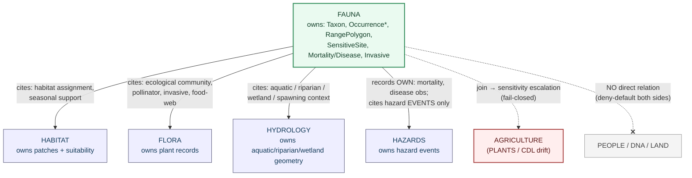

<!-- [KFM_META_BLOCK_V2]
doc_id: kfm://doc/fauna/cross-lane-relations
title: Fauna — Cross-Lane Relations
type: standard
version: v1
status: draft
owners: <fauna-domain-steward> (PLACEHOLDER — assign before review)
created: 2026-05-29
updated: 2026-05-29
policy_label: public
related:
  - ai-build-operating-contract.md                         # CONTRACT_VERSION = "3.0.0"
  - docs/doctrine/directory-rules.md                       # CONFIRMED — viewed this session
  - docs/domains/fauna/README.md                           # PROPOSED — verify
  - docs/domains/fauna/CANONICAL_PATHS.md                  # PROPOSED — companion placement register
  - docs/domains/fauna/CONTINUITY_INVENTORY.md             # PROPOSED — companion lineage inventory
  - docs/domains/habitat/README.md                         # PROPOSED — owning lane (habitat)
  - docs/domains/flora/README.md                           # PROPOSED — owning lane (flora)
  - docs/domains/hydrology/README.md                       # PROPOSED — owning lane (hydrology)
  - docs/domains/hazards/README.md                         # PROPOSED — owning lane (hazards)
  - docs/registers/VERIFICATION_BACKLOG.md                 # PROPOSED — verify
  - docs/registers/DRIFT_REGISTER.md                       # PROPOSED — verify
tags: [kfm, fauna, cross-lane, relations, ownership, evidence-bundle, joins, sensitivity]
notes:
  - CONTRACT_VERSION = "3.0.0" — doctrine-adjacent register under ai-build-operating-contract.md.
  - Fauna §7.F relation rows are CONFIRMED doctrine; their repo embodiment is PROPOSED until verified.
  - Cross-lane files are placed WITHOUT a fauna/ segment per Directory Rules §12 multi-domain rule.
  - Owner-publishes / consumer-cites lattice from Atlas §24.4; consumers cite, never modify.
  - Meta Block v2 carries no nested HTML comments; inline annotations use # only.
[/KFM_META_BLOCK_V2] -->

# Fauna — Cross-Lane Relations

> How the Fauna domain relates to adjacent KFM lanes — **what it may cite, what it must never own**, and how every cross-lane edge preserves ownership, source role, sensitivity, and EvidenceBundle support. Use this register before authoring any join, relation schema, cross-domain validator, or graph/triplet projection that touches Fauna.

**Status:** draft · **Owners:** `<fauna-domain-steward>` (PLACEHOLDER) · **Last updated:** 2026-05-29 · **`CONTRACT_VERSION = "3.0.0"`**

---

## Table of Contents

1. [Purpose](#1-purpose)
2. [Authority and Doctrinal Basis](#2-authority-and-doctrinal-basis)
3. [The Cross-Lane Invariant](#3-the-cross-lane-invariant)
4. [Relation Map (Diagram)](#4-relation-map-diagram)
5. [Canonical Fauna Cross-Lane Relations](#5-canonical-fauna-cross-lane-relations)
6. [Relation-by-Relation Detail](#6-relation-by-relation-detail)
7. [Ownership Lattice — Who Owns What](#7-ownership-lattice--who-owns-what)
8. [Sensitivity in Cross-Lane Joins](#8-sensitivity-in-cross-lane-joins)
9. [Join Discipline and ABSTAIN Behavior](#9-join-discipline-and-abstain-behavior)
10. [Placement of Cross-Lane Files](#10-placement-of-cross-lane-files)
11. [Anti-Patterns](#11-anti-patterns)
12. [Open Questions Register](#12-open-questions-register)
13. [Open Verification Backlog](#13-open-verification-backlog)
14. [Changelog](#14-changelog)
15. [Definition of Done](#15-definition-of-done)
16. [Related Docs](#16-related-docs)
17. [Appendix A — Glossary](#appendix-a--glossary)

---

## 1. Purpose

The Fauna lane does not stand alone. Occurrence records gain meaning when related to habitat, food-web partners, aquatic context, and hazard exposure — but a relation is **not a transfer of ownership**. This register states, for each adjacent lane, the relation Fauna may assert, the constraint that governs it, and the placement rule for any file that encodes the relation.

It exists because cross-lane edges are where two failure modes converge: (1) one lane silently **re-publishing** another lane's truth (e.g., Fauna stamping habitat suitability), and (2) a benign-looking join **escalating sensitivity** (e.g., a county species list joined with occurrence sources becoming a poaching map). Both are governed here.

> [!NOTE]
> The Fauna §7.F relation rows are **CONFIRMED doctrine** from the Atlas. The **repo embodiment** of any relation (schemas, validators, catalog joins, triplet projections) is **PROPOSED / NEEDS VERIFICATION** until inspected against a mounted repo. No live repo was mounted when this register was drafted.

[Back to top](#table-of-contents)

---

## 2. Authority and Doctrinal Basis

This register is **derived doctrine**: it operationalizes higher-authority sources but does not amend them.

| Source | Role | Status |
|---|---|---|
| `ai-build-operating-contract.md` v3.0 | Canonical operating contract; invariants, sensitive-domain matrix §23.2, truth labels | CONFIRMED |
| Atlas §7.F — Fauna Cross-lane relations | **Governing relation table** (Habitat, Flora, Hydrology, Hazards rows) | CONFIRMED |
| Atlas §24.4 — Master Cross-Lane Relation Atlas | Owner-publishes / consumer-cites lattice; "owned objects… other domains may cite, but never modify" | CONFIRMED |
| Atlas §7.B — Fauna explicit non-ownership | Habitat owns patches/suitability; Flora owns plant records; hydrology/soil/ag/roads/people are context-only | CONFIRMED |
| `docs/doctrine/directory-rules.md` §12 — Domain Placement Law (multi-domain/cross-cutting rule) | Cross-lane files use the **lowest common responsibility root, without a domain segment** | CONFIRMED |
| Atlas §13 / §20.5 — Sensitive Register and Deny-by-Default | Fauna sensitive joins fail closed; combinatorial-sensitivity rule | CONFIRMED |
| Atlas §24.4 join cards (KFM-P24-PROG-0040/0041/0047) | Ambiguous joins ABSTAIN; duplicate/many-to-many cases flagged not flattened | CONFIRMED doctrine / PROPOSED implementation |
| `[DOM-FAUNA]`, `[DOM-HF]`, `[DOM-HAB]`, `[DOM-FLORA]` dossiers | Relation scope and sensitivity inheritance | CONFIRMED doctrine / PROPOSED implementation (PDF-only lineage) |

If this register and a higher-authority source disagree, the higher-authority source wins; log the conflict to `docs/registers/DRIFT_REGISTER.md` per Directory Rules §2.5 and resolve via correction notice or ADR. **This document does not create authority; it indexes it.**

[Back to top](#table-of-contents)

---

## 3. The Cross-Lane Invariant

CONFIRMED doctrine (Atlas §7.F, §24.4): **every Fauna cross-lane relation must preserve ownership, source role, sensitivity, and EvidenceBundle support.** Stated as a single rule:

> A Fauna relation to another lane is a **citation of that lane's released, public-safe surface** — never a copy, override, or re-publication of its truth. The owning lane remains responsible for the object's meaning, lifecycle, and release; Fauna cites it as evidence context.

Four sub-clauses, each non-negotiable:

| Clause | Meaning | What it forbids |
|---|---|---|
| **Preserve ownership** | The related object stays owned by its lane. Fauna references it; it does not redefine it. | Fauna re-publishing habitat suitability, plant occurrence, hydrologic features, or hazard events as Fauna truth. |
| **Preserve source role** | The related object keeps its authority/observation/context/model role. | Treating a context layer as an authority, or an aggregator as a legal-status source, across a join. |
| **Preserve sensitivity** | The join inherits the **most restrictive** sensitivity of either side. | A join that lowers the sensitivity of a sensitive occurrence by attaching it to benign context. |
| **Preserve EvidenceBundle support** | The relation resolves through EvidenceRef → EvidenceBundle; uncited joins are rejected. | Asserting a relation as ANSWER without resolved evidence. |

[Back to top](#table-of-contents)

---

## 4. Relation Map (Diagram)

> [!NOTE]
> Solid arrows are CONFIRMED §7.F relations (Fauna **cites** the related lane). The dashed Agriculture edge is a sensitivity-escalation path, not an ownership relation. The People/DNA/Land edge is explicitly **absent**. The diagram is a relation map, not an execution flow.

[Back to top](#table-of-contents)

---

## 5. Canonical Fauna Cross-Lane Relations

CONFIRMED — reproduced from Atlas §7.F (Fauna chapter), with placement and direction added. The four §7.F rows are the authoritative relation set; the additional rows are derived from Fauna non-ownership (§7.B) and the Sensitive Register (§13).

| This domain | Related lane | Relation type | Constraint | Status |
|---|---|---|---|---|
| Fauna | **Habitat** | Derived habitat assignment and seasonal support. | Relation must preserve ownership, source role, sensitivity, and EvidenceBundle support. Habitat owns habitat patches and suitability. | CONFIRMED doctrine / PROPOSED impl — Atlas §7.F |
| Fauna | **Flora** | Ecological community, pollinator, invasive, food-web context. | Same constraint; Flora owns plant records. | CONFIRMED doctrine / PROPOSED impl — Atlas §7.F |
| Fauna | **Hydrology** | Aquatic / riparian / wetland / spawning context. | Same constraint; Hydrology owns water-feature geometry. | CONFIRMED doctrine / PROPOSED impl — Atlas §7.F |
| Fauna | **Hazards** | Disease, mortality, wildfire, flood, drought exposure. | Same constraint; Fauna does not republish hazard authority. | CONFIRMED doctrine / PROPOSED impl — Atlas §7.F |
| Fauna | **Agriculture (PLANTS, CDL drift)** | Cross-source join can escalate sensitivity (combinatorial risk). | Joins involving sensitive taxa are **fail-closed** and routed through steward review with a PolicyDecision. | CONFIRMED doctrine — Atlas §13, §20.5 |
| Fauna | **Soil** | Substrate and moisture context (via Soil's own §7.F edge). | Soil exposes context without rare-location exposure; Fauna cites, does not own. | CONFIRMED doctrine — Atlas Soil §7.F |
| Fauna | **People / DNA / Land** | **No direct relation.** | Living-person, DNA, and private-parcel data carry independent deny-by-default class; Fauna must not encode landowner identity or consume People/DNA/Land objects to enrich occurrences without separate consent + policy. | CONFIRMED doctrine — Atlas §13 / §7.B |

[Back to top](#table-of-contents)

---

## 6. Relation-by-Relation Detail

### 6.1 Fauna ↔ Habitat

The deepest Fauna edge, formalized in the habitat-fauna thin slice `[DOM-HF]`. Fauna owns the **occurrence**; Habitat owns the **patch and suitability**; the **assignment** is a relation, not a duplication.

- **Fauna may cite:** a Habitat catalog record (patch identity, suitability score) to support a `HabitatAssignment` or seasonal-support claim.
- **Fauna must not own:** habitat patches, suitability models, connectivity, corridors.
- **Direction:** Habitat publishes a public-safe surface with geoprivacy applied; Fauna's `HabitatAssignment` references it. Habitat's own §7.F row notes the Fauna edge carries geoprivacy.
- **Placement:** join records under `data/catalog/domain/fauna/.../habitat_assignment/` (PROPOSED) referencing Habitat catalog IDs; relation contract under `contracts/domains/fauna/habitat_assignment.md` (PROPOSED); cross-domain validator under `tools/validators/habitat-fauna/` (no domain segment — §10).

### 6.2 Fauna ↔ Flora

Ecological community, pollinator, food-web, and invasive context. Flora owns plant taxa and occurrence; Fauna cites Flora's released records to express food-web or pollinator relations.

- **Fauna must not own:** plant taxa, vegetation communities, rare-plant records.
- **Sensitivity note:** Flora carries its own rare-plant deny lane (`policy/sensitivity/flora/`); a Fauna ↔ Flora join inherits the more restrictive side.
- **Placement:** relation tests under `tests/cross_domain/` (underscore form — §10); join validators under `tools/validators/cross-domain-joins/` (PROPOSED).

### 6.3 Fauna ↔ Hydrology

Aquatic, riparian, wetland, and **spawning** context. Hydrology owns water-feature geometry (HUC units, reaches, NFHL zones); Fauna cites them for spawning-context joins.

- **Fauna must not own:** hydrologic features or flood zones.
- **Join discipline:** ambiguous hydro joins **ABSTAIN** rather than guess (Atlas KFM-P24-PROG-0041); split/merge cases require geometry-overlap or reachcode disambiguation before a join is accepted (KFM-P24-PROG-0040).
- **Sensitivity note:** spawning sites are a fail-closed Fauna sensitive class; a spawning-context join must not expose exact spawning geometry.

### 6.4 Fauna ↔ Hazards

Disease, mortality, wildfire, flood, and drought exposure. The ownership split here is the subtlest in the register:

> [!IMPORTANT]
> Fauna **owns** `MortalityObservation` and `DiseaseObservation` (the fauna-side observations). Fauna **does not own** the hazard *event* (wildfire, flood, drought, disease outbreak as a hazard). Fauna cites the Hazards event surface; it does not republish hazard authority, and KFM is never a life-safety/alert authority (Atlas §20.4/§20.5).

### 6.5 Fauna ↔ Agriculture (PLANTS / CDL drift)

Not an ownership relation — a **sensitivity-escalation path**. A benign county species list joined with PLANTS/CDL drift or occurrence aggregators can become a poaching map.

- **Rule:** cross-source joins involving sensitive taxa pass through a fail-closed join-sensitivity gate that emits a PolicyDecision; output that would expose sensitive geometry is denied.

### 6.6 Fauna ↔ People / DNA / Land — no relation

> [!CAUTION]
> There is **no direct Fauna ↔ People/DNA/Land relation.** Fauna must not encode landowner identity in any path, and must not consume living-person, DNA, or private person-parcel objects to enrich occurrence records without separate consent and policy. Both sides are deny-by-default; a join here is a trust-membrane violation, not a feature.

[Back to top](#table-of-contents)

---

## 7. Ownership Lattice — Who Owns What

CONFIRMED (Atlas §24.4): a domain owns its objects and publishes interfaces other domains may **cite, but never modify**. No lane consumes from another except via this lattice.

| Object / surface | Owning lane | Fauna's permitted use |
|---|---|---|
| Habitat patch, suitability, corridor, connectivity | **Habitat** | Cite a released patch/suitability record in a `HabitatAssignment`. |
| Plant taxon, vegetation community, rare-plant record | **Flora** | Cite for pollinator/food-web/invasive context. |
| HUC unit, reach, gauge, NFHL zone, water geometry | **Hydrology** | Cite for aquatic/riparian/wetland/spawning context. |
| Hazard event (wildfire, flood, drought, outbreak) | **Hazards** | Cite the event surface; record Fauna-side mortality/disease *observations*. |
| Soil map unit, hydrologic soil group, moisture | **Soil** | Cite substrate/moisture context without rare-location exposure. |
| Landowner identity, parcel, person-parcel tie | **People / DNA / Land** | None — no relation. |
| `Taxon`, `Occurrence*`, `RangePolygon`, `SeasonalRange`, `MigrationRoute`, `SensitiveSite`, `MortalityObservation`, `DiseaseObservation`, `InvasiveSpeciesRecord`, `RedactionReceipt` | **Fauna** | Owns and publishes; other lanes cite these, never modify. |

> [!TIP]
> Reciprocity check: each owning lane's own Atlas §7.F table names the Fauna edge from its side (e.g., Habitat §7.F lists "Habitat → Fauna: habitat assignment and occurrence context, with geoprivacy"). The two sides must agree; a mismatch is a drift entry, not a silent reconciliation.

[Back to top](#table-of-contents)

---

## 8. Sensitivity in Cross-Lane Joins

CONFIRMED doctrine: **sensitive joins fail closed** (Atlas §7.D, §13, §20.5). Sensitivity is not additive in the lenient direction — a join inherits the **most restrictive** sensitivity of either side, routed through `ai-build-operating-contract.md` §23.2 (most-restrictive applicable row).

| Join | Sensitivity outcome | Required artifact |
|---|---|---|
| Sensitive Fauna occurrence × benign context (habitat/soil/hydrology) | Result is **sensitive**; exact geometry denied in public products | Geoprivacy transform + `RedactionReceipt` before any public layer |
| Fauna sensitive taxon × Agriculture PLANTS/CDL drift | Fail-closed; combinatorial-sensitivity gate | PolicyDecision (DENY/RESTRICT) + steward review |
| Fauna × Flora where Flora side is rare-plant | Inherits Flora's rare-plant deny class | Both lanes' `policy/sensitivity/` entries consulted |
| Fauna × Hazards (mortality/disease) | Fauna observations may publish; hazard event stays Hazards-owned; **no life-safety output** | Hazards release policy; KFM not an alert authority |

> [!CAUTION]
> A cross-lane join MUST NOT be used to launder sensitivity. Attaching a sensitive occurrence to a benign context layer does not make it public-safe. The combinatorial-sensitivity rule (Atlas §13 / KFM-IDX-POL-005) applies: a benign list in isolation can become a poaching map in combination.

[Back to top](#table-of-contents)

---

## 9. Join Discipline and ABSTAIN Behavior

CONFIRMED doctrine (Atlas §24.4 join cards): cross-lane joins do not guess. The validator/runtime behavior on an uncertain join is **ABSTAIN**, not a fabricated edge.

| Situation | Required behavior | Source |
|---|---|---|
| Multiple unresolved matches or retired identifiers without clear replacement | **ABSTAIN** | KFM-P24-PROG-0041 |
| Split or merge crosswalk case | Require geometry-overlap or reachcode disambiguation **before** the join is accepted | KFM-P24-PROG-0040 |
| Duplicate, missing, many-to-many, retired, split, merge cases | **Flag for review**, do not silently flatten | KFM-P24-PROG-0047 |
| Uncited relation (no EvidenceRef → EvidenceBundle) | Reject at the gate (cite-or-abstain) | Atlas §24.3, [GAI] |

Cross-domain join validators emit finite outcomes (`PASS / FAIL / ABSTAIN / ERROR`) with reason codes, and exercise the negative paths (DENY/ABSTAIN/ERROR), not only the happy path.

[Back to top](#table-of-contents)

---

## 10. Placement of Cross-Lane Files

CONFIRMED rule (Directory Rules §12, multi-domain/cross-cutting): a file that legitimately spans Fauna and another lane is placed under the **lowest common responsibility root, without a `fauna/` segment.**

| Cross-lane file | NOT here | Canonical home |
|---|---|---|
| Habitat × Fauna assignment validator (DOM-HF) | `tools/validators/domains/fauna/...` | `tools/validators/habitat-fauna/` |
| General Fauna ↔ {Flora, Hydrology} join validator | `tools/validators/domains/fauna/...` | `tools/validators/cross-domain-joins/` |
| Shared geometry validator (Fauna + Hydrology spawning) | `tools/validators/domains/fauna/...` | `tools/validators/geometry/` |
| Cross-lane relation tests | `tests/domains/fauna/...` | `tests/cross_domain/` (underscore — chosen form; hyphen alias deprecated) |
| Cross-lane relation schema (kernel) | `schemas/contracts/v1/domains/fauna/...` | `schemas/contracts/v1/<topic>/...` (e.g., `evidence/`) |
| Cross-lane doctrine on sensitive joins | `docs/domains/fauna/...` | `docs/architecture/sensitivity.md` |
| Fauna-side relation contract (relation that *is* fauna-specific) | cross-cutting topic | `contracts/domains/fauna/habitat_assignment.md` |

> [!TIP]
> The test: **can this file move to another domain without changing what it does?** If yes → cross-cutting segment (no `fauna/`). If no (it is the Fauna *side* of a relation, e.g., the `HabitatAssignment` Fauna owns) → `fauna/` segment. The relation *record* is Fauna-owned; the *join validator* is cross-cutting.

> [!NOTE]
> Triplet/graph projections of relations live cross-domain under `data/triplets/` (plural), are **derived from released evidence, and are never root truth** (Atlas §21 phase 13; Directory Rules §9.1). A relation projected into the graph does not become canonical relational truth.

[Back to top](#table-of-contents)

---

## 11. Anti-Patterns

| Anti-pattern | Symptom | Fix |
|---|---|---|
| **Ownership transfer via join** | Fauna catalog re-publishes habitat suitability or plant occurrence as Fauna fields | Cite the owning lane's record by ID; remove the copied fields |
| **Sensitivity laundering** | Sensitive occurrence joined to benign context, then published at exact precision | Inherit most-restrictive sensitivity; require RedactionReceipt; deny exact geometry |
| **Aggregator-as-authority across a join** | A GBIF/iNaturalist record stamps `ConservationStatus` through a relation | Only authority sources (USFWS ECOS, NatureServe, KDWP) carry legal status |
| **Guessed join** | An ambiguous or many-to-many crosswalk is silently flattened to one edge | ABSTAIN / flag for review (KFM-P24-PROG-0041/0047) |
| **Cross-lane file under `fauna/` segment** | A join validator placed at `tools/validators/domains/fauna/` | Move to `tools/validators/<topic>/` per §12 |
| **People/DNA/Land enrichment** | Occurrence record enriched with landowner identity or person-parcel tie | Remove; no Fauna ↔ People/DNA/Land relation exists |
| **Graph projection treated as truth** | A triplet edge cited as canonical relational fact | Triplets are derived from released evidence; rebuild from source, never treat as root |
| **Hazard event republished as Fauna** | Fauna lane publishes a wildfire/flood/outbreak *event* | Record Fauna-side mortality/disease observations only; cite the Hazards event |

[Back to top](#table-of-contents)

---

## 12. Open Questions Register

| ID | Question | Owner role | Resolution path |
|---|---|---|---|
| OQ-FAUNA-XL-01 | Does the live repo place Fauna↔Habitat join validators at `tools/validators/habitat-fauna/` or under a domain segment? | tools/validators owner | Repo inspection + ADR if drift |
| OQ-FAUNA-XL-02 | Is the chosen cross-lane test folder `tests/cross_domain/` (underscore)? Both forms are observed repo-wide. | test steward | Drift entry + ADR; PROPOSED: underscore |
| OQ-FAUNA-XL-03 | Where does the `HabitatAssignment` relation record live — `data/catalog/domain/fauna/.../habitat_assignment/` or a cross-cutting catalog lane? | fauna + habitat stewards | Schema + catalog review |
| OQ-FAUNA-XL-04 | Do Habitat §7.F and Fauna §7.F rows agree on the Fauna↔Habitat edge wording (geoprivacy clause)? | fauna + habitat stewards | Reciprocity check; drift entry if mismatch |
| OQ-FAUNA-XL-05 | Is there a dedicated combinatorial-sensitivity join-gate policy bundle, and where (`policy/geoprivacy/`, `policy/sensitivity/`, or `policy/domains/fauna/`)? | policy owner | Per-root READMEs + inspection |
| OQ-FAUNA-XL-06 | Are cross-lane join schemas kernel (`schemas/contracts/v1/evidence/`) or topic-scoped? | schema owner | ADR-0001-aligned review |

[Back to top](#table-of-contents)

---

## 13. Open Verification Backlog

These items remain `NEEDS VERIFICATION` before promotion from `draft` to `published`, and SHOULD be tracked in `docs/registers/VERIFICATION_BACKLOG.md`:

1. Repo presence and home of Fauna↔Habitat join validators (OQ-FAUNA-XL-01).
2. Cross-lane test folder spelling (OQ-FAUNA-XL-02).
3. `HabitatAssignment` relation-record placement and schema (OQ-FAUNA-XL-03).
4. Reciprocity of Habitat/Fauna §7.F rows (OQ-FAUNA-XL-04).
5. Combinatorial-sensitivity join-gate policy bundle existence and home (OQ-FAUNA-XL-05).
6. Cross-lane join schema home (OQ-FAUNA-XL-06).
7. Existence of cross-domain join validators exercising ABSTAIN/DENY/ERROR negative paths.
8. Triplet projection placement (`data/triplets/`) and rebuild recipe for Fauna relations.

[Back to top](#table-of-contents)

---

## 14. Changelog

| Change | Type (per contract §37) | Reason |
|---|---|---|
| Initial draft of Fauna cross-lane relations register | new | Companion to README, Canonical Paths, and Continuity Inventory |
| Reproduced Atlas §7.F relation rows verbatim; added direction + placement columns | gap closure | Atlas §7.F evidence |
| Added §24.4 owner-publishes/consumer-cites lattice and "cite-never-modify" rule | gap closure | Atlas §24.4 |
| Formalized Hazards ownership split (Fauna owns mortality/disease obs; Hazards owns events) | clarification | Atlas §7.F + §20.5 |
| Added combinatorial-sensitivity (PLANTS/CDL) and People/DNA/Land no-relation rows | clarification | Atlas §13 / §7.B |
| Added join-discipline ABSTAIN doctrine (KFM-P24-PROG-0040/0041/0047) | new | Atlas §24.4 join cards |
| Placed cross-lane files without a `fauna/` segment per §12; routed tests to `tests/cross_domain/` | reconciliation | Directory Rules §12 |

> **Backward compatibility.** New file; no prior anchors to preserve. Section anchors follow the Canonical Paths / Continuity Inventory pattern for consistency across the fauna lane.

[Back to top](#table-of-contents)

---

## 15. Definition of Done

This document is done enough to enter the repository when:

- it is placed at `docs/domains/fauna/CROSS_LANE_RELATIONS.md` per Directory Rules §4;
- the `<fauna-domain-steward>` placeholder is replaced and a docs steward (plus a habitat steward for the reciprocity check) reviews it;
- it is linked from `docs/domains/fauna/README.md` and each related lane's README;
- it does not conflict with accepted ADRs (notably the object-family-map ADR and any cross-domain placement ADR);
- §7.F reciprocity with Habitat/Flora/Hydrology/Hazards is verified and any mismatch logged in `docs/registers/DRIFT_REGISTER.md`;
- the `GENERATED_RECEIPT.json` planned in the PR is wired into CI;
- future changes follow the operating contract's §37 lifecycle.

[Back to top](#table-of-contents)

---

## 16. Related Docs

> [!NOTE]
> Targets below are PROPOSED. Presence under stated paths is **NEEDS VERIFICATION** unless noted.

- `ai-build-operating-contract.md` — **CONFIRMED** operating contract (`CONTRACT_VERSION = "3.0.0"`)
- `docs/doctrine/directory-rules.md` — **CONFIRMED** governing placement rule (§12 multi-domain rule)
- `docs/domains/fauna/README.md` — fauna lane landing page (TODO target)
- `docs/domains/fauna/CANONICAL_PATHS.md` — fauna placement register (companion)
- `docs/domains/fauna/CONTINUITY_INVENTORY.md` — fauna lineage/continuity inventory (companion; §13 cross-lane relations)
- `docs/domains/habitat/README.md` — Habitat lane (owning lane; reciprocal §7.F edge)
- `docs/domains/flora/README.md` — Flora lane (owning lane)
- `docs/domains/hydrology/README.md` — Hydrology lane (owning lane)
- `docs/domains/hazards/README.md` — Hazards lane (owning lane; event authority)
- `docs/architecture/sensitivity.md` — cross-domain sensitivity doctrine (TODO target)
- `docs/registers/VERIFICATION_BACKLOG.md`, `docs/registers/DRIFT_REGISTER.md` — registers (TODO targets)

---

## Appendix A — Glossary

<strong>Click to expand glossary</strong>

- **Cross-lane relation** — an edge from Fauna to another domain that cites that domain's released surface; governed by Atlas §7.F and §24.4.
- **Cite-never-modify** — the §24.4 lattice rule: a consumer domain may cite an owner's published interface but never alter its object meaning, lifecycle, or release.
- **Combinatorial sensitivity** — the escalation by which a benign dataset becomes sensitive when joined with another (Atlas §13).
- **EvidenceBundle / EvidenceRef** — the resolved evidence object a relation must resolve to; uncited relations are rejected.
- **Fail closed** — default-deny posture for sensitive joins.
- **HabitatAssignment** — the Fauna-owned relation record citing a Habitat patch/suitability surface.
- **Ownership lattice** — the §24.4 owner→consumer matrix; no lane consumes from another except via it.
- **Triplet projection** — a graph/triple derived from released evidence; never canonical relational truth.

[Back to top](#table-of-contents)

---

### Footer

**Related docs:** [`directory-rules.md`](../../doctrine/directory-rules.md) · [`ai-build-operating-contract.md`](../../../ai-build-operating-contract.md) · [`README.md`](./README.md) · [`CANONICAL_PATHS.md`](./CANONICAL_PATHS.md) · [`CONTINUITY_INVENTORY.md`](./CONTINUITY_INVENTORY.md)

**Last updated:** 2026-05-29 · **Version:** v1 · **Status:** draft · **`CONTRACT_VERSION = "3.0.0"`**

[Back to top](#table-of-contents)
