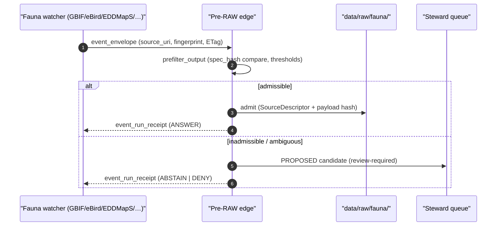
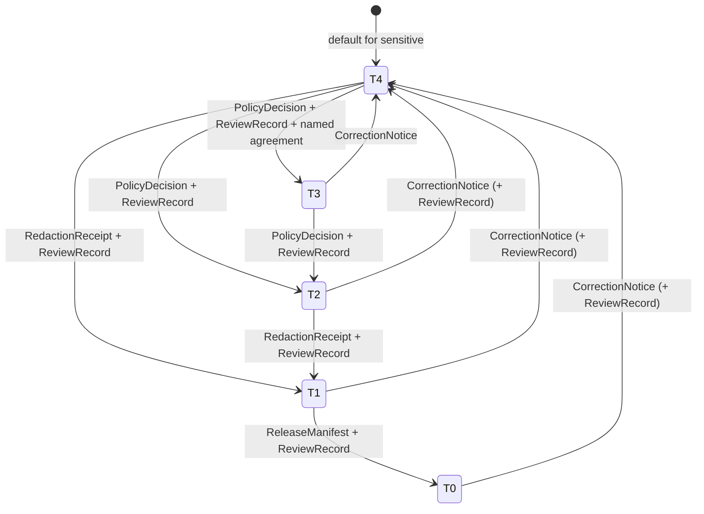

<!-- [KFM_META_BLOCK_V2]
doc_id: kfm://doc/fauna-data-lifecycle
title: Fauna Data Lifecycle
type: standard
version: v2
status: draft
owners: <fauna-stewards@TBD>; <governance-stewards@TBD>
created: 2026-05-16
updated: 2026-06-02
policy_label: public
related:
  - docs/doctrine/lifecycle-law.md
  - docs/doctrine/directory-rules.md
  - docs/domains/fauna/README.md
  - docs/domains/fauna/SENSITIVITY.md
  - docs/runbooks/fauna/SOURCE_REFRESH_RUNBOOK.md
  - docs/standards/PROV.md
  - ai-build-operating-contract.md
tags: [kfm, fauna, lifecycle, governance, sensitivity]
notes:
  - CONTRACT_VERSION = "3.0.0".
  - Implementation-layer paths are PROPOSED pending mounted-repo verification.
  - Aligns Fauna lane to RAW -> WORK/QUARANTINE -> PROCESSED -> CATALOG/TRIPLET -> PUBLISHED.
  - v2 reconciles runtime-envelope naming to RuntimeResponseEnvelope (DecisionEnvelope migration, CONFLICTED until ADR).
[/KFM_META_BLOCK_V2] -->

# 🦌 Fauna — Data Lifecycle

> How animal taxa, occurrences, range, sensitive sites, and derived public-safe products move from admitted source material to released artifacts inside the Kansas Frontier Matrix trust membrane — and what each governed transition requires.

<p align="left">
  
  
  
  
  
  
  <!-- TODO: replace placeholders with real Shields.io endpoints once CI exists -->
  
  
</p>

**Status:** `draft` · **Owners:** `<fauna-stewards@TBD>`, `<governance-stewards@TBD>` · **Last updated:** `2026-06-02` · **Contract:** `CONTRACT_VERSION = "3.0.0"`

> [!IMPORTANT]
> Fauna carries **deny-by-default sensitivity** for exact occurrences, nests, dens, roosts, hibernacula, spawning sites, and steward-controlled records. No path-level move publishes anything; promotion is a **governed state transition** with required receipts, reviews, and rollback targets.

---

## 📑 Contents

1. [Purpose & scope](#1-purpose--scope)
2. [Lifecycle invariant — the picture](#2-lifecycle-invariant--the-picture)
3. [Stage-by-stage — Fauna handling](#3-stage-by-stage--fauna-handling)
4. [Pre-RAW admission edge](#4-pre-raw-admission-edge)
5. [Repository placement — where bytes live](#5-repository-placement--where-bytes-live)
6. [Object families × lifecycle stage](#6-object-families--lifecycle-stage)
7. [Receipts × lifecycle phase](#7-receipts--lifecycle-phase)
8. [Sensitivity tiers & transitions](#8-sensitivity-tiers--transitions)
9. [Promotion Gates A–G — Fauna mapping](#9-promotion-gates-ag--fauna-mapping)
10. [Failure-closed outcomes](#10-failure-closed-outcomes)
11. [Cross-lane interactions](#11-cross-lane-interactions)
12. [Open questions register](#12-open-questions-register)
13. [Open verification backlog](#13-open-verification-backlog)
14. [Changelog](#14-changelog)
15. [Definition of done](#15-definition-of-done)
16. [Related docs](#16-related-docs)

[↑ Back to top](#-fauna--data-lifecycle)

---

## 1. Purpose & scope

This document describes how the **Fauna** domain applies the KFM lifecycle invariant — **RAW → WORK / QUARANTINE → PROCESSED → CATALOG / TRIPLET → PUBLISHED** — to its owned object families (Taxon, Taxon Crosswalk, Conservation Status, Occurrence Evidence, Occurrence Restricted, Occurrence Public, RangePolygon, SeasonalRange, MigrationRoute, SensitiveSite, MortalityObservation, DiseaseObservation, Invasive Species Record, Redaction Receipt). It is the lane-level companion to:

- The **Directory Rules** placement and lifecycle law (CONFIRMED doctrine), which fixes the responsibility roots under `data/` and the meaning of each phase.
- The **Master Pipeline Gate Reference** (Atlas v1.1 §24.6), which fixes the artifacts each transition requires.
- The Fauna domain dossier in the **Domains Culmination Atlas** (Ch. 7), which fixes Fauna's owned objects, source families, and sensitivity posture.

It does **not** redefine the lifecycle, the tier scheme, the receipt catalog, or the promotion-gate matrix. Those are cross-cutting doctrine; this doc shows how Fauna sits inside them.

> [!NOTE]
> Truth labels in this doc:
> **CONFIRMED** = verified from attached KFM doctrine in this session.
> **PROPOSED** = design or lane-specific application not yet verified in a mounted repo.
> **NEEDS VERIFICATION** = checkable but unchecked in this session.
> **CONFLICTED** = sources disagree, or doctrine and implementation appear inconsistent; resolved by ADR or drift-register entry.
> No statement here implies that a particular validator, schema file, route, or test is present in the current repo unless a mounted artifact has confirmed it.

[↑ Back to top](#-fauna--data-lifecycle)

---

## 2. Lifecycle invariant — the picture

CONFIRMED doctrine, Fauna application is PROPOSED:

```mermaid
flowchart LR
    classDef gov fill:#fff2cc,stroke:#806600,color:#403300,stroke-width:1px;
    classDef hold fill:#ffe0e0,stroke:#a30000,color:#5a0000,stroke-width:1px;
    classDef proc fill:#e0efff,stroke:#1a4f8a,color:#0b2949,stroke-width:1px;
    classDef cat  fill:#e7e0ff,stroke:#4b2da0,color:#231458,stroke-width:1px;
    classDef pub  fill:#dcf5dc,stroke:#1f7a1f,color:#0e3f0e,stroke-width:1px;
    classDef pre  fill:#f0f0f0,stroke:#555,color:#222,stroke-width:1px,stroke-dasharray:3 3;

    PRE["Pre-RAW edge<br/>event_envelope · prefilter_output · event_run_receipt<br/>(watchers · GitOps PR · live feeds)"]:::pre
    RAW["RAW<br/>Source-identity capture<br/>SourceDescriptor + hash"]:::gov
    WORK["WORK<br/>Normalize<br/>schema · geometry · time · identity · evidence · rights · policy"]:::gov
    QUAR["QUARANTINE<br/>Hold failures<br/>rights · sensitivity · validation · source-role · evidence"]:::hold
    PROC["PROCESSED<br/>Validated objects<br/>EvidenceRef · ValidationReport · digest closure"]:::proc
    CAT["CATALOG / TRIPLET<br/>EvidenceBundle · graph projection · release candidate"]:::cat
    PUB["PUBLISHED<br/>Governed API surfaces<br/>ReleaseManifest · rollback target · correction path"]:::pub
    COR["CorrectionNotice / RollbackCard<br/>(any tier to T4 demotion always permitted)"]:::hold

    PRE -. "admission attempt" .-> RAW
    RAW -->|"Admission gate: SourceDescriptor"| WORK
    WORK -->|"Validation gate: ValidationReport pass"| PROC
    WORK -. "failure" .-> QUAR
    QUAR -. "corrected" .-> WORK
    PROC -->|"Catalog closure: EvidenceRefs resolve"| CAT
    CAT -->|"Release gate: ReleaseManifest + ReviewRecord"| PUB
    PUB -. "error discovered" .-> COR
    COR -. "demote / withdraw" .-> CAT
```



**Reading the picture.** The arrows are governed state transitions, not file moves. Each one fails closed: missing receipts, unresolved EvidenceRefs, unresolved sensitivity, unresolved rights, or absent release state holds the object at its current stage. CONFIRMED doctrine: a path-level move that bypasses validators, policy gates, evidence-bundle creation, catalog closure, and release-decision recording is a **violation of the invariant** regardless of which directory the bytes ended up in.

[↑ Back to top](#-fauna--data-lifecycle)

---

## 3. Stage-by-stage — Fauna handling

CONFIRMED doctrine / PROPOSED lane application. The stage handling and gate text below is the Fauna-specific reading of the universal lifecycle table (Atlas v1.1 §24.6.1 and the Ch. 7 Fauna pipeline-shape table).

### 3.1 RAW — admit, never expose

| Aspect | Fauna handling |
|---|---|
| **Purpose** | Capture the immutable source payload (or content-addressed reference) along with source role, rights, sensitivity, citation, time, and content hash. |
| **Required artifacts** | `SourceDescriptor` (role, authority, rights, sensitivity, cadence); payload hash; `SourceIntakeRecord` on admission. |
| **Allowed work** | Identity tagging and hashing only. **No normalization, no enrichment, no AI inference, no public access.** |
| **Sensitive payloads** | Exact occurrence geometry, nest/den/roost/hibernacula/spawning coordinates, and steward-controlled records remain encrypted-at-rest where supported and never leave the RAW lane unredacted. PROPOSED operational control; NEEDS VERIFICATION. |
| **Failure-closed outcome** | If `SourceDescriptor` is missing or rights are unresolved, the candidate is logged as awaiting steward and **not admitted**. |

> [!WARNING]
> RAW is **never** a public surface. No UI, governed API, or AI surface reads RAW directly. This is a CONFIRMED invariant for all KFM domains, with extra weight in Fauna because of sensitive occurrence geometry.

### 3.2 WORK / QUARANTINE — normalize or hold

| Aspect | Fauna handling |
|---|---|
| **Purpose** | Apply schema, geometry, time, identity, evidence, rights, and policy normalization. Resolve taxonomic identity against the Taxon Crosswalk. Split occurrences into Occurrence Restricted and (after redaction) Occurrence Public candidates. |
| **Required artifacts** | `TransformReceipt`; working-set `ValidationReport`; `PolicyDecision`. Sensitive-occurrence normalization additionally emits a `RedactionReceipt` recording the geoprivacy method, kept fields, removed fields, and geometry transform. |
| **Routing rule** | Material with unresolved rights, unresolved source role, unresolved sensitivity, schema failure, taxonomic ambiguity, or evidence defect moves to QUARANTINE with a structured reason. **Never silently promotes.** |
| **Allowed work** | Reprojection, generalization, attribute cleaning, taxonomic crosswalking, sensitivity classification, geoprivacy transforms — each producing a receipt. |
| **Failure-closed outcome** | Stay in WORK or move to QUARANTINE with reason recorded; no public edge of any kind. |

### 3.3 PROCESSED — validated, not published

| Aspect | Fauna handling |
|---|---|
| **Purpose** | Emit validated, normalized Fauna objects (Taxon, Occurrence Restricted, Occurrence Public candidate, RangePolygon, SeasonalRange, MigrationRoute, SensitiveSite metadata-only stub, MortalityObservation, DiseaseObservation, Invasive Species Record). |
| **Required artifacts** | `EvidenceRef` resolves; `ValidationReport` passes; digest closure achieved; `RedactionReceipt` present where sensitivity applies; `AggregationReceipt` present where aggregation applies. |
| **Allowed work** | Public-safe derivative preparation (occurrence density grid, species richness grid, generalized range polygon, public-safe popup payload, taxon search index entries) — PROPOSED viewing products per Fauna dossier §G. |
| **Failure-closed outcome** | Stay in WORK; structured FAIL outcome on `ValidationReport`; the object does **not** progress to CATALOG / TRIPLET. |

### 3.4 CATALOG / TRIPLET — close evidence, prepare release

| Aspect | Fauna handling |
|---|---|
| **Purpose** | Emit catalog records, EvidenceBundles, graph/triplet projections, and release candidates for Fauna objects whose evidence has closed. |
| **Required artifacts** | `CatalogMatrix` entry; `EvidenceBundle` (with `spec_hash`, `evidence_refs[]`, `obligations.redactions[]`, `obligations.generalizations[]`, `receipts.run_receipt`); graph/triplet projections where applicable. |
| **Allowed work** | Build STAC / DCAT / PROV catalog records; emit graph deltas; assemble release candidates under `release/candidates/fauna/<release_id>/` (PROPOSED path per Directory Rules). |
| **Failure-closed outcome** | HOLD at PROCESSED; structured FAIL outcome; **no public edge** is opened. |

### 3.5 PUBLISHED — released, reviewable, rollback-capable

| Aspect | Fauna handling |
|---|---|
| **Purpose** | Serve released, public-safe Fauna artifacts through governed APIs and manifests — public species status view, public range polygons, occurrence density grid, species richness grid, invasive monitoring public layer, seasonal support layer, public-safe popup, taxon search. |
| **Required artifacts** | `ReleaseManifest`; rollback target; correction path; `ReviewRecord` where review is required (sensitive taxa, geoprivacy transforms, steward-controlled records). |
| **Allowed surfaces** | Governed Fauna feature/detail resolver returning a `RuntimeResponseEnvelope`; Fauna `LayerManifest` resolver; Fauna Evidence Drawer payload; Fauna Focus Mode answer (with `AIReceipt`). All four are PROPOSED governed API surfaces; exact routes UNKNOWN until repo-mounted. See the envelope-naming note below. |
| **Forbidden surfaces** | Public exact occurrence tiles for sensitive taxa (CONFIRMED DENY). Direct RAW/WORK/QUARANTINE access by public clients or AI surfaces (CONFIRMED DENY). KFM acting as an emergency-alert authority on the back of disease or mortality records (CONFIRMED DENY — KFM is never an alert authority). |
| **Failure-closed outcome** | HOLD at CATALOG; no public surface change. |

> [!CAUTION]
> **The trust membrane** rule applies without exception: every public client, UI surface, and AI surface consumes governed APIs and `ReleaseManifest`-backed artifacts. None of them reads from `data/raw/fauna/`, `data/work/fauna/`, `data/quarantine/fauna/`, or `data/processed/fauna/`. Treating any of those paths as a publication shortcut is a violation of the invariant.

> [!NOTE]
> **Envelope-naming note (CONFLICTED → migrating).** The Atlas v1.1 Ch. 7 Fauna dossier names a bespoke `FaunaDecisionEnvelope` for the feature/detail resolver, but names the cross-cutting **`RuntimeResponseEnvelope`** for the Focus Mode answer and for the Master API Surface Table (§20.3). The operating contract (§9 glossary, §21.1) and the doctrine synthesis use `RuntimeResponseEnvelope` as the single finite-response shape. This doc adopts **`RuntimeResponseEnvelope`** for all Fauna runtime surfaces and treats `FaunaDecisionEnvelope` as a lane-specific alias slated for retirement under the active `DecisionEnvelope → RuntimeResponseEnvelope` migration. Final naming is **CONFLICTED** pending the migration ADR.

[↑ Back to top](#-fauna--data-lifecycle)

---

## 4. Pre-RAW admission edge

CONFIRMED doctrine / PROPOSED implementation: KFM defines a **pre-RAW event family** governing attempted admission **before** material enters RAW. This matters acutely for Fauna because most upstream sources are automated feeds — aggregator APIs (GBIF / eBird / iNaturalist / iDigBio / BISON), federal services (USFWS ECOS-like), steward sources (KDWP-like), heritage data (NatureServe-like), invasive feeds (EDDMapS), agency monitoring (eDNA / acoustic / telemetry), and contextual layers (NLCD / NWI / PADUS / SSURGO).

| Pre-RAW artifact | Purpose | Status |
|---|---|---|
| `event_envelope` | Records the candidate event: source URI, fingerprint, ETag, observed timestamp, watcher identity. | PROPOSED |
| `prefilter_output` | Records cheap admissibility checks (size/delta thresholds, `spec_hash` compare, ETag compare) before fetch. | PROPOSED |
| `event_run_receipt` / `EventRunReceipt` | Pins the watcher run: tool, version, started/finished timestamps, exit outcome (`ANSWER` / `ABSTAIN` / `DENY` / `ERROR`). | PROPOSED |
| `SourceIntakeRecord` | Normalized watcher/candidate envelope carrying `source_role`, `publication_state` (e.g. `WORK_CANDIDATE`), `promotion_required`, `evidence_bundle_resolved`, `policy_review_required`, `source_descriptor_ref`, `drift_summary`. | PROPOSED |

> [!IMPORTANT]
> **Watchers observe and emit; they do not publish.** A Fauna watcher may emit `SourceIntakeRecord`-shaped envelopes, source-drift candidates with `publication_state: WORK_CANDIDATE`, and pre-RAW receipts. It may not write under `data/processed/fauna/`, `data/catalog/`, `data/published/`, or `release/`. This is the **watcher-as-non-publisher invariant** (CONFIRMED doctrine).



[↑ Back to top](#-fauna--data-lifecycle)

---

## 5. Repository placement — where bytes live

CONFIRMED placement doctrine (Directory Rules §12 — Domain Placement Law) applied to Fauna. **All paths below are PROPOSED until verified against a mounted repo.** Fauna does **not** become a root folder; it appears as a segment inside responsibility roots.

```text
docs/domains/fauna/
contracts/domains/fauna/
schemas/contracts/v1/domains/fauna/
policy/domains/fauna/
policy/sensitivity/fauna/
tests/domains/fauna/
fixtures/domains/fauna/
packages/domains/fauna/
pipelines/domains/fauna/
pipeline_specs/fauna/
data/raw/fauna/<source_id>/<run_id>/
data/work/fauna/<run_id>/
data/quarantine/fauna/<reason>/<run_id>/
data/processed/fauna/<dataset_id>/<version>/
data/catalog/domain/fauna/
data/published/layers/fauna/
data/registry/sources/fauna/
release/candidates/fauna/
```

| Phase / responsibility | Fauna path (PROPOSED) | What it holds |
|---|---|---|
| Doctrine / human-facing | `docs/domains/fauna/` | This file, README, SENSITIVITY, schema/contract narratives. |
| Object meaning | `contracts/domains/fauna/` | Markdown-grade definitions for Taxon, Occurrence, RangePolygon, etc. |
| Machine shape | `schemas/contracts/v1/domains/fauna/` | JSON Schemas for Fauna objects (canonical home per ADR-0001). |
| Policy decisions | `policy/domains/fauna/`, `policy/sensitivity/fauna/` | Rego/OPA bundles for rights, sensitivity, geoprivacy. |
| Enforceable proofs | `tests/domains/fauna/` | Validator and policy-deny tests (PROPOSED list below). |
| Sample data | `fixtures/domains/fauna/` | Valid + invalid no-network fixtures (synthetic). |
| Domain pipeline logic | `pipelines/domains/fauna/` | Executable normalization, redaction, catalog emit. |
| Pipeline declarations | `pipeline_specs/fauna/` | Declarative pipeline / watcher specs. |
| RAW | `data/raw/fauna/<source_id>/<run_id>/` | Source-identity payloads + hashes. |
| WORK | `data/work/fauna/<run_id>/` | Transformations and candidates. |
| QUARANTINE | `data/quarantine/fauna/<reason>/<run_id>/` | Held failures by structured reason. |
| PROCESSED | `data/processed/fauna/<dataset_id>/<version>/` | Validated normalized outputs. |
| CATALOG | `data/catalog/domain/fauna/` | Domain catalog records (STAC / DCAT / PROV emitters). |
| PUBLISHED | `data/published/layers/fauna/` | Public-safe layers (e.g., generalized range, density grids). |
| Registry | `data/registry/sources/fauna/` | Source descriptors and source-role registry rows. |
| Release | `release/candidates/fauna/<release_id>/` | Release candidates, manifests, rollback cards. |

> [!NOTE]
> Receipts (`data/receipts/`), proofs (`data/proofs/`), and rollback (`data/rollback/`) are emitted **alongside** the lifecycle phases — they do not replace them (Directory Rules §4 Step 2). Cross-domain validators or schemas (e.g., a habitat × fauna × hydrology validator) live in the **lowest common responsibility root without a domain segment** — e.g., `tools/validators/<topic>/`, `schemas/contracts/v1/<topic>/` — never under a single picked-one domain folder (Directory Rules §12, "Multi-domain and cross-cutting files").

[↑ Back to top](#-fauna--data-lifecycle)

---

## 6. Object families × lifecycle stage

CONFIRMED objects (per Fauna dossier §B) / PROPOSED stage-by-stage applicability. A dot means the object family is normally present at that stage; later phases reference earlier-stage receipts via `EvidenceRef` rather than duplicating them.

| Fauna object family | RAW | WORK / QUAR. | PROCESSED | CATALOG / TRIPLET | PUBLISHED |
|---|:-:|:-:|:-:|:-:|:-:|
| `Taxon` | • | • | • | • | • |
| `Taxon Crosswalk` |  | • | • | • |  |
| `Conservation Status` | • | • | • | • | • |
| `Occurrence Evidence` (canonical record) | • | • | • | • |  |
| `Occurrence Restricted` (steward-only) |  | • | • | • |  |
| `Occurrence Public` (generalized) |  | • | • | • | • |
| `RangePolygon` |  | • | • | • | • |
| `SeasonalRange` |  | • | • | • | • |
| `MigrationRoute` |  | • | • | • | • |
| `SensitiveSite` (nest/den/roost/hibernacula/spawning) | • | • | • |  |  |
| `MortalityObservation` | • | • | • | • | • (aggregated) |
| `DiseaseObservation` | • | • | • | • | • (aggregated) |
| `Invasive Species Record` | • | • | • | • | • |
| `Redaction Receipt` |  | • | • | • | • |

> [!NOTE]
> The Fauna dossier's ubiquitous-language list (§C) also names `MonitoringEvent`, `Geoprivacy transform`, and `Public-safe derivative` as in-lane terms. They are not separate lifecycle-tracked object families in the matrix above: `MonitoringEvent` is treated here as a source-side observation feeding `Occurrence Evidence` / `MortalityObservation` / `DiseaseObservation`; geoprivacy transform and public-safe derivative are processes/outputs captured by `RedactionReceipt` and the public Occurrence/Range objects. Promote any of these to its own row only if a mounted schema confirms an independent object family — NEEDS VERIFICATION.

> [!IMPORTANT]
> `SensitiveSite` does **not** propagate to CATALOG/TRIPLET or PUBLISHED in identifiable form. The only public surface is a steward-reviewed, generalized derivative (T1) anchored to a `RedactionReceipt` — and even that is denied by default until a `ReviewRecord` and `PolicyDecision` allow release.

[↑ Back to top](#-fauna--data-lifecycle)

---

## 7. Receipts × lifecycle phase

CONFIRMED doctrine: receipts make consequential transformations inspectable; if no receipt exists, the operation did not happen in the governed sense. The matrix below is the cross-cutting Receipt-↔-phase mapping (Atlas v1.1 §24.2.2) with Fauna-relevant emphasis.

| Receipt | Pre-RAW | RAW | WORK / QUAR. | PROCESSED | CATALOG / TRIPLET | PUBLISHED |
|---|:-:|:-:|:-:|:-:|:-:|:-:|
| `EventRunReceipt` | • |  |  |  |  |  |
| `SourceIntakeRecord` | • | • |  |  |  |  |
| `SourceDescriptor` |  | • | • | • | • | • |
| `TransformReceipt` |  |  | • | • | • |  |
| `RedactionReceipt` (Fauna-critical) |  |  | • | • | • | • |
| `AggregationReceipt` (density / richness grids) |  |  | • | • | • |  |
| `ModelRunReceipt` (if model-derived) |  |  | • | • | • |  |
| `RepresentationReceipt` (synthetic / reconstructed) |  |  | • | • | • |  |
| `AIReceipt` |  |  |  |  |  | • (Focus Mode only) |
| `ReviewRecord` |  |  |  | • | • | • |
| `PolicyDecision` |  | • | • | • | • | • |
| `ValidationReport` |  |  | • | • | • |  |
| `CitationValidationReport` |  |  |  |  | • | • |
| `ReleaseManifest` |  |  |  |  | • | • |
| `CorrectionNotice` |  |  |  |  |  | • |
| `RollbackCard` |  |  |  |  |  | • |
| `RealityBoundaryNote` (synthetic carriers) |  |  |  | • | • | • |

> [!TIP]
> A tier **upgrade** (toward more public) requires both a transform receipt **and** a review record. A tier **downgrade** (toward less public) needs only a `CorrectionNotice` — correction alone is always sufficient to remove or restrict. This is CONFIRMED doctrine (Atlas v1.1 §24.5.3 reading note) and a key safety property of the Fauna lane.

[↑ Back to top](#-fauna--data-lifecycle)

---

## 8. Sensitivity tiers & transitions

CONFIRMED tier scheme (Atlas v1.1 §24.5.1); CONFIRMED / PROPOSED Fauna-specific defaults from the Master Sensitivity Reference (§24.5.2) and the Fauna dossier.

| Tier | Name | Definition | Default audience |
|---|---|---|---|
| **T0** | Open | Public-safe with no transformations required. | Any public client via governed API. |
| **T1** | Generalized | Public-safe only after generalization, fuzzing, aggregation, or redaction; transform is reviewed and recorded. | Any public client via governed API. |
| **T2** | Reviewer | Released only to authenticated reviewers or domain stewards. | Stewards, reviewers, named research collaborators. |
| **T3** | Restricted | Released only under named agreement (rights, sovereignty, or consent). | Named authorized parties only. |
| **T4** | Denied | Not released to any audience; even existence may be disclosed only as steward review permits. | — |

### 8.1 Fauna-specific tier defaults

| Fauna object class | Default tier | Allowed transforms (PROPOSED) | Required gates |
|---|---|---|---|
| Sensitive occurrence (nest / den / roost / hibernacula / spawning / steward-controlled) | **T4** | Geoprivacy generalization + `RedactionReceipt` → T1. | `RedactionReceipt` + `ReviewRecord` + `PolicyDecision`. |
| `OccurrenceRecord` (sensitive taxa, general) | **T4** default; **T1** via generalization. | Coarse-cell binning, k-anonymization, point fuzzing, attribute suppression. | `RedactionReceipt` + `ReviewRecord` + `PolicyDecision`. |
| `RangePolygon` | **T1** | Aggregate / generalized public-safe layer. | `AggregationReceipt` or `RedactionReceipt`. |
| `SeasonalRange`, `MigrationRoute` | **T1** | Generalized geometry; seasonal support layer. | `AggregationReceipt` or `RedactionReceipt`. |
| `Taxon`, `Taxon Crosswalk`, `Conservation Status` | **T0** | None required (taxonomic identity and status are public-safe). | Standard release gates. |
| `MortalityObservation`, `DiseaseObservation` (aggregated) | **T1** | County / season / weekly roll-ups. | `AggregationReceipt`. |
| `Invasive Species Record` | **T0** / **T1** | Public monitoring layer; exact-coordinate detail may be **T1**. | Standard release gates; `RedactionReceipt` if exact coordinates would harm. |

### 8.2 Allowed tier transitions (motion)

CONFIRMED transition matrix (Atlas v1.1 §24.5.3). Note the asymmetry: any tier may demote to **T4** via correction; upgrades require both a transform receipt and a review record.



> [!WARNING]
> **Fauna deny defaults are non-negotiable.** Unclear rights, unresolved source role, missing evidence, unresolved sensitivity, or absent release state **blocks public promotion** — this is CONFIRMED doctrine. There is no transform that promotes an unreviewed exact sensitive occurrence to T0.

[↑ Back to top](#-fauna--data-lifecycle)

---

## 9. Promotion Gates A–G — Fauna mapping

CONFIRMED doctrine: KFM enforces seven gates between authoring and publication. **Auto-merge fires only when all seven pass; any failure blocks the merge until remediation.** The Fauna readings below are PROPOSED specializations.

| Gate | Universal intent | Fauna specialization (PROPOSED) | Decision artifact |
|---|---|---|---|
| **A** | Structure & metadata | KFM Meta Block v2 present on Fauna doctrine; lifecycle-zone labels correct; release-candidate folder layout intact. | Structure check output. |
| **B** | Schemas & contracts | Fauna objects validate against `schemas/contracts/v1/domains/fauna/*`; `EvidenceBundle` and `EvidenceRef` shapes valid; OpenAPI schemas for Fauna resolvers validate. | Schema / OpenAPI report. |
| **C** | Policy parity (CI = runtime) | Same OPA / Conftest bundle (pinned by digest) evaluates Fauna policy in CI and at runtime: rights, sensitivity, geoprivacy, source-role authority. | `policy_report.json`. |
| **D** | Security & sensitivity | Sensitivity scans for exact occurrence geometry, nest/den/roost/hibernacula/spawning coordinates, steward-controlled records; license/SPDX allowlist for the source descriptor; PII-style checks for any incidental personal data in observer fields. | Sensitivity / license scan. |
| **E** | Data quality | Schema validity, geometry validity, temporal logic (observed / valid / retrieval / release / correction), taxonomic resolution, occurrence restricted/public split correctness, tile-field allowlist correctness. | `ValidationReport` pass. |
| **F** | Provenance & lineage | `EvidenceBundle` closes; `RunReceipt` is DSSE-signed and Rekor-included; `spec_hash` reproducible; `attestation_ref` resolves. | `RunReceipt` + attestation. |
| **G** | Reviewability (two-key) | Steward review for sensitive-occurrence transforms; release authority distinct from author for material releases; `ReviewRecord` recorded. | `ReviewRecord` + approval token. |

> [!TIP]
> Gates A–G are **fail-closed by default**. Fauna's most common gate hits are likely to be **D** (sensitivity), **E** (taxonomic and occurrence-split data quality), and **F** (provenance closure on aggregator-sourced occurrences). PROPOSED — verify against CI evidence once the repo is mounted.

[↑ Back to top](#-fauna--data-lifecycle)

---

## 10. Failure-closed outcomes

CONFIRMED doctrine: every governed API surface, validator, policy gate, and Focus Mode answer returns a finite outcome from the `RuntimeResponseEnvelope` set. PROPOSED Fauna mappings:

| Outcome | Meaning | Typical Fauna trigger |
|---|---|---|
| `ANSWER` | The request is satisfied by released, evidence-backed, policy-allowed material. | Public range polygon for a non-sensitive taxon; aggregated invasive monitoring layer. |
| `ABSTAIN` | Evidence is insufficient or scope is too uncertain to answer. | Taxonomic ambiguity unresolved; temporal scope missing; `EvidenceRef` does not resolve; stale evidence with no released alternative. |
| `DENY` | Policy, rights, sensitivity, or release state forbids the answer. | Exact sensitive occurrence; nest / den / roost / hibernacula / spawning coordinates; KFM asked to act as emergency-alert authority. |
| `ERROR` | The system could not produce a finite outcome (infrastructure, contract, or schema fault). | Schema mismatch; signature verification failure; storage unavailable. |

> [!NOTE]
> The contract also defines optional extensions `NARROWED` and `BOUNDED`, and runtime UI negative states such as `SOURCE_STALE`, `GENERALIZED_GEOMETRY`, `RESTRICTED_ACCESS`, and `CITATION_FAILED`. These are CONFIRMED doctrine but PROPOSED for Fauna wiring; they MUST be backed by contract schemas before use. NEEDS VERIFICATION.

> [!CAUTION]
> **AI on the Fauna surface never roots truth.** AI may summarize released Fauna `EvidenceBundle`s, compare evidence, explain limitations, and draft steward-review notes. AI **must** `ABSTAIN` when evidence is insufficient and `DENY` where policy, rights, sensitivity, or release state blocks the request. AI never reads RAW / WORK / QUARANTINE Fauna content — CONFIRMED doctrine.

[↑ Back to top](#-fauna--data-lifecycle)

---

## 11. Cross-lane interactions

CONFIRMED Fauna cross-lane edges (per dossier §F). Each relation must preserve ownership, source role, sensitivity, and `EvidenceBundle` support.

| Fauna ↔ Related lane | Relation type | Lifecycle implication |
|---|---|---|
| Fauna ↔ Habitat | Derived habitat assignment; seasonal support. | Habitat joins to Fauna only through governed `EvidenceRef`s; sensitive-occurrence geometry is not shared — only generalized derivatives. |
| Fauna ↔ Flora | Ecological community, pollinator, invasive, food-web context. | Cross-lane EvidenceBundle composition; each side preserves its tier defaults independently. |
| Fauna ↔ Hydrology | Aquatic / riparian / wetland / spawning context. | Spawning-site joins fail closed; only generalized hydrology context propagates. |
| Fauna ↔ Hazards | Disease, mortality, wildfire, flood, drought exposure. | Aggregated mortality / disease only; KFM never becomes the alert authority. |

> [!NOTE]
> Cross-lane files that genuinely span Fauna + another domain (e.g., a habitat × fauna × hydrology validator) are **not** placed under `…/domains/fauna/`. They live under the lowest common responsibility root without a domain segment (Directory Rules §12).

[↑ Back to top](#-fauna--data-lifecycle)

---

## 12. Open questions register

| ID | Question | Owner role | Resolution path |
|---|---|---|---|
| OQ-FAUNA-LC-01 | Is `FaunaDecisionEnvelope` retired in favor of `RuntimeResponseEnvelope` for the Fauna feature/detail resolver? | Governance steward | `DecisionEnvelope → RuntimeResponseEnvelope` migration ADR; DRIFT_REGISTER entry. |
| OQ-FAUNA-LC-02 | Should `MonitoringEvent` be a first-class lifecycle-tracked object family with its own schema, or remain a source-side observation? | Fauna steward | Mounted `schemas/contracts/v1/domains/fauna/` inspection + dossier §C reconciliation. |
| OQ-FAUNA-LC-03 | Which geoprivacy transforms are admissible for which sensitive classes (radius mask, grid, jitter, DP, centroid, time-bucket)? | Fauna steward + governance | `policy/sensitivity/fauna/geoprivacy.rego` + ADR; cross-check sensitivity rubric 0–5 mapping. |
| OQ-FAUNA-LC-04 | Stale-state rule for Fauna releases: freshness thresholds, and `SOURCE_STALE`/`ABSTAIN` vs `DENY` behavior. | Release authority | `policy/release/fauna/` or equivalent ADR (ties to ADR-S-10 stale-state propagation). |

## 13. Open verification backlog

These items remain `NEEDS VERIFICATION` before promotion from `draft` to `published`:

1. Exact `schemas/contracts/v1/domains/fauna/*.schema.json` files present and pinned (cross-check ADR-0001).
2. `RedactionReceipt` schema canonical home and field set (`schemas/contracts/v1/receipts/redaction_receipt.schema.json` or equivalent).
3. Geoprivacy method allowlist and its policy bundle (`policy/sensitivity/fauna/`).
4. Source-role authority for each upstream source family (KDWP, USFWS, NatureServe, GBIF, eBird, iNaturalist, iDigBio, BISON, EDDMapS) in `data/registry/sources/fauna/*`.
5. Restricted/public occurrence split policy and corresponding validator + tests under `tests/domains/fauna/`.
6. Tile-field allowlist for public Fauna PMTiles (emitter config + validator + fixtures).
7. Exact governed-API route for the Fauna feature/detail resolver (OpenAPI under `apps/governed-api/…`) — currently UNKNOWN.
8. Pre-RAW event schemas (`event_envelope`, `prefilter_output`, `event_run_receipt`, `SourceIntakeRecord`) wired to Fauna watchers in `pipeline_specs/fauna/`.
9. Runtime-envelope naming reconciled to `RuntimeResponseEnvelope` across all Fauna surfaces (resolves OQ-FAUNA-LC-01).

## 14. Changelog

| Change | Type (per contract §37) | Reason |
|---|---|---|
| `FaunaDecisionEnvelope` → `RuntimeResponseEnvelope` for all Fauna runtime surfaces; added envelope-naming note. | reconciliation | Aligns with contract §9/§21 and Atlas §20.3; tracks active migration. |
| Added `EventRunReceipt` and `SourceIntakeRecord` to the pre-RAW table and the receipt × phase matrix; added Pre-RAW column. | gap closure | Receipt catalog (§24.2) and KFM-P1-PROG-0008 / KFM-P4-PROG-0001 name these objects. |
| Added `CitationValidationReport` to the receipt matrix. | gap closure | Listed in contract trust objects and receipt taxonomy. |
| Generalized tier-transition diagram to reflect "any tier → T4" demotion and bracketed the optional `ReviewRecord`. | clarification | Matches Atlas §24.5.3 "Any tier → T4 (downgrade)" row. |
| Added `MonitoringEvent` / geoprivacy-transform / public-safe-derivative reconciliation note to §6. | clarification | Dossier §C names them; matrix did not, risking anti-collapse confusion. |
| Promoted companion sections (Open Qs, Verification Backlog, Changelog, Definition of Done) to first-class tail per contract pattern. | housekeeping | Doctrine-adjacent doc companion-section requirement. |
| Removed decorative Unicode (`⟂`, `🦌` retained only in H1) from Mermaid labels; double-quoted labels with `(`, `:`, `/`. | housekeeping | Mermaid parse-safety; KFM Meta Block render-safety. |
| Bumped `version: v1 → v2`, `updated: 2026-06-02`; added `ai-build-operating-contract.md` to `related`. | housekeeping | Standard revision metadata. |

> **Backward compatibility.** Heading anchors are unchanged except for the new companion-section headings appended at the tail; no prior anchor was removed or renamed. The H1 anchor (`#-fauna--data-lifecycle`) is preserved, so all in-page "Back to top" links remain valid.

## 15. Definition of done

This document is done enough to enter the repository when:

- it is placed at `docs/domains/fauna/` per Directory Rules;
- a docs steward and a Fauna steward review it (governance steward sign-off required because it is doctrine-adjacent);
- it is linked from the Fauna lane index and the doctrine/lifecycle index;
- it does not conflict with accepted ADRs (notably the schema-home and `DecisionEnvelope → RuntimeResponseEnvelope` migration ADRs);
- the envelope-naming conflict (OQ-FAUNA-LC-01) is logged in `docs/registers/DRIFT_REGISTER.md`;
- the `GENERATED_RECEIPT.json` planned for this artifact is wired into CI;
- future changes follow the operating contract's §37 lifecycle.

[↑ Back to top](#-fauna--data-lifecycle)

---

## 16. Related docs

<details>
<summary><strong>Doctrine & cross-cutting references</strong></summary>

- [`docs/doctrine/lifecycle-law.md`](../../doctrine/lifecycle-law.md) — TODO link target; canonical lifecycle invariant.
- [`docs/doctrine/directory-rules.md`](../../doctrine/directory-rules.md) — TODO link target; placement protocol and Domain Placement Law (§12).
- [`docs/doctrine/trust-membrane.md`](../../doctrine/trust-membrane.md) — TODO link target; public clients consume governed APIs only.
- [`ai-build-operating-contract.md`](../../../ai-build-operating-contract.md) — TODO link target; `CONTRACT_VERSION = "3.0.0"`; finite-outcome and `RuntimeResponseEnvelope` definitions.
- [`docs/standards/PROV.md`](../../standards/PROV.md) — provenance standards profile (`PROV.md` vs `PROVENANCE.md` filename open item — NEEDS VERIFICATION).

</details>

<details>
<summary><strong>Fauna lane companions</strong></summary>

- [`docs/domains/fauna/README.md`](./README.md) — TODO link target; Fauna landing page.
- [`docs/domains/fauna/SENSITIVITY.md`](./SENSITIVITY.md) — TODO link target; sensitivity classes, geoprivacy transforms, redaction methods.
- [`docs/domains/fauna/OBJECTS.md`](./OBJECTS.md) — TODO link target; Fauna object families and identity rules.
- [`docs/runbooks/fauna/SOURCE_REFRESH_RUNBOOK.md`](../../runbooks/fauna/SOURCE_REFRESH_RUNBOOK.md) — TODO link target; operational refresh runbook.

</details>

<details>
<summary><strong>Adjacent lanes</strong></summary>

- [`docs/domains/habitat/`](../habitat/) — habitat patches, suitability, joins with Fauna.
- [`docs/domains/flora/`](../flora/) — flora records, ecological community context.
- [`docs/domains/hydrology/`](../hydrology/) — aquatic / riparian / wetland / spawning context.
- [`docs/domains/hazards/`](../hazards/) — disease, mortality, wildfire / flood / drought exposure.

</details>

---

<sub>Last updated: **2026-06-02** · Status: **draft** · Doc type: **standard** · `CONTRACT_VERSION = "3.0.0"`</sub>
<sub>[↑ Back to top](#-fauna--data-lifecycle)</sub>
