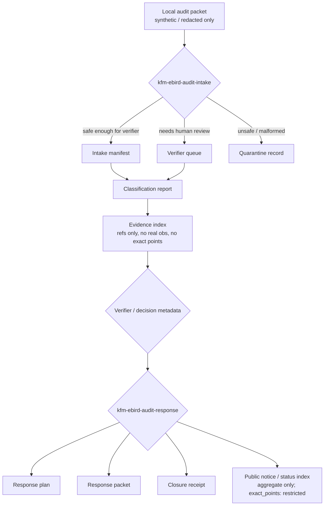

<!-- [KFM_META_BLOCK_V2]
doc_id: kfm://doc/TODO-uuid-ebird-layer-33-audit-response
title: EBIRD Layer 33 Audit Response
type: standard
version: v1
status: draft
owners: TODO: verify owner / steward role
created: 2026-05-01
updated: 2026-05-01
policy_label: TODO: verify document publication label; public outputs are aggregate-only
related: [TODO: verify fauna/eBird docs, TODO: verify schemas/contracts/v1 home, TODO: verify tests/e2e/runtime_proof/fauna home]
tags: [kfm, fauna, ebird, audit, offline, governance, public-safety]
notes: [Prepared from current prompt and attached KFM corpus; no mounted repository was available; all paths and command behavior are PROPOSED until verified]
[/KFM_META_BLOCK_V2] -->

# EBIRD Layer 33 Audit Response

Layer 33 defines local/offline audit intake and response workflows for eBird-adjacent fauna governance without exposing real observations, exact points, credentials, or ecological inference.

<div align="left">


</div>

> [!IMPORTANT]
> This document is a **PROPOSED repo-ready standard doc**. It records the Layer 33 safety contract, artifact set, CLI responsibilities, deterministic ID recipe, and validation gates. It does **not** prove that the CLIs, schemas, fixtures, policies, tests, or output directories already exist in the repository.

## Quick jumps

- [Status and repo fit](#status-and-repo-fit)
- [Scope](#scope)
- [Safety contract](#safety-contract)
- [Workflow](#workflow)
- [CLI surfaces](#cli-surfaces)
- [Artifact contracts](#artifact-contracts)
- [Deterministic IDs](#deterministic-ids)
- [Validation gates](#validation-gates)
- [Public response rules](#public-response-rules)
- [Implementation checklist](#implementation-checklist)
- [Open verification](#open-verification)

## Status and repo fit

| Field | Determination |
|---|---|
| Status | **PROPOSED / draft** |
| Target path | `docs/domains/fauna/ebird/layer-33-audit-response.md` **PROPOSED** |
| Upstream doctrine | KFM governed lifecycle, fauna occurrence runtime proof, Evidence Drawer/Focus Mode finite outcomes, source-role discipline |
| Downstream consumers | CLI maintainers, validators, review queue, response packet builder, public notice/status index, Evidence Drawer / review-console handoff where applicable |
| Implementation evidence | **UNKNOWN** until the mounted repo, schemas, tests, workflow YAML, and runtime logs are inspected |

Layer 33 belongs in the fauna/eBird governance lane because it handles audit intake and public-safety status response around bird-occurrence support. It should not become a biological analysis lane, a connector lane, or a public occurrence-serving lane.

## Scope

Layer 33 provides two local/offline command surfaces:

| CLI | Role | Network posture | Output posture |
|---|---|---|---|
| `kfm-ebird-audit-intake` | Accepts a local audit packet, classifies safety posture, and prepares verifier-facing artifacts. | **No network calls.** | Internal manifests, verifier queue records, classification report, evidence index. |
| `kfm-ebird-audit-response` | Converts verified intake state and decision metadata into governance/public-safety response artifacts. | **No network calls.** | Response plan, response packet, closure receipt, public aggregate notice/status index. |

### Accepted inputs

Inputs must be local, reviewable, and non-sensitive by construction.

- Local JSON/YAML audit packet fixtures.
- Local decision metadata produced by a reviewer or verifier workflow.
- Local evidence references that point to approved, non-exact, non-real-observation support objects.
- Synthetic or redacted examples that cannot identify a real eBird observation or exact location.

### Exclusions

Layer 33 must reject, quarantine, or deny inputs that include any of the following:

- Network fetch instructions, API URLs intended for live access, or connector activation.
- Credentials, tokens, API keys, cookies, auth headers, or secret-like values.
- Real eBird observations, checklist IDs, observation IDs, observer identity, or raw checklist detail.
- Exact coordinates, exact point geometry, or precise location payloads.
- Ecological inference, including abundance, rarity, trend, distribution, migration, habitat suitability, presence/absence, or site-quality claims.

## Safety contract

| Rule | Required behavior | Public output impact |
|---|---|---|
| No network calls | CLIs run from local files only; no live eBird/API access. | No public claim depends on unverified live fetch state. |
| No credentials | Secrets are rejected or quarantined if detected. | No credential material appears in receipts, packets, logs, notices, or indices. |
| No real eBird observations | Real observation/checklist identifiers are not accepted. | Public responses refer to audit status only, not observation facts. |
| No exact coordinates | Exact point fields and point geometries are restricted by default. | Public index must carry `exact_points: restricted`. |
| Aggregate-only public outputs | Public notice/status index uses aggregate status counts and audit-level refs. | No feature-level, point-level, observer-level, checklist-level, or date-place exactness leaks. |
| No ecological inference | Response language is governance/status language only. | The response packet may say what was reviewed, withheld, closed, or updated; it may not infer ecological meaning. |

## Workflow



The lifecycle remains KFM-shaped even when the source material is local and offline:

```text
LOCAL AUDIT INPUT -> WORK / QUARANTINE -> PROCESSED RESPONSE ARTIFACTS -> CATALOG / RECEIPT -> PUBLIC STATUS INDEX
```

Promotion to a public status index is a governed decision, not a file move. The public notice/status index is allowed only after no-leak, aggregate-only, rights/sensitivity, and response-language checks pass.

## CLI surfaces

> [!NOTE]
> The commands below are **PROPOSED interface contracts**. Argument names, output directories, package entry points, and schema homes must be reconciled against the mounted repository before implementation.

### `kfm-ebird-audit-intake`

```bash
kfm-ebird-audit-intake \
  --audit-packet ./fixtures/ebird_audit_packet.safe.json \
  --out ./data/work/audit/ebird/<audit_intake_id>/ \
  --offline \
  --no-network
```

Required responsibilities:

1. Validate that the packet is local and non-networked.
2. Reject or quarantine credential-like values.
3. Reject or quarantine real eBird observation/checklist identifiers.
4. Reject or quarantine exact point geometry or coordinate fields.
5. Produce deterministic `audit_intake_id` from canonical payload and intake decision metadata.
6. Emit the intake manifest, verifier queue item, classification report, and evidence index.

### `kfm-ebird-audit-response`

```bash
kfm-ebird-audit-response \
  --intake-manifest ./data/work/audit/ebird/<audit_intake_id>/intake_manifest.json \
  --decision ./fixtures/ebird_audit_decision.public_status_update.json \
  --out ./data/processed/audit/ebird/<audit_response_id>/ \
  --offline \
  --no-network
```

Required responsibilities:

1. Confirm intake artifacts passed validation or were explicitly reviewed.
2. Confirm decision metadata is local, deterministic, and reviewable.
3. Produce deterministic `audit_response_id` from canonical response inputs and decision metadata.
4. Emit a response plan, response packet, closure receipt, and public notice/status index candidate.
5. Deny or abstain when a public status update would disclose exact points, real observations, credentials, or ecological inference.

## Artifact contracts

Layer 33 has eight required artifact families.

| Artifact | Producer | Visibility | Minimum content | Must not contain |
|---|---|---|---|---|
| Intake manifest | `kfm-ebird-audit-intake` | Internal | `audit_intake_id`, input digest, safety flags, classification summary, generated artifact refs | Credentials, real observations, exact coordinates |
| Verifier queue | `kfm-ebird-audit-intake` | Internal / review | queue item id, reason codes, verifier task, required review, intake ref | Public-ready claims or ecological statements |
| Classification report | `kfm-ebird-audit-intake` | Internal / review | safety classification, denial/quarantine reasons, rule hits, validation status | Raw sensitive payload values |
| Evidence index | `kfm-ebird-audit-intake` | Internal / review | local evidence refs, digests, support roles, audit refs | Real observation IDs or exact point detail |
| Response plan | `kfm-ebird-audit-response` | Internal / review | proposed public posture, response outcome, obligations, no-leak checks | Ecological conclusion language |
| Response packet | `kfm-ebird-audit-response` | Internal / optionally public-safe summary | status text, outcome, audit refs, EvidenceRef/EvidenceIndex refs where allowed | Checklist, observer, exact date-place, exact coordinates |
| Closure receipt | `kfm-ebird-audit-response` | Internal / proof | `audit_response_id`, final state, validation refs, response refs, rollback/correction refs | Secrets or exact points |
| Public notice/status index | `kfm-ebird-audit-response` | Public if promoted | aggregate counts/status, `exact_points: restricted`, public-safe audit refs, publication timestamp | Feature-level occurrence support or exact location |

### Public notice/status index shape

```json
{
  "status_index_version": "kfm.ebird.audit_status_index.v1",
  "layer": "ebird.layer_33.audit_response",
  "exact_points": "restricted",
  "public_output_mode": "aggregate_only",
  "status_counts": {
    "received": 1,
    "in_review": 0,
    "closed_public_status_update": 1,
    "closed_no_public_change": 0,
    "denied_unsafe_disclosure": 0,
    "error_malformed": 0
  },
  "public_notices": [
    {
      "notice_id": "TODO-deterministic-notice-id",
      "audit_response_ref": "kfm://audit/ebird/response/<audit_response_id>",
      "summary": "A local audit item was reviewed and closed with an aggregate public-safety status update. Exact points remain restricted.",
      "response_kind": "governance_status_update",
      "ecological_inference": false
    }
  ]
}
```

## Deterministic IDs

`audit_intake_id` and `audit_response_id` are deterministic SHA-256 prefixes over canonical JSON payloads.

> [!WARNING]
> Prefix length is **NEEDS VERIFICATION**. Use the repository-wide deterministic ID / `spec_hash` policy if one exists. Do not silently invent a competing prefix length.

### Intake ID recipe

```text
audit_intake_id = "ebird_audit_intake_" + sha256(canonical_json({
  "kind": "kfm.ebird.audit_intake.v1",
  "input_payload_digest": "sha256:<digest-of-local-audit-packet>",
  "normalized_input_refs": [...],
  "safety_decision": {
    "network": "none",
    "credentials": "none_detected",
    "real_observations": "none_allowed",
    "exact_points": "restricted",
    "public_output_mode": "aggregate_only"
  },
  "classification_metadata": {...}
}))[0:TODO_PREFIX_LENGTH]
```

### Response ID recipe

```text
audit_response_id = "ebird_audit_response_" + sha256(canonical_json({
  "kind": "kfm.ebird.audit_response.v1",
  "audit_intake_id": "<audit_intake_id>",
  "response_plan_digest": "sha256:<digest-of-response-plan>",
  "decision_metadata": {...},
  "public_notice_digest": "sha256:<digest-or-null>",
  "closure_metadata": {
    "exact_points": "restricted",
    "ecological_inference": false,
    "public_output_mode": "aggregate_only"
  }
}))[0:TODO_PREFIX_LENGTH]
```

Canonicalization rules should be centralized. At minimum, the canonical payload must use stable key ordering, UTF-8 encoding, normalized booleans/nulls, stable array order where order is meaningful, and no runtime-only fields unless they are part of the decision metadata being hashed.

## Validation gates

| Gate | Intake CLI | Response CLI | Failure disposition |
|---|---:|---:|---|
| Local-only input | Required | Required | `ERROR_MALFORMED` or quarantine |
| No network | Required | Required | hard fail; emit validation report |
| No credentials | Required | Required | quarantine; redact from reports |
| No real eBird observation/checklist IDs | Required | Required | `DENY_UNSAFE_DISCLOSURE` or quarantine |
| No exact coordinate / point geometry | Required | Required | `DENY_UNSAFE_DISCLOSURE` or quarantine |
| Aggregate-only public output | Validate candidate | Required | deny publication candidate |
| `exact_points: restricted` present in public index | Not applicable | Required | deny publication candidate |
| No ecological inference | Not applicable | Required | deny or rewrite to status-only text before promotion |
| Deterministic ID recomputes | Required | Required | error; block closure |
| Artifact closure | Required | Required | abstain from public notice |

## Public response rules

Layer 33 responses are governance and public-safety status updates only.

### Allowed language

- “A local audit item was received.”
- “The audit item is in review.”
- “The audit item was closed with no public data change.”
- “A public aggregate status index was updated.”
- “Exact points remain restricted.”
- “The request was denied because it would expose restricted or unsafe occurrence detail.”

### Disallowed language

- “This species occurs at this exact location.”
- “This checklist proves presence/absence.”
- “This location is a hotspot.”
- “The population is increasing/decreasing.”
- “Habitat suitability is high/low.”
- “Migration timing can be inferred from this audit.”
- “The raw observation supports a public ecological claim.”

## Implementation checklist

- [ ] Verify the real repo path for fauna/eBird audit documentation.
- [ ] Verify owner/steward roles and update the meta block.
- [ ] Decide schema home for Layer 33 artifacts.
- [ ] Define JSON schemas for the eight artifact families.
- [ ] Implement no-network tests for both CLIs.
- [ ] Implement credential and secret-like value rejection tests.
- [ ] Implement exact coordinate and real observation identifier rejection tests.
- [ ] Implement deterministic ID recomputation tests.
- [ ] Add public notice/status index validation requiring `exact_points: restricted`.
- [ ] Add response-language lint or validator that blocks ecological inference.
- [ ] Add fixture cases for safe intake, quarantine, denied exact point, denied real observation, denied credential, malformed packet, and aggregate public notice.
- [ ] Add rollback/correction behavior for withdrawn or corrected public status indices.

## Open verification

| Item | Status | Why it matters |
|---|---|---|
| Target file path | **UNKNOWN** | No mounted repo was available to confirm directory conventions. |
| CLI package/module home | **UNKNOWN** | Entry points must match repo packaging. |
| Schema home | **UNKNOWN / NEEDS VERIFICATION** | Corpus contains schema/contract-home ambiguity in related lanes. |
| Prefix length for deterministic IDs | **NEEDS VERIFICATION** | Must align with repository-wide `spec_hash` / ID policy. |
| Artifact storage layout | **UNKNOWN** | Proposed lifecycle paths must not create parallel authority. |
| Public notice publication gate | **UNKNOWN** | Actual promotion system and review state are unverified. |
| Owner / reviewer roles | **UNKNOWN** | Required for governance-significant audit closure. |
| eBird-specific source-rights posture | **NEEDS VERIFICATION** | Layer 33 avoids real observations, but adjacent source descriptors still need current rights review. |

---

Back to top: [EBIRD Layer 33 Audit Response](#ebird-layer-33-audit-response)
