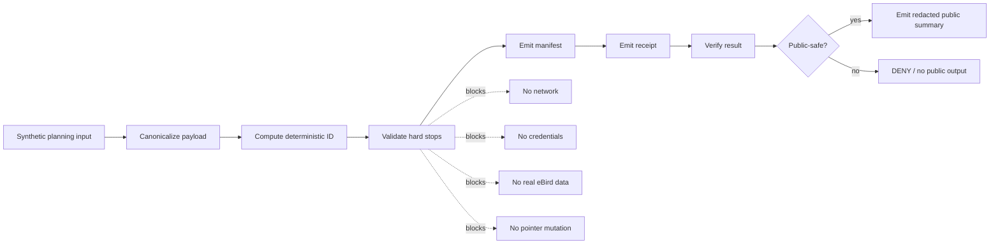

<!-- [KFM_META_BLOCK_V2]
doc_id: TODO: assign kfm://doc/<uuid> during repository adoption
title: eBird Layer 38 — Checkpoint Restore and Continuity
type: standard
version: v1
status: draft
owners: TODO: verify fauna/eBird lane owners
created: 2026-05-01
updated: 2026-05-01
policy_label: public
related: [TODO: verify repo paths for fauna lane, eBird lane, pipeline manual, source registry, policy registry]
tags: [kfm, ebird, fauna, checkpoint-restore, continuity, simulation, public-safety]
notes: [No mounted repository was available in this session; doc_id, owners, and related paths require repo verification.]
[/KFM_META_BLOCK_V2] -->

# eBird Layer 38 — Checkpoint Restore and Continuity

Layer 38 defines local-only checkpoint restore simulation and synthetic continuity drills for the KFM eBird lane.

<p align="left">
  
  
  
  
</p>

> [!WARNING]
> Layer 38 is **simulation and validation only**. It does not download eBird data, does not use credentials, does not publish private artifacts, and does not move release, latest/stable, or deployment pointers.

## Quick jumps

- [Status and evidence posture](#status-and-evidence-posture)
- [Repo fit](#repo-fit)
- [Scope](#scope)
- [Hard stops](#hard-stops)
- [Command surface](#command-surface)
- [Deterministic identity](#deterministic-identity)
- [Contract surface](#contract-surface)
- [Public-safety envelope](#public-safety-envelope)
- [Validation gates](#validation-gates)
- [Examples](#examples)
- [Acceptance checklist](#acceptance-checklist)
- [Open verification items](#open-verification-items)

## Status and evidence posture

| Claim | Status | Basis |
|---|---:|---|
| Layer 38 adds checkpoint restore simulation and continuity drills. | CONFIRMED | Current Layer 38 request. |
| The layer is local-only: no network, credentials, or real eBird data. | CONFIRMED | Current Layer 38 request. |
| `kfm-ebird-checkpoint-restore` and `kfm-ebird-continuity-drill` are required CLI names. | CONFIRMED | Current Layer 38 request. |
| Exact CLI flags, output directories, package manager, and test runner are implemented. | UNKNOWN | No mounted repository was available in this session. |
| Object schemas and file homes below are repo-ready proposals. | PROPOSED | They operationalize the request against KFM doctrine. |

This document uses KFM truth labels deliberately. **CONFIRMED** means the claim is grounded in the current request or directly visible evidence. **PROPOSED** means the design is intended for implementation but not verified in repository code. **UNKNOWN** marks items that require a mounted checkout, tests, workflow files, or runtime evidence.

## Repo fit

**PROPOSED target path:**

```text
docs/domains/fauna/ebird/layers/layer-38-checkpoint-restore-continuity.md
```

**Why this path:** eBird belongs naturally under the fauna occurrence lane. Layer 38 is not a general disaster-recovery manual; it is an eBird-lane continuity and restore-simulation contract.

| Direction | Expected neighbor | Relationship |
|---|---|---|
| Upstream | Fauna/eBird source descriptors, synthetic fixtures, occurrence evidence validators | Layer 38 consumes only synthetic checkpoint references and fixture metadata. |
| Parallel | Geoprivacy, public-safety, release, correction, and rollback docs | Layer 38 rehearses restore/continuity without mutating release state. |
| Downstream | Public summaries, readiness reports, review notes | Public consumers receive only redacted summaries and readiness posture. |

> [!NOTE]
> The path is **PROPOSED** until repository conventions are inspected. If the real repo already uses another eBird lane home, adopt that location and keep this document title and contract language stable.

## Scope

Layer 38 exists to answer one operational question safely:

> Can the eBird lane plan and validate a checkpoint restore or continuity drill without touching the network, credentials, real observations, release pointers, deployment pointers, or public-sensitive details?

### Accepted inputs

Layer 38 accepts only synthetic, local, non-secret planning inputs:

| Input | Required posture |
|---|---|
| Synthetic checkpoint reference | Opaque identifier only; no absolute or restricted path in public output. |
| Synthetic release candidate reference | Local simulation reference; never a latest/stable pointer. |
| Policy version | Included in deterministic planning payload. |
| Schema version | Included in deterministic planning payload. |
| Public-safety profile | Must require `public_safe=true` and `exact_points=restricted`. |
| Fixture descriptor | Synthetic-only; must not contain real eBird rows or exact coordinates. |

### Exclusions

| Exclusion | Where it belongs instead |
|---|---|
| Live eBird download, API access, or credential use | A separate source-activation lane after rights, source-role, and policy review. |
| Real eBird rows, raw observation CSVs, or exact coordinates | RAW/WORK/QUARANTINE paths under governed source intake, never Layer 38 public output. |
| Publishing, promotion, latest/stable mutation, or deployment pointer switching | Promotion/release system with review, proof packs, rollback references, and explicit decision records. |
| Suppression receipt details, suppressed group hashes, quarantine paths, or secrets | Restricted receipts and internal audit records only. |

## Hard stops

Layer 38 MUST fail closed when any hard stop is detected.

| Hard stop | Required result |
|---|---:|
| Network call attempted | `DENY` or `ERROR` |
| Credential requested, read, printed, or required | `DENY` |
| Real eBird data detected | `DENY` |
| Exact coordinates included in a public output | `DENY` |
| Public output includes restricted path, quarantine path, suppression receipt, raw row, secret, or suppressed group detail | `DENY` |
| Restore plan attempts latest/stable pointer mutation | `DENY` |
| Restore plan attempts deployment pointer mutation | `DENY` |
| Continuity drill attempts live publication | `DENY` |

The safest implementation posture is to run Layer 38 in a no-network test harness and treat all external-source activation as out of scope.

## Command surface

Layer 38 requires two CLIs.

| CLI | Required role | Mutation posture |
|---|---|---|
| `kfm-ebird-checkpoint-restore` | Produce and validate local restore plans, manifests, receipts, verification records, and public summaries. | No release pointer mutation. No deployment pointer mutation. |
| `kfm-ebird-continuity-drill` | Produce and validate synthetic continuity plans, drill results, readiness records, and public summaries. | No live source activation. No publication. |

### Minimum behavior contract

Both commands MUST:

1. run without network access;
2. run without credentials;
3. use synthetic fixtures only;
4. emit deterministic IDs from canonical planning payloads;
5. emit machine-readable validation results;
6. emit public summaries through the public-safety allowlist;
7. return finite outcomes: `PASS`, `HOLD`, `DENY`, or `ERROR`;
8. leave release latest/stable pointers unchanged;
9. leave deployment pointers unchanged.

### CLI flag note

Exact command flags are **NEEDS VERIFICATION** until the implementation exists. The command names above are fixed by the Layer 38 request; flags, default paths, and output conventions should be adapted to the mounted repository's established CLI style.

## Deterministic identity

Layer 38 uses deterministic short IDs for planning objects.

| ID | Rule |
|---|---|
| `restore_id` | First 16 hex chars of SHA-256 over the canonical restore planning payload. |
| `continuity_drill_id` | First 16 hex chars of SHA-256 over the canonical continuity planning payload. |

### Canonicalization rule

The planning payload MUST be canonicalized before hashing:

1. remove volatile execution fields such as timestamps, hostnames, PIDs, temporary paths, elapsed time, and random nonces;
2. sort object keys consistently;
3. preserve array order only where order is semantically meaningful;
4. normalize booleans, strings, and numbers consistently;
5. include `schema_version`, `layer_id`, `operation`, `policy_version`, `public_safety_profile`, and mutation constraints;
6. compute SHA-256 over canonical UTF-8 bytes;
7. use only the first 16 lowercase hexadecimal characters for the public identifier.

### Restore planning payload fields

| Field | Status | Notes |
|---|---:|---|
| `schema_version` | REQUIRED | Contract version. |
| `layer_id` | REQUIRED | `ebird-layer-38`. |
| `operation` | REQUIRED | `checkpoint_restore_simulation`. |
| `checkpoint_ref` | REQUIRED | Opaque local reference; no public restricted path. |
| `restore_scope` | REQUIRED | Synthetic scope descriptor. |
| `policy_version` | REQUIRED | Governs public-safety and mutation checks. |
| `public_safety_profile` | REQUIRED | Must contain `public_safe=true` and `exact_points=restricted`. |
| `mutation_constraints` | REQUIRED | Must set latest/stable and deployment pointer mutation to false. |
| `fixture_refs` | REQUIRED | Synthetic fixture identifiers only. |

### Continuity planning payload fields

| Field | Status | Notes |
|---|---:|---|
| `schema_version` | REQUIRED | Contract version. |
| `layer_id` | REQUIRED | `ebird-layer-38`. |
| `operation` | REQUIRED | `synthetic_continuity_drill`. |
| `continuity_scenario` | REQUIRED | Synthetic scenario name or ID. |
| `checkpoint_ref` | REQUIRED | Opaque checkpoint reference. |
| `expected_gates` | REQUIRED | Gate list used to compute readiness. |
| `policy_version` | REQUIRED | Governs drill evaluation. |
| `public_safety_profile` | REQUIRED | Must contain `public_safe=true` and `exact_points=restricted`. |
| `mutation_constraints` | REQUIRED | Must prohibit release and deployment pointer mutation. |

## Contract surface

Layer 38 emits restore contracts, continuity contracts, and public summaries.

### Restore family

| Object | Purpose | Public? |
|---|---|---:|
| `RestorePlan` | Canonical planning payload plus `restore_id`. | Restricted/internal by default. |
| `RestoreManifest` | Lists synthetic inputs, intended checks, simulated artifact refs, and mutation constraints. | Restricted/internal by default. |
| `RestoreReceipt` | Records local execution, checks performed, and side-effect posture. | Restricted/internal. |
| `RestoreVerification` | Records validation results and PASS/HOLD/DENY/ERROR outcome. | Restricted/internal by default. |
| `RestorePublicSummary` | Redacted public-safe summary with no restricted fields. | Public-safe. |

### Continuity family

| Object | Purpose | Public? |
|---|---|---:|
| `ContinuityPlan` | Canonical planning payload plus `continuity_drill_id`. | Restricted/internal by default. |
| `ContinuityDrillResult` | Records synthetic drill execution and gate outcomes. | Restricted/internal by default. |
| `ContinuityReadiness` | Summarizes readiness posture and unresolved obligations. | Public-safe only after redaction. |
| `ContinuityPublicSummary` | Redacted public-safe summary with no restricted fields. | Public-safe. |

### Outcome vocabulary

| Outcome | Meaning |
|---|---|
| `PASS` | All local simulation checks passed and no public-safety violation was detected. |
| `HOLD` | Structurally valid, but obligations or unknowns remain; do not promote. |
| `DENY` | A policy or public-safety rule failed. |
| `ERROR` | Malformed input, tool failure, or unrecoverable validation failure. |

## Public-safety envelope

Every public output MUST keep:

```json
{
  "public_safe": true,
  "exact_points": "restricted"
}
```

Public summaries MUST NOT expose:

- exact coordinates;
- raw rows;
- real eBird observation data;
- restricted file paths;
- quarantine paths;
- suppression receipts;
- suppressed group hashes or details;
- secrets, tokens, credentials, environment values, or usernames;
- release latest/stable pointer internals;
- deployment pointer internals.

### Public summary allowlist

Only these fields are allowed in public summaries unless a later policy explicitly expands the allowlist:

| Field | Restore summary | Continuity summary |
|---|---:|---:|
| `schema_version` | ✅ | ✅ |
| `layer_id` | ✅ | ✅ |
| `restore_id` | ✅ | — |
| `continuity_drill_id` | — | ✅ |
| `simulation_only` | ✅ | ✅ |
| `public_safe` | ✅ | ✅ |
| `exact_points` | ✅ | ✅ |
| `outcome` | ✅ | ✅ |
| `summary` | ✅ | ✅ |
| `obligation_count` | ✅ | ✅ |
| `blocked_reason_codes` | ✅ | ✅ |
| `release_pointer_mutated` | ✅, must be false | ✅, must be false |
| `deployment_pointer_mutated` | ✅, must be false | ✅, must be false |

> [!IMPORTANT]
> A public summary is not a receipt. Receipts may carry operational audit detail. Public summaries carry only public-safe posture and bounded outcome information.

## Validation gates

Layer 38 validation should be small, deterministic, and no-network.



| Gate | Required check | Failure outcome |
|---|---|---:|
| `network_closed` | No network calls or remote URLs. | `DENY` / `ERROR` |
| `credential_closed` | No credential dependency or secret emission. | `DENY` |
| `synthetic_only` | Fixtures are synthetic and non-real. | `DENY` |
| `public_safety_allowlist` | Public summary uses only allowed fields. | `DENY` |
| `exact_points_restricted` | Public summary sets `exact_points=restricted`. | `DENY` |
| `pointer_immutability` | latest/stable and deployment pointers unchanged. | `DENY` |
| `receipt_separation` | Public summary does not include restricted receipt details. | `DENY` |
| `deterministic_id` | ID recomputes from canonical payload. | `ERROR` |

## Examples

The examples below are illustrative contract sketches. They are **PROPOSED** until the repository's schema style and CLI conventions are verified.

### Restore planning payload

```json
{
  "schema_version": "layer38.restore_plan.v1",
  "layer_id": "ebird-layer-38",
  "operation": "checkpoint_restore_simulation",
  "checkpoint_ref": "synthetic-checkpoint-alpha",
  "restore_scope": {
    "scope_kind": "synthetic_fixture_set",
    "fixture_set_id": "ebird-layer38-synthetic-restore-fixtures"
  },
  "policy_version": "TODO-verify-policy-version",
  "public_safety_profile": {
    "public_safe": true,
    "exact_points": "restricted"
  },
  "mutation_constraints": {
    "release_latest_stable_pointer_mutation_allowed": false,
    "deployment_pointer_mutation_allowed": false
  },
  "fixture_refs": [
    "synthetic-ebird-restore-fixture-001"
  ]
}
```

### Restore public summary

```json
{
  "schema_version": "layer38.restore_public_summary.v1",
  "layer_id": "ebird-layer-38",
  "restore_id": "0123456789abcdef",
  "simulation_only": true,
  "public_safe": true,
  "exact_points": "restricted",
  "outcome": "PASS",
  "summary": "Synthetic checkpoint restore simulation completed without pointer mutation.",
  "obligation_count": 0,
  "blocked_reason_codes": [],
  "release_pointer_mutated": false,
  "deployment_pointer_mutated": false
}
```

### Continuity readiness summary

```json
{
  "schema_version": "layer38.continuity_public_summary.v1",
  "layer_id": "ebird-layer-38",
  "continuity_drill_id": "fedcba9876543210",
  "simulation_only": true,
  "public_safe": true,
  "exact_points": "restricted",
  "outcome": "HOLD",
  "summary": "Synthetic continuity drill completed, but readiness obligations remain open.",
  "obligation_count": 2,
  "blocked_reason_codes": [
    "NEEDS_REPO_CLI_FLAGS_VERIFIED",
    "NEEDS_POLICY_VERSION_PIN"
  ],
  "release_pointer_mutated": false,
  "deployment_pointer_mutated": false
}
```

## Acceptance checklist

Layer 38 is not ready for implementation review until these checks can be shown from repo evidence:

- [ ] CLI names exist: `kfm-ebird-checkpoint-restore` and `kfm-ebird-continuity-drill`.
- [ ] No-network tests fail if socket/network access is attempted.
- [ ] Credential tests prove the commands run without secrets and never print secret-like values.
- [ ] Synthetic-only fixtures are clearly labeled and contain no real eBird rows.
- [ ] `restore_id` recomputes from canonical restore planning payload.
- [ ] `continuity_drill_id` recomputes from canonical continuity planning payload.
- [ ] Restore outputs include plan, manifest, receipt, verification, and public summary.
- [ ] Continuity outputs include plan, result, readiness, and public summary.
- [ ] Public summaries keep `public_safe=true` and `exact_points=restricted`.
- [ ] Public summaries exclude coordinates, restricted paths, quarantines, suppression details, raw rows, and secrets.
- [ ] Tests prove release latest/stable pointers are not mutated.
- [ ] Tests prove deployment pointers are not mutated.
- [ ] Negative fixtures produce `DENY` or `ERROR` instead of permissive summaries.
- [ ] Documentation links this layer from the verified eBird/fauna lane index.

## Open verification items

| Item | Status | Required evidence |
|---|---:|---|
| Final Markdown file path | NEEDS VERIFICATION | Mounted repo docs layout. |
| Owners | NEEDS VERIFICATION | CODEOWNERS, docs owner registry, or maintainer decision. |
| CLI flags and output paths | UNKNOWN | CLI implementation or command help output. |
| Schema home | UNKNOWN | Repository schema/contract conventions or ADR. |
| Policy version field | UNKNOWN | Policy registry and versioning convention. |
| Test runner | UNKNOWN | Package manager and CI workflow inventory. |
| Public summary allowlist enforcement | PROPOSED | Validator implementation and negative tests. |
| Pointer immutability proof | PROPOSED | Fixture test showing before/after pointer equality. |

## Back to top

Return to [Quick jumps](#quick-jumps).
