<!-- [KFM_META_BLOCK_V2]
doc_id: kfm://doc/fauna-expansion-backlog
title: Fauna Domain — Expansion Backlog
type: standard
version: v2
status: draft
owners: fauna-domain-steward (TODO); sensitivity-reviewer (TODO); ecology-lead (TODO)
created: 2026-05-16
updated: 2026-06-02
policy_label: public
related:
  - docs/domains/fauna/README.md
  - docs/domains/fauna/FAUNA_DATA_LIFECYCLE.md
  - docs/domains/habitat/README.md
  - docs/runbooks/fauna/SOURCE_REFRESH_RUNBOOK.md
  - docs/standards/PROV.md
  - directory-rules.md
  - ai-build-operating-contract.md
tags: [kfm, fauna, backlog, domain, governance, expansion]
notes:
  - CONTRACT_VERSION = "3.0.0".
  - Path placement follows Directory Rules §12 Domain Placement Law.
  - Backlog items inherit doctrine from [DOM-FAUNA], [DOM-HF], [ENCY]; implementation rows remain PROPOSED until repo evidence is mounted.
  - PROPOSED owners/badges/CI URLs are placeholders pending CODEOWNERS and CI inspection.
  - v2 corrects source-role enum to the canonical Atlas §24.1.3 vocabulary and fixes per-domain section-letter citations.
[/KFM_META_BLOCK_V2] -->

# Fauna Domain — Expansion Backlog

> *Governed, evidence-first work plan for advancing the Fauna domain from doctrine to proof-bearing thin slices, with sensitivity controls intact.*

<!-- Badge row -->

**Status:** draft · **Owners:** fauna-domain-steward (TODO) · sensitivity-reviewer (TODO) · ecology-lead (TODO) · **Last updated:** 2026-06-02 · **Contract:** `CONTRACT_VERSION = "3.0.0"`

---

## Contents

- [1. Purpose & scope](#1-purpose--scope)
- [2. Repo fit](#2-repo-fit)
- [3. Backlog overview](#3-backlog-overview)
- [4. Backlog by priority group](#4-backlog-by-priority-group)
- [5. Flagship slice — Habitat × Fauna public-safe occurrence assignment](#5-flagship-slice--habitat--fauna-public-safe-occurrence-assignment)
- [6. Validators, tests, fixtures backlog](#6-validators-tests-fixtures-backlog)
- [7. Source admission & watcher backlog](#7-source-admission--watcher-backlog)
- [8. Sensitivity, rights, and publication backlog](#8-sensitivity-rights-and-publication-backlog)
- [9. Governed AI behavior backlog](#9-governed-ai-behavior-backlog)
- [10. Risks & mitigations](#10-risks--mitigations)
- [11. Verification backlog & open questions](#11-verification-backlog--open-questions)
- [12. ADR-class questions touching Fauna](#12-adr-class-questions-touching-fauna)
- [13. Cross-domain ripple](#13-cross-domain-ripple)
- [14. Suggested PR sequence](#14-suggested-pr-sequence)
- [15. Changelog](#15-changelog)
- [16. Related docs](#16-related-docs)
- [Appendix A — Full backlog row register](#appendix-a--full-backlog-row-register)

---

## 1. Purpose & scope

This backlog enumerates the **work the Fauna domain must absorb** to move from confirmed doctrine to evidence-bearing thin slices, while preserving the deny-by-default posture for exact sensitive locations and the governed lifecycle from `RAW` to `PUBLISHED`.

It is a working register, not an execution plan. Every row is **PROPOSED** at the implementation layer until repository evidence (files, schemas, tests, workflows, manifests, receipts, logs) confirms otherwise. **CONFIRMED** labels attach only to doctrine drawn from `[ENCY]`, `[DOM-FAUNA]`, `[DOM-HF]`, `[DIRRULES]`, `[GAI]`, and the consolidated Atlas (v1.1 Ch. 7 + Ch. 24).

**This backlog owns:**

- Domain-specific work items for fauna taxonomy, occurrence evidence, ranges, seasonal ranges, migration, sensitive sites, mortality, disease/pathogen, invasives, and conservation status.
- The habitat × fauna public-safe occurrence assignment thin slice as the flagship proof.
- Per-domain incarnations of the corpus-level `Build first` / `After proof lane` / `Ambitious / research` / `DENY by default` backlog groups for fauna.
- Pointers into cross-cutting expansion items (`EXP-001`..`EXP-015`) where they touch fauna sources or sensitive surfaces.

**This backlog does NOT own:**

- Habitat patches/suitability/connectivity (owned by Habitat).
- Plant taxa, vegetation communities, or rare-plant locations (owned by Flora).
- Hydrologic features, soil units, hazards, or any non-fauna canonical truth.
- Cross-domain expansion items themselves — those live in the corpus-level Expansion Agenda and are referenced here only where Fauna is the proof surface.

> [!IMPORTANT]
> Exact sensitive occurrence, nest, den, roost, hibernacula, spawning, and steward-controlled records **fail closed**. No entry in this backlog overrides that invariant; entries that would touch sensitive surfaces must publish only generalized public derivatives with a `RedactionReceipt` and a steward-approved transform.

> [!NOTE]
> **Citation-form note.** This doc cites the consolidated Atlas by short-name (`[ENCY]`, `[DOM-FAUNA]`, `[DOM-HF]`, `[DIRRULES]`, `[GAI]`) and, where a precise section is meaningful, by Atlas chapter (e.g., Atlas §24.5). Per-domain dossier sections are labeled **A–N** in Atlas v1.0 chs. 3–18: **K = Validators/tests/fixtures**, **L = Governed AI behavior**, **M = Publication/correction/rollback**, **N = Verification backlog**. The four priority groups in [§4](#4-backlog-by-priority-group) are corpus-level roadmap vocabulary, **not** a per-domain dossier section — see the §4 attribution note.

[Back to top ↑](#contents)

---

## 2. Repo fit

| Aspect | Placement | Status |
|---|---|---|
| This file | `docs/domains/fauna/EXPANSION_BACKLOG.md` | **PROPOSED** path; aligns with Directory Rules §12 (Domain Placement Law). |
| Upstream doctrine | `[DOM-FAUNA]`, `[DOM-HF]`, `[ENCY]`, Atlas v1.1 Ch. 7 | CONFIRMED doctrine. |
| Adjacent docs (siblings) | `docs/domains/fauna/README.md`, `docs/domains/fauna/FAUNA_DATA_LIFECYCLE.md`, `docs/domains/fauna/OPEN_QUESTIONS.md` (PROPOSED) | NEEDS VERIFICATION — sibling existence depends on mounted repo. |
| Cross-domain partner | `docs/domains/habitat/` (joint thin slice) | NEEDS VERIFICATION. |
| Downstream homes | `schemas/contracts/v1/domains/fauna/`, `contracts/domains/fauna/`, `policy/domains/fauna/`, `policy/sensitivity/fauna/`, `tests/domains/fauna/`, `fixtures/domains/fauna/`, `pipelines/domains/fauna/`, `data/registry/sources/fauna/`, `data/published/layers/fauna/`, `release/candidates/fauna/` | All **PROPOSED**; verify against mounted repo before treating as canonical. |
| Operational runbook | `docs/runbooks/fauna/SOURCE_REFRESH_RUNBOOK.md` | Referenced; subfolder-vs-flat convention OPEN (Directory Rules §6.1.b / OPEN-DR-02). |

> [!NOTE]
> Per Directory Rules §12, **fauna is never a root folder**. It appears as a *segment* inside each responsibility root. The canonical machine-schema home is `schemas/contracts/v1/domains/fauna/` (ADR-0001); markdown-grade object meaning lives in `contracts/domains/fauna/`. New homes for schemas, contracts, policy, sources, registries, or releases require an ADR before they can be treated as canonical (Directory Rules §2.4).

[Back to top ↑](#contents)

---

## 3. Backlog overview

```mermaid
flowchart LR
  subgraph Doctrine["Doctrine (CONFIRMED)"]
    DOM["DOM-FAUNA + DOM-HF"]
    ENC["ENCY (Atlas Ch. 7)"]
    DIR["DIRRULES (§12)"]
    GAI["GAI (Governed AI)"]
  end

  subgraph Groups["Backlog priority groups (PROPOSED implementation)"]
    BF["Build first<br/>(source registry,<br/>Evidence Drawer)"]
    APL["After proof lane<br/>(time slider,<br/>compare mode)"]
    AR["Ambitious / research<br/>(cross-domain analytics,<br/>graph queries)"]
    DBD["DENY by default<br/>(exact sensitive<br/>locations)"]
  end

  Flagship["Flagship slice<br/>Habitat × Fauna public-safe<br/>occurrence assignment"]

  subgraph Surfaces["Governed surfaces (PROPOSED)"]
    API["Fauna feature/detail<br/>resolver"]
    LM["Fauna LayerManifest<br/>resolver"]
    EDP["Fauna Evidence<br/>Drawer payload"]
    FM["Fauna Focus Mode<br/>(RuntimeResponseEnvelope<br/>+ AIReceipt)"]
  end

  Doctrine --> Groups
  Groups --> Flagship
  Flagship --> Surfaces
  Surfaces -. "ABSTAIN / DENY" .-> Doctrine

  classDef doctrine fill:#0b3d2e,stroke:#0b3d2e,color:#fff
  classDef group fill:#0b3d6e,stroke:#0b3d6e,color:#fff
  classDef surface fill:#5a2a0c,stroke:#5a2a0c,color:#fff
  class DOM,ENC,DIR,GAI doctrine
  class BF,APL,AR,DBD group
  class API,LM,EDP,FM surface
```

> [!NOTE]
> The diagram is **doctrinally grounded** in `[DOM-FAUNA]`, `[DOM-HF]`, `[ENCY]`, `[DIRRULES]`, and `[GAI]`. The arrows and boxes are illustrative of how the backlog flows from doctrine into thin slices and governed surfaces; specific routes, schemas, and components remain PROPOSED until repo evidence is mounted. The `Fauna feature/detail resolver` returns a `RuntimeResponseEnvelope` (the bespoke `FaunaDecisionEnvelope` named in Atlas §7 J is a lane alias slated for retirement under the active `DecisionEnvelope → RuntimeResponseEnvelope` migration — CONFLICTED until ADR).

[Back to top ↑](#contents)

---

## 4. Backlog by priority group

> [!IMPORTANT]
> **Attribution (corrected in v2).** The four groups below — **Build first**, **After proof lane**, **Ambitious / research**, **DENY by default** — are KFM corpus-level *roadmap / expansion* vocabulary (the cross-cutting programming-possibilities and roadmap material). They are **not** a per-domain dossier section: in Atlas v1.0 chs. 3–18 the per-domain letters are **K = Validators/tests**, **L = Governed AI behavior**, **M = Publication/correction/rollback**, **N = Verification backlog**. The grouping is therefore CONFIRMED as KFM design vocabulary but its application to Fauna here is **PROPOSED**. (The earlier "`L. Feature backlog`" attribution was incorrect.)

### 4.1 Build first

| # | Feature | Actor | Evidence needed | Risk | Validation path | Status | Citations |
|---|---|---|---|---|---|---|---|
| F-BF-01 | Fauna source registry + no-network fixture | steward / developer | `SourceDescriptor` + synthetic fixture | rights / source-role ambiguity | schema / source / rights validators | PROPOSED | `[DOM-FAUNA]`, `[DOM-HF]`, `[ENCY]` |
| F-BF-02 | Fauna Evidence Drawer inspector (one feature) | public / researcher / steward | `EvidenceBundle` for one feature | uncited public claim | evidence-closure + citation tests | PROPOSED | `[DOM-FAUNA]`, `[DOM-HF]`, `[ENCY]` |

> [!TIP]
> "Build first" rows are the **trust-spine entry conditions** for fauna. Until the source registry validates with no network and one fauna feature's `EvidenceBundle` resolves end-to-end through the Drawer, no later row should be activated.

### 4.2 After proof lane

| # | Feature | Actor | Evidence needed | Risk | Validation path | Status | Citations |
|---|---|---|---|---|---|---|---|
| F-AP-01 | Fauna time slider + compare mode | researcher / steward | versioned observations / layers | false temporal alignment | temporal-logic tests | PROPOSED | `[DOM-FAUNA]`, `[DOM-HF]`, `[ENCY]`, `[MAP-MASTER]` |

### 4.3 Ambitious / research

| # | Feature | Actor | Evidence needed | Risk | Validation path | Status | Citations |
|---|---|---|---|---|---|---|---|
| F-AR-01 | Cross-domain Fauna analytics + graph queries | researcher / AI assistant | source-backed triples + model receipts | derivative becomes truth | graph-projection tests | PROPOSED | `[DOM-FAUNA]`, `[DOM-HF]`, `[ENCY]` |

### 4.4 DENY by default

| # | Surface / class | Actor | Required evidence | Risk | Validation path | Status | Citations |
|---|---|---|---|---|---|---|---|
| F-DD-01 | Unreviewed exact sensitive Fauna locations or private data | public visitor | policy approval + `RedactionReceipt` | privacy / public-safety harm | policy-deny tests | **DENY** | `[DOM-FAUNA]`, `[DOM-HF]`, `[ENCY]`, Deny-by-Default Register (Atlas §20.5) |

> [!WARNING]
> The DENY row is **not a feature to build**; it is an invariant the rest of the backlog must preserve. A "deliver F-DD-01" interpretation is incorrect — every other row inherits this constraint and ships *because* this row holds.

[Back to top ↑](#contents)

---

## 5. Flagship slice — Habitat × Fauna public-safe occurrence assignment

**Lineage:** `KFM-IDX-APP-002` (PROPOSED), rooted in `[DOM-HF]` `[Habitat Fauna Thin Slice]`.

The flagship proof slice is the **single published fauna occurrence → habitat assignment**, end to end, with every governance object visible.

### 5.1 What this slice must prove (CONFIRMED doctrine; PROPOSED implementation)

- A **non-sensitive** public occurrence fixture joins to a habitat patch.
- The exact point may be kept steward-only if needed; the **public layer is generalized** and proven by a `RedactionReceipt`.
- Evidence flows: `SourceDescriptor` → `EvidenceRef` → `EvidenceBundle` → `ValidationReport` → `LayerManifest` → `ReleaseManifest` → `RollbackCard`.
- Map: MapLibre rendering of a public-safe generalized layer.
- Drawer: `EvidenceDrawerPayload` carries source role, sensitivity posture, freshness, citation, and release state.
- Focus Mode: `RuntimeResponseEnvelope` + `AIReceipt`, with `ANSWER / ABSTAIN / DENY / ERROR` as the only outcomes.
- Correction path and rollback target both **exist** and are tested.

### 5.2 Fixture taxonomy (PROPOSED, derived from `KFM-IDX-VAL-001`)

Expand fixture taxonomy

| Fixture | Purpose | Expected outcome |
|---|---|---|
| **Valid** | Non-sensitive occurrence + habitat join, all evidence resolved | `ANSWER` end-to-end |
| **Rights-denied** | Source rights unresolved or no-redistribution | `DENY` at rights gate |
| **Sensitivity-denied** | Listed taxon, exact point requested by public client | `DENY` at sensitivity gate; generalized alternative available |
| **Stale-source** | `SourceDescriptor` cadence elapsed without admission | `SOURCE_STALE` marker; promotion `HOLD` |
| **Unresolved EvidenceRef** | `EvidenceRef` cannot resolve to `EvidenceBundle` | `ABSTAIN` at evidence-closure gate |
| **Rollback drill** | Released layer must be retracted | `RollbackCard` succeeds; downstream caches invalidated |

### 5.3 Why this slice and not a broader one

Per `KFM-IDX-PLN-003`, domain expansions ship as **proof-bearing thin slices**, not horizontal coverage. The habitat × fauna assignment is small enough to close (one occurrence, one patch, one bundle, one manifest) and large enough to exercise the **most failure-prone** governance surfaces simultaneously: rights, sensitivity, geoprivacy, temporal logic, evidence closure, and rollback.

[Back to top ↑](#contents)

---

## 6. Validators, tests, fixtures backlog

The Atlas per-domain **§K (Validators, tests, fixtures)** list applies to every domain; the rows below are the **Fauna-specific** additions called out by `[DOM-FAUNA]` and `[DOM-HF]`. All rows are **PROPOSED** at the implementation layer.

| # | Validator / test | What it proves | Status | Citations |
|---|---|---|---|---|
| V-01 | Source-role authority tests | Source role must match claim type, using the canonical source-role enum (see note below). | PROPOSED | `[DOM-FAUNA]`, `[DOM-HF]`, `[ENCY]` §24.1.3 |
| V-02 | Taxonomy resolution and ambiguity tests | Taxa names resolve deterministically; ambiguities are surfaced, not silently picked. | PROPOSED | `[DOM-FAUNA]`, `[DOM-HF]`, `[ENCY]` |
| V-03 | Occurrence restricted / public split tests | `OccurrenceRestricted` cannot leak into the public layer; `OccurrencePublic` carries a transform receipt where it derives from restricted. | PROPOSED | `[DOM-FAUNA]`, `[DOM-HF]`, `[ENCY]` |
| V-04 | `RedactionReceipt` validation | Receipt records input class, output class, reason, policy, reviewer, residual risk. | PROPOSED | `[DOM-FAUNA]`, `[DOM-HF]`, `[ENCY]` |
| V-05 | Tile field allowlist tests | Public-safe tiles carry only allowlisted fields; sensitive attributes never reach published PMTiles. | PROPOSED | `[DOM-FAUNA]`, `[DOM-HF]`, `[ENCY]` |
| V-06 | `RuntimeResponseEnvelope` negative cases | Focus Mode produces finite `ANSWER / ABSTAIN / DENY / ERROR`; abstention and denial reasons are coded. | PROPOSED | `[DOM-FAUNA]`, `[DOM-HF]`, `[ENCY]`, `[GAI]` |
| V-07 | Geoprivacy transform audit | Generalization (grid, watershed, county, buffer, jitter) leaves a verifiable receipt; round-trip to exact is **denied** for public surfaces. | PROPOSED | `[DOM-FAUNA]`, `KFM-IDX-POL-005` |
| V-08 | Stale-state handling for occurrence freshness | A fauna layer past its declared freshness shows a stale badge; promotion is held. | PROPOSED | `[ENCY]` §24.8 stale-state markers |
| V-09 | Non-regression for prior lineage | A correction or rollback does not break upstream citations to prior `EvidenceBundle`s. | PROPOSED | `[ENCY]` §K shared tests |

> [!IMPORTANT]
> **Source-role enum (corrected in v2).** The canonical source-role vocabulary is `observed | regulatory | modeled | aggregate | administrative | candidate | synthetic` (Atlas §24.1.3; set at admission, never edited in-place — corrections produce a new descriptor + `CorrectionNotice`). The vocabulary itself is ADR-class and pending **ADR-S-04** ("Source-role vocabulary v1"). Earlier drafts of V-01 listed `observation / aggregator / model / regulatory / legal / status`, which drifts from the canonical enum and risks a source-role anti-collapse violation; use the canonical set.

> [!NOTE]
> The shared §K test families (schema, source descriptor, rights, sensitivity, evidence closure, temporal logic, geometry validity, policy deny, citation, release manifest, rollback drill, no-network fixtures, non-regression) **apply to fauna as well as to every other domain**. The rows above are the *additional* fauna-specific cases doctrine names by hand.

[Back to top ↑](#contents)

---

## 7. Source admission & watcher backlog

Fauna source families (CONFIRMED doctrine, per Atlas §7 D):

- KDWP-like steward sources
- USFWS ECOS–like federal sources
- NatureServe / heritage-style sources
- GBIF / eBird / iNaturalist / iDigBio / BISON–like aggregators
- EDDMapS and invasive feeds
- Agency monitoring / surveys / eDNA / acoustic / telemetry
- Context layers: NLCD / NWI / PADUS / SSURGO

All rows below are PROPOSED at the implementation layer. Rights, cadence, and endpoint behavior for every source are flagged **NEEDS VERIFICATION** by the Atlas itself.

### 7.1 Source admission backlog

| # | Item | Status | Notes |
|---|---|---|---|
| S-01 | Author a fauna `SourceDescriptor` per source family with role (canonical enum), rights, cadence, sensitivity, citation | PROPOSED | Source-role anti-collapse is doctrine-significant; vocabulary pending `ADR-S-04`. |
| S-02 | Fauna source-role matrix (`EXP-007`) | PROPOSED | Matrix referenced by layer manifests; supports the cross-domain item. |
| S-03 | No-network fixture pack covering positive, rights-denied, sensitivity-denied, stale, and unresolved-`EvidenceRef` cases | PROPOSED | Mirrors `KFM-IDX-VAL-001` taxonomy. |
| S-04 | Sensitive-aggregator handling for GBIF/iNaturalist obscured-coordinate records | PROPOSED | Aggregator sensitivity often inherited from upstream; needs ADR-class review. |

### 7.2 Watcher backlog (fauna touchpoints)

The Pass 19→20 frontier is dominated by source-change governance. Three watcher patterns touch fauna directly:

| # | Watcher | Fauna touchpoint | Boundary invariant | Status |
|---|---|---|---|---|
| W-01 | PLANTS taxa-drift watcher (`EXP-001` sibling) | Indirect: PLANTS↔GBIF/iNaturalist joins can surface state-listed sensitive species | Watchers emit `SourceIntakeRecord` with `publication_state: WORK_CANDIDATE`; never auto-publish | PROPOSED |
| W-02 | Environmental probe registry (`EXP-003`) | Fauna context layers (NLCD, NWI, PADUS) carry probe cadences | Probe receipts are signed; registry validates probes; no public surface bypass | PROPOSED |
| W-03 | Fauna-specific aggregator drift watcher (e.g., GBIF dataset DOI rotation, eBird release version) | Direct | Same envelope shape as `SourceIntakeRecord`; reviewable steward markdown | PROPOSED |

> [!IMPORTANT]
> **Watcher-as-non-publisher invariant.** Per Directory Rules anti-patterns (§13) and the connector rule (connectors output only to `data/raw/` or `data/quarantine/`), watchers emit candidates and receipts; they do not write to `data/catalog/` or `data/published/`. Every row above inherits this rule.

[Back to top ↑](#contents)

---

## 8. Sensitivity, rights, and publication backlog

Fauna sensitive occurrences sit at **sensitivity tier T4-default** in the Atlas tier scheme — see `ADR-S-05` (Atlas §24.5). Until that ADR lands, this domain treats *any* species without an explicit non-sensitive determination as restricted for public exact geometry.

| # | Item | Status | Citations |
|---|---|---|---|
| P-01 | Define the public-safe derivative catalog: species status view; public range polygons; occurrence density grid; species richness grid; invasive monitoring public layer; seasonal support layer; public-safe popup; taxon search | PROPOSED | `[DOM-FAUNA]`, `[DOM-HF]`, Atlas §7 G |
| P-02 | Define the steward-only views: exact-location view; restricted occurrence inspector | PROPOSED | `[DOM-FAUNA]`, Atlas §7 E |
| P-03 | Inventory geoprivacy transform types: suppress, generalize-to-grid, generalize-to-watershed, generalize-to-county, buffer, jitter (constrained), delayed publication, steward-only exact | PROPOSED | `KFM-IDX-POL-005` |
| P-04 | Rights register entries for every source family (license, redistribution class, attribution requirements, sensitive-record handling) | PROPOSED; rights and current terms **NEEDS VERIFICATION** | Atlas §7 D |
| P-05 | Separation-of-duties matrix for sensitive-lane fauna releases: author ≠ release authority; sensitivity reviewer required | CONFIRMED doctrine / PROPOSED enforcement | Atlas §24.7 |
| P-06 | Stale-state and supersession markers for fauna layers (source freshness expired, dataset version superseded) | PROPOSED | `[ENCY]` §24.8 |

> [!WARNING]
> Unclear rights, unresolved source role, missing evidence, unresolved sensitivity, or absent release state **blocks public promotion**. This is doctrine (Atlas §7 I), not a guideline; backlog rows cannot bypass it. There is no transform that promotes an unreviewed exact sensitive occurrence to T0.

[Back to top ↑](#contents)

---

## 9. Governed AI behavior backlog

Fauna AI behavior follows the corpus AI doctrine (Atlas §7 L, `[GAI]`) with fauna-specific abstention/denial cases.

| AI behavior | Rule | Status | Citations |
|---|---|---|---|
| **Allowed** | Evidence-bounded summarization over released Fauna `EvidenceBundle`s; citation-backed explanation; evidence comparison; steward-drafting; anomaly explanation; schema/validator suggestions. | CONFIRMED doctrine / PROPOSED implementation | `[GAI]`, `[DOM-FAUNA]`, Atlas §7 L |
| **Required ABSTAIN** | `EvidenceBundle` missing; citations cannot be validated; source roles conflict; temporal scope insufficient; user requests unsupported inference. | CONFIRMED doctrine | `[GAI]`, `[ENCY]` |
| **Required DENY** | Direct RAW/WORK/QUARANTINE access; sensitive-location exposure (exact nests / dens / roosts / hibernacula / spawning / sensitive taxa); restricted personal/DNA inference (e.g., genetic provenance of a living person from fauna eDNA); uncited authoritative claim; emergency-alert replacement. | CONFIRMED doctrine | `[GAI]`, `[DOM-FAUNA]`, `[DOM-HF]`, `[ENCY]` |

### 9.1 Backlog items

| # | Item | Status |
|---|---|---|
| AI-01 | Author Fauna Focus Mode prompt/template policy with examples of `ANSWER` / `ABSTAIN` / `DENY` / `ERROR` (and optional `NARROWED` / `BOUNDED`) states | PROPOSED |
| AI-02 | Citation-validation fixtures for fauna `EvidenceBundle` references | PROPOSED |
| AI-03 | `AIReceipt` presence audit for fauna Focus Mode answers (target: 100%) | PROPOSED (`[ENCY]` §24.11.4) |
| AI-04 | Synthetic-claim detector tuned to fauna common false-positives (taxonomic identity drift, range extrapolation) | PROPOSED |

[Back to top ↑](#contents)

---

## 10. Risks & mitigations

Drawn from `[DOM-FAUNA]` §M (CONFIRMED doctrine):

| Risk | Mitigation | Status |
|---|---|---|
| Rights uncertainty | Block public release until source terms and redistribution class are recorded. | Doctrine CONFIRMED / enforcement PROPOSED |
| Sensitive location exposure | Default redaction / generalization; restricted views; geoprivacy transform receipts. | Doctrine CONFIRMED / enforcement PROPOSED |
| False precision | Show uncertainty / support; scale and source-role badges; abstain on over-precise claims. | Doctrine CONFIRMED / enforcement PROPOSED |
| Source authority confusion | Source-role registry; separate observed / modeled / regulatory / aggregate / administrative / candidate / synthetic roles (Atlas §24.1.3). | Doctrine CONFIRMED / enforcement PROPOSED |
| Model hallucination | Citation validation; finite outcomes; no direct model-to-public path. | Doctrine CONFIRMED / enforcement PROPOSED |
| Stale data | Freshness badges; retrieval / source / release time; stale-state policy. | Doctrine CONFIRMED / enforcement PROPOSED |
| Rollback complexity | `ReleaseManifest` + `RollbackCard` + rollback drill for every release. | Doctrine CONFIRMED / drill PROPOSED |

[Back to top ↑](#contents)

---

## 11. Verification backlog & open questions

Drawn from `[DOM-FAUNA]` §N. Evidence required for each item: mounted repo files, schemas, registry entries, tests, logs, emitted artifacts, review records, or release manifests.

| # | Item to verify | Evidence that would settle it | Status |
|---|---|---|---|
| Q-01 | Verify fauna source rights and steward roles | mounted source descriptors, rights register, CODEOWNERS, steward review records | NEEDS VERIFICATION |
| Q-02 | Verify taxonomy resolution implementation | crosswalk schemas, resolver code, ambiguity test fixtures, logs | NEEDS VERIFICATION |
| Q-03 | Verify restricted / public occurrence split | schemas for `OccurrenceRestricted` and `OccurrencePublic`, policy bundles, allowlist tests | NEEDS VERIFICATION |
| Q-04 | Verify public layer safety and AI no-leak behavior | tile field allowlists, Focus Mode template policy, leak audits, `AIReceipt`s | NEEDS VERIFICATION |
| Q-05 | Verify fauna runbook subfolder (`docs/runbooks/fauna/`, Pattern A) vs flat-prefix Pattern B per Directory Rules §6.1.b / OPEN-DR-02 | repository convention or ADR | NEEDS VERIFICATION |
| Q-06 | Verify `policy/sensitivity/fauna/` vs `policy/domains/fauna/` split per Directory Rules §4 / §6 | mounted policy root + ADR | NEEDS VERIFICATION |
| Q-07 | Confirm the canonical source-role enum (Atlas §24.1.3) is the one validators enforce | `SourceDescriptor` schema + validator code + `ValidationReport`s; resolution of `ADR-S-04` | NEEDS VERIFICATION |

[Back to top ↑](#contents)

---

## 12. ADR-class questions touching Fauna

The Atlas's Master Open-ADR Backlog (§24.12, entries `ADR-S-01..15`) names several ADRs whose resolution materially shapes this domain. They are listed here so backlog rows that depend on them can wait, not guess.

| ADR | Question | Why it touches Fauna |
|---|---|---|
| `ADR-S-01` | Canonical schema home (`schemas/contracts/v1/...`) | All fauna schemas land here only if ADR-0001 is confirmed. |
| `ADR-S-02` | Domain dossiers under `docs/dossiers/` vs `docs/atlases/` vs `docs/domains/` | Affects where the fauna dossier is cited from. |
| `ADR-S-03` | Receipt-class home (`schemas/contracts/v1/receipts/` vs per-domain) | Affects placement of `RedactionReceipt` for fauna. |
| `ADR-S-04` | Source-role enum vocabulary v1 | Underpins fauna's source-role anti-collapse (see [§6](#6-validators-tests-fixtures-backlog)). |
| `ADR-S-05` | Sensitivity tier scheme (T0–T4) | Fauna sensitive occurrences default to T4; this ADR fixes that. |
| `ADR-S-15` | Atlas / doctrine artifact lifecycle | Affects how this backlog stays in sync with `[DOM-FAUNA]`. |

> [!NOTE]
> A separate active migration — `DecisionEnvelope → RuntimeResponseEnvelope` — also touches Fauna: it governs whether the bespoke `FaunaDecisionEnvelope` (Atlas §7 J) is retired in favor of the cross-cutting `RuntimeResponseEnvelope`. Tracked as a drift-register item, not one of the numbered `ADR-S` rows above.

[Back to top ↑](#contents)

---

## 13. Cross-domain ripple

Fauna shares lanes with several other domains. Every cross-lane row preserves ownership, source role, sensitivity, and `EvidenceBundle` support — drawn from `[DOM-FAUNA]` §F.

| Related lane | Relation type | Shared backlog risk |
|---|---|---|
| Habitat | Derived habitat assignment and seasonal support | Flagship slice ([§5](#5-flagship-slice--habitat--fauna-public-safe-occurrence-assignment)). Habitat owns suitability; Fauna owns occurrence. |
| Flora | Ecological community, pollinator, invasive, food-web context | Joins must not collapse plant↔animal taxonomies; sensitivity inherits the **stricter** tier. |
| Hydrology | Aquatic / riparian / wetland / spawning context | Spawning sites are sensitive; cross-references must not expose them. |
| Hazards | Disease, mortality, wildfire, flood, drought exposure | KFM is **not** an emergency authority; fauna context cannot be relabeled as alert. |
| People / Genealogy / DNA / Land | (Indirect) eDNA → species join risk | Living-person and DNA lanes deny by default; fauna eDNA must not become a person-identification path. |

> [!NOTE]
> Cross-lane files that genuinely span Fauna + another domain (e.g., a habitat × fauna × hydrology validator) are **not** placed under `…/domains/fauna/`. They live under the lowest common responsibility root without a domain segment (Directory Rules §12).

[Back to top ↑](#contents)

---

## 14. Suggested PR sequence

A **PROPOSED** ordering that respects the trust-spine-before-features posture in `[ENCY]` and `[DIRRULES]`. Each step is gated by the previous; do not skip.

1. **PR-FAU-01 — Source registry skeleton (no network).** Authors `SourceDescriptor`s for KDWP-like, USFWS ECOS–like, NatureServe-like, GBIF/iNat/eBird aggregators, EDDMapS, agency monitoring, context layers, using the canonical source-role enum. Adds rights / cadence / sensitivity NEEDS VERIFICATION labels. (Closes F-BF-01, S-01.)
2. **PR-FAU-02 — Fauna fixture pack.** Positive, rights-denied, sensitivity-denied, stale, and unresolved-`EvidenceRef` fixtures. (Closes S-03, supports V-01..V-09.)
3. **PR-FAU-03 — Validators for source-role / taxonomy / restricted-public split.** (Closes V-01, V-02, V-03.)
4. **PR-FAU-04 — `RedactionReceipt` + geoprivacy transform receipt schemas.** (Closes V-04, P-03.)
5. **PR-FAU-05 — Evidence Drawer payload for one fauna feature.** (Closes F-BF-02.)
6. **PR-FAU-06 — Tile field allowlist + public-safe layer manifest.** (Closes V-05, P-01.)
7. **PR-FAU-07 — Habitat × Fauna flagship slice (joint PR with Habitat).** (Closes [§5](#5-flagship-slice--habitat--fauna-public-safe-occurrence-assignment).)
8. **PR-FAU-08 — Focus Mode envelope + `AIReceipt` for fauna.** (Closes V-06, AI-01..AI-04.)
9. **PR-FAU-09 — Time slider + compare mode.** (Closes F-AP-01; gated by versioned-layer evidence.)
10. **PR-FAU-10 — Rollback drill on one published fauna layer.** (Closes V-09; doctrine §M rollback complexity mitigation.)

> [!TIP]
> Cross-domain expansion items (`EXP-001` CDL/PLANTS watcher, `EXP-002` PMTiles attestation, `EXP-003` source-watch registry, `EXP-011` policy fixtures for sensitive exact-location denial, `EXP-015` MapLibre layer registry validator) are sibling tracks. Fauna does not own them but **inherits their gates** — a fauna PMTiles release cannot ship until `EXP-002` clears.

[Back to top ↑](#contents)

---

## 15. Changelog

| Change | Type (per contract §37) | Reason |
|---|---|---|
| Corrected V-01 source-role enum to the canonical `observed | regulatory | modeled | aggregate | administrative | candidate | synthetic` (Atlas §24.1.3); added enum callout and `ADR-S-04` linkage; added Q-07. | reconciliation | Prior list (`observation/aggregator/model/regulatory/legal/status`) drifted from doctrine and risked a source-role anti-collapse violation. |
| Fixed per-domain section-letter citations: K = Validators, L = Governed AI, M = Publication, N = Verification; added §1 citation-form note and §4 attribution note; removed the incorrect "`§7.5 L` Feature backlog" attribution. | reconciliation | Atlas v1.0 chs. 3–18 section letters are fixed; the four priority groups are corpus roadmap vocabulary, not a per-domain section. |
| Normalized "Runtime Response Envelope" → `RuntimeResponseEnvelope` and "Redaction Receipt" → `RedactionReceipt` throughout; added envelope-migration note in §3 and §12. | clarification | KFM terminology stability; tracks the active `DecisionEnvelope → RuntimeResponseEnvelope` migration. |
| Reframed Q-05 to Directory Rules §6.1.b / OPEN-DR-02 (Pattern A vs Pattern B runbook convention). | clarification | The runbook subfolder choice is an OPEN-DR item, not yet ADR-frozen; both patterns are currently acceptable. |
| Corrected Directory Rules references: anti-patterns §13 (not §13.5), README contract §9 (not §15); downstream schema home → `schemas/contracts/v1/domains/fauna/`. | housekeeping | Accurate section pointers and ADR-0001 schema-home form. |
| Changed stale-source fixture expected outcome to `SOURCE_STALE` marker + `HOLD`. | clarification | Aligns with the contract's runtime negative-state vocabulary. |
| Added Changelog section; renumbered Related docs to §16; bumped `version: v1 → v2`, `updated: 2026-06-02`; added `ai-build-operating-contract.md` and `FAUNA_DATA_LIFECYCLE.md` to `related`. | housekeeping | Standard revision metadata + cross-link to the lifecycle companion. |
| Quoted Mermaid labels containing `(`, `:`, `/`; removed bracket glyphs from node text. | housekeeping | Mermaid parse-safety. |

> **Backward compatibility.** All §1–§14 heading anchors are preserved. The former "15. Related docs" is now **§16**; a new **§15 Changelog** is inserted before it. Any external deep-link to `#15-related-docs` must update to `#16-related-docs`. Appendix A and its anchor are unchanged.

[Back to top ↑](#contents)

---

## 16. Related docs

- `docs/domains/fauna/README.md` — Fauna domain landing page (PROPOSED).
- `docs/domains/fauna/FAUNA_DATA_LIFECYCLE.md` — Fauna lifecycle companion (PROPOSED).
- `docs/domains/fauna/OPEN_QUESTIONS.md` — Companion verification backlog (PROPOSED).
- `docs/domains/habitat/README.md` — Habitat partner domain (PROPOSED).
- `docs/runbooks/fauna/SOURCE_REFRESH_RUNBOOK.md` — Fauna source refresh runbook (referenced; subfolder convention OPEN per Directory Rules §6.1.b).
- `docs/standards/PROV.md` — W3C PROV-O provenance standards profile (`PROV.md` vs `PROVENANCE.md` naming is an OPEN-DR item — NEEDS VERIFICATION).
- `directory-rules.md` — Canonical placement and lifecycle doctrine (§12 Domain Placement Law; §13 anti-patterns; §9 per-root README contract).
- `ai-build-operating-contract.md` — `CONTRACT_VERSION = "3.0.0"`; finite-outcome and `RuntimeResponseEnvelope` definitions.
- `docs/registers/VERIFICATION_BACKLOG.md` — Repo-wide verification register (PROPOSED).
- `docs/registers/DRIFT_REGISTER.md` — Repo-wide drift register (PROPOSED).
- Doctrine sources: `[DOM-FAUNA]`, `[DOM-HF]`, `[ENCY]` (Atlas v1.1 Ch. 7 + Ch. 24).

[Back to top ↑](#contents)

---

## Appendix A — Full backlog row register

Expand the consolidated row register

| Row | Group | Title | Status | Source |
|---|---|---|---|---|
| F-BF-01 | Build first | Fauna source registry + no-network fixture | PROPOSED | corpus roadmap groups |
| F-BF-02 | Build first | Fauna Evidence Drawer inspector | PROPOSED | corpus roadmap groups |
| F-AP-01 | After proof lane | Fauna time slider + compare mode | PROPOSED | corpus roadmap groups |
| F-AR-01 | Ambitious / research | Cross-domain Fauna analytics + graph queries | PROPOSED | corpus roadmap groups |
| F-DD-01 | DENY by default | Exact sensitive Fauna locations / private data | **DENY** | Deny-by-Default Register (Atlas §20.5) |
| V-01 | Validators | Source-role authority tests (canonical enum) | PROPOSED | `[DOM-FAUNA]` §K; Atlas §24.1.3 |
| V-02 | Validators | Taxonomy resolution + ambiguity tests | PROPOSED | `[DOM-FAUNA]` §K |
| V-03 | Validators | Occurrence restricted / public split tests | PROPOSED | `[DOM-FAUNA]` §K |
| V-04 | Validators | `RedactionReceipt` validation | PROPOSED | `[DOM-FAUNA]` §K |
| V-05 | Validators | Tile field allowlist tests | PROPOSED | `[DOM-FAUNA]` §K |
| V-06 | Validators | `RuntimeResponseEnvelope` negative cases | PROPOSED | `[DOM-FAUNA]` §K; `[GAI]` |
| V-07 | Validators | Geoprivacy transform audit | PROPOSED | `KFM-IDX-POL-005` |
| V-08 | Validators | Stale-state handling for occurrence freshness | PROPOSED | `[ENCY]` §24.8 |
| V-09 | Validators | Non-regression for prior lineage | PROPOSED | `[ENCY]` §K |
| S-01 | Sources | Author Fauna `SourceDescriptor` per source family | PROPOSED | Atlas §7 D |
| S-02 | Sources | Fauna source-role matrix (`EXP-007`) | PROPOSED | EXP-007 |
| S-03 | Sources | No-network fixture pack (6 cases) | PROPOSED | `KFM-IDX-VAL-001` |
| S-04 | Sources | Sensitive-aggregator obscured-coord handling | PROPOSED | Atlas §7 D |
| W-01 | Watchers | PLANTS taxa-drift fauna touchpoint | PROPOSED | `EXP-001` sibling |
| W-02 | Watchers | Environmental probe registry touchpoint | PROPOSED | `EXP-003` |
| W-03 | Watchers | Fauna aggregator drift watcher | PROPOSED | `KFM-IDX-SRC-006` analog |
| P-01 | Publication | Public-safe derivative catalog | PROPOSED | Atlas §7 G |
| P-02 | Publication | Steward-only views | PROPOSED | Atlas §7 E |
| P-03 | Publication | Geoprivacy transform-type inventory | PROPOSED | `KFM-IDX-POL-005` |
| P-04 | Publication | Rights register entries | PROPOSED; NEEDS VERIFICATION | Atlas §7 D |
| P-05 | Publication | Separation-of-duties enforcement | PROPOSED | Atlas §24.7 |
| P-06 | Publication | Stale-state and supersession markers | PROPOSED | `[ENCY]` §24.8 |
| AI-01 | Governed AI | Focus Mode prompt/template policy | PROPOSED | `[GAI]`, Atlas §7 L |
| AI-02 | Governed AI | Citation-validation fixtures | PROPOSED | `[GAI]` |
| AI-03 | Governed AI | `AIReceipt` presence audit | PROPOSED | `[ENCY]` §24.11.4 |
| AI-04 | Governed AI | Synthetic-claim detector tuning | PROPOSED | `[GAI]` |
| Q-01..Q-07 | Verification | Per `[DOM-FAUNA]` §N + path/convention/enum items | NEEDS VERIFICATION | `[DOM-FAUNA]` §N; `[DIRRULES]`; Atlas §24.1.3 |

[Back to top ↑](#contents)

---

**Related docs:** [`README.md`](./README.md) (PROPOSED) · [`FAUNA_DATA_LIFECYCLE.md`](./FAUNA_DATA_LIFECYCLE.md) (PROPOSED) · [`OPEN_QUESTIONS.md`](./OPEN_QUESTIONS.md) (PROPOSED) · [`../habitat/README.md`](../habitat/README.md) (PROPOSED) · [`../../runbooks/fauna/SOURCE_REFRESH_RUNBOOK.md`](../../runbooks/fauna/SOURCE_REFRESH_RUNBOOK.md) · [`../../standards/PROV.md`](../../standards/PROV.md) · [`../../../directory-rules.md`](../../../directory-rules.md)

**Last updated:** 2026-06-02 · [Back to top ↑](#contents)
