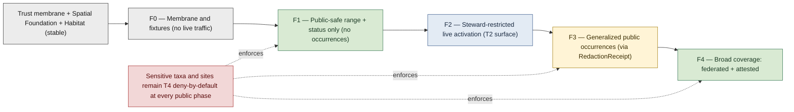
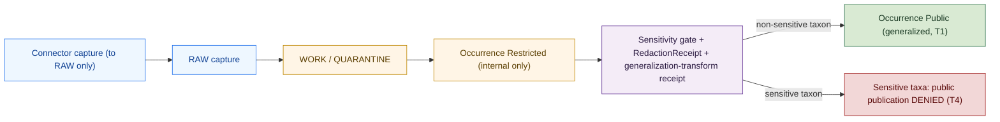

<!-- [KFM_META_BLOCK_V2]
doc_id: kfm://doc/<TODO-uuid>
title: Fauna — Expansion Plan
type: standard
version: v2
status: draft
owners: <TODO: fauna-domain-steward, security-and-privacy-reviewer, release-manager>
created: 2026-05-16
updated: 2026-06-02
policy_label: public
related:
  - docs/domains/fauna/README.md
  - docs/domains/fauna/FAUNA_DATA_LIFECYCLE.md
  - docs/domains/fauna/EXPANSION_BACKLOG.md
  - docs/domains/habitat/README.md
  - docs/domains/flora/README.md
  - docs/domains/spatial-foundation/README.md
  - docs/doctrine/lifecycle-law.md
  - docs/doctrine/trust-membrane.md
  - ai-build-operating-contract.md
  - directory-rules.md
tags: [kfm, domain, fauna, expansion, roadmap, deny-by-default, sensitive-species, T4]
notes:
  - CONTRACT_VERSION = "3.0.0".
  - Fauna sensitive occurrences default to T4 (deny-by-default) in the canonical T0–T4 Sensitivity / Rights Tier scheme (Atlas §24.5); this plan phases expansion to public surfaces.
  - The Fauna README is the field spec; this plan is the build sequence and gating logic.
  - Phase identifiers F0–F4 are LOCAL to Fauna and PROPOSED; they are an authoring device, not project-wide canon.
  - v2 reconciles the bespoke "C0–C5 / Tier 1-2-3 / L0-L1-L2" schemes (CONFLICTED) to canonical doctrine (T0–T4, build-phase roadmap, RuntimeResponseEnvelope, four finite outcomes).
  - All repository-path, schema, fixture-name, owner, and CI-target claims are PROPOSED until verified in the mounted repository.
[/KFM_META_BLOCK_V2] -->

# Fauna — Expansion Plan

> The phased rollout plan for the Fauna domain — from deny-by-default fixtures, through a generalized public surface, to broad multi-source coverage — written so the build order honors KFM's sensitive-domain doctrine.

      

> [!IMPORTANT]
> Fauna sensitive occurrences (nests / dens / roosts / hibernacula / spawning / steward-controlled) default to **T4 (Denied)** in the canonical Sensitivity / Rights Tier scheme. `[CONFIRMED — Atlas §24.5.2.]` This plan does **not** authorize live Fauna activation; it sequences the *evidence, fixtures, validators, RedactionReceipts, and steward agreements that must be in place* before activation may be approved. **No phase below grants release authority by itself** — release authority remains with the human roles and the governed promotion gates in lifecycle law. `[PROPOSED path: docs/doctrine/lifecycle-law.md.]`

> [!NOTE]
> **Truth labels.** `CONFIRMED` = verified from attached KFM doctrine this session. `PROPOSED` = design/lane-specific, not yet verified in a mounted repo. `INFERRED` = reasonably derivable from doctrine but not stated verbatim. `CONFLICTED` = a local scheme that disagrees with canonical doctrine, pending ADR/drift-register resolution. `NEEDS VERIFICATION` = checkable but unchecked.

---

**Status:** draft · **Owners:** `<TODO — fauna-domain-steward, security-and-privacy-reviewer, release-manager>` · **Last updated:** 2026-06-02 · **Contract:** `CONTRACT_VERSION = "3.0.0"`

## Quick jump

- [1. Purpose and scope](#1-purpose-and-scope)
- [2. Where this plan sits in KFM](#2-where-this-plan-sits-in-kfm)
- [3. What Fauna owns — and what it does not](#3-what-fauna-owns--and-what-it-does-not)
- [4. The expansion path at a glance](#4-the-expansion-path-at-a-glance)
- [5. Phase ladder F0 → F4](#5-phase-ladder-f0--f4)
- [6. Phase F0 — Membrane, fixtures, validators](#6-phase-f0--membrane-fixtures-validators)
- [7. Phase F1 — Public-safe proof slice (range only, no occurrences)](#7-phase-f1--public-safe-proof-slice-range-only-no-occurrences)
- [8. Phase F2 — Steward-restricted live activation](#8-phase-f2--steward-restricted-live-activation)
- [9. Phase F3 — Generalized public occurrences](#9-phase-f3--generalized-public-occurrences)
- [10. Phase F4 — Broad coverage and federation](#10-phase-f4--broad-coverage-and-federation)
- [11. Source admission roadmap](#11-source-admission-roadmap)
- [12. Validator readiness per phase](#12-validator-readiness-per-phase)
- [13. Sensitivity tier posture per phase](#13-sensitivity-tier-posture-per-phase)
- [14. Cross-lane dependencies that gate expansion](#14-cross-lane-dependencies-that-gate-expansion)
- [15. AI posture per phase](#15-ai-posture-per-phase)
- [16. Risk register](#16-risk-register)
- [17. Verification backlog](#17-verification-backlog)
- [18. Anti-patterns to reject](#18-anti-patterns-to-reject)
- [19. Acceptance checklist per phase](#19-acceptance-checklist-per-phase)
- [20. Scheme-reconciliation note (CONFLICTED items)](#20-scheme-reconciliation-note-conflicted-items)
- [21. Related docs](#21-related-docs)
- [22. Glossary and abbreviations (appendix)](#22-glossary-and-abbreviations-appendix)

---

## 1. Purpose and scope

This document is the **operational expansion plan** for the Fauna domain. It answers *"how does Fauna move from doctrine-only to a governed, public-safe surface without violating the sensitive-domain posture?"* It is intentionally narrow:

- **In scope.** Phase sequencing for Fauna; per-phase gates, fixtures, validators, source admissions, sensitivity posture, AI posture, and acceptance criteria; the cross-lane preconditions Fauna inherits from Spatial Foundation, Habitat, Flora, and the trust membrane; the risks and unknowns Fauna carries.
- **Out of scope.** Per-source ingestion code, per-validator schema layouts, per-tile cartography, per-API endpoint shapes, per-fixture file contents. Those are owned by the [`docs/domains/fauna/README.md`](./README.md) field spec, the contracts under `schemas/contracts/v1/domains/fauna/` `[PROPOSED path]`, and the per-source descriptors under `data/registry/sources/fauna/` `[PROPOSED path]`.

> [!NOTE]
> This plan describes *what the system must prove before each phase advances.* It does **not** assert any phase is currently implemented. Every "current state" claim is labeled. The phase identifiers `F0…F4` are a **PROPOSED authoring device local to this plan** — see [§20](#20-scheme-reconciliation-note-conflicted-items) for how they relate to the corpus build-phase roadmap.

[⬆ Back to top](#fauna--expansion-plan)

---

## 2. Where this plan sits in KFM

Fauna's expansion does not happen in isolation. The build order and the sensitivity posture are inherited from project-wide doctrine.

### 2.1 Build order — sensitive lanes come last

CONFIRMED doctrine: KFM builds the **governance spine and public-safe lanes first**, and stages sensitive lanes (flora / fauna / archaeology / people / infrastructure) **last**, behind default-DENY. `[CONFIRMED — Build Manual Phase 10 lane order; Atlas §21 roadmap.]` The corpus build order is, in sequence: hydrology → soil/agriculture/landcover → **habitat + fauna + flora public-safe derivatives** → atmosphere + hazards (not-alert boundary) → roads/rail + settlements → geology → archaeology (steward controls) → people/genealogy/DNA/land (living-person/DNA restrictions) → frontier panel.

> [!WARNING]
> **Fauna does not begin live activation before Spatial Foundation, Habitat, and the trust membrane are stable and proven.** `[CONFIRMED build-order intent; the exact "L1" gate label below is PROPOSED — see §2.2.]` Generalization receipts, `RedactionReceipt`s, sensitivity inheritance, and habitat covariates are all upstream of any Fauna release.

> [!CAUTION]
> **Scheme note (read before relying on tier numbers).** Earlier drafts of this plan used a "Tier 1 / Tier 2 / Tier 3" *lane-sensitivity* table and a "C0–C5 Data Classification Framework." **Neither is canonical KFM doctrine.** The canonical sensitivity scheme is the **T0–T4 Sensitivity / Rights Tier Reference** (Atlas §24.5); the canonical build ordering is the numbered build-phase roadmap (above). A separate `sensitivity_rank 0–5` rubric also exists in the corpus (public / common / watchlist / SINC / threatened-rare / sacred-critical) but is a *rank*, not an access-class scheme. This plan now uses **T0–T4** throughout. The "lane build tier" framing is retained only as an **INFERRED** convenience and is reconciled in [§20](#20-scheme-reconciliation-note-conflicted-items).

### 2.2 Phase identifiers (Fauna-local, PROPOSED)

This plan adds five **Fauna-local phases** (`F0…F4`) as an authoring device to sequence the lane's expansion honestly. They are **PROPOSED**, not project-wide canon, and they do **not** redefine any corpus vocabulary. The "L0 / L1 / L2 conformance level" labels used in earlier drafts are likewise **PROPOSED / INFERRED** — the corpus expresses maturity through numbered build phases and per-lane exit criteria, not an L0/L1/L2 scheme.

| Fauna phase (PROPOSED) | Maturity intent (INFERRED) | What the Fauna lane proves |
|---|---|---|
| **F0** | Fixture-level | Doctrine + fixtures + validators + zero public traffic. |
| **F1 → F3** | Provable public-safe trust | F1 = range/status only (no occurrences); F2 = steward-only live; F3 = generalized public occurrences. |
| **F4** | Federated + attested | Multi-source coverage, attested releases, federated correction notices. |

### 2.3 Doctrine documents Fauna inherits from

All paths below are `[PROPOSED]` until mounted-repo verification.

| Doctrine | What Fauna inherits | Path |
|---|---|---|
| Evidence-first | `EvidenceBundle` / `EvidenceRef` closure for every occurrence claim. | [`docs/doctrine/lifecycle-law.md`](../../doctrine/lifecycle-law.md) and the operating contract §20. |
| Lifecycle law | `RAW → WORK/QUARANTINE → PROCESSED → CATALOG/TRIPLET → PUBLISHED` is non-negotiable. | [`docs/doctrine/lifecycle-law.md`](../../doctrine/lifecycle-law.md) |
| Policy-aware release | Rights / source-role / sensitivity / review / release gates; finite reason codes. | operating contract §1, §23; Atlas §24.5. |
| Map-first / trust membrane | Public map surfaces consume only governed `RuntimeResponseEnvelope` payloads; sensitive geometry denied at the layer. | [`docs/doctrine/trust-membrane.md`](../../doctrine/trust-membrane.md) |
| AI as assistant | AI may summarize, never authorize; ABSTAIN on sensitivity uncertainty. | operating contract §21 (`[GAI]`). |
| Corrections first-class | Sensitivity reclassification and source-rights changes propagate through `CorrectionNotice`. | operating contract §1; Atlas §24.8. |

> [!NOTE]
> Several doctrine filenames above (`evidence-first.md`, `policy-aware.md`, `map-first.md`, `ai-as-assistant.md`, `corrections-first-class.md`) were cited in the prior draft as standalone files. Their existence and exact filenames are **NEEDS VERIFICATION** — the corresponding doctrine is CONFIRMED in `ai-build-operating-contract.md` and the Atlas, but the per-file split is not verified in a mounted repo.

[⬆ Back to top](#fauna--expansion-plan)

---

## 3. What Fauna owns — and what it does not

The expansion plan only sequences what Fauna **owns**. Boundary leakage is the most common sensitive-lane failure mode, so the boundary is restated up front.

### 3.1 Owned by Fauna

`[CONFIRMED from the Domains Culmination Atlas Fauna entry §B — the lane owns fourteen object families.]`

| Object | One-line role |
|---|---|
| `Taxon` | Canonical species record with name authority + global ID (ITIS TSN / GBIF key / equivalent). |
| `Taxon Crosswalk` | Registered authority-to-authority mapping; the **only** object that may assert name equivalence. |
| `Conservation Status` | Framework-qualified status (IUCN / USFWS ESA / state list / NatureServe G/S rank) with effective date. |
| `Occurrence Evidence` | Canonical occurrence object; never published directly if sensitive. |
| `Occurrence Restricted` | Exact-location occurrence retained internally; deny-by-default at public surfaces. |
| `Occurrence Public` | Generalized public-safe derivative; carries a `RedactionReceipt`. |
| `RangePolygon` | Range distribution polygon with authoring lineage. |
| `SeasonalRange` | Season-qualified range; never collapsed across seasons. |
| `MigrationRoute` | Movement corridor; stopover detail may be restricted. |
| `SensitiveSite` | Nest / den / roost / hibernaculum / spawning / concentration location; deny-by-default. |
| `MortalityObservation` | Mortality event with cause qualifier; never aggregated into status. |
| `DiseaseObservation` | Wildlife disease detection (CWD, HPAI, white-nose, etc.); **never** a public-health alert. |
| `Invasive Species Record` | Invasive / nonindigenous detection record. |
| `Redaction Receipt` | Public-safe transformation record for sensitive geometry/fields. |

> [!NOTE]
> Earlier drafts listed twelve owned objects and the §19 checklist said "twelve." The Atlas Fauna dossier §B owns **fourteen** (adding `Invasive Species Record` and `Redaction Receipt`). The dossier §C ubiquitous-language list also names `MonitoringEvent`, `Geoprivacy transform`, and `Public-safe derivative` as in-lane terms; whether `MonitoringEvent` is a distinct object family is NEEDS VERIFICATION.

### 3.2 Not owned by Fauna

`[CONFIRMED — explicit non-ownership from the Atlas Fauna dossier §B.]`

| Not-owned by Fauna | Owned by | Why this matters to the plan |
|---|---|---|
| Habitat classification and quality | Habitat | Fauna consumes habitat as a covariate; does not author it. |
| Plant taxa and occurrences | Flora | Crosswalks across kingdoms are explicitly forbidden. |
| Hunt regulations / harvest quotas | State wildlife agencies | KFM is not a regulatory authority. |
| Disease outbreaks framed for human public health | Public-health authorities | A `DiseaseObservation` is a wildlife observation, not a public-health alert. |

> [!CAUTION]
> A common drift mode: framing a wildlife-disease cluster ("CWD positives in unit X", "HPAI detections at site Y") as a *public-health communication.* This is a **`DENY` at the policy gate** — Fauna's `DiseaseObservation` is *observation*, not *alert*. `[CONFIRMED — Atlas Hazards/Fauna alert-authority boundary.]` The expansion plan must not breach this even informally in marketing or release notes.

[⬆ Back to top](#fauna--expansion-plan)

---

## 4. The expansion path at a glance

> The Fauna lane never collapses into a single "go-live" event. Each arrow above is gated by named acceptance criteria ([§19](#19-acceptance-checklist-per-phase)) and a `ReviewRecord` from a steward role distinct from the engineer who built the phase. `[PROPOSED implementation; the two-key review requirement is CONFIRMED doctrine — Atlas §24.7.]`

[⬆ Back to top](#fauna--expansion-plan)

---

## 5. Phase ladder F0 → F4

| Phase (PROPOSED) | One-line outcome | What is allowed to flow |
|---|---|---|
| **F0** | Fauna doctrine + fixtures + validators + zero public traffic. | Synthetic fixtures only. No connectors. |
| **F1** | Range polygons and conservation status reach the public surface; **no occurrence data, generalized or otherwise**. | `RangePolygon`, `SeasonalRange`, `Conservation Status` (sensitive stopovers withheld). |
| **F2** | Steward-only live activation: occurrences ingested live, retained internally, never public. | `Occurrence Restricted` to steward/reviewer surface only (T2). |
| **F3** | Generalized public occurrences (non-sensitive taxa only) reach the public surface via `RedactionReceipt` and generalization-transform receipt. | `Occurrence Public` for non-sensitive taxa; sensitive taxa remain in F2 posture (T4). |
| **F4** | Multi-source coverage, attested releases, federated `CorrectionNotice` feed for downstream wildlife republishers. | All Fauna objects under per-source rights; sensitive taxa still T4. |

> [!TIP]
> A public communication that claims "Fauna is live" is meaningful only when paired with a phase identifier. *"Fauna is at **F1**"* and *"Fauna is at **F3**"* describe very different public surfaces. The vocabulary above is the only correct shorthand — and `F0…F4` is local to this plan, not project canon.

[⬆ Back to top](#fauna--expansion-plan)

---

## 6. Phase F0 — Membrane, fixtures, validators

**Outcome.** The Fauna lane exists in the repository as doctrine + contracts + fixtures + validators with **no live connectors, no public route, and no real occurrence data.**

### 6.1 What F0 produces

All paths `[PROPOSED]` per Directory Rules §12 (fauna is a segment, never a root).

| Artifact | Where it lives | Status |
|---|---|---|
| Fauna README (field spec) | `docs/domains/fauna/README.md` | NEEDS VERIFICATION |
| This expansion plan | `docs/domains/fauna/EXPANSION_PLAN.md` | draft (this doc) |
| Contracts for owned objects | `contracts/domains/fauna/` (meaning) + `schemas/contracts/v1/domains/fauna/` (shape) | PROPOSED |
| Fixture set | `fixtures/domains/fauna/` | PROPOSED |
| Validator set | `tools/validators/<topic>/` (cross-cutting) or fauna-scoped tests under `tests/domains/fauna/` | PROPOSED |
| Source descriptors (no-network) | `data/registry/sources/fauna/<source-id>/` | PROPOSED |
| Policy rules for Fauna | `policy/domains/fauna/*.rego`, `policy/sensitivity/fauna/*.rego` | PROPOSED |

### 6.2 The F0 validators

`[CONFIRMED validator intents from the Atlas Fauna dossier §K; exact names/acceptance are PROPOSED.]`

| # | Validator | Subject | Acceptance | Failure (illustrative reason code) |
|---|---|---|---|---|
| 1 | Sensitive-taxon redaction test | candidate published occurrence row | row tied to a sensitive taxon resolves to generalized geometry + `RedactionReceipt` | `DENY` (sensitive exact geometry) |
| 2 | Taxon crosswalk closure test | `Taxon` + `Taxon Crosswalk` rows | every `Taxon` resolves under at least one supported authority and has a registered crosswalk where required | `DENY` (unresolved taxon) |
| 3 | Conservation status framework anti-collapse test | `Conservation Status` rows | framework is stated; not collapsed across IUCN / USFWS / state | `DENY` (framework collapse) |
| 4 | Sensitive-site denial test | `SensitiveSite` rows | no public surface returns `SensitiveSite` geometry | `DENY` (sensitive site exposed) |
| 5 | Citizen-science observer privacy test | occurrence rows from citizen-science sources | observer identifiers pseudonymized in public surfaces | `DENY` (observer identifiable) |

> [!NOTE]
> Each validator must ship with **at least one positive fixture and one negative fixture** before F0 is considered complete. `[CONFIRMED policy-doctrine rule for fixture-level conformance.]` "The validator exists" is not the bar; *"the validator denies a real failure case in CI"* is. Reason-code strings above are illustrative; the canonical reason-code vocabulary is `[PROPOSED]` pending the policy bundle.

### 6.3 What F0 does **not** authorize

- No connectors run against live endpoints.
- No `SourceRightsAssessment` is converted into a `SourceActivationDecision`.
- No public route reads from a Fauna fixture path.
- No AI Focus Mode answers a Fauna question against fixture data.

[⬆ Back to top](#fauna--expansion-plan)

---

## 7. Phase F1 — Public-safe proof slice (range only, no occurrences)

**Outcome.** The public map surface displays Fauna *range and status* — no occurrence points, no migration stopovers, no sensitive sites. This is the first phase that emits real public-facing Fauna content, and it deliberately avoids the most sensitive object families.

### 7.1 What flows in F1

| Object | Public-route disposition | Notes |
|---|---|---|
| `Taxon` | `ANSWER` via `/api/v1/fauna/taxon/{id}` `[PROPOSED route]` | Authority + global ID resolution only. |
| `Taxon Crosswalk` | `ANSWER` for non-sensitive taxa | Authority-to-authority mapping is metadata, not occurrence. |
| `Conservation Status` | `ANSWER` per registered framework | Framework named; no framework collapse permitted. |
| `RangePolygon` | `ANSWER` for non-sensitive taxa (T1 generalized) | Carries authoring lineage; `AggregationReceipt`/`RedactionReceipt` as applicable. |
| `SeasonalRange` | `ANSWER` for non-sensitive taxa (T1) | Never collapsed across seasons. |
| `MigrationRoute` | `ANSWER` with sensitive stopovers withheld | Withholding carries a `RedactionReceipt`. |
| `Occurrence *` | **not admitted to public route** | F1 does not publish occurrences. |
| `SensitiveSite` | **not admitted to public route** | Continues to `DENY` (T4 sensitive geometry). |
| `MortalityObservation` | **not admitted to public route** | Held for F3+ review (aggregated only). |
| `DiseaseObservation` | **not admitted to public route** | Held for F3+ review with explicit framing guardrails. |

### 7.2 What must be true upstream

`[CONFIRMED build-order intent; specific gate labels PROPOSED.]`

- **Spatial Foundation stable.** Generalization-transform receipts and coordinate-reference profiles are live for the Fauna geometry classes used in F1.
- **Habitat stable.** Habitat covariates referenced by `SeasonalRange` and `RangePolygon` are released.
- **Policy gate proven.** Rights / source-role / sensitivity / review / release dimensions pass for at least one Fauna fixture path.
- **Trust membrane proven.** The Evidence Drawer renders a Fauna feature click with the finite outcomes `ANSWER` / `ABSTAIN` / `DENY` / `ERROR` reachable, plus UI negative-states such as `SOURCE_STALE` / `GENERALIZED_GEOMETRY` / `RESTRICTED_ACCESS`. `[CONFIRMED — four finite outcomes; negative-states are a separate UI vocabulary, see §20.]`

### 7.3 What F1 does **not** authorize

- No occurrence data — restricted or generalized — at any public route.
- No live citizen-science observer attribution at any public route.
- No model-derived range polygon without a `ModelRunReceipt`. `[CONFIRMED requirement inherited from the Habitat domain spec.]`

[⬆ Back to top](#fauna--expansion-plan)

---

## 8. Phase F2 — Steward-restricted live activation

**Outcome.** Live connectors begin ingesting occurrence data into `Occurrence Restricted`. The data is visible **only** to authenticated stewards/reviewers on the **T2** surface (`/steward/v1/*` `[PROPOSED route]`). Nothing reaches the public surface that did not already reach it in F1.

### 8.1 Connectors that may activate at F2

`[CONFIRMED source roster from the Atlas Fauna dossier §D; activation order PROPOSED. Source roles use the canonical enum: observed | regulatory | modeled | aggregate | administrative | candidate | synthetic — Atlas §24.1.3.]`

| Source | Canonical role | Rights posture | F2 admission |
|---|---|---|---|
| GBIF / iDigBio | aggregate / observed | open; per-record license matters | yes, with per-record license honored |
| eBird | observed | Cornell Lab terms | yes, with observer pseudonymization |
| USFWS IPaC / ECOS | regulatory (authority) | public; vintaged | yes (already public, kept for completeness) |
| USGS NAS (Nonindigenous Aquatic Species) | observed | public | yes |
| Specimen records (museum / herbarium) | observed (authority) | per-institution | yes, on per-institution agreement |
| State Wildlife Agency datasets | observed / context | varies; rights `NEEDS VERIFICATION` per source | only after rights review |
| State Natural Heritage Programs | regulatory/authority (restricted) | restricted; per-state agreement | **deferred to F3+** under written agreement |

> [!WARNING]
> Live connectors are **not** activated until rights, sensitivity, activation, retry/failure, and monitoring are all in place for the specific source. `[CONFIRMED build-order rule.]` "We have the API key" is not the bar; the `SourceRightsAssessment` and `SourceActivationDecision` are. Connectors output only to `data/raw/` or `data/quarantine/` and never publish (Directory Rules connector rule).

### 8.2 What F2 produces internally

- `Occurrence Restricted` rows for non-sensitive and sensitive taxa alike — but **gated to the steward/reviewer (T2) surface**.
- A `ReleaseManifest` is **not** required for F2 internal ingestion, because nothing is being *released* — but `SourceIntakeRecord`, `TransformReceipt`, and `ValidationReport` artifacts are still mandatory. `[CONFIRMED lifecycle-law shape.]`
- Steward-console UI showing `Occurrence Restricted` with a clear T2 badge and policy posture in the Evidence Drawer. `[CONFIRMED drawer rule — exact coordinates of sensitive features do not enter any public response payload.]`

### 8.3 What F2 does **not** authorize

- No public route reads `Occurrence Restricted` under any circumstance.
- No AI Focus Mode summarizes occurrence data — sensitive or otherwise — on the public surface. AI may operate against `RangePolygon` / `Conservation Status` only.

[⬆ Back to top](#fauna--expansion-plan)

---

## 9. Phase F3 — Generalized public occurrences

**Outcome.** Non-sensitive taxa get an `Occurrence Public` derivative on the public surface — geometry obscured per a generalization-transform receipt, redactions recorded per a `RedactionReceipt`. Sensitive taxa remain in the F2 posture (steward-only, T4).

### 9.1 The F3 promotion pipeline

> The diagram is illustrative; canonical pipeline stage names are `RAW → WORK/QUARANTINE → PROCESSED → CATALOG/TRIPLET → PUBLISHED`. `[CONFIRMED lifecycle-stage vocabulary.]` Promotion is a governed state transition, not a file move.

### 9.2 What is required before F3 can begin

| Precondition | Why it is required |
|---|---|
| Sensitive-taxon registry exists and aligns with Natural Heritage Program agreements. | F3 publishes *non*-sensitive occurrences; the registry is what distinguishes them. `[CONFIRMED verification item.]` |
| `RedactionReceipt` schema accepted and produced end-to-end. | Every generalized occurrence carries one. `[CONFIRMED verification item.]` |
| Generalization-transform receipt schema accepted; transforms reproducible. | Inherited from Spatial Foundation. `[CONFIRMED inherited rule.]` |
| `Taxon Crosswalk` completeness across primary authorities documented. | A taxon whose authority cannot be resolved cannot be published. `[CONFIRMED verification item.]` |
| Citizen-science observer-privacy pipeline verified. | Pseudonymization is a public-surface invariant. `[CONFIRMED validator scope.]` |

### 9.3 What F3 still does **not** authorize

- Exact occurrence geometry on any public surface — even for "abundant" species — unless a specific source's `SourceRightsAssessment` allows it *and* the sensitivity gate clears. `[CONFIRMED policy posture.]`
- Publication of `SensitiveSite`, `MigrationRoute` stopover detail, or `MortalityObservation` aggregated into a status-like assertion.
- Public-health framing of `DiseaseObservation`. `[CONFIRMED — wildlife-disease detection is not a public-health alert.]`

[⬆ Back to top](#fauna--expansion-plan)

---

## 10. Phase F4 — Broad coverage and federation

**Outcome.** Fauna reaches a federated, attested maturity for the parts of the lane individually proven through F1–F3: multi-source coverage with cryptographic attestation on the release/proof artifacts, machine-readable `CorrectionNotice` feeds, and multi-party approval on release-significant Fauna changes.

### 10.1 What federation adds for Fauna specifically

`[CONFIRMED vocabulary; per-lane implementation PROPOSED.]`

| Federation capability | Fauna-specific implication |
|---|---|
| Signed release/proof attestations (`RunReceipt` DSSE-signed, attestation_ref resolves) | Downstream wildlife republishers can verify a Fauna release was reviewed and not silently altered. |
| Machine-readable `CorrectionNotice` feed | Sensitivity reclassification of a taxon (listing change, agreement change) propagates to downstream consumers without manual re-fetching. |
| Multi-party approval on release-significant actions (two-key) | Adding a new sensitive-taxa source, or changing the redaction transform, requires two distinct human roles to sign. `[CONFIRMED — Atlas §24.7.]` |
| Reproducible builds | A re-built Fauna release at a given version reproduces the same `spec_hash`. |

### 10.2 What F4 still does **not** change

- The sensitivity tier scheme. **T4 remains T4**; federation does not lower its posture.
- Cross-kingdom equivalence. A Fauna `Taxon` and a Flora plant taxon are never reconciled by a shared crosswalk. `[CONFIRMED ownership boundary.]`
- The disease-observation framing rule. Federation does not turn `DiseaseObservation` into a public-health alert under any circumstance. `[CONFIRMED.]`

[⬆ Back to top](#fauna--expansion-plan)

---

## 11. Source admission roadmap

Source admission is the most common path by which a sensitive-lane expansion drifts. The plan below is **deliberately conservative** — each source is admitted only at the earliest phase whose posture matches its rights and sensitivity profile.

| Source | Canonical role | Earliest admission | Rationale | Status |
|---|---|---|---|---|
| USFWS IPaC / ECOS | regulatory (authority) | **F0** (fixture) → **F1** (live, public) | Public regulatory authority; ESA listing + critical habitat boundaries. | `CONFIRMED public; vintaged.` |
| USGS NAS | observed | **F0** (fixture) → **F2** (live, internal) → **F3** (generalized public) | Public invasive-aquatic occurrences. | `CONFIRMED public.` |
| GBIF / iDigBio | aggregate / observed | **F2** (live, internal) → **F3** (generalized public per per-record license) | Aggregator; per-record license must be honored. | `CONFIRMED open; per-record license matters.` |
| eBird | observed | **F2** (live, internal) → **F3** (generalized public with observer pseudonymization) | Cornell Lab terms; observer-privacy gate. | `CONFIRMED Cornell Lab terms.` |
| Specimen records (museum / herbarium) | observed (authority) | **F2** (live, internal per institution agreement) → **F3** (generalized public per agreement) | Per-institution rights vary. | `NEEDS VERIFICATION per institution.` |
| State Wildlife Agency datasets | observed / context | **F2 or later**, only with rights review | Surveys, harvest, disease surveillance; rights vary. | `NEEDS VERIFICATION per source.` |
| State Natural Heritage Programs | regulatory/authority (restricted) | **F2 (steward-only)**; never in public surface beyond what the agreement permits | Element occurrence records, deny-by-default exact location. | `CONFIRMED restricted; per-state agreement.` |

> [!CAUTION]
> The temptation to admit a Natural Heritage Program feed "because it's authoritative" is the canonical sensitive-lane failure mode. **Authority does not relax sensitivity.** A more authoritative source for a sensitive taxon is a *higher-care* obligation, not a lower one. `[CONFIRMED doctrine posture.]`

[⬆ Back to top](#fauna--expansion-plan)

---

## 12. Validator readiness per phase

| Validator | F0 | F1 | F2 | F3 | F4 |
|---|:--:|:--:|:--:|:--:|:--:|
| 1. Sensitive-taxon redaction test | ✓ (fixture) | ✓ | ✓ | ✓ + live | ✓ + attested |
| 2. Taxon crosswalk closure test | ✓ (fixture) | ✓ | ✓ | ✓ | ✓ + attested |
| 3. Conservation status framework anti-collapse | ✓ (fixture) | ✓ | ✓ | ✓ | ✓ + attested |
| 4. Sensitive-site denial test | ✓ (fixture) | ✓ | ✓ | ✓ | ✓ + attested |
| 5. Citizen-science observer-privacy test | ✓ (fixture) | n/a | ✓ | ✓ | ✓ + attested |

> "✓ (fixture)" means the validator runs against synthetic data. "✓" means it runs against the live ingested data at that phase. "✓ + attested" means the validator result becomes part of a signed release attestation. `[PROPOSED implementation; vocabulary CONFIRMED.]`

[⬆ Back to top](#fauna--expansion-plan)

---

## 13. Sensitivity tier posture per phase

The sensitivity scheme is the canonical **T0–T4 Sensitivity / Rights Tier Reference** (Atlas §24.5). `[CONFIRMED.]` This table fixes how each Fauna object class is handled at each phase. (For the relationship to the corpus `sensitivity_rank 0–5` rubric and the retired "C0–C5" labels, see [§20](#20-scheme-reconciliation-note-conflicted-items).)

| Fauna class → tier | F0 | F1 | F2 | F3 | F4 |
|---|---|---|---|---|---|
| `Taxon` / `Taxon Crosswalk` / `Conservation Status` — **T0** | fixture | public via API | public via API | public via API | public + attested |
| `RangePolygon` / `SeasonalRange` / `MigrationRoute` — **T1 generalized** | fixture | public (generalized; sensitive stopovers withheld) | public | public | public + attested |
| `Occurrence Restricted` — **T2 reviewer/steward** | fixture | n/a | steward console | steward console | steward console + attested |
| `Occurrence Public` (non-sensitive) — **T1 via RedactionReceipt** | fixture | n/a | n/a | generalized public | generalized public + attested |
| Sensitive occurrence / `SensitiveSite` — **T4 denied** | fixture | `DENY` at public | `DENY` at public; steward-only with authorization | `DENY` at public exact; generalized T1 derivative only after review | unchanged at T4 |
| `MortalityObservation` / `DiseaseObservation` — **T1 aggregated** | fixture | n/a | steward console | aggregated public (no public-health framing) | aggregated public + attested |

> [!IMPORTANT]
> The doctrine answer to *"may we publish a generalized version of a T4 sensitive-taxon occurrence?"* is **only with all of**: (a) `RedactionReceipt`, (b) generalization-transform receipt, (c) `ReviewRecord` by a steward role with explicit authorization, and (d) the underlying `SourceRightsAssessment` permitting that generalization. The absence of any one is a `DENY`. `[CONFIRMED rule structure — Atlas §24.5.3 T4 → T1 transition requires RedactionReceipt + ReviewRecord + PolicyDecision.]`

[⬆ Back to top](#fauna--expansion-plan)

---

## 14. Cross-lane dependencies that gate expansion

Fauna is a **downstream consumer** in the lane dependency graph. The lanes below must be stable and proven before Fauna may advance to the corresponding phase.

| Upstream lane | Must be proven for | Why |
|---|---|---|
| Spatial Foundation (CRS, GeographyVersion, generalization-transform receipts) | **F1** | All Fauna geometry transformations cite Spatial Foundation receipts. `[CONFIRMED cross-lane edge.]` |
| Habitat (covariates released; sensitivity inheritance wired) | **F1** | `RangePolygon` and `SeasonalRange` consume habitat covariates; sensitivity propagation must flow correctly. `[CONFIRMED cross-lane edge.]` |
| Trust membrane (policy gate, evidence resolver, finite outcomes) | **F1** | The Evidence Drawer must round-trip a Fauna feature click with `ANSWER` / `ABSTAIN` / `DENY` / `ERROR` reachable. `[CONFIRMED.]` |
| Hazards (framing guardrails) | **F2** (for `DiseaseObservation` capture) | Wildlife-disease ingestion is allowed only when the public-health framing guardrail is provably enforced. `[CONFIRMED rule.]` |
| Atmosphere / Air (weather covariates released) | **F2** (for migration/phenology context) | Covariate use never re-authors weather observations. `[CONFIRMED rule.]` |
| People / DNA / Land (observer-attribution privacy gate proven) | **F2** (for citizen-science live) | Observer identity is a separate privacy concern from occurrence privacy. `[CONFIRMED rule.]` |

[⬆ Back to top](#fauna--expansion-plan)

---

## 15. AI posture per phase

`[CONFIRMED — AI rules from the Atlas Fauna dossier §L and `[GAI]`.]` AI is an assistant, not an authority. The phase-by-phase posture below is **a tightening**, not a permission ladder: AI may do *less* against Fauna than against public-safe lanes, even at federation.

| Phase | What AI MAY do | What AI MUST ABSTAIN on | What AI MUST DENY |
|---|---|---|---|
| **F0** | Nothing against real data. May summarize *fixtures* for internal review. | Anything that crosses the trust membrane. | Anything that would imply a Fauna claim against live data. |
| **F1** | Summarize public `RangePolygon` / `SeasonalRange` / `Conservation Status`. Explain framework semantics. | Where the taxon's sensitivity is uncertain or its crosswalk unresolved. | Any request that would resolve exact sensitive-site geometry. |
| **F2** | Nothing additional on the public surface (steward console out of scope here). | Same as F1 on the public surface. | Same as F1 on the public surface. |
| **F3** | F1 capabilities + describing generalized `Occurrence Public` distributions. | Where the rare-taxon flag or sensitivity is unresolved. | Exact occurrence geometry; any request that would resolve a sensitive site via habitat proxy. |
| **F4** | F3 capabilities + describing source-coverage and correction history. | Same as F3, plus where attestation is missing or stale. | Same as F3. |

> [!IMPORTANT]
> AI must **never emit a `PolicyDecision`, `ReviewRecord`, or sensitivity classification for Fauna.** Those are human-role outputs. AI answers resolve to the four finite outcomes (`ANSWER` / `ABSTAIN` / `DENY` / `ERROR`) carried in a `RuntimeResponseEnvelope` with an `AIReceipt`. `[CONFIRMED — AI-as-assistant doctrine; operating contract §21.]`

[⬆ Back to top](#fauna--expansion-plan)

---

## 16. Risk register

| ID | Risk | Likelihood | Impact | Mitigation | Status |
|---|---|---|---|---|---|
| FAU-R-01 | A Natural Heritage Program feed is admitted with exact geometry before agreement is in writing. | medium | severe (legal + ethical) | F2 admission gate requires written per-state agreement; CI fails if agreement record is missing. | PROPOSED mitigation |
| FAU-R-02 | A `DiseaseObservation` is framed in a public release note as a "public-health alert." | medium | severe (regulatory + trust) | Release-note linting rejects public-health framing on Fauna lane; `ReviewRecord` required. | PROPOSED mitigation |
| FAU-R-03 | A citizen-science observer is identifiable via an occurrence published at F3. | medium | high (privacy) | Validator 5 + cross-lane review with People / DNA / Land at F2. | CONFIRMED validator intent; coverage NEEDS VERIFICATION |
| FAU-R-04 | A sensitive taxon's exact occurrence leaks via *habitat proxy* — a habitat polygon so narrow it implies the location. | medium | severe | Sensitive-species inheritance test on Habitat (cross-lane); AI must DENY habitat-proxy resolution. | CONFIRMED rule; CI coverage NEEDS VERIFICATION |
| FAU-R-05 | A `Taxon Crosswalk` collision (two authorities asserting equivalent names the project treats as distinct). | low | moderate (data quality) | Crosswalk closure test (Validator 2); steward review on conflicts. | PROPOSED |
| FAU-R-06 | Conservation Status frameworks collapsed across IUCN / USFWS / state in a UI summary. | medium | moderate (truth) | Framework anti-collapse test (Validator 3); microcopy guidance in the Evidence Drawer. | PROPOSED |
| FAU-R-07 | A wildlife disease cluster triggers external media interpretation as a public-health story. | medium | high (reputational) | Release-note framing rules; steward response runbook. | NEEDS VERIFICATION runbook |
| FAU-R-08 | A non-canonical sensitivity scheme (the retired "C0–C5") re-enters policy or validators and diverges from T0–T4. | medium | high (governance) | Reconcile to T0–T4 ([§20](#20-scheme-reconciliation-note-conflicted-items)); drift-register entry; ADR-S-05 tracks tier adoption. | PROPOSED mitigation |

[⬆ Back to top](#fauna--expansion-plan)

---

## 17. Verification backlog

Open `NEEDS VERIFICATION` items inherited from the Atlas Fauna dossier §N plus scheme-reconciliation items added in v2. The plan cannot advance past F0 on any of them until resolved.

| # | Item | Where it must show up | Status |
|---|---|---|---|
| 1 | Verify sensitive-taxon registry and Natural Heritage agreement scope. | registry artifact, written per-state agreements, validator coverage | `NEEDS VERIFICATION` |
| 2 | Verify `Taxon Crosswalk` completeness across primary authorities (ITIS / GBIF / equivalents). | crosswalk artifacts, coverage report | `NEEDS VERIFICATION` |
| 3 | Verify `RedactionReceipt` schema and propagation. | schema, propagation tests | `NEEDS VERIFICATION` |
| 4 | Verify per-source rights for State Wildlife Agency datasets. | per-source `SourceRightsAssessment` | `NEEDS VERIFICATION` |
| 5 | Verify per-institution rights for Specimen records. | per-institution agreement, descriptor | `NEEDS VERIFICATION` |
| 6 | Verify release-note framing-linter rule set rejects public-health framing on `DiseaseObservation`. | linter rule, fixtures | `NEEDS VERIFICATION` |
| 7 | Verify the steward runbook for wildlife-disease media response. | runbook artifact, rehearsal record | `NEEDS VERIFICATION` |
| 8 | Reconcile the retired "C0–C5 framework" and the "Tier 1/2/3 lane table" to canonical T0–T4 + build-phase roadmap; confirm validators/policy reference T0–T4 only. | drift-register entry, policy bundle, ADR-S-05 | `NEEDS VERIFICATION` |
| 9 | Confirm doctrine filenames (`evidence-first.md` etc.) and the canonical envelope name (`RuntimeResponseEnvelope` vs lane `FaunaDecisionEnvelope`). | mounted `docs/doctrine/`, `schemas/contracts/v1/runtime/`, migration ADR | `NEEDS VERIFICATION` |

[⬆ Back to top](#fauna--expansion-plan)

---

## 18. Anti-patterns to reject

Each row below is a `DENY` outcome, not a stylistic preference.

| Anti-pattern | Why rejected | Corrective doctrine line |
|---|---|---|
| Publishing exact `SensitiveSite` geometry "because the species isn't on the federal list this year." | State and Natural Heritage classifications may still apply; framework collapse is not allowed. | Validator 3 + [§13](#13-sensitivity-tier-posture-per-phase). |
| Treating "abundant" species as automatically public-occurrence-safe. | Per-record license still governs; observer-privacy still applies. | [§11](#11-source-admission-roadmap). |
| Crosswalking a `Taxon` (animal) with a Flora plant taxon. | Cross-kingdom equivalence is forbidden. | [§3.2](#32-not-owned-by-fauna). |
| Letting AI emit a sensitivity classification for a newly observed taxon. | AI is assistant, not authority. | [§15](#15-ai-posture-per-phase). |
| Promoting `Occurrence Restricted` directly to `Occurrence Public` without `RedactionReceipt` and generalization-transform receipt. | Skips the sensitivity gate. | [§9.1](#91-the-f3-promotion-pipeline). |
| Framing a `DiseaseObservation` cluster as a public-health alert in a release note. | Public-health authority is not KFM's. | [§3.2](#32-not-owned-by-fauna); FAU-R-02. |
| Citing an `Occurrence Public` row's exact-looking coordinates as evidence in an AI Focus Mode answer. | Exact coordinates do not enter the public response payload. | Evidence Drawer rule; [§15](#15-ai-posture-per-phase). |
| Hot-fixing a sensitivity reclassification by editing the registry in place. | Sensitivity changes flow through `CorrectionNotice` + superseding release. | Corrections-first-class doctrine. |
| Adding a Natural Heritage Program feed at F1 "because the proof slice needs more species." | F1 publishes range and status only; live occurrences arrive no earlier than F2. | [§5](#5-phase-ladder-f0--f4) + [§11](#11-source-admission-roadmap). |
| Trust-badging a `RangePolygon` as `ANSWER` when its model has no `ModelRunReceipt`. | Model lineage is mandatory for any model-derived public claim. | Inherited Habitat rule. |
| Introducing a non-canonical sensitivity scheme (the retired "C0–C5") into policy or UI. | Parallel authority breaks audit/rollback; canonical scheme is T0–T4. | [§20](#20-scheme-reconciliation-note-conflicted-items); FAU-R-08. |

[⬆ Back to top](#fauna--expansion-plan)

---

## 19. Acceptance checklist per phase

Each phase advances only when **every applicable item** below is checked.

### 19.1 F0 — acceptance

- [ ] [`docs/domains/fauna/README.md`](./README.md) exists with the field spec from the Atlas Fauna dossier. `[PROPOSED path]`
- [ ] [`docs/domains/fauna/EXPANSION_PLAN.md`](./EXPANSION_PLAN.md) (this doc) exists.
- [ ] Contracts for all **fourteen** owned objects exist under `contracts/domains/fauna/` (meaning) and `schemas/contracts/v1/domains/fauna/` (shape). `[PROPOSED path]`
- [ ] Fixture set covers every owned object family.
- [ ] Five validators implemented; each has at least one positive and one negative fixture.
- [ ] Policy rules for Fauna implemented with positive + negative fixtures, referencing the canonical T0–T4 scheme.
- [ ] No-network CI green for Fauna.
- [ ] No public route reads Fauna fixtures.

### 19.2 F1 — acceptance

- [ ] All F0 items still pass.
- [ ] Spatial Foundation stable and proven for the F1 geometry classes.
- [ ] Habitat stable and proven for the consumed covariates.
- [ ] Public route serves `Taxon` / `Taxon Crosswalk` / `Conservation Status` / `RangePolygon` / `SeasonalRange` / `MigrationRoute` (sensitive stopovers withheld).
- [ ] Evidence Drawer round-trips a Fauna feature click; all four finite outcomes (`ANSWER` / `ABSTAIN` / `DENY` / `ERROR`) reachable; negative-states surface correctly. `[CONFIRMED four finite outcomes.]`
- [ ] Validators 1–4 run live; observer-privacy validator (5) remains fixture-only.
- [ ] AI Focus Mode answers only against F1-admitted objects.

### 19.3 F2 — acceptance

- [ ] All F1 items still pass.
- [ ] At least one live connector active with `SourceRightsAssessment` + `SourceActivationDecision` recorded.
- [ ] `Occurrence Restricted` accessible **only** via the steward/reviewer (T2) console.
- [ ] Citizen-science observer-privacy validator runs live on ingested rows.
- [ ] Day-2 runbook for source-failure rehearsed at least once.
- [ ] Steward `ReviewRecord` exists for the F2 advancement (author ≠ release authority).

### 19.4 F3 — acceptance

- [ ] All F2 items still pass.
- [ ] Sensitive-taxon registry exists and is aligned with written agreements.
- [ ] `RedactionReceipt` and generalization-transform receipt produced end-to-end.
- [ ] `Occurrence Public` published only for non-sensitive taxa.
- [ ] Sensitive-species habitat-proxy inheritance test passes on the Habitat side.
- [ ] Wildlife-disease framing linter rejects public-health framing.

### 19.5 F4 — acceptance

- [ ] All F3 items still pass.
- [ ] Release/proof attestations signed for Fauna releases (`RunReceipt` DSSE-signed; attestation resolves).
- [ ] Machine-readable `CorrectionNotice` feed live for Fauna sensitivity reclassifications.
- [ ] Two-key multi-party approval enforced on release-significant Fauna actions.
- [ ] Reproducible build verified (`spec_hash` reproduces) for at least one Fauna release.

[⬆ Back to top](#fauna--expansion-plan)

---

## 20. Scheme-reconciliation note (CONFLICTED items)

This plan previously used three local schemes that do **not** match canonical KFM doctrine. They are reconciled here; the canonical forms govern.

| Local scheme (prior draft) | Canonical doctrine | Disposition |
|---|---|---|
| **"C0–C5 Data Classification Framework"** (Public-safe / Steward-only / Admin-only / Restricted-by-rights / Sensitive-deny / Forbidden-from-storage) | **T0–T4 Sensitivity / Rights Tier Reference** (Open / Generalized / Reviewer / Restricted / Denied) — Atlas §24.5. | **CONFLICTED → use T0–T4.** The "C0–C5" framework was stamped CONFIRMED in the prior draft but is **not present in the corpus**. A separate corpus artifact, the `sensitivity_rank 0–5` rubric (0 public / 1 common / 2 watchlist / 3 SINC / 4 threatened-rare / 5 sacred-critical, Pass-10 C6-01), is a *rank*, not an audience access-class, and must not be conflated with either scheme. Drift-register entry + ADR-S-05 track adoption. |
| **"Tier 1 / Tier 2 / Tier 3" lane-sensitivity table** | Numbered **build-phase roadmap** (Build Manual Phase 10; Atlas §21): hydrology → soil/ag → habitat+fauna+flora → … → archaeology → people/DNA. | **CONFLICTED → INFERRED convenience only.** No "Lane Sensitivity Tier table" exists in the corpus; the build-order *intent* (sensitive lanes last) is CONFIRMED, but the Tier-1/2/3 labels are not canon. |
| **"L0 / L1 / L2 conformance levels"** | Corpus expresses maturity via numbered build phases and per-lane exit criteria. | **PROPOSED / INFERRED.** No L0/L1/L2 scheme is verified in the corpus; treat as authoring shorthand. |
| **`DecisionEnvelope`** | **`RuntimeResponseEnvelope`** (operating contract §9/§21). | **Migrating.** `DecisionEnvelope` is the older name; the active `DecisionEnvelope → RuntimeResponseEnvelope` migration governs. The lane alias `FaunaDecisionEnvelope` (Atlas §7 J) is likewise slated for retirement. |
| **"Five finite outcomes" incl. `STALE`** | **Four finite outcomes:** `ANSWER` / `ABSTAIN` / `DENY` / `ERROR` (optional extensions `NARROWED` / `BOUNDED`). `SOURCE_STALE` is a **UI negative-state**, not a finite outcome. | **Corrected.** Stale evidence resolves to `ABSTAIN` (or `SOURCE_STALE` as a UI negative-state), not a fifth finite outcome. |
| **`RollbackPlan`** | **`RollbackCard`** is the corpus receipt name (with `RollbackPlan` used loosely). | **Use `RollbackCard`** as the artifact; `RollbackPlan` acceptable as prose for the pre-authored reversion path. |

> [!IMPORTANT]
> These corrections matter because a **parallel sensitivity authority breaks audit and rollback** (Directory Rules anti-patterns; operating contract failure rule). Policy bundles, validators, and UI for Fauna MUST reference the canonical **T0–T4** scheme and the four finite outcomes — not the retired local schemes above.

[⬆ Back to top](#fauna--expansion-plan)

---

## 21. Related docs

- [`docs/domains/fauna/README.md`](./README.md) — Fauna field spec. `[PROPOSED path; existence NEEDS VERIFICATION]`
- [`docs/domains/fauna/FAUNA_DATA_LIFECYCLE.md`](./FAUNA_DATA_LIFECYCLE.md) — Fauna lifecycle companion. `[PROPOSED path]`
- [`docs/domains/fauna/EXPANSION_BACKLOG.md`](./EXPANSION_BACKLOG.md) — Fauna backlog register. `[PROPOSED path]`
- [`docs/domains/habitat/README.md`](../habitat/README.md) — upstream covariate lane. `[PROPOSED path]`
- [`docs/domains/flora/README.md`](../flora/README.md) — sibling sensitive-occurrence lane. `[PROPOSED path]`
- [`docs/domains/spatial-foundation/README.md`](../spatial-foundation/README.md) — owns CRS, GeographyVersion, generalization receipts. `[PROPOSED path]`
- [`docs/doctrine/lifecycle-law.md`](../../doctrine/lifecycle-law.md) — `RAW → WORK/QUARANTINE → PROCESSED → CATALOG/TRIPLET → PUBLISHED`. `[PROPOSED path]`
- [`docs/doctrine/trust-membrane.md`](../../doctrine/trust-membrane.md) — public surfaces consume governed APIs only. `[PROPOSED path]`
- [`ai-build-operating-contract.md`](../../../ai-build-operating-contract.md) — `CONTRACT_VERSION = "3.0.0"`; T0–T4, finite outcomes, `RuntimeResponseEnvelope`.
- [`directory-rules.md`](../../../directory-rules.md) — placement (§12), anti-patterns (§13), README contract (§9).
- The doctrine files `evidence-first.md` / `policy-aware.md` / `map-first.md` / `ai-as-assistant.md` / `corrections-first-class.md` cited in the prior draft are `[NEEDS VERIFICATION]` as standalone files; their content is CONFIRMED in the operating contract and Atlas.

[⬆ Back to top](#fauna--expansion-plan)

---

## 22. Glossary and abbreviations (appendix)

<b>Acronyms used in this plan</b>

| Abbreviation | Expansion |
|---|---|
| CWD | Chronic Wasting Disease |
| eDNA | Environmental DNA |
| ESA | Endangered Species Act (United States) |
| GBIF | Global Biodiversity Information Facility |
| HPAI | Highly Pathogenic Avian Influenza |
| iDigBio | Integrated Digitized Biocollections |
| IUCN | International Union for Conservation of Nature |
| ITIS | Integrated Taxonomic Information System |
| NAS | Nonindigenous Aquatic Species (USGS) |
| TSN | Taxonomic Serial Number (ITIS identifier) |
| USFWS | United States Fish and Wildlife Service |
| USGS | United States Geological Survey |

> Abbreviations are provided for reader convenience; their expansion is generally accepted in the field and is not a KFM-internal definition.

<b>KFM vocabulary used in this plan</b>

| Term | Meaning |
|---|---|
| `EvidenceBundle` | The closure container that resolves every public claim to its source artifacts. |
| `EvidenceRef` | A stable reference that must resolve to an `EvidenceBundle` before public claim authority. |
| `RuntimeResponseEnvelope` | The finite, governed runtime response shape (`ANSWER` / `ABSTAIN` / `DENY` / `ERROR`, optional `NARROWED` / `BOUNDED`). Replaces the older `DecisionEnvelope`. |
| `SourceDescriptor` | The declared identity, role (canonical enum), rights, sensitivity, and cadence of an upstream source. |
| `SourceRightsAssessment` | The human-role determination of what may be done with a source's data. |
| `SourceActivationDecision` | The human-role decision to move a source from fixture-only to live. |
| `SourceIntakeRecord` / `TransformReceipt` / `ValidationReport` | Lifecycle artifacts that close audit on promotion events. |
| generalization-transform receipt | Records the parameters of geometric generalization for sensitive features. |
| `RedactionReceipt` | Records the public-safe transformation/withholding of a sensitive geometry or field. |
| `ReleaseManifest` / `RunReceipt` (DSSE-signed) / `ReviewRecord` | Release-time artifacts that close audit on publication. |
| `CorrectionNotice` | First-class object for sensitivity reclassification, source-rights changes, and superseding releases. |
| `RollbackCard` | The recorded rollback decision and targeted prior release (pre-authored, rehearsed reversion path). |
| `ANSWER` / `ABSTAIN` / `DENY` / `ERROR` | The four finite outcomes any governed surface may emit. `SOURCE_STALE`, `GENERALIZED_GEOMETRY`, `RESTRICTED_ACCESS`, `CITATION_FAILED` are **UI negative-states**, not finite outcomes. |
| T0–T4 | The canonical Sensitivity / Rights Tier scheme (Open / Generalized / Reviewer / Restricted / Denied). |
| `CONFIRMED` / `PROPOSED` / `INFERRED` / `CONFLICTED` / `NEEDS VERIFICATION` / `UNKNOWN` | Truth labels used throughout KFM documentation. |
| `RAW → WORK/QUARANTINE → PROCESSED → CATALOG/TRIPLET → PUBLISHED` | The lifecycle-stage invariant. |

<b>Fauna-local phase identifiers (PROPOSED)</b>

`F0` — Membrane and fixtures. No live connectors. No public route.

`F1` — Public-safe proof slice: `Taxon` / `Taxon Crosswalk` / `Conservation Status` / `RangePolygon` / `SeasonalRange` / `MigrationRoute` (sensitive stopovers withheld). No occurrences.

`F2` — Steward-restricted live activation: occurrences flow into `Occurrence Restricted`; visible only on the steward/reviewer (T2) console.

`F3` — Generalized public occurrences for non-sensitive taxa via `RedactionReceipt` + generalization-transform receipt.

`F4` — Broad coverage + federation: multi-source coverage with signed attestations, federated `CorrectionNotice`, two-key approval.

> `F0…F4` are a PROPOSED authoring device local to this plan; they are not project-wide canon and do not redefine the corpus build-phase roadmap.

[⬆ Back to top](#fauna--expansion-plan)

---

**Related docs:** [Fauna README](./README.md) `[PROPOSED]` · [Fauna Lifecycle](./FAUNA_DATA_LIFECYCLE.md) `[PROPOSED]` · [Fauna Backlog](./EXPANSION_BACKLOG.md) `[PROPOSED]` · [Habitat README](../habitat/README.md) `[PROPOSED]` · [Spatial Foundation README](../spatial-foundation/README.md) `[PROPOSED]` · [lifecycle-law.md](../../doctrine/lifecycle-law.md) · [trust-membrane.md](../../doctrine/trust-membrane.md) · [ai-build-operating-contract.md](../../../ai-build-operating-contract.md)

**Last updated:** 2026-06-02 · **Version:** v2 (draft) · **Status:** awaiting steward and security review

[⬆ Back to top](#fauna--expansion-plan)
