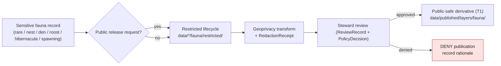
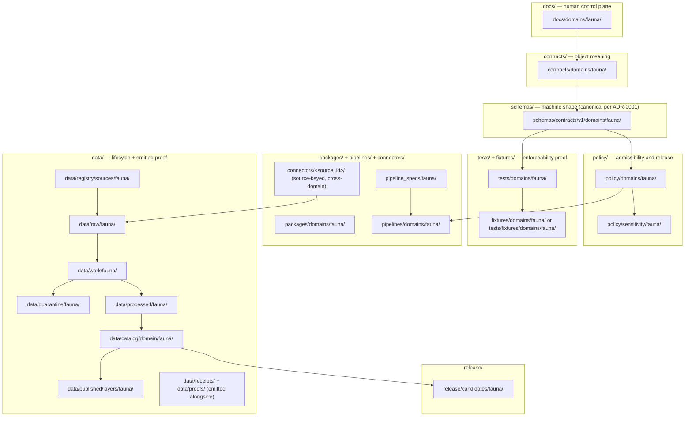

<!-- [KFM_META_BLOCK_V2]
doc_id: kfm://doc/fauna-file-system-plan
title: Fauna Domain — File System Plan
type: standard
version: v2
status: draft
owners: <fauna-lane-steward> + <directory-rules-steward>  # PLACEHOLDER
created: 2026-05-16
updated: 2026-06-02
policy_label: public
related:
  - docs/domains/fauna/README.md
  - docs/domains/fauna/FAUNA_DATA_LIFECYCLE.md
  - docs/domains/fauna/EXPANSION_BACKLOG.md
  - docs/domains/fauna/EXPANSION_PLAN.md
  - docs/standards/PROV.md
  - docs/standards/PMTILES.md
  - docs/runbooks/fauna/SOURCE_REFRESH_RUNBOOK.md
  - directory-rules.md
  - ai-build-operating-contract.md
tags: [kfm, domain, fauna, directory-rules, placement, sensitivity, geoprivacy]
notes:
  - CONTRACT_VERSION = "3.0.0".
  - Derived from Directory Rules §4 placement protocol and §12 Domain Placement Law.
  - Directory Rules section numbers vary by version (v1.2/v1.3); section pointers here are NEEDS VERIFICATION against the mounted edition.
  - Repo-state claims remain PROPOSED until mounted-repo inspection.
[/KFM_META_BLOCK_V2] -->

# Fauna Domain — File System Plan

> Where every fauna file lives, under which responsibility root, with which lifecycle, and with which sensitivity controls — derived from Directory Rules and KFM fauna doctrine.


**Status:** Draft &nbsp;·&nbsp; **Owners:** `<fauna-lane-steward>` + `<directory-rules-steward>` *(placeholder)* &nbsp;·&nbsp; **Last updated:** 2026-06-02 &nbsp;·&nbsp; **Contract:** `CONTRACT_VERSION = "3.0.0"`

---

## Quick jump

- [1. Scope and intent](#1-scope-and-intent)
- [2. Doctrinal basis](#2-doctrinal-basis)
- [3. Sensitivity invariant (read this first)](#3-sensitivity-invariant-read-this-first)
- [4. Fauna lane map across responsibility roots](#4-fauna-lane-map-across-responsibility-roots)
- [5. Per-root placement tables](#5-per-root-placement-tables)
- [6. Lifecycle layout under `data/`](#6-lifecycle-layout-under-data)
- [7. Sources, connectors, and source-role placement](#7-sources-connectors-and-source-role-placement)
- [8. Object families × responsibility roots](#8-object-families--responsibility-roots)
- [9. Public-safe vs restricted artifact placement](#9-public-safe-vs-restricted-artifact-placement)
- [10. Cross-lane and shared placements](#10-cross-lane-and-shared-placements)
- [11. Validators, tests, and fixtures layout](#11-validators-tests-and-fixtures-layout)
- [12. Catalog, release, registry, and rollback layout](#12-catalog-release-registry-and-rollback-layout)
- [13. Anti-patterns specific to the fauna lane](#13-anti-patterns-specific-to-the-fauna-lane)
- [14. Placement protocol cheat sheet](#14-placement-protocol-cheat-sheet)
- [15. Open questions and verification backlog](#15-open-questions-and-verification-backlog)
- [16. Related docs](#16-related-docs)

---

## 1. Scope and intent

This file is the **placement plan** for the Fauna domain inside the KFM monorepo. It says, for every fauna-bearing artifact KFM is expected to produce, **which responsibility root owns it, which lifecycle phase it sits in, and which sensitivity rules apply at that location.** It is *not* the fauna architecture spec, *not* the fauna schema, and *not* a runbook — it is the file-system contract those documents land on.

The plan exists because the fauna lane is where placement mistakes are most expensive. A fauna file misfiled — an exact-coordinate occurrence in `data/published/`, a sensitive nest record in a public tile fixture, a steward-only review note in `docs/` — directly produces real-world harm to animals via location disclosure. Directory Rules §12 forbids domain root folders; Directory Rules §3 forbids parallel authority homes; the Deny-by-Default Register denies public exact location for rare species; this plan operationalizes all three for fauna.

**Truth posture for this document.** Directory Rules and fauna doctrine are **CONFIRMED**. The fact that the live KFM repository has, lacks, or implements any of the paths below is **PROPOSED / NEEDS VERIFICATION** until inspected against mounted-repo evidence (Directory Rules §2.1 source hierarchy / §2.5 conflict rule).

> [!IMPORTANT]
> Every path in this document is a **placement plan**, not a repo claim. No path is asserted to exist in the current mounted repository. Verify before referencing in PRs.

> [!NOTE]
> **Section-number caveat.** Directory Rules has shipped in multiple editions (v1.2, v1.3) and the section numbers for the README contract and a few sub-rules differ between editions. Where this doc cites a precise Directory Rules sub-section (e.g., "§15 README contract", "§13.5"), treat the *number* as `NEEDS VERIFICATION` against the mounted edition while the *rule* itself is CONFIRMED.

[Back to top](#fauna-domain--file-system-plan)

---

## 2. Doctrinal basis

| Source | Role | Status |
|---|---|---|
| Directory Rules §4 (Placement Protocol, Steps 1–5) | Per-file placement procedure | **CONFIRMED** |
| Directory Rules §12 (Domain Placement Law) | Fauna MUST live as a lane inside responsibility roots, not as `fauna/` at root | **CONFIRMED** |
| Directory Rules §3 (Deeper Rule) | No parallel schema, contract, policy, source, registry, release, or proof homes | **CONFIRMED** |
| Directory Rules §13 (Anti-Patterns) | Connector / watcher / lifecycle-skip / schema-mirror prohibitions | **CONFIRMED** |
| Directory Rules — Required README Contract (§15 in this edition; number version-sensitive) | Per-root and per-lane README authority sections | **CONFIRMED rule; section number NEEDS VERIFICATION** |
| Directory Rules §7.2–§7.5 (packages / connectors / pipelines / tools) | Connectors are source-keyed; shared libraries carry no domain segment | **CONFIRMED** |
| Atlas v1.1 Ch. 7 (Fauna) and §24.13 crosswalk | Object families, sensitivity posture, pipeline shape, validators, responsibility-root crosswalk | **CONFIRMED doctrine** |
| KFM Encyclopedia — Fauna section | Mission, boundary, source families, object families, viewing modes | **CONFIRMED doctrine; precise "§7.5" locator NEEDS VERIFICATION** |
| Unified Build Manual — Fauna lane | Lane scope, sensitivity invariant, publication gates | **CONFIRMED doctrine; precise "§30.4" locator NEEDS VERIFICATION (Build Manual §10.5 is the verified Fauna locator in this session)** |
| Deny-by-Default Register (Atlas §20.5, rare-species/fauna row) | Public exact location DENY default; geoprivacy transform + `RedactionReceipt` + steward review | **CONFIRMED doctrine** |
| Sensitivity / Rights Tier Reference (Atlas §24.5) | Sensitive occurrence = T4; range = T1; transition gates | **CONFIRMED doctrine** |
| `docs/runbooks/fauna/SOURCE_REFRESH_RUNBOOK.md` | Operational refresh procedure that *uses* these paths | **CONFIRMED authored (prior session); mounted presence NEEDS VERIFICATION** |
| Mounted live KFM repository | Final verification of every path below | **UNKNOWN / NEEDS VERIFICATION** |

> [!NOTE]
> Where this plan and a future mounted-repo state disagree, Directory Rules §2.5 applies: open a drift entry in `docs/registers/DRIFT_REGISTER.md`, do not silently conform, propose an ADR or migration.

[Back to top](#fauna-domain--file-system-plan)

---

## 3. Sensitivity invariant (read this first)

Before any placement rule below, the **fauna sensitivity invariant** governs the lane. Misplacement inside the lane is recoverable; sensitivity leakage often is not.

> [!CAUTION]
> **Default-deny placement for sensitive fauna.** Any artifact that contains, references, joins to, or could re-derive exact location for a **sensitive taxon, nest, den, roost, hibernaculum, spawning site, or steward-controlled record** **MUST NOT** be placed under any `data/published/...`, public tile output, public fixture, public test, or public example path. Such artifacts route to **restricted lifecycle locations** (`data/work/fauna/restricted/`, `data/processed/fauna/restricted/`, `data/catalog/domain/fauna/restricted/`) and require a `RedactionReceipt` + steward review before any public-safe derivative may be promoted. In tier terms (Atlas §24.5): sensitive occurrence = **T4 (Denied)**; only a generalized derivative may reach **T1**, and only via `RedactionReceipt` + `ReviewRecord` + `PolicyDecision`.

This invariant overrides convenience, freshness urgency, and demo needs. It is a placement law in the same authority class as Directory Rules §12.



*Diagram derived from the Atlas Fauna dossier §I sensitivity rules, the Deny-by-Default Register (§20.5), and the Tier Reference (§24.5). Specific path names remain **PROPOSED**.*

[Back to top](#fauna-domain--file-system-plan)

---

## 4. Fauna lane map across responsibility roots

Directory Rules §12 specifies the canonical lane pattern. Fauna instantiates it as follows. **The pattern is CONFIRMED doctrine; the presence of any specific path in the current repo is PROPOSED.**



*Status: pattern **CONFIRMED** per Directory Rules §12; per-path repo presence **PROPOSED**.*

> [!NOTE]
> Connectors (Directory Rules §7.3) are **source-keyed, not domain-keyed**: e.g., `connectors/gbif/`, `connectors/inaturalist/`. They emit fauna material to `data/raw/fauna/<source_id>/<run_id>/` (Directory Rules §7.3 specifies `data/raw/<domain>/<source_id>/<run_id>/` — domain segment first). The "fauna" segment appears under `data/`, not under `connectors/`. See [§7](#7-sources-connectors-and-source-role-placement).

[Back to top](#fauna-domain--file-system-plan)

---

## 5. Per-root placement tables

Each table answers: *what fauna artifacts live in this root, what does* not *belong, and what status applies.* All "Status" entries are **PROPOSED** until mounted-repo verification.

### 5.1 `docs/domains/fauna/`

| Belongs here | Does NOT belong here | Status |
|---|---|---|
| Lane README, this FILE_SYSTEM_PLAN, architecture overview, source-role explainer, sensitivity explainer, viewing-mode catalog, fauna-specific runbooks (or links to `docs/runbooks/fauna/`), ADR index for fauna lane | Schemas (live in `schemas/`); machine policies (live in `policy/`); test fixtures (live in `fixtures/` or `tests/fixtures/`); release decisions (live in `release/`); raw data of any kind | PROPOSED |

### 5.2 `contracts/domains/fauna/`

| Belongs here | Does NOT belong here | Status |
|---|---|---|
| Markdown object-family definitions for the fourteen owned families (Taxon, Taxon Crosswalk, Conservation Status, Occurrence Evidence, Occurrence Restricted, Occurrence Public, RangePolygon, SeasonalRange, MigrationRoute, SensitiveSite, MortalityObservation, DiseaseObservation, Invasive Species Record, Redaction Receipt) | JSON Schema files (those live in `schemas/contracts/v1/domains/fauna/` per ADR-0001); validators; policy rules; data | PROPOSED |

### 5.3 `schemas/contracts/v1/domains/fauna/`

| Belongs here | Does NOT belong here | Status |
|---|---|---|
| Canonical JSON Schemas for every object family in §5.2; geoprivacy-transform receipt schema; `RedactionReceipt` schema; fauna-specific layer-descriptor extension (if any) | Object-meaning prose (in `contracts/`); validators (in `tools/validators/`); fixtures (in `fixtures/` or `tests/fixtures/`) | PROPOSED |

### 5.4 `policy/domains/fauna/` and `policy/sensitivity/fauna/`

| Belongs here | Does NOT belong here | Status |
|---|---|---|
| Source-role authority rules; allow/deny/restrict/abstain bundles for fauna sources; sensitivity classification rules (sensitivity-rank handling, KDWP SINC handling); geoprivacy transform parameters; nest/den/roost/hibernacula/spawning deny rules; tile-field allowlists; AI-leak deny rules | Schemas; tests; data; release decisions | PROPOSED |

> [!IMPORTANT]
> `policy/sensitivity/fauna/` is called out as a distinct sensitivity sub-lane (Directory Rules lists `policy/sensitivity/` as a source-sensitivity home; Atlas §24.13 crosswalk references per-domain sensitivity placement). It is **co-canonical with** `policy/domains/fauna/` — both live under the canonical `policy/` root, so this is not a parallel-authority violation. Whether sensitivity rules belong under `policy/sensitivity/fauna/`, `policy/domains/fauna/`, or both is an OPEN ADR item — see [§15](#15-open-questions-and-verification-backlog).

### 5.5 `tests/domains/fauna/` and fixtures

| Belongs here | Does NOT belong here | Status |
|---|---|---|
| Contract conformance tests; source-role authority tests; taxonomy resolution and ambiguity tests; occurrence restricted/public split tests; redaction-receipt validation tests; tile-field allowlist tests; `RuntimeResponseEnvelope` negative cases; AI-leak negative tests | Production data; live sensitive records (use synthetic fixtures only); schemas; validators | PROPOSED |

Fixtures land in **one** authority (Directory Rules forbids fixture sprawl — avoid two competing fixture homes). Two acceptable patterns; pick one and document in both READMEs:

- `fixtures/domains/fauna/` (root-level fixtures authority), or
- `tests/fixtures/domains/fauna/` (test-scoped authority).

> [!WARNING]
> **No live sensitive occurrence records in any fixture.** All sensitive-taxa fixtures MUST be synthetic. The habitat × fauna thin-slice prescribes one non-sensitive public occurrence fixture joined to a habitat patch as the first proof slice, with exact points kept steward-only.

### 5.6 `packages/domains/fauna/`, `pipelines/domains/fauna/`, `pipeline_specs/fauna/`

| Root | Contents | Status |
|---|---|---|
| `packages/domains/fauna/` | Reusable fauna libraries: taxonomy resolver, geoprivacy transformer, fauna identity helpers, fauna evidence projectors | PROPOSED |
| `pipelines/domains/fauna/` | Executable lane pipelines: normalize, identity resolve, validate, sensitivity-classify, catalog, triplet-project, publish-candidate | PROPOSED |
| `pipeline_specs/fauna/` | Declarative specs for the above; watcher specs that *propose* refresh; never auto-promote | PROPOSED |

> [!CAUTION]
> **Watcher-as-non-publisher invariant.** Anything under `pipeline_specs/fauna/watchers/` (or `tools/watchers/`) emits proposed work and receipts only. A fauna watcher MUST NOT write to `data/catalog/`, `data/published/`, or `release/`. Promotion is a governed state transition, not a watcher action.

### 5.7 `release/candidates/fauna/`

| Belongs here | Does NOT belong here | Status |
|---|---|---|
| Release-candidate manifests, rollback cards, correction notices, promotion decisions, review records | Raw fauna data; schemas; validators; EvidenceBundles (those live under `data/proofs/`); receipts (those live under `data/receipts/`) | PROPOSED |

[Back to top](#fauna-domain--file-system-plan)

---

## 6. Lifecycle layout under `data/`

Directory Rules §4 Step 2 requires explicit lifecycle-phase naming. The fauna lane uses the standard phases. **All paths PROPOSED.**

```text
data/
├── registry/
│   └── sources/
│       └── fauna/                       # SourceDescriptors for KDWP, USFWS ECOS,
│                                        # NatureServe, GBIF, eBird, iNaturalist,
│                                        # EDDMapS, disease-surveillance, mortality, surveys
├── raw/
│   └── fauna/
│       └── <source_id>/<run_id>/        # immutable connector output; payload + hash + descriptor
├── work/
│   └── fauna/
│       ├── public/                      # candidate public-safe material in progress
│       └── restricted/                  # sensitive material under steward control
├── quarantine/
│   └── fauna/                           # failed validation; held with reason record
├── processed/
│   └── fauna/
│       ├── public/                      # validated public-safe objects (post-geoprivacy)
│       └── restricted/                  # validated sensitive objects (steward-only)
├── catalog/
│   └── domain/
│       └── fauna/
│           ├── public/                  # public catalog records + EvidenceBundles
│           └── restricted/              # restricted catalog records (steward-gated)
├── triplets/
│   └── fauna/                           # graph projections of released material
├── published/
│   └── layers/
│       └── fauna/                       # public-safe tiles, generalized layers, range polygons
├── receipts/                            # RunReceipts, PromotionReceipts (cross-domain root)
│   └── fauna/                           # fauna-scoped receipts (if subdirectory used)
├── proofs/                              # EvidenceBundles, signed attestations (cross-domain root)
│   └── fauna/                           # fauna-scoped proofs (if subdirectory used)
└── rollback/                            # rollback targets (cross-domain root)
    └── fauna/
```

> [!NOTE]
> The `public/` vs `restricted/` split inside `work/`, `processed/`, and `catalog/` is **PROPOSED for the fauna lane specifically** because the sensitivity invariant requires deterministic separation of exact-location material from public-safe derivatives. Directory Rules does not mandate this split repo-wide; it requires that lifecycle phases be named explicitly (§4 Step 2) and that no phase be split or merged without an ADR (§2.4(4)). Whether `public/` and `restricted/` become formal sub-phases or are encoded via a sensitivity field on each record is an **open ADR item** — see [§15](#15-open-questions-and-verification-backlog).

[Back to top](#fauna-domain--file-system-plan)

---

## 7. Sources, connectors, and source-role placement

Directory Rules §7.3 keys connectors by source, not by domain. Fauna source families therefore appear as **source-keyed connector folders** that emit to **domain-keyed `data/raw/fauna/` lanes**.

### 7.1 Source family → connector home

`[Source roster CONFIRMED from the Atlas Fauna dossier §D. Source roles use the canonical enum (Atlas §24.1.3): observed | regulatory | modeled | aggregate | administrative | candidate | synthetic.]`

| Source family | Proposed connector home | Emits to | Status |
|---|---|---|---|
| KDWP / state steward sources | `connectors/kansas/kdwp/` *(or `connectors/kdwp/`)* | `data/raw/fauna/kdwp_*/<run_id>/` | PROPOSED |
| USFWS ECOS | `connectors/usfws/` | `data/raw/fauna/usfws_ecos/<run_id>/` | PROPOSED |
| NatureServe | `connectors/natureserve/` | `data/raw/fauna/natureserve/<run_id>/` | PROPOSED |
| GBIF | `connectors/gbif/` | `data/raw/fauna/gbif/<run_id>/` | PROPOSED |
| eBird (EBD, restricted-use) | `connectors/ebird/` | `data/raw/fauna/ebird/<run_id>/` | PROPOSED; **rights review required before activation** |
| iNaturalist | `connectors/inaturalist/` | `data/raw/fauna/inaturalist/<run_id>/` | PROPOSED |
| iDigBio / Symbiota | `connectors/idigbio/`, `connectors/symbiota/` | `data/raw/fauna/<source_id>/<run_id>/` | PROPOSED |
| EDDMapS (invasives) | `connectors/eddmaps/` | `data/raw/fauna/eddmaps/<run_id>/` | PROPOSED |
| Disease / mortality surveillance | `connectors/<agency>/` (USDA APHIS, USGS NWHC, etc.) | `data/raw/fauna/<source_id>/<run_id>/` | PROPOSED |
| Agency monitoring / eDNA / acoustic / telemetry | `connectors/<agency>/` per source | `data/raw/fauna/<source_id>/<run_id>/` | PROPOSED |

### 7.2 Source-role constraint

Directory Rules and KFM source-role anti-collapse doctrine (Atlas §24.1) forbid inferring source role from convenience. For fauna:

> [!IMPORTANT]
> A community-science occurrence aggregator (GBIF, iNaturalist) is **not** a legal-status authority. NatureServe is **not** an occurrence authority. USFWS ECOS is **not** an observed-mortality stream. The `source_role` recorded in `data/registry/sources/fauna/<source_id>.yaml` MUST match how downstream pipelines treat the source, drawn from the canonical enum (`observed | regulatory | modeled | aggregate | administrative | candidate | synthetic`). Set at admission, never edited in place — a correction produces a new descriptor + `CorrectionNotice`. Misuse of source role is a doctrine violation — open it as a drift entry, not as a quiet code patch.

### 7.3 Source descriptor placement

| Artifact | Home | Status |
|---|---|---|
| Per-source `SourceDescriptor` | `data/registry/sources/fauna/<source_id>.yaml` *(or `.json`)* | PROPOSED |
| Source activation decision | `data/registry/sources/fauna/<source_id>.activation.yaml` | PROPOSED |
| Source rights / license terms | `data/registry/sources/fauna/<source_id>.rights.yaml` *(or pointed-to license file)* | PROPOSED |
| Source-role doctrine (human-readable) | `docs/domains/fauna/SOURCES.md` | PROPOSED |

[Back to top](#fauna-domain--file-system-plan)

---

## 8. Object families × responsibility roots

The fourteen fauna object families (Atlas Ch. 7 §B/§E) are distributed across responsibility roots as follows. **All placements PROPOSED.**

| Object family | `contracts/` (meaning) | `schemas/contracts/v1/` (shape) | `policy/` (rules) | Lifecycle (`data/`) | Notes |
|---|---|---|---|---|---|
| Taxon | `contracts/domains/fauna/taxon.md` | `schemas/contracts/v1/domains/fauna/taxon.schema.json` | source-role + crosswalk authority | `processed/`, `catalog/`, `triplets/` | ITIS / GBIF backbone anchor |
| Taxon Crosswalk | `contracts/domains/fauna/taxon_crosswalk.md` | `schemas/.../taxon_crosswalk.schema.json` | crosswalk authority | `processed/`, `catalog/` | Only object that asserts name equivalence |
| Conservation Status | `contracts/domains/fauna/conservation_status.md` | `schemas/.../conservation_status.schema.json` | authority constraint (USFWS / NatureServe / KDWP SINC) | `processed/`, `catalog/` | Framework anti-collapse |
| Occurrence Evidence | `contracts/domains/fauna/occurrence_evidence.md` | `schemas/.../occurrence_evidence.schema.json` | sensitivity classification | `raw/`, `work/`, `processed/` | Pre-split canonical form |
| **Occurrence Restricted** | `contracts/domains/fauna/occurrence_restricted.md` | `schemas/.../occurrence_restricted.schema.json` | **deny public, steward-only (T4/T2)** | `work/fauna/restricted/`, `processed/fauna/restricted/`, `catalog/.../restricted/` | **Never** published |
| **Occurrence Public** | `contracts/domains/fauna/occurrence_public.md` | `schemas/.../occurrence_public.schema.json` | public-safe allowlist (T1) | `processed/fauna/public/`, `catalog/.../public/`, `published/layers/fauna/` | Post-geoprivacy; carries `RedactionReceipt` |
| RangePolygon | `contracts/domains/fauna/range_polygon.md` | `schemas/.../range_polygon.schema.json` | generalization rules for sensitive taxa | `processed/`, `catalog/`, `published/` | T1 |
| SeasonalRange | `contracts/domains/fauna/seasonal_range.md` | `schemas/.../seasonal_range.schema.json` | generalization rules | `processed/`, `catalog/`, `published/` | Never collapsed across seasons |
| MigrationRoute | `contracts/domains/fauna/migration_route.md` | `schemas/.../migration_route.schema.json` | generalization rules | `processed/`, `catalog/`, `published/` | Sensitive stopovers withheld |
| **SensitiveSite** (nest / den / roost / hibernacula / spawning) | `contracts/domains/fauna/sensitive_site.md` | `schemas/.../sensitive_site.schema.json` | **deny public exact location (T4)** | `work/fauna/restricted/`, `processed/fauna/restricted/`, `catalog/.../restricted/` | **Never** published as exact geometry |
| MortalityObservation | `contracts/domains/fauna/mortality_observation.md` | `schemas/.../mortality_observation.schema.json` | sensitivity (disease-cluster context) | `processed/`, `catalog/` | Public only as aggregate (T1) |
| DiseaseObservation | `contracts/domains/fauna/disease_observation.md` | `schemas/.../disease_observation.schema.json` | sensitivity; never a public-health alert | `processed/`, `catalog/` | Public only as aggregate (T1) |
| Invasive Species Record | `contracts/domains/fauna/invasive_species_record.md` | `schemas/.../invasive_species_record.schema.json` | public-safe rules | `processed/`, `catalog/`, `published/` | T0 / T1 |
| **Redaction Receipt** | `contracts/domains/fauna/redaction_receipt.md` | `schemas/.../redaction_receipt.schema.json` | required for any geoprivacy transform | `data/receipts/` (fauna-scoped if subdir used) | Provenance evidence per PROV profile |

[Back to top](#fauna-domain--file-system-plan)

---

## 9. Public-safe vs restricted artifact placement

Because fauna is the lane where the public/restricted split is most operationally visible, the placement rule for each output kind is enumerated below. **All PROPOSED.**

| Output kind | Public-safe path | Restricted / steward-only path | Default | Status |
|---|---|---|---|---|
| Exact-coordinate occurrence record | — | `data/processed/fauna/restricted/occurrences/` | restricted (T4/T2) | PROPOSED |
| Generalized occurrence (HUC12, county, hex aggregate) | `data/processed/fauna/public/occurrences_generalized/` | — | public-safe with receipt (T1) | PROPOSED |
| Species range polygon (non-sensitive taxon) | `data/published/layers/fauna/range/` | — | public (T0/T1) | PROPOSED |
| Species range polygon (sensitive taxon) | `data/published/layers/fauna/range_generalized/` | `data/processed/fauna/restricted/range_exact/` | public generalized only (T1) | PROPOSED |
| Nest / den / roost / hibernacula / spawning site record | — | `data/processed/fauna/restricted/sensitive_sites/` | **DENY public (T4)** | PROPOSED |
| Occurrence tile (PMTiles) for non-sensitive taxa | `data/published/layers/fauna/occurrence_tiles/` | — | public | PROPOSED |
| Occurrence tile (PMTiles) for sensitive taxa | `data/published/layers/fauna/occurrence_density_grid/` (generalized) | — | **DENY exact**; generalized grid only | PROPOSED |
| Steward exact-location view payload | — | governed-API restricted endpoint, backed by `data/processed/fauna/restricted/` | restricted (T2) | PROPOSED |
| Public Evidence Drawer payload | governed-API public endpoint, backed by `data/catalog/domain/fauna/public/` | — | public-safe | PROPOSED |
| Redaction Receipt | `data/receipts/fauna/redaction/` *(or root `data/receipts/`)* | — | public-safe by design (no exact coords in receipts) | PROPOSED |

> [!CAUTION]
> The PMTiles tile-field allowlist is enforced at tile-build time, not at view time. A fauna tile that contains an exact-coordinate field for a sensitive taxon — even hidden behind a viewer's filter — is a publication leak. Style-only hiding is **not** a publication control. Tile-field allowlist tests live in `tests/domains/fauna/tiles/`. See the PMTiles governance contract (`docs/standards/PMTILES.md`).

[Back to top](#fauna-domain--file-system-plan)

---

## 10. Cross-lane and shared placements

Directory Rules §12 (Multi-domain and cross-cutting files) governs material that legitimately spans fauna and another lane: place it under the **lowest common responsibility root, without a domain segment.**

| Cross-cutting concern | Placement | Rationale | Status |
|---|---|---|---|
| Habitat × Fauna joins (e.g., habitat assignment validator) | `tools/validators/<topic>/` (no domain segment) or `schemas/contracts/v1/<topic>/` | Lowest common responsibility root | PROPOSED |
| Fauna × Flora ecological-community relations | `schemas/contracts/v1/<topic>/` | Cross-lane, no single domain owner | PROPOSED |
| Fauna × Hydrology aquatic / spawning context | `schemas/contracts/v1/<topic>/` | Cross-lane | PROPOSED |
| Fauna × Hazards disease / mortality / wildfire exposure | `schemas/contracts/v1/<topic>/` | Cross-lane | PROPOSED |
| Habitat × Fauna thin-slice proof | `pipelines/domains/` with a thin-slice marker *(or a dedicated proof-slice path)* | Per the habitat × fauna thin-slice blueprint | PROPOSED |
| Generic geometry / temporal / hashing utilities | `packages/geo/`, `packages/temporal/`, `packages/hashing/` (no domain segment) | Shared libraries per Directory Rules §7.2 | CONFIRMED doctrine |
| Cross-domain doctrine that touches fauna | `docs/architecture/<topic>.md` (not `docs/domains/fauna/`) | Per Directory Rules §12 | CONFIRMED doctrine |

> [!NOTE]
> The prior draft proposed concrete cross-lane topic folders (`relations/habitat_fauna/`, `relations/biota/`, etc.). Those specific topic names are **PROPOSED illustrations** of the "lowest common root, no domain segment" rule; the rule is CONFIRMED, the exact topic-segment names are not.

[Back to top](#fauna-domain--file-system-plan)

---

## 11. Validators, tests, and fixtures layout

Directory Rules §4 places validators in `tools/validators/` and tests in `tests/`. The fauna lane needs both lane-specific validators and lane-specific test trees.

```text
tools/
└── validators/
    └── domains/
        └── fauna/
            ├── source_role_authority/      # tests source-role doctrine (§7.2)
            ├── taxonomy_resolution/        # ITIS / GBIF backbone anchoring + ambiguity
            ├── occurrence_split/           # restricted vs public split is correct
            ├── redaction_receipt/          # every geoprivacy transform emits a valid receipt
            ├── tile_field_allowlist/       # public tiles contain no disallowed fields
            └── ai_no_leak/                 # AI responses cannot reveal restricted coords

tests/
└── domains/
    └── fauna/
        ├── contract/                       # JSON Schema conformance
        ├── policy/                         # allow / deny / restrict / abstain
        ├── sensitivity/                    # negative cases for sensitive taxa
        ├── tiles/                          # tile-field allowlist tests
        ├── envelope/                       # RuntimeResponseEnvelope ANSWER/ABSTAIN/DENY/ERROR
        └── thin_slice/                     # habitat × fauna thin-slice proof tests

fixtures/                                   # OR tests/fixtures/ — pick one authority
└── domains/
    └── fauna/
        ├── synthetic_taxa/                 # never live sensitive taxa
        ├── public_occurrences/             # non-sensitive, suitable for public tests
        ├── generalized_ranges/
        └── redaction_receipts/
```

*All paths PROPOSED. Note: the live repo's validator orchestrator is `tools/validate_all.py` (at `tools/` root, not under `tools/validators/`), per the Repository Structure Guiding Document — CI calls `python tools/validate_all.py`. Per-family validators live under `tools/validators/...`.*

> [!WARNING]
> Validators MUST NOT live only inside test files (Directory Rules anti-patterns). A fauna validator lives in `tools/validators/domains/fauna/` and is *called* from `tests/domains/fauna/`. Each validator MUST exercise its DENY / ABSTAIN / ERROR paths, not only the happy case. Extracting any inline validators out of test files is part of the fauna lane's standing migration backlog.

[Back to top](#fauna-domain--file-system-plan)

---

## 12. Catalog, release, registry, and rollback layout

The promotion gate (CONFIRMED doctrine; PROPOSED placement) requires `SourceDescriptor` → `EvidenceBundle` → `ValidationReport` → `PolicyDecision` → `ReleaseManifest` → `RollbackCard`.

```text
data/registry/sources/fauna/<source_id>.yaml          # SourceDescriptor
data/raw/fauna/<source_id>/<run_id>/                  # immutable payload + hash
data/work/fauna/{public,restricted}/                  # normalization in progress
data/quarantine/fauna/                                # failed validation, with reason
data/processed/fauna/{public,restricted}/             # validated normalized objects
data/catalog/domain/fauna/{public,restricted}/        # catalog records + EvidenceBundle pointers
data/triplets/fauna/                                  # graph projections
data/proofs/fauna/                                    # EvidenceBundles, signed attestations
data/receipts/fauna/                                  # RunReceipts, PromotionReceipts, RedactionReceipts
release/candidates/fauna/<release_id>/                # ReleaseManifest, ReviewRecord, RollbackCard, CorrectionNotice
data/rollback/fauna/<release_id>/                     # rollback target snapshots
data/published/layers/fauna/                          # public-safe released artifacts only
```

> [!IMPORTANT]
> A **fauna release** is keyed by `release_id`, not by date or by source. Every `release/candidates/fauna/<release_id>/` directory must contain — at minimum — a `ReleaseManifest`, the linked `EvidenceBundle` digest, the `ValidationReport` digest, the `PolicyDecision`, the `ReviewRecord` (where required for sensitive material), the `RollbackCard`, and any `CorrectionNotice` history. Promotion without all of these is a Directory Rules anti-pattern (publishing by file move / skipping the promotion gate).

[Back to top](#fauna-domain--file-system-plan)

---

## 13. Anti-patterns specific to the fauna lane

The lane-specific anti-patterns most likely to surface in fauna. **Each is forbidden; the fix is the placement rule named.**

| Anti-pattern | Symptom | Fix |
|---|---|---|
| **Fauna as a root folder** | `fauna/` at repo root with `data/`, `schemas/`, `policy/` inside | Migrate piece by piece into the responsibility-root lane pattern (Directory Rules §12); preserve `docs/domains/fauna/`. |
| **Exact-coordinate sensitive record in any `public/` path** | A nest/den/roost/hibernacula/spawning record under `data/processed/fauna/public/` or `data/published/layers/fauna/` | Move to `data/processed/fauna/restricted/`; open a leak-incident record; verify no published artifact references it. |
| **Connector or watcher publishing fauna material** | `connectors/<src>/` or a watcher writes to `data/catalog/`, `data/published/`, or `release/` | Reset emission to `data/raw/fauna/` or `data/quarantine/fauna/`; restore the watcher-as-non-publisher invariant. |
| **Sensitive fauna fixtures derived from live source data** | A test fixture under `fixtures/domains/fauna/` is recognizably a real sensitive-taxon record | Replace with synthetic; quarantine any cached real-data fixtures; audit history per the migration discipline. |
| **Parallel sensitivity policy home** | `policies/sensitivity/fauna/` and `policy/sensitivity/fauna/` both editable | Pick canonical (`policy/`), freeze the other to `mirror`/`legacy`, file a drift entry (Directory Rules §3 / §8). |
| **Source role inferred from convenience** | GBIF treated as legal-status authority; iNaturalist treated as agency mortality stream | Fix the `source_role` field in `data/registry/sources/fauna/<source_id>.yaml` using the canonical enum; rerun affected pipelines from `raw/`. |
| **Tile-field leak via "hidden" viewer filter** | Public PMTiles contain exact-coordinate fields gated by viewer state | Rebuild tiles with the allowlist; viewer-state filtering is **not** a publication control. |
| **Doc-as-truth for placement** | A `docs/domains/fauna/` page is cited as the canonical placement authority instead of Directory Rules | Promote to ADR or a `control_plane/` register; `docs/` explains, it does not decide alone. |

[Back to top](#fauna-domain--file-system-plan)

---

## 14. Placement protocol cheat sheet

For any new fauna-bearing file, walk Directory Rules §4 Steps 1–5 in order:

1. **Identify the responsibility.** Use the §4 Step 1 table. If the file does two things, split it.
2. **Identify the lifecycle phase** (if under `data/`). Name it explicitly: `raw`, `work`, `quarantine`, `processed`, `catalog`, `triplets`, `published`, `receipts`, `proofs`, `registry`, or `rollback`.
3. **Identify the domain segment.** The file lives at `<root>/domains/fauna/...` or `<root>/.../fauna/...` per the lane pattern, **never** at `fauna/...`.
4. **Apply the sensitivity overlay.** Could this file, directly or via join, re-derive exact location for a sensitive taxon? If yes, route to `restricted/` and require a `RedactionReceipt` + steward review before any public derivative.
5. **Cite the rule** in the PR description. Name the Directory Rules section and (if relevant) the fauna sensitivity invariant in [§3](#3-sensitivity-invariant-read-this-first). If no section justifies the path, mark it PROPOSED/NEEDS VERIFICATION and open a `DRIFT_REGISTER.md` or `VERIFICATION_BACKLOG.md` entry.

> [!TIP]
> *Reviewer's one-line check for fauna PRs:* **"Does the path encode the right responsibility, the right lifecycle phase, the right `public/` vs `restricted/` split, and does this PR cite a rule and (where relevant) a Redaction Receipt?"**

[Back to top](#fauna-domain--file-system-plan)

---

## 15. Open questions and verification backlog

<details>
<summary><strong>Click to expand: open ADR items, drift candidates, and verification backlog</strong></summary>

| # | Open question / item | Required evidence | Status |
|---:|---|---|---|
| 1 | Does the live KFM repo have a `docs/domains/fauna/` directory, and what currently lives there? | Mounted repo inspection | NEEDS VERIFICATION |
| 2 | Is `public/` vs `restricted/` a formal lifecycle sub-phase, or encoded as a sensitivity field on every record? Per-domain or repo-wide? (ADR-class per Directory Rules §2.4(4).) | ADR + mounted repo convention | OPEN ADR |
| 3 | Where does `data/receipts/fauna/` live — under root `data/receipts/` with a fauna subdirectory, or scoped to the lane? (Cf. ADR-S-03 receipt-class home.) | Directory Rules clarification + repo convention | NEEDS VERIFICATION |
| 4 | Does fauna require a dedicated `policy/sensitivity/fauna/` lane in addition to `policy/domains/fauna/`, or do they collapse? | Atlas §24.13 + ADR | OPEN ADR |
| 5 | Is the fauna fixtures authority `fixtures/domains/fauna/` or `tests/fixtures/domains/fauna/`? | Repo convention + ADR | NEEDS VERIFICATION |
| 6 | Connector grouping: source-keyed (`connectors/gbif/`) vs nested (`connectors/kansas/kdwp/`)? | Repo convention (Directory Rules §7.3 example tree shows both flat and grouped) | NEEDS VERIFICATION |
| 7 | Does the fauna lane use a dedicated proof-slice directory, or colocate the thin-slice under `pipelines/domains/`? | Repo convention + thin-slice blueprint | OPEN ADR |
| 8 | Are fauna `SourceDescriptor`s authored as `.yaml`, `.json`, or both with a generated mirror? | Schema-home convention + Directory Rules anti-patterns | NEEDS VERIFICATION |
| 9 | eBird EBD restricted-use: does an EBD-derivative-release policy exist (e.g., `policy/domains/fauna/ebird_redistribution.md`) before connector activation? | Mounted repo + rights register | NEEDS VERIFICATION |
| 10 | `PROVENANCE.md` vs `PROV.md` naming discrepancy in the standards corpus may affect provenance references here — track per ADR. | ADR resolution | OPEN ADR |
| 11 | Do the `<owner>` placeholders resolve to current CODEOWNERS entries for the fauna lane? | CODEOWNERS inspection | NEEDS VERIFICATION |
| 12 | Do current fauna validators (if any) live in `tools/validators/domains/fauna/` or inline in test files? | Mounted repo inspection | NEEDS VERIFICATION |
| 13 | Confirm precise doctrine locators: Encyclopedia "§7.5 Fauna" and Build Manual "§30.4 Fauna" (Build Manual §10.5 is the verified Fauna locator this session). | Mounted Encyclopedia + Build Manual | NEEDS VERIFICATION |
| 14 | Confirm the Directory Rules edition and the section number for the Required README Contract (cited here as §15; version-sensitive). | Mounted `directory-rules.md` | NEEDS VERIFICATION |
| 15 | Confirm `RuntimeResponseEnvelope` is the canonical runtime envelope for fauna surfaces (vs lane alias `FaunaDecisionEnvelope`); track the `DecisionEnvelope → RuntimeResponseEnvelope` migration. | Mounted `schemas/contracts/v1/runtime/` + migration ADR | NEEDS VERIFICATION |

</details>

[Back to top](#fauna-domain--file-system-plan)

---

## 16. Related docs

- [`directory-rules.md`](../../../directory-rules.md) — Authoritative placement protocol (§§3, 4, 7, 12, 13; README contract §15 in this edition).
- [`ai-build-operating-contract.md`](../../../ai-build-operating-contract.md) — `CONTRACT_VERSION = "3.0.0"`; T0–T4, finite outcomes, `RuntimeResponseEnvelope`.
- [`docs/domains/fauna/README.md`](./README.md) — *(PROPOSED)* lane README and entry point.
- [`docs/domains/fauna/FAUNA_DATA_LIFECYCLE.md`](./FAUNA_DATA_LIFECYCLE.md) — *(PROPOSED)* lifecycle companion.
- [`docs/domains/fauna/EXPANSION_BACKLOG.md`](./EXPANSION_BACKLOG.md) — *(PROPOSED)* backlog register.
- [`docs/domains/fauna/EXPANSION_PLAN.md`](./EXPANSION_PLAN.md) — *(PROPOSED)* phased rollout plan.
- [`docs/domains/fauna/SOURCES.md`](./SOURCES.md) — *(PROPOSED)* source-role doctrine.
- [`docs/runbooks/fauna/SOURCE_REFRESH_RUNBOOK.md`](../../runbooks/fauna/SOURCE_REFRESH_RUNBOOK.md) — operational refresh procedure.
- [`docs/standards/PROV.md`](../../standards/PROV.md) — provenance profile underpinning `RedactionReceipt`s and EvidenceBundles (`PROV.md` vs `PROVENANCE.md` naming is an OPEN-DR item).
- [`docs/standards/PMTILES.md`](../../standards/PMTILES.md) — tile governance and tile-field allowlist contract.
- [`docs/registers/DRIFT_REGISTER.md`](../../registers/DRIFT_REGISTER.md) — *(PROPOSED)* drift entries for fauna placement.
- [`docs/registers/VERIFICATION_BACKLOG.md`](../../registers/VERIFICATION_BACKLOG.md) — *(PROPOSED)* verification backlog.
- *Atlas v1.1 Ch. 7 — Fauna* and *§24.13 — Atlas ↔ Dossier ↔ Responsibility-Root Crosswalk* (project knowledge).
- *KFM Encyclopedia — Fauna* (project knowledge; precise §7.5 locator NEEDS VERIFICATION).
- *Unified Implementation Architecture Build Manual — Fauna lane* (project knowledge; §10.5 verified, §30.4 NEEDS VERIFICATION).

---

*Last updated: 2026-06-02 &nbsp;·&nbsp; Version: v2 (draft) &nbsp;·&nbsp; Status: PROPOSED placement plan, doctrine-grounded, repo-state PROPOSED until mounted-repo inspection · `CONTRACT_VERSION = "3.0.0"`*

[Back to top](#fauna-domain--file-system-plan)
