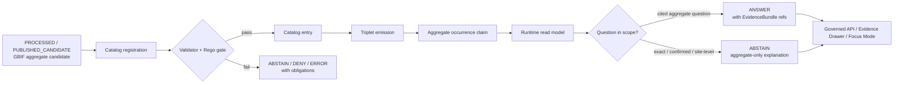

<!-- [KFM_META_BLOCK_V2]
doc_id: kfm://doc/TODO-gbif-catalog-triplet-read-model
title: GBIF Catalog + Triplet + Read Model
type: standard
version: v1
status: draft
owners: TODO-confirm-fauna-data-governance-owner
created: 2026-05-01
updated: 2026-05-01
policy_label: TODO-confirm-public-safe-doc-label
related: [schemas/catalog/fauna/gbif_catalog_entry.schema.json, schemas/triplets/fauna/gbif_occurrence_aggregate_claim.schema.json, schemas/readmodels/fauna/gbif_occurrence_answer.schema.json, tools/catalog/fauna/kfm_gbif_catalog_register.py, tools/triplets/fauna/kfm_gbif_triplet_emit.py, tools/readmodels/fauna/kfm_gbif_occurrence_readmodel.py, tools/validators/fauna/gbif_catalog_triplet_validator.py, policy/fauna/gbif_catalog_triplet.rego]
tags: [kfm, fauna, gbif, catalog, triplet, read-model, geoprivacy, aggregate-only]
notes: [NEEDS_VERIFICATION: doc_id, owner, policy_label, schema-home, naming, and exact repo path must be finalized against broader KFM canon, Current session did not expose a mounted KFM repository, This document is a governance and implementation-boundary note, not proof that the referenced paths exist]
[/KFM_META_BLOCK_V2] -->

# GBIF Catalog + Triplet + Read Model

Register public-safe GBIF occurrence aggregates and geoprivacy receipts into KFM catalog, triplet, and runtime read-model artifacts so runtime answers stay cited, aggregate-only, and safe to abstain.


> [!IMPORTANT]
> This lane answers only cited, generalized, aggregate questions about **GBIF-reported public occurrence aggregates**. It must abstain from exact-coordinate requests, site-level requests, and requests to confirm species presence.

## Quick links

- [Status and evidence posture](#status-and-evidence-posture)
- [Repo fit](#repo-fit)
- [Scope](#scope)
- [Contract map](#contract-map)
- [Required carry-through fields](#required-carry-through-fields)
- [Claim-language rules](#claim-language-rules)
- [Abstention rules](#abstention-rules)
- [Lifecycle flow](#lifecycle-flow)
- [CLI surfaces](#cli-surfaces)
- [Validation and policy gates](#validation-and-policy-gates)
- [Promotion checklist](#promotion-checklist)
- [Rollback and correction](#rollback-and-correction)
- [Open verification backlog](#open-verification-backlog)

## Status and evidence posture

| Item | Status | Meaning |
|---|---:|---|
| Domain | **CONFIRMED from request** | `fauna` |
| Layer | **CONFIRMED from request** | `PROCESSED/PUBLISHED_CANDIDATE -> CATALOG -> TRIPLET -> RUNTIME_READ_MODEL` |
| Document status | **CONFIRMED from request** | Draft |
| Exact schema home | **NEEDS VERIFICATION** | User draft names `schemas/...`; broader KFM canon has unresolved schema-home pressure. |
| Referenced tools and policy files | **NEEDS VERIFICATION** | Paths are declared by the draft, but current-session repo inspection did not confirm file presence. |
| Runtime behavior | **PROPOSED** | This doc defines required posture; it does not prove implementation. |

The governing rule is simple: **GBIF aggregate evidence may support aggregate public reporting, not confirmed-presence assertions.**

## Repo fit

**PROPOSED target doc path:** `docs/domains/fauna/gbif_catalog_triplet_read_model.md`  
**Reason:** this is a fauna-domain boundary note tying machine contracts, tools, policy, catalog artifacts, triplet claims, and runtime read-model behavior together.

| Direction | Artifact family | Role |
|---|---|---|
| Upstream | `PROCESSED/PUBLISHED_CANDIDATE` aggregate output | Public-safe GBIF aggregate candidate with source evidence and geoprivacy receipt. |
| Control | catalog contract + validator + Rego gate | Ensures source, rights, sensitivity, limitations, and geoprivacy posture survive registration. |
| Knowledge projection | triplet contract | Emits aggregate-only occurrence claims with required posture phrase. |
| Runtime | read model contract | Answers cited aggregate questions or abstains. |
| Downstream | governed API / Evidence Drawer / Focus Mode | May display aggregate answers only after policy and evidence closure. |

### Upstream links

- `schemas/catalog/fauna/gbif_catalog_entry.schema.json`
- `tools/catalog/fauna/kfm_gbif_catalog_register.py`
- `policy/fauna/gbif_catalog_triplet.rego`

### Downstream links

- `schemas/triplets/fauna/gbif_occurrence_aggregate_claim.schema.json`
- `schemas/readmodels/fauna/gbif_occurrence_answer.schema.json`
- `tools/triplets/fauna/kfm_gbif_triplet_emit.py`
- `tools/readmodels/fauna/kfm_gbif_occurrence_readmodel.py`

## Scope

### Accepted inputs

This lane accepts only GBIF-derived aggregate candidates that already carry enough evidence and safety metadata to remain inspectable:

- `source_evidence_bundle_id`
- `download_key`
- `query_predicate_hash`
- `geoprivacy_receipt_ref`
- `kfm:spec_hash`
- rights posture
- sensitivity posture
- limitations text or limitation references
- generalized geography or aggregate support
- temporal support or query time window

### Exclusions

This lane does **not** accept or produce:

- exact coordinate answers
- site-level occurrence records
- claims of confirmed species presence
- conservation-status confirmation
- population estimates or population health claims
- direct public access to canonical/internal occurrence stores
- uncited summaries, model-only summaries, or AI-authored assertions without EvidenceBundle support

## Contract map

| Contract / surface | Declared path | Minimum role | Failure posture |
|---|---|---|---|
| Catalog contract | `schemas/catalog/fauna/gbif_catalog_entry.schema.json` | Register source, aggregate support, rights, sensitivity, geoprivacy, limitations, and spec hash. | **ABSTAIN/DENY** if source or safety posture is incomplete. |
| Triplet contract | `schemas/triplets/fauna/gbif_occurrence_aggregate_claim.schema.json` | Emit aggregate-only claims with source and evidence links. | **ABSTAIN** if claim wording cannot preserve aggregate posture. |
| Read model contract | `schemas/readmodels/fauna/gbif_occurrence_answer.schema.json` | Return cited aggregate answer or finite negative outcome. | **ABSTAIN** for exact coordinate or confirmed-presence requests. |
| Catalog register CLI | `tools/catalog/fauna/kfm_gbif_catalog_register.py` | Convert eligible aggregate candidate into catalog entry. | **ERROR/HOLD** if path, flags, or contract are not verified. |
| Triplet emit CLI | `tools/triplets/fauna/kfm_gbif_triplet_emit.py` | Convert catalog entry into aggregate claim triplets. | **DENY** if required source/evidence fields are missing. |
| Read-model CLI | `tools/readmodels/fauna/kfm_gbif_occurrence_readmodel.py` | Build runtime answer payload from catalog + triplet artifacts. | **ABSTAIN** if answer would overclaim. |
| Validator | `tools/validators/fauna/gbif_catalog_triplet_validator.py` | Check schema, carry-through fields, forbidden wording, evidence closure, and geoprivacy receipt references. | **DENY** on leakage or policy violation. |
| Rego gate | `policy/fauna/gbif_catalog_triplet.rego` | Enforce aggregate-only, public-safe, cite-or-abstain policy. | **DENY** on restricted precision or source-role mismatch. |

> [!NOTE]
> Tool and policy paths are declared by the draft. Treat executable behavior as **UNKNOWN** until the mounted repo confirms file presence, headers, flags, and tests.

## Required carry-through fields

These fields must survive catalog registration, triplet emission, and read-model generation. They are not optional decoration; they are the trust membrane for this lane.

| Field | Why it matters | Lost-field consequence |
|---|---|---|
| `source_evidence_bundle_id` | Resolves the aggregate back to admissible evidence. | No cited answer; **ABSTAIN**. |
| `download_key` | Preserves GBIF download identity and reproducibility. | No reproducible aggregate identity; **ABSTAIN/HOLD**. |
| `query_predicate_hash` | Binds the answer to the exact aggregate query predicate. | Query scope is not inspectable; **ABSTAIN**. |
| `geoprivacy_receipt_ref` | Proves generalized/public-safe transformation or aggregate safety review. | No public output; **DENY** if precision risk exists. |
| `kfm:spec_hash` | Identifies the contract/spec/transform posture used to build the artifact. | Rebuild identity is ambiguous; **HOLD**. |
| rights posture | Shows whether output can be public, restricted, or blocked. | Unknown rights cannot produce public answer; **ABSTAIN/DENY**. |
| sensitivity posture | Prevents leakage of protected or precision-sensitive species/location data. | Exact or sensitive leakage risk; **DENY**. |
| limitations | Keeps aggregate claims from sounding stronger than their evidence. | Answer may overclaim; **ABSTAIN**. |

## Claim-language rules

Every public claim text emitted by this lane must include this posture phrase:

```text
GBIF-reported public occurrence aggregate
```

### Disallowed wording

The following phrases are disallowed in public claim text because they imply stronger evidence than this lane provides:

| Disallowed phrase | Why blocked | Safer replacement pattern |
|---|---|---|
| `confirmed present` | Treats aggregate occurrence reporting as field confirmation. | `reported in a GBIF-reported public occurrence aggregate` |
| `verified present` | Implies independent KFM verification of presence. | `reported by the aggregate source` |
| `known population` | Converts occurrence records into population knowledge. | `reported occurrence aggregate count/support` |
| `exact location` | Conflicts with generalized geography and geoprivacy posture. | `generalized geography` or `aggregate support area` |
| `site-level record` | Exceeds aggregate-only public posture. | `aggregate record set` |

### Allowed claim pattern

```text
GBIF-reported public occurrence aggregate for <taxon-or-query-scope> within <generalized-geography> reports <aggregate-measure> for <time-window-or-query-window>, based on download_key=<download_key> and query_predicate_hash=<query_predicate_hash>. Limitations: <limitations>.
```

This pattern is illustrative and must be reconciled to the mounted read-model schema before becoming a fixture expectation.

## Abstention rules

The read model must abstain when the user asks for something outside the lane’s authority.

| Request type | Required result | Reason code candidate |
|---|---|---|
| Exact coordinates | **ABSTAIN** by this lane; **DENY** if sensitivity policy requires a hard block. | `exact_coordinate_request_out_of_scope` |
| Confirmed presence | **ABSTAIN** | `confirmed_presence_not_supported_by_aggregate` |
| Site-level record | **ABSTAIN** | `site_level_record_not_public_readmodel` |
| Conservation status | **ABSTAIN** | `not_conservation_status_authority` |
| Population size or viability | **ABSTAIN** | `population_claim_not_supported` |
| Missing EvidenceBundle | **ABSTAIN** | `missing_evidence_bundle` |
| Unknown rights | **ABSTAIN/DENY** depending on policy severity. | `rights_not_public_safe` |
| Missing geoprivacy receipt | **DENY** when public release could expose precise/sensitive location. | `missing_geoprivacy_receipt` |

### Standard abstention copy

```text
I can’t answer that as an exact-coordinate, site-level, or confirmed-presence claim. This lane only returns cited GBIF-reported public occurrence aggregate answers over generalized geography.
```

## Lifecycle flow



The flow is intentionally one-way. Runtime read-model answers do not back-write into catalog, triplet, or canonical evidence stores.

## CLI surfaces

The draft names three tool headers. Before using any command examples, verify the mounted repo path, executable permissions, Python environment, flags, and expected input/output contracts.

```bash
# NEEDS VERIFICATION: inspect tool headers and flags before running.
python tools/catalog/fauna/kfm_gbif_catalog_register.py --help
python tools/triplets/fauna/kfm_gbif_triplet_emit.py --help
python tools/readmodels/fauna/kfm_gbif_occurrence_readmodel.py --help
```

| Tool | Expected role | Do not use it for |
|---|---|---|
| `kfm_gbif_catalog_register.py` | Register an eligible public-safe aggregate into catalog form. | Directly admitting exact occurrence records into public runtime. |
| `kfm_gbif_triplet_emit.py` | Emit aggregate-only claim triplets from validated catalog artifacts. | Converting GBIF occurrence data into confirmed species presence. |
| `kfm_gbif_occurrence_readmodel.py` | Build cited aggregate answers and abstentions. | Generating uncited summaries or conservation-status claims. |

## Validation and policy gates

| Gate | Required check | Passing evidence | Failure outcome |
|---|---|---|---|
| Fixture gate | Positive and negative fixtures exist for answer, abstain, deny, and malformed/error cases. | Fixture report. | **HOLD**. |
| Schema gate | Catalog, triplet, and read-model artifacts validate against declared contracts. | Validator report. | **DENY/ERROR**. |
| Carry-through gate | Required fields survive all stages. | Field preservation report. | **ABSTAIN/DENY**. |
| Evidence gate | `source_evidence_bundle_id` resolves to an EvidenceBundle. | Evidence resolution report. | **ABSTAIN**. |
| Geoprivacy gate | `geoprivacy_receipt_ref` exists and supports public aggregate posture. | Receipt reference + digest. | **DENY** if precision risk exists. |
| Language gate | Required posture phrase is present; disallowed phrases are absent from claim text. | Claim text lint report. | **DENY** for overclaiming. |
| Rights/sensitivity gate | Rights and sensitivity posture allow public aggregate answer. | Policy decision. | **ABSTAIN/DENY**. |
| Read-model gate | Exact-coordinate and confirmed-presence prompts abstain. | Runtime fixture report. | **DENY** release candidate. |

## Promotion checklist

A release candidate for this lane is not promotable until all of the following are true:

- [ ] Fixtures pass for aggregate answer, exact-coordinate abstention, confirmed-presence abstention, missing evidence, missing geoprivacy receipt, unknown rights, and malformed object.
- [ ] `tools/validators/fauna/gbif_catalog_triplet_validator.py` passes against catalog, triplet, and read-model fixtures.
- [ ] `policy/fauna/gbif_catalog_triplet.rego` passes positive fixtures and blocks negative fixtures.
- [ ] Every public claim contains `GBIF-reported public occurrence aggregate`.
- [ ] No public claim contains disallowed wording.
- [ ] Every emitted claim preserves source, query, geoprivacy, spec hash, rights/sensitivity, and limitations references.
- [ ] Runtime read model abstains on exact-coordinate and confirmed-presence requests.
- [ ] EvidenceRef / EvidenceBundle resolution is closed for all answer fixtures.
- [ ] Rollback target is documented before publication.

## Rollback and correction

Rollback is a governed correction path, not a silent file replacement.

1. Identify the affected `download_key`, `query_predicate_hash`, `source_evidence_bundle_id`, `geoprivacy_receipt_ref`, and `kfm:spec_hash`.
2. Re-emit the catalog, triplet, and read-model artifacts with corrected evidence refs and spec hashes.
3. Mark superseded artifacts as withdrawn or corrected according to the repo’s release/correction convention.
4. Preserve the old artifact digest and the new artifact digest in the correction record.
5. Re-run fixtures, validator, and policy gate.
6. Rebuild only derived runtime read-model outputs that depend on the corrected aggregate.

> [!CAUTION]
> Do not patch claim text alone. If evidence refs, geoprivacy receipts, rights posture, or limitations changed, the catalog and triplet artifacts must be re-emitted so runtime answers remain traceable.

## Open verification backlog

| Item | Status | Why it matters |
|---|---:|---|
| Confirm target doc path | **NEEDS VERIFICATION** | No mounted repo exposed adjacent docs or directory conventions. |
| Finalize schema home | **NEEDS VERIFICATION** | User draft names `schemas/...`; KFM fauna lineage records schema-home ambiguity. |
| Confirm exact schema field names | **NEEDS VERIFICATION** | This doc defines carry-through obligations, not final JSON Schema shapes. |
| Confirm CLI flags | **NEEDS VERIFICATION** | Tool paths are named, but headers were not visible. |
| Confirm Rego package and decision shape | **NEEDS VERIFICATION** | Policy behavior must match repo-wide outcome conventions. |
| Confirm reason-code registry | **NEEDS VERIFICATION** | Candidate reason codes may need central registry alignment. |
| Confirm read-model envelope shape | **NEEDS VERIFICATION** | Runtime response keys must match mounted contract. |
| Confirm owner and policy label | **NEEDS VERIFICATION** | Metadata block placeholders should be replaced before publication. |
| Confirm whether GBIF aggregate catalog belongs under fauna or broader biodiversity | **NEEDS VERIFICATION** | Avoid duplicating flora/fauna occurrence aggregate logic. |

## Appendix: review fixture sketch

<details>
<summary>Illustrative fixture families</summary>

These are fixture families to create or map to existing repo conventions. Names are illustrative until the mounted test tree is inspected.

| Fixture family | Expected result | Purpose |
|---|---|---|
| `answer_generalized_public_safe_gbif_aggregate` | **ANSWER** | Cited aggregate answer with all required carry-through fields. |
| `abstain_exact_coordinate_request` | **ABSTAIN** | Exact coordinates are outside read-model authority. |
| `abstain_confirmed_presence_request` | **ABSTAIN** | Aggregate report cannot become confirmed presence. |
| `abstain_missing_evidence_bundle` | **ABSTAIN** | Cite-or-abstain enforcement. |
| `deny_missing_geoprivacy_receipt` | **DENY** | Public release cannot proceed without geoprivacy proof. |
| `deny_forbidden_claim_language` | **DENY** | Blocks overclaiming language before runtime. |
| `error_malformed_catalog_entry` | **ERROR** | Contract break or invalid artifact shape. |

</details>

[Back to top](#gbif-catalog--triplet--read-model)
