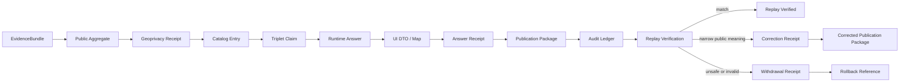

<!-- [KFM_META_BLOCK_V2]
doc_id: kfm://doc/fauna/gbif-publication-operations
title: GBIF Publication Operations
type: standard
version: v1
status: draft
owners: NEEDS_VERIFICATION
created: 2026-05-01
updated: 2026-05-01
policy_label: NEEDS_VERIFICATION
related: [kfm://doc/fauna, "NEEDS_VERIFICATION: schemas/<lane> vs schemas/contracts/v1/<lane>", "NEEDS_VERIFICATION: policy/fauna vs bundle-only registration"]
tags: [kfm, fauna, gbif, occurrence, publication, geoprivacy, evidence-bundle]
notes: ["Design status is PROPOSED", "No mounted repository was available in this authoring session", "Exact schema and policy homes require checkout verification"]
[/KFM_META_BLOCK_V2] -->

# GBIF Publication Operations

Governed, fixture-backed publication operations for **GBIF-derived public occurrence answers** in the KFM fauna lane.

> [!IMPORTANT]
> **Status: PROPOSED.** This document defines the intended publication-control surface for GBIF public occurrence answers. It does **not** prove that schemas, routes, validators, policy bundles, fixtures, ledgers, or CLI commands currently exist on the active branch.

<p>
  
  
  
  
</p>

## Quick jumps

- [Operating posture](#operating-posture)
- [Repo fit](#repo-fit)
- [Publication chain](#publication-chain)
- [Accepted inputs](#accepted-inputs)
- [Exclusions](#exclusions)
- [Public-answer rules](#public-answer-rules)
- [Contract set](#contract-set)
- [Policy and validator gates](#policy-and-validator-gates)
- [Fixture plan](#fixture-plan)
- [CLI examples](#cli-examples)
- [Promotion checklist](#promotion-checklist)
- [Replay, correction, withdrawal, rollback](#replay-correction-withdrawal-rollback)
- [Open verification items](#open-verification-items)

---

## Operating posture

GBIF occurrence aggregates are useful **reported occurrence evidence**. They are not legal status authority, not steward-reviewed sensitive-species authority, not habitat designation authority, and not proof of a living population at a place.

KFM may publish a GBIF-derived public answer only after it can show all of the following:

| Requirement | Public burden | Fail-closed result |
|---|---:|---|
| Evidence support resolves | Every public answer resolves to one or more `EvidenceBundle` references | `ABSTAIN` or `DENY` |
| Public aggregate exists | Raw/source occurrence records are transformed into a generalized public aggregate | `DENY` |
| Geoprivacy receipt exists | Any precision reduction or field removal is recorded with before/after hashes | `DENY` |
| Rights are known enough | Source and dataset rights support the intended public output | `DENY` or `QUARANTINE` |
| Forbidden fields absent | Exact-coordinate fields and restricted geometry refs are not present in public payloads | `DENY` |
| Forbidden public wording absent | Runtime/UI text avoids overclaiming presence, population, or exactness | `DENY` |
| Catalog/triplet closure exists | Catalog entry and triplet claim point back to evidence and release state | `ABSTAIN` or `DENY` |
| Audit ledger records the release | Publication package and replay materials are append-recorded | `HOLD` |

### Truth labels used here

| Label | Meaning in this file |
|---|---|
| **CONFIRMED** | Verified from the current prompt, uploaded KFM corpus, or workspace inspection. |
| **PROPOSED** | Recommended design, schema, CLI, path, gate, or fixture shape not verified as implemented. |
| **UNKNOWN** | Not verifiable in this session because no mounted repository, tests, workflows, logs, or runtime were available. |
| **NEEDS_VERIFICATION** | A checkable item that must be resolved before implementation or status upgrade. |

[Back to top](#gbif-publication-operations)

---

## Repo fit

**Target path:** `docs/domains/fauna/gbif-publication-operations.md` **PROPOSED / NEEDS_VERIFICATION**

This is a standard operations document for the fauna lane. It should sit near fauna documentation, occurrence-evidence documentation, source descriptors, runtime proof fixtures, and publication/promotion docs once the real repository layout is inspected.

| Repo relationship | Expected surface | Status |
|---|---|---|
| Upstream source admission | GBIF `SourceDescriptor`, rights posture, source role, cadence, dataset metadata | **PROPOSED / NEEDS_VERIFICATION** |
| Upstream evidence | `EvidenceBundle`, occurrence evidence object, source snapshot, validation reports | **PROPOSED** |
| Upstream policy | fauna publication, geoprivacy, runtime, AI/Focus, source-registry gates | **PROPOSED** |
| Downstream runtime | governed API response, finite outcome envelope, answer receipt | **PROPOSED** |
| Downstream UI | public-safe UI DTO, map support geometry, Evidence Drawer payload | **PROPOSED** |
| Downstream release | publication package, audit ledger, replay verification, correction/withdrawal/rollback receipts | **PROPOSED** |

> [!NOTE]
> No mounted KFM checkout was available during authoring. Path names are intentionally conservative and should be reconciled with the real repo before commit.

[Back to top](#gbif-publication-operations)

---

## Publication chain

The public answer is only the visible end of a longer trust path. KFM should preserve every handoff from evidence to publication package.



### Lifecycle summary

```text
UI/API DTO -> Publication Package -> Audit Ledger -> Replay Verification -> Correction/Withdrawal/Rollback
```

### Chain summary

```text
EvidenceBundle -> Public Aggregate -> Geoprivacy Receipt -> Catalog Entry -> Triplet Claim -> Runtime Answer -> UI DTO/Map -> Answer Receipt -> Publication Package -> Audit Ledger
```

[Back to top](#gbif-publication-operations)

---

## Accepted inputs

Only public-safe, evidence-bound, generalized occurrence materials belong in this publication operation.

| Input | Required posture | Notes |
|---|---|---|
| `EvidenceBundle` refs | Resolvable, release-aware, rights/sensitivity summarized | Root support for public claim inspection. |
| GBIF-derived public aggregate | Generalized or aggregated; no raw exact-coordinate payload | Source rows must already have passed rights, sensitivity, and source-role checks. |
| Geoprivacy receipt | Required whenever geometry, precision, or fields are transformed | Must explain what changed, why, and under which policy version. |
| Catalog entry | Links data, receipt, proof, source, and release scope | Should support STAC/DCAT/PROV-style closure if KFM uses those catalog surfaces. |
| Triplet claim | Claims only occurrence-evidence support, not legal status or certainty of presence | Must point back to catalog and evidence refs. |
| Runtime answer | Finite outcome: `ANSWER`, `ABSTAIN`, `DENY`, or `ERROR` | Must pass citation, field, language, policy, and geoprivacy checks. |
| UI DTO / map payload | Public-safe display object | May show generalized support, coverage, counts, caveats, and evidence refs. |
| Answer receipt | Captures emitted answer shape, validators, policy decisions, and audit refs | Required before packaging. |

[Back to top](#gbif-publication-operations)

---

## Exclusions

This operation does **not** admit or authorize:

- raw GBIF occurrence records as public output,
- source-native precise occurrence coordinates,
- direct UI/API access to canonical, RAW, WORK, QUARANTINE, or restricted stores,
- legal-status, critical-habitat, stewardship, permit, or consultation claims based only on GBIF occurrence evidence,
- unreviewed publication when rights, sensitivity, source role, taxonomy, or geometry support is unresolved,
- AI-generated wording that outruns evidence, policy, or release state,
- map screenshots or tiles that reveal restricted precision by implication,
- silent correction, overwrite, withdrawal, or rollback without ledgered receipts.

[Back to top](#gbif-publication-operations)

---

## Public-answer rules

### Required public framing

Public answers should describe **reported occurrence evidence at generalized support**. They should not imply certainty, population status, or exactness.

Allowed framing patterns:

| Pattern | Example wording |
|---|---|
| Evidence-bound | “GBIF-derived occurrence evidence is available for this generalized area.” |
| Aggregate-bound | “This public aggregate summarizes reported occurrence records after geoprivacy review.” |
| Scope-bound | “The answer applies to the displayed county/grid/watershed support, not a precise point.” |
| Caveat-visible | “Source coverage, reporting bias, date range, and rights posture should be inspected before interpretation.” |

### Forbidden public fields

Public answer payloads, UI DTOs, map properties, triplet claims, publication packages, and replay snapshots must reject exact-coordinate fields.

```yaml
# PROPOSED validator denylist fragment
forbidden_exact_coordinate_keys:
  - decimalLatitude
  - decimalLongitude
  - verbatimLatitude
  - verbatimLongitude
  - verbatimCoordinates
  - verbatimCoordinateSystem
  - verbatimSRS
  - latitude
  - longitude
  - lat
  - lon
  - lng
  - coordinateX
  - coordinateY
  - x
  - y
  - point
  - point_wkt
  - wkt
  - exact_point_geometry
  - restricted_geometry_ref
  - geometry.coordinates # deny when geometry is a source-native or exact point geometry
allowed_public_spatial_support:
  - county
  - grid
  - watershed
  - bbox
  - generalized_polygon
  - aggregate_tile
  - suppressed
```

### Forbidden public language

The public runtime and UI language validator should reject the following phrase families unless the phrase is appearing inside a validator configuration, test name, or documentation discussion of prohibited wording.

```yaml
# PROPOSED public-language denylist fragment
forbidden_public_phrase_patterns:
  - "confirmed present"
  - "verified present"
  - "known population"
  - "exact location"
  - "species is present at"
  - "population exists at"
  - "precise occurrence point"
  - "verified population"
```

> [!CAUTION]
> The field and language denylist is a minimum control, not a complete geoprivacy system. Public safety also depends on aggregation thresholds, sensitivity class, rights posture, source policy, and review state.

[Back to top](#gbif-publication-operations)

---

## Contract set

The following contract family is **PROPOSED** for GBIF publication operations. Schema homes remain unresolved until repo inspection.

| Contract | Purpose | Minimum field families |
|---|---|---|
| `gbif_publication_package.schema.json` | Assembles one outward package from evidence, aggregate, DTO, receipts, and release scope | package id, source refs, evidence bundle refs, aggregate refs, DTO refs, receipt refs, validators, digests, status |
| `gbif_publication_status.schema.json` | Records the package state machine | status enum, transition reason, actor/run, timestamps, obligations, blocking gate refs |
| `gbif_audit_ledger_entry.schema.json` | Appends durable publication/audit facts | ledger id, sequence, event type, package ref, digest chain, actor/run, policy refs, replay refs |
| `gbif_replay_verification.schema.json` | Replays package construction and emitted public DTO | replay id, package ref, expected refs, observed refs, validator results, digest match, disposition |
| `gbif_correction_receipt.schema.json` | Records narrowed/revised public meaning | correction id, affected package/answer, reason, before/after refs, public notice ref, supersession refs |
| `gbif_withdrawal_receipt.schema.json` | Records removal of unsafe or invalid public output | withdrawal id, affected package/answer, policy reason, depublication refs, rollback refs, public notice ref |

### Status model

```yaml
# PROPOSED publication status enum
publication_status:
  - draft
  - candidate
  - validating
  - validation_failed
  - ready_for_review
  - review_hold
  - approved_for_promotion
  - promoted
  - published
  - replay_verified
  - correction_pending
  - corrected
  - withdrawal_pending
  - withdrawn
  - rollback_pending
  - rolled_back
  - superseded
```

### Publication package fragment

```jsonc
{
  "$schema": "https://json-schema.org/draft/2020-12/schema",
  "$id": "NEEDS_VERIFICATION:gbif_publication_package.schema.json",
  "title": "GBIF Publication Package",
  "type": "object",
  "required": [
    "package_id",
    "status",
    "gbif_source_descriptor_ref",
    "evidence_bundle_refs",
    "public_aggregate_ref",
    "geoprivacy_receipt_refs",
    "catalog_entry_refs",
    "triplet_claim_refs",
    "runtime_answer_refs",
    "ui_dto_refs",
    "answer_receipt_refs",
    "validation_report_refs",
    "audit_ledger_ref",
    "spec_hash",
    "content_hash"
  ],
  "properties": {
    "package_id": { "type": "string" },
    "status": { "type": "string" },
    "gbif_source_descriptor_ref": { "type": "string" },
    "evidence_bundle_refs": { "type": "array", "items": { "type": "string" } },
    "public_aggregate_ref": { "type": "string" },
    "geoprivacy_receipt_refs": { "type": "array", "items": { "type": "string" } },
    "catalog_entry_refs": { "type": "array", "items": { "type": "string" } },
    "triplet_claim_refs": { "type": "array", "items": { "type": "string" } },
    "runtime_answer_refs": { "type": "array", "items": { "type": "string" } },
    "ui_dto_refs": { "type": "array", "items": { "type": "string" } },
    "answer_receipt_refs": { "type": "array", "items": { "type": "string" } },
    "validation_report_refs": { "type": "array", "items": { "type": "string" } },
    "audit_ledger_ref": { "type": "string" },
    "spec_hash": { "type": "string" },
    "content_hash": { "type": "string" }
  },
  "additionalProperties": false
}
```

### Audit ledger fragment

```jsonc
{
  "ledger_entry_id": "gbif-ledger-entry-2026-05-01-example",
  "sequence": 1,
  "event_type": "publication_package_recorded",
  "package_ref": "kfm://publication/fauna/gbif/example-package",
  "previous_entry_hash": null,
  "entry_hash": "NEEDS_VERIFICATION:computed_hash",
  "actor_ref": "NEEDS_VERIFICATION",
  "run_receipt_ref": "kfm://receipt/run/example",
  "policy_decision_refs": ["kfm://policy-decision/example"],
  "replay_verification_ref": null,
  "created_at": "2026-05-01T00:00:00Z"
}
```

[Back to top](#gbif-publication-operations)

---

## Policy and validator gates

### Gate map

| Gate | Validator / policy responsibility | Blocks when |
|---|---|---|
| G0 — Source admission | GBIF source descriptor exists; source role is occurrence/corroborative only | source role, cadence, rights, or authority scope is missing |
| G1 — Evidence closure | `EvidenceBundle` refs resolve and support the public scope | evidence refs are missing, stale, unresolved, or mismatched |
| G2 — Aggregate support | Public aggregate is generalized and carries counts/support/time windows | public output depends on raw source rows or point precision |
| G3 — Geoprivacy | Geoprivacy receipt records transforms and policy version | transform occurred without receipt, or unsafe precision remains |
| G4 — Field denylist | Public payload contains no exact-coordinate keys | forbidden fields appear anywhere in public package or DTO |
| G5 — Language lint | Runtime and UI text avoid overclaiming certainty or exactness | forbidden phrase patterns appear in public answer text |
| G6 — Catalog closure | Catalog and triplet refs resolve to evidence, rights, and release state | catalog entry or triplet claim floats without support |
| G7 — Runtime/DTO parity | Runtime answer, UI DTO, and answer receipt agree | UI displays stronger claim than runtime answer allowed |
| G8 — Package integrity | Package content hash and spec hash are stable and replayable | digest mismatch, missing artifact, missing validator report |
| G9 — Audit ledger | Publication package is append-recorded before public widening | ledger entry missing, sequence broken, digest chain invalid |
| G10 — Replay verification | Rebuild reproduces expected package and public DTO shape | replay mismatch or validator drift occurs |
| G11 — Correction/withdrawal | Post-public changes emit visible receipt and public consequence | public meaning changes silently |

### Proposed validator names

```text
validate_gbif_publication_package
validate_gbif_publication_status
validate_gbif_audit_ledger_entry
validate_gbif_replay_verification
validate_gbif_correction_receipt
validate_gbif_withdrawal_receipt
assert_no_exact_coordinate_fields
assert_no_forbidden_public_language
assert_runtime_ui_public_scope_parity
assert_geoprivacy_receipt_required
assert_occurrence_aggregate_not_authority_claim
```

### Policy home options

| Option | Status | Use when |
|---|---|---|
| `policy/fauna/gbif_publication.rego` | **PROPOSED / NEEDS_VERIFICATION** | The mounted repo has lane-local policy directories and tests. |
| policy bundle registration only | **PROPOSED / NEEDS_VERIFICATION** | The mounted repo centralizes policy bundles and does not keep lane-local Rego files. |

[Back to top](#gbif-publication-operations)

---

## Fixture plan

A small fixture suite should prove both positive and negative paths before any live/public GBIF publication work is widened.

```text
# PROPOSED fixture tree; path must be reconciled with the mounted repo.
tests/e2e/publication/fauna/gbif/
  answer_public_aggregate_ok/
    evidence_bundle.json
    public_aggregate.json
    geoprivacy_receipt.json
    catalog_entry.json
    triplet_claim.json
    runtime_answer.json
    ui_dto.json
    answer_receipt.json
    publication_package.json
    audit_ledger_entry.json
    replay_verification.expected.json
  abstain_missing_evidence_bundle/
    publication_candidate.json
    expected.decision.json
  deny_exact_coordinate_field/
    publication_candidate.json
    expected.decision.json
  deny_forbidden_public_language/
    publication_candidate.json
    expected.decision.json
  deny_unresolved_rights/
    publication_candidate.json
    expected.decision.json
  deny_missing_geoprivacy_receipt/
    publication_candidate.json
    expected.decision.json
  replay_digest_mismatch/
    publication_package.json
    replay_verification.expected.json
  correction_public_meaning_narrowed/
    prior_publication_package.json
    correction_receipt.expected.json
  withdrawal_sensitive_precision_leak/
    prior_publication_package.json
    withdrawal_receipt.expected.json
```

### Minimum fixture assertions

| Fixture | Expected outcome | Assertion focus |
|---|---|---|
| `answer_public_aggregate_ok` | `ANSWER` | Package emits only generalized support and resolves all evidence. |
| `abstain_missing_evidence_bundle` | `ABSTAIN` | Runtime cannot produce public claim without support. |
| `deny_exact_coordinate_field` | `DENY` | Forbidden coordinate fields are rejected anywhere in public output. |
| `deny_forbidden_public_language` | `DENY` | Overclaiming public text is rejected. |
| `deny_unresolved_rights` | `DENY` | Unknown or incompatible rights block public widening. |
| `deny_missing_geoprivacy_receipt` | `DENY` | Public derivative without transform receipt cannot promote. |
| `replay_digest_mismatch` | `ERROR` or `DENY` | Replay mismatch prevents trust widening. |
| `correction_public_meaning_narrowed` | `corrected` | Correction receipt links prior answer, replacement, and public consequence. |
| `withdrawal_sensitive_precision_leak` | `withdrawn` | Withdrawal receipt and rollback reference are emitted. |

[Back to top](#gbif-publication-operations)

---

## CLI examples

These commands are **illustrative PROPOSED shapes**. They should be replaced with the repo-native CLI, Make targets, npm scripts, or Python entry points after checkout inspection.

```bash
# Build a publication package from already-public-safe inputs.
kfm fauna gbif publication package build \
  --evidence-bundle kfm://evidence/fauna/gbif/example \
  --public-aggregate artifacts/fauna/gbif/public_aggregate.json \
  --geoprivacy-receipt artifacts/fauna/gbif/geoprivacy_receipt.json \
  --catalog-entry artifacts/fauna/gbif/catalog_entry.json \
  --triplet-claim artifacts/fauna/gbif/triplet_claim.json \
  --runtime-answer artifacts/fauna/gbif/runtime_answer.json \
  --ui-dto artifacts/fauna/gbif/ui_dto.json \
  --answer-receipt artifacts/fauna/gbif/answer_receipt.json \
  --out artifacts/fauna/gbif/publication_package.json
```

```bash
# Validate package, public fields, public language, evidence closure, and geoprivacy.
kfm fauna gbif publication validate \
  --package artifacts/fauna/gbif/publication_package.json \
  --policy-bundle policy/fauna \
  --out artifacts/fauna/gbif/validation_report.json
```

```bash
# Append to audit ledger after validation and review.
kfm fauna gbif publication ledger append \
  --package artifacts/fauna/gbif/publication_package.json \
  --validation-report artifacts/fauna/gbif/validation_report.json \
  --out data/receipts/fauna/gbif/audit_ledger_entry.json
```

```bash
# Replay verification should reproduce public package shape and validator decisions.
kfm fauna gbif publication replay verify \
  --package artifacts/fauna/gbif/publication_package.json \
  --ledger-entry data/receipts/fauna/gbif/audit_ledger_entry.json \
  --out artifacts/fauna/gbif/replay_verification.json
```

```bash
# Correction path for narrowed or revised public meaning.
kfm fauna gbif publication correction issue \
  --prior-package kfm://publication/fauna/gbif/prior \
  --replacement-package kfm://publication/fauna/gbif/replacement \
  --reason "public wording narrowed to occurrence-evidence support" \
  --out data/proofs/fauna/gbif/correction_receipt.json
```

```bash
# Withdrawal path for unsafe publication.
kfm fauna gbif publication withdrawal issue \
  --package kfm://publication/fauna/gbif/unsafe \
  --reason-code sensitive_precision_leak \
  --rollback-to kfm://publication/fauna/gbif/previous-safe \
  --out data/proofs/fauna/gbif/withdrawal_receipt.json
```

[Back to top](#gbif-publication-operations)

---

## Promotion checklist

A GBIF public occurrence answer is ready to promote only when every required item is present, validated, and linked.

- [ ] Source descriptor declares GBIF source role as occurrence/corroborative, not regulatory authority.
- [ ] Rights status is known enough for the intended public output.
- [ ] Taxon and occurrence evidence resolution has no silent merge or unresolved ambiguity.
- [ ] Public aggregate uses generalized support and no exact public point geometry.
- [ ] Geoprivacy receipt records transform class, policy version, reason, actor/run, and before/after hashes.
- [ ] `EvidenceBundle` refs resolve and match the public aggregate scope.
- [ ] Catalog entry and triplet claim resolve back to evidence and release scope.
- [ ] Runtime answer uses finite outcome grammar and cites evidence refs.
- [ ] UI DTO/map payload does not exceed runtime answer scope.
- [ ] Answer receipt captures validators, language lint, field lint, policy decisions, and audit refs.
- [ ] Publication package validates structurally and by policy.
- [ ] Audit ledger entry is appended with digest-chain continuity.
- [ ] Replay verification passes or records an explicit non-release disposition.
- [ ] Correction, withdrawal, and rollback targets are known before publication widens.

[Back to top](#gbif-publication-operations)

---

## Replay, correction, withdrawal, rollback

### Replay verification

Replay verification is the guard against publication drift. It should rebuild or re-evaluate the publication package from its recorded refs and confirm that public output still matches what was approved.

| Replay check | Required result |
|---|---|
| Package refs resolve | No missing package, source, evidence, catalog, receipt, or DTO refs. |
| Digests match | Package and content hashes reproduce or mismatch is explained and blocked. |
| Field denylist reruns | No exact-coordinate fields appear after replay. |
| Language lint reruns | Public language remains within occurrence-evidence framing. |
| UI/runtime parity reruns | UI DTO still does not make a stronger claim than the runtime answer. |
| Policy decisions rerun | Gate outcome is stable or visibly superseded. |

### Correction receipt

Use a correction receipt when the public answer must be narrowed, reworded, re-scoped, or superseded while preserving public lineage.

Minimum correction receipt fields:

```yaml
correction_receipt:
  correction_id: string
  affected_package_ref: string
  affected_answer_refs: [string]
  correction_type: wording_narrowed | scope_narrowed | evidence_ref_updated | catalog_ref_updated | public_aggregate_rebuilt | other
  reason_code: string
  before_refs: [string]
  after_refs: [string]
  public_notice_ref: string
  supersession_ref: string
  actor_or_run_ref: string
  effective_at: datetime
  audit_ledger_refs: [string]
```

### Withdrawal receipt

Use a withdrawal receipt when the package or answer is unsafe, invalid, rights-blocked, or policy-blocked for public use.

Minimum withdrawal receipt fields:

```yaml
withdrawal_receipt:
  withdrawal_id: string
  affected_package_ref: string
  affected_answer_refs: [string]
  withdrawal_type: rights_block | sensitivity_leak | exact_coordinate_leak | evidence_unresolved | replay_failure | policy_failure | other
  reason_code: string
  depublication_refs: [string]
  rollback_reference: string
  public_notice_ref: string
  actor_or_run_ref: string
  effective_at: datetime
  audit_ledger_refs: [string]
```

### Rollback rule

Rollback is not a silent file move. It is a governed state transition that must record:

1. the package withdrawn or superseded,
2. the safe target package or empty public state,
3. the reason and policy basis,
4. impacted runtime/UI/catalog/triplet surfaces,
5. derivative rebuild refs,
6. public notice and audit ledger refs.

[Back to top](#gbif-publication-operations)

---

## Open verification items

| Item | Status | Why it matters |
|---|---|---|
| Schema home | **NEEDS_VERIFICATION** | User-supplied limitation notes unresolved convention between `schemas/<lane>` and `schemas/contracts/v1/<lane>`. |
| Policy harness home | **NEEDS_VERIFICATION** | User-supplied limitation notes unresolved expectation between `policy/fauna` and bundle-only registration. |
| Runtime envelope keys | **UNKNOWN** | Active branch schema was not inspectable. |
| Evidence Drawer payload home | **UNKNOWN** | UI component or contract path was not inspectable. |
| GBIF source descriptor path | **UNKNOWN** | Source descriptor conventions require checkout proof. |
| Exact CLI command names | **PROPOSED** | CLI examples are illustrative only. |
| Audit ledger storage | **PROPOSED** | Ledger path and digest-chain implementation require repository convention. |
| Replay test harness | **PROPOSED** | Fixture paths and test runner remain unknown without repo inspection. |
| Owners | **NEEDS_VERIFICATION** | The document owner was not confirmed in the current evidence. |
| Document policy label | **NEEDS_VERIFICATION** | The correct label for this operations doc itself was not confirmed. |

[Back to top](#gbif-publication-operations)

---

## Pre-publish definition of done

Before this document is upgraded out of `draft` / `PROPOSED`, maintainers should verify:

- [ ] target path and neighboring docs,
- [ ] owner/team and review responsibility,
- [ ] schema-home ADR or equivalent convention,
- [ ] policy harness convention,
- [ ] source descriptor path for GBIF,
- [ ] validator names and test runner,
- [ ] fixture paths and golden-output format,
- [ ] runtime envelope and UI DTO field names,
- [ ] audit ledger storage and digest-chain rules,
- [ ] correction, withdrawal, and rollback artifact homes,
- [ ] all public examples pass field denylist and public-language lint.
