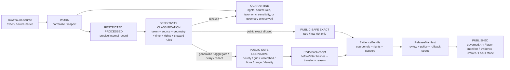

<!-- [KFM_META_BLOCK_V2]
doc_id: kfm://doc/TODO-uuid-NEEDS-VERIFICATION
title: Fauna Geoprivacy
type: standard
version: v1
status: draft
owners: TODO-fauna-steward-NEEDS-VERIFICATION
created: 2026-05-07
updated: 2026-05-07
policy_label: TODO-public-or-restricted-NEEDS-VERIFICATION
related: [README.md, SOURCE_ROLES.md, VALIDATION.md, CONTROL_PLANE.md, ../../../data/registry/fauna/README.md, ../../adr/ADR-0009-sensitive-location-policy.md]
tags: [kfm, fauna, geoprivacy, sensitivity, public-safe-derivatives]
notes: [doc_id and owners require repository steward verification; created/updated reflect this generated draft date and should be replaced if commit metadata differs; policy_label and related links require branch verification before publication]
[/KFM_META_BLOCK_V2] -->

# Fauna Geoprivacy

Defines how KFM protects sensitive wildlife location information while preserving evidence traceability, public usefulness, review, correction, and rollback.

  
  
  
  
  

> [!IMPORTANT]
> Fauna geoprivacy is a publication gate, not a display preference. If rights, source role, sensitivity, geometry precision, taxonomy, evidence closure, review state, or release state is unclear, KFM must **DENY exact public exposure**, **ABSTAIN from unsupported claims**, or **QUARANTINE the candidate record** until the obligation is resolved.

---

## Quick jumps

[Scope](#scope) ·
[Repo fit](#repo-fit) ·
[Public boundary](#public-boundary) ·
[Sensitivity classes](#sensitivity-classes) ·
[Source-role discipline](#source-role-discipline) ·
[Geometry rules](#geometry-rules) ·
[Required receipts](#required-receipts) ·
[Validation gates](#validation-gates) ·
[API, UI, and AI](#api-ui-and-ai) ·
[Rollback](#rollback) ·
[Reviewer checklist](#reviewer-checklist) ·
[Open verification](#open-verification-backlog)

---

## Scope

This document governs **how fauna location information may move from protected evidence into public-safe KFM products**.

It applies to:

| Applies to | Examples |
|---|---|
| Occurrence evidence | Specimen records, observations, surveys, eDNA, telemetry summaries, acoustic detections, camera/trap records, mortality reports, disease/pathogen events |
| Sensitive wildlife places | Nest, den, roost, hibernacula, lek, spawning, breeding, wintering, stopover, migration, nursery, cave, colony, and steward-controlled sites |
| Public derivatives | Generalized occurrence summaries, density grids, richness grids, monitoring coverage layers, range polygons, habitat-support layers, public API payloads, Evidence Drawer payloads, Focus Mode context |
| Release and correction objects | Redaction receipts, EvidenceBundles, LayerManifests, ReleaseManifests, CorrectionNotices, RollbackCards |

It does **not** authorize:

- public exact locations for sensitive taxa;
- browser or public API access to RAW, WORK, QUARANTINE, restricted stores, direct source APIs, unpublished candidate records, or model-runtime context;
- AI answers that infer species presence beyond resolved evidence;
- publication based only on rendered tiles, popup fields, source labels, community-science confidence, or model suitability output.

---

## Repo fit

**Target path:** `docs/domains/fauna/GEOPRIVACY.md`

**Directory-rules basis:** this is a human-facing domain governance document, so it belongs under `docs/domains/fauna/`, not as a root-level `fauna/` folder.

| Relationship | Path or object | Status | Role |
|---|---:|---|---|
| Owning root | `docs/` | CONFIRMED doctrine | Human-facing control plane |
| Domain home | `docs/domains/fauna/` | CONFIRMED by target path / NEEDS VERIFICATION in branch | Fauna documentation lane |
| Source registry | `../../../data/registry/fauna/` | PROPOSED / NEEDS VERIFICATION | Source roles, rights, sensitivity policy, verification backlog |
| Machine schemas | `../../../schemas/contracts/v1/fauna/` | PROPOSED / NEEDS VERIFICATION | Machine-checkable fauna contracts |
| Policy gates | `../../../policy/fauna/` | PROPOSED / NEEDS VERIFICATION | Allow/deny/abstain obligations |
| Validators | `../../../tools/validators/fauna/` | PROPOSED / NEEDS VERIFICATION | Fail-closed checks |
| Tests | `../../../tests/fauna/` and `../../../tests/fixtures/fauna/` | PROPOSED / NEEDS VERIFICATION | Positive and negative fixture proof |
| Published artifacts | `../../../data/published/fauna/` | PROPOSED / NEEDS VERIFICATION | Public-safe materialized outputs |
| Proofs and receipts | `../../../data/proofs/fauna/`, `../../../data/receipts/fauna/` | PROPOSED / NEEDS VERIFICATION | Evidence closure and process memory |

> [!NOTE]
> Older fauna planning material also used the name `SENSITIVITY_AND_GEOPRIVACY.md`. This file uses the user-provided target path `GEOPRIVACY.md`. If both names exist in the repository, add an ADR or migration note before keeping both.

---

## Public boundary

The governing rule is simple:

> **Public users may see only released, public-safe derivatives whose sensitive geometry has already been transformed, justified, receipted, validated, reviewed, and linked to evidence.**

Public products must never depend on the browser hiding sensitive data with a style filter. Sensitive geometry must be removed, generalized, aggregated, delayed, or denied **before** publication.

---

## Geoprivacy principle set

| Principle | Requirement | Failure outcome |
|---|---|---|
| **Fail closed** | Unknown rights, source role, sensitivity, geometry precision, or review state blocks public release. | DENY or QUARANTINE |
| **Exactness is earned** | Public exact geometry requires non-sensitive status, permissive rights, source geoprivacy permission, evidence closure, and policy/review approval. | DENY exact exposure |
| **Derived stays derived** | Density grids, richness grids, range polygons, habitat suitability, and PMTiles are carriers, not canonical occurrence truth. | FAIL validation if treated as proof |
| **Receipts are mandatory** | Every generalization, redaction, aggregation, delay, or suppression must emit a RedactionReceipt or equivalent transform receipt. | DENY promotion |
| **Evidence comes with output** | Public claims must resolve EvidenceRef → EvidenceBundle. | ABSTAIN |
| **No source-role substitution** | Occurrence aggregators and community-science sources cannot become Kansas or federal legal-status authority. | DENY source-role use |
| **Rollback is part of publication** | Every public fauna layer or API snapshot must have a rollback target and correction path. | ERROR release gate |

---

## Sensitivity classes

| Class | Meaning | Public geometry behavior | Required object support |
|---|---|---|---|
| `public_exact_allowed` | Non-sensitive record where rights, source policy, evidence, and review allow public exact geometry. | Exact geometry may publish. | EvidenceBundle, source role, rights, precision, review/release state |
| `public_generalized` | Record may be public only after spatial reduction or aggregation. | County, grid, watershed, bounding box, range polygon, density cell, or other approved public support. | RedactionReceipt, generalization method, withheld-count rule where relevant |
| `restricted_precise` | Precise coordinates protected by taxon, source, steward, legal, cultural, private-land, or policy concern. | No public exact geometry. Restricted store only. | Restricted record, access policy, public-safe derivative or DENY |
| `embargoed` | Time delay required, often for recent nesting, roosting, breeding, monitoring, or sensitive survey events. | No public record until embargo clears; public summary only if policy allows. | Embargo window, release review, stale/expiry handling |
| `steward_review_required` | Human or steward review must decide release class. | HOLD; no public promotion. | ReviewRecord or release obligation |
| `quarantine` | Rights, source role, taxonomy, geometry, provenance, or sensitivity unresolved. | Not public. | QuarantineCase, reason codes, exit criteria |

---

## Source-role discipline

KFM must classify source role before it trusts geometry or status claims.

| Source family | Allowed role | Not allowed as | Default public posture |
|---|---|---|---|
| Kansas legal/status authority | Kansas legal/status context after verification. | General occurrence proof unless the source explicitly provides reviewed occurrence records under verified terms. | HOLD until source descriptor, terms, cadence, and steward use are verified. |
| Federal legal/status authority | Federal ESA/listing/critical-habitat context after verification. | Kansas state legal status. | Public legal/status summaries may publish only after citation, rights, and source scope pass. |
| Conservation-status authority | Conservation rank, model context, and stewardship context within license/public scope. | State or federal legal authority unless explicitly scoped. | Public only at licensed/public resolution; precise spatial data restricted by default. |
| Museum/specimen collections | Specimen evidence and historical occurrence support. | Current population certainty by itself. | Respect locality restrictions and collection terms; sensitive localities restricted. |
| Occurrence aggregators | Occurrence evidence or discovery queue. | Legal-status authority. | Record-level rights and geoprivacy required; sensitive exact records restricted. |
| Community science | Observation evidence after quality filtering. | Legal authority or complete absence/presence proof. | License/media terms and observer/location sensitivity required. |
| Monitoring, survey, telemetry, eDNA | Protocol-bound monitoring evidence. | Public exact point layer by default. | Restricted by default; public summaries after review. |
| Invasive monitoring | Invasive detection/reporting context with verification state. | General wildlife legal authority. | Public if source terms allow and private/sensitive details are removed. |
| Habitat/context layers | Environmental support or covariates. | Species occurrence proof. | Public after source rights; label as context/model support. |

---

## Geometry rules

### Exact public geometry may publish only when all gates pass

Exact public geometry requires:

1. source descriptor exists and is activated for the requested role;
2. rights and source geoprivacy allow public exact geometry;
3. taxon is not sensitive under current policy;
4. record is not a nest, den, roost, hibernacula, lek, spawning, breeding, wintering, stopover, cave, colony, or steward-controlled site requiring protection;
5. coordinate precision is understood and safe;
6. evidence refs resolve to an EvidenceBundle;
7. public payload includes only allowed fields;
8. policy gate returns allow;
9. review and release state permit publication;
10. rollback target exists.

If any item is missing, public exact geometry is denied.

### Public-safe substitutes

| Substitute | Use when | Required warning |
|---|---|---|
| County-level summary | Exactness is unsafe or unnecessary. | “County support is generalized and does not identify precise occurrence.” |
| Grid cell | Aggregation can preserve utility without exposing exact locations. | Cell size and withheld-count policy must be visible. |
| Watershed or HUC support | Ecological/hydrologic context is useful and public-safe. | Do not imply exact site location. |
| Bounding box / blurred support | Coarse support is acceptable and source terms allow it. | Precision intentionally reduced. |
| Range polygon | The claim concerns range, not exact occurrence. | Range is not proof of observed presence at every point. |
| Density or richness grid | Public analysis needs pattern without points. | Derived layer; source bias and data quality must be surfaced. |
| Suppression | Public release would create unacceptable risk. | Withheld count or safe reason class shown where allowed. |
| Embargo | Time-sensitive record may be safe later. | Embargo state and review requirement tracked. |

---

## Fields forbidden in public payloads by default

Public fauna payloads must not include:

- restricted exact coordinates;
- `restricted_geometry_ref` contents;
- source-native private locality descriptions;
- nest, den, roost, hibernacula, lek, cave, colony, spawning, nursery, or breeding-site exact geometry;
- telemetry tracks or repeated route points where reverse engineering is possible;
- private landowner information;
- collector, observer, reviewer, or steward identity when sensitive or not release-cleared;
- precise collection notes that reveal location;
- source API tokens, private URLs, credentials, or controlled-access identifiers;
- raw source payloads;
- model prompts or AI context containing restricted geometry.

---

## Required receipts

### RedactionReceipt minimum

A public-safe geometry transform must create a receipt with at least:

| Field | Purpose |
|---|---|
| `redaction_receipt_id` | Stable receipt identity |
| `source_record_ref` | Source or restricted record reference |
| `before_hash` | Hash of restricted input representation |
| `after_hash` | Hash of public-safe output representation |
| `transform_class` | Generalize, aggregate, suppress, delay, blur, bbox, range, grid, county, watershed, or other approved class |
| `transform_parameters_ref` | Parameter set or policy reference, not necessarily public if sensitive |
| `reason_codes` | Why transform was required |
| `policy_version` | Policy bundle used |
| `actor_or_run_id` | Human or pipeline run |
| `created_at` | Receipt creation time |
| `validation_report_ref` | Validator report proving public-safe output |
| `rollback_ref` | How to revert public alias or release if needed |

### EvidenceBundle minimum

Every public claim must be able to resolve:

- source identifiers and source roles;
- citations or admissible source locators;
- spatial and temporal support;
- rights and sensitivity summary;
- limitations and uncertainty;
- validation status;
- review and release state;
- correction lineage.

### LayerManifest minimum

Every public layer must state:

- layer ID and release ID;
- source artifacts and proof bundle references;
- allowed public geometry class;
- field allowlist;
- sensitivity summary;
- withheld-count policy where applicable;
- min/max zoom and scale caveats;
- tile or asset digest;
- rollback target;
- Evidence Drawer payload contract.

---

## Validation gates

Validators are expected to fail closed. The exact command names are **PROPOSED** until repo-native tooling is verified.

| Gate | Proposed validator | Blocks when |
|---|---|---|
| Source registry | `tools/validators/fauna/validate_sources.py` | source role unknown, authority scope missing, rights missing, cadence missing, source used outside allowed role |
| Occurrence shape | `tools/validators/fauna/validate_occurrences.py` | geometry invalid, CRS unknown, precision missing, observation time missing, evidence refs missing |
| Taxonomy | `tools/validators/fauna/validate_taxonomy.py` | taxon unresolved, ambiguous synonym silently merged, status source unavailable |
| Geoprivacy | `tools/validators/fauna/validate_geoprivacy.py` | restricted geometry in public output, sensitive exact public point, ignored source geoprivacy, missing redaction receipt |
| Public safety | `tools/validators/fauna/validate_public_safety.py` | restricted fields in API, tile, graph, search, export, screenshot, or Focus payload |
| Catalog closure | `tools/validators/fauna/validate_catalogs.py` | STAC/DCAT/PROV/EvidenceBundle links broken or public catalog leaks restricted fields |
| Layer manifest | `tools/validators/fauna/validate_layers.py` | missing field allowlist, tile digest, tile-build receipt, sensitivity summary, or release ID |
| API envelope | `tools/validators/fauna/validate_api_contracts.py` | response lacks finite outcome, EvidenceBundle link, policy state, or public-safe field filtering |
| AI / Focus | `tools/validators/fauna/validate_focus_ai.py` | uncited claim, restricted coordinate in context/output, no EvidenceBundle, no citation validation |
| Release | `tools/validators/fauna/validate_release_bundle.py` | missing proof, policy decision, redaction receipt, rollback target, review state, or correction path |
| Continuity | `tools/validators/fauna/validate_continuity.py` | destructive change lacks migration map, alias table, tests, docs, and rollback |

---

## Negative fixtures required

| Fixture | Expected outcome |
|---|---|
| Sensitive occurrence with exact public geometry | DENY |
| Occurrence with unknown rights | DENY public promotion |
| Occurrence with missing precision | DENY or QUARANTINE |
| Occurrence with missing provenance | ABSTAIN |
| Occurrence aggregator used as legal-status authority | DENY |
| Taxon resolution ambiguous | HOLD or ABSTAIN |
| Source geoprivacy flag ignored | DENY |
| Redaction transform without receipt | DENY |
| Public PMTiles metadata includes restricted field | DENY |
| Public API includes `restricted_geometry_ref` contents | DENY |
| Focus Mode output includes uncited species-presence claim | ABSTAIN or DENY |
| Public graph projection includes restricted coordinates | DENY |
| Release bundle lacks rollback target | ERROR |
| Corrected sensitive leak lacks CorrectionNotice | ERROR |

---

## API, UI, and AI behavior

### Governed API

Public fauna endpoints must return finite outcomes:

| Outcome | Meaning |
|---|---|
| `ANSWER` | Evidence supports the response and policy allows it. |
| `ABSTAIN` | Evidence is missing, stale, ambiguous, unresolved, or too weak. |
| `DENY` | Policy, rights, sensitivity, access, or source terms forbid the response. |
| `ERROR` | System failure prevents reliable response. No claim is released. |

### Evidence Drawer

Every consequential fauna popup, layer entry, or Focus result should link to an Evidence Drawer payload containing:

- taxon and public-safe status summary;
- public spatial support class;
- source-role summary;
- rights status;
- sensitivity badge;
- EvidenceBundle reference;
- redaction/generalization receipt reference when applicable;
- release ID;
- correction state;
- withheld-count note where allowed.

### Map shell

The map may show released fauna layers, public-safe geometries, layer status badges, selection candidates, and Evidence Drawer links.

The map must not:

- read restricted source stores directly;
- hide sensitive exact geometry with a style filter;
- allow browser-only filters to become policy;
- export uncited or restricted content;
- treat rendered tiles as proof.

### Focus Mode

Focus Mode may summarize only released, public-safe EvidenceBundles. It must not receive restricted exact coordinates, RAW/WORK/QUARANTINE records, direct source API payloads, or direct model-runtime data.

Prompt guardrail pattern:

> Use only supplied evidence. Do not infer species presence outside the evidence support. Do not reveal restricted locations. If evidence is insufficient, return ABSTAIN. If policy forbids the answer, return DENY. Cite every factual claim.

---

## Public layer posture

| Layer family | Public posture | Notes |
|---|---|---|
| Species status by county | Allowed after source-role verification | No occurrence points. Kansas and federal status must remain distinct. |
| Public range polygons | Allowed with source and confidence notes | Range is support, not exact occurrence. |
| Habitat suitability / support | Allowed with model provenance | Model context is not occurrence proof. |
| Occurrence density grid | Allowed only with aggregation thresholds | No exact sensitive locations. |
| Species richness grid | Allowed with evidence support counts | Must surface source bias and data quality. |
| Invasive monitoring public summaries | Conditional | Verification state and rights required. |
| Evidence availability index | Allowed | Indicates evidence coverage, not absence/presence. |
| Monitoring coverage | Conditional | Effort and protocol context required; sensitive routes redacted. |
| Exact occurrence point tiles | DENY by default | Only possible for non-sensitive, rights-cleared records after full gate passage. |
| Sensitive exact occurrence tiles | DENY | No public exact sensitive taxa tiles. |

---

## Release and correction workflow

### Release gate

A public fauna geoprivacy release must include:

1. source descriptor and activation decision;
2. validated occurrence or derived public object;
3. sensitivity classification;
4. redaction/generalization receipt if any transformation occurred;
5. EvidenceBundle;
6. catalog closure;
7. policy decision;
8. review state;
9. ReleaseManifest;
10. rollback target;
11. CorrectionNotice path;
12. cache invalidation plan.

### Rollback

If sensitive location leakage or public-safety failure occurs:

1. freeze affected publication scope;
2. withdraw affected release alias or layer manifest;
3. invalidate public caches, TileJSON, PMTiles/vector-tile caches, API snapshots, graph/search indexes, and Focus context caches;
4. restore prior ReleaseManifest or approved replacement;
5. issue CorrectionNotice where public users may have relied on the released artifact;
6. preserve receipts and proof history;
7. run geoprivacy, public-safety, catalog, API, UI, and release validators again;
8. record rollback receipt.

Rollback is not deletion. It is an auditable state transition.

---

## Reviewer checklist

Before approving a fauna geoprivacy change, reviewers should confirm:

- [ ] Target path and related links are valid from `docs/domains/fauna/`.
- [ ] SourceDescriptor exists for every source used.
- [ ] Source role is explicit and not overclaimed.
- [ ] Rights, license, access class, and source geoprivacy are resolved.
- [ ] Taxonomy is resolved or ambiguity is held/abstained.
- [ ] Geometry precision, CRS, and uncertainty are known.
- [ ] Sensitivity class is assigned.
- [ ] Public exact geometry is denied unless all exact-public gates pass.
- [ ] RedactionReceipt exists for every geometry transform.
- [ ] EvidenceRef resolves to EvidenceBundle.
- [ ] Public API, layer, graph, search, export, and Focus payloads contain no restricted fields.
- [ ] LayerManifest includes release ID, field allowlist, sensitivity summary, digest, and rollback target.
- [ ] Negative fixtures prove sensitive exact public geometry is denied.
- [ ] ReleaseManifest and RollbackCard exist before publication.
- [ ] Correction path is visible.
- [ ] Documentation, registry, schema, policy, validator, fixture, CI, and runbook changes are updated together.

---

## Open verification backlog

| Item | Status | Needed before publication |
|---|---|---|
| `doc_id` | NEEDS VERIFICATION | Assign real `kfm://doc/<uuid>` from repository document registry. |
| Owners | NEEDS VERIFICATION | Confirm fauna steward/reviewer names or team. |
| Policy label | NEEDS VERIFICATION | Confirm whether this governance doc is public, restricted, or another repo-defined label. |
| Existing target file body | NEEDS VERIFICATION | Compare this draft against the current branch file before replacing. |
| Related links | NEEDS VERIFICATION | Confirm all linked companion files exist in target branch. |
| Schema home | NEEDS VERIFICATION | Confirm whether `schemas/contracts/v1/fauna/`, `contracts/fauna/`, or another lane is canonical. |
| Policy toolchain | NEEDS VERIFICATION | Confirm OPA/Conftest/Rego or repo-native policy runner. |
| Validator command names | PROPOSED | Adapt to repo-native tooling. |
| Protected-taxon list source | NEEDS VERIFICATION | Confirm current Kansas and federal status sources and steward policy. |
| Geoprivacy thresholds | NEEDS VERIFICATION | Define approved grid size, county/HUC rules, embargo windows, and withheld-count thresholds. |
| Live source terms | NEEDS VERIFICATION | Verify KDWP, USFWS, GBIF, eBird, iNaturalist, iDigBio, NatureServe, EDDMapS, museum, and agency terms before connector activation. |
| Public exact exception process | NEEDS VERIFICATION | Define who can approve exact public geometry and how exceptions are recorded. |

---

## Change log

| Date | Version | Change |
|---|---:|---|
| 2026-05-07 | v1 draft | Initial repo-ready draft for `docs/domains/fauna/GEOPRIVACY.md`. |

---

<a href="#top">Back to top ↑</a>
