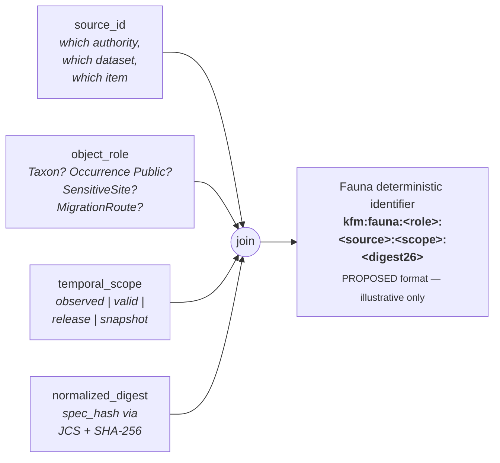
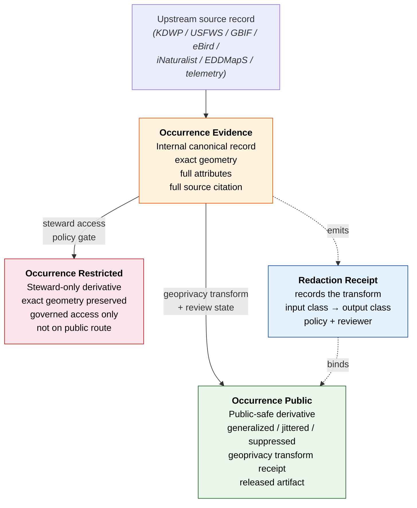
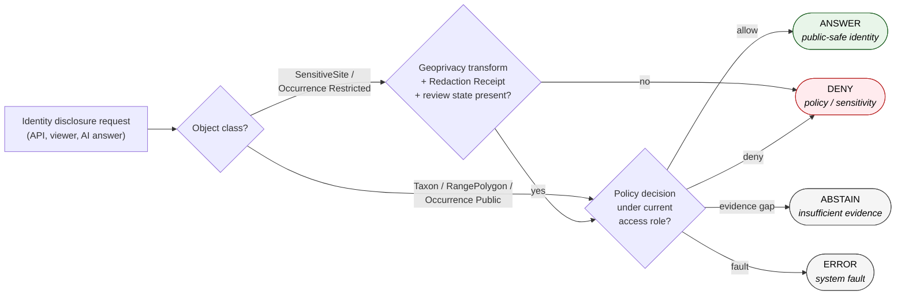
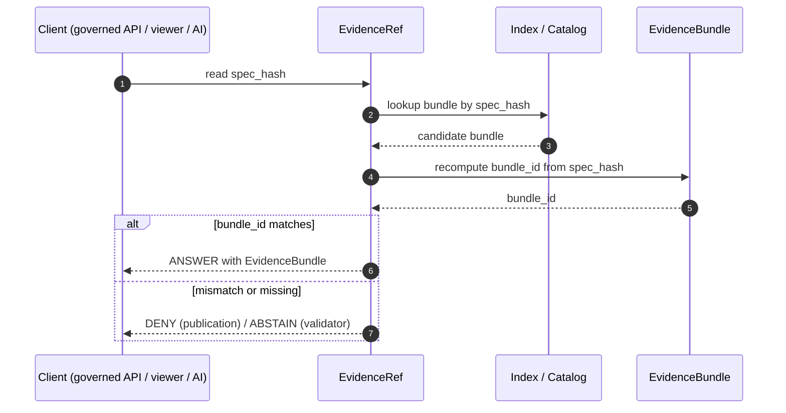
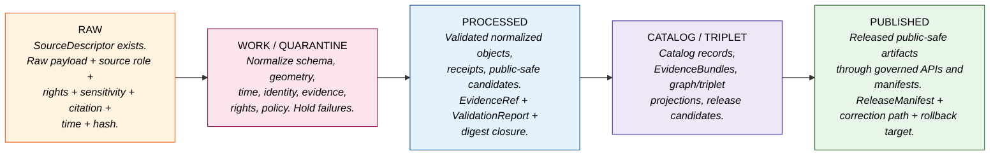

<!-- [KFM_META_BLOCK_V2]
doc_id: kfm://doc/fauna-identity-model
title: Fauna — Identity Model
type: standard
version: v1.1
status: draft
owners: DOM-FAUNA steward + Docs steward + Schema steward (PLACEHOLDER — NEEDS VERIFICATION)
created: 2026-05-16
updated: 2026-06-02
policy_label: public
contract_version: "3.0.0"
related:
  - docs/domains/fauna/README.md                         # PROPOSED — NEEDS VERIFICATION
  - docs/domains/fauna/CANONICAL_PATHS.md                # PROPOSED — NEEDS VERIFICATION
  - docs/runbooks/fauna/SOURCE_REFRESH_RUNBOOK.md        # CONFIRMED — drafted in this project series
  - docs/doctrine/directory-rules.md                     # CONFIRMED — this project (v1.2/v1.3)
  - ai-build-operating-contract.md                       # CONFIRMED — canonical operating contract v3.0
  - docs/doctrine/lifecycle-law.md                       # PROPOSED — NEEDS VERIFICATION
  - docs/doctrine/truth-posture.md                       # PROPOSED — NEEDS VERIFICATION
  - docs/doctrine/trust-membrane.md                      # PROPOSED — NEEDS VERIFICATION
  - docs/architecture/contract-schema-policy-split.md    # PROPOSED — NEEDS VERIFICATION
  - docs/standards/PROV.md                               # CONFIRMED — drafted in this project series
  - docs/standards/CANONICALIZATION.md                   # PROPOSED — NEEDS VERIFICATION (C8-05 expansion)
  - policy/sensitivity/fauna/                            # PROPOSED — NEEDS VERIFICATION (Atlas §24.13 crosswalk)
  - policy/domains/fauna/                                # PROPOSED — NEEDS VERIFICATION (Directory Rules §6.5)
  - docs/adr/ADR-0001-schema-home.md                     # CONFIRMED — cited by Directory Rules §2.4(3)
tags: [kfm, fauna, identity, taxonomy, geoprivacy, evidence, governance, doctrine]
notes:
  - "CONTRACT_VERSION = 3.0.0 pinned per ai-build-operating-contract.md."
  - Doctrinal claims (lifecycle, deny-by-default sensitivity, six temporal facets, spec_hash via JCS+SHA-256, source-role anti-collapse, taxonomic anchoring) are CONFIRMED.
  - Implementation-level claims (schema paths, validator names, route names, exact deterministic ID format strings) are PROPOSED until verified against a mounted repository.
  - Occurrence Evidence / Occurrence Restricted / Occurrence Public is a triad of separately-identified objects, not three views of one object. See §6.
  - "MonitoringEvent" appears in the §8 register but is NOT in the Atlas v1.1 Fauna ownership list — flagged CONFLICTED, see §8 and Open Questions OQ-FAUNA-ID-05.
  - "NestDenRoostSpawningSite" is a PROPOSED descriptive grouping under SensitiveSite, not a distinct Atlas family — see §7.
[/KFM_META_BLOCK_V2] -->

# 🦌 Fauna — Identity Model

> **What it means for two Fauna objects to be "the same thing" — and the kinds of sameness the Fauna domain refuses to collapse.**

[](#) [](#) [](#) [](#) [](#) [](#) [](#) [](#) [](#)

**Status:** Draft · **Version:** v1.1 · **Owners:** DOM-FAUNA steward + Docs steward + Schema steward *(PLACEHOLDER — NEEDS VERIFICATION)* · **Updated:** 2026-06-02

---

<a id="contents"></a>

## Contents

1. [Scope and audience](#1-scope-and-audience)
2. [Doctrinal anchors](#2-doctrinal-anchors)
3. [The four-part identity basis](#3-the-four-part-identity-basis)
4. [Six temporal facets kept distinct](#4-six-temporal-facets-kept-distinct)
5. [Taxonomic identity and crosswalks](#5-taxonomic-identity-and-crosswalks)
6. [The occurrence triad — Evidence, Restricted, Public](#6-the-occurrence-triad--evidence-restricted-public)
7. [SensitiveSite and the deny path](#7-sensitivesite-and-the-deny-path)
8. [Object-by-object identity register](#8-object-by-object-identity-register)
9. [Cross-lane joins and identity preservation](#9-cross-lane-joins-and-identity-preservation)
10. [`spec_hash`, `bundle_id`, `evidence_ref_id`](#10-spec_hash-bundle_id-evidence_ref_id)
11. [Identity through the lifecycle](#11-identity-through-the-lifecycle)
12. [Failure modes and required behavior](#12-failure-modes-and-required-behavior)
13. [Open questions register](#13-open-questions-register)
14. [Open verification backlog](#14-open-verification-backlog)
15. [Changelog](#15-changelog)
16. [Definition of done](#16-definition-of-done)
17. [Related docs](#17-related-docs)

---

## 1. Scope and audience

This document defines the **identity model** for the Fauna domain (`DOM-FAUNA`): the rules by which Fauna objects acquire stable identifiers, the facets of "sameness" the domain refuses to collapse, the rules for resolving an `EvidenceRef` to its `EvidenceBundle`, and the sensitivity controls that gate identity disclosure.

It is **doctrine-first**. It does not invent new object families, new taxonomic authorities, or new sensitivity classes; it codifies the identity rules already implied by the Fauna domain dossier, the Domains Culmination Atlas v1.1, the Unified Implementation Architecture Build Manual, the Pass 10 Idea Index, and the cross-cutting evidence/identity ideas (`C1-02`, `C7-07`, `C7-08`, `C8-05`).

Audience:

- **Schema and contract authors** wiring identity fields into `schemas/contracts/v1/fauna/…` and `contracts/fauna/…`. *(PROPOSED paths; see Directory Rules §12 and Atlas §24.13.)*
- **Pipeline and connector authors** emitting Fauna RAW/WORK/PROCESSED/CATALOG artifacts.
- **Reviewers and stewards** verifying that an identity claim is defensible under cite-or-abstain and deny-by-default postures.
- **Governed AI** authors — identity is what lets a generated answer cite, not invent.

> [!IMPORTANT]
> **Identity is a trust-bearing property, not a convenience.** Two Fauna records may share a name, a genus, a county, and a year, yet be *different things*. Identity decides which records are "the same animal record," which are "the same released derivative," and which records cannot be safely merged at all under current rights or sensitivity. Conflate them and the trust membrane leaks.

[Back to top ↑](#contents)

---

## 2. Doctrinal anchors

The Fauna identity model is constrained by the following anchors. Each is **CONFIRMED doctrine**; its concrete realization in the repository is **PROPOSED** until verified against a mounted repo.

| Anchor | Source | Effect on identity |
|---|---|---|
| **Lifecycle invariant** — RAW → WORK / QUARANTINE → PROCESSED → CATALOG / TRIPLET → PUBLISHED | Directory Rules §3; `DIRRULES`; ENCY Appendix E | Identity must remain stable across stages; promotion is a governed state transition, not a re-identification. |
| **Cite-or-abstain truth posture** | Core invariants; `ENCY` | Identity claims with missing or mismatched `EvidenceRef → EvidenceBundle` resolution must `ABSTAIN`, not paper over the gap. |
| **Deny-by-default sensitivity** | `DOM-FAUNA §I`; Atlas §20.5 Deny-by-Default Register | Identity disclosure for exact sensitive occurrences, nests, dens, roosts, hibernacula, spawning, and steward-controlled records fails closed without geoprivacy + Redaction Receipt + public-safe derivative. |
| **Trust membrane** | Directory Rules §13.2; UIAI-MAP | Public clients receive only `Occurrence Public` and other public-safe identities; restricted identities are never served on a public route. |
| **Watcher-as-non-publisher invariant** | Directory Rules §13; ENCY | A watcher may *propose* an identity (PROPOSED record) but never *publish* one. |
| **Deterministic identity basis** — `source id + object role + temporal scope + normalized digest` | Domains Culmination Atlas v1.1 §7.E (Fauna object families) | The four-part basis is identical across every Fauna object family; the values differ. |
| **`spec_hash` via JCS + SHA-256** | `C1-02` (CONFIRMED); recorded as `jcs:sha256:<hex>` | The normalized digest portion of identity uses RFC 8785 JCS canonicalization followed by SHA-256. |
| **Six temporal facets distinct** | Domains Culmination Atlas v1.1 §7.E (every Fauna row) | Source, observed, valid, retrieval, release, and correction times stay distinct where material. Identity must not silently collapse them. |
| **Taxonomic anchoring required** | `C7-07` ITIS TSN; `C7-08` GBIF Backbone DOI `10.15468/39omei` | Every species-level Fauna record carries an ITIS TSN anchor where ITIS has coverage; GBIF Backbone serves as the international crosswalk and second-line anchor. |

[Back to top ↑](#contents)

---

## 3. The four-part identity basis

Every Fauna object's deterministic identifier composes four parts. The composition is **PROPOSED**; the *requirement that the four parts exist* is **CONFIRMED** by the Atlas v1.1 Fauna `Identity rule` column, which reads identically for every family: *"PROPOSED deterministic basis: source id + object role + temporal scope + normalized digest."*

```text
deterministic_id_basis = ( source_id, object_role, temporal_scope, normalized_digest )
```



### 3.1 What each part carries

- **`source_id`** — the registered identifier of the upstream record under `data/registry/sources/fauna/<source_id>/…` *(PROPOSED path; CONFIRMED responsibility root per Directory Rules §3/§12)*. Examples of distinct `source_id` values (illustrative, not literal): a KDWP heritage record, a USFWS ECOS species page, a NatureServe element occurrence, a GBIF occurrence GBIF-ID, an eBird checklist observation, an iNaturalist observation, an EDDMapS record, an agency telemetry sample.
- **`object_role`** — the Fauna object family the record realizes (see §8). The role is not optional; it is what prevents two records that happen to share a `source_id` from being collapsed into one.
- **`temporal_scope`** — the time slice the record claims authority over. The Atlas keeps six time facets distinct (§4); the `temporal_scope` portion of the identifier names the *kind* of time being scoped, not all six values.
- **`normalized_digest`** — the `spec_hash` (RFC 8785 JCS + SHA-256, recorded as `jcs:sha256:<hex>`) over the canonicalized identity-bearing payload (object_type, schema_version, source_refs, evidence_refs, policy_label, sensitivity, taxonomic anchors, temporal facets that materially change meaning). Transport/runtime fields (storage URLs, signatures, nonces, wall-clock timestamps that do not change meaning) are **excluded** from the digest. *(See §10.)*

> [!NOTE]
> **The four parts are non-substitutable.** Two Taxa from the same `source_id` and same `temporal_scope` with different normalized payloads are different Taxa, not "versions of the same Taxon." The thread of continuity across versions is carried by the **Taxon Crosswalk** and explicit `prov:wasRevisionOf` / `kfm:supersedes` links, not by identity reuse.

[Back to top ↑](#contents)

---

## 4. Six temporal facets kept distinct

Every Fauna object's `Temporal handling` row in the Atlas v1.1 reads identically: **"CONFIRMED source, observed, valid, retrieval, release, and correction times stay distinct where material."** That is **CONFIRMED doctrine** and it has direct identity consequences.

| Facet | Question it answers | Identity consequence |
|---|---|---|
| **Source time** | When did the upstream record assert this? | Two records asserting the same fact at different source times are distinct facts. |
| **Observed time** | When was the underlying phenomenon observed in the field (or instrument)? | Two observations of the same taxon at the same place at different observed times are distinct `Occurrence Evidence` records. |
| **Valid time** | Over what real-world interval does the assertion claim to hold? | A `SeasonalRange` valid for breeding season 2024 is not the same record as one valid for 2025. |
| **Retrieval time** | When did KFM fetch the bytes? | Used in receipts and provenance, not in the identity digest unless retrieval *materially changes* meaning. |
| **Release time** | When did KFM promote a derivative to PUBLISHED? | `Occurrence Public` records are released; their release time differentiates two public derivatives built from the same `Occurrence Evidence`. |
| **Correction time** | When was a corrected record emitted? | A correction emits a new identity that **`prov:wasRevisionOf`** the prior one; the prior identity is retained for audit, not overwritten. |

> [!WARNING]
> **Do not encode wall-clock `retrieval_time` directly into the `normalized_digest`.** That would rotate identity on every refetch and break reproducibility. Retrieval time lives in the `RunReceipt`. Identity digests only the facets that *change meaning*, not the facets that change *with each run*.

[Back to top ↑](#contents)

---

## 5. Taxonomic identity and crosswalks

Fauna's most-asked identity question is *"is this the same species?"* The KFM doctrine for that question is **anchor-based, not name-based**: every species-level Fauna record carries one or more durable authority anchors, and the system fails closed when those anchors are missing for in-scope records. *(Authority-anchoring fail-closed doctrine per `C7`; the system "fails closed when those IRIs are missing for in-scope record types.")*

### 5.1 The required anchors

| Authority | Role | Status | Source |
|---|---|---|---|
| **ITIS TSN** | U.S.-canonical taxonomic authority. Required anchor for any species-level record where ITIS has coverage. | CONFIRMED | `C7-07`; itis.gov |
| **GBIF Backbone Taxonomy** (DOI `10.15468/39omei`) | International crosswalk and second-line anchor when ITIS lags (invertebrates, fungi, parts of plants). Backbone DOI version must be captured in the run receipt. | CONFIRMED | `C7-08` |
| **Wikidata QID** | Routing anchor — not a sole truth source. Used to bridge other authority IRIs (LCNAF, VIAF, GBIF, etc.). Stored alongside upstream IRIs, not in place of them. | CONFIRMED | `C7-01` |
| **NatureServe Element / Global ID** | Heritage/conservation anchor for rare-species governance. | PROPOSED | `C7.c`; DOM-FAUNA source families |
| **IUCN Red List ID** | International conservation-status anchor. | PROPOSED | `C7.c` Taxonomic Authorities |
| **USFWS ECOS species code** | Federal listing anchor for ESA-relevant taxa. | PROPOSED | DOM-FAUNA source families |
| **USDA PLANTS symbol** | Federal symbol carried in the taxon crosswalk where applicable. | PROPOSED | `KFM-P13-PROG-0025` (taxon crosswalk table) |

### 5.2 Why `Taxon` and `Taxon Crosswalk` are *separate* object families

The Atlas v1.1 lists both `Taxon` and `Taxon Crosswalk` as independent Fauna object families with independent identity rules. This is intentional:

- A **`Taxon`** is a domain object — one authoritative animal taxonomic identity, scoped to a source role and temporal scope, with its own `spec_hash`.
- A **`Taxon Crosswalk`** is a bridge object — one mapping between two anchors (e.g., "this KFM Taxon is also ITIS TSN 174371 and GBIF taxonKey 2480637 as observed on 2026-04-12"). It has its own identity because **the mapping is itself a claim**, with its own evidence, its own retrieval, its own staleness, and its own correction path. The corpus envisages a versioned crosswalk "linking ITIS TSN, GBIF taxonKey, USDA symbols, scientific names, ranks, authorship, hierarchy, license, and source opinion provenance." *(`KFM-P13-PROG-0025`, PROPOSED.)*

Treating the crosswalk as a separate identity prevents two failure modes:

1. **Silent re-anchoring.** When a new GBIF Backbone version reassigns a synonym, the crosswalk identity rotates while the underlying KFM `Taxon` identity does not — preserving downstream references.
2. **Crosswalk laundering.** A Wikidata QID swap upstream cannot mutate a previously-released KFM Taxon's identity; it can only emit a new crosswalk with its own provenance.

> [!TIP]
> **When ITIS and GBIF disagree** on the accepted name, the corpus default is *ITIS for federal-data reconciliation, GBIF for international biodiversity queries* — but `C7-07` is explicit that this default **is not yet codified in the policy bundle**. The disagreement itself is data: emit two `Taxon Crosswalk` records, one anchored to each, and let the policy layer choose which to expose where. Do not invent a third "merged" identity. *(Tie-breaker policy unresolved — see `C7-07` open questions; this is a **NEEDS VERIFICATION** item, OQ-FAUNA-ID-02.)*

[Back to top ↑](#contents)

---

## 6. The occurrence triad — Evidence, Restricted, Public

The Fauna domain owns **three separately-identified occurrence object families**, not one occurrence object with three views. The Atlas v1.1 lists `Occurrence Evidence`, `Occurrence Restricted`, and `Occurrence Public` as three distinct families, each with the same four-part deterministic identity rule applied to different payloads.



### 6.1 Three identities, three different digests

| Object family | `object_role` | Geometry truth | Digest covers | Routable on |
|---|---|---|---|---|
| **`Occurrence Evidence`** | `OccurrenceEvidence` | Exact, as provided by source | Source ref, taxon anchors, exact geometry, source role, observation facets, rights, sensitivity class | Internal review surfaces only |
| **`Occurrence Restricted`** | `OccurrenceRestricted` | Exact, with restricted-access controls | Same as Evidence + restricted access class + steward review state | Governed steward routes only |
| **`Occurrence Public`** | `OccurrencePublic` | **Transformed** — generalized, jittered, gridded, suppressed, or delayed | Public-safe geometry, `RedactionReceipt` ref, generalization rule id, taxon anchors, release time | Public route via `apps/governed-api/` |

### 6.2 Why the digests must differ

Because the **payloads differ**, the JCS canonicalization of each yields a different byte string and therefore a different `spec_hash`. That is the point. The deterministic digest is what lets a verifier confirm that a record returned on a public route is the **public derivative** and not the internal canonical record. If the digests collided, the trust membrane would have no machine-checkable boundary.

> [!CAUTION]
> **`Occurrence Public` is not a "view" of `Occurrence Evidence` — it is a distinct trust object with its own identity, its own bundle, and its own release manifest.** Pipelines that emit a "public version" by toggling an `is_public` flag on the canonical record collapse the triad and break the membrane. The geoprivacy transform must be a real transform that emits a real new object, with a `RedactionReceipt` recording input class, output class, policy, reviewer, reason, and residual risk. The supporting schema rule is captured as PROPOSED: a fauna occurrence schema should require `public_safe_geometry` when `geoprivacy_status` is obscured, private, or generalized *(`KFM-P25-PROG-0017`, PROPOSED)*. Concrete transform types — suppress, generalize-to-grid, generalize-to-watershed-or-county, buffer, constrained-jitter, delayed-publication, steward-only-exact — remain **PROPOSED**.

[Back to top ↑](#contents)

---

## 7. SensitiveSite and the deny path

`SensitiveSite` carries **deny-by-default identity disclosure** regardless of source. That is **CONFIRMED doctrine**: per `DOM-FAUNA §I`, *"exact sensitive occurrence, nest, den, roost, hibernacula, spawning, and steward-controlled records fail closed,"* and the Atlas §20.5 Deny-by-Default Register pairs Fauna's *"exact sensitive occurrences, nests/dens/roosts/hibernacula/spawning"* with the gate *"geoprivacy + Redaction Receipt + public-safe derivative."*

> [!NOTE]
> **`NestDenRoostSpawningSite` is a PROPOSED descriptive grouping, not a separate Atlas family.** The Atlas v1.1 lists `SensitiveSite` as the single sensitive-site family; "nest / den / roost / hibernaculum / spawning" appear as a descriptive enumeration of *site types*, not as a distinct object family. This doc treats them as a `site_type` discriminator inside `SensitiveSite` (see §8). Promoting them to a separate family is an ADR-class decision. *(OQ-FAUNA-ID-06.)*



The fauna identity model treats **the existence of a SensitiveSite** as itself sensitive in many cases: even confirming "yes, a peregrine eyrie exists in this watershed" can be a disclosure. The four-part identifier therefore reaches the public surface only when the geoprivacy transform, Redaction Receipt, and review state all authorize it. Otherwise, the public route returns `DENY` and the internal identity is preserved under restricted access. The OPA-policy expression of this is captured as PROPOSED: policy should return `ABSTAIN` or `DENY` for sensitive fauna unless spatial generalization, aggregation, or access-gating obligations are satisfied *(`KFM-P24-PROG-0013`, PROPOSED)*.

> [!WARNING]
> **Join-induced sensitivity.** A `Taxon` identity that is publicly safe in isolation can become sensitive when joined to `Habitat`, `Hydrology` (spawning streams), or fine-grained `Occurrence Public` (clustered records that re-localize the species). The sensitivity is a property of the **join product**, not just of the inputs. Validators must check the *output* class, not just the input classes. *(Sensitive-join-fail-closed posture is CONFIRMED across the Fauna source-family table; the specific cross-lane join policy is ADR-class — see ADR-S-14.)*

[Back to top ↑](#contents)

---

## 8. Object-by-object identity register

The following register reproduces the Atlas's identity rule for every Fauna object family and adds the **identity-determining inputs** that the `normalized_digest` should canonicalize. The four-part deterministic basis is uniform across rows; the *values* it draws on differ.

> [!NOTE]
> Every row carries the same **PROPOSED deterministic basis** — `source id + object role + temporal scope + normalized digest` — and the same **CONFIRMED temporal rule** that source, observed, valid, retrieval, release, and correction times stay distinct where material. The "Identity-determining inputs" column is **PROPOSED** and is the column most likely to need iteration as schemas land.

> [!CAUTION]
> **Atlas ownership scope.** The Atlas v1.1 Fauna ownership list (`DOM-FAUNA §B`) names **fourteen** families: Taxon, Taxon Crosswalk, Conservation Status, Occurrence Evidence, Occurrence Restricted, Occurrence Public, RangePolygon, SeasonalRange, MigrationRoute, SensitiveSite, MortalityObservation, DiseaseObservation, Invasive Species Record, and Redaction Receipt. **`MonitoringEvent` is NOT in that list** and is included below only as a **CONFLICTED / PROPOSED** candidate, pending an ADR that either admits it to Fauna ownership or assigns it to a neighboring lane. Do not treat `MonitoringEvent` as a confirmed Fauna family. *(OQ-FAUNA-ID-05.)*

<details>
<summary><b>Expand the full Fauna identity register (14 Atlas families + 1 CONFLICTED candidate)</b></summary>

| Object family | `object_role` | Identity-determining inputs (digest scope) | Notes |
|---|---|---|---|
| **Taxon** | `Taxon` | Source ref · ITIS TSN (where covered) · GBIF Backbone DOI version · accepted scientific name · rank · authorship · temporal scope of authority assertion | CONFIRMED family. Anchor-based; never identified by name alone. |
| **Taxon Crosswalk** | `TaxonCrosswalk` | Source ref · pair of anchored IRIs (e.g. ITIS TSN ↔ GBIF taxonKey) · mapping confidence · retrieval time of the upstream pair | CONFIRMED family. Distinct identity per mapping pair, per retrieval. |
| **Conservation Status** | `ConservationStatus` | Source ref (USFWS / NatureServe / IUCN / KDWP) · Taxon anchor · status code · status scope (federal / state / global / subnational) · effective interval (valid time) | CONFIRMED family. Status changes emit a new identity, not an in-place update. |
| **Occurrence Evidence** | `OccurrenceEvidence` | Source ref · Taxon anchor · exact geometry · observation method · observed time · evidence quality · rights · sensitivity class | CONFIRMED family. Internal canonical record. |
| **Occurrence Restricted** | `OccurrenceRestricted` | Same as Evidence + restricted access class + steward review state | CONFIRMED family. Exact geometry retained; not routable on public surfaces. |
| **Occurrence Public** | `OccurrencePublic` | Taxon anchor · **transformed** geometry · `RedactionReceipt` ref · generalization rule id · release time | CONFIRMED family. Public-safe derivative; distinct digest from Evidence/Restricted. |
| **RangePolygon** | `RangePolygon` | Source ref · Taxon anchor · polygon geometry · methodology (modeled / observed / authoritative) · valid time | CONFIRMED family. Methodology in the digest so modeled and observed ranges do not collide. |
| **SeasonalRange** | `SeasonalRange` | Source ref · Taxon anchor · season descriptor · polygon geometry · valid time interval | CONFIRMED family. One identity per season per valid interval. |
| **MigrationRoute** | `MigrationRoute` | Source ref · Taxon anchor · route geometry · temporal pattern · methodology | CONFIRMED family. Lines, not polygons; methodology distinguishes telemetry-derived vs literature-derived routes. |
| **SensitiveSite** | `SensitiveSite` | Source ref · Taxon anchor · site type (nest / den / roost / hibernaculum / spawning) · exact geometry · sensitivity class · steward record | CONFIRMED family. **Deny-by-default identity disclosure.** `site_type` is a discriminator, not a separate family (§7). |
| **MortalityObservation** | `MortalityObservation` | Source ref · Taxon anchor · cause class · observed time · location (subject to sensitivity rules) | CONFIRMED family. Cause class is identity-bearing: two records of the same death by different attributed causes are different claims. |
| **DiseaseObservation** | `DiseaseObservation` | Source ref · Taxon anchor · pathogen anchor (where applicable) · observed time · diagnostic basis | CONFIRMED family. Pathogen anchor preserves identity across taxon hosts. |
| **Invasive Species Record** | `InvasiveSpeciesRecord` | Source ref · Taxon anchor · location class · observed time · response status | CONFIRMED family. EDDMapS-style; response status is identity-bearing. |
| **Redaction Receipt** | `RedactionReceipt` | Input object identity · output object identity · transform rule id · policy ref · reviewer · reason · residual risk class | CONFIRMED family. Binds Occurrence Evidence → Occurrence Public (or analogous pairs); the receipt's own identity is the audit anchor. |
| **MonitoringEvent** *(CONFLICTED)* | `MonitoringEvent` | Source ref · monitoring program id · station / transect / route id · observed time · methodology | **CONFLICTED — not in Atlas v1.1 Fauna ownership list.** Included as a PROPOSED candidate only. Would be distinct from `Occurrence Evidence` (one event may emit many occurrences). Resolution pending ADR. *(OQ-FAUNA-ID-05.)* |

</details>

[Back to top ↑](#contents)

---

## 9. Cross-lane joins and identity preservation

The Fauna domain joins to neighboring lanes. Each join preserves ownership, source role, sensitivity, and `EvidenceBundle` support. Joins do **not** rename identity — a Fauna `Taxon` is still owned by Fauna when it appears next to a Habitat `HabitatPatch`. *(Fauna's explicit non-ownership boundary is CONFIRMED: "Habitat owns habitat patches and suitability; Flora owns plant records; hydrology/soil/agriculture/roads/people provide context only through governed joins.")*

| This domain | Related lane | Relation type | Identity rule |
|---|---|---|---|
| **Fauna** | **Habitat** | Derived habitat assignment and seasonal support. | Habitat owns the assignment object's identity; Fauna's `Taxon` and `Occurrence` identities are referenced, not absorbed. Joined outputs that re-localize sensitive species must pass a sensitivity check on the **product**. |
| **Fauna** | **Flora** | Ecological community, pollinator, invasive, food-web context. | Flora owns plant identities; pollinator-host edges carry their own identity as relation objects. |
| **Fauna** | **Hydrology** | Aquatic / riparian / wetland / spawning context. | Hydrology owns reach / waterbody identities; spawning-site joins inherit Fauna's deny-by-default posture. |
| **Fauna** | **Hazards** | Disease, mortality, wildfire, flood, drought exposure. | Hazards owns event identities; Fauna's `MortalityObservation` / `DiseaseObservation` reference hazard events without merging identities. |

> [!IMPORTANT]
> **A join is not a remapping.** When Habitat asks "what taxa occur in this patch?", the answer carries Fauna `Taxon` identifiers verbatim. Habitat must not mint a "habitat-scoped taxon id" — that would create a parallel identity space and break the lane boundary. *(Directory Rules §13 — schema-mirror divergence and parallel-home anti-patterns.)*

[Back to top ↑](#contents)

---

## 10. `spec_hash`, `bundle_id`, `evidence_ref_id`

The `normalized_digest` portion of every Fauna identity is computed as **`spec_hash`** per `C1-02` (CONFIRMED): canonicalize via RFC 8785 JCS, then take SHA-256 over the canonical bytes, recorded as `jcs:sha256:<hex>`.

```text
spec_hash = jcs:sha256:<hex>
        where <hex> = SHA-256( JCS_canonical_bytes( identity_payload ) )
```

### 10.1 What goes in the `identity_payload`

**Include** (these change identity if they change):

- `object_type` (the `object_role`)
- `schema_version`
- `source_refs` (canonical source identifiers, e.g. ITIS TSN, GBIF Backbone DOI version + taxonKey)
- `evidence_refs`
- `object_refs` (linked Fauna or cross-lane objects that bind meaning)
- `policy_label` and `rights_status`
- `sensitivity` class
- Temporal facets that materially change meaning (e.g. valid time for a `SeasonalRange`; observed time for an `Occurrence Evidence`)
- Taxonomic anchors (ITIS TSN, GBIF taxonKey + Backbone DOI version, Wikidata QID, etc.)

**Exclude** (these are transport/runtime and must not rotate identity):

- Storage URLs
- Wall-clock `retrieval_time` (lives in `RunReceipt`)
- Signatures, nonces, attestation bundles
- Pretty-printing / whitespace variations
- Mutable file paths

> [!IMPORTANT]
> **Hash the canonicalized bytes, not the developer-formatted JSON.** Per `C1-02`, the corpus is explicit that hashing developer-formatted JSON is not acceptable, because trivial reformatting would produce different hashes and break re-runs and audits. Use RFC 8785 JCS; reserve W3C URDNA2015 for cases where RDF-semantic equivalence is the relevant invariant (per `C8-05`). Record the canonicalization choice in the receipt.

### 10.2 Bundle and ref IDs

The following ID-derivation forms are **PROPOSED** (retained from prior drafts; not yet codified against a mounted schema):

```text
bundle_id        = "eb-" + base32(lowercase(SHA-256(spec_hash)))[:26]
evidence_ref_id  = "er-" + base32(lowercase(SHA-256(target_bundle_spec_hash)))[:26]
```

IDs derive only from the normalized spec; **no environment entropy**. The exact normalization rules are intended to live under `schemas/contracts/v1/evidence/…` *(PROPOSED — NEEDS VERIFICATION; schema home governed by ADR-0001)* and to be enforced by validators.

### 10.3 Resolution path



> [!NOTE]
> **Hash algorithm stability.** SHA-256 is the descriptor identity hash; a future migration to another algorithm requires an ADR and a dual-hash compatibility window. BLAKE3 appears in the corpus as a candidate for streaming artifact roots, but **not** as the descriptor identity hash; the corpus leaves the SHA-256-vs-BLAKE3-vs-dual-hash question open. A hash-policy ADR is open (see §13, OQ-FAUNA-ID-05's sibling §14 item).

[Back to top ↑](#contents)

---

## 11. Identity through the lifecycle

Identity does not change as an object passes through the lifecycle stages; what changes is the *kind* of object emitted and therefore its `object_role`.



Identity-bearing properties at each stage *(stage handling and gates are CONFIRMED doctrine per `DOM-FAUNA §H`; implementation status is PROPOSED):*

| Stage | Identity-bearing artifacts | Identity gate |
|---|---|---|
| **RAW** | `SourceDescriptor` per source; raw payload digest | `SourceDescriptor` exists. |
| **WORK / QUARANTINE** | Candidate Fauna object identities; quarantine receipts on failure | Validation and policy gate pass, or quarantine reason is recorded. |
| **PROCESSED** | Validated `Occurrence Evidence` / `Taxon` / etc. identities; `RunReceipt`; `ValidationReport` | `EvidenceRef`, `ValidationReport`, and digest closure exist. |
| **CATALOG / TRIPLET** | `EvidenceBundle` (with `bundle_id`); graph/triplet projection identities | Catalog/proof closure passes. |
| **PUBLISHED** | `Occurrence Public` and other public-safe identities; `ReleaseManifest`; `RollbackCard` | `ReleaseManifest`, correction path, rollback target, and review/policy state exist. |

> [!IMPORTANT]
> **Promotion is a governed state transition, not a re-identification.** A `PROCESSED` `Occurrence Evidence` keeps its identity into `CATALOG / TRIPLET`. Promotion to `PUBLISHED` does **not** emit a new identity for the Evidence record itself — it emits a *new* `Occurrence Public` derivative with its *own* identity, bound by a `RedactionReceipt` to the canonical Evidence. The Evidence identity is referenced, never overwritten.

[Back to top ↑](#contents)

---

## 12. Failure modes and required behavior

The identity model defines explicit failure modes. Each maps to a finite outcome — `ANSWER` / `ABSTAIN` / `DENY` / `ERROR` — per the **`RuntimeResponseEnvelope`** (the canonical finite-outcome envelope; the bespoke `FaunaDecisionEnvelope` named in some Atlas tables is superseded by `RuntimeResponseEnvelope` + `AIReceipt` for AI/runtime surfaces).

| # | Failure mode | Validator outcome | Publication outcome | Emitted code |
|---|---|---|---|---|
| 1 | **Missing bundle** — `EvidenceRef` resolves to nothing. | `ABSTAIN` | `DENY` | `ResolutionError.missing_bundle` |
| 2 | **Hash mismatch** — `bundle_id` does not recompute from referenced `spec_hash`. | `ABSTAIN` | `DENY` | `ResolutionError.spec_hash_mismatch` |
| 3 | **Missing taxonomic anchor** — species-level record lacks ITIS TSN (where covered) or GBIF Backbone fallback. | `ABSTAIN` | `DENY` | `IdentityError.missing_taxonomic_anchor` |
| 4 | **Sensitivity disclosure without transform** — sensitive identity requested without geoprivacy transform + Redaction Receipt + review state. | `DENY` | `DENY` | `PolicyError.sensitive_identity_no_transform` |
| 5 | **Cross-lane identity laundering** — a non-Fauna lane attempts to mint a Fauna-scoped identity. | `DENY` | `DENY` | `PolicyError.identity_laundering` |
| 6 | **Identity collision across triad** — `Occurrence Evidence`, `Occurrence Restricted`, `Occurrence Public` digests collide. | `ABSTAIN` | `DENY` | `IdentityError.triad_digest_collision` |
| 7 | **Canonicalization drift** — pipeline and validator disagree on JCS vs URDNA2015 output. | `ABSTAIN` | `DENY` | `IdentityError.canonicalization_drift` |
| 8 | **Stale crosswalk** — Taxon Crosswalk references a superseded GBIF Backbone DOI version. | `ABSTAIN` | `ABSTAIN` (publication may proceed with new crosswalk) | `IdentityWarning.stale_crosswalk` |

All codes above are **PROPOSED**; their final names should be registered alongside the validator exit-code contract ADR. *(The finite-outcome set `ANSWER / ABSTAIN / DENY / ERROR` itself is CONFIRMED doctrine.)*

[Back to top ↑](#contents)

---

## 13. Open questions register

| ID | Question | Owner role | Resolution path |
|---|---|---|---|
| OQ-FAUNA-ID-01 | Concrete deterministic ID **format string** for Fauna objects (`kfm:fauna:<role>:<source>:<scope>:<digest26>` is illustrative). | Schema steward | ADR pinning the format; schema entries under `schemas/contracts/v1/fauna/…`. |
| OQ-FAUNA-ID-02 | ITIS vs GBIF tie-breaker policy when accepted names disagree (`C7-07` notes this is not yet in the policy bundle). | DOM-FAUNA steward + Policy steward | Policy doc under `policy/domains/fauna/…`; `C7-07` follow-up. |
| OQ-FAUNA-ID-03 | Concrete geoprivacy transform rule set (suppress / generalize-to-grid / generalize-to-watershed / buffer / constrained-jitter / delayed-publication / steward-only-exact). | Policy steward | `policy/sensitivity/fauna/` rules + `RedactionReceipt` schema. |
| OQ-FAUNA-ID-04 | Decision between JCS and URDNA2015 for graph-shaped Fauna bundles (`C8-05`). | Schema steward | ADR; reference verifier in CI; `docs/standards/CANONICALIZATION.md`. |
| OQ-FAUNA-ID-05 | Is **`MonitoringEvent`** a Fauna-owned family (it is absent from Atlas v1.1 `DOM-FAUNA §B`), and is the hash-policy (SHA-256 / BLAKE3 / dual-hash) pinned? | DOM-FAUNA steward + Schema steward | Object-family ownership ADR; hash-policy ADR. |
| OQ-FAUNA-ID-06 | Is **`NestDenRoostSpawningSite`** a discriminator inside `SensitiveSite` or a separate family? | Schema steward | ADR; schema enum vs separate schema. |
| OQ-FAUNA-ID-07 | Is `Occurrence Restricted` a physically separate object or a `(spec_hash, access_class)`-keyed view of `Occurrence Evidence` with its own digest? | Schema steward | Schema under `schemas/contracts/v1/fauna/`; restricted/public split tests per `DOM-FAUNA §K`. |
| OQ-FAUNA-ID-08 | NatureServe / IUCN / USDA anchors — required vs optional status. | DOM-FAUNA steward | `data/registry/sources/fauna/` entries; rights review. |
| OQ-FAUNA-ID-09 | Concrete `temporal_scope` value vocabulary (`observed`, `valid`, `release`, `snapshot`, …). | Schema steward | Contract under `contracts/fauna/`; schema enum. |
| OQ-FAUNA-ID-10 | Single repo-wide identity validator vs per-domain validators. | Schema steward | `tools/validators/identity/…` presence; ADR. |
| OQ-FAUNA-ID-11 | `PROV.md` vs `PROVENANCE.md` naming for the standards anchor. | Docs steward | ADR; `docs/standards/` inspection. |

[Back to top ↑](#contents)

---

## 14. Open verification backlog

These items remain `NEEDS VERIFICATION` before promotion from `draft` to `published`:

1. Confirm the Fauna schema home `schemas/contracts/v1/fauna/…` against a mounted repo (Directory Rules §2.4(3) / ADR-0001).
2. Confirm `policy/sensitivity/fauna/` vs `policy/domains/fauna/` split against the mounted `policy/` tree (Directory Rules §6.5; Atlas §24.13 crosswalk).
3. Confirm whether `MonitoringEvent` exists as a Fauna schema or belongs to a neighboring lane (OQ-FAUNA-ID-05).
4. Verify the restricted/public occurrence split implementation (`DOM-FAUNA §N` "Verify restricted/public occurrence split").
5. Verify taxonomy-resolution implementation and ITIS/GBIF disagreement handling (`DOM-FAUNA §N`).
6. Verify public-layer safety and AI no-leak behavior (`DOM-FAUNA §N`).
7. Confirm the validator exit-code contract for `IdentityError.*` / `PolicyError.*` codes (§12).
8. Confirm the `bundle_id` / `evidence_ref_id` derivation forms against a mounted evidence schema (§10.2).

[Back to top ↑](#contents)

---

## 15. Changelog

| Change | Type (per contract §37) | Reason |
|---|---|---|
| Pinned `CONTRACT_VERSION = "3.0.0"` in meta block and badge row. | housekeeping | Doctrine-adjacent doc requirement. |
| Flagged `MonitoringEvent` as CONFLICTED (absent from Atlas v1.1 Fauna ownership list); register relabeled "14 families + 1 candidate." | reconciliation | Doc previously asserted a 15th family the Atlas does not own. |
| Clarified `NestDenRoostSpawningSite` as a PROPOSED `site_type` discriminator under `SensitiveSite`, not a distinct Atlas family. | reconciliation | Atlas lists only `SensitiveSite`; nest/den/roost/etc. are descriptive site types. |
| Sharpened sensitivity citation to Atlas §20.5 Deny-by-Default Register pairing (geoprivacy + Redaction Receipt + public-safe derivative). | clarification | Grounds the deny gate in the exact register row. |
| Added `RuntimeResponseEnvelope` supersession note over `FaunaDecisionEnvelope` in §12. | reconciliation | RuntimeResponseEnvelope + AIReceipt is canonical for AI/runtime surfaces. |
| Added USDA PLANTS symbol anchor row and `KFM-P13-PROG-0025` crosswalk-table reference. | gap closure | Corpus crosswalk table names USDA symbols among anchored fields. |
| Restructured tail into formal doctrine companion sections (Open Questions register, Verification backlog, Changelog, Definition of done). | housekeeping | Aligns with operating-contract doctrine-doc companion-section pattern. |
| Corrected Directory Rules section references (§3 root rule, §6.5 policy, §12 Domain Placement Law, §13 anti-patterns). | clarification | Matches Directory Rules v1.2/v1.3 numbering. |
| Bumped version v1 → v1.1; `updated` 2026-05-16 → 2026-06-02. | housekeeping | MINOR bump; no operating-law change, no receipt re-issue. |

> **Backward compatibility.** Section anchors §1–§12 are preserved. The former §7 anchor `#7-sensitivesite-nestdenroostspawningsite-and-the-deny-path` is renamed to `#7-sensitivesite-and-the-deny-path` — update inbound links. The former §13/§14 ("Verification backlog and open questions" / "Related docs") are split and renumbered into §13–§17; inbound deep links to those tail sections should be re-pointed.

[Back to top ↑](#contents)

---

## 16. Definition of done

This document is done enough to enter the repository when:

- it is placed according to Directory Rules (proposed home `docs/domains/fauna/IDENTITY_MODEL.md`, NEEDS VERIFICATION);
- a docs steward and the DOM-FAUNA + schema stewards review it;
- it is linked from the Fauna lane README / docs index and the doctrine index;
- it does not conflict with accepted ADRs (notably ADR-0001 schema home);
- the `MonitoringEvent` and `NestDenRoostSpawningSite` ownership questions (OQ-FAUNA-ID-05, -06) are recorded in `docs/registers/DRIFT_REGISTER.md`;
- any conflict with current repo conventions is logged in `docs/registers/DRIFT_REGISTER.md`;
- the `GENERATED_RECEIPT.json` planned in the notes is wired into CI;
- future changes follow the operating contract's §37 lifecycle.

[Back to top ↑](#contents)

---

## 17. Related docs

> [!NOTE]
> All paths below are **PROPOSED** per Directory Rules §2.5 except where marked CONFIRMED. They reflect the canonical lane pattern from Directory Rules §12 (Domain Placement Law) and the Atlas §24.13 responsibility-root crosswalk.

- `docs/domains/fauna/README.md` — Fauna lane orientation. *(PROPOSED — NEEDS VERIFICATION)*
- `docs/domains/fauna/CANONICAL_PATHS.md` — Fauna canonical paths register. *(PROPOSED — NEEDS VERIFICATION)*
- `docs/runbooks/fauna/SOURCE_REFRESH_RUNBOOK.md` — Operational refresh runbook for Fauna sources. *(CONFIRMED — drafted in this project series.)*
- `docs/doctrine/directory-rules.md` — Repository placement doctrine. *(CONFIRMED — this project, v1.2/v1.3.)*
- `ai-build-operating-contract.md` — Canonical operating contract, `CONTRACT_VERSION = "3.0.0"`. *(CONFIRMED — this project.)*
- `docs/doctrine/lifecycle-law.md` — RAW → PUBLISHED governing doctrine. *(PROPOSED — NEEDS VERIFICATION)*
- `docs/doctrine/truth-posture.md` — Cite-or-abstain posture. *(PROPOSED — NEEDS VERIFICATION)*
- `docs/doctrine/trust-membrane.md` — Public route / canonical store separation. *(PROPOSED — NEEDS VERIFICATION)*
- `docs/architecture/contract-schema-policy-split.md` — Contract / schema / policy responsibility split. *(PROPOSED — NEEDS VERIFICATION)*
- `docs/standards/PROV.md` — W3C PROV-O and PAV provenance profile. *(CONFIRMED — drafted in this project series; naming vs `PROVENANCE.md` is an open ADR item.)*
- `docs/standards/CANONICALIZATION.md` — JCS vs URDNA2015 canonicalization decision matrix. *(PROPOSED per `C8-05` expansion.)*
- `policy/sensitivity/fauna/` — Fauna sensitivity policy and geoprivacy transform rules. *(PROPOSED — NEEDS VERIFICATION; Atlas §24.13.)*
- `policy/domains/fauna/` — Fauna domain policy bundle. *(PROPOSED — NEEDS VERIFICATION; Directory Rules §6.5.)*
- `docs/adr/ADR-0001-schema-home.md` — Schema home ADR. *(CONFIRMED — cited by Directory Rules §2.4(3).)*

---

**Last updated:** 2026-06-02 · **Version:** v1.1 · **Status:** Draft · **CONTRACT_VERSION:** `3.0.0` · **Owners:** *PLACEHOLDER — NEEDS VERIFICATION* · [Back to top ↑](#contents)
