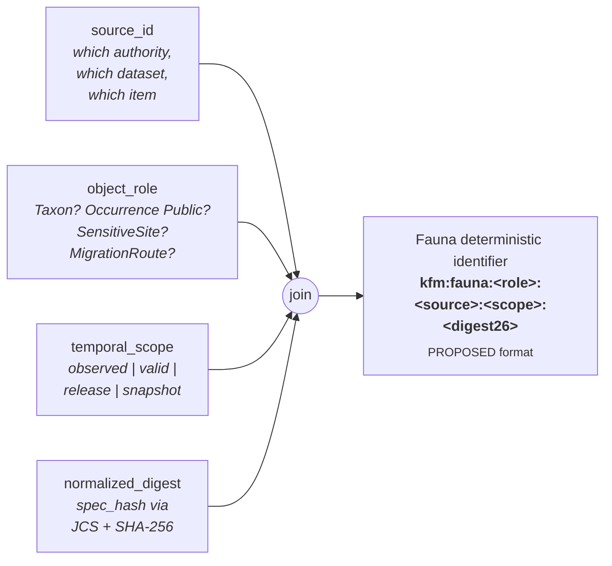
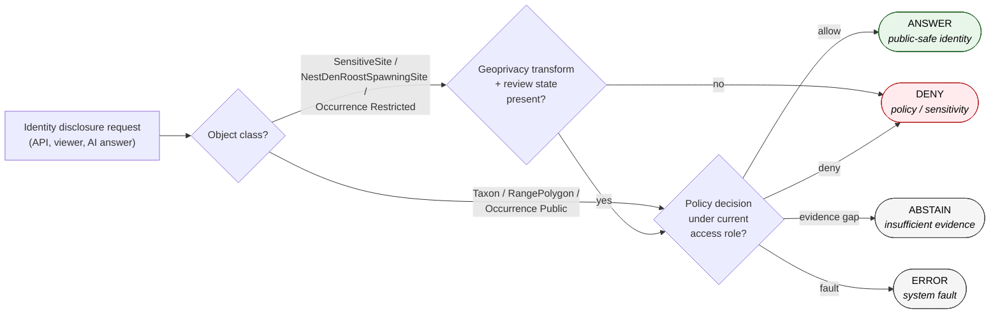
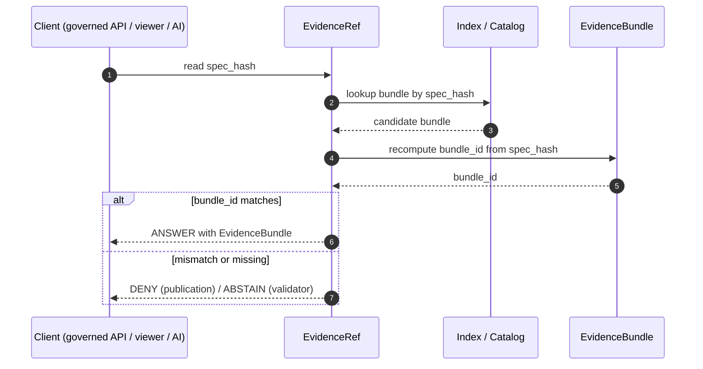
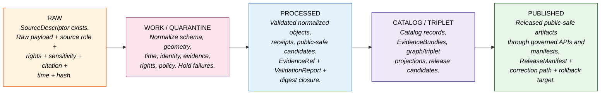

<!-- [KFM_META_BLOCK_V2]
doc_id: kfm://doc/fauna-identity-model
title: Fauna — Identity Model
type: standard
version: v1
status: draft
owners: DOM-FAUNA steward + Docs steward + Schema steward (PLACEHOLDER — NEEDS VERIFICATION)
created: 2026-05-16
updated: 2026-05-16
policy_label: public
related:
  - docs/domains/fauna/README.md                         # PROPOSED — NEEDS VERIFICATION
  - docs/domains/fauna/CANONICAL_PATHS.md                # PROPOSED — NEEDS VERIFICATION
  - docs/runbooks/fauna/SOURCE_REFRESH_RUNBOOK.md        # CONFIRMED — drafted in this project series
  - docs/doctrine/directory-rules.md                     # CONFIRMED — this project
  - docs/doctrine/lifecycle-law.md                       # PROPOSED — NEEDS VERIFICATION
  - docs/doctrine/truth-posture.md                       # PROPOSED — NEEDS VERIFICATION
  - docs/doctrine/trust-membrane.md                      # PROPOSED — NEEDS VERIFICATION
  - docs/architecture/contract-schema-policy-split.md    # PROPOSED — NEEDS VERIFICATION
  - docs/standards/PROV.md                               # CONFIRMED — drafted in this project series
  - docs/standards/CANONICALIZATION.md                   # PROPOSED — NEEDS VERIFICATION
  - docs/policy/sensitivity/fauna.md                     # PROPOSED — NEEDS VERIFICATION
  - docs/adr/ADR-0001-schema-home.md                     # CONFIRMED — cited by Directory Rules §0
tags: [kfm, fauna, identity, taxonomy, geoprivacy, evidence, governance, doctrine]
notes:
  - Doctrinal claims (lifecycle, deny-by-default sensitivity, six temporal facets, spec_hash via JCS+SHA-256, source-role enum, taxonomic anchoring) are CONFIRMED.
  - Implementation-level claims (schema paths, validator names, route names, exact deterministic ID format strings) are PROPOSED until verified against a mounted repository.
  - Occurrence Evidence / Occurrence Restricted / Occurrence Public is a triad of separately-identified objects, not three views of one object. See §6.
[/KFM_META_BLOCK_V2] -->

# 🦌 Fauna — Identity Model

> **What it means for two Fauna objects to be "the same thing" — and the kinds of sameness the Fauna domain refuses to collapse.**

[](#) [](#) [](#) [](#) [](#) [](#) [](#) [](#)

**Status:** Draft · **Owners:** DOM-FAUNA steward + Docs steward + Schema steward *(PLACEHOLDER — NEEDS VERIFICATION)* · **Updated:** 2026-05-16

---

<a id="contents"></a>

## Contents

1. [Scope and audience](#1-scope-and-audience)
2. [Doctrinal anchors](#2-doctrinal-anchors)
3. [The four-part identity basis](#3-the-four-part-identity-basis)
4. [Six temporal facets kept distinct](#4-six-temporal-facets-kept-distinct)
5. [Taxonomic identity and crosswalks](#5-taxonomic-identity-and-crosswalks)
6. [The occurrence triad — Evidence, Restricted, Public](#6-the-occurrence-triad--evidence-restricted-public)
7. [SensitiveSite, NestDenRoostSpawningSite, and the deny path](#7-sensitivesite-nestdenroostspawningsite-and-the-deny-path)
8. [Object-by-object identity register](#8-object-by-object-identity-register)
9. [Cross-lane joins and identity preservation](#9-cross-lane-joins-and-identity-preservation)
10. [`spec_hash`, `bundle_id`, `evidence_ref_id`](#10-spec_hash-bundle_id-evidence_ref_id)
11. [Identity through the lifecycle](#11-identity-through-the-lifecycle)
12. [Failure modes and required behavior](#12-failure-modes-and-required-behavior)
13. [Verification backlog and open questions](#13-verification-backlog-and-open-questions)
14. [Related docs](#14-related-docs)

---

## 1. Scope and audience

This document defines the **identity model** for the Fauna domain (`DOM-FAUNA`): the rules by which Fauna objects acquire stable identifiers, the facets of "sameness" the domain refuses to collapse, the rules for resolving an `EvidenceRef` to its `EvidenceBundle`, and the sensitivity controls that gate identity disclosure.

It is **doctrine-first**. It does not invent new object families, new taxonomic authorities, or new sensitivity classes; it codifies the identity rules already implied by the Fauna domain dossier, the Domains Culmination Atlas, the Unified Implementation Architecture Build Manual, the Pass 20 Idea Index, and the cross-cutting evidence/identity ideas (`C1-02`, `C7-07`, `C7-08`, `KFM-IDX-EVD-005`, `KFM-IDX-POL-005`).

Audience:

- **Schema and contract authors** wiring identity fields into `schemas/contracts/v1/domains/fauna/…` and `contracts/domains/fauna/…`. *(PROPOSED paths; see Directory Rules §12.)*
- **Pipeline and connector authors** emitting Fauna RAW/WORK/PROCESSED/CATALOG artifacts.
- **Reviewers and stewards** verifying that an identity claim is defensible under cite-or-abstain and deny-by-default postures.
- **Governed AI** authors — identity is what lets a generated answer cite, not invent.

> [!IMPORTANT]
> **Identity is a trust-bearing property, not a convenience.** Two Fauna records may share a name, a genus, a county, and a year, yet be *different things*. Identity decides which records are "the same animal record," which are "the same released derivative," and which records cannot be safely merged at all under current rights or sensitivity. Conflate them and the trust membrane leaks.

[Back to top ↑](#contents)

---

## 2. Doctrinal anchors

The Fauna identity model is constrained by the following anchors. Each is **CONFIRMED doctrine**; their concrete realization in the repository is **PROPOSED** until verified.

| Anchor | Source | Effect on identity |
|---|---|---|
| **Lifecycle invariant** — RAW → WORK / QUARANTINE → PROCESSED → CATALOG / TRIPLET → PUBLISHED | Directory Rules §0; `DIRRULES`; ENCY Appendix E | Identity must remain stable across stages; promotion is a governed state transition, not a re-identification. |
| **Cite-or-abstain truth posture** | Core invariants; `ENCY` | Identity claims with missing or mismatched `EvidenceRef → EvidenceBundle` resolution must `ABSTAIN`, not paper over the gap. |
| **Deny-by-default sensitivity** | `DOM-FAUNA §§12-13`; Sensitive/Deny-by-Default Register | Identity disclosure for nests, dens, roosts, hibernacula, spawning sites, steward-controlled records, and exact occurrence geometry fails closed without a documented geoprivacy transform and review state. |
| **Trust membrane** | Directory Rules §7.1; UIAI-MAP §7 | Public clients receive only `Occurrence Public` and other public-safe identities; restricted identities are never served on a public route. |
| **Watcher-as-non-publisher invariant** | Directory Rules §13.5 | A watcher may *propose* an identity (PROPOSED record) but never *publish* one. |
| **Deterministic identity basis** — `source id + object role + temporal scope + normalized digest` | Domains Culmination Atlas §E (Fauna E. Main object families) | The four-part basis is the same across every Fauna object family; the values differ. |
| **`spec_hash` via JCS + SHA-256** | `C1-02`; New Ideas 5-15; Pass 20 `KFM-IDX-EVD-005` | The normalized digest portion of identity uses RFC 8785 JCS canonicalization followed by SHA-256, recorded as `jcs:sha256:<hex>`. |
| **Six temporal facets distinct** | Domains Culmination Atlas §E (every Fauna row) | Source, observed, valid, retrieval, release, and correction times stay distinct where material. Identity must not silently collapse them. |
| **Taxonomic anchoring required** | `C7-07` ITIS TSN; `C7-08` GBIF Backbone DOI 10.15468/39omei | Every species-level Fauna record carries an ITIS TSN anchor where ITIS has coverage; GBIF Backbone serves as the international crosswalk and the second-line anchor. |

[Back to top ↑](#contents)

---

## 3. The four-part identity basis

Every Fauna object's deterministic identifier composes four parts. The composition is **PROPOSED**; the *requirement that the four parts exist* is **CONFIRMED** by the Domains Culmination Atlas Fauna `Identity rule` column.

```text
deterministic_id_basis = ( source_id, object_role, temporal_scope, normalized_digest )
```



### 3.1 What each part carries

- **`source_id`** — the registered identifier of the upstream record under `data/registry/sources/fauna/<source_id>/…` *(PROPOSED path; CONFIRMED responsibility root per Directory Rules §6/§12)*. Examples of distinct `source_id` values (illustrative, not literal): a KDWP heritage record, a USFWS ECOS species page, a NatureServe element occurrence, a GBIF occurrence GBIF-ID, an eBird checklist observation, an iNaturalist observation, an EDDMapS record, an agency telemetry sample.
- **`object_role`** — the Fauna object family the record realizes: `Taxon`, `Taxon Crosswalk`, `Conservation Status`, `Occurrence Evidence`, `Occurrence Restricted`, `Occurrence Public`, `RangePolygon`, `SeasonalRange`, `MigrationRoute`, `SensitiveSite`, `MonitoringEvent`, `MortalityObservation`, `DiseaseObservation`, `InvasiveSpeciesRecord`, `RedactionReceipt`. The role is not optional; it is what prevents two records that happen to share a `source_id` from being collapsed into one.
- **`temporal_scope`** — the time slice the record claims authority over. The Atlas keeps six time facets distinct (§4); the `temporal_scope` portion of the identifier names the *kind* of time being scoped, not all six values.
- **`normalized_digest`** — the `spec_hash` (RFC 8785 JCS + SHA-256, recorded as `jcs:sha256:<hex>`) over the canonicalized identity-bearing payload (object_type, schema_version, source_refs, evidence_refs, policy_label, sensitivity, taxonomic anchors, temporal facets that materially change meaning). Transport/runtime fields (storage URLs, signatures, nonces, wall-clock timestamps that do not change meaning) are **excluded** from the digest. *(See §10.)*

> [!NOTE]
> **The four parts are non-substitutable.** Two Taxa from the same `source_id` and same `temporal_scope` with different normalized payloads are different Taxa, not "versions of the same Taxon." The thread of continuity across versions is carried by the **Taxon Crosswalk** and explicit `prov:wasRevisionOf` / `kfm:supersedes` links, not by identity reuse.

[Back to top ↑](#contents)

---

## 4. Six temporal facets kept distinct

Every Fauna object's `Temporal handling` row in the Atlas reads identically: **"source, observed, valid, retrieval, release, and correction times stay distinct where material."** That is **CONFIRMED doctrine** and it has direct identity consequences.

| Facet | Question it answers | Identity consequence |
|---|---|---|
| **Source time** | When did the upstream record assert this? | Two records asserting the same fact at different source times are distinct facts. |
| **Observed time** | When was the underlying phenomenon observed in the field (or instrument)? | Two observations of the same taxon at the same place at different observed times are distinct `Occurrence Evidence` records. |
| **Valid time** | Over what real-world interval does the assertion claim to hold? | A `SeasonalRange` valid for breeding season 2024 is not the same record as one valid for 2025. |
| **Retrieval time** | When did KFM fetch the bytes? | Used in receipts and provenance, not in the identity digest unless retrieval *materially changes* meaning. |
| **Release time** | When did KFM promote a derivative to PUBLISHED? | `Occurrence Public` records are released; their release time differentiates two public derivatives built from the same `Occurrence Evidence`. |
| **Correction time** | When was a corrected record emitted? | A correction emits a new identity that **`prov:wasRevisionOf`** the prior one; the prior identity is retained for audit, not overwritten. |

> [!WARNING]
> **Do not encode wall-clock `retrieval_time` directly into the `normalized_digest`.** That would rotate identity on every refetch and break reproducibility. Retrieval time lives in the `RunReceipt`. Identity digests only the facets that *change meaning*, not the facets that change *with each run*.

[Back to top ↑](#contents)

---

## 5. Taxonomic identity and crosswalks

Fauna's most-asked identity question is *"is this the same species?"* The KFM doctrine for that question is **anchor-based, not name-based**: every species-level Fauna record carries one or more durable authority anchors, and the system fails closed when those anchors are missing for in-scope records.

### 5.1 The required anchors

| Authority | Role | Status | Source |
|---|---|---|---|
| **ITIS TSN** | U.S.-canonical taxonomic authority. Required anchor for any species-level record where ITIS has coverage. | CONFIRMED | `C7-07`; itis.gov |
| **GBIF Backbone Taxonomy** (DOI `10.15468/39omei`) | International crosswalk and second-line anchor when ITIS lags (invertebrates, fungi, parts of plants). Backbone DOI version must be captured in the run receipt. | CONFIRMED | `C7-08` |
| **Wikidata QID** | Routing anchor — not a sole truth source. Used to bridge other authority IRIs (LCNAF, VIAF, GBIF, etc.). Stored alongside upstream IRIs, not in place of them. | CONFIRMED | `C7-01` |
| **NatureServe Element / Global ID** | Heritage/conservation anchor for rare-species governance. | PROPOSED | DOM-FAUNA source families |
| **IUCN Red List ID** | International conservation-status anchor. | PROPOSED | `C7.c` Taxonomic Authorities |
| **USFWS ECOS species code** | Federal listing anchor for ESA-relevant taxa. | PROPOSED | DOM-FAUNA source families |

### 5.2 Why `Taxon` and `Taxon Crosswalk` are *separate* object families

The Atlas lists both `Taxon` and `Taxon Crosswalk` as independent Fauna object families with independent identity rules. This is intentional:

- A **`Taxon`** is a domain object — one authoritative animal taxonomic identity, scoped to a source role and temporal scope, with its own `spec_hash`.
- A **`Taxon Crosswalk`** is a bridge object — one mapping between two anchors (e.g., "this KFM Taxon is also ITIS TSN 174371 and GBIF taxonKey 2480637 as observed on 2026-04-12"). It has its own identity because **the mapping is itself a claim**, with its own evidence, its own retrieval, its own staleness, and its own correction path.

Treating the crosswalk as a separate identity prevents two failure modes:

1. **Silent re-anchoring.** When a new GBIF Backbone version reassigns a synonym, the crosswalk identity rotates while the underlying KFM `Taxon` identity does not — preserving downstream references.
2. **Crosswalk laundering.** A Wikidata QID swap upstream cannot mutate a previously-released KFM Taxon's identity; it can only emit a new crosswalk with its own provenance.

> [!TIP]
> **When ITIS and GBIF disagree** on the accepted name, the corpus default is *ITIS for federal-data reconciliation, GBIF for international biodiversity queries*. The disagreement itself is data: emit two `Taxon Crosswalk` records, one anchored to each, and let the policy layer choose which to expose where. Do not invent a third "merged" identity. *(Tie-breaker policy not yet codified — see `C7-07` open questions; this is a **NEEDS VERIFICATION** item.)*

[Back to top ↑](#contents)

---

## 6. The occurrence triad — Evidence, Restricted, Public

The Fauna domain owns **three separately-identified occurrence object families**, not one occurrence object with three views:


### 6.1 Three identities, three different digests

| Object family | `object_role` | Geometry truth | Digest covers | Routable on |
|---|---|---|---|---|
| **`Occurrence Evidence`** | `OccurrenceEvidence` | Exact, as provided by source | Source ref, taxon anchors, exact geometry, source role, observation facets, rights, sensitivity class | Internal review surfaces only |
| **`Occurrence Restricted`** | `OccurrenceRestricted` | Exact, with restricted-access controls | Same as Evidence + restricted access class + steward review state | Governed steward routes only |
| **`Occurrence Public`** | `OccurrencePublic` | **Transformed** — generalized, jittered, gridded, suppressed, or delayed | Public-safe geometry, `RedactionReceipt` ref, generalization rule id, taxon anchors, release time | Public route via `apps/governed-api/` |

### 6.2 Why the digests must differ

Because the **payloads differ**, the JCS canonicalization of each yields a different byte string and therefore a different `spec_hash`. That is the point. The deterministic digest is what lets a verifier confirm that a record returned on a public route is the **public derivative** and not the internal canonical record. If the digests collided, the trust membrane would have no machine-checkable boundary.

> [!CAUTION]
> **`Occurrence Public` is not a "view" of `Occurrence Evidence` — it is a distinct trust object with its own identity, its own bundle, and its own release manifest.** Pipelines that emit a "public version" by toggling a `is_public` flag on the canonical record collapse the triad and break the membrane. The geoprivacy transform must be a real transform that emits a real new object, with a `RedactionReceipt` recording input class, output class, policy, reviewer, reason, and residual risk. *(Geoprivacy transform types — suppress, generalize-to-grid, generalize-to-watershed-or-county, buffer, constrained-jitter, delayed-publication, steward-only-exact — are **PROPOSED** per `KFM-IDX-POL-005`.)*

[Back to top ↑](#contents)

---

## 7. SensitiveSite, NestDenRoostSpawningSite, and the deny path

`SensitiveSite` and the related `NestDenRoostSpawningSite` family carry **deny-by-default identity disclosure** regardless of source. That is **CONFIRMED doctrine** per `DOM-FAUNA §§12-13` and the Sensitive / Deny-by-Default Register.



The fauna identity model treats **the existence of a SensitiveSite** as itself sensitive in many cases: even confirming "yes, a peregrine eyrie exists in this watershed" can be a disclosure. The four-part identifier therefore reaches the public surface only when the geoprivacy transform and review state both authorize it. Otherwise, the public route returns `DENY` and the internal identity is preserved under restricted access.

> [!WARNING]
> **Join-induced sensitivity.** A `Taxon` identity that is publicly safe in isolation can become sensitive when joined to `Habitat`, `Hydrology` (spawning streams), or fine-grained `Occurrence Public` (clustered records that re-localize the species). The sensitivity is a property of the **join product**, not just of the inputs. This is captured in `P19-POL-003` / `KFM-IDX-POL-003` and applies to identity disclosure as much as to geometry disclosure. Validators must check the *output* class, not just the input classes.

[Back to top ↑](#contents)

---

## 8. Object-by-object identity register

The following register reproduces the Atlas's identity rule for every Fauna object family and adds the **identity-determining inputs** that the `normalized_digest` should canonicalize. The four-part deterministic basis is uniform across rows; the *values* it draws on differ.

> [!NOTE]
> Every row carries the same **PROPOSED deterministic basis** — `source id + object role + temporal scope + normalized digest` — and the same **CONFIRMED temporal rule** that source, observed, valid, retrieval, release, and correction times stay distinct where material. The "Identity-determining inputs" column below is **PROPOSED** and is the column most likely to need iteration as schemas land.

<details>
<summary><b>Expand the full Fauna identity register (15 object families)</b></summary>

| Object family | `object_role` | Identity-determining inputs (digest scope) | Notes |
|---|---|---|---|
| **Taxon** | `Taxon` | Source ref · ITIS TSN (where covered) · GBIF Backbone DOI version · accepted scientific name · rank · authorship · temporal scope of authority assertion | Anchor-based; never identified by name alone. |
| **Taxon Crosswalk** | `TaxonCrosswalk` | Source ref · pair of anchored IRIs (e.g. ITIS TSN ↔ GBIF taxonKey) · mapping confidence · retrieval time of the upstream pair | Distinct identity per mapping pair, per retrieval. |
| **Conservation Status** | `ConservationStatus` | Source ref (USFWS / NatureServe / IUCN / KDWP) · Taxon anchor · status code · status scope (federal / state / global / subnational) · effective interval (valid time) | Status changes emit a new identity, not an in-place update. |
| **Occurrence Evidence** | `OccurrenceEvidence` | Source ref · Taxon anchor · exact geometry · observation method · observed time · evidence quality · rights · sensitivity class | Internal canonical record. |
| **Occurrence Restricted** | `OccurrenceRestricted` | Same as Evidence + restricted access class + steward review state | Exact geometry retained; not routable on public surfaces. |
| **Occurrence Public** | `OccurrencePublic` | Taxon anchor · **transformed** geometry · `RedactionReceipt` ref · generalization rule id · release time | Public-safe derivative; distinct digest from Evidence/Restricted. |
| **RangePolygon** | `RangePolygon` | Source ref · Taxon anchor · polygon geometry · methodology (modeled / observed / authoritative) · valid time | Range polygons carry methodology in the digest so modeled and observed ranges do not collide. |
| **SeasonalRange** | `SeasonalRange` | Source ref · Taxon anchor · season descriptor · polygon geometry · valid time interval | One identity per season per valid interval. |
| **MigrationRoute** | `MigrationRoute` | Source ref · Taxon anchor · route geometry · temporal pattern · methodology | Lines, not polygons; methodology distinguishes telemetry-derived vs literature-derived routes. |
| **SensitiveSite** | `SensitiveSite` | Source ref · Taxon anchor · site type (nest / den / roost / hibernaculum / spawning) · exact geometry · sensitivity class · steward record | **Deny-by-default identity disclosure.** Exists internally; surfaces publicly only after geoprivacy transform + review. |
| **MonitoringEvent** | `MonitoringEvent` | Source ref · monitoring program id · station / transect / route id · observed time · methodology | Distinct from `Occurrence Evidence`; one event may emit many occurrences. |
| **MortalityObservation** | `MortalityObservation` | Source ref · Taxon anchor · cause class · observed time · location (subject to sensitivity rules) | Cause class is identity-bearing because two records of the same death by different attributed causes are different claims. |
| **DiseaseObservation** | `DiseaseObservation` | Source ref · Taxon anchor · pathogen anchor (where applicable) · observed time · diagnostic basis | Pathogen anchor preserves identity across taxon hosts. |
| **InvasiveSpeciesRecord** | `InvasiveSpeciesRecord` | Source ref · Taxon anchor · location class · observed time · response status | EDDMapS-style; response status is identity-bearing. |
| **RedactionReceipt** | `RedactionReceipt` | Input object identity · output object identity · transform rule id · policy ref · reviewer · reason · residual risk class | Binds Occurrence Evidence → Occurrence Public (or analogous pairs); the receipt's own identity is the audit anchor. |

</details>

[Back to top ↑](#contents)

---

## 9. Cross-lane joins and identity preservation

The Fauna domain joins to four neighboring lanes. Each join preserves ownership, source role, sensitivity, and `EvidenceBundle` support. Joins do **not** rename identity — a Fauna `Taxon` is still owned by Fauna when it appears next to a Habitat `HabitatPatch`.

| This domain | Related lane | Relation type | Identity rule |
|---|---|---|---|
| **Fauna** | **Habitat** | Derived habitat assignment and seasonal support. | Habitat owns the assignment object's identity; Fauna's `Taxon` and `Occurrence` identities are referenced, not absorbed. Joined outputs that re-localize sensitive species must pass a sensitivity check on the **product**. |
| **Fauna** | **Flora** | Ecological community, pollinator, invasive, food-web context. | Flora owns plant identities; pollinator-host edges carry their own identity as relation objects. |
| **Fauna** | **Hydrology** | Aquatic / riparian / wetland / spawning context. | Hydrology owns reach / waterbody identities; spawning-site joins inherit Fauna's deny-by-default posture. |
| **Fauna** | **Hazards** | Disease, mortality, wildfire, flood, drought exposure. | Hazards owns event identities; Fauna's `MortalityObservation` / `DiseaseObservation` reference hazard events without merging identities. |

> [!IMPORTANT]
> **A join is not a remapping.** When Habitat asks "what taxa occur in this patch?", the answer carries Fauna `Taxon` identifiers verbatim. Habitat must not mint a "habitat-scoped taxon id" — that would create a parallel identity space and break the lane boundary. (Directory Rules §13.5 — *Schema mirror divergence*.)

[Back to top ↑](#contents)

---

## 10. `spec_hash`, `bundle_id`, `evidence_ref_id`

The `normalized_digest` portion of every Fauna identity is computed as **`spec_hash`** per `C1-02` and the New Ideas 5-15 canonical-JSON-plus-SHA256 method:

```text
spec_hash = jcs:sha256:<hex>
        where <hex> = SHA-256( JCS_canonical_bytes( identity_payload ) )
```

### 10.1 What goes in the `identity_payload`

**Include** (these change identity if they change):

- `object_type` (the `object_role`)
- `schema_version`
- `source_refs` (canonical source identifiers, e.g. ITIS TSN, GBIF Backbone DOI version + taxonKey)
- `evidence_refs`
- `object_refs` (linked Fauna or cross-lane objects that bind meaning)
- `policy_label` and `rights_status`
- `sensitivity` class
- Temporal facets that materially change meaning (e.g. valid time for a `SeasonalRange`; observed time for an `Occurrence Evidence`)
- Taxonomic anchors (ITIS TSN, GBIF taxonKey + Backbone DOI version, Wikidata QID, etc.)

**Exclude** (these are transport/runtime and must not rotate identity):

- Storage URLs
- Wall-clock `retrieval_time` (lives in `RunReceipt`)
- Signatures, nonces, attestation bundles
- Pretty-printing / whitespace variations
- Mutable file paths

> [!IMPORTANT]
> **Hash the canonicalized bytes, not the developer-formatted JSON.** Per `C1-02`, trivial reformatting that changes the byte stream while preserving meaning **must not** rotate the hash. Use RFC 8785 JCS (or URDNA2015 for graph-shaped JSON-LD content per `C8-05`), then SHA-256. Record the canonicalization choice in the receipt.

### 10.2 Bundle and ref IDs

Per New Ideas 5-15 §D2 (PROPOSED format, retained verbatim):

```text
bundle_id        = "eb-" + base32(lowercase(SHA-256(spec_hash)))[:26]
evidence_ref_id  = "er-" + base32(lowercase(SHA-256(target_bundle_spec_hash)))[:26]
```

IDs derive only from the normalized spec; **no environment entropy**. The exact normalization rules are intended to live under `schemas/evidence/spec_normalization.md` *(PROPOSED — NEEDS VERIFICATION)* and to be enforced by validators.

### 10.3 Resolution path



> [!NOTE]
> **Hash algorithm stability.** Algorithm = SHA-256 is fixed for v1 (per New Ideas 5-15 §D5). A future migration requires an ADR and a dual-hash compatibility window. BLAKE3 is recommended for streaming artifact roots (per New Ideas 5-10 and `KFM-IDX-EVD-005`), but **not** as the descriptor identity hash. A hash-policy ADR is open (see §13).

[Back to top ↑](#contents)

---

## 11. Identity through the lifecycle

Identity does not change as an object passes through the lifecycle stages; what changes is the *kind* of object emitted and therefore its `object_role`.



Identity-bearing properties at each stage *(all CONFIRMED doctrine; PROPOSED implementation):*

| Stage | Identity-bearing artifacts | Identity gate |
|---|---|---|
| **RAW** | `SourceDescriptor` per source; raw payload digest | `SourceDescriptor` exists. |
| **WORK / QUARANTINE** | Candidate Fauna object identities; quarantine receipts on failure | Validation and policy gate pass, or quarantine reason is recorded. |
| **PROCESSED** | Validated `Occurrence Evidence` / `Taxon` / etc. identities; `RunReceipt`; `ValidationReport` | `EvidenceRef`, `ValidationReport`, and digest closure exist. |
| **CATALOG / TRIPLET** | `EvidenceBundle` (with `bundle_id`); graph/triplet projection identities | Catalog/proof closure passes. |
| **PUBLISHED** | `Occurrence Public` and other public-safe identities; `ReleaseManifest`; `RollbackCard` | `ReleaseManifest`, correction path, rollback target, and review/policy state exist. |

> [!IMPORTANT]
> **Promotion is a governed state transition, not a re-identification.** A `PROCESSED` `Occurrence Evidence` keeps its identity into `CATALOG / TRIPLET`. Promotion to `PUBLISHED` does **not** emit a new identity for the Evidence record itself — it emits a *new* `Occurrence Public` derivative with its *own* identity, bound by a `RedactionReceipt` to the canonical Evidence. The Evidence identity is referenced, never overwritten.

[Back to top ↑](#contents)

---

## 12. Failure modes and required behavior

The identity model defines explicit failure modes. Each maps to a finite outcome — `ANSWER` / `ABSTAIN` / `DENY` / `ERROR` — per the Runtime Response Envelope.

| # | Failure mode | Validator outcome | Publication outcome | Emitted code |
|---|---|---|---|---|
| 1 | **Missing bundle** — `EvidenceRef` resolves to nothing. | `ABSTAIN` | `DENY` | `ResolutionError.missing_bundle` |
| 2 | **Hash mismatch** — `bundle_id` does not recompute from referenced `spec_hash`. | `ABSTAIN` | `DENY` | `ResolutionError.spec_hash_mismatch` |
| 3 | **Missing taxonomic anchor** — species-level record lacks ITIS TSN (where covered) or GBIF Backbone fallback. | `ABSTAIN` | `DENY` | `IdentityError.missing_taxonomic_anchor` |
| 4 | **Sensitivity disclosure without transform** — sensitive identity requested without geoprivacy transform + review state. | `DENY` | `DENY` | `PolicyError.sensitive_identity_no_transform` |
| 5 | **Cross-lane identity laundering** — a non-Fauna lane attempts to mint a Fauna-scoped identity. | `DENY` | `DENY` | `PolicyError.identity_laundering` |
| 6 | **Identity collision across triad** — `Occurrence Evidence`, `Occurrence Restricted`, `Occurrence Public` digests collide. | `ABSTAIN` | `DENY` | `IdentityError.triad_digest_collision` |
| 7 | **Canonicalization drift** — pipeline and validator disagree on JCS vs URDNA2015 output. | `ABSTAIN` | `DENY` | `IdentityError.canonicalization_drift` |
| 8 | **Stale crosswalk** — Taxon Crosswalk references a superseded GBIF Backbone DOI version. | `ABSTAIN` | `ABSTAIN` (publication may proceed with new crosswalk) | `IdentityWarning.stale_crosswalk` |

All codes above are **PROPOSED**; their final names should be registered alongside the validator exit-code contract ADR.

[Back to top ↑](#contents)

---

## 13. Verification backlog and open questions

The following items are **NEEDS VERIFICATION** against a mounted repository or unresolved per the Pass 20 / DOM-FAUNA dossiers. Each is intentionally left as a placeholder rather than guessed.

| # | Item | What would settle it | Status |
|---|---|---|---|
| 1 | Concrete deterministic ID **format string** for Fauna objects (`kfm:fauna:<role>:<source>:<scope>:<digest26>` is illustrative). | Schema entries under `schemas/contracts/v1/domains/fauna/…`; ADR pinning the format. | PROPOSED |
| 2 | ITIS vs GBIF tie-breaker policy when accepted names disagree. | Policy doc under `policy/domains/fauna/…`; `C7-07` follow-up. | NEEDS VERIFICATION |
| 3 | Concrete geoprivacy transform rule set (suppress / generalize-to-grid / generalize-to-watershed / buffer / constrained-jitter / delayed-publication / steward-only-exact). | Policy rules + `RedactionReceipt` schema; `KFM-IDX-POL-005` expansion. | PROPOSED |
| 4 | Decision between JCS and URDNA2015 for graph-shaped Fauna bundles. | ADR per `C8-05`; reference verifier in CI. | NEEDS VERIFICATION |
| 5 | Hash-policy ADR (SHA-256 for descriptors vs BLAKE3 for streaming artifacts vs Bao for range proofs). | `EXP-004` per `KFM-IDX-EVD-005`. | NEEDS VERIFICATION |
| 6 | Validator exit-code contract for `IdentityError.*` / `PolicyError.*` codes used above. | ADR; conftest fixtures. | PROPOSED |
| 7 | Whether `Occurrence Restricted` is a **physically separate object** or a `(spec_hash, access_class)`-keyed view of `Occurrence Evidence` with its own digest. | Schema under `schemas/contracts/v1/domains/fauna/`; restricted/public split tests per `DOM-FAUNA §K`. | NEEDS VERIFICATION |
| 8 | NatureServe Element / Global ID and IUCN Red List ID **status as required vs optional** anchors. | `data/registry/sources/fauna/` entries; rights review. | NEEDS VERIFICATION |
| 9 | Concrete `temporal_scope` value vocabulary (`observed`, `valid`, `release`, `snapshot`, …). | Contract under `contracts/domains/fauna/`; schema enum. | PROPOSED |
| 10 | Whether the four-part deterministic basis is enforced by a **single repo-wide identity validator** or by per-domain validators. | `tools/validators/identity/…` presence; ADR. | NEEDS VERIFICATION |
| 11 | Reconciliation of the **`PROV.md` vs `PROVENANCE.md`** naming question for the standards anchor cited above. | ADR; standards directory inspection. | NEEDS VERIFICATION |

[Back to top ↑](#contents)

---

## 14. Related docs

> [!NOTE]
> All paths below are **PROPOSED** per Directory Rules §0 except where marked CONFIRMED. They reflect the canonical lane pattern from Directory Rules §12 (Domain Placement Law) and prior drafts in this project series.

- `docs/domains/fauna/README.md` — Fauna lane orientation. *(PROPOSED — NEEDS VERIFICATION)*
- `docs/domains/fauna/CANONICAL_PATHS.md` — Fauna canonical paths register. *(PROPOSED — NEEDS VERIFICATION)*
- `docs/runbooks/fauna/SOURCE_REFRESH_RUNBOOK.md` — Operational refresh runbook for Fauna sources. *(CONFIRMED — drafted in this project series.)*
- `docs/doctrine/directory-rules.md` — Repository placement doctrine. *(CONFIRMED — this project.)*
- `docs/doctrine/lifecycle-law.md` — RAW → PUBLISHED governing doctrine. *(PROPOSED — NEEDS VERIFICATION)*
- `docs/doctrine/truth-posture.md` — Cite-or-abstain posture. *(PROPOSED — NEEDS VERIFICATION)*
- `docs/doctrine/trust-membrane.md` — Public route / canonical store separation. *(PROPOSED — NEEDS VERIFICATION)*
- `docs/architecture/contract-schema-policy-split.md` — Contract / schema / policy responsibility split. *(PROPOSED — NEEDS VERIFICATION)*
- `docs/standards/PROV.md` — W3C PROV-O and PAV provenance profile. *(CONFIRMED — drafted in this project series; naming vs `PROVENANCE.md` is an open ADR item.)*
- `docs/standards/CANONICALIZATION.md` — JCS vs URDNA2015 canonicalization decision matrix. *(PROPOSED per `C1-02` expansion.)*
- `docs/policy/sensitivity/fauna.md` — Fauna sensitivity policy and geoprivacy transform rules. *(PROPOSED — NEEDS VERIFICATION)*
- `docs/adr/ADR-0001-schema-home.md` — Schema home ADR. *(CONFIRMED — cited by Directory Rules §0.)*

---

**Last updated:** 2026-05-16 · **Status:** Draft · **Owners:** *PLACEHOLDER — NEEDS VERIFICATION* · [Back to top ↑](#contents)
