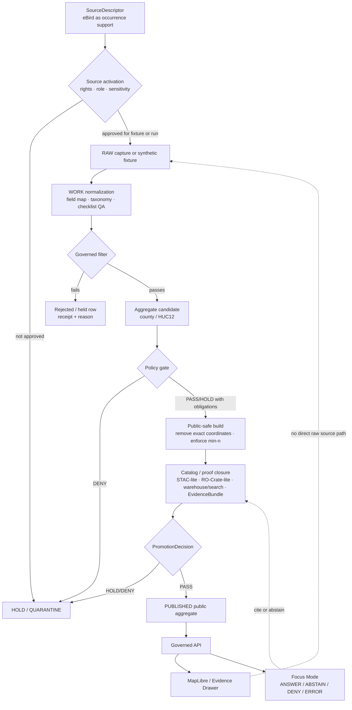

<!-- [KFM_META_BLOCK_V2]
doc_id: kfm://doc/TODO-register-ebird-ingest
title: eBird Ingest and Public-Safe Productization
type: standard
version: v1
status: draft
owners: TODO(fauna-source-stewards)
created: TODO(verify-original-created-date)
updated: 2026-05-07
policy_label: TODO(verify-public-or-restricted)
related: [README.md, SOURCE_ROLES.md, CONTROL_PLANE.md, GEOPRIVACY.md, VALIDATION.md, ../../../data/registry/fauna/README.md, ../../../configs/fauna/ebird/README.md, ../../../policy/fauna/ebird.rego, ../../runbooks/fauna/EBIRD_OPERATIONS.md, sources/ebird/EBIRD_CONTRACTS.md, sources/ebird/EBIRD_FEDERATION.md, sources/ebird/EBIRD_REDTEAM.md]
tags: [kfm, fauna, ebird, ingest, occurrence, geoprivacy, public-aggregate, evidence]
notes: [Revises the existing Layer 10 eBird ingest note into a repo-ready governed ingestion README; doc_id, owners, created date, and policy label require registry/steward verification.]
[/KFM_META_BLOCK_V2] -->

<a id="top"></a>

# eBird Ingest and Public-Safe Productization

Governed ingestion, aggregation, validation, and release guidance for `kfm-ebird` bird-occurrence support in the KFM fauna lane.

<p>
  
  
  
  
  = 10" src="https://img.shields.io/badge/suppression-n%20%E2%89%A5%2010-b60205">
  
</p>

> [!IMPORTANT]
> **Impact block**
>
> | Field | Value |
> |---|---|
> | Status | `draft` documentation over an existing eBird file and adjacent repo surfaces |
> | Owners | `TODO(fauna-source-stewards)` |
> | Target path | `docs/domains/fauna/INGEST_EBIRD.md` |
> | Primary role | Source-specific ingress/productization hub for eBird aggregate occurrence support |
> | Source role | `occurrence_source` / `occurrence_aggregator` support only; not legal-status authority |
> | Public geometry posture | No public exact coordinates; public outputs are aggregate/generalized only |
> | Local acceptance posture | No eBird downloads, no credentials, no network calls, no real sensitive rows in smoke/docs |
> | Quick jumps | [Scope](#scope) · [Repo fit](#repo-fit) · [Inputs](#inputs) · [Exclusions](#exclusions) · [Ingest flow](#ingest-flow) · [Governed filter](#governed-filter) · [Contracts](#contracts) · [Policy gates](#policy-gates) · [Commands](#commands) · [Layer map](#layer-map) · [Review checklist](#review-checklist) · [Open verification](#open-verification) |

---

## Scope

This file documents the governed eBird lane for KFM fauna ingestion and public-safe productization.

It replaces the thin Layer 10 note with a fuller maintainer-facing README that keeps the original requirements visible:

- no eBird downloads, credentials, or network calls in local documentation/smoke paths;
- no public exact coordinates;
- governed checklist filter before aggregation;
- deterministic contract-hash behavior;
- command families for ingest, aggregate, promote, public-view build, pipeline execution, release operations, observability, doctoring, and conformance;
- downstream federation/export, portal/downloads, red-team, audit, quality, and maintenance docs under `sources/ebird/`.

### What this document governs

| Surface | Guidance |
|---|---|
| eBird source admission | eBird is occurrence support, not legal-status authority. |
| Local smoke gates | Use `doctor` and `conformance` commands without live source access. |
| Public aggregates | Publish only aggregate/generalized outputs with coordinate fields removed. |
| Policy posture | `suppression_min_n >= 10`, `exact_points: restricted`, public aggregate label, and valid `kfm:spec_hash`. |
| Contract hash | Canonical JSON `sha256`, excluding volatile fields such as `generated_at` and `contract_hash`. |
| Release handoff | Public artifacts must pass validation, policy, catalog/proof closure, release manifest, and rollback expectations. |
| Evidence use | EvidenceRefs must resolve to EvidenceBundles before public claims or Focus Mode answers. |
| Correction path | Public artifacts must remain correctable and rollback-aware. |

### What this document does not govern

| Not governed here | Owning surface |
|---|---|
| General fauna source-role doctrine | [SOURCE_ROLES.md](SOURCE_ROLES.md) |
| Fauna lane overview and lifecycle | [README.md](README.md) |
| eBird source configuration | [../../../configs/fauna/ebird/README.md](../../../configs/fauna/ebird/README.md) |
| Registry/source admission records | [../../../data/registry/fauna/README.md](../../../data/registry/fauna/README.md) |
| Executable policy rules | [../../../policy/fauna/ebird.rego](../../../policy/fauna/ebird.rego) |
| Operational observability runbook | [../../runbooks/fauna/EBIRD_OPERATIONS.md](../../runbooks/fauna/EBIRD_OPERATIONS.md) |
| Source-specific extended docs | [`sources/ebird/`](sources/ebird/) |
| Machine schemas | Accepted schema home after ADR / repo convention verification |
| Raw source payloads | Governed data lifecycle roots, not docs |

[Back to top](#top)

---

## Repo fit

`INGEST_EBIRD.md` is a source-specific README-like doc under the fauna domain documentation root.

```text
docs/domains/fauna/
├── INGEST_EBIRD.md                  # this file
├── README.md                        # fauna domain overview
├── SOURCE_ROLES.md                  # source-role compatibility rules
├── GEOPRIVACY.md                    # public geometry and sensitivity posture
├── VALIDATION.md                    # validator and release gate expectations
├── runbooks/
└── sources/
    └── ebird/
        ├── EBIRD_ARCHITECTURE.md
        ├── EBIRD_CONTRACTS.md
        ├── EBIRD_FEDERATION.md
        ├── EBIRD_REDTEAM.md
        ├── EBIRD_QUALITY_AND_TRIAGE.md
        ├── EBIRD_PORTAL.md
        ├── EBIRD_MAINTENANCE.md
        └── ...
```

### Owning root

| Root | Responsibility |
|---|---|
| `docs/` | Human-facing control plane and maintainer guidance. |
| `docs/domains/fauna/` | Fauna domain doctrine, source-specific guidance, public-safety posture, and review expectations. |
| `policy/fauna/` | Executable policy gates for eBird public safety and promotion. |
| `tools/connectors/fauna/kfm-ebird-ingest/` | eBird command surface and adapter behavior. |
| `tools/validators/fauna/` | Executable validator checks. |
| `tests/` | Fixture, connector, policy, and pipeline proof. |
| `data/` | Lifecycle storage for RAW, WORK, QUARANTINE, PROCESSED, CATALOG, receipts, proofs, and PUBLISHED artifacts. |
| `release/` | Promotion decisions, release manifests, rollback cards, corrections, and withdrawal records when admitted. |

> [!NOTE]
> Domain material belongs under responsibility roots. Do not create a root-level `ebird/` or `fauna/` folder for convenience.

[Back to top](#top)

---

## Inputs

### Accepted inputs for this document

| Input | Accepted here? | Notes |
|---|---:|---|
| Source-specific ingestion rules | ✅ | Must remain human-readable and link to executable code/policy. |
| Smoke commands | ✅ | Must be local, non-destructive, and no-network unless clearly marked otherwise. |
| Public aggregate constraints | ✅ | Suppression, field allowlist, geometry restrictions, and policy labels belong here. |
| Contract-hash recipe | ✅ | Document the stable recipe; implementation lives in code. |
| Layer/productization map | ✅ | Help maintainers find related source docs and validators. |
| Negative-path expectations | ✅ | DENY, ABSTAIN, HOLD, QUARANTINE, and ERROR behavior should be visible. |
| Live eBird credentials or tokens | ❌ | Never commit credentials. |
| Raw eBird files or API captures | ❌ | Store through governed lifecycle roots only. |
| Exact restricted coordinates | ❌ | Never publish in docs, examples, screenshots, public artifacts, search indexes, or Focus context. |

### Accepted source classes

| Source class | Role | Default posture |
|---|---|---|
| Synthetic fixture rows | Test and conformance support | Accepted for no-network smoke and regression tests. |
| eBird API/EBD source references | Occurrence support candidate | Needs source descriptor, rights review, source role, sensitivity review, and receipts. |
| Public aggregate artifacts | Released derivative candidates | Must be aggregate/generalized, policy-checked, cataloged, and rollback-ready. |
| Portal/download manifests | Public-safe distribution descriptors | Must be built from already-public artifacts only. |
| Red-team mutation corpus | Synthetic adversarial testing | Synthetic only; no real rows, no exact coordinates, no credentials. |

[Back to top](#top)

---

## Exclusions

| Excluded item | Correct handling | Reason |
|---|---|---|
| eBird API keys or EBD credentials | Secret manager / local ignored environment | Prevent credential leakage. |
| Raw EBD exports or live API captures | `data/raw/fauna/ebird/...` or repo-confirmed lifecycle home | RAW data is not documentation. |
| Intermediate repair/QA outputs | `data/work/fauna/ebird/...` | WORK products are not public. |
| Rights-conflicted or sensitive rows | `data/quarantine/fauna/ebird/...` | Quarantine requires reasoned exit criteria. |
| Public exact coordinate fields | Nowhere in public artifacts | Public eBird layers must not leak exact coordinates. |
| Suppression receipts and suppressed-group details | Restricted receipts/proof homes only | Suppression internals can reveal sensitive patterns. |
| Generated aggregate outputs | `data/published/fauna/...` after release approval | Published outputs require manifests and rollback. |
| Policy rules | `policy/fauna/ebird.rego` | Policy must remain executable. |
| Validator code | `tools/validators/fauna/...` | Code should be testable and versioned outside docs. |
| AI-generated explanations as evidence | Nowhere as evidence | AI can summarize released evidence; it cannot create proof. |

[Back to top](#top)

---

## Ingest flow



### Lifecycle posture

| Stage | eBird lane rule |
|---|---|
| RAW | Source-native or fixture capture only; no public client access. |
| WORK | Normalize, field-map, quality-check, and reject/hold unsafe rows. |
| QUARANTINE | Hold unknown rights, missing provenance, failed schema, unsafe geometry, or policy conflicts. |
| PROCESSED | Public-candidate aggregates only after governed filters and receipts. |
| CATALOG / PROOF | Catalog records, EvidenceBundles, validation reports, policy decisions, release support. |
| PUBLISHED | Only public-safe aggregate artifacts with `exact_points: restricted`, valid `kfm:spec_hash`, and rollback target. |

[Back to top](#top)

---

## Governed filter

The eBird Layer 10 acceptance filter is:

```sql
complete = TRUE
AND protocol_type != 'Incidental'
AND duration_min >= 5
AND distance_km <= 5
AND number_observers <= 10
```

### Filter meaning

| Filter | Why it exists | Failure outcome |
|---|---|---|
| `complete = TRUE` | Prefer complete checklists over partial or ambiguous observation support. | Exclude from aggregate candidate. |
| `protocol_type != 'Incidental'` | Avoid weak effort/protocol support. | Exclude from governed aggregate candidate. |
| `duration_min >= 5` | Minimum effort signal. | Exclude or hold, depending fixture/pipeline mode. |
| `distance_km <= 5` | Keep checklist effort spatially bounded. | Exclude from public aggregate candidate. |
| `number_observers <= 10` | Avoid unusually large observer groups that may skew support. | Exclude or hold for QA. |

> [!WARNING]
> Passing this filter does **not** make a row public-safe by itself. Rights, sensitivity, geoprivacy, coordinate-field removal, suppression, catalog closure, EvidenceBundle resolution, and release gates still apply.

[Back to top](#top)

---

## Contracts

### Contract-hash recipe

`contract_hash` is computed from canonical JSON with volatile fields excluded.

```text
contract_hash = sha256(canonical_json(contract_payload_without_generated_at_or_contract_hash))
```

| Field | Handling |
|---|---|
| `generated_at` | Excluded from contract hash. |
| `contract_hash` | Excluded from its own hash input. |
| `kfm:spec_hash` | Required by policy when promoting public aggregate outputs. |
| `suppression_min_n` | Must be `>= 10`. |
| `exact_points` | Must be `restricted` for public eBird layers/catalogs/manifests. |
| `policy_label` | Public aggregate rows should use `public_aggregate`. |
| Coordinate fields | Must not appear in public aggregate allowlists or output rows. |

### Core object families

| Object family | Role |
|---|---|
| `EbirdDoctorReport` | Local health/smoke report for adapter readiness. |
| `PipelinePlan` | Planned run declaration; should enforce suppression and public-safety constraints before execution. |
| `PipelineManifest` | Executed run summary; public-safe final outputs and exact-point restriction must be explicit. |
| `AggregateOccurrence` | Public aggregate row candidate; must not contain exact coordinate fields. |
| `CatalogRecord` | Catalog closure for released aggregate products; exact points remain restricted. |
| `PromotionReceipt` | Promotion memory for public-safe aggregate release. |
| `EbirdProductionCertificationPacket` | Release-readiness packet; failed hard gates must block approval. |
| `KfmEbirdVerifierFindingQueueItem` | Independent verification finding; critical public-safety findings block gates. |
| `KfmEbirdAuditResponsePacket` | Audit response; cannot pass while critical findings remain unresolved. |

[Back to top](#top)

---

## Policy gates

The executable policy surface for this lane is [`../../../policy/fauna/ebird.rego`](../../../policy/fauna/ebird.rego).

### Public safety requirements

| Requirement | Required policy behavior |
|---|---|
| Valid `kfm:spec_hash` | Missing or malformed hash denies promotion. |
| `suppression_min_n >= 10` | Values below 10 deny promotion. |
| Aggregation scope | Aggregate must be `county` or `huc12` where required. |
| Public exact coordinates | Public eBird layers must set `exact_points: restricted`. |
| Coordinate allowlist | Public field allowlists must not include latitude, longitude, point, geometry, or equivalent names. |
| Aggregate rows | Public aggregate rows must not contain exact coordinate fields. |
| Public aggregate label | Public aggregate rows must carry `policy_label: public_aggregate`. |
| Checklist count | Public aggregate rows below suppression threshold are denied. |
| Failed validation report | Failed validation blocks promoted/public run. |
| Critical public-safety finding | Must block gate and transparency pass until resolved. |
| Audit packet pass | Cannot pass while critical findings remain open. |

### Public artifact field allowlist

Public eBird aggregate outputs should expose only fields needed for public-safe interpretation.

| Field family | Public posture |
|---|---|
| Aggregate key | Allowed: county, HUC12, or approved grid/summary identifier. |
| Taxon label | Allowed when rights/citation permit and source role is clear. |
| Counts / checklist support | Allowed after suppression and QA. |
| Time bucket | Allowed at approved aggregation level. |
| Evidence refs | Allowed when public-safe and resolvable. |
| Exact latitude/longitude | Denied. |
| Raw geometry | Denied. |
| Suppression group details | Denied. |
| Quarantine paths | Denied. |
| Credentials/source tokens | Denied. |

[Back to top](#top)

---

## Commands

> [!NOTE]
> Commands below are repo-shaped and should be run from a verified checkout. Do not run live fetches or use real credentials from this documentation path.

### Smoke

```bash
tools/connectors/fauna/kfm-ebird-ingest/kfm-ebird-doctor --strict --json
```

```bash
tools/connectors/fauna/kfm-ebird-ingest/kfm-ebird-conformance \
  --aggregate both \
  --format jsonl \
  --json
```

### Pipeline plan

```bash
tools/connectors/fauna/kfm-ebird-ingest/kfm-ebird-run-pipeline \
  --ebd-file tests/fixtures/fauna/ebird/sample_ebd.tsv \
  --plan
```

### Fixture execution

```bash
tools/connectors/fauna/kfm-ebird-ingest/kfm-ebird-run-pipeline \
  --ebd-file tests/fixtures/fauna/ebird/sample_ebd.tsv \
  --source-uri "https://ebird.org/data?request_id=synthetic" \
  --aggregate both \
  --suppression 10 \
  --work-dir /tmp/kfm-ebird/run \
  --publish-dir data/published/fauna/ebird_test \
  --catalog-dir data/catalog/fauna/ebird_test \
  --layer-registry-dir data/published/fauna/layers \
  --run-id testexec001 \
  --no-maplibre \
  --execute
```

### Validate a pipeline run

```bash
python tools/validators/fauna/validate_pipeline_run.py /tmp/kfm-ebird/run
```

### Observability handoff

```bash
kfm-ebird-observe \
  --mode scan \
  --aggregate huc12 \
  --release-receipt fixtures/ebird/releases/huc12/release_receipt.json \
  --published-root fixtures/ebird/published \
  --out-dir /tmp/kfm-ebird-observability/scan
```

[Back to top](#top)

---

## Layer map

The current eBird documentation family is layered. Use this file as the ingest/productization hub and the `sources/ebird/` docs for deeper source-specific operations.

| Layer | Document | Purpose | Safety posture |
|---:|---|---|---|
| 9 | [EBIRD_OPERATIONS.md](../../runbooks/fauna/EBIRD_OPERATIONS.md) | Observe scan, trend, attest, evidence-pack, and incidents. | No downloads, credentials, exact coordinates, quarantines, suppression receipts, or suppressed-group details. |
| 10 | [INGEST_EBIRD.md](INGEST_EBIRD.md) | Ingest/productization hub for `kfm-ebird`. | Governed filter, contract hash, public aggregate constraints. |
| 10 | [sources/ebird/EBIRD_CONTRACTS.md](sources/ebird/EBIRD_CONTRACTS.md) | Contract/productization notes. | No downloads, credentials, network calls, or exact coordinates. |
| 12 | [sources/ebird/EBIRD_FEDERATION.md](sources/ebird/EBIRD_FEDERATION.md) | Public-safe federation, discovery, semantic graph, and exports. | HUC12/county aggregate outputs only; no exact points. |
| 14 | [sources/ebird/EBIRD_PORTAL.md](sources/ebird/EBIRD_PORTAL.md) | Static portal and download bundle manifests from already-public artifacts. | Local assets, restrictive CSP, no remote scripts/trackers. |
| 18 | [sources/ebird/EBIRD_REDTEAM.md](sources/ebird/EBIRD_REDTEAM.md) | Synthetic adversarial mutation corpus and red-team runner. | Synthetic only; no real rows, network, credentials, or exact coordinates. |
| 21 | [sources/ebird/EBIRD_QUALITY_AND_TRIAGE.md](sources/ebird/EBIRD_QUALITY_AND_TRIAGE.md) | Operational QA and triage. | No network, credentials, real eBird data, or exact public coordinates. |

### Related validator surfaces

| Path | Role |
|---|---|
| `tools/validators/fauna/validate_ebird_triage.ts` | Triage validation. |
| `tools/validators/fauna/validate_ebird_quality.ts` | Quality validation. |
| `tools/validators/fauna/validate_ebird_redteam.ts` | Red-team validation. |
| `tools/validators/fauna/validate_ebird_audit_intake.ts` | Audit-intake validation. |
| `tools/validators/fauna/validate_ebird_audit_response.ts` | Audit-response validation. |
| `tools/validators/fauna/validate_ebird_fixity.ts` | Fixity validation. |
| `tools/validators/fauna/validate_ebird_preservation.ts` | Preservation validation. |
| `tools/validators/fauna/validate_ebird_root_of_trust.ts` | Root-of-trust validation. |

[Back to top](#top)

---

## Release posture

A public eBird aggregate release is not complete when files exist. It is complete when the release dossier can be inspected.

| Release requirement | Minimum proof |
|---|---|
| Source admission | SourceDescriptor and source-role decision exist. |
| Rights posture | Terms, attribution, redistribution, and unknown-rights behavior are recorded. |
| Sensitivity posture | Exact public geometry denied or transformed with receipt. |
| Filter and aggregation | Governed filter and aggregate scope are recorded. |
| Suppression | `suppression_min_n >= 10`; low-support aggregate rows blocked. |
| Catalog closure | Public artifact has catalog/provenance/discovery metadata. |
| Evidence closure | Public claim resolves EvidenceRef to EvidenceBundle. |
| Policy decision | Policy gate passes or returns explicit HOLD/DENY reason. |
| Promotion receipt | Promotion state, public-safe flag, spec hash, and artifacts recorded. |
| Rollback target | Prior release or withdrawal path exists. |
| Correction path | Public correction/takedown workflows do not request credentials or exact private locations. |

[Back to top](#top)

---

## Runtime and UI contract

### Governed API

Public clients should consume released, public-safe aggregate payloads only.

| API behavior | Required outcome |
|---|---|
| Request released aggregate with resolved evidence | `ANSWER` with evidence refs, release refs, policy posture, and limitations. |
| Request unsupported species/location claim | `ABSTAIN` with evidence-insufficient reason. |
| Request exact coordinates or restricted fields | `DENY` without leaking restricted details. |
| Request unreleased or quarantined run | `DENY` or `ERROR`, depending route contract. |
| Validator/runtime failure | `ERROR` with safe diagnostic reason and no secret/source leak. |

### Evidence Drawer

Evidence Drawer payloads should expose:

- source role: eBird as occurrence support;
- aggregate scope: county, HUC12, or approved public-safe unit;
- suppression threshold;
- evidence bundle reference;
- release manifest reference;
- policy label and public-safety obligations;
- limitations: community/scoped occurrence support, not legal status, not proof of absence;
- stale/correction state when applicable.

### Focus Mode

Focus Mode may summarize released eBird aggregate evidence, but must:

- cite resolved EvidenceBundles;
- say “public aggregate occurrence support” rather than imply exact occurrence;
- avoid legal-status claims unless supported by separate authority source;
- return `ABSTAIN` when evidence is insufficient;
- return `DENY` when requested output would expose restricted precision or rights-conflicted material.

[Back to top](#top)

---

## Review checklist

Before changing this file, eBird policy, eBird commands, or eBird public artifacts, verify:

- [ ] Metadata block fields are reviewed; TODOs remain intentional.
- [ ] Any path link added here exists in the repo or is clearly marked TODO / NEEDS VERIFICATION.
- [ ] eBird is described as occurrence support, not legal or conservation authority.
- [ ] No example includes real credentials, API keys, cookies, tokens, or private URLs.
- [ ] No example includes exact sensitive coordinates.
- [ ] Governed filter remains visible and unchanged unless tests/policy/docs are updated together.
- [ ] Public outputs keep `exact_points: restricted`.
- [ ] `suppression_min_n >= 10` remains enforced.
- [ ] Public aggregate rows cannot contain coordinate/geometry fields.
- [ ] Contract-hash recipe remains deterministic and excludes volatile fields.
- [ ] Smoke commands remain no-network and safe to run in a checkout.
- [ ] Pipeline examples use fixtures or synthetic inputs only.
- [ ] Policy changes update negative fixtures.
- [ ] Federation/export, portal, red-team, audit, quality, and maintenance docs stay linked through `sources/ebird/`.
- [ ] Release notes preserve rollback and correction path.
- [ ] Any public API/Focus wording keeps evidence limitations visible.

[Back to top](#top)

---

## Open verification

| Item | Status | Needed proof |
|---|---:|---|
| `doc_id` | TODO | Document registry entry. |
| Owners | TODO | CODEOWNERS, steward register, or source-lane owner assignment. |
| Created date | TODO | Git history or prior committed metadata. |
| Policy label | TODO | Repo classification decision. |
| eBird source descriptor | NEEDS VERIFICATION | Registry entry with source role, rights, sensitivity, cadence, and allowed uses. |
| Live source activation | UNKNOWN | SourceActivationDecision or equivalent. |
| Full CI enforcement | UNKNOWN | Workflow evidence and check results. |
| Public release object family | NEEDS VERIFICATION | ReleaseManifest / PromotionReceipt / ProofPack conventions in current repo. |
| Schema home | NEEDS VERIFICATION | Accepted ADR or repo convention. |
| Policy runner | NEEDS VERIFICATION | OPA/Conftest/Rego or repo-native policy runner command. |
| CLI packaging | NEEDS VERIFICATION | Confirm installation path and executable permissions in active checkout. |
| eBird terms/citation review | NEEDS VERIFICATION | Current approved source-use record and attribution text. |

[Back to top](#top)

---

## Appendix

<details>
<summary>Minimum public aggregate row checklist</summary>

A public eBird aggregate row should satisfy:

```yaml
object_type: AggregateOccurrence
policy_label: public_aggregate
aggregate: county_or_huc12
kfm:spec_hash: sha256:<64-hex>
suppression_min_n: 10
checklist_count: ">= suppression_min_n"
exact_points: restricted
coordinate_fields_present: false
evidence_refs:
  - TODO
release_refs:
  - TODO
limitations:
  - "Occurrence support is aggregated and public-safe."
  - "This is not a legal-status claim."
  - "This is not proof of absence."
```

</details>

<details>
<summary>Negative fixture ideas</summary>

| Fixture | Expected outcome |
|---|---|
| Public row with `latitude` | `DENY` |
| Public row with `longitude` | `DENY` |
| Public row with `geometry` | `DENY` |
| Public aggregate with `checklist_count < 10` | `DENY` |
| Public layer with `exact_points != restricted` | `DENY` |
| Missing or malformed `kfm:spec_hash` | `DENY` |
| `policy_label != public_aggregate` on public aggregate row | `DENY` |
| Failed validation report in promoted run | `DENY` |
| Approved certification with failed hard gate | `DENY` |
| Critical public-safety finding not blocking gate | `DENY` |
| Audit response passes with unresolved critical finding | `DENY` |

</details>

<details>
<summary>Maintainer update triggers</summary>

Update this document when any of the following changes:

- eBird filter fields or thresholds;
- suppression threshold;
- public aggregate schema;
- policy labels or reason codes;
- contract-hash recipe;
- CLI names or command flags;
- validator entrypoints;
- source configuration fields;
- federation/export, portal, red-team, quality, audit, or maintenance docs;
- Evidence Drawer payload shape;
- Focus Mode eBird behavior;
- release manifest or rollback conventions;
- source terms, citation requirements, or approved use scope.

</details>

[Back to top](#top)