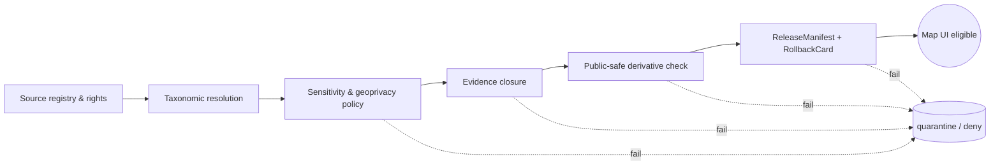
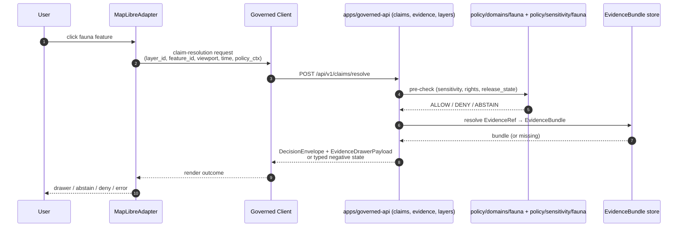

<!-- [KFM_META_BLOCK_V2]
doc_id: kfm://doc/fauna-map-ui-contracts
title: Fauna — Map UI Contracts
type: standard
version: v1
status: draft
owners: <fauna-steward> + <ui-steward> + <governed-api-steward>  # PLACEHOLDER — confirm in CODEOWNERS
created: 2026-05-16
updated: 2026-05-16
policy_label: public
related:
  - docs/domains/fauna/README.md
  - docs/architecture/ui/LAYERING.md
  - docs/architecture/ui/BOUNDARIES.md
  - docs/architecture/governed-ai/FOCUS_FLOW.md
  - docs/runbooks/fauna/SOURCE_REFRESH_RUNBOOK.md
  - policy/domains/fauna/README.md
  - schemas/contracts/v1/layers/layer_descriptor.schema.json
  - schemas/contracts/v1/layers/layer_manifest.schema.json
  - schemas/contracts/v1/ui/evidence_drawer_payload.schema.json
  - schemas/contracts/v1/runtime/decision_envelope.schema.json
tags: [kfm, fauna, ui, maplibre, evidence-drawer, focus-mode, sensitivity, geoprivacy, trust-membrane]
notes:
  - All paths quoted are PROPOSED until verified against mounted-repo evidence.
  - Anchors are stable; if changed, update Related docs above.
[/KFM_META_BLOCK_V2] -->

# Fauna — Map UI Contracts

> **Binds the Fauna domain to KFM's governed Map UI: which fauna layers may render, what an `EvidenceDrawerPayload` for a fauna feature must carry, how clicks resolve, how Focus Mode answers about fauna, and which sensitivity, freshness, and release gates fail closed at the renderer boundary.**


<!-- TODO: replace with real Shields.io endpoints once CI/release badges land. -->

| Field | Value |
|---|---|
| **Status** | `draft` — awaiting steward + UI + governed-API review |
| **Owners** | Fauna steward · UI steward · Governed-API steward *(PLACEHOLDER — confirm CODEOWNERS)* |
| **Last reviewed** | 2026-05-16 |
| **Authority level** | Implementation-bearing standard for the Fauna × Map UI seam |
| **Schema home** | `schemas/contracts/v1/...` per ADR-0001 (PROPOSED until verified) |
| **Companion runbooks** | `docs/runbooks/fauna/SOURCE_REFRESH_RUNBOOK.md`, `docs/runbooks/ui_VALIDATION.md` *(PROPOSED)* |

---

## 📑 Contents

1. [Purpose and scope](#1-purpose-and-scope)
2. [Authority, evidence, and truth labels](#2-authority-evidence-and-truth-labels)
3. [Trust-membrane invariants for Fauna map UI](#3-trust-membrane-invariants-for-fauna-map-ui)
4. [Fauna layer families and viewing modes](#4-fauna-layer-families-and-viewing-modes)
5. [LayerDescriptor / LayerManifest profile for Fauna](#5-layerdescriptor--layermanifest-profile-for-fauna)
6. [Click resolution and EvidenceDrawerPayload profile](#6-click-resolution-and-evidencedrawerpayload-profile)
7. [Focus Mode behavior for Fauna](#7-focus-mode-behavior-for-fauna)
8. [Sensitivity gates and geoprivacy transforms](#8-sensitivity-gates-and-geoprivacy-transforms)
9. [Trust-visible states, badges, and negative outcomes](#9-trust-visible-states-badges-and-negative-outcomes)
10. [Time-aware behavior](#10-time-aware-behavior)
11. [Anti-patterns (fail closed)](#11-anti-patterns-fail-closed)
12. [Validation, tests, and fixtures](#12-validation-tests-and-fixtures)
13. [Open questions and verification backlog](#13-open-questions-and-verification-backlog)
14. [Related docs](#14-related-docs)

---

## 1. Purpose and scope

**Purpose.** This document defines the **contracts a fauna feature must satisfy before it is rendered, clicked, summarized, exported, or explained** through any KFM map UI surface — `apps/explorer-web/`, `packages/maplibre/`, `packages/ui/`, or any downstream client consuming the same governed API. It is the binding seam between Fauna domain doctrine (taxonomy, occurrence evidence, sensitivity, geoprivacy) and the cross-cutting Map UI doctrine (`LayerDescriptor`, `LayerManifest`, `EvidenceDrawerPayload`, `MapContextEnvelope`, finite `DecisionEnvelope` outcomes, Focus Mode citation discipline).

It is **not**:

- a layer registry (that lives in `data/published/layers/fauna/` and `data/registry/sources/fauna/`),
- a schema definition (machine shape lives under `schemas/contracts/v1/...`),
- a policy bundle (`policy/domains/fauna/...` and `policy/sensitivity/fauna/...`),
- a source dossier (`docs/domains/fauna/README.md` and the Fauna source registry).

> [!IMPORTANT]
> If this document and a current `LayerDescriptor` / `LayerManifest` / `EvidenceDrawerPayload` schema disagree, the **schema wins** and a Drift Register entry is opened. Markdown explains; schemas enforce.

### 1.1 In scope

- Which fauna **layer families** are admissible on a public map.
- Which fields a fauna `LayerDescriptor` MUST/MAY/MUST-NOT carry.
- What happens on **feature click** for a fauna feature, and what an `EvidenceDrawerPayload` MUST contain.
- How **Focus Mode** answers fauna questions (cite-or-abstain, deny on sensitive).
- How **sensitivity** is enforced *upstream of style* — never by style filter alone.
- How **trust-visible states** (stale, degraded, denied, redacted, unverified) are surfaced.
- Anti-patterns and the test catalog that proves the contract holds.

### 1.2 Out of scope

- 3D / Cesium scene rendering for fauna (deferred; same evidence/policy continuity rule applies when admitted).
- Steward exact-location console (separate restricted surface, not part of public Map UI).
- Live source connector implementation (governed by Fauna source dossier and source registry).
- Provider-specific Focus Mode model adapter (`apps/governed-api/src/ai/...` — governed-AI scope).

[⬆ Back to top](#-contents)

---

## 2. Authority, evidence, and truth labels

### 2.1 Authority order

The order in §2.1 of `directory-rules.md` applies. For this document specifically:

1. **KFM core invariants** — lifecycle law, trust membrane, cite-or-abstain, watcher-as-non-publisher, sensitivity fail-closed for sensitive taxa.
2. **Fauna doctrine** — `[DOM-FAUNA]`, `[DOM-HF]`, Encyclopedia §7.5.
3. **Map UI doctrine** — `[MAP-MASTER]`, `[UIAI]` (Whole-UI + Governed-AI Expansion Report), MapLibre Components-Functions-Features atlas.
4. **Governed-AI doctrine** — `[GAI]` for Focus Mode bounds.
5. **Directory Rules** — for path placement; §12 Domain Placement Law applies to every path quoted below.
6. **ADRs** (e.g., ADR-0001 schema home; ADR-maplibre-adapter-boundary; ADR-focus-model-adapter-boundary) — *PROPOSED until verified in mounted repo.*
7. **This document.**

### 2.2 Truth labels used below

| Label | Meaning in this doc |
|---|---|
| **CONFIRMED** | Established in attached KFM doctrine (Encyclopedia, Atlas, MapLibre Master, Whole-UI Report, Directory Rules) or in `KFM_Pass_20_Part_2_Idea_Index_*` ideas marked CONFIRMED. |
| **PROPOSED** | Design / placement / field shape consistent with doctrine but not verified against a mounted repo, schema, validator, fixture, or workflow. |
| **NEEDS VERIFICATION** | Checkable claim awaiting mounted-repo inspection (repo files, schemas, tests, manifests, workflows, logs, ADRs). |
| **UNKNOWN** | Not resolvable from materials currently in session. |

> [!NOTE]
> No statement in this file claims that a repo file, schema, route, fixture, or test currently exists in the live monorepo. Every implementation-shaped claim is **PROPOSED** or **NEEDS VERIFICATION** unless explicitly footed in an attached doctrine document.

[⬆ Back to top](#-contents)

---

## 3. Trust-membrane invariants for Fauna map UI

These invariants are CONFIRMED doctrine across `[MAP-MASTER]`, `[UIAI]`, `[GAI]`, `[ENCY]`, and `[DOM-FAUNA]`. They bind every fauna rendering pathway.

> [!WARNING]
> **Fauna-specific deny-by-default zones.** Exact sensitive occurrences and nests, dens, roosts, hibernacula, and spawning sites **fail closed** unless a documented geoprivacy transform and review state explicitly allow release. **Style-only hiding is not a valid protection mechanism** *(ML-Q-082 CONFIRMED)*. Sensitive geometry must be transformed **before** it reaches the renderer.

### 3.1 Renderer is downstream of trust

- MapLibre (or any future renderer) **never** acts as truth, citation, policy, publication, or release authority.
- The renderer consumes validated `LayerDescriptor` / `LayerManifest` / `StyleManifest` / `TileArtifactManifest` only.
- Public clients **must not** read `data/raw/fauna/`, `data/work/fauna/`, `data/quarantine/fauna/`, candidate manifests, internal canonical stores, graph stores, vector indexes, model runtimes, or credentials.
- All public reads route through `apps/governed-api/` (PROPOSED route home).

### 3.2 Click is a governed claim-resolution request

Per `[UIAI]` §18, feature properties from a clicked fauna feature **are not claims**. The click produces a governed request that returns a `DecisionEnvelope` plus either an `EvidenceDrawerPayload` (`ANSWER`) or a typed negative state (`ABSTAIN`, `DENY`, `ERROR`).

### 3.3 Focus Mode is bounded synthesis

Focus Mode about fauna runs only over **released** Fauna `EvidenceBundle`s. The browser never calls a model runtime directly. Citations are validated **before** display or export. Sensitivity, rights, and release state govern `ANSWER` / `ABSTAIN` / `DENY` / `ERROR`.

### 3.4 Publication gates are cumulative

Per `[DOM-FAUNA] §§9-13, 21-23`, before a fauna artifact is exposed in the Map UI:



If any gate fails, the artifact does not enter the Map UI layer registry. *Diagram reflects doctrine; specific gate names match Fauna §H (Pipeline shape) and §I (Sensitivity, rights, publication posture) of the Atlas.*

[⬆ Back to top](#-contents)

---

## 4. Fauna layer families and viewing modes

CONFIRMED doctrine (Encyclopedia §7.5.E; Atlas §7.G): Fauna admits the following viewing products. **Tier** below is from the public-tier doctrine (T0 public ↔ T4 internal-only) and follows the §24.5 transition rules. All tier values are PROPOSED for the layer families specifically; the underlying transform-and-tier rules are CONFIRMED.

| Layer family | Geometry | Public default tier | Transform required for public release | Status |
|---|---|---|---|---|
| Species page map (taxon-bound landing) | mixed | T0 | none (taxon identity only; no exact points) | PROPOSED |
| Generalized occurrence density grid | aggregated cells (e.g., H3 / county / HUC) | T1 | aggregation + freshness; no exact points | PROPOSED |
| Range polygon (`RangePolygon`) | polygon | T1 | generalization or aggregation receipt | PROPOSED |
| Seasonal range (`SeasonalRange`) | polygon | T1 | generalization + temporal binding | PROPOSED |
| Migration route (`MigrationRoute`) | line | T1 | route-geometry generalization rule *(POL-005)* | PROPOSED |
| Abundance / richness indicator | grid / polygon | T1 | aggregation receipt | PROPOSED |
| Habitat association (read-only join to Habitat) | polygon | T1 | habitat-fauna thin-slice rules; Habitat owns suitability | PROPOSED |
| Disease / mortality context | point or grid | T1–T2 | sensitivity + steward review for clustering | PROPOSED |
| Invasive species record (EDDMapS-class) | point or polygon | T1 | rights + freshness; no private locator data | PROPOSED |
| **Occurrence Public** (`Occurrence Public`) | point or grid | T1 | `RedactionReceipt` + geoprivacy transform | PROPOSED |
| **Occurrence Restricted** (`Occurrence Restricted`) | point | **T4 — deny on public UI** | none — never rendered on public Map UI | CONFIRMED deny default |
| Sensitive sites — nests / dens / roosts / hibernacula / spawning | point or polygon | **T4 — deny on public UI** | none — never rendered on public Map UI | CONFIRMED deny default |
| Steward exact-location view | exact geometry | **internal** | restricted access surface; **not** in public Map UI | CONFIRMED separation |

> [!CAUTION]
> A `RangePolygon` or `SeasonalRange` derived from sensitive occurrences is **still a derived sensitivity surface** if the inference path makes the source points reconstructable. Public release of such derivatives requires a `RedactionReceipt` documenting the transform and residual-risk reason.

Cross-cutting viewing products inherited from `[MAP-MASTER]`:

- Evidence Drawer (cross-cutting; see §6).
- Time-aware state and time slider (see §10).
- Trust badges (see §9).
- Sensitivity-redacted view (CONFIRMED for fauna/flora/archaeology/infrastructure/people).
- Stale-data view, correction view, governed Focus Mode.

[⬆ Back to top](#-contents)

---

## 5. LayerDescriptor / LayerManifest profile for Fauna

The Fauna domain profile binds the cross-cutting `LayerDescriptor` and `LayerManifest` to fauna-specific obligations. Cross-cutting field names are PROPOSED per `[UIAI]` Appendix C (Layering) and `[MAP-MASTER]` §8 (object map). Fauna-specific obligations are CONFIRMED doctrine.

> [!NOTE]
> Schema home is **PROPOSED** at `schemas/contracts/v1/layers/layer_descriptor.schema.json` and `schemas/contracts/v1/layers/layer_manifest.schema.json` per `[UIAI]` Appendix A. Verify against the mounted schema directory before depending on these paths.

### 5.1 Required fields (`MUST`) on a Fauna `LayerDescriptor`

| Field | Source of obligation | Notes |
|---|---|---|
| `layer_id`, `title`, `geometry_type`, `source_id`, `source_layer` | `[MAP-MASTER]` LayerManifest baseline | unique within release. |
| `release_state` | trust-membrane invariant | must be `published`; unpublished candidates MUST NOT load. |
| `release_id` | `MapReleaseManifest` linkage | binds layer to a verifiable release. |
| `policy_label` | `[UIAI]` §17.2 + Fauna §I | one of `public`, `restricted`, `redacted`; `restricted` MUST NOT appear in public catalogs. |
| `sensitivity_label` | Fauna §I + `ML-Q-076` CONFIRMED | one of `public`, `restricted`, `redacted`; never absent on fauna layers. |
| `source_role` | Fauna §D | `authority` / `observation` / `aggregator` / `model` / `context` — never collapsed. |
| `evidence_ref_field` | `[MAP-MASTER]` LayerManifest baseline | property name carrying `EvidenceRef` for each feature. |
| `temporal_fields` | Fauna §D + Encyclopedia §11 | observed / event / source / retrieval / release / correction times kept distinct where material. |
| `rights_status` | Fauna §I + `ML-Q-080` CONFIRMED | `unknown` blocks publication. |
| `transform_receipt_ref` | `KFM-IDX-POL-005` CONFIRMED + `ML-Q-083` | required for any layer derived from sensitive sources; references the `RedactionReceipt`. |
| `freshness_class` | `[MAP-MASTER]` §S trust-visible states | drives stale-badge logic. |
| `tile_artifact_ref` / digest fields | `TileArtifactManifest` | enables verify-before-render. |
| `rollback_target` | publication gate doctrine | required before publish. |

### 5.2 Forbidden fields (`MUST NOT`) on public Fauna `LayerDescriptor`

| Field / pattern | Why forbidden |
|---|---|
| Raw `precise_point` / exact lat-lon for sensitive taxa | Geoprivacy fail-closed; `KFM-IDX-POL-005`. |
| Observer identity for sensitive observations | Privacy; may aid in re-identification or harassment. |
| Cluster-revealing metadata for sensitive sites | Inference attack against generalized geometry. |
| Direct links to RAW / WORK / QUARANTINE storage | Trust-membrane invariant. |
| Model-runtime endpoints, credentials, signed URLs not bound to release | `[UIAI]` §25 security notes. |
| Style filters used as the **only** sensitivity guard | `ML-Q-082` CONFIRMED. |

### 5.3 Compact JSON Schema sketch *(illustrative, not source of truth)*

> [!NOTE]
> This block is **illustrative only**. The authoritative shape lives in `schemas/contracts/v1/layers/layer_descriptor.schema.json`. Do not copy these field names into validators without checking the schema.

```json
{
  "$id": "https://kfm.local/schemas/contracts/v1/layers/layer_descriptor.fauna-profile.example.json",
  "title": "Fauna LayerDescriptor (illustrative profile)",
  "type": "object",
  "required": [
    "layer_id", "title", "geometry_type", "source_id", "source_layer",
    "release_state", "release_id",
    "policy_label", "sensitivity_label", "source_role",
    "evidence_ref_field", "temporal_fields",
    "rights_status", "freshness_class",
    "rollback_target"
  ],
  "properties": {
    "release_state": { "const": "published" },
    "policy_label": { "enum": ["public", "restricted", "redacted"] },
    "sensitivity_label": { "enum": ["public", "restricted", "redacted"] },
    "source_role": { "enum": ["authority", "observation", "aggregator", "model", "context"] },
    "rights_status": { "enum": ["clear", "needs_review", "unknown", "denied"] },
    "transform_receipt_ref": { "type": "string", "description": "Required when derived from sensitive sources" }
  },
  "allOf": [
    {
      "if": { "properties": { "sensitivity_label": { "enum": ["restricted", "redacted"] } } },
      "then": { "required": ["transform_receipt_ref"] }
    },
    {
      "if": { "properties": { "rights_status": { "const": "unknown" } } },
      "then": { "properties": { "release_state": { "not": { "const": "published" } } } }
    }
  ]
}
```

[⬆ Back to top](#-contents)

---

## 6. Click resolution and `EvidenceDrawerPayload` profile

CONFIRMED across `[UIAI]` §§18-19 and `[MAP-MASTER]` §N: a clicked fauna feature **resolves through a governed claim-resolution request**, never as a direct projection of MapLibre feature properties.

### 6.1 Click resolution flow



*Diagram reflects `[UIAI]` §18-19 doctrine. Route names (`/api/v1/claims/resolve`) are PROPOSED per `[UIAI]` Appendix B and require mounted-repo verification.*

### 6.2 Required `EvidenceDrawerPayload` fields for a Fauna feature

CONFIRMED required cross-cutting fields per `[UIAI]` §19.1. The **Fauna obligations** column adds domain-specific obligations.

| Cross-cutting field | Fauna obligation | Status |
|---|---|---|
| `drawer_id`, `opened_from` | none beyond baseline | CONFIRMED doctrine |
| `claim` / layer assertion | MUST be taxon-bound; e.g., "Occurrence of *Taxon X*, generalized to z=9 H3 cell" | CONFIRMED doctrine |
| `DecisionEnvelope` (`ANSWER` / `ABSTAIN` / `DENY` / `ERROR`) | DENY required for sensitive sites; ABSTAIN required for missing geoprivacy receipt | CONFIRMED doctrine |
| `EvidenceRef[]` and `EvidenceBundle` ref | Must resolve to a **released** Fauna `EvidenceBundle` | CONFIRMED doctrine |
| `source_role` | Distinguish `authority` (e.g., USFWS ECOS-like), `observation` (e.g., agency monitoring), `aggregator` (e.g., GBIF/eBird/iNaturalist-like), `model` (suitability, predicted range), `context` (NLCD/NWI/PADUS/SSURGO-class) | CONFIRMED — never collapsed |
| `knowledge_character` | One of observation / regulatory / aggregator / model / status / context | CONFIRMED doctrine |
| `valid_time`, `observed_time`, `freshness` | Per Fauna §D — kept distinct where material | CONFIRMED doctrine |
| `release_state`, `review_state`, `correction_state` | release/correction lineage visible | CONFIRMED doctrine |
| `rights`, `sensitivity`, `transforms` | **Fauna MUST list the geoprivacy transform applied** (suppress, generalize-to-grid, generalize-to-watershed, generalize-to-county, buffer, jitter-with-constraints, delayed publication, steward-only access) — per `KFM-IDX-POL-005` | CONFIRMED doctrine |
| `provenance` | Source descriptor + ingest path + receipts | CONFIRMED doctrine |
| `related_manifest_refs` (e.g., `LayerManifest`, `MapReleaseManifest`) | Visible to the steward / public as appropriate | CONFIRMED doctrine |
| **Limitations** block | MUST state generalization scale, uncertainty radius, and "this is a public-safe derivative — exact location not disclosed" where relevant | CONFIRMED Fauna obligation |

### 6.3 Required negative outcomes for Fauna clicks

Negative drawer states are first-class outcomes per `[UIAI]` §19.1 and **must be testable**:

| Negative state | When it fires (Fauna) | Required UI behavior |
|---|---|---|
| `evidence_missing` | Click resolves to a feature with no released `EvidenceBundle` | Show "evidence not available" + correction path. |
| `restricted` | Sensitive taxon / site / occurrence; geoprivacy denies public exposure | Show generalized representation + "exact location not disclosed" notice. No exact geometry leaks via popup, hover, or selection effect. |
| `stale` | Source freshness past defined threshold | Stale badge + abstain on consequential claims. |
| `conflict` | Multiple sources disagree (e.g., authority vs aggregator) | Surface both with `source_role`; do not silently pick. |
| `invalid_payload` | Payload fails schema validation | Show ERROR state; never render unparseable content. |
| `policy_denied` | Rights `unknown`, sensitivity fail-closed, release missing | DENY with reason code; no fallback rendering. |

[⬆ Back to top](#-contents)

---

## 7. Focus Mode behavior for Fauna

CONFIRMED doctrine, `[GAI]` + Atlas §7.L + Encyclopedia §7.5.H: AI is **interpretive, not the root truth source**. EvidenceBundle outranks generated language. Focus Mode answers about fauna must observe these obligations.

### 7.1 Allowed Focus Mode operations on Fauna

| Operation | Bounded by | Outcome envelope |
|---|---|---|
| Summarize a **released** Fauna `EvidenceBundle` for a clicked or selected feature | citation validation on every claim | `ANSWER` with citations + `AIReceipt` |
| Compare two released Fauna evidence items (e.g., authority vs aggregator on the same taxon) | source-role separation visible in answer | `ANSWER` or `ABSTAIN` |
| Explain limitations of a public-safe derivative (e.g., generalization scale, uncertainty radius) | must reference the `RedactionReceipt` / transform | `ANSWER` |
| Draft a **steward-review note** for a candidate fauna claim | not a public route; restricted surface | `ANSWER` (review-only) |

### 7.2 Required Focus Mode behaviors

- **Pre-check** sensitivity, rights, and release state **before** evidence retrieval.
- **Post-check** every cited `EvidenceRef` resolves and is admissible in current scope (`CitationValidationReport` PASS) — else `ABSTAIN`.
- Browser MUST NOT call Ollama / OpenAI / vector index / graph store / object store directly. Adapter lives in `apps/governed-api/src/ai/` (PROPOSED).
- The `MapContextEnvelope` sent to Focus Mode carries `visible_layers`, `bounds`, `zoom`, `pitch`, `bearing`, `filters`, `time_window`, `selected_features`, `evidence_refs` — **no raw feature properties** and **no restricted geometry**.

### 7.3 Required Focus Mode denials and abstentions for Fauna

| Trigger | Outcome | Reason code (PROPOSED) |
|---|---|---|
| Question is about the **exact location** of a sensitive taxon or nest/den/roost/hibernacula/spawning site | `DENY` | `fauna.geoprivacy.exact_location_denied` |
| Question depends on an **unreleased** `EvidenceBundle` | `ABSTAIN` | `evidence.unreleased` |
| Question depends on a source with `rights_status = unknown` | `DENY` | `rights.unknown` |
| AI would otherwise generate a fauna claim with **no cite-able evidence** | `ABSTAIN` | `citation.missing` |
| AI is asked to act as an **emergency / wildlife-incident authority** | `DENY` | `boundary.alert_authority_denied` *(mirrors hazards-alert-boundary doctrine)* |
| Question requests **observer identity** for a sensitive observation | `DENY` | `privacy.observer_identity_denied` |

> [!IMPORTANT]
> A Focus Mode answer about fauna that quotes or summarizes any unreleased candidate, raw point, or sensitive geometry is a **policy violation**, not a quality bug. The post-check **must** block emit, and the failure must be visible in the `AIReceipt`.

[⬆ Back to top](#-contents)

---

## 8. Sensitivity gates and geoprivacy transforms

CONFIRMED across `[DOM-FAUNA]` §I, Atlas §20.5 deny-by-default register, and `KFM-IDX-POL-005`:

| Class | Default tier | Allowed public transform | Required gates |
|---|---|---|---|
| Sensitive occurrence (rare / protected / sensitive taxon, exact point) | T4 | Geoprivacy generalization (grid, watershed, county) + `RedactionReceipt` → T1 | `RedactionReceipt` + `ReviewRecord` + `PolicyDecision` |
| Nest / den / roost / hibernacula / spawning site | T4 | Suppression OR steward-only access; **no exact public release** by default | Steward review + `PolicyDecision` |
| Range polygon | T1 | Aggregate / generalized public-safe layer | `AggregationReceipt` or `RedactionReceipt` |
| Observer identity for sensitive obs | T4 | None for public | Deny at runtime |
| Disease / mortality clusters | T1–T2 | Generalization + steward review if reveals sensitive sites | `RedactionReceipt` + `ReviewRecord` |

### 8.1 Transform taxonomy (per `KFM-IDX-POL-005`)

CONFIRMED idea, PROPOSED implementation:

- **suppress** — feature withheld from public layer entirely.
- **generalize_to_grid** — coordinates aggregated to fixed cell (H3 / square grid).
- **generalize_to_watershed** — projected to HUC polygon (joins with `[DOM-HYD]`).
- **generalize_to_county** — projected to county polygon.
- **buffer** — point replaced with a buffered region; buffer radius is policy-driven, never user-driven.
- **jitter_with_constraints** — point displaced under documented constraints; rarely admissible alone.
- **delayed_publication** — exact data released only after a specified embargo.
- **steward_only_exact** — exact geometry available only on the restricted steward console.

Every transform emits a `RedactionReceipt` stating `input_class`, `output_class`, `reason`, `policy_ref`, `reviewer`, `residual_risk`. The receipt is referenced from the `LayerDescriptor.transform_receipt_ref` and from the `EvidenceDrawerPayload.transforms` list.

### 8.2 What sensitivity gates are NOT

> [!CAUTION]
> Style-only hiding (`!visible`, layout opacity, layer filter expressions) is **not** an accepted protection mechanism for sensitive fauna geometry (`ML-Q-082` CONFIRMED). Sensitive geometry must be **transformed before it reaches the renderer**. A failing style does not unhide raw data, because raw data must not have been in the tile in the first place.

<details>
<summary><strong>Inference-attack notes (residual-risk register)</strong></summary>

- **Grid + observer date**: a generalized cell plus a precise timestamp can re-localize the observer or the site if the observer's habits are knowable. Either coarsen time or remove observer-bound metadata.
- **Sequence of generalized points** for one taxon over a season: can reconstruct migration route geometry below the generalization scale. Aggregate temporally before publishing.
- **Cross-domain join**: generalized fauna + fine-grained hydrology + fine-grained land cover may collapse to a narrow inference region. The habitat-fauna thin slice's `RedactionReceipt` should record the join risk and the policy that allowed (or denied) the join.
- **Search index leakage**: derived search/vector indexes built over unreleased or restricted evidence may leak. Indexes are derivative; rebuild from released `EvidenceBundle`s only.

</details>

[⬆ Back to top](#-contents)

---

## 9. Trust-visible states, badges, and negative outcomes

CONFIRMED across `[MAP-MASTER]` §S and `[UIAI]` §17.2: badges are **annotations**, not proof. They surface trust state; they never substitute for an `EvidenceBundle`.

### 9.1 Required trust-visible states for Fauna layers

| State | Trigger | UI cue |
|---|---|---|
| `released` | Layer's `release_state` is `published` and `freshness_class` is fresh. | Default presentation. |
| `stale` | Source freshness past threshold. | Stale badge; `ABSTAIN` on consequential claims (`ML-064-017`). |
| `degraded` | Tile/style integrity check failed or fell back. | Degraded badge; no Focus Mode answers from this layer. |
| `denied` | Policy deny (sensitivity, rights, missing manifest). | Deny notice with reason code; no rendering. |
| `redacted` | Public-safe derivative shown; exact geometry not disclosed. | Redacted badge + transform reference visible in drawer. |
| `unverified` | Verification failed or pending. | Unverified badge (`ML-061-140`); distinct visual treatment from stale. |
| `correction_pending` | A `CorrectionNotice` is open against the layer. | Correction badge linked to the notice. |
| `superseded` | Newer release exists. | Superseded badge with link to current release. |

### 9.2 Badge accessibility

Per `[MAP-MASTER]` §S (`ML-061-138`, `ML-061-140`, `ML-064-059`, `ML-064-091`):

- Every badge must be keyboard-reachable.
- Every badge requires accessible name + state announcement (screen reader).
- Badge color is **never** the sole channel — distinct icon / pattern / label.
- Badge click opens proof details (`ML-061-139`) — it does **not** replace the Evidence Drawer; it points into it.
- Exports and screenshots preserve verification badge state and manifest ID (`ML-061-141`).

[⬆ Back to top](#-contents)

---

## 10. Time-aware behavior

CONFIRMED doctrine, Encyclopedia §11 + `[MAP-MASTER]` time category: temporal fields stay distinct where material. For fauna features, these are:

- `observed_time` — when the observation happened.
- `event_time` — when the underlying biological event occurred (often equal to `observed_time`, but separable for derived events such as nesting).
- `source_time` / `retrieval_time` — when the source produced / KFM retrieved the record.
- `release_time` — when the artifact entered the public Map UI.
- `correction_time` — when a correction was issued.

### 10.1 Time slider obligations

- The slider filters by **valid** / observed / source / release time per the layer's `temporal_fields` declaration.
- A change in time window MUST re-run sensitivity and freshness gates — a window into the past does not exempt sensitive sites from deny-by-default.
- Stale state derives from normalized timing fields (`ML-061-094`). The UI must distinguish "no data in this time window" from "data is stale relative to the source's expected cadence."

### 10.2 Versioning and supersession

A new release of a fauna layer must carry `supersedes` linkage in `MapReleaseManifest` and a `rollback_target`. The Evidence Drawer renders correction lineage so users can trace what changed.

[⬆ Back to top](#-contents)

---

## 11. Anti-patterns (fail closed)

> [!CAUTION]
> The list below is enforcement-bearing. Each anti-pattern is paired with a fixture that must fail closed.

| Anti-pattern | Why dangerous (Fauna) | Required test posture |
|---|---|---|
| Style-only hiding of sensitive geometry | Style failure exposes sensitive data; the data is in the tile. | Negative tile fixture: sensitive coordinate not present in tile at all. |
| Treating MapLibre output as a fauna claim | Renderer is not truth. | Click → drawer test on a fauna feature; popups never substitute. |
| Using popup or tooltip text as authoritative | Same as above; tooltips don't carry citation discipline. | Tooltip text MUST link to drawer, not act as drawer. |
| Direct `addSource` from a candidate / unreleased PMTiles for fauna | Trust-membrane breach. | No-unreleased-tile-load test on the fauna layer registry. |
| Public route reading `data/processed/fauna/` or `data/catalog/domain/fauna/` directly | Bypasses governed API. | Trust-membrane test on the explorer-web shell. |
| Watcher writes to `data/published/layers/fauna/` | Watcher-as-non-publisher invariant violation. | Promotion test: only governed promotion path may publish. |
| Aggregator data shown as **authority** | Source-role anti-collapse violation. | Drawer test: `source_role = aggregator` MUST display distinctly. |
| Focus Mode generates fauna location text from rendered features alone | Cite-or-abstain violation. | Focus Mode test: missing `EvidenceBundle` ⇒ `ABSTAIN`. |
| Re-identifying observer / cluster from generalized data | Inference leak; geoprivacy fail. | Inference-attack test on generalization scale and time coarseness. |
| Treating a `RangePolygon` as **observed presence** | Range is a derivative product, not an observation. | Drawer test: `knowledge_character` distinguishes range from occurrence. |
| Badge as evidence-drawer substitute | Trust theater. | Badge-click test: opens drawer, does not replace it (`ML-061-139`). |

[⬆ Back to top](#-contents)

---

## 12. Validation, tests, and fixtures

PROPOSED test catalog. Path placement follows Directory Rules §12 (Domain Placement Law) and §13.2 (lifecycle separation).

| Test family | PROPOSED home | What it proves |
|---|---|---|
| Schema validity for Fauna `LayerDescriptor` profile | `tests/domains/fauna/layers/` + `fixtures/domains/fauna/layers/` | `MUST` fields present; `MUST NOT` fields absent. |
| `EvidenceDrawerPayload` resolution on Fauna click | `tests/domains/fauna/ui/drawer/` | Click on `Occurrence Public` returns `ANSWER`; click on internal `Occurrence Restricted` returns `DENY` or never renders. |
| Geoprivacy transform receipt presence | `tests/domains/fauna/policy/redaction/` | Every public-safe derivative carries a resolvable `RedactionReceipt`. |
| Tile field allowlist for Fauna PMTiles | `tests/domains/fauna/tiles/` | Tile properties contain no forbidden fields (exact lat-lon for sensitive taxa, observer identity, etc.). |
| Sensitive-geometry deny fixture | `fixtures/domains/fauna/sensitive_deny/` | Public request denied; style-only hiding rejected. |
| Stale-source fauna fixture | `fixtures/domains/fauna/stale_source/` | Stale badge + `ABSTAIN` behavior triggered. |
| Focus Mode citation gate on Fauna | `tests/domains/fauna/focus/citation/` | Missing or unreleased `EvidenceBundle` ⇒ `ABSTAIN`. |
| Focus Mode deny on sensitive-location question | `tests/domains/fauna/focus/deny_sensitive/` | Question targeting exact sensitive geometry ⇒ `DENY` with reason code. |
| Source-role anti-collapse | `tests/domains/fauna/sources/` | Authority / observation / aggregator / model never collapsed into a single label. |
| Rollback restore for fauna release | `tests/domains/fauna/release/rollback/` | Prior `MapReleaseManifest` and tile digests restored; cache invalidation recorded. |
| Accessibility (badges, drawer, time slider) | `tests/domains/fauna/a11y/` | Keyboard, contrast, screen-reader, alt-text. |
| Visual regression (public Fauna layers) | `tests/domains/fauna/visual/` | No silent visual change post-release. |
| Cross-domain join risk (`fauna × habitat × hydrology`) | `tests/cross_domain/fauna_habitat/` (no domain segment — shared validator) | Inference-leak fixtures fail closed where they should. |

> [!NOTE]
> Per Directory Rules §12, the cross-domain test above lives under a non-domain segment of `tests/`. Single-domain tests live under `tests/domains/fauna/...`.

[⬆ Back to top](#-contents)

---

## 13. Open questions and verification backlog

| Item | Evidence that would settle it | Status |
|---|---|---|
| Confirm canonical schema home for `LayerDescriptor`, `LayerManifest`, `EvidenceDrawerPayload`, `MapContextEnvelope` against ADR-0001. | Mounted-repo schema files + ADR. | NEEDS VERIFICATION |
| Confirm `apps/governed-api/` route names for `/claims/resolve`, `/evidence/{id}`, `/layers/...`, `/focus`, `/exports`, `/telemetry/ui`. | Mounted-repo route source or OpenAPI artifact. | NEEDS VERIFICATION |
| Confirm Fauna source registry contents, source-role labels, and current rights status per source. | `data/registry/sources/fauna/` + source dossier validators. | NEEDS VERIFICATION |
| Confirm exact list of fauna taxa flagged as sensitive (KDWP-like, USFWS-like, NatureServe-like crosswalks). | Mounted steward sensitivity register + crosswalk fixture. | NEEDS VERIFICATION |
| Confirm geoprivacy policy bundle (transform allowlist + per-class defaults) for Fauna. | `policy/sensitivity/fauna/` and `policy/domains/fauna/` rules. | NEEDS VERIFICATION |
| Confirm habitat-fauna thin-slice manifest binding (does the first published thin-slice release carry the expected `LayerManifest`, `EvidenceBundle`, drawer payload, Focus Mode behavior, and rollback target?). | Thin-slice release manifest + drawer fixture + Focus fixture. | NEEDS VERIFICATION |
| Confirm taxonomic resolver implementation (which crosswalks, which authority order). | Mounted resolver source + tests. | UNKNOWN |
| Confirm storage of `RedactionReceipt` and its linkage from `LayerDescriptor.transform_receipt_ref`. | Schema + fixture + emitted receipts. | NEEDS VERIFICATION |
| Resolve naming discrepancy `PROV.md` vs `PROVENANCE.md` flagged in adjacent docs. | ADR. | NEEDS VERIFICATION |
| Confirm runbook subfolder convention (`docs/runbooks/fauna/…` vs flat-prefix `docs/runbooks/fauna_…`) used elsewhere in the project. | Repo convention + ADR. | NEEDS VERIFICATION |
| Confirm whether MapLibre Native / RS are admitted Fauna renderers for any client tier. | Mounted client list + ADR. | UNKNOWN |
| Confirm 3D / Cesium scene-render policy for fauna (currently deferred). | Story manifest fixture + 3D admission gate. | DEFERRED |

[⬆ Back to top](#-contents)

---

## 14. Related docs

> Placeholders below are intentional. They will resolve once neighboring docs are landed. *PROPOSED until verified.*

- `docs/domains/fauna/README.md` — Fauna domain landing.
- `docs/domains/fauna/SENSITIVITY.md` — Fauna sensitivity classes and deny-by-default register *(PROPOSED).*
- `docs/runbooks/fauna/SOURCE_REFRESH_RUNBOOK.md` — operational refresh runbook.
- `docs/architecture/ui/LAYERING.md` — cross-cutting layer descriptor / manifest doctrine.
- `docs/architecture/ui/BOUNDARIES.md` — MapLibre adapter boundary.
- `docs/architecture/governed-ai/FOCUS_FLOW.md` — Focus Mode adapter & citation discipline.
- `docs/architecture/governed-ai/BOUNDARIES.md` — Governed-AI trust-membrane.
- `docs/standards/PROV.md` — provenance profile (resolve `PROVENANCE.md` naming via ADR).
- `docs/standards/PMTILES.md` — PMTiles v3 conformance profile.
- `docs/standards/OGC-API-TILES.md` — tile delivery profile.
- `policy/domains/fauna/README.md` — fauna policy bundle.
- `policy/sensitivity/fauna/README.md` — sensitivity & geoprivacy rules.
- `contracts/OBJECT_MAP.md` — DTO crosswalk.
- ADRs *(PROPOSED — verify in `docs/adr/`)*:
  - ADR-0001 Schema home.
  - ADR-maplibre-adapter-boundary.
  - ADR-focus-model-adapter-boundary.
  - ADR-fauna-geoprivacy-transforms *(TODO).*

---

<sub>Last updated: 2026-05-16 · Status: draft · Owners: Fauna steward + UI steward + Governed-API steward *(PLACEHOLDER)*</sub>

<sub>[⬆ Back to top](#-contents)</sub>
