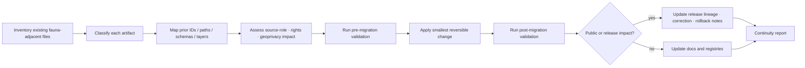

<!-- [KFM_META_BLOCK_V2]
doc_id: kfm://doc/TODO-register-fauna-migration-continuity
title: Fauna Migration and Continuity
type: standard
version: v1
status: draft
owners: TODO(fauna-domain-stewards)
created: 2026-04-27
updated: 2026-05-07
policy_label: TODO(verify-public-or-restricted)
related: [README.md, CONTROL_PLANE.md, SOURCE_ROLES.md, GEOPRIVACY.md, VALIDATION.md]
tags: [kfm, fauna, migration, continuity, lineage, rollback, non-regression]
notes: [Expanded from existing repo stub; doc_id, owners, and policy_label remain TODO until document registry and steward verification.]
[/KFM_META_BLOCK_V2] -->

<a id="top"></a>

# Fauna Migration and Continuity

Preservation protocol for fauna-lane lineage, supersession, compatibility, migration, non-regression, and rollback in Kansas Frontier Matrix.

<p>
  
  
  
  
  
</p>

> [!IMPORTANT]
> **This document is about repository and knowledge-system continuity, not wildlife migration routes.**
>
> | Field | Value |
> |---|---|
> | Target path | `docs/domains/fauna/MIGRATION_AND_CONTINUITY.md` |
> | Status | `draft` |
> | Owners | `TODO(fauna-domain-stewards)` |
> | Operating posture | Preserve, map, validate, and rollback before replacing prior fauna or habitat+fauna work |
> | Public-safety posture | No migration may weaken geoprivacy, source-role, rights, evidence, release, or rollback gates |
> | Quick jumps | [Scope](#scope) · [Repo fit](#repo-fit) · [Inputs](#inputs) · [Exclusions](#exclusions) · [Continuity goals](#continuity-goals) · [Migration protocol](#migration-protocol) · [Supersession mapping template](#supersession-mapping-template) · [Hard rules](#hard-rules) · [Continuity matrix](#continuity-matrix) · [Validation](#validation) · [Rollback](#rollback) · [Open verification](#open-verification) |

---

## Scope

This document protects fauna-lane continuity when maintainers revise docs, source registries, schemas, policy files, validators, fixtures, layer manifests, API payloads, Evidence Drawer payloads, Focus Mode behavior, release bundles, rollback runbooks, or historical lineage.

It exists because fauna work is high-risk to rewrite casually. The lane includes taxonomic identity, occurrence evidence, monitoring records, range and seasonal support, habitat/model support, legal and conservation status, invasive/disease/mortality evidence, public-safe derivatives, geoprivacy transforms, EvidenceBundle resolution, governed APIs, MapLibre layers, Evidence Drawer payloads, Focus Mode outcomes, release manifests, and rollback controls.

### This document governs

| Surface | Continuity concern |
|---|---|
| Documentation | Existing domain docs should be revised upward, not overwritten with generic replacements. |
| Source registries | Source role, rights, authority scope, geoprivacy, and verification state must survive migration. |
| Taxonomy | Taxon IDs, synonyms, crosswalks, ambiguity decisions, and deterministic keys require old-to-new mapping. |
| Occurrences and monitoring | Restricted and public derivatives must remain separated; public geometry class must not drift. |
| Schemas and contracts | Schema-home changes must preserve field semantics, fixtures, aliases, and version lineage. |
| Policy and validators | Deny/abstain behavior must not weaken during refactors. |
| API/UI payloads | Runtime envelope, Evidence Drawer, layer, search, export, and Focus payload shapes need compatibility checks. |
| Release artifacts | Release manifests, proof packs, receipts, correction notices, and rollback targets remain auditable. |

### This document does not govern

| Not governed here | Owning surface |
|---|---|
| Source-role taxonomy | [SOURCE_ROLES.md](SOURCE_ROLES.md) |
| Public geometry classes and geoprivacy rules | [GEOPRIVACY.md](GEOPRIVACY.md) |
| Executable gate behavior | [VALIDATION.md](VALIDATION.md) plus repo-native validator code |
| Owners, cadence, and risk register | [CONTROL_PLANE.md](CONTROL_PLANE.md) |
| Domain overview and contributor orientation | [README.md](README.md) |
| Machine schema authority | Accepted schema-home ADR and schema root |
| Policy-as-code | Accepted `policy/` root after repo verification |
| Generated validation reports | Build/report/proof locations, not prose docs |

[Back to top](#top)

---

## Repo fit

`MIGRATION_AND_CONTINUITY.md` is a human-facing domain control-plane document. It belongs under `docs/domains/fauna/` because fauna is a domain lane and `docs/` is the human-facing control plane.

```text
docs/domains/fauna/
├── README.md
├── CONTROL_PLANE.md
├── SOURCE_ROLES.md
├── GEOPRIVACY.md
├── VALIDATION.md
└── MIGRATION_AND_CONTINUITY.md     # this file
```

### Responsibility-root placement

| Concern | Correct responsibility root | Continuity rule |
|---|---|---|
| Domain guidance | `docs/domains/fauna/` | Explain and preserve behavior; do not store machine truth here. |
| Semantic contracts | `contracts/` or accepted contract root | Preserve meaning and invariants when schemas move. |
| Machine schemas | `schemas/` or accepted schema root | Version and validate; avoid parallel authority. |
| Source registry | `data/registry/fauna/` or accepted registry root | Preserve source IDs, roles, rights, cadence, and verification state. |
| Policy | `policy/fauna/` or accepted policy root | Preserve deny/abstain behavior and negative fixtures. |
| Validators | `tools/validators/fauna/` or repo-native validator home | Emit machine-readable migration/non-regression reports. |
| Fixtures/tests | `tests/`, `fixtures/`, or repo-native equivalent | Preserve valid/invalid historical expectations. |
| Release decisions | `release/` | Preserve manifests, promotion decisions, correction notices, and rollback cards. |
| Lifecycle data | `data/raw`, `data/work`, `data/quarantine`, `data/processed`, `data/catalog`, `data/published` | Preserve lifecycle boundaries; never treat a file move as publication. |

> [!CAUTION]
> Do not create a root-level `fauna/` folder to solve a migration. Domain material belongs under the appropriate responsibility root.

[Back to top](#top)

---

## Inputs

This document accepts continuity and migration guidance, not raw data.

| Accepted input | Conditions |
|---|---|
| Prior-gain inventories | Must distinguish current repo files, lineage documents, generated artifacts, and proposed paths. |
| Old-to-new path maps | Must include status, reason, owner, validation proof, and rollback target. |
| ID migration maps | Must preserve prior identifiers and avoid silent reuse. |
| Schema/version maps | Must state semantic changes, alias behavior, fixture changes, and compatibility risk. |
| Layer/API/UI payload maps | Must preserve public-safety and EvidenceBundle behavior. |
| Non-regression requirements | Must include positive and negative fixtures. |
| Supersession notes | Must identify replaced artifacts and retained lineage. |
| Rollback notes | Must state what to restore, invalidate, withdraw, or correct. |

[Back to top](#top)

---

## Exclusions

| Excluded item | Correct home or handling | Reason |
|---|---|---|
| Raw source payloads | `data/raw/fauna/...` or repo-confirmed equivalent | Docs must not become source storage. |
| Work or quarantine records | `data/work/fauna/...` / `data/quarantine/fauna/...` | These stages are not public documentation. |
| Restricted exact coordinates | Restricted canonical store only | Public docs must not leak sensitive locations. |
| Source credentials or keys | Secret manager / environment-specific config | Secrets never belong in docs. |
| Machine migration scripts | `migrations/` or accepted migration root | Scripts need executable review, dry-run, and rollback. |
| Machine schemas | Accepted schema root after ADR verification | This file describes migration expectations, not schema authority. |
| Policy-as-code | `policy/fauna/...` or accepted policy root | Policy must be executable and testable. |
| Validator code | `tools/validators/fauna/...` or accepted tool root | Code must emit reports and run in CI. |
| Generated reports | `build/`, `data/receipts/`, `data/proofs/`, or accepted output roots | Reports are evidence artifacts, not source prose. |
| Release decisions | `release/` | Release state is a governed decision object. |
| AI output | Nowhere as evidence | AI can assist migration review; it cannot become lineage proof. |

[Back to top](#top)

---

## Continuity goals

- Preserve prior fauna and habitat+fauna work instead of restarting.
- Keep historical IDs, paths, schema names, layer IDs, API shapes, fixture expectations, and release states inspectable.
- Make every migration reversible where feasible.
- Maintain source-role, rights, sensitivity, geoprivacy, evidence, release, correction, and rollback boundaries.
- Prevent silent replacement of public-safe outputs, synthetic proof slices, or negative-path tests.
- Keep compatibility aliases explicit and temporary.
- Require non-regression validation before and after a migration.
- Record why an artifact was retained, migrated, superseded, aliased, retired, or quarantined.

### Continuity posture by artifact type

| Artifact type | Default posture | Why |
|---|---|---|
| Prior docs | Preserve and revise | Documentation carries doctrine, warnings, and rationale. |
| Prior schemas | Preserve semantics; migrate path only through ADR | Schema churn can break fixtures, validators, API payloads, and release bundles. |
| Prior source descriptors | Preserve source IDs and role meanings | Source authority and rights are part of claim meaning. |
| Prior fixtures | Preserve or map | Fixtures are executable memory of expected behavior. |
| Prior validators | Preserve behavior; adapt implementation home | Validators protect the trust membrane. |
| Prior policy files | Preserve deny/abstain semantics | A migration must not weaken public-safety defaults. |
| Prior API/UI payloads | Preserve contract compatibility or document breaking change | Public and steward surfaces rely on stable envelopes. |
| Prior release objects | Preserve append-only lineage | Release and correction records are audit artifacts. |
| Prior public-safe layers | Preserve aliases or publish migration notices | Map users and downstream consumers need stable layer identity. |

[Back to top](#top)

---

## Migration protocol

A fauna migration must follow the sequence below unless a repo-level ADR provides a stricter process.



### Required steps

1. **Inventory**
   - Search docs, contracts, schemas, policy, source registries, fixtures, validators, tests, API surfaces, UI payloads, release objects, and published artifacts.
   - Mark whether each artifact is `CONFIRMED`, `LINEAGE`, `PROPOSED`, `UNKNOWN`, or `NEEDS VERIFICATION`.

2. **Classify**
   - Use one migration action per artifact: `retain`, `migrate`, `supersede`, `alias`, `retire`, or `quarantine`.

3. **Map**
   - Record old-to-new IDs, paths, schema `$id` values, source IDs, layer IDs, route names, fixture names, and release aliases.

4. **Assess risk**
   - Check whether the change affects source authority, legal/conservation status, occurrence support, sensitive geometry, public payloads, EvidenceBundle closure, Focus Mode, or release state.

5. **Pre-validate**
   - Run existing tests and validators before the migration so regression is measurable.

6. **Apply smallest reversible change**
   - Prefer adapters, aliases, compatibility shims, and deprecation windows over broad rewrites.

7. **Post-validate**
   - Run schema, source-role, geoprivacy, evidence, public-payload, release, rollback, and continuity checks.

8. **Document**
   - Update companion docs and the supersession table in this file.

9. **Rollback-ready closeout**
   - Confirm rollback target, cache invalidation scope, correction notice requirement, and release alias behavior.

[Back to top](#top)

---

## Supersession mapping template

Use this table in PRs, release notes, and migration records.

| Prior artifact | Successor artifact | Change type | Status | Reason | Compatibility rule | Validation evidence | Rollback path |
|---|---|---:|---:|---|---|---|---|
| `TODO` | `TODO` | `retain/migrate/supersede/alias/retire/quarantine` | `TODO` | `TODO` | `TODO` | `TODO` | `TODO` |

### Change-type definitions

| Change type | Meaning | Required proof |
|---|---|---|
| `retain` | Artifact remains canonical or still valid. | Current validation or review note. |
| `migrate` | Artifact moves to a new responsibility root or schema version. | Old-to-new map, compatibility test, rollback note. |
| `supersede` | New artifact replaces old for future use. | Supersession record and non-regression check. |
| `alias` | Old name/path/ID points to successor temporarily. | Alias expiration plan and tests. |
| `retire` | Artifact is no longer used but remains lineage. | Retirement reason and affected-consumer check. |
| `quarantine` | Artifact is unsafe, invalid, rights-conflicted, or unresolved. | Quarantine reason and obligation list. |

[Back to top](#top)

---

## Hard rules

- Never silently delete canonical lineage.
- Never repurpose identifiers without explicit mapping.
- Never publish migration results without updated validation evidence.
- Never weaken geoprivacy, rights, source-role, evidence, or release gates during a migration.
- Never use migration as a shortcut around schema-home ADRs.
- Never treat synthetic fixtures as production releases.
- Never treat occurrence aggregators as legal-status authorities because a migration made the field convenient.
- Never expose restricted exact geometry through API payloads, tiles, search, graph projections, screenshots, examples, Evidence Drawer, or Focus Mode.
- Never overwrite release manifests, correction notices, rollback cards, receipts, or proof packs.
- Never hide breaking changes behind “cleanup” language.

[Back to top](#top)

---

## Continuity matrix

| Prior gain / surface | Preserve or migrate requirement | Compatibility risk | Non-regression target |
|---|---|---|---|
| Fauna domain docs | Keep strong doctrine, warnings, scope, and review gates; improve structure without deleting rationale. | Doc sprawl or stale authority. | Docs lint plus required companion docs updated. |
| Habitat+fauna thin slice | Preserve cross-domain EvidenceBundle, DecisionEnvelope, ReleaseManifest, RuntimeResponseEnvelope, and Evidence Drawer payload expectations. | Habitat/fauna ownership collapse. | Test that fauna occurrence can link to habitat support without making the join canonical truth. |
| Taxon and status schemas | Preserve taxon identity, synonym/crosswalk behavior, legal-status authority separation, and ambiguity handling. | Taxon ID churn or legal/status overclaim. | Ambiguous taxonomy returns `HOLD` / `ABSTAIN`; legal-status source role remains explicit. |
| Occurrence schemas | Preserve restricted/public split, coordinate uncertainty, source refs, evidence refs, rights, and sensitivity classes. | Restricted coordinates leaking into public derivatives. | Restricted exact geometry fails public-payload validation. |
| Source registry | Preserve source IDs, source roles, rights, cadence, authority scope, and verification backlog. | Unknown or overly broad roles. | Unknown source role and unknown rights block public promotion. |
| Geoprivacy policy | Preserve public geometry classes and redaction receipt requirement. | Public exact sensitive geometry. | Sensitive exact public geometry returns `DENY`. |
| Validators | Preserve report-producing behavior and fail-closed outcomes. | CI YAML becomes authority instead of validator logic. | `run_all` or equivalent emits source, schema, occurrence, geoprivacy, evidence, public-safety, and continuity reports. |
| Policy files | Preserve deny/abstain semantics for source-role misuse, rights ambiguity, missing evidence, and sensitive geometry. | Policy toolchain/version drift. | Negative policy fixtures remain denied. |
| API response envelopes | Preserve finite `ANSWER`, `ABSTAIN`, `DENY`, `ERROR` outcomes. | Runtime hides evidence gaps as generic errors. | Missing EvidenceBundle produces `ABSTAIN` or `DENY`, not an unsupported answer. |
| Evidence Drawer payloads | Preserve source role, rights, sensitivity, evidence, limitations, and release/correction visibility. | Drawer becomes a decorative summary. | Drawer fixture validates evidence and public-safety fields. |
| Map layer manifests | Preserve layer IDs, source links, public field allowlists, digests, release IDs, and rollback aliases. | Broken downstream map references or sensitive fields in metadata. | Layer manifest validator rejects restricted fields. |
| Release bundles | Preserve release manifest, proof pack, catalog closure, correction path, and rollback target. | Publication becomes a file copy. | Release dry-run fails without rollback target. |
| Receipts/proofs | Preserve append-only process memory and proof closure. | Receipts confused with proof packs. | ProofPack requires validation, policy, evidence, release, and rollback links. |

[Back to top](#top)

---

## Identifier policy

Identifiers are trust-bearing. A migration may change the storage path or schema version, but it must not silently change what an identifier means.

| Identifier family | Rule |
|---|---|
| `source_id` | Preserve unless the source identity truly changes; use supersession if publisher, authority scope, or source role changes materially. |
| `taxon_id` | Preserve deterministic identity or emit taxon migration receipt; ambiguous taxonomy must not silently merge. |
| `occurrence_id` | Preserve source-backed identity where possible; public derivatives may have separate derivative IDs tied to restricted source refs. |
| `evidence_ref` | Preserve claim support mapping or emit supersession; unresolved refs cause `ABSTAIN`. |
| `evidence_bundle_id` | Immutable per bundle content or release context; supersede instead of mutating released bundles. |
| `layer_id` | Preserve public layer IDs through alias mapping when layer implementation changes. |
| `release_id` | Append-only. Do not reuse. |
| `spec_hash` | Recompute from canonicalized spec/source/schema/transform/policy versions; hash mismatch requires rebuild or rollback. |
| `rollback_id` | Append-only rollback action record. |
| `correction_notice_id` | Append-only public/steward correction record. |

> [!WARNING]
> Repurposed identifiers are worse than broken identifiers. Broken IDs fail loudly; repurposed IDs can corrupt evidence, maps, search, graph projections, Focus Mode, and release lineage silently.

[Back to top](#top)

---

## Validation

Migration validation should prove that the migration is safe, not just that files parse.

### Required reports

| Report | Purpose |
|---|---|
| `repo_evidence` | Shows branch/path/package/test/workflow evidence used for the migration. |
| `continuity_inventory` | Lists prior artifacts and classifications. |
| `supersession_map` | Maps prior IDs/paths/schemas/layers/routes to successors. |
| `schema_compatibility` | Confirms old valid fixtures still validate or have explicit migration output. |
| `source_registry` | Confirms roles, rights, authority scope, and verification state survived migration. |
| `taxonomy` | Confirms taxon IDs/crosswalks/ambiguity handling. |
| `geoprivacy` | Confirms no public restricted geometry or reverse-engineering leak. |
| `evidence_closure` | Confirms EvidenceRefs resolve or produce `ABSTAIN`. |
| `api_ui_payloads` | Confirms public payloads and drawer/focus fixtures remain safe and finite. |
| `release_lineage` | Confirms manifests, proofs, corrections, and rollback targets remain linkable. |
| `rollback_rehearsal` | Confirms affected aliases/caches/artifacts can return to prior known-good state. |

### Proposed command shape

```bash
# PROPOSED: adapt to repo-native commands after verifying active toolchain.
python tools/validators/fauna/validate_continuity.py \
  --inventory build/fauna/reports/continuity_inventory.json \
  --map build/fauna/reports/supersession_map.json \
  --reports build/fauna/reports

python tools/validators/fauna/run_all.py \
  --fixtures tests/fixtures/fauna \
  --registry data/registry/fauna \
  --reports build/fauna/reports
```

### Non-regression checklist

- [ ] Prior valid fixtures still pass or have explicit migration output.
- [ ] Prior invalid fixtures still fail for the expected reason.
- [ ] Source-role misuse still denies.
- [ ] Unknown rights still block public promotion.
- [ ] Restricted exact geometry still denies public output.
- [ ] EvidenceRef gaps still abstain or deny.
- [ ] Focus Mode still renders `ANSWER`, `ABSTAIN`, `DENY`, and `ERROR`.
- [ ] Evidence Drawer still shows source role, rights, sensitivity, limitations, and release/correction state.
- [ ] Layer aliases still resolve or are explicitly retired.
- [ ] Rollback target exists before any publish-facing change.
- [ ] Companion docs were updated for behavior changes.

[Back to top](#top)

---

## Rollback

Rollback is a governed state transition, not a delete button.

### Rollback triggers

| Trigger | Required response |
|---|---|
| Sensitive exact geometry exposure | Immediate public withdrawal or alias rollback; geoprivacy report; correction notice. |
| Source-role collapse | Deny affected claims; correction notice; source registry fix; non-regression fixture. |
| Rights or license conflict | Withdraw public artifacts if needed; update rights state; quarantine affected source. |
| Taxonomy migration error | Repoint aliases; emit taxon migration correction; rebuild affected bundles/layers. |
| Broken EvidenceBundle resolution | Abstain affected runtime outputs; rebuild or supersede bundle. |
| Layer manifest digest mismatch | Revert layer alias to previous known-good release; invalidate caches. |
| API/UI payload leak | Disable affected route/layer/focus action; invalidate caches; add fixture. |
| Release manifest/proof mismatch | Hold or withdraw release; rebuild proof pack; preserve failed receipt. |

### Rollback checklist

- [ ] Identify affected release ID, spec hash, layer ID, route/API payload, fixture, and evidence bundle.
- [ ] Confirm previous known-good release manifest and proof pack.
- [ ] Repoint public aliases to previous known-good or safe withdrawn state.
- [ ] Invalidate tile, API, search, graph, EvidenceBundle, and Focus caches.
- [ ] Emit rollback receipt with actor/run, time, reason, old/new pointers, and validation summary.
- [ ] Emit correction notice when public users may have consumed incorrect output.
- [ ] Add non-regression fixture for the failure.
- [ ] Update this file and [VALIDATION.md](VALIDATION.md) if rollback revealed a missing gate.

[Back to top](#top)

---

## PR evidence card

Use this card in migration PR descriptions.

| Field | Required content |
|---|---|
| Goal | What is being migrated and why. |
| Owning roots | `docs/`, `schemas/`, `contracts/`, `policy/`, `tools/`, `tests/`, `data/`, `release/`, or app/package roots touched. |
| Directory Rules basis | Why each new/moved file belongs under that responsibility root. |
| Prior inventory | What existing files/artifacts/lineage were found. |
| Classification | `retain`, `migrate`, `supersede`, `alias`, `retire`, or `quarantine`. |
| Source-role impact | Legal/status/occurrence/habitat/model/source authority changes. |
| Rights/sensitivity impact | Whether public exposure, exact geometry, or steward review changes. |
| Evidence impact | EvidenceRef/EvidenceBundle changes and unresolved evidence items. |
| Public exposure impact | API, layer, search, graph, export, screenshot, Evidence Drawer, Focus Mode. |
| Validation commands | Commands run and report paths. |
| Rollback plan | Release aliases, cache invalidation, correction notice, prior known-good target. |
| Unknowns | Remaining `UNKNOWN` / `NEEDS VERIFICATION` items. |

[Back to top](#top)

---

## Open verification

| Item | Status | Needed proof |
|---|---:|---|
| Registered `doc_id` | `TODO` | Document registry entry. |
| Owners | `TODO` | CODEOWNERS, governance registry, or steward assignment. |
| Policy label | `TODO` | Repo policy classification decision. |
| Canonical schema home | `NEEDS VERIFICATION` | Accepted ADR resolving `contracts/` vs `schemas/`. |
| Validator command | `NEEDS VERIFICATION` | Repo-native validator path and CI command. |
| Policy runner | `NEEDS VERIFICATION` | OPA/Conftest/Rego or repo-native policy tooling. |
| Release/proof implementation | `NEEDS VERIFICATION` | ReleaseManifest, ProofPack, PromotionDecision, RollbackCard evidence. |
| Existing legacy fauna artifacts | `NEEDS VERIFICATION` | Full active-branch inventory of older schemas, fixtures, policies, validators, layer IDs, routes, and releases. |
| Live source rights | `NEEDS VERIFICATION` | Official source terms, record-level rights, attribution, redistribution limits, and steward approvals. |
| Sensitive species policy | `NEEDS VERIFICATION` | Steward rules, protected-species handling, geoprivacy transform thresholds, embargo behavior. |
| API/UI route compatibility | `UNKNOWN` | Current route tree, MapLibre shell, Evidence Drawer payload, and Focus Mode envelope evidence. |

[Back to top](#top)

---

## Appendix

<details>
<summary>Migration inventory seed</summary>

| Family | Candidate inventory query | Notes |
|---|---|---|
| Docs | `rg -n "fauna|wildlife|species|taxon|occurrence|geoprivacy" docs` | Preserve companion-doc links and stable anchors where possible. |
| Schemas/contracts | `find schemas contracts -iname '*fauna*' -o -iname '*occurrence*' -o -iname '*taxon*'` | Resolve schema-home authority before moving. |
| Policy | `find policy policies -iname '*fauna*' -o -iname '*sensitivity*'` | Avoid `policy/` vs `policies/` drift. |
| Validators | `find tools packages scripts -iname '*fauna*' -o -iname '*geoprivacy*'` | Validators should emit machine-readable reports. |
| Fixtures | `find tests fixtures data/fixtures -iname '*fauna*' -o -iname '*occurrence*'` | Preserve positive and negative expectations. |
| Data registry | `find data/registry -maxdepth 5 -type f | rg "fauna|source|sensitivity|taxa"` | Source roles and rights are part of claim meaning. |
| Release/proofs | `find release data/proofs data/receipts data/published -maxdepth 6 -type f | rg "fauna|species|occurrence"` | Release records are append-only lineage. |
| API/UI | `rg -n "fauna|occurrence|EvidenceBundle|DecisionEnvelope|Focus|Evidence Drawer" apps packages ui web` | Do not claim compatibility until fetched and tested. |

</details>

<details>
<summary>Continuity failure fixtures to keep or add</summary>

| Fixture | Expected outcome |
|---|---|
| `migration_without_mapping.json` | `HOLD` or `DENY` |
| `schema_home_parallel_authority.json` | `HOLD` |
| `repurposed_source_id.json` | `DENY` |
| `taxon_id_churn_without_receipt.json` | `HOLD` |
| `layer_id_removed_without_alias.json` | `HOLD` |
| `release_without_rollback_target.json` | `DENY` |
| `restricted_geometry_after_migration.json` | `DENY` |
| `aggregator_promoted_to_legal_authority.json` | `DENY` |
| `focus_output_missing_evidence_after_migration.json` | `ABSTAIN` or `DENY` |
| `evidence_drawer_hides_sensitivity_after_migration.json` | `DENY` |

</details>

<details>
<summary>Compatibility alias expiration pattern</summary>

```yaml
alias_id: TODO
prior_artifact: TODO
successor_artifact: TODO
alias_type: path|schema_id|source_id|taxon_id|layer_id|route|fixture
created: TODO
expires: TODO
owner: TODO
reason: TODO
validation_report_ref: TODO
rollback_ref: TODO
public_notice_required: false
```

Aliases should be temporary unless the repo explicitly approves permanent compatibility support.

</details>

[Back to top](#top)