<!-- [KFM_META_BLOCK_V2]
doc_id: kfm://doc/domains/fauna/missing-or-planned-files
title: Fauna — Missing or Planned Files Register
type: standard
version: v0.2
status: draft
owners: Fauna Domain Steward (TBD) + Docs Steward (TBD)
created: 2026-05-16
updated: 2026-06-02
policy_label: public
contract_version: "3.0.0"
related:
  - docs/doctrine/directory-rules.md
  - ai-build-operating-contract.md
  - docs/domains/fauna/README.md
  - docs/domains/fauna/IDENTITY_MODEL.md
  - docs/domains/fauna/MAP_UI_CONTRACTS.md
  - docs/registers/VERIFICATION_BACKLOG.md
  - docs/registers/DRIFT_REGISTER.md
  - control_plane/verification_backlog.yaml
  - docs/adr/README.md
  - docs/runbooks/fauna/SOURCE_REFRESH_RUNBOOK.md
tags: [kfm, fauna, register, planning, governance]
notes:
  - "CONTRACT_VERSION = 3.0.0 pinned per ai-build-operating-contract.md."
  - Planning artifact; not proof of repo state.
  - All paths PROPOSED until verified against mounted repo.
  - Sensitive-occurrence handling defaults deny-closed.
  - "MonitoringEvent is CONFLICTED — it is NOT in the Atlas v1.1 Fauna ownership list (§B); see §5.1 and §6.1/§6.4/§6.5 caveats."
  - "FaunaDecisionEnvelope retired in favor of RuntimeResponseEnvelope; see §6.6."
  - Atlas §24.13 omits the `domains/` segment for contracts/ and schemas/; Directory Rules §6.3/§6.4 keep it and win (§2.1). See §6.4/§6.5 CONFLICTED notes.
[/KFM_META_BLOCK_V2] -->

# 🦌 Fauna — Missing or Planned Files Register

> **A per-domain inventory of files that the Fauna lane is expected to grow, organized by responsibility root and lifecycle phase. This is a planning register, not a repo-state report.**

<!-- TODO: replace static last-reviewed shield with a CI-driven endpoint when the docs CI is wired. -->

| Field | Value |
|---|---|
| **Status** | `draft` — awaiting domain-steward review |
| **Version** | `v0.2` |
| **Authority class** | Planning register (lineage + PROPOSED inventory) — **not** canonical placement authority |
| **Owners** | Fauna Domain Steward (TBD) + Docs Steward (TBD) — `CODEOWNERS` reference TBD |
| **Last reviewed** | `2026-06-02` |
| **Supersedes** | v0.1 (first version) |
| **Governed by** | `ai-build-operating-contract.md` (`CONTRACT_VERSION = "3.0.0"`), `docs/doctrine/directory-rules.md` (placement), `docs/adr/` (decisions), Atlas v1.1 Ch. 7 (Fauna scope) |

---

## Contents

1. [Purpose and scope](#1-purpose-and-scope)
2. [How to read this register](#2-how-to-read-this-register)
3. [Evidence and grounding](#3-evidence-and-grounding)
4. [Fauna lane at a glance](#4-fauna-lane-at-a-glance)
5. [Sensitivity & rights rule](#5-sensitivity--rights-rule)
6. [Inventory by responsibility root](#6-inventory-by-responsibility-root)
7. [Open ADRs that gate file creation](#7-open-adrs-that-gate-file-creation)
8. [Verification backlog (fauna scope)](#8-verification-backlog-fauna-scope)
9. [How to update this register](#9-how-to-update-this-register)
10. [Changelog](#10-changelog)
11. [Definition of done](#11-definition-of-done)
12. [Related docs](#12-related-docs)

---

## 1. Purpose and scope

The **Missing or Planned Files Register** lists artefacts that current KFM doctrine expects to exist in the **Fauna lane** but which this session cannot confirm are present in the live repository. It is the per-domain companion to `docs/registers/VERIFICATION_BACKLOG.md` and the human-readable counterpart to `control_plane/verification_backlog.yaml`.

> [!IMPORTANT]
> **This register does not create files.** It records what doctrine expects. Creating a file requires: a clear responsibility root (Directory Rules §3, §12), an applicable per-root README (§15), any required ADR (§2.4), and — for sensitive content — a passing sensitivity / rights / review gate.

**In scope**

- Files that the Fauna domain dossier, the Atlas v1.1 Fauna chapter, or the Encyclopedia Fauna section expects to exist (schemas, contracts, policies, tests, fixtures, runbooks, source descriptors, lifecycle scaffolding, release candidates).
- Placement implied by `docs/doctrine/directory-rules.md` for any of the object families owned by Fauna.
- Open ADRs whose resolution materially gates which files can be created (e.g., schema-home, sensitivity tier scheme).

**Out of scope**

- Decisions about whether a file *should* exist. That is doctrine, not placement. See `contracts/`, `schemas/`, `policy/`, and ADRs.
- Habitat, Flora, Hydrology, Hazards, and other lanes — except where a cross-lane file legitimately overlaps Fauna (called out explicitly per row).
- Repo-state assertions. Until this register is reconciled against a mounted repo (see §8), every "expected" path is **PROPOSED**.

[⬆ back to top](#contents)

---

## 2. How to read this register

Each row identifies a **proposed path**, the **responsibility** it carries, the **doctrine source** that grounds it, and a **truth label** describing what is known about its current existence.

### 2.1 Truth labels used in this register

| Label | Meaning |
|---|---|
| **CONFIRMED (doctrine)** | The *requirement* is grounded in attached doctrine. The *file* may or may not yet exist. |
| **PROPOSED** | Path, name, or shape is a design recommendation derived from doctrine; not yet implemented (or implementation unknown this session). |
| **NEEDS VERIFICATION** | Requires inspection of a mounted repository, test run, or release manifest to settle. |
| **UNKNOWN** | Not resolvable from currently available evidence; no defensible inference. |
| **CONFLICTED** | Doctrine source A and doctrine source B point at different placements (or ownership); an ADR or correction notice is needed. |

> [!NOTE]
> Repo presence of any file listed here is **NEEDS VERIFICATION** by default for this session, regardless of how confident doctrine is about the requirement. The register intentionally separates *"the lane requires this"* (often CONFIRMED) from *"this path exists"* (UNKNOWN without inspection).

### 2.2 Filename conventions (PROPOSED)

- Schemas: `<object_family>.schema.json` in snake_case, under `schemas/contracts/v1/domains/fauna/`.
- Contract markdown: `<object_family>.md` in snake_case, under `contracts/domains/fauna/`.
- Policy bundles: `.rego` / `.yaml` under `policy/domains/fauna/...`.
- Tests: pytest-style names; mirror the schema or contract under test.
- Runbooks: `UPPER_SNAKE_CASE.md` under `docs/runbooks/fauna/` (subfolder convention itself is **open ADR**; see §7 and Directory Rules §6.1 OPEN-DR-02).

If the repo adopts a different convention, **the repo convention wins** and this register MUST be updated accordingly via PR (with a `DRIFT_REGISTER.md` entry).

[⬆ back to top](#contents)

---

## 3. Evidence and grounding

The inventories below are grounded in the following project sources. Where a row cites a source, the citation is to a *requirement*, not a *file*. None of these sources prove a current file exists in the repository.

- **`ai-build-operating-contract.md` v3.0** — operating law (`CONTRACT_VERSION = "3.0.0"`); lifecycle invariant, trust membrane, cite-or-abstain. [CONFIRMED doctrine]
- **Directory Rules** (`docs/doctrine/directory-rules.md`) — §3 (root responsibility), §5 (canonical root list), §6.3 (`contracts/`), §6.4 (`schemas/`), §6.5 (`policy/`), §7.3 (`connectors/`), §7.4 (`pipelines/`), §9 (data lifecycle), §12 (Domain Placement Law), §15 (Required README Contract). [CONFIRMED doctrine]
- **KFM Domains Culmination Atlas v1.1**, Ch. 7 Fauna (A–N), §24.5 (tier scheme, PROPOSED), §24.13 (Domain ↔ Responsibility-Root Crosswalk). [CONFIRMED dossier]
- **KFM Domain and Capability Encyclopedia**, §7.5 Fauna. [CONFIRMED dossier]
- **KFM Unified Implementation Architecture Build Manual** — Fauna scope, first-PR posture (no live source), Phase 10 lane order. [CONFIRMED dossier]
- **Atlas Pass 10 / Pass 20 idea index** — POL, VAL, MAP, GOV doctrine surfaces the fauna lane inherits; `C7-07`/`C7-08` taxonomic authorities; `C10-06` biodiversity sources. [CONFIRMED lineage]
- **ADR-0001** (schema home: `schemas/contracts/v1/...`). [CONFIRMED doctrine; ADR text NEEDS VERIFICATION]

> [!NOTE]
> **Where doctrine sources disagree on placement, Directory Rules wins** (§2.1 authority order). Two such disagreements recur in this register: Atlas §24.13 writes the lane home as `contracts/fauna/` and `schemas/contracts/v1/fauna/` (no `domains/` segment), whereas Directory Rules §6.3/§6.4 keep the `domains/` segment (`contracts/domains/fauna/`, `schemas/contracts/v1/domains/fauna/`). This register follows Directory Rules and treats the Atlas crosswalk as **lineage**. See §6.4 and §6.5.

[⬆ back to top](#contents)

---

## 4. Fauna lane at a glance

The diagram below shows the responsibility roots that the Fauna lane is expected to populate. Every shape is **PROPOSED** for this repo's current state; only the *pattern* (Directory Rules §12) is CONFIRMED.

```mermaid
flowchart LR
  subgraph DOC["docs/ (human-facing)"]
    D1["docs/domains/fauna/"]
    D2["docs/sources/.../fauna (PROPOSED home)"]
    D3["docs/runbooks/fauna/"]
    D4["docs/adr/ADR-*-fauna-*"]
  end

  subgraph MEAN["contracts/ + schemas/ (meaning + shape)"]
    C1["contracts/domains/fauna/"]
    S1["schemas/contracts/v1/domains/fauna/"]
  end

  subgraph GOV["policy/ (admissibility)"]
    P1["policy/domains/fauna/"]
    P2["policy/sensitivity/fauna/"]
    P3["policy/rights/fauna/"]
  end

  subgraph PROOF["tests/ + fixtures/ (enforceability)"]
    T1["tests/domains/fauna/"]
    F1["fixtures/domains/fauna/"]
  end

  subgraph EXEC["pipelines/ + connectors/ + tools/"]
    PL1["pipelines/domains/fauna/"]
    PS1["pipeline_specs/fauna/"]
    CN1["connectors/&lt;source&gt;/"]
    TL1["tools/validators/&lt;topic&gt;/"]
    PKG1["packages/domains/fauna/"]
  end

  subgraph DATA["data/ (lifecycle)"]
    R1["data/raw/fauna/"]
    W1["data/work/fauna/"]
    Q1["data/quarantine/fauna/"]
    PR1["data/processed/fauna/"]
    CT1["data/catalog/domain/fauna/"]
    PB1["data/published/layers/fauna/"]
    RG1["data/registry/sources/fauna/"]
  end

  subgraph REL["release/ (decisions)"]
    RC1["release/candidates/fauna/"]
  end

  DOC --> MEAN --> GOV --> PROOF --> EXEC --> DATA --> REL
```

> [!WARNING]
> **The diagram is illustrative.** Arrows represent governance flow (doctrine → meaning → admissibility → proof → execution → data → release), not file generation or runtime call order. Promotion through `data/` phases is a **governed state transition**, not a file move (Directory Rules §9.1).

[⬆ back to top](#contents)

---

## 5. Sensitivity & rights rule

> [!CAUTION]
> **Fauna is a deny-default lane for sensitive occurrence content.** Per `[DOM-FAUNA] §I`, exact sensitive occurrences, **nests, dens, roosts, hibernacula, spawning sites**, and steward-controlled records fail closed; public exact-occurrence tiles for sensitive taxa are denied. Atlas §24.5.2 sets the Fauna sensitive-occurrence default to **T4**, releasable to **T1** only via geoprivacy generalization + `RedactionReceipt` + `ReviewRecord` + `PolicyDecision`. Any new fauna file that touches these object families MUST carry a sensitivity tier, a redaction-receipt path (where applicable), and a documented review state before promotion.

When a planned file under this register touches sensitive content, the corresponding rows in §6 explicitly call out **deny-default** in the *Status / gate* column. The sensitivity-tier vocabulary (T0–T4) itself remains **PROPOSED** under **ADR-S-05** (see §7).

[⬆ back to top](#contents)

---

## 6. Inventory by responsibility root

Each subsection follows the same shape: a brief root-level note, a table of expected paths, and any per-root caveats. Paths and exact filenames are **PROPOSED** unless explicitly noted otherwise.

> [!CAUTION]
> **Object-family scope note (applies to §6.1, §6.4, §6.5).** The Atlas v1.1 Fauna ownership list (`DOM-FAUNA §B`) names **fourteen** families: Taxon, Taxon Crosswalk, Conservation Status, Occurrence Evidence, Occurrence Restricted, Occurrence Public, RangePolygon, SeasonalRange, MigrationRoute, SensitiveSite, MortalityObservation, DiseaseObservation, Invasive Species Record, Redaction Receipt. **`MonitoringEvent` is NOT in that list** and appears below only as a **CONFLICTED / PROPOSED** candidate, pending an ADR that either admits it to Fauna ownership or assigns it elsewhere. `AbundanceIndicator` / `RichnessIndicator` are Encyclopedia §7.5.C viewing-product candidates, also **PROPOSED**. Do not treat these three as confirmed Fauna families.

### 6.1 `docs/domains/fauna/`

**Purpose.** Human-facing fauna domain doctrine: dossier, ubiquitous language, source-family overview, sensitivity posture, viewing products, pipeline shape, open questions. `docs/domains/<domain>/` is CONFIRMED as a canonical subpath of `docs/` (Directory Rules §6.1).

| Proposed path | Purpose | Doctrine basis | Status / gate |
|---|---|---|---|
| `docs/domains/fauna/README.md` | Domain dossier and orientation page. | Atlas v1.1 Ch. 7; Directory Rules §15. | **CONFIRMED required** / **NEEDS VERIFICATION** present |
| `docs/domains/fauna/MISSING_OR_PLANNED_FILES.md` | *(this document)* | Atlas v1.1 §7.N (verification backlog); Directory Rules §2.5 (drift handling). | Present in this PR |
| `docs/domains/fauna/IDENTITY_MODEL.md` | Fauna identity model (four-part basis, occurrence triad, spec_hash). | Atlas v1.1 §7.E; companion in this series. | **PROPOSED** |
| `docs/domains/fauna/MAP_UI_CONTRACTS.md` | Fauna × Map UI seam (layers, drawer, Focus Mode, geoprivacy). | Atlas v1.1 §7.G/§7.J; `[MAP-MASTER]`; companion in this series. | **PROPOSED** |
| `docs/domains/fauna/OBJECT_FAMILIES.md` | Per-object-family reference for the fourteen Atlas families (plus the CONFLICTED `MonitoringEvent` candidate). | Atlas v1.1 §7.E; Encyclopedia §7.5.C. | **PROPOSED** |
| `docs/domains/fauna/SOURCE_FAMILIES.md` | KDWP steward, USFWS ECOS, NatureServe, GBIF / eBird / iNaturalist / iDigBio / BISON, EDDMapS, agency monitoring (surveys / eDNA / acoustic / telemetry), NLCD / NWI / PADUS / SSURGO context. | Atlas v1.1 §7.D; Encyclopedia §7.5.B. | **PROPOSED** |
| `docs/domains/fauna/SENSITIVITY_POSTURE.md` | Deny-default rule set, geoprivacy transforms, redaction-receipt requirement, sensitive-site families, tier mapping under ADR-S-05. | Atlas v1.1 §7.I; §24.5; Pass 20 POL doctrine. | **PROPOSED**; gated on ADR-S-05 |
| `docs/domains/fauna/CROSS_LANE_RELATIONS.md` | Fauna ↔ Habitat, ↔ Flora, ↔ Hydrology, ↔ Hazards relations; ownership preservation; EvidenceBundle support. | Atlas v1.1 §7.F. | **PROPOSED** |
| `docs/domains/fauna/VERIFICATION_BACKLOG.md` | Per-domain backlog mirroring repo-wide `docs/registers/VERIFICATION_BACKLOG.md` for fauna-scoped items. | Atlas v1.1 §7.N. | **PROPOSED** |

> [!NOTE]
> Some of the above may be folded into `docs/domains/fauna/README.md` rather than created as siblings; that is a per-root README authoring decision, not a placement question.

[⬆ back to top](#contents)

### 6.2 `docs/sources/` and source descriptors

> [!WARNING]
> **`docs/sources/` is not an enumerated canonical subpath.** Directory Rules and the repo guiding document confirm `docs/standards/` and `docs/runbooks/` as `docs/` subpaths, but **source identity and rights live in `data/registry/sources/<domain>/` and connector READMEs under `connectors/<source>/`** — not in `docs/sources/`. The rows below are **PROPOSED / NEEDS VERIFICATION** and should be reconciled against actual repo convention before any are created; a repo-wide `SOURCE_DESCRIPTOR_STANDARD.md` is the only near-certain entry.

| Proposed path | Purpose | Doctrine basis | Status / gate |
|---|---|---|---|
| `docs/sources/SOURCE_DESCRIPTOR_STANDARD.md` *(or `docs/standards/...`)* | Repo-wide source-descriptor standard. | Directory Rules §6.1; `SourceDescriptor` doctrine. | **CONFIRMED required**, **NEEDS VERIFICATION** home + present |
| `docs/sources/gbif/README.md` | GBIF Occurrence API and Backbone notes. | Encyclopedia §7.5.B; `C7-08`. | **PROPOSED**; home NEEDS VERIFICATION |
| `docs/sources/inaturalist/README.md` | iNaturalist research-grade observations. | Atlas v1.1 §7.D. | **PROPOSED**; home NEEDS VERIFICATION |
| `docs/sources/ebird/README.md` | eBird EBD — **restricted-use terms** govern any derivative release. | Atlas v1.1 §7.D; `C10-06`. | **PROPOSED**; rights review **MUST** precede any release |
| `docs/sources/natureserve/README.md` | NatureServe conservation rankings; drives sensitivity classifications. | Atlas v1.1 §7.D; `C10-06`. | **PROPOSED** |
| `docs/sources/usfws-ecos/README.md` | USFWS ECOS listed-species and critical-habitat datasets. | Atlas v1.1 §7.D. | **PROPOSED** |
| `docs/sources/kdwp/README.md` | KDWP steward sources (incl. SINC). | Atlas v1.1 §7.D; `C7-10`. | **PROPOSED**; rights / steward review **NEEDS VERIFICATION** |
| `docs/sources/eddmaps/README.md` | EDDMapS invasive species records. | Atlas v1.1 §7.D. | **PROPOSED** |
| `docs/sources/idigbio/README.md` | iDigBio specimen aggregation. | Atlas v1.1 §7.D; `C10-06`. | **PROPOSED** |
| `docs/sources/ku-nhm/README.md` | KU Biodiversity Institute (in-state collection of record). | `C10-06`. | **PROPOSED**; specimen-count denominators **NEEDS VERIFICATION** |
| `docs/sources/fhsu-sternberg/README.md` | Sternberg Museum (FHSU). | `C10-06`. | **PROPOSED** |

[⬆ back to top](#contents)

### 6.3 `docs/runbooks/fauna/`

> [!NOTE]
> The runbook **subfolder convention** (`docs/runbooks/fauna/...` — Directory Rules "Pattern A" — vs. flat `docs/runbooks/fauna_*.md` — "Pattern B") is an open ADR (Directory Rules §6.1 OPEN-DR-02; see §7). New authors SHOULD adopt Pattern A for any domain that already has a domain-segmented runbook in flight. This register uses Pattern A; if the ADR resolves the other way, every row below requires a name flip.

| Proposed path | Purpose | Doctrine basis | Status / gate |
|---|---|---|---|
| `docs/runbooks/fauna/SOURCE_REFRESH_RUNBOOK.md` | Source-refresh, drift detection, quarantine recovery for fauna sources. | Atlas v1.1 §7.H; ADR-S-12. | **NEEDS VERIFICATION** present in repo |
| `docs/runbooks/fauna/TAXONOMY_RESOLUTION_RUNBOOK.md` | ITIS / GBIF Backbone resolution and tie-breaks; ambiguity handling. | Atlas v1.1 §7.N; `C7-07` / `C7-08`. | **PROPOSED** |
| `docs/runbooks/fauna/SENSITIVE_OCCURRENCE_REVIEW.md` | Geoprivacy transform application, redaction-receipt issuance, steward-review path. | Atlas v1.1 §7.I; §24.5; Encyclopedia §7.5.M. | **PROPOSED**; gated on ADR-S-05 |
| `docs/runbooks/fauna/PUBLICATION_GATE_DRY_RUN.md` | Pre-promotion gate dry run for fauna release candidates. | Encyclopedia §7.5.M; Build Manual first-PR posture. | **PROPOSED** |
| `docs/runbooks/fauna/ROLLBACK_DRILL.md` | RollbackCard exercise for a released fauna layer or feature. | Encyclopedia §7.5.M; Atlas App. E. | **PROPOSED** |
| `docs/runbooks/fauna/EBD_DERIVATIVE_RELEASE.md` | eBird EBD restricted-use derivative release checklist. | `C10-06`; Atlas v1.1 §7.D. | **PROPOSED**; rights review **MUST** precede |

[⬆ back to top](#contents)

### 6.4 `contracts/domains/fauna/`

**Purpose.** Object **meaning** (Markdown). Pairs one-for-one with `schemas/contracts/v1/domains/fauna/` (shape).

> [!NOTE]
> **CONFLICTED placement (resolved in favor of Directory Rules).** Directory Rules §6.3 shows the canonical lane home **with** a `domains/` segment: `contracts/domains/<domain>/`. Atlas §24.13 writes it **without**: `contracts/fauna/`. Per §2.1 authority order, **Directory Rules wins**; the Atlas crosswalk is lineage. This register uses `contracts/domains/fauna/`. Log the divergence in `DRIFT_REGISTER.md`.

| Proposed path | Object family | Doctrine basis | Status |
|---|---|---|---|
| `contracts/domains/fauna/README.md` | Per-root README (§15). | Directory Rules §15. | **PROPOSED** |
| `contracts/domains/fauna/taxon.md` | `Taxon` semantic spec. | Atlas v1.1 §7.C, §7.E. | **PROPOSED** |
| `contracts/domains/fauna/taxon_crosswalk.md` | `TaxonCrosswalk` (ITIS↔GBIF↔others) semantic spec. | Atlas v1.1 §7.E; `C7-07`/`C7-08`. | **PROPOSED** |
| `contracts/domains/fauna/conservation_status.md` | `ConservationStatus` semantic spec. | Atlas v1.1 §7.E. | **PROPOSED** |
| `contracts/domains/fauna/occurrence_evidence.md` | `OccurrenceEvidence` semantic spec. | Atlas v1.1 §7.E. | **PROPOSED** |
| `contracts/domains/fauna/occurrence_restricted.md` | `OccurrenceRestricted` — exact, steward-only. | Atlas v1.1 §7.E, §7.I. | **PROPOSED**; deny-default |
| `contracts/domains/fauna/occurrence_public.md` | `OccurrencePublic` — generalized / public-safe derivative. | Atlas v1.1 §7.E. | **PROPOSED** |
| `contracts/domains/fauna/range_polygon.md` | `RangePolygon` semantic spec. | Atlas v1.1 §7.E. | **PROPOSED** |
| `contracts/domains/fauna/seasonal_range.md` | `SeasonalRange` semantic spec. | Atlas v1.1 §7.E. | **PROPOSED** |
| `contracts/domains/fauna/migration_route.md` | `MigrationRoute` semantic spec. | Atlas v1.1 §7.E. | **PROPOSED** |
| `contracts/domains/fauna/sensitive_site.md` | `SensitiveSite` — nests / dens / roosts / hibernacula / spawning (as `site_type`). | Atlas v1.1 §7.E, §7.I. | **PROPOSED**; deny-default |
| `contracts/domains/fauna/mortality_observation.md` | `MortalityObservation` semantic spec. | Atlas v1.1 §7.E. | **PROPOSED** |
| `contracts/domains/fauna/disease_observation.md` | `DiseaseObservation` semantic spec. | Atlas v1.1 §7.E. | **PROPOSED** |
| `contracts/domains/fauna/invasive_species_record.md` | `InvasiveSpeciesRecord` semantic spec. | Atlas v1.1 §7.E. | **PROPOSED** |
| `contracts/domains/fauna/redaction_receipt.md` | `RedactionReceipt` — record of geoprivacy / field-redaction transforms. | Atlas v1.1 §7.E; Encyclopedia §7.5.C. | **PROPOSED** |
| `contracts/domains/fauna/monitoring_event.md` *(CONFLICTED)* | `MonitoringEvent` semantic spec (surveys, eDNA, acoustic, telemetry). | Atlas v1.1 §7.C mentions monitoring, but **§7.B ownership list omits the family**. | **CONFLICTED / PROPOSED**; pending ownership ADR |

> [!IMPORTANT]
> Per Directory Rules §6.3, executable schema definitions **MUST NOT** live alongside contract Markdown. Any `*.schema.json` found under `contracts/...` is **CONFLICTED** per ADR-0001 and must migrate to §6.5.

[⬆ back to top](#contents)

### 6.5 `schemas/contracts/v1/domains/fauna/`

**Purpose.** Object **shape** (JSON Schema). Canonical home per ADR-0001.

> [!NOTE]
> **Same CONFLICTED placement as §6.4.** Directory Rules §6.4 keeps the `domains/` segment (`schemas/contracts/v1/domains/<domain>/`); Atlas §24.13 omits it (`schemas/contracts/v1/fauna/`). Directory Rules wins (§2.1). This register uses `schemas/contracts/v1/domains/fauna/`.

<strong>Expand: full fauna schema inventory (PROPOSED)</strong>

| Proposed path | Object family | Status |
|---|---|---|
| `schemas/contracts/v1/domains/fauna/taxon.schema.json` | `Taxon` | **PROPOSED** |
| `schemas/contracts/v1/domains/fauna/taxon_crosswalk.schema.json` | `TaxonCrosswalk` | **PROPOSED** |
| `schemas/contracts/v1/domains/fauna/conservation_status.schema.json` | `ConservationStatus` | **PROPOSED** |
| `schemas/contracts/v1/domains/fauna/occurrence_evidence.schema.json` | `OccurrenceEvidence` | **PROPOSED** |
| `schemas/contracts/v1/domains/fauna/occurrence_restricted.schema.json` | `OccurrenceRestricted` | **PROPOSED** (deny-default) |
| `schemas/contracts/v1/domains/fauna/occurrence_public.schema.json` | `OccurrencePublic` | **PROPOSED** |
| `schemas/contracts/v1/domains/fauna/range_polygon.schema.json` | `RangePolygon` | **PROPOSED** |
| `schemas/contracts/v1/domains/fauna/seasonal_range.schema.json` | `SeasonalRange` | **PROPOSED** |
| `schemas/contracts/v1/domains/fauna/migration_route.schema.json` | `MigrationRoute` | **PROPOSED** |
| `schemas/contracts/v1/domains/fauna/sensitive_site.schema.json` | `SensitiveSite` | **PROPOSED** (deny-default) |
| `schemas/contracts/v1/domains/fauna/mortality_observation.schema.json` | `MortalityObservation` | **PROPOSED** |
| `schemas/contracts/v1/domains/fauna/disease_observation.schema.json` | `DiseaseObservation` | **PROPOSED** |
| `schemas/contracts/v1/domains/fauna/invasive_species_record.schema.json` | `InvasiveSpeciesRecord` | **PROPOSED** |
| `schemas/contracts/v1/domains/fauna/redaction_receipt.schema.json` | `RedactionReceipt` | **PROPOSED** |
| `schemas/contracts/v1/domains/fauna/monitoring_event.schema.json` | `MonitoringEvent` | **CONFLICTED / PROPOSED** (not in Atlas §7.B ownership list) |
| `schemas/contracts/v1/domains/fauna/abundance_indicator.schema.json` | `AbundanceIndicator` | **PROPOSED** (Encyclopedia §7.5.C viewing product) |
| `schemas/contracts/v1/domains/fauna/richness_indicator.schema.json` | `RichnessIndicator` | **PROPOSED** (Encyclopedia §7.5.C viewing product) |
| `schemas/tests/valid/domains/fauna/...` | Positive fixtures (paths mirror schemas). | **PROPOSED** |
| `schemas/tests/invalid/domains/fauna/...` | Negative fixtures (paths mirror schemas). | **PROPOSED** |

> [!NOTE]
> Whether per-domain receipt schemas live under `schemas/contracts/v1/domains/fauna/receipts/` or under a shared `schemas/contracts/v1/receipts/` home is open under **ADR-S-03**. This register intentionally does *not* yet enumerate receipt schemas under `fauna/` to avoid prejudging that ADR.

[⬆ back to top](#contents)

### 6.6 `policy/domains/fauna/` and `policy/sensitivity/fauna/`

**Purpose.** Admissibility, sensitivity, rights, and release-gate policy for fauna content. Canonical singular root is `policy/` (Directory Rules §6.5); `policies/` is treated as compatibility.

| Proposed path | Purpose | Doctrine basis | Status / gate |
|---|---|---|---|
| `policy/domains/fauna/README.md` | Per-root README (§15). | Directory Rules §15. | **PROPOSED** |
| `policy/sensitivity/fauna/deny_default.rego` (or `.yaml`) | Default-deny for sensitive occurrence, nest, den, roost, hibernaculum, spawning, steward-controlled records. | Atlas v1.1 §7.I; §20.5; §24.13. | **PROPOSED**; deny-default |
| `policy/sensitivity/fauna/tier_mapping.yaml` | NatureServe S1/S2 → sensitivity tier mapping. | `C10-06`; ADR-S-05. | **PROPOSED**; gated on ADR-S-05 |
| `policy/sensitivity/fauna/sensitive_taxa.yaml` | Curated list of sensitive taxa (steward-maintained, not public). | Atlas v1.1 §7.I. | **PROPOSED**; restricted |
| `policy/rights/fauna/ebd_terms.yaml` | eBird EBD restricted-use terms enforcement. | `C10-06`. | **PROPOSED** |
| `policy/rights/fauna/source_terms.yaml` | Per-source rights, license, attribution, redistribution class. | Atlas v1.1 §7.D; ADR-S-04. | **PROPOSED** |
| `policy/domains/fauna/tile_field_allowlist.yaml` | Public PMTiles field allowlist for fauna layers. | Atlas v1.1 §7.K (tile field allowlist tests). | **PROPOSED** |
| `policy/domains/fauna/runtime_envelope.rego` | Finite-outcome runtime policy (`ANSWER` / `ABSTAIN` / `DENY` / `ERROR`) for fauna surfaces. | Atlas v1.1 §7.J; Encyclopedia §7.5.I; operating contract §21. | **PROPOSED** *(was `api_envelope.rego` / `FaunaDecisionEnvelope`; reconciled to `RuntimeResponseEnvelope` — see §10)* |
| `policy/release/fauna/promotion_gate.rego` | Promotion gate: source-role registry + rights + taxonomic resolution + sensitivity/geoprivacy + evidence closure + public-safe derivative + rollback support. | Build Manual; Atlas v1.1 §7.H. | **PROPOSED** |
| `policy/tests/domains/fauna/...` | Policy tests (deny / abstain / allow / restrict). | Directory Rules §6.5. | **PROPOSED** |
| `policy/fixtures/domains/fauna/...` | Policy fixtures distinct from `tests/fixtures/`. | Directory Rules §6.5. | **PROPOSED** |

[⬆ back to top](#contents)

### 6.7 `tests/domains/fauna/`

**Purpose.** Proof that fauna rules are enforceable. Directly maps to the proposed validator list in Atlas v1.1 §7.K.

| Proposed path | Purpose | Doctrine basis | Status |
|---|---|---|---|
| `tests/domains/fauna/test_source_role_authority.py` | Source-role anti-collapse for authority / observation / aggregator / model / context. | Atlas v1.1 §7.K; ADR-S-04. | **PROPOSED** |
| `tests/domains/fauna/test_taxonomy_resolution.py` | ITIS / GBIF Backbone resolution + ambiguity handling. | Atlas v1.1 §7.K, §7.N. | **PROPOSED** |
| `tests/domains/fauna/test_occurrence_split.py` | Restricted vs. public occurrence split — sensitive-taxa fail closed. | Atlas v1.1 §7.K; §7.I. | **PROPOSED**; deny-default |
| `tests/domains/fauna/test_redaction_receipt.py` | RedactionReceipt validation for geoprivacy transforms. | Atlas v1.1 §7.K. | **PROPOSED** |
| `tests/domains/fauna/test_tile_field_allowlist.py` | Public-tile field allowlist enforcement. | Atlas v1.1 §7.K. | **PROPOSED** |
| `tests/domains/fauna/test_runtime_envelope_negative.py` | `RuntimeResponseEnvelope` negative cases (`ABSTAIN` / `DENY` / `ERROR`). | Atlas v1.1 §7.K; operating contract §21.2. | **PROPOSED** |
| `tests/domains/fauna/test_evidence_closure.py` | `EvidenceRef → EvidenceBundle` resolution for fauna features. | Encyclopedia §7.5.H. | **PROPOSED** |
| `tests/domains/fauna/test_publication_gate.py` | Publication gate fail-closed on missing proof, sidecar, signature, rights, sensitivity. | Build Manual; Atlas v1.1 §7.H. | **PROPOSED** |
| `tests/domains/fauna/test_rollback_drill.py` | RollbackCard exercise. | Encyclopedia §7.5.M. | **PROPOSED** |
| `tests/domains/fauna/test_ai_no_leak.py` | AI Focus Mode never leaks sensitive exact locations for fauna. | Atlas v1.1 §7.L, §7.N. | **PROPOSED**; deny-default |

[⬆ back to top](#contents)

### 6.8 `fixtures/domains/fauna/`

**Purpose.** Golden, valid, invalid, and synthetic test inputs for fauna. Per Directory Rules §6.6, fixtures MAY live under `tests/fixtures/` OR `fixtures/`, but not both without a per-root README distinguishing scope.

| Proposed path | Purpose | Doctrine basis | Status |
|---|---|---|---|
| `fixtures/domains/fauna/valid/non_sensitive_occurrence.json` | One non-sensitive public occurrence fixture joined to a habitat patch. | Encyclopedia §7.5.N (first credible thin slice). | **PROPOSED** |
| `fixtures/domains/fauna/valid/range_polygon.geojson` | A small valid `RangePolygon`. | Atlas v1.1 §7.E. | **PROPOSED** |
| `fixtures/domains/fauna/valid/seasonal_range.geojson` | A `SeasonalRange` with valid temporal scope. | Atlas v1.1 §7.E. | **PROPOSED** |
| `fixtures/domains/fauna/invalid/missing_source_descriptor.json` | Negative fixture for source-role authority test. | Atlas v1.1 §7.K. | **PROPOSED** |
| `fixtures/domains/fauna/invalid/over_precise_sensitive.json` | Negative fixture: exact location for sensitive taxon (must DENY). | Atlas v1.1 §7.I. | **PROPOSED**; deny-default |
| `fixtures/domains/fauna/invalid/unresolved_taxonomy.json` | Negative fixture: ambiguous TaxonCrosswalk. | Atlas v1.1 §7.N. | **PROPOSED** |
| `fixtures/domains/fauna/synthetic/no_network_drift_window.json` | Synthetic source-drift watcher input (no live network). | Build Manual first-PR (no-network) posture. | **PROPOSED** |
| `fixtures/domains/fauna/golden/public_safe_density_grid.json` | Golden public-safe occurrence density grid. | Atlas v1.1 §7.G. | **PROPOSED** |

[⬆ back to top](#contents)

### 6.9 `tools/validators/...` (fauna-touching)

> [!NOTE]
> Per Directory Rules §12 (multi-domain and cross-cutting files), shared validators **MUST NOT** be placed under a single-domain segment. The rows below are *fauna-touching* validators whose canonical home is under `tools/validators/<topic>/`, not `tools/validators/domains/fauna/`. *(Note: the live-repo orchestrator path is `tools/validate_all.py`, not `tools/validators/validate_all.py` — Directory Rules §7.5.a / OPEN-DR-07.)*

| Proposed path | Purpose | Doctrine basis | Status |
|---|---|---|---|
| `tools/validators/source_descriptor/` | Validates `SourceDescriptor` including fauna sources. | Directory Rules §7.5. | **NEEDS VERIFICATION** present |
| `tools/validators/evidence_bundle/` | Validates `EvidenceBundle` including fauna projections. | Directory Rules §7.5. | **NEEDS VERIFICATION** present |
| `tools/validators/taxonomy_resolver/` | ITIS / GBIF / NatureServe taxonomy resolver and tie-breaker. | Atlas v1.1 §7.N; `C7-07`/`C7-08`. | **PROPOSED** |
| `tools/validators/geoprivacy_transform/` | Validates geoprivacy transform + RedactionReceipt. | Atlas v1.1 §7.I. | **PROPOSED** |
| `tools/validators/sensitive_location_allow/` | Pre-publication check that no exact sensitive coordinates leak. | Atlas v1.1 §7.I. | **PROPOSED**; deny-default |

[⬆ back to top](#contents)

### 6.10 `connectors/`

Per Directory Rules §7.3, connectors emit only to `data/raw/<domain>/<source_id>/<run_id>/` or `data/quarantine/...` — **connectors do not publish**, and MUST NOT write under `data/processed/`, `data/catalog/`, or `data/published/`. Connector files are organized by source, not by domain, but every connector below admits fauna content.

| Proposed path | Source | Doctrine basis | Status / gate |
|---|---|---|---|
| `connectors/gbif/` | GBIF Occurrence API + Backbone. | Atlas v1.1 §7.D; `C7-08`. | **PROPOSED**; rights review required |
| `connectors/inaturalist/` | iNaturalist research-grade observations. | Atlas v1.1 §7.D. | **PROPOSED** |
| `connectors/ebird/` | eBird EBD. | `C10-06`. | **PROPOSED**; **restricted-use terms gate** |
| `connectors/natureserve/` | NatureServe rankings. | Atlas v1.1 §7.D. | **PROPOSED** |
| `connectors/usfws-ecos/` | USFWS ECOS. | Atlas v1.1 §7.D. | **PROPOSED** |
| `connectors/kdwp/` | KDWP steward sources. | Atlas v1.1 §7.D. | **PROPOSED**; steward agreement **NEEDS VERIFICATION** |
| `connectors/eddmaps/` | EDDMapS invasive feeds. | Atlas v1.1 §7.D. | **PROPOSED** |
| `connectors/idigbio/` | iDigBio specimen records. | Atlas v1.1 §7.D. | **PROPOSED** |

> [!WARNING]
> **No live wildlife connector should be activated** until source rights, source role, steward permissions, taxonomic resolver, and sensitivity policy are settled. Per the Build Manual, the proposed first PR for fauna is synthetic and no-network (no live connectors, no model calls, no public release).

[⬆ back to top](#contents)

### 6.11 `packages/domains/fauna/`

| Proposed path | Purpose | Doctrine basis | Status |
|---|---|---|---|
| `packages/domains/fauna/README.md` | Per-root README (§15). | Directory Rules §15. | **PROPOSED** |
| `packages/domains/fauna/identity/` | Fauna identity rules (source id + object role + temporal scope + normalized digest). | Atlas v1.1 §7.E. | **PROPOSED** |
| `packages/domains/fauna/normalize/` | Domain-specific normalization helpers (taxonomy, temporal, geometry). | Atlas v1.1 §7.H. | **PROPOSED** |
| `packages/domains/fauna/public_safe/` | Public-safe derivative builders (density grids, generalized ranges). | Atlas v1.1 §7.G. | **PROPOSED** |

[⬆ back to top](#contents)

### 6.12 `pipelines/` and `pipeline_specs/fauna/`

Per Directory Rules §7.4: `pipeline_specs/` is *what* should run (declarative); `pipelines/` is *how* it runs (executable). The §7.4 tree shows both phase folders (`pipelines/ingest/`, `normalize/`, `validate/`, `catalog/`, `triplets/`, `publish/`, `rollback/`) and a `pipelines/domains/` lane; the placement quick-check (Directory Rules §4 step 4) prefers `pipelines/domains/<domain>/`. Rows below favor the domain-lane form; phase-folder placement is an acceptable alternative if a per-root README declares it.

| Proposed path | Purpose | Doctrine basis | Status |
|---|---|---|---|
| `pipeline_specs/fauna/README.md` | Per-root README for fauna specs. | Directory Rules §15. | **PROPOSED** |
| `pipeline_specs/fauna/ingest.yaml` | Ingest spec per fauna source family. | Atlas v1.1 §7.H. | **PROPOSED** |
| `pipeline_specs/fauna/normalize.yaml` | Normalize spec (taxonomy, geometry, time, identity, evidence, rights, policy). | Atlas v1.1 §7.H. | **PROPOSED** |
| `pipeline_specs/fauna/catalog.yaml` | Catalog spec (STAC / DCAT / PROV emissions for fauna). | Atlas v1.1 §7.H. | **PROPOSED** |
| `pipeline_specs/fauna/publish.yaml` | Publish spec (public-safe layers, manifests). | Atlas v1.1 §7.H. | **PROPOSED** |
| `pipelines/domains/fauna/ingest/...` *(or `pipelines/ingest/fauna/...`)* | Executable ingest steps. | Directory Rules §7.4; §4 step 4. | **PROPOSED** |
| `pipelines/domains/fauna/normalize/...` | Executable normalize steps. | Directory Rules §7.4. | **PROPOSED** |
| `pipelines/domains/fauna/publish/...` | Executable publish steps (watchers MUST NOT publish). | Directory Rules §7.4. | **PROPOSED** |
| `pipelines/domains/fauna/rollback/...` | Rollback drill executors. | Directory Rules §7.4. | **PROPOSED** |

[⬆ back to top](#contents)

### 6.13 `data/` lifecycle lanes

> [!IMPORTANT]
> **Promotion is a governed state transition, not a file move** (Directory Rules §9.1). The presence of a phase directory in this register is the *expectation*; whether *bytes* may be promoted into it is governed by validators, policy gates, EvidenceBundle creation, catalog closure, and release-decision recording — never by the directory existing.

<strong>Expand: full fauna data-lane inventory (PROPOSED)</strong>

| Phase | Proposed path | Allowed | MUST NOT | Status |
|---|---|---|---|---|
| RAW | `data/raw/fauna/<source_id>/<run_id>/` | Immutable source captures with retrieval metadata + checksums. | Public clients, AI context, UI layers, normalized records. | **PROPOSED** |
| WORK | `data/work/fauna/<run_id>/` | Normalized intermediates, candidate assertions. | Public API/UI, release aliases. | **PROPOSED** |
| QUARANTINE | `data/quarantine/fauna/<reason>/<run_id>/` | Failed validation, unresolved rights/sensitivity, schema drift, over-precise geometry. | Promotion candidates without remediation. | **PROPOSED**; deny-default for over-precise sensitive |
| PROCESSED | `data/processed/fauna/<dataset_id>/<version>/` | Validated canonical records. | Assumption of public/release status. | **PROPOSED** |
| CATALOG | `data/catalog/domain/fauna/` | STAC / DCAT / PROV records for fauna; domain catalog entries. | Uncited claims, unclosed identifiers. | **PROPOSED** |
| TRIPLETS | `data/triplets/...` (cross-cutting; fauna projections only) | Relationship projections, graph-compatible triples. | Canonical replacement semantics. | **PROPOSED** |
| PUBLISHED | `data/published/layers/fauna/` | Released public-safe artifacts (PMTiles, GeoParquet, API payloads). | RAW / WORK / QUARANTINE / exact restricted geometry. | **PROPOSED**; deny-default for sensitive exact |
| RECEIPTS | `data/receipts/{ingest,validation,pipeline,ai,attestation,release}/...` (cross-cutting) | Process memory for fauna runs. | Proof of release by themselves. | **PROPOSED** |
| PROOFS | `data/proofs/{evidence_bundle,proof_pack,validation_report,citation_validation}/...` (cross-cutting; fauna entries) | EvidenceBundle, ProofPack, integrity bundles for fauna. | Process-only receipts without release context. | **PROPOSED** |
| ROLLBACK | `data/rollback/fauna/<release_id>/` | Rollback cards, alias revert receipts. | Deleting prior meanings. | **PROPOSED** |
| REGISTRY | `data/registry/sources/fauna/` | Append-only source descriptor records for fauna. | Canonical domain truth. | **PROPOSED** |

> [!NOTE]
> `data/receipts/` now includes an `attestation/` lane (cosign / SLSA in-toto / DSSE verification receipts) per Directory Rules v0.2; attestations and SBOMs themselves live under `release/attestations/` and `release/sbom/`.

[⬆ back to top](#contents)

### 6.14 `release/candidates/fauna/`

Per Directory Rules §9.2, **release decisions** live under `release/`, distinct from released artefacts under `data/published/`.

| Proposed path | Purpose | Doctrine basis | Status |
|---|---|---|---|
| `release/candidates/fauna/README.md` | Per-root note on fauna release-candidate dossiers. | Directory Rules §15. | **PROPOSED** |
| `release/candidates/fauna/<candidate_id>/manifest.json` | ReleaseManifest candidate referencing fauna proofs. | Encyclopedia §7.5.M. | **PROPOSED** |
| `release/candidates/fauna/<candidate_id>/rollback_card.json` | RollbackCard for candidate. | Encyclopedia §7.5.M. | **PROPOSED** |
| `release/candidates/fauna/<candidate_id>/promotion_decision.json` | PromotionDecision record. | Atlas v1.1 §7.H. | **PROPOSED** |

[⬆ back to top](#contents)

### 6.15 `control_plane/` register entries

The fauna lane is also represented in machine-readable governance maps.

| Proposed path | Purpose | Doctrine basis | Status |
|---|---|---|---|
| `control_plane/source_authority_register.yaml` (fauna entries) | Per-source authority class for KDWP, USFWS, NatureServe, GBIF, eBird, iNaturalist, EDDMapS, iDigBio. | Directory Rules §6.2. | **PROPOSED**; fauna rows **NEEDS VERIFICATION** |
| `control_plane/domain_lane_register.yaml` (fauna entry) | Fauna lane row pointing to canonical roots. | Directory Rules §6.2. | **PROPOSED** |
| `control_plane/object_family_register.yaml` (fauna families) | Object family rows for fauna (fourteen confirmed; `MonitoringEvent` CONFLICTED). | Directory Rules §6.2. | **PROPOSED** |
| `control_plane/verification_backlog.yaml` (fauna entries) | Machine-readable mirror of §8 below. | Directory Rules §6.2. | **PROPOSED** |

[⬆ back to top](#contents)

---

## 7. Open ADRs that gate file creation

Several files in §6 cannot be created (or named) without first resolving an outstanding ADR. The list below is drawn from the Atlas Master Open-ADR Backlog (§24.12) and from open Directory Rules items.

| ADR | Question | Files it gates |
|---|---|---|
| **ADR-0001** | Canonical schema home: `schemas/contracts/v1/...` (default) — confirm or amend. | All of §6.5; resolves any `contracts/domains/fauna/*.schema.json` drift. |
| **ADR-S-03** | Receipt class home: `schemas/contracts/v1/receipts/` vs. `schemas/contracts/v1/<domain>/receipts/`. | Whether `schemas/contracts/v1/domains/fauna/receipts/` belongs in §6.5. |
| **ADR-S-04** | Source-role enum — canonical vocabulary and evolution rule. | All source-role-asserting fauna schemas; `policy/rights/fauna/source_terms.yaml`; `tests/domains/fauna/test_source_role_authority.py`. |
| **ADR-S-05** | Sensitivity tier scheme (T0–T4) — adopt as canonical or revise. | `policy/sensitivity/fauna/tier_mapping.yaml`, `SENSITIVITY_POSTURE.md`, every deny-default policy row. |
| **ADR-S-10** | Stale-state propagation across lanes. | Fauna ↔ Habitat ↔ Hydrology cross-lane joins. |
| **ADR-S-12** | Connector cadence and quarantine recovery policy. | `docs/runbooks/fauna/SOURCE_REFRESH_RUNBOOK.md` parameter set. |
| **ADR-S-14** | Cross-lane join policy. | `docs/domains/fauna/CROSS_LANE_RELATIONS.md`; Fauna ↔ Habitat seasonal-support joins. |
| **ADR — MonitoringEvent ownership** *(not yet numbered)* | Is `MonitoringEvent` a Fauna-owned family (it is absent from Atlas §7.B) or owned by a neighboring lane? | `contracts/domains/fauna/monitoring_event.md`; `schemas/.../monitoring_event.schema.json`; OBJECT_FAMILIES row. |
| **ADR — runbook subfolders** (Directory Rules §6.1 OPEN-DR-02) | `docs/runbooks/<domain>/...` (Pattern A) vs. flat `docs/runbooks/<domain>_*.md` (Pattern B). | All of §6.3. |
| **ADR — `PROV.md` vs `PROVENANCE.md`** (Directory Rules §6.1 OPEN-DR-01) | Standards-doc filename convention. | Cross-referenceability from fauna standards anchors. |
| **ADR — validator exit-code contract** *(not yet numbered)* | Uniform validator exit semantics. | `tests/domains/fauna/test_publication_gate.py`; every validator under §6.9. |

[⬆ back to top](#contents)

---

## 8. Verification backlog (fauna scope)

These items lift directly from Atlas v1.1 §7.N into a working backlog. Each row is something a mounted-repo inspection — or a single targeted artefact — would settle.

| # | Item to verify | Evidence that would settle it | Status |
|---|---|---|---|
| FAUNA-VB-01 | Fauna source rights and steward roles. | Source descriptors under `data/registry/sources/fauna/`; signed steward agreements; rights register. | **NEEDS VERIFICATION** |
| FAUNA-VB-02 | Taxonomy resolution implementation. | `tools/validators/taxonomy_resolver/` + tests + ValidationReports. | **NEEDS VERIFICATION** |
| FAUNA-VB-03 | Restricted vs. public occurrence split. | Schemas under §6.5 + policy under §6.6 + tests under §6.7. | **NEEDS VERIFICATION** |
| FAUNA-VB-04 | Public layer safety and AI no-leak behaviour. | Tile field allowlist tests + Focus Mode citation validation + redaction-receipt audit. | **NEEDS VERIFICATION** |
| FAUNA-VB-05 | Schema home conformance to ADR-0001 for fauna. | Tree listing over `schemas/contracts/v1/domains/fauna/` and absence of `contracts/.../*.schema.json` drift. | **NEEDS VERIFICATION** |
| FAUNA-VB-06 | Per-root README presence for every fauna lane segment. | Mounted-repo scan against Directory Rules §15. | **NEEDS VERIFICATION** |
| FAUNA-VB-07 | EvidenceBundle ↔ EvidenceRef closure for at least one fauna feature. | One released non-sensitive fauna feature with `EvidenceBundle` resolvable from its `EvidenceRef`. | **NEEDS VERIFICATION** |
| FAUNA-VB-08 | RollbackCard exercise for a fauna release candidate. | Release dry-run report + rollback card + restored prior manifest. | **NEEDS VERIFICATION** |
| FAUNA-VB-09 | eBird EBD derivative-release terms enforced in policy. | `policy/rights/fauna/ebd_terms.yaml` + passing policy test. | **NEEDS VERIFICATION** |
| FAUNA-VB-10 | Sensitive-site geoprivacy transform with RedactionReceipt. | One non-public sensitive fixture + transform pipeline + signed RedactionReceipt. | **NEEDS VERIFICATION** |
| FAUNA-VB-11 | `MonitoringEvent` ownership resolved (Atlas §7.B vs §7.C). | Ownership ADR + updated object-family register. | **CONFLICTED / NEEDS VERIFICATION** |
| FAUNA-VB-12 | `docs/sources/` home confirmed vs `data/registry/sources/` + `connectors/<source>/`. | Mounted-repo convention + Directory Rules §6.1 check. | **NEEDS VERIFICATION** |

[⬆ back to top](#contents)

---

## 9. How to update this register

> [!TIP]
> Treat this file as a *working* register. The most useful changes move rows from **PROPOSED** / **NEEDS VERIFICATION** into **CONFIRMED**, or retire rows by replacing them with links to the now-created files.

**When a planned file is created**

1. Open a PR that adds the file under the proposed path (or a path you justify in the PR description per Directory Rules §4 step 8 — cite the rule).
2. In the same PR, **update the row** in this register: change the status, swap the *Proposed path* cell for a link, and remove the row when the file is stable.
3. If the actual path differs from the proposed path, add a one-line entry under `docs/registers/DRIFT_REGISTER.md` per Directory Rules §2.5.

**When doctrine changes**

1. Update the doctrine source (Atlas, Encyclopedia, ADR).
2. Reflect the change here in the same PR or a follow-up. Cite the new doctrine in the row.

**When an ADR resolves a §7 item**

1. Strike or remove the corresponding ADR row in §7.
2. Update any §6 rows that were gated on that ADR.
3. If the ADR introduces a new file family, add new §6 rows under the appropriate root.

**When a row cannot be verified**

Leave it. Honest incompleteness is preferable to persuasive overclaiming (operating contract Failure Rule).

[⬆ back to top](#contents)

---

## 10. Changelog

| Change | Type (per contract §37) | Reason |
|---|---|---|
| Pinned `CONTRACT_VERSION = "3.0.0"` in meta block, badge row, and evidence section. | housekeeping | Doctrine-adjacent doc requirement. |
| Flagged `MonitoringEvent` as CONFLICTED across §5.1, §6.1, §6.4, §6.5 (absent from Atlas §7.B ownership list); added FAUNA-VB-11 and an ownership ADR row. | reconciliation | Prior version listed it as a plain confirmed family. |
| Reconciled `FaunaDecisionEnvelope` / `api_envelope.rego` → `RuntimeResponseEnvelope` / `runtime_envelope.rego` (§6.6, §6.7). | reconciliation | `RuntimeResponseEnvelope` is canonical (operating contract §21); bespoke envelope retired. |
| Extended the Atlas §24.13 vs Directory Rules §6.3/§6.4 CONFLICTED note to cover **both** `contracts/` and `schemas/` `domains/`-segment placement; clarified direction (Atlas omits segment; DirRules keeps it; DirRules wins). | clarification | Prior version flagged only `contracts/`. |
| Hardened §6.2 `docs/sources/` caveat (not an enumerated canonical subpath; source identity lives in `data/registry/sources/` + `connectors/`). | clarification | Avoids implying an unverified canonical home. |
| Corrected connector RAW path to `data/raw/<domain>/<source_id>/<run_id>/` and added the MUST-NOT-write-under-processed/catalog/published rule (§6.10). | clarification | Matches Directory Rules §7.3 exactly. |
| Favored `pipelines/domains/fauna/...` lane form (Directory Rules §4 step 4) with phase-folder form noted as alternative (§6.12). | clarification | Matches placement quick-check. |
| Renamed `policy_decision.json` candidate to `promotion_decision.json` (§6.14). | clarification | PromotionDecision is the release-gate object family. |
| Added `data/receipts/.../attestation/` lane and `release/attestations/` / `release/sbom/` note (§6.13). | gap closure | Directory Rules v0.2 lifecycle additions. |
| Restructured tail into formal doctrine companion sections (Changelog, Definition of done) alongside existing Open-ADR / Verification-backlog / How-to-update sections. | housekeeping | Aligns with operating-contract companion-section pattern. |
| Double-quoted Mermaid node labels containing `/`, `(`, `)`, `<`, `>`. | housekeeping | Mermaid parse safety. |
| Bumped version v0.1 → v0.2; `updated` 2026-05-16 → 2026-06-02. | housekeeping | MINOR bump; planning register, no operating-law change. |

> **Backward compatibility.** Section anchors §1–§9 are preserved. The former §10 "Related docs" moves to §12; new §10 (Changelog) and §11 (Definition of done) are inserted. The `<a id="footer">` anchor is preserved. Inbound deep links to the old §10 should be re-pointed to §12.

[⬆ back to top](#contents)

---

## 11. Definition of done

This register is done enough to enter the repository when:

- it is placed at `docs/domains/fauna/MISSING_OR_PLANNED_FILES.md` per Directory Rules §6.1 (CONFIRMED subpath);
- a docs steward and the Fauna domain steward review it;
- it is linked from `docs/domains/fauna/README.md` and `docs/registers/VERIFICATION_BACKLOG.md`;
- it does not conflict with accepted ADRs (notably ADR-0001 schema home);
- the `MonitoringEvent` ownership conflict (FAUNA-VB-11), the `docs/sources/` home question (FAUNA-VB-12), and the Atlas §24.13 segment divergence are logged in `docs/registers/DRIFT_REGISTER.md`;
- the `GENERATED_RECEIPT.json` planned in Section 2 is wired into CI;
- future changes follow the operating contract's §37 lifecycle and the §9 update procedure above.

[⬆ back to top](#contents)

---

## 12. Related docs

- [`docs/doctrine/directory-rules.md`](../../doctrine/directory-rules.md) — canonical placement law and lifecycle invariant. *(CONFIRMED)*
- [`ai-build-operating-contract.md`](../../../ai-build-operating-contract.md) — operating contract, `CONTRACT_VERSION = "3.0.0"`. *(CONFIRMED)*
- [`docs/domains/fauna/README.md`](./README.md) *(NEEDS VERIFICATION present)* — fauna domain dossier
- [`docs/domains/fauna/IDENTITY_MODEL.md`](./IDENTITY_MODEL.md) *(PROPOSED — companion)* — fauna identity model
- [`docs/domains/fauna/MAP_UI_CONTRACTS.md`](./MAP_UI_CONTRACTS.md) *(PROPOSED — companion)* — fauna × Map UI seam
- [`docs/registers/VERIFICATION_BACKLOG.md`](../../registers/VERIFICATION_BACKLOG.md) *(NEEDS VERIFICATION present)* — repo-wide verification backlog
- [`docs/registers/DRIFT_REGISTER.md`](../../registers/DRIFT_REGISTER.md) *(NEEDS VERIFICATION present)* — repo-wide drift register
- [`control_plane/verification_backlog.yaml`](../../../control_plane/verification_backlog.yaml) *(NEEDS VERIFICATION present)* — machine-readable mirror
- [`docs/adr/README.md`](../../adr/README.md) *(NEEDS VERIFICATION present)* — ADR index, including ADR-0001 and the ADR-S backlog
- [`docs/runbooks/fauna/SOURCE_REFRESH_RUNBOOK.md`](../../runbooks/fauna/SOURCE_REFRESH_RUNBOOK.md) *(NEEDS VERIFICATION present)* — fauna source refresh runbook
- [`docs/standards/PROV.md`](../../standards/PROV.md) *(NEEDS VERIFICATION present; naming vs `PROVENANCE.md` open)* — W3C PROV-O / PAV profile
- [`docs/standards/PMTILES.md`](../../standards/PMTILES.md) *(NEEDS VERIFICATION present)* — PMTiles delivery profile

> [!NOTE]
> Links above use repo-relative paths. Where a target file's existence is **NEEDS VERIFICATION** for this session, that is called out inline; the link is preserved so it can be validated by a mounted-repo link checker.

[⬆ back to top](#contents)

---

**Last updated:** 2026-06-02 · **Version:** v0.2 · **Doc id:** `kfm://doc/domains/fauna/missing-or-planned-files` · **CONTRACT_VERSION:** `3.0.0` · **Authority:** planning register · **Sensitivity:** public · [⬆ back to top](#contents)
