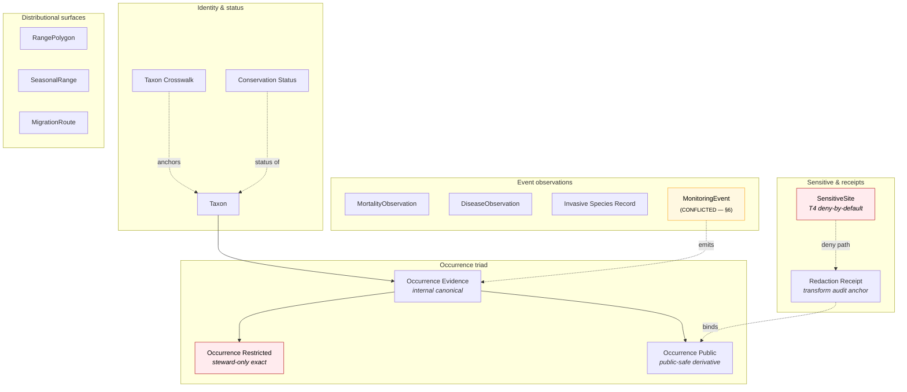

<!-- [KFM_META_BLOCK_V2]
doc_id: kfm://doc/domains/fauna/objects
title: Fauna — Object Families
type: standard
version: v1
status: draft
owners: Fauna Domain Steward (TBD) + Schema Steward (TBD) + Docs Steward (TBD)  # PLACEHOLDER — confirm in CODEOWNERS
created: 2026-06-02
updated: 2026-06-02
policy_label: public
contract_version: "3.0.0"
related:
  - docs/doctrine/directory-rules.md
  - ai-build-operating-contract.md
  - docs/domains/fauna/README.md
  - docs/domains/fauna/IDENTITY_MODEL.md
  - docs/domains/fauna/MAP_UI_CONTRACTS.md
  - docs/domains/fauna/MISSING_OR_PLANNED_FILES.md
  - contracts/domains/fauna/
  - schemas/contracts/v1/domains/fauna/
  - policy/sensitivity/fauna/
tags: [kfm, fauna, object-families, ubiquitous-language, identity, sensitivity, governance]
notes:
  - "CONTRACT_VERSION = 3.0.0 pinned per ai-build-operating-contract.md."
  - "Object-family names, purposes, identity rule, and temporal rule are CONFIRMED from Atlas v1.1 §7.B/§7.C/§7.E; field-level realization is PROPOSED."
  - "Atlas internal inconsistency: §7.B ownership enumerates 14 families and omits MonitoringEvent; §7.C ubiquitous language lists MonitoringEvent as a CONFIRMED term; the cross-domain core-families index lists only 12 (drops Invasive Species Record and Redaction Receipt). Reconciled here as CONFLICTED, see §3 and §6."
  - "All repo paths PROPOSED until verified against a mounted repo."
  - "This file is the OBJECTS reference the Missing-or-Planned register calls OBJECT_FAMILIES.md; filename reconciled to OBJECTS.md — see Changelog."
[/KFM_META_BLOCK_V2] -->

# 🦌 Fauna — Object Families

> **The canonical roster of object families the Fauna domain owns: what each one means, what makes two of them "the same thing," how time is kept distinct, and which ones fail closed by default.**

**Status:** Draft · **Version:** v1 · **Owners:** Fauna Domain Steward + Schema Steward + Docs Steward *(PLACEHOLDER — confirm CODEOWNERS)* · **Updated:** 2026-06-02

---

## Contents

1. [Scope and audience](#1-scope-and-audience)
2. [Doctrinal anchors](#2-doctrinal-anchors)
3. [The family roster at a glance](#3-the-family-roster-at-a-glance)
4. [Family map](#4-family-map)
5. [Sensitivity posture by family](#5-sensitivity-posture-by-family)
6. [Per-family reference](#6-per-family-reference)
7. [What Fauna does NOT own](#7-what-fauna-does-not-own)
8. [Open questions register](#8-open-questions-register)
9. [Open verification backlog](#9-open-verification-backlog)
10. [Changelog](#10-changelog)
11. [Definition of done](#11-definition-of-done)
12. [Related docs](#12-related-docs)

---

## 1. Scope and audience

This document is the **object-family reference** for the Fauna domain (`DOM-FAUNA`). It names every object family the domain owns, gives each a one-line purpose, records the identity rule and the temporal rule that apply uniformly across the roster, and flags the families that carry deny-by-default sensitivity.

It is the *roster* companion to its siblings: `IDENTITY_MODEL.md` explains *how* identity is computed (the four-part basis and the `spec_hash`), `MAP_UI_CONTRACTS.md` explains *how* these families render and resolve at the Map UI seam, and `MISSING_OR_PLANNED_FILES.md` tracks *where* their contracts, schemas, and tests are expected to land. This file answers the prior question both of those assume: *which families exist, and what does each one mean?*

Audience:

- **Contract and schema authors** writing the per-family `.md` under `contracts/domains/fauna/` and `.schema.json` under `schemas/contracts/v1/domains/fauna/` *(PROPOSED paths)*.
- **Pipeline and connector authors** deciding which family a normalized record realizes.
- **Reviewers and stewards** checking that a record's family assignment, sensitivity posture, and source role are defensible.
- **Governed AI** authors — the family is part of what an `EvidenceBundle` cites.

> [!IMPORTANT]
> **Object-family membership is not a label of convenience.** The family a record belongs to determines its identity digest scope, its sensitivity default, its routable surface, and its release gate. A `SensitiveSite` is not an `Occurrence Public` with a flag flipped; an `Occurrence Restricted` is not an `Occurrence Evidence` with a different audience. The distinctions are trust-bearing.

[Back to top ↑](#contents)

---

## 2. Doctrinal anchors

Each anchor below is **CONFIRMED doctrine**; its concrete realization in the repository is **PROPOSED** until verified against a mounted repo.

| Anchor | Source | Effect on this roster |
|---|---|---|
| **Domain one-line purpose** — govern animal taxonomic identity, conservation/legal status, occurrence evidence, monitoring, range, seasonal support, sensitive sites, mortality, disease, invasive species, geoprivacy, public-safe products, and bounded APIs. | Atlas v1.1 §7.A | Defines the scope each family must fit within. |
| **Ownership enumeration** — the families listed in §3. | Atlas v1.1 §7.B | Authoritative roster, with the §B/§C/index inconsistency flagged. |
| **Ubiquitous-language terms** — the same family names, each "constrained by source role, evidence, time, and release state." | Atlas v1.1 §7.C | Each family carries the four governing constraints. |
| **Uniform identity rule** — `source id + object role + temporal scope + normalized digest`. | Atlas v1.1 §7.E | Identical across every row; only the values differ (see `IDENTITY_MODEL.md`). |
| **Uniform temporal rule** — source, observed, valid, retrieval, release, and correction times stay distinct where material. | Atlas v1.1 §7.E | No family may silently collapse the six time facets. |
| **Deny-by-default sensitivity** — exact sensitive occurrences, nests, dens, roosts, hibernacula, spawning sites, and steward-controlled records fail closed. | Atlas v1.1 §7.I; §20.5 Deny register | Sets which families default to T4 (see §5). |
| **Cite-or-abstain** + **`RuntimeResponseEnvelope`** finite outcomes (`ANSWER`/`ABSTAIN`/`DENY`/`ERROR`). | Operating contract §20–§22 | Governs how a family's evidence is answered, abstained, or denied. |

[Back to top ↑](#contents)

---

## 3. The family roster at a glance

The Atlas **§7.B ownership enumeration** names **fourteen** object families. They are CONFIRMED as owned by Fauna.

| # | Object family | One-line purpose (Atlas §7.E) | Default sensitivity |
|---|---|---|---|
| 1 | **Taxon** | Authoritative animal taxonomic identity within Fauna. | public |
| 2 | **Taxon Crosswalk** | Mapping between taxonomic authority anchors (e.g. ITIS ↔ GBIF). | public |
| 3 | **Conservation Status** | Legal / heritage conservation status for a taxon. | public (status), restricted inputs possible |
| 4 | **Occurrence Evidence** | Internal canonical occurrence record (exact geometry). | restricted / internal |
| 5 | **Occurrence Restricted** | Steward-only exact-geometry occurrence derivative. | **T4 deny-by-default** |
| 6 | **Occurrence Public** | Public-safe (generalized / transformed) occurrence derivative. | public (post-transform) |
| 7 | **RangePolygon** | Distributional range polygon for a taxon. | public (generalized) |
| 8 | **SeasonalRange** | Range polygon bound to a season / valid interval. | public (generalized) |
| 9 | **MigrationRoute** | Migration route geometry (lines). | public (generalized) |
| 10 | **SensitiveSite** | Nest / den / roost / hibernaculum / spawning site. | **T4 deny-by-default** |
| 11 | **MortalityObservation** | Recorded animal mortality with attributed cause. | public/restricted by location sensitivity |
| 12 | **DiseaseObservation** | Recorded animal disease / pathogen observation. | public/restricted by location sensitivity |
| 13 | **Invasive Species Record** | EDDMapS-class invasive occurrence with response status. | public |
| 14 | **Redaction Receipt** | Record of a geoprivacy / field-redaction transform. | public (audit anchor) |

> [!CAUTION]
> **Atlas internal inconsistency — `MonitoringEvent` and two index drops.** The roster above follows the Atlas **§7.B ownership enumeration**. Two reconciliations are needed and are flagged as **CONFLICTED** pending an ADR:
> - **`MonitoringEvent`** is a **CONFIRMED ubiquitous-language term** in Atlas §7.C ("MonitoringEvent is used inside this domain…") and the domain one-liner (§7.A) names *monitoring* explicitly — **but it is absent from the §7.B ownership enumeration**. It is therefore listed in §6 as a CONFLICTED 15th candidate family, not in the confirmed roster above.
> - The cross-domain **"Core object families" index** lists only **twelve** Fauna families — it drops **Invasive Species Record** and **Redaction Receipt**, both of which §7.B owns. The index is treated as lineage; §7.B governs.
>
> See OQ-FAUNA-OBJ-01 and the verification backlog.

[Back to top ↑](#contents)

---

## 4. Family map

The diagram groups the roster by the role each family plays in the evidence-and-release flow. It is illustrative of responsibility, not of runtime call order.

[Back to top ↑](#contents)

---

## 5. Sensitivity posture by family

CONFIRMED across Atlas §7.I, §20.5 Deny-by-Default Register, and §24.5.2 tier matrix (tier scheme itself PROPOSED under ADR-S-05). The Fauna deny-by-default rule is the strongest constraint on this roster.

| Family | Default tier (PROPOSED scheme) | Public release allowed only via |
|---|---|---|
| **SensitiveSite** (nest/den/roost/hibernaculum/spawning) | **T4** | Suppression or steward-only access; **no exact public release** by default. |
| **Occurrence Restricted** | **T4** | Never on a public surface; steward routes only. |
| **Occurrence Evidence** (sensitive taxon, exact point) | **T4** | Geoprivacy generalization + `Redaction Receipt` → `Occurrence Public` at T1. |
| **MortalityObservation** / **DiseaseObservation** | T1–T2 | Generalization + steward review where clustering reveals sensitive sites. |
| **RangePolygon** / **SeasonalRange** / **MigrationRoute** | T1 | Aggregate / generalized public-safe layer (+ `Redaction Receipt` if derived from sensitive points). |
| **Occurrence Public** | T1 (public after transform) | The transform that produced it, recorded in a `Redaction Receipt`. |
| **Taxon** / **Taxon Crosswalk** / **Conservation Status** / **Invasive Species Record** | T0–T1 | Standard release; but watch **join-induced sensitivity** (below). |
| **Redaction Receipt** | public (audit anchor) | Itself releasable; it documents the transform that protected the input. |

> [!WARNING]
> **Join-induced sensitivity.** A `Taxon` or `RangePolygon` that is public-safe in isolation can become sensitive when joined to fine-grained `Occurrence Public`, `Habitat`, or `Hydrology` (spawning streams) such that the source points become reconstructable. Sensitivity is a property of the **join product**, not only of the inputs. Cross-lane join policy is ADR-class (ADR-S-14).

> [!CAUTION]
> This document names sensitive *families* and *site types* (nest, den, roost, hibernaculum, spawning). It contains **no exact coordinates, no taxon-specific sensitive-site lists, and no restricted-source-derived fields**. Those live behind the steward surface and `policy/sensitivity/fauna/` *(PROPOSED)*. Per operating contract §23.2, exact exposure of any of these requires steward review, a geoprivacy transform, and a `Redaction Receipt`.

[Back to top ↑](#contents)

---

## 6. Per-family reference

Each entry records the **purpose** (CONFIRMED, Atlas §7.E), the **identity-determining inputs** the normalized digest should canonicalize (PROPOSED — most likely to iterate as schemas land), and **notes**. The four-part identity basis and the six-facet temporal rule apply uniformly and are not repeated per row; see `IDENTITY_MODEL.md`.

<b>Identity &amp; status families</b>

### 6.1 Taxon

- **Purpose** *(CONFIRMED)* — represents an authoritative animal taxonomic identity within Fauna.
- **Identity-determining inputs** *(PROPOSED)* — source ref · ITIS TSN (where covered) · GBIF Backbone DOI version · accepted scientific name · rank · authorship · temporal scope of the authority assertion.
- **Notes** — anchor-based, never identified by name alone. ITIS TSN is the required U.S.-canonical anchor where ITIS has coverage; GBIF Backbone (DOI `10.15468/39omei`) is the second-line / international anchor.

### 6.2 Taxon Crosswalk

- **Purpose** *(CONFIRMED)* — represents a mapping between taxonomic authority anchors within Fauna.
- **Identity-determining inputs** *(PROPOSED)* — source ref · the pair of anchored IRIs (e.g. ITIS TSN ↔ GBIF taxonKey, USDA symbol) · mapping confidence · retrieval time of the upstream pair.
- **Notes** — a separate family because *the mapping is itself a claim* with its own evidence, retrieval, staleness, and correction path. When a Backbone version reassigns a synonym, the crosswalk identity rotates while the underlying `Taxon` identity does not.

### 6.3 Conservation Status

- **Purpose** *(CONFIRMED)* — represents the conservation / legal status of a taxon.
- **Identity-determining inputs** *(PROPOSED)* — source ref (USFWS / NatureServe / IUCN / KDWP) · `Taxon` anchor · status code · status scope (federal / state / global / subnational) · effective interval (valid time).
- **Notes** — a status change emits a *new* identity, not an in-place update. NatureServe S1/S2 rankings feed the sensitivity tier mapping *(PROPOSED, ADR-S-05)*.

<b>The occurrence triad</b>

### 6.4 Occurrence Evidence

- **Purpose** *(CONFIRMED)* — the internal canonical occurrence record.
- **Identity-determining inputs** *(PROPOSED)* — source ref · `Taxon` anchor · exact geometry · observation method · observed time · evidence quality · rights · sensitivity class.
- **Notes** — exact geometry; routable on internal review surfaces only. Sensitive-taxon Evidence defaults to T4 (§5).

### 6.5 Occurrence Restricted

- **Purpose** *(CONFIRMED)* — a steward-only derivative that preserves exact geometry under restricted access.
- **Identity-determining inputs** *(PROPOSED)* — same as Evidence + restricted access class + steward review state.
- **Notes** — **T4 deny-by-default.** Never routable on a public surface. Whether it is a physically separate object or a `(spec_hash, access_class)`-keyed view of Evidence is an open schema question (OQ-FAUNA-OBJ-04).

### 6.6 Occurrence Public

- **Purpose** *(CONFIRMED)* — the public-safe occurrence derivative.
- **Identity-determining inputs** *(PROPOSED)* — `Taxon` anchor · **transformed** geometry · `Redaction Receipt` ref · generalization rule id · release time.
- **Notes** — a *distinct trust object* with its own identity and bundle, not a flag on Evidence. Its digest differs from Evidence/Restricted because the payload differs — that difference is the machine-checkable membrane boundary.

<b>Distributional surfaces</b>

### 6.7 RangePolygon

- **Purpose** *(CONFIRMED)* — a distributional range polygon for a taxon.
- **Identity-determining inputs** *(PROPOSED)* — source ref · `Taxon` anchor · polygon geometry · methodology (modeled / observed / authoritative) · valid time.
- **Notes** — methodology is identity-bearing so a modeled range and an observed range do not collide. A range is a **derivative product, not an observed presence** — `knowledge_character` must distinguish them.

### 6.8 SeasonalRange

- **Purpose** *(CONFIRMED)* — a range polygon bound to a season / valid interval.
- **Identity-determining inputs** *(PROPOSED)* — source ref · `Taxon` anchor · season descriptor · polygon geometry · valid time interval.
- **Notes** — one identity per season per valid interval; breeding-season-2024 is not breeding-season-2025.

### 6.9 MigrationRoute

- **Purpose** *(CONFIRMED)* — migration route geometry.
- **Identity-determining inputs** *(PROPOSED)* — source ref · `Taxon` anchor · route geometry · temporal pattern · methodology.
- **Notes** — lines, not polygons; methodology distinguishes telemetry-derived from literature-derived routes. A sequence of generalized points can reconstruct a route below the generalization scale — aggregate temporally before publishing (§5 join risk).

<b>Event observations</b>

### 6.10 MortalityObservation

- **Purpose** *(CONFIRMED)* — a recorded animal mortality with attributed cause.
- **Identity-determining inputs** *(PROPOSED)* — source ref · `Taxon` anchor · cause class · observed time · location (subject to sensitivity rules).
- **Notes** — cause class is identity-bearing: two records of the same death by different attributed causes are different claims. References hazard events without merging identities (Fauna ↔ Hazards join).

### 6.11 DiseaseObservation

- **Purpose** *(CONFIRMED)* — a recorded animal disease / pathogen observation.
- **Identity-determining inputs** *(PROPOSED)* — source ref · `Taxon` anchor · pathogen anchor (where applicable) · observed time · diagnostic basis.
- **Notes** — pathogen anchor preserves identity across taxon hosts.

### 6.12 Invasive Species Record

- **Purpose** *(CONFIRMED)* — an invasive-species occurrence with response status (EDDMapS-class).
- **Identity-determining inputs** *(PROPOSED)* — source ref · `Taxon` anchor · location class · observed time · response status.
- **Notes** — response status is identity-bearing. *(Owned per §7.B; dropped from the cross-domain index — index is lineage.)*

### 6.13 MonitoringEvent *(CONFLICTED)*

- **Purpose** *(CONFLICTED)* — a monitoring event (survey / transect / route / eDNA / acoustic / telemetry) that may emit many occurrences.
- **Identity-determining inputs** *(PROPOSED)* — source ref · monitoring program id · station / transect / route id · observed time · methodology.
- **Notes** — **CONFLICTED.** A CONFIRMED ubiquitous-language term (Atlas §7.C) and named in the domain one-liner (§7.A), but **absent from the §7.B ownership enumeration**. Distinct from `Occurrence Evidence` (one event may emit many occurrences). Admit to ownership, or assign to a neighboring lane, via ADR (OQ-FAUNA-OBJ-01). Do not treat as a confirmed owned family until resolved.

<b>Sensitive sites &amp; receipts</b>

### 6.14 SensitiveSite

- **Purpose** *(CONFIRMED)* — a sensitive site: nest / den / roost / hibernaculum / spawning site.
- **Identity-determining inputs** *(PROPOSED)* — source ref · `Taxon` anchor · site type (nest / den / roost / hibernaculum / spawning) · exact geometry · sensitivity class · steward record.
- **Notes** — **T4 deny-by-default identity disclosure.** "Nest / den / roost / hibernaculum / spawning" are `site_type` discriminators, not separate families (a constructed name like `NestDenRoostSpawningSite` is not an Atlas family). Even confirming a site *exists* in a watershed can be a disclosure.

### 6.15 Redaction Receipt

- **Purpose** *(CONFIRMED)* — a record of a geoprivacy / field-redaction transform.
- **Identity-determining inputs** *(PROPOSED)* — input object identity · output object identity · transform rule id · policy ref · reviewer · reason · residual risk class.
- **Notes** — binds `Occurrence Evidence` → `Occurrence Public` (and analogous pairs); its own identity is the audit anchor. The receipt is itself releasable. *(Owned per §7.B; dropped from the cross-domain index — index is lineage.)*

[Back to top ↑](#contents)

---

## 7. What Fauna does NOT own

CONFIRMED non-ownership boundary (Atlas §7.B). A join references these identities; it never absorbs or renames them.

| Concept | Owning lane | Fauna's relationship |
|---|---|---|
| Habitat patches and suitability | **Habitat** | Fauna references `HabitatPatch`; Habitat owns habitat assignment identity. |
| Plant records | **Flora** | Pollinator-host edges carry their own relation identity; Flora owns plant identities. |
| Reaches / waterbodies (incl. spawning streams) | **Hydrology** | Spawning-site joins inherit Fauna's deny-by-default posture. |
| Hazard / disaster events | **Hazards** | `MortalityObservation` / `DiseaseObservation` reference hazard events. |
| Soil, agriculture, roads, settlements, people | respective lanes | Context only, through governed joins. |

> [!IMPORTANT]
> **A join is not a remapping.** When Habitat asks "what taxa occur in this patch?", the answer carries Fauna `Taxon` identifiers verbatim. No neighboring lane may mint a "habitat-scoped taxon id" — that creates a parallel identity space and breaks the lane boundary (Directory Rules §13 anti-patterns).

[Back to top ↑](#contents)

---

## 8. Open questions register

| ID | Question | Owner role | Resolution path |
|---|---|---|---|
| OQ-FAUNA-OBJ-01 | Is **`MonitoringEvent`** a Fauna-owned family? It is a CONFIRMED §7.C term but absent from the §7.B ownership list. | Fauna steward + Schema steward | Ownership ADR; reconcile §7.B / §7.C / cross-domain index; update `object_family_register.yaml`. |
| OQ-FAUNA-OBJ-02 | Reconcile the cross-domain core-families index (12 families, drops Invasive Species Record + Redaction Receipt) against §7.B (14). | Docs steward | Errata / atlas-supplement entry; §7.B governs. |
| OQ-FAUNA-OBJ-03 | Concrete `site_type` enum for `SensitiveSite` (nest / den / roost / hibernaculum / spawning / …). | Schema steward | Schema enum under `schemas/contracts/v1/domains/fauna/`. |
| OQ-FAUNA-OBJ-04 | Is `Occurrence Restricted` a physically separate object or a `(spec_hash, access_class)`-keyed view of `Occurrence Evidence`? | Schema steward | Schema + restricted/public split tests (`DOM-FAUNA §K`). |
| OQ-FAUNA-OBJ-05 | Required vs optional anchors for `Conservation Status` inputs (USFWS / NatureServe / IUCN / KDWP). | Fauna steward | `data/registry/sources/fauna/` entries + rights review. |
| OQ-FAUNA-OBJ-06 | Sensitivity tier scheme (T0–T4) ratification. | Steward + release authority | ADR-S-05. |
| OQ-FAUNA-OBJ-07 | Whether `AbundanceIndicator` / `RichnessIndicator` (Encyclopedia §7.5.C viewing products) become owned families or stay derivative-only. | Schema steward | Object-family ADR. |

[Back to top ↑](#contents)

---

## 9. Open verification backlog

These items remain `NEEDS VERIFICATION` before promotion from `draft` to `published`:

1. `MonitoringEvent` ownership resolved against a mounted repo's `contracts/domains/fauna/` + `object_family_register.yaml` (OQ-FAUNA-OBJ-01).
2. Per-family contract `.md` and schema `.json` presence under the PROPOSED homes (`contracts/domains/fauna/`, `schemas/contracts/v1/domains/fauna/`).
3. `site_type` enum for `SensitiveSite` confirmed in schema (OQ-FAUNA-OBJ-03).
4. Restricted-vs-Evidence object/view decision confirmed (OQ-FAUNA-OBJ-04).
5. Sensitivity tier values per family confirmed against `policy/sensitivity/fauna/` once ADR-S-05 lands.
6. Cross-domain index errata filed for the 12-vs-14 family discrepancy (OQ-FAUNA-OBJ-02).

[Back to top ↑](#contents)

---

## 10. Changelog

| Change | Type (per contract §37) | Reason |
|---|---|---|
| New document created at `docs/domains/fauna/OBJECTS.md`. | new | Per-family roster reference for the Fauna lane. |
| Reconciled the `MISSING_OR_PLANNED_FILES.md` reference name `OBJECT_FAMILIES.md` to the requested filename `OBJECTS.md`. | reconciliation | User-specified filename; both names denote this roster. Log alias in `DRIFT_REGISTER.md`. |
| Recorded `MonitoringEvent` as CONFLICTED (CONFIRMED §7.C term; absent from §7.B ownership list) rather than as a plain owned family. | clarification | Faithful to the Atlas §7.B/§7.C inconsistency. |
| Recorded the cross-domain core-families index drop of Invasive Species Record + Redaction Receipt as lineage; §7.B governs. | clarification | §7.B is the ownership authority; the index is a summary. |
| Pinned `CONTRACT_VERSION = "3.0.0"`. | housekeeping | Doctrine-adjacent doc requirement. |
| Double-quoted Mermaid labels containing `(`, `)`, `<`, `>`, `&`. | housekeeping | Mermaid parse safety. |

> **Backward compatibility.** First version; no prior anchors. The `MISSING_OR_PLANNED_FILES.md` row that names `OBJECT_FAMILIES.md` should be updated to point here, or a `DRIFT_REGISTER.md` alias entry added, so the two filenames do not diverge.

[Back to top ↑](#contents)

---

## 11. Definition of done

This document is done enough to enter the repository when:

- it is placed at `docs/domains/fauna/OBJECTS.md` per Directory Rules §6.1 (CONFIRMED subpath);
- the Fauna domain steward, schema steward, and docs steward review it;
- it is linked from `docs/domains/fauna/README.md` and cross-linked with `IDENTITY_MODEL.md`, `MAP_UI_CONTRACTS.md`, and `MISSING_OR_PLANNED_FILES.md`;
- the `MonitoringEvent` ownership conflict (OQ-FAUNA-OBJ-01) and the filename alias are logged in `docs/registers/DRIFT_REGISTER.md`;
- it does not conflict with accepted ADRs (notably ADR-0001 schema home, ADR-S-05 tier scheme);
- the `GENERATED_RECEIPT.json` planned in Section 2 is wired into CI;
- future changes follow the operating contract's §37 lifecycle.

[Back to top ↑](#contents)

---

## 12. Related docs

> All paths below are **PROPOSED** per Directory Rules §2.5 except where marked CONFIRMED.

- [`docs/domains/fauna/README.md`](./README.md) — Fauna domain dossier. *(PROPOSED — NEEDS VERIFICATION)*
- [`docs/domains/fauna/IDENTITY_MODEL.md`](./IDENTITY_MODEL.md) — how identity is computed (four-part basis, occurrence triad, `spec_hash`). *(PROPOSED — companion)*
- [`docs/domains/fauna/MAP_UI_CONTRACTS.md`](./MAP_UI_CONTRACTS.md) — how these families render and resolve at the Map UI seam. *(PROPOSED — companion)*
- [`docs/domains/fauna/MISSING_OR_PLANNED_FILES.md`](./MISSING_OR_PLANNED_FILES.md) — where each family's contract / schema / test is expected to land. *(PROPOSED — companion)*
- [`docs/doctrine/directory-rules.md`](../../doctrine/directory-rules.md) — placement law. *(CONFIRMED)*
- [`ai-build-operating-contract.md`](../../../ai-build-operating-contract.md) — operating contract, `CONTRACT_VERSION = "3.0.0"`. *(CONFIRMED)*
- `contracts/domains/fauna/` — per-family semantic specs. *(PROPOSED)*
- `schemas/contracts/v1/domains/fauna/` — per-family JSON Schema. *(PROPOSED)*
- `policy/sensitivity/fauna/` — sensitivity classes and geoprivacy transform rules. *(PROPOSED)*

---

**Last updated:** 2026-06-02 · **Version:** v1 · **Status:** Draft · **CONTRACT_VERSION:** `3.0.0` · **Owners:** *PLACEHOLDER — confirm CODEOWNERS* · [Back to top ↑](#contents)
