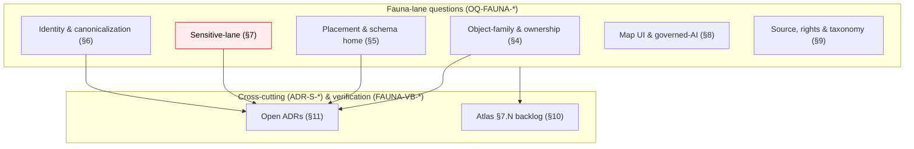

<!-- [KFM_META_BLOCK_V2]
doc_id: kfm://doc/domains/fauna/open-questions
title: Fauna — Open Questions Register
type: standard
version: v1
status: draft
owners: Fauna Domain Steward (TBD) + Schema Steward (TBD) + Docs Steward (TBD)  # PLACEHOLDER — confirm in CODEOWNERS
created: 2026-06-02
updated: 2026-06-02
policy_label: public
contract_version: "3.0.0"
related:
  - docs/doctrine/directory-rules.md
  - ai-build-operating-contract.md
  - docs/domains/fauna/README.md
  - docs/domains/fauna/IDENTITY_MODEL.md
  - docs/domains/fauna/MAP_UI_CONTRACTS.md
  - docs/domains/fauna/OBJECT_FAMILIES.md
  - docs/domains/fauna/MISSING_OR_PLANNED_FILES.md
  - docs/registers/DRIFT_REGISTER.md
  - docs/registers/VERIFICATION_BACKLOG.md
  - control_plane/verification_backlog.yaml
tags: [kfm, fauna, open-questions, register, adr, governance, drift]
notes:
  - "CONTRACT_VERSION = 3.0.0 pinned per ai-build-operating-contract.md."
  - "Consolidates the open items from the Atlas v1.1 §7.N Fauna backlog and from the Fauna companion docs (IDENTITY_MODEL, MAP_UI_CONTRACTS, OBJECT_FAMILIES, MISSING_OR_PLANNED_FILES)."
  - "This register is a navigation surface, not an authority. Resolutions land in ADRs, schemas, policy, and the DRIFT_REGISTER — not here."
  - "All repo paths PROPOSED until verified against a mounted repo."
[/KFM_META_BLOCK_V2] -->

# 🦌 Fauna — Open Questions Register

> **The single place to find every unresolved decision, conflict, and verification gap in the Fauna lane — what it blocks, who owns it, and where its resolution lives.**

**Status:** Draft · **Version:** v1 · **Owners:** Fauna Domain Steward + Schema Steward + Docs Steward *(PLACEHOLDER — confirm CODEOWNERS)* · **Updated:** 2026-06-02

---

## Contents

1. [Purpose and scope](#1-purpose-and-scope)
2. [How this register works](#2-how-this-register-works)
3. [Open questions at a glance](#3-open-questions-at-a-glance)
4. [Object-family & ownership questions](#4-object-family--ownership-questions)
5. [Placement & schema-home questions](#5-placement--schema-home-questions)
6. [Identity & canonicalization questions](#6-identity--canonicalization-questions)
7. [Sensitive-lane questions](#7-sensitive-lane-questions)
8. [Map UI & governed-AI questions](#8-map-ui--governed-ai-questions)
9. [Source, rights & taxonomy questions](#9-source-rights--taxonomy-questions)
10. [Atlas §7.N verification backlog (lane-native)](#10-atlas-7n-verification-backlog-lane-native)
11. [Open ADRs that gate the Fauna lane](#11-open-adrs-that-gate-the-fauna-lane)
12. [Changelog](#12-changelog)
13. [Definition of done](#13-definition-of-done)
14. [Related docs](#14-related-docs)

---

## 1. Purpose and scope

This register **aggregates** every unresolved question in the Fauna lane (`DOM-FAUNA`) into one navigable surface. It pulls together:

- the **Atlas v1.1 §7.N** Fauna verification backlog (four lane-native items), and
- the open questions scattered across the Fauna **companion docs** — `IDENTITY_MODEL.md`, `MAP_UI_CONTRACTS.md`, `OBJECT_FAMILIES.md` (a.k.a. `OBJECTS.md`), and `MISSING_OR_PLANNED_FILES.md` — and
- the **cross-cutting ADR-S backlog** items that materially gate Fauna files.

It exists so a reviewer or steward can answer "what's still undecided here, and what does it block?" without reading five documents. It does **not** decide anything.

> [!IMPORTANT]
> **This register is a navigation surface, not an authority.** A question's *resolution* lives in an ADR, a schema, a policy bundle, or a `docs/registers/DRIFT_REGISTER.md` entry — never in this file. When a question resolves, strike its row here and point to where the decision now lives. (Documentation-as-truth anti-pattern: `docs/` explains and navigates; canonical decisions live in `contracts/`, `schemas/`, `policy/`, ADRs, and `control_plane/`.)

[Back to top ↑](#contents)

---

## 2. How this register works

### 2.1 ID scheme

Each row carries a stable ID:

- `OQ-FAUNA-NN` — a Fauna-lane open question owned and resolved within the lane.
- `ADR-S-NN` — a cross-cutting architectural decision (from the Atlas Master Open-ADR Backlog) that the Fauna lane *inherits*; resolution is system-wide, not Fauna-local.
- `FAUNA-VB-NN` — a verification item lifted from the Atlas §7.N Fauna backlog; settled by mounted-repo evidence, not by a decision.

### 2.2 Status vocabulary

| Status | Meaning |
|---|---|
| **OPEN** | Unresolved; no decision recorded. |
| **CONFLICTED** | Two doctrine sources disagree; needs an ADR or drift entry to reconcile. |
| **NEEDS VERIFICATION** | Checkable against a mounted repo / test / manifest; not yet checked. |
| **BLOCKED** | Cannot resolve until a named upstream item resolves first. |
| **RESOLVED** | Decision recorded elsewhere; row retained with a forward link until cleanup. |

> [!NOTE]
> Per `<repository_preflight>`, no repo-state claim in this register is CONFIRMED for this session. Items that depend on inspecting a mounted repo are **NEEDS VERIFICATION** regardless of how confident the underlying doctrine is.

[Back to top ↑](#contents)

---

## 3. Open questions at a glance

**Highest-leverage open items** (resolving these unblocks the most downstream work):

| ID | One-line | Blocks |
|---|---|---|
| `ADR-S-05` | Ratify the T0–T4 sensitivity tier scheme. | Every deny-default policy row; `SENSITIVITY_POSTURE.md`; tier mapping. |
| `ADR-0001` | Confirm `schemas/contracts/v1/...` as the canonical schema home. | All Fauna schemas; resolves `contracts/`-vs-`schemas/` drift. |
| `OQ-FAUNA-01` | Is `MonitoringEvent` a Fauna-owned family? | Fauna object roster; contracts; schemas; `object_family_register.yaml`. |
| `OQ-FAUNA-04` | `OBJECT_FAMILIES.md` vs `OBJECTS.md` — which is canonical? | Two live copies of the family roster. |

[Back to top ↑](#contents)

---

## 4. Object-family & ownership questions

| ID | Question | Status | Owner role | Resolution path |
|---|---|---|---|---|
| OQ-FAUNA-01 | Is **`MonitoringEvent`** a Fauna-owned family? It is a CONFIRMED ubiquitous-language term (Atlas §7.C) and named in the domain one-liner (§7.A), but **absent from the §7.B ownership enumeration**. | **CONFLICTED** | Fauna steward + Schema steward | Ownership ADR; reconcile §7.B / §7.C / cross-domain index; update `object_family_register.yaml`. |
| OQ-FAUNA-02 | Reconcile the cross-domain **"Core object families" index** (lists 12 Fauna families; drops Invasive Species Record + Redaction Receipt) against §7.B (14). | **CONFLICTED** | Docs steward | Atlas errata / supplement; §7.B governs. |
| OQ-FAUNA-03 | Do **`AbundanceIndicator` / `RichnessIndicator`** (Encyclopedia §7.5.C viewing products) become owned families or stay derivative-only? | **OPEN** | Schema steward | Object-family ADR. |
| OQ-FAUNA-04 | **Filename duplication:** `OBJECT_FAMILIES.md` vs `OBJECTS.md` cover the same roster — which is canonical? | **CONFLICTED** | Docs steward | `DRIFT_REGISTER.md` entry; one file becomes a redirect stub. |
| OQ-FAUNA-05 | Is **`Occurrence Restricted`** a physically separate object or a `(spec_hash, access_class)`-keyed view of `Occurrence Evidence`? | **NEEDS VERIFICATION** | Schema steward | Schema under `schemas/contracts/v1/domains/fauna/`; restricted/public split tests (§7.K). |

[Back to top ↑](#contents)

---

## 5. Placement & schema-home questions

| ID | Question | Status | Owner role | Resolution path |
|---|---|---|---|---|
| OQ-FAUNA-06 | **Atlas §24.13 vs Directory Rules §6.3/§6.4 `domains/`-segment divergence.** Atlas writes the lane home as `contracts/fauna/` and `schemas/contracts/v1/fauna/` (no segment); Directory Rules keep `contracts/domains/fauna/` and `schemas/contracts/v1/domains/fauna/`. | **CONFLICTED** | Docs steward + Schema steward | Directory Rules wins (§2.1); log Atlas crosswalk as lineage in `DRIFT_REGISTER.md`. |
| ADR-0001 | Confirm `schemas/contracts/v1/...` as the canonical schema home (or amend). | **OPEN (cross-cutting)** | Schema steward | ADR-0001 confirmation; resolves any `contracts/.../*.schema.json` drift. |
| ADR-S-03 | Receipt class home: `schemas/contracts/v1/receipts/` vs `schemas/contracts/v1/<domain>/receipts/`. | **OPEN (cross-cutting)** | Schema steward | ADR-S-03; determines whether `schemas/contracts/v1/domains/fauna/receipts/` exists. |
| OQ-FAUNA-07 | **Runbook subfolder convention** — `docs/runbooks/fauna/...` (Pattern A) vs flat `docs/runbooks/fauna_*.md` (Pattern B). | **OPEN** | Docs steward | Directory Rules §6.1 OPEN-DR-02 ADR. |
| OQ-FAUNA-08 | Is **`docs/sources/`** a canonical home for per-source docs, or does source identity live only in `data/registry/sources/` + `connectors/<source>/`? | **NEEDS VERIFICATION** | Docs steward | Mounted-repo convention + Directory Rules §6.1 check. |
| OQ-FAUNA-09 | **`policy/sensitivity/fauna/` vs `policy/domains/fauna/`** split — which rules live where? | **NEEDS VERIFICATION** | Policy steward | Directory Rules §6.5 + Atlas §24.13 crosswalk against mounted `policy/` tree. |

[Back to top ↑](#contents)

---

## 6. Identity & canonicalization questions

| ID | Question | Status | Owner role | Resolution path |
|---|---|---|---|---|
| OQ-FAUNA-10 | Concrete deterministic **ID format string** for Fauna objects (the `kfm:fauna:<role>:<source>:<scope>:<digest26>` form is illustrative). | **OPEN** | Schema steward | ADR pinning the format; `schemas/contracts/v1/domains/fauna/` entries. |
| OQ-FAUNA-11 | Decision between **JCS and URDNA2015** for graph-shaped Fauna bundles (`C8-05`: JCS default, URDNA2015 reserved for RDF-semantic equivalence). | **NEEDS VERIFICATION** | Schema steward | ADR; reference verifier in CI; `docs/standards/CANONICALIZATION.md`. |
| OQ-FAUNA-12 | **Hash-policy pin** — SHA-256 for descriptor identity vs BLAKE3 for streaming artifact roots vs dual-hash compatibility window. | **OPEN** | Schema steward | Hash-policy ADR. |
| OQ-FAUNA-13 | Concrete **`temporal_scope` value vocabulary** (`observed`, `valid`, `release`, `snapshot`, …). | **OPEN** | Schema steward | Contract under `contracts/domains/fauna/`; schema enum. |
| OQ-FAUNA-14 | Single **repo-wide identity validator** vs per-domain validators for the four-part basis. | **NEEDS VERIFICATION** | Schema steward | `tools/validators/identity/...` presence; ADR. |
| OQ-FAUNA-15 | **Validator exit-code contract** for `IdentityError.*` / `PolicyError.*` codes used in the identity-model failure table. | **OPEN** | Schema steward | ADR; conftest fixtures. |

[Back to top ↑](#contents)

---

## 7. Sensitive-lane questions

> [!CAUTION]
> This section names sensitive **families** and **site types** (nest, den, roost, hibernaculum, spawning). It contains **no exact coordinates, no taxon-specific sensitive-site lists, and no restricted-source fields**. Per operating contract §23.2 and Atlas §20.5, exact exposure requires steward review, a geoprivacy transform, and a `RedactionReceipt`.

| ID | Question | Status | Owner role | Resolution path |
|---|---|---|---|---|
| ADR-S-05 | Ratify the **T0–T4 sensitivity tier scheme** (adopt as canonical or revise). | **OPEN (cross-cutting)** | Steward + release authority | ADR-S-05; Atlas §24.5 reconciliation. Blocks every deny-default policy row. |
| OQ-FAUNA-16 | Concrete **geoprivacy transform rule set** (suppress / generalize-to-grid / generalize-to-watershed / generalize-to-county / buffer / constrained-jitter / delayed-publication / steward-only-exact) and per-class defaults. | **OPEN** | Policy steward | `policy/sensitivity/fauna/` rules + `RedactionReceipt` schema. |
| OQ-FAUNA-17 | Concrete **`site_type` enum** for `SensitiveSite` (nest / den / roost / hibernaculum / spawning / …). | **OPEN** | Schema steward | Schema enum under `schemas/contracts/v1/domains/fauna/`. |
| OQ-FAUNA-18 | **NatureServe S1/S2 → tier mapping** and the curated sensitive-taxa list (steward-maintained, not public). | **NEEDS VERIFICATION** | Fauna steward + Policy steward | `policy/sensitivity/fauna/tier_mapping.yaml`; gated on ADR-S-05. |
| ADR-S-14 | **Cross-lane join policy** — which Fauna ↔ Habitat / Hydrology joins require steward review, which are denied (join-induced sensitivity). | **OPEN (cross-cutting)** | Steward | ADR-S-14. |
| FAUNA-VB-SENS | Sensitive-site **geoprivacy transform with `RedactionReceipt`** proven end-to-end on a non-public fixture. | **NEEDS VERIFICATION** | Fauna steward | Non-public sensitive fixture + transform pipeline + signed `RedactionReceipt`. |

[Back to top ↑](#contents)

---

## 8. Map UI & governed-AI questions

| ID | Question | Status | Owner role | Resolution path |
|---|---|---|---|---|
| OQ-FAUNA-19 | Confirm canonical **schema homes** for `LayerManifest`, `EvidenceDrawerPayload`, `MapContextEnvelope`, `FocusModeResponse`, `AIReceipt` (PROPOSED `map/`, `ui/`, `ai/` per MapLibre Master v2.1 §11). | **NEEDS VERIFICATION** | Schema steward | ADR-0001 + mounted schema files. |
| OQ-FAUNA-20 | Confirm `apps/governed-api/` **route names** (`/claims/resolve`, `/evidence/{id}`, `/layers/...`, `/focus`, `/exports`). | **NEEDS VERIFICATION** | Governed-API steward | Mounted route source or OpenAPI artifact. |
| OQ-FAUNA-21 | Retire the bespoke **`FaunaDecisionEnvelope`** in favor of `RuntimeResponseEnvelope` (+ `EvidenceDrawerPayload` for click, `FocusModeResponse` + `AIReceipt` for Focus Mode) across Fauna policy and schema surfaces. | **CONFLICTED** | Schema steward | Reconcile Atlas §7.J table to operating contract §21; `api_envelope.rego` → `runtime_envelope.rego`. |
| OQ-FAUNA-22 | Reconcile **UI negative-state names** to the operating contract §22.2 canonical vocabulary (`MISSING_EVIDENCE`, `SOURCE_STALE`, `DENIED_BY_POLICY`, `GENERALIZED_GEOMETRY`, `RESTRICTED_ACCESS`, `CONFLICTED_SUPPORT`, `CITATION_FAILED`, `RELEASE_WITHDRAWN`, `RUNTIME_ERROR`). | **CONFLICTED** | UI steward | Map drawer/badge state names to §22.2; update fixtures. |
| ADR-S-06 | **AI surface boundary** — Focus Mode vs open AI access (always denied? bounded? steward-only?). | **OPEN (cross-cutting)** | Steward | ADR-S-06. |
| FAUNA-VB-AI | **AI no-leak** behavior proven: Focus Mode never leaks sensitive exact locations for fauna. | **NEEDS VERIFICATION** | Fauna steward | Tile field allowlist tests + Focus Mode citation validation + redaction-receipt audit (Atlas §7.N item 4). |

[Back to top ↑](#contents)

---

## 9. Source, rights & taxonomy questions

| ID | Question | Status | Owner role | Resolution path |
|---|---|---|---|---|
| OQ-FAUNA-23 | **ITIS vs GBIF tie-breaker** when accepted names disagree (`C7-07` default — ITIS for federal reconciliation, GBIF for international queries — is *not yet codified in the policy bundle*). | **OPEN** | Fauna steward + Policy steward | Policy doc under `policy/domains/fauna/`; `C7-07` follow-up. |
| OQ-FAUNA-24 | **eBird EBD restricted-use terms** enforcement before any derivative release. | **NEEDS VERIFICATION** | Policy steward | `policy/rights/fauna/ebd_terms.yaml` + passing policy test. |
| OQ-FAUNA-25 | **Required vs optional anchors** for `Conservation Status` (USFWS / NatureServe / IUCN / KDWP) and for `Taxon` (NatureServe Element / IUCN Red List / USDA symbol). | **NEEDS VERIFICATION** | Fauna steward | `data/registry/sources/fauna/` entries; rights review. |
| ADR-S-04 | **Source-role enum** — canonical vocabulary and evolution rule (authority / observation / aggregator / model / context). | **OPEN (cross-cutting)** | Schema steward | ADR-S-04. |
| ADR-S-12 | **Connector cadence and quarantine recovery** policy for fauna sources. | **OPEN (cross-cutting)** | Source steward | ADR-S-12; `SOURCE_REFRESH_RUNBOOK.md` parameter set. |

[Back to top ↑](#contents)

---

## 10. Atlas §7.N verification backlog (lane-native)

These four items are lifted **verbatim** from the Atlas v1.1 Fauna §7.N "Verification backlog and open questions." Each is settled by mounted-repo evidence (files, schemas, registry entries, tests, logs, emitted artifacts, review records, or release manifests), not by a decision.

| ID | Item to verify (Atlas §7.N) | Status |
|---|---|---|
| FAUNA-VB-01 | Verify fauna **source rights and steward roles**. | **NEEDS VERIFICATION** |
| FAUNA-VB-02 | Verify **taxonomy resolution implementation**. | **NEEDS VERIFICATION** |
| FAUNA-VB-03 | Verify **restricted/public occurrence split**. | **NEEDS VERIFICATION** |
| FAUNA-VB-04 | Verify **public layer safety and AI no-leak behavior**. | **NEEDS VERIFICATION** |

> [!NOTE]
> These four map onto finer-grained rows elsewhere in this register: VB-01 → §9 (OQ-FAUNA-24/25, ADR-S-04/12); VB-02 → §9 (OQ-FAUNA-23) + §6 (OQ-FAUNA-14); VB-03 → §4 (OQ-FAUNA-05) + §7 (OQ-FAUNA-16/17); VB-04 → §8 (FAUNA-VB-AI). They are kept here in their original lane-native form so the Atlas anchor is preserved exactly.

[Back to top ↑](#contents)

---

## 11. Open ADRs that gate the Fauna lane

Cross-cutting decisions (Atlas Master Open-ADR Backlog §24.12) that the Fauna lane inherits. Resolution is system-wide; the Fauna lane cannot ratify these alone.

<b>Expand: ADR-S backlog items touching Fauna</b>

| ADR | Question | What it gates in Fauna |
|---|---|---|
| ADR-0001 | Canonical schema home (`schemas/contracts/v1/...`). | All Fauna schemas. |
| ADR-S-03 | Receipt class home. | Whether `.../domains/fauna/receipts/` exists. |
| ADR-S-04 | Source-role enum. | Source-role-asserting Fauna schemas; `source_terms.yaml`. |
| ADR-S-05 | Sensitivity tier scheme (T0–T4). | Every deny-default policy row; `SENSITIVITY_POSTURE.md`. |
| ADR-S-06 | AI surface boundary. | Fauna Focus Mode access scope. |
| ADR-S-10 | Stale-state propagation across lanes. | Fauna ↔ Habitat ↔ Hydrology staleness. |
| ADR-S-12 | Connector cadence + quarantine recovery. | `SOURCE_REFRESH_RUNBOOK.md` parameters. |
| ADR-S-14 | Cross-lane join policy. | `CROSS_LANE_RELATIONS.md`; join-induced sensitivity. |
| ADR — `MonitoringEvent` ownership *(not yet numbered)* | Is `MonitoringEvent` Fauna-owned? | Fauna roster (OQ-FAUNA-01). |
| ADR — `PROV.md` vs `PROVENANCE.md` (OPEN-DR-01) | Standards-doc filename. | Fauna standards cross-references. |
| ADR — runbook subfolders (OPEN-DR-02) | `docs/runbooks/<domain>/` vs flat. | All Fauna runbooks (OQ-FAUNA-07). |
| ADR — validator exit-code contract *(not yet numbered)* | Uniform validator exit semantics. | Fauna validators + publication-gate test (OQ-FAUNA-15). |

[Back to top ↑](#contents)

---

## 12. Changelog

| Change | Type (per contract §37) | Reason |
|---|---|---|
| New document created at `docs/domains/fauna/OPEN_QUESTIONS.md`. | new | Consolidated Fauna-lane open-questions register. |
| Aggregated the Atlas §7.N four-item backlog (FAUNA-VB-01..04) verbatim and cross-mapped to finer rows. | gap closure | Single navigable surface for the lane's unknowns. |
| Imported open items from `IDENTITY_MODEL.md`, `MAP_UI_CONTRACTS.md`, `OBJECT_FAMILIES.md`, `MISSING_OR_PLANNED_FILES.md` under a unified `OQ-FAUNA-NN` scheme. | gap closure | Avoids five divergent open-questions lists. |
| Flagged `MonitoringEvent` ownership, the cross-domain index drop, and the `OBJECT_FAMILIES.md`/`OBJECTS.md` duplication as CONFLICTED. | clarification | Faithful to the Atlas §7.B/§7.C inconsistency and the companion-doc duplication. |
| Flagged the Atlas §24.13 vs Directory Rules §6.3/§6.4 `domains/`-segment divergence (DirRules wins). | clarification | Recurs across the lane; recorded once here. |
| Recorded `FaunaDecisionEnvelope` → `RuntimeResponseEnvelope` and the §22.2 negative-state reconciliation as CONFLICTED items. | reconciliation | Consistent with the MAP_UI_CONTRACTS companion. |
| Pinned `CONTRACT_VERSION = "3.0.0"`; double-quoted Mermaid labels containing `(`, `)`, `/`, `&`. | housekeeping | Doctrine-adjacent doc requirement; Mermaid parse safety. |

> **Backward compatibility.** First version; no prior anchors. As lane-native questions resolve, strike the row and add a forward link to the ADR / schema / `DRIFT_REGISTER.md` entry rather than deleting the ID, so cross-references from the companion docs stay valid.

[Back to top ↑](#contents)

---

## 13. Definition of done

This register is done enough to enter the repository when:

- it is placed at `docs/domains/fauna/OPEN_QUESTIONS.md` per Directory Rules §6.1 (CONFIRMED subpath);
- the Fauna domain steward, schema steward, and docs steward review it;
- it is linked from `docs/domains/fauna/README.md` and from each companion doc's open-questions section, so the companions can point here instead of maintaining divergent lists;
- the CONFLICTED items (OQ-FAUNA-01, -02, -04, -06, -21, -22) are each logged in `docs/registers/DRIFT_REGISTER.md`;
- its machine-readable mirror in `control_plane/verification_backlog.yaml` is reconciled (or the discrepancy is noted);
- it does not conflict with accepted ADRs;
- the `GENERATED_RECEIPT.json` planned in Section 2 is wired into CI;
- future changes follow the operating contract's §37 lifecycle.

[Back to top ↑](#contents)

---

## 14. Related docs

> All paths below are **PROPOSED** per Directory Rules §2.5 except where marked CONFIRMED.

- [`docs/domains/fauna/README.md`](./README.md) — Fauna domain dossier. *(PROPOSED — NEEDS VERIFICATION)*
- [`docs/domains/fauna/IDENTITY_MODEL.md`](./IDENTITY_MODEL.md) — identity basis, occurrence triad, `spec_hash` (source of §6 items). *(PROPOSED — companion)*
- [`docs/domains/fauna/MAP_UI_CONTRACTS.md`](./MAP_UI_CONTRACTS.md) — Map UI seam (source of §8 items). *(PROPOSED — companion)*
- [`docs/domains/fauna/OBJECT_FAMILIES.md`](./OBJECT_FAMILIES.md) — family roster (source of §4 items). *(PROPOSED — companion; duplication with `OBJECTS.md`, OQ-FAUNA-04)*
- [`docs/domains/fauna/MISSING_OR_PLANNED_FILES.md`](./MISSING_OR_PLANNED_FILES.md) — planned-files register (source of §5 items). *(PROPOSED — companion)*
- [`docs/doctrine/directory-rules.md`](../../doctrine/directory-rules.md) — placement law. *(CONFIRMED)*
- [`ai-build-operating-contract.md`](../../../ai-build-operating-contract.md) — operating contract, `CONTRACT_VERSION = "3.0.0"`. *(CONFIRMED)*
- [`docs/registers/DRIFT_REGISTER.md`](../../registers/DRIFT_REGISTER.md) — where CONFLICTED items are logged. *(NEEDS VERIFICATION present)*
- [`docs/registers/VERIFICATION_BACKLOG.md`](../../registers/VERIFICATION_BACKLOG.md) — repo-wide backlog. *(NEEDS VERIFICATION present)*
- [`control_plane/verification_backlog.yaml`](../../../control_plane/verification_backlog.yaml) — machine-readable mirror. *(NEEDS VERIFICATION present)*

---

**Last updated:** 2026-06-02 · **Version:** v1 · **Status:** Draft · **CONTRACT_VERSION:** `3.0.0` · **Authority:** navigation register (resolutions live in ADRs / schemas / policy / DRIFT_REGISTER) · **Owners:** *PLACEHOLDER — confirm CODEOWNERS* · [Back to top ↑](#contents)
