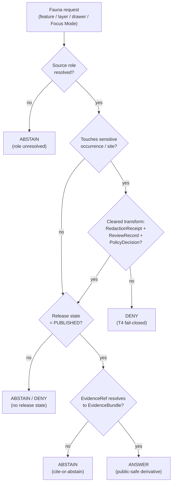

<!-- [KFM_META_BLOCK_V2]
doc_id: kfm://doc/domains-fauna-policy
title: Fauna Domain — Policy & Sensitivity Posture
type: standard
version: v1
status: draft
owners: <fauna-domain-steward>, <policy-steward>, <sensitivity-reviewer>
created: 2026-06-02
updated: 2026-06-02
policy_label: public
related: [ai-build-operating-contract.md, directory-rules.md, docs/domains/fauna/CANONICAL_PATHS.md, docs/domains/fauna/CROSS_LANE_RELATIONS.md, policy/sensitivity/fauna/, policy/domains/fauna/, schemas/contracts/v1/domains/fauna/]
tags: [kfm, fauna, policy, sensitivity, geoprivacy, deny-by-default]
notes: [Doctrine-adjacent. CONTRACT_VERSION = "3.0.0". Encodes the Fauna deny-by-default posture and tier dispositions; canonical enforcement lives in policy/, not here.]
[/KFM_META_BLOCK_V2] -->

# 🐾 Fauna Domain — Policy & Sensitivity Posture

> Deny-by-default policy doctrine for the Fauna lane: what is denied, what is generalized, what transforms and receipts are required, and where enforcement actually lives.


| Field | Value |
|---|---|
| **Status** | `draft` |
| **Owners** | `<fauna-domain-steward>` · `<policy-steward>` · `<sensitivity-reviewer>` *(placeholders — assign before review)* |
| **Updated** | 2026-06-02 |
| **Contract** | `CONTRACT_VERSION = "3.0.0"` |
| **Authority class** | Explanatory doctrine. Canonical enforcement is in `policy/` (Rego/OPA), `schemas/`, and `tests/`. |

> [!IMPORTANT]
> **This document explains; it does not enforce.** Per the documentation-as-truth anti-pattern, `docs/` navigates and explains. The binding decisions live in `policy/sensitivity/fauna/`, `policy/domains/fauna/`, `schemas/contracts/v1/domains/fauna/`, and their tests. Where this doc and a policy bundle disagree, **the policy bundle and its tests win**, and the conflict is filed to `docs/registers/DRIFT_REGISTER.md`.

---

## Quick jump

- [1. Scope](#1-scope)
- [2. Repo fit](#2-repo-fit)
- [3. Policy decision flow](#3-policy-decision-flow)
- [4. Sensitivity tiers (T0–T4)](#4-sensitivity-tiers-t0t4)
- [5. Fauna deny-by-default register](#5-fauna-deny-by-default-register)
- [6. Source-role anti-collapse](#6-source-role-anti-collapse)
- [7. Required transforms & receipts](#7-required-transforms--receipts)
- [8. Governed-AI policy for Fauna](#8-governed-ai-policy-for-fauna)
- [9. Publication, correction, rollback](#9-publication-correction-rollback)
- [10. Validators, tests, fixtures](#10-validators-tests-fixtures)
- [Companion sections](#open-questions-register)

---

## 1. Scope

**CONFIRMED doctrine / PROPOSED implementation.** This document states the policy and sensitivity posture for the Fauna lane: animal taxonomic identity, conservation/legal status, occurrence evidence, monitoring, range, seasonal support, sensitive sites, mortality, disease, invasive species, geoprivacy, public-safe products, and bounded APIs. `[DOM-FAUNA] [DOM-HF] [ENCY]`

**Objects this policy governs (CONFIRMED scope / PROPOSED field realization):** `Taxon`, `Taxon Crosswalk`, `Conservation Status`, `Occurrence Evidence`, `Occurrence Restricted`, `Occurrence Public`, `RangePolygon`, `SeasonalRange`, `MigrationRoute`, `SensitiveSite`, `MortalityObservation`, `DiseaseObservation`, `Invasive Species Record`, `RedactionReceipt`. `[DOM-FAUNA] [DOM-HF] [ENCY]`

**What this policy does *not* govern:** Habitat owns habitat patches and suitability; Flora owns plant records; Hydrology, Soil, Agriculture, Roads, and People provide context only through governed joins. Cross-lane relations are governed in [`CROSS_LANE_RELATIONS.md`](./CROSS_LANE_RELATIONS.md). `[DOM-FAUNA] [DOM-HF] [ENCY]`

> [!CAUTION]
> **Fauna is a sensitive lane.** Exact sensitive occurrences and exact `nests / dens / roosts / hibernacula / spawning` sites **fail closed (T4)**. They are denied to any public client by default and may only be released after geoprivacy generalization with a `RedactionReceipt`, a `ReviewRecord`, and a `PolicyDecision`. No style-only hiding of exact sensitive geometry is permitted. `[DOM-FAUNA] [ENCY]` (§23.2 row: *Fauna — sensitive occurrence*.)

[↑ Back to top](#-fauna-domain--policy--sensitivity-posture)

---

## 2. Repo fit

**PROPOSED placement (NEEDS VERIFICATION against mounted repo).** Per Directory Rules §12 (Domain Placement Law), Fauna is a **lane segment inside responsibility roots**, never a root folder. This doc lives under the `docs/` responsibility root; the binding policy lives under the `policy/` responsibility root.

```text
docs/domains/fauna/
├── README.md
├── CANONICAL_PATHS.md
├── CONTINUITY_INVENTORY.md
├── CROSS_LANE_RELATIONS.md
└── POLICY.md            ← this file (explanatory)

policy/                  ← canonical enforcement (singular root; ADR-0003 PROPOSED)
├── sensitivity/fauna/   ← geoprivacy + sensitive-occurrence deny rules
├── domains/fauna/       ← lane-scoped policy bundle (PROPOSED)
├── consent/             ← (not Fauna-primary; cross-lane)
└── release/             ← release-state gates

schemas/contracts/v1/domains/fauna/   ← object shape (ADR-0001 canonical schema home)
tests/domains/fauna/                  ← policy/validator enforceability proof
fixtures/domains/fauna/               ← valid/invalid + redaction fixtures
```

| Direction | Link | Relationship |
|---|---|---|
| **Authority above** | `ai-build-operating-contract.md` (v3.0) | Operating law; §23.2 sensitive-domain matrix governs disposition. |
| **Authority above** | `directory-rules.md` | Placement (§12), `policy/` root contract (§6.5), schema home (§7.4 / ADR-0001). |
| **Sibling doctrine** | [`CROSS_LANE_RELATIONS.md`](./CROSS_LANE_RELATIONS.md) | Governs Fauna ↔ Habitat / Flora / Hydrology / Hazards joins. |
| **Enforcement (downstream)** | `policy/sensitivity/fauna/` | Rego/OPA deny-by-default rules; **CONFIRMED placement per Atlas §24.13 crosswalk**, file-level **NEEDS VERIFICATION**. |
| **Shape (downstream)** | `schemas/contracts/v1/domains/fauna/` | `RedactionReceipt`, occurrence split, envelope DTOs. |

> [!NOTE]
> The Atlas §24.13 crosswalk lists `policy/sensitivity/fauna/` as the proposed Fauna sensitivity-policy home. The **path pattern is CONFIRMED doctrine**; whether those files currently exist in the repository is **NEEDS VERIFICATION** until the repo is mounted and inspected.

[↑ Back to top](#-fauna-domain--policy--sensitivity-posture)

---

## 3. Policy decision flow

Every Fauna request that could expose sensitive geometry passes through the same fail-closed evaluation. The runtime outcome is a finite `RuntimeResponseEnvelope` / `PolicyDecision` value — `ANSWER`, `ABSTAIN`, `DENY`, or `ERROR`.



> [!WARNING]
> This diagram reflects **doctrine**, not verified runtime wiring. Exact routes, DTO field names, and the OPA package layout are **PROPOSED / NEEDS VERIFICATION**. Do not read it as proof of implemented behavior.

**Default disposition when no specific row matches** (per operating contract §23.2):

```text
DENY public exact exposure
GENERALIZE before publication
REDACT when needed
QUARANTINE uncertain source material
REQUIRE steward review
REQUIRE transform receipt (RedactionReceipt)
ABSTAIN when support is inadequate
```

[↑ Back to top](#-fauna-domain--policy--sensitivity-posture)

---

## 4. Sensitivity tiers (T0–T4)

**CONFIRMED doctrine / PROPOSED tier-scheme labels** (Atlas v1.1 §24.5.1). Fauna publishes only the safest representation that still answers the steward's and the public's reasonable needs.

| Tier | Name | Definition | Default audience |
|---|---|---|---|
| **T0** | Open | Public-safe, no transforms beyond standard release. | Any public client via governed API. |
| **T1** | Generalized | Public-safe only after generalization / fuzzing / aggregation / redaction; transform reviewed and recorded. | Any public client via governed API. |
| **T2** | Reviewer | Released only to authenticated reviewers or domain stewards; correction path active. | Stewards, reviewers, named collaborators. |
| **T3** | Restricted | Released only under named agreement (rights, sovereignty, consent), recorded. | Named authorized parties only. |
| **T4** | Denied | Not released to any audience; the *existence* of a record may be disclosed only as steward review permits. | — |

### 4.1 Fauna object-class tier matrix

**CONFIRMED doctrine / PROPOSED transforms** (Atlas v1.1 §24.5.2).

| Fauna object class | Default tier | Allowed transforms | Required gates |
|---|---|---|---|
| **Sensitive occurrence** | **T4** | Geoprivacy generalization + `RedactionReceipt` → T1. | `RedactionReceipt` + `ReviewRecord` + `PolicyDecision`. |
| **`SensitiveSite`** (nest / den / roost / hibernaculum / spawning) | **T4** | Geoprivacy generalization (coarse cell / mask) + steward review → T1, only where review supports. | `RedactionReceipt` + `ReviewRecord` + `PolicyDecision`. |
| **`RangePolygon`** | T1 | Aggregate / generalized public-safe layer. | `AggregationReceipt` *or* `RedactionReceipt`. |
| **`SeasonalRange` / `MigrationRoute`** | T1 *(PROPOSED)* | Generalized public-safe layer; sensitive-stage geometry generalized. | `AggregationReceipt` or `RedactionReceipt`. *(NEEDS VERIFICATION — not separately rowed in §24.5.2.)* |
| **`Occurrence Public`** | T0/T1 | Released only as the public-safe derivative split from `Occurrence Restricted`. | Standard Gates A–G. |
| **`Conservation Status` / `Taxon`** | T0 | None required (status labels are public). | Standard Gates A–G. |
| **`Invasive Species Record`** | T0/T1 *(PROPOSED)* | Public monitoring layer; precise reporter/landowner detail generalized. | `AggregationReceipt` where private-join risk exists. |

> [!CAUTION]
> **`MortalityObservation` and `DiseaseObservation` are not separately rowed in §24.5.2.** They can carry precise sensitive-site or private-land signal. Treat them as **PROPOSED T4 / fail-closed** until a steward ratifies a tier, and log the gap in the verification backlog. Do not publish precise mortality/disease points without `RedactionReceipt` + `ReviewRecord`.

### 4.2 Tier transitions

**CONFIRMED reversibility doctrine** (Atlas v1.1 §24.5.3). A tier *upgrade* (toward public) always needs **both** a transform receipt **and** a `ReviewRecord`. A tier *downgrade* (toward restricted) needs only a `CorrectionNotice` — correction alone is sufficient to restrict.

| From → To | Required artifact | Reviewer |
|---|---|---|
| T4 → T1 | `RedactionReceipt` + `ReviewRecord` | Steward |
| T4 → T2 | `PolicyDecision` + `ReviewRecord` | Steward |
| T1 → T0 | `ReleaseManifest` + `ReviewRecord` | Steward + release authority |
| Any → T4 (downgrade) | `CorrectionNotice` + `ReviewRecord` | Steward (+ rights-holder where applicable) |

[↑ Back to top](#-fauna-domain--policy--sensitivity-posture)

---

## 5. Fauna deny-by-default register

**CONFIRMED doctrine** (Atlas v1.0 §20.5; §23.2 matrix). Enforcement IDs below are **PROPOSED** label scaffolding for the Fauna policy bundle, mirroring the Agriculture `AG-DENY-*` register pattern. Final IDs are owned by `policy/domains/fauna/` and `policy/sensitivity/fauna/`, not by this doc.

| ID *(PROPOSED)* | Denied by default | Allowed only when | Outcome |
|---|---|---|---|
| `FN-DENY-01` | Exact sensitive-taxon occurrence geometry on a public surface | Geoprivacy transform + `RedactionReceipt` + public-safe derivative | `DENY` |
| `FN-DENY-02` | Exact `nest / den / roost / hibernaculum / spawning` site geometry | Steward review + `RedactionReceipt` + `ReviewRecord` + `PolicyDecision` | `DENY` |
| `FN-DENY-03` | Public exact-occurrence tiles for sensitive taxa | Generalized aggregate tile only | `DENY` |
| `FN-DENY-04` | Style-only hiding of exact sensitive geometry (geometry still in payload) | Never — geometry must be transformed, not merely hidden | `DENY` |
| `FN-DENY-05` | `Occurrence Restricted` served on a public route | Promotion to `Occurrence Public` derivative via governed split | `DENY` |
| `FN-DENY-06` | Steward-controlled / rights-restricted source records exposed publicly | Rights cleared + source role resolved + release state present | `DENY` |
| `FN-DENY-07` | Public client reads RAW / WORK / QUARANTINE / canonical store | Read via `apps/governed-api/` (trust membrane) only | `DENY` |
| `FN-DENY-08` | AI answer from rendered features or RAW/WORK rather than released `EvidenceBundle` | Released `EvidenceBundle` + policy-safe context + `AIReceipt` | `ABSTAIN` / `DENY` |
| `FN-DENY-09` | Generalized product cited as a per-place occurrence truth | Aggregation receipt + geometry-scope guard | `DENY` / `ABSTAIN` |
| `FN-DENY-10` | Promotion with unclear rights, unresolved source role, missing evidence, unresolved sensitivity, or absent release state | All five resolved + governed promotion | `HOLD` / `DENY` |

> [!IMPORTANT]
> **Fail-closed is the operational form of cite-or-abstain.** Absence of evidence, an unresolved tier, or a missing receipt **blocks** the public edge — it does not default to allow. `[ENCY] [GAI] [DIRRULES]`

[↑ Back to top](#-fauna-domain--policy--sensitivity-posture)

---

## 6. Source-role anti-collapse

**CONFIRMED doctrine** (Atlas v1.1 §24.1). A source's role is fixed at admission (`SourceDescriptor`) and preserved through every promotion. Promotion never upgrades a role. For Fauna, the acute collapse risks are:

| Collapse pattern | Denied outcome | Required guardrail |
|---|---|---|
| Modeled range / suitability surface queried as observed occurrence | `DENY` at publication; `ABSTAIN` at AI surface | Run receipt + uncertainty surface + role-preserving DTO field |
| Aggregate density/richness grid cited as a per-place occurrence | `DENY` join from cell to single record; `ABSTAIN` at AI | Aggregation receipt; geometry-scope guard; matrix-cell semantics |
| Candidate / quarantined connector output exposed publicly | `DENY` at trust membrane; route to QUARANTINE | Promotion gate; no PUBLISHED edge to WORK / QUARANTINE |
| Aggregator observation (GBIF/eBird/iNaturalist) treated as agency authority | Preserve `observed` vs `authority` role distinction | Source role tag preserved on every projection |

> [!NOTE]
> **Anti-collapse is a per-projection obligation, not a one-time check.** Every tile, drawer payload, graph projection, and AI answer must preserve the source role. A `Conservation Status` (authority) is not an `Occurrence` (observed); a `RangePolygon` (often modeled/aggregate) is not a point sighting.

[↑ Back to top](#-fauna-domain--policy--sensitivity-posture)

---

## 7. Required transforms & receipts

**CONFIRMED object families / PROPOSED implementation.**

- **`RedactionReceipt`** — records a public-safe field or geometry transformation. Required for any T4 → T1 motion on sensitive occurrences and sensitive sites. Schema home: `schemas/contracts/v1/domains/fauna/` (PROPOSED) or a shared receipts home (NEEDS VERIFICATION).
- **`AggregationReceipt`** — required when a public layer is produced by aggregation (range polygons, density/richness grids) rather than redaction.
- **`ReviewRecord`** — steward (and rights-holder where applicable) review evidence; required for every tier *upgrade*.
- **`PolicyDecision`** — the finite, recorded gate outcome; not a transient log line.
- **`CorrectionNotice`** — required for any downgrade or post-publication correction; lists invalidated derivatives.

<details>
<summary><strong>Illustrative redaction profile reference (not authoritative)</strong></summary>

Named, versioned redaction profiles (radius mask, hex grid, seeded jitter, centroid, DP aggregate) let policy reference a transform by stable identifier rather than inline parameters, and let a verifier re-run the transform from the receipt and check determinism. Canonical profile catalog and parameters are owned by `policy/` (e.g. a profile catalog under `policy/`), **NEEDS VERIFICATION** for exact path and profile names. Example illustrative IDs only: `point_10km_hex_seeded_v1`, `point_3km_jitter_v1`, `centroid_1km_v1`. `[ENCY C6]`

> These IDs are **illustrative** from doctrine, not confirmed Fauna-lane configuration.

</details>

[↑ Back to top](#-fauna-domain--policy--sensitivity-posture)

---

## 8. Governed-AI policy for Fauna

**CONFIRMED doctrine / PROPOSED implementation.** AI is interpretive, never the root truth source; `EvidenceBundle` outranks generated language. `[GAI] [DOM-FAUNA] [ENCY]`

For the Fauna lane, AI **MAY**: summarize released Fauna `EvidenceBundle`s, compare evidence, explain limitations, and draft steward-review notes.

AI **MUST**:
- `ABSTAIN` when evidence is insufficient or an `EvidenceRef` does not resolve to an `EvidenceBundle`;
- `DENY` where policy, rights, sensitivity, or release state blocks the request;
- never read RAW / WORK / QUARANTINE content — only released `EvidenceBundle`s;
- never answer from rendered features alone;
- emit an `AIReceipt` for every answer.

| AI surface | Envelope | Outcomes | Status |
|---|---|---|---|
| Fauna Focus Mode answer | `RuntimeResponseEnvelope` + `AIReceipt` | `ANSWER` / `ABSTAIN` / `DENY` / `ERROR` | PROPOSED; AI never root truth. |
| Fauna Evidence Drawer payload | `EvidenceDrawerPayload` + `EvidenceBundle` projection | `ANSWER` / `ABSTAIN` / `DENY` / `ERROR` | PROPOSED; evidence + policy filtered. |

> [!NOTE]
> **Doctrine names `RuntimeResponseEnvelope` as canonical** for AI/runtime surfaces. Earlier dossier text used a bespoke `FaunaDecisionEnvelope`; treat that as superseded `LINEAGE` per the `DecisionEnvelope → RuntimeResponseEnvelope` migration. `[GAI]`

[↑ Back to top](#-fauna-domain--policy--sensitivity-posture)

---

## 9. Publication, correction, rollback

**CONFIRMED doctrine / PROPOSED implementation.** Fauna follows `RAW → WORK / QUARANTINE → PROCESSED → CATALOG / TRIPLET → PUBLISHED`; promotion is a governed state transition, not a file move. `[DIRRULES] [DOM-FAUNA] [ENCY]`

Fauna publication requires: a `ReleaseManifest`, an `EvidenceBundle`, validation/policy support, a review state where required, a correction path, the stale-state rule, and a rollback target. `[ENCY Appendix E] [DOM-FAUNA]`

| Gate (transition) | Required artifacts (PROPOSED minimum) | Fail-closed outcome |
|---|---|---|
| Normalization (RAW → WORK/QUARANTINE) | `TransformReceipt`; `ValidationReport`; `PolicyDecision`; QUARANTINE for failures | Quarantine with reason; never silently promotes |
| Validation (WORK → PROCESSED) | `ValidationReport` pass; `RedactionReceipt` if sensitivity applies; `AggregationReceipt` if applies | Stay in WORK; structured `FAIL` |
| Catalog closure (PROCESSED → CATALOG/TRIPLET) | `EvidenceBundle`; catalog matrix entry; resolved `EvidenceRef`s | `HOLD` at PROCESSED; no public edge |
| Release (CATALOG → PUBLISHED) | `ReleaseManifest`; rollback target; correction path; `ReviewRecord` if required | `HOLD` at CATALOG; no public surface change |
| Correction (PUBLISHED → PUBLISHED′) | `CorrectionNotice` listing invalidated derivatives; rollback card if needed | Downgrade / restrict; precedes derivative invalidation |

[↑ Back to top](#-fauna-domain--policy--sensitivity-posture)

---

## 10. Validators, tests, fixtures

**PROPOSED.** The Fauna policy posture is only real once it is enforceable. Tests live under `tests/domains/fauna/`; fixtures under `fixtures/domains/fauna/`.

- Source-role authority tests (`observed` vs `authority` vs `aggregate` not collapsed).
- Taxonomy resolution and ambiguity tests.
- Occurrence restricted/public split tests.
- `RedactionReceipt` validation (transform determinism re-run from receipt).
- Tile field allowlist tests (no exact sensitive geometry in public payload).
- `RuntimeResponseEnvelope` negative cases (`DENY` / `ABSTAIN` / `ERROR`).
- Deny-by-default fixtures for each `FN-DENY-*` rule above.

> [!IMPORTANT]
> Each `FN-DENY-*` rule MUST have at least one **negative fixture** proving the deny fires. A deny rule with no failing fixture is not enforced — it is aspirational.

[↑ Back to top](#-fauna-domain--policy--sensitivity-posture)

---

## Open questions register

| ID | Question | Owner role | Resolution path |
|---|---|---|---|
| OQ-FAUNA-POL-01 | Are `policy/sensitivity/fauna/` and `policy/domains/fauna/` present in the mounted repo, and what is the exact OPA package layout? | Policy steward | Repo inspection + Directory Rules §6.5 |
| OQ-FAUNA-POL-02 | What tier do `MortalityObservation` and `DiseaseObservation` ratify at? (Not rowed in §24.5.2.) | Fauna steward + sensitivity reviewer | ADR-S-05 sensitivity tier ratification |
| OQ-FAUNA-POL-03 | Are the `FN-DENY-*` IDs the canonical register, or does the Fauna bundle use a different scheme? | Policy steward | ADR / `policy/domains/fauna/` README |
| OQ-FAUNA-POL-04 | Which redaction profile(s) and parameters are canonical for Fauna sensitive occurrences? | Policy steward | `policy/` redaction profile catalog (NEEDS VERIFICATION) |
| OQ-FAUNA-POL-05 | Is the `RedactionReceipt` schema home Fauna-local or a shared receipts home? | Schema steward | Directory Rules §7.4 / ADR-0001 |

## Open verification backlog

These items remain `NEEDS VERIFICATION` before promotion from `draft` to `published`:

1. Confirm `policy/sensitivity/fauna/` exists and contains the deny-by-default rules referenced here.
2. Confirm `schemas/contracts/v1/domains/fauna/` schema home (vs. `schemas/contracts/v1/fauna/` shown in the Atlas §24.13 crosswalk — segment-form drift, route to `DRIFT_REGISTER`).
3. Confirm `RuntimeResponseEnvelope` is the wired Fauna AI/runtime envelope (vs. legacy `FaunaDecisionEnvelope`).
4. Confirm tier for `MortalityObservation` / `DiseaseObservation` (OQ-FAUNA-POL-02).
5. Confirm canonical redaction profile IDs and parameters for Fauna.
6. Confirm `FN-DENY-*` register IDs against the actual policy bundle.

## Changelog v0 → v1

| Change | Type (per contract §37) | Reason |
|---|---|---|
| New `docs/domains/fauna/POLICY.md` created | new | Completes the Fauna doc suite (CANONICAL_PATHS, CONTINUITY_INVENTORY, CROSS_LANE_RELATIONS already present). |
| Tier dispositions extracted from Atlas §24.5.2 | clarification | Make the Fauna sensitivity posture reviewable in one place. |
| `FN-DENY-*` register scaffolded | gap closure (PROPOSED) | Mirror the Agriculture `AG-DENY-*` pattern; final IDs owned by `policy/`. |

> **Backward compatibility.** New file; no prior anchors to preserve. If the live tree uses a different `policy/` segment form, that conflict is logged to `docs/registers/DRIFT_REGISTER.md` rather than resolved here.

## Definition of done

This document is done enough to enter the repository when:

- it is placed according to Directory Rules §12 (`docs/domains/fauna/POLICY.md`);
- a docs steward, a Fauna domain steward, and a sensitivity reviewer review it;
- it is linked from the Fauna `README.md` and the doctrine/domains index;
- it does not conflict with accepted ADRs (notably ADR-0001 schema home, ADR-0003 policy singular, ADR-S-05 sensitivity tiers);
- the schema-segment-form conflict (OQ via backlog item 2) is logged in `docs/registers/DRIFT_REGISTER.md`;
- the planned `GENERATED_RECEIPT.json` is wired into CI;
- future changes follow the operating contract's §37 lifecycle.

---

## Related docs

- [`README.md`](./README.md) — Fauna lane overview *(TODO: confirm presence)*
- [`CANONICAL_PATHS.md`](./CANONICAL_PATHS.md) — Fauna canonical paths
- [`CROSS_LANE_RELATIONS.md`](./CROSS_LANE_RELATIONS.md) — Fauna ↔ Habitat / Flora / Hydrology / Hazards joins
- [`../../../ai-build-operating-contract.md`](../../../ai-build-operating-contract.md) — operating law, §23.2 sensitive-domain matrix `(CONTRACT_VERSION = "3.0.0")`
- [`../../../directory-rules.md`](../../../directory-rules.md) — placement, `policy/` root contract
- `policy/sensitivity/fauna/` — canonical enforcement *(NEEDS VERIFICATION)*

_Last updated: 2026-06-02 · Status: `draft` · `CONTRACT_VERSION = "3.0.0"`_

[↑ Back to top](#-fauna-domain--policy--sensitivity-posture)
