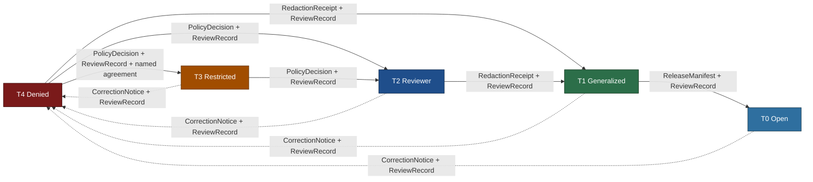
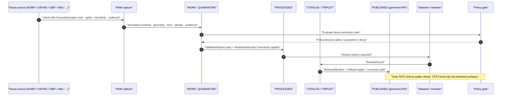

<!-- [KFM_META_BLOCK_V2]
doc_id: kfm://doc/fauna-preservation-matrix
title: Fauna Preservation Matrix
type: standard
version: v2
status: draft
owners: <fauna-domain-steward>; <release-authority>; <sensitivity-reviewer>; <docs-steward> (TODO assign)
created: 2026-05-16
updated: 2026-06-02
policy_label: public
related:
  - docs/domains/fauna/README.md
  - docs/domains/fauna/POLICY.md
  - docs/domains/fauna/CROSS_LANE_RELATIONS.md
  - docs/standards/PROV.md
  - docs/runbooks/fauna/SOURCE_REFRESH_RUNBOOK.md
  - docs/registers/VERIFICATION_BACKLOG.md
  - control_plane/policy_gate_register.yaml
  - policy/sensitivity/fauna/
  - policy/domains/fauna/
  - schemas/contracts/v1/domains/fauna/
tags: [kfm, fauna, sensitivity, geoprivacy, governance, preservation]
notes:
  - "Doctrine-adjacent. CONTRACT_VERSION = \"3.0.0\"."
  - "Doc identity (file name + scope shape) is PROPOSED; canonical doctrinal anchors are Atlas v1.1 §24.5 (Master Sensitivity/Rights Tier Reference) and ENCY §13 / Atlas v1.0 §20.5 (Deny-by-Default Register)."
  - "Schema, policy, and route paths cited inside are PROPOSED until a mounted-repo inspection or ADR confirms them."
  - "Object classes NOT named in Atlas Fauna object-family list (MonitoringEvent as object, NestDenRoostSpawningSite, AbundanceIndicator, RichnessIndicator) are marked INFERRED / illustrative; only Atlas-named families are CONFIRMED."
[/KFM_META_BLOCK_V2] -->

# 🐾 Fauna Preservation Matrix

> Per-object-class crosswalk from fauna sensitive material to its **default release tier**, **allowed transforms**, **required gates**, and **reversibility posture** — the operational shape of fauna's deny-by-default posture.

<!-- TODO: replace static badges with verified Shields endpoints once CI / ADR pins are decided -->

| Field | Value |
|---|---|
| **Status** | `draft` |
| **Owners** | `<fauna-domain-steward>` · `<release-authority>` · `<sensitivity-reviewer>` · `<docs-steward>` *(TODO assign)* |
| **Updated** | 2026-06-02 |
| **Contract** | `CONTRACT_VERSION = "3.0.0"` |
| **Authority class** | Explanatory instantiation. Canonical enforcement is in `policy/`, `schemas/`, and `tests/`. |

> [!IMPORTANT]
> This file is the **fauna-scoped instantiation** of the Master Sensitivity / Rights Tier Reference (Atlas v1.1 §24.5) and the Deny-by-Default Register (Atlas v1.0 §20.5 / ENCY §13). It does **not** create a parallel sensitivity authority; it operationalizes the canonical one for fauna. Where this matrix and a canonical source disagree, **Atlas v1.0 §20.5 and the per-domain F. sections govern** (per the Atlas v1.1 completeness note), and the conflict is filed to `docs/registers/DRIFT_REGISTER.md`. Where this matrix and a **policy bundle** disagree, the **policy bundle and its tests win**.

---

## Table of Contents

1. [Purpose & scope](#1-purpose--scope)
2. [How to read this matrix](#2-how-to-read-this-matrix)
3. [Tier scheme (T0–T4)](#3-tier-scheme-t0t4)
4. [Fauna preservation matrix (per object class)](#4-fauna-preservation-matrix-per-object-class)
5. [Allowed transforms (fauna vocabulary)](#5-allowed-transforms-fauna-vocabulary)
6. [Tier-transition mechanics](#6-tier-transition-mechanics)
7. [Required artifacts at each gate](#7-required-artifacts-at-each-gate)
8. [Cross-lane preservation interactions](#8-cross-lane-preservation-interactions)
9. [Governed AI behavior over fauna preservation](#9-governed-ai-behavior-over-fauna-preservation)
10. [Failure modes & anti-patterns](#10-failure-modes--anti-patterns)
11. [Companion sections](#open-questions-register)
12. [Related docs](#related-docs)

---

## 1. Purpose & scope

This document is the **fauna domain's preservation matrix**: a single auditable table that, for every fauna-owned object class, states the **default sensitivity tier**, the **allowed transforms** that can move it to a less-restricted tier, the **required gates** (receipts, reviews, policy decisions) for that motion, and the **reversibility posture** that returns an object to a more-restricted tier when correction or revocation is triggered.

**CONFIRMED doctrine.** Fauna owns sensitive material — exact occurrence geometry for sensitive taxa, plus nests, dens, roosts, hibernacula, and spawning sites — that **fails closed** for public exposure unless a documented geoprivacy transform and review state allow release. `[DOM-FAUNA] [ENCY] [DIRRULES]`

**PROPOSED doc identity.** `PRESERVATION_MATRIX.md` is not a previously named doctrinal artifact. Its **content** is grounded in canonical doctrine; its **placement** under `docs/domains/fauna/` follows Directory Rules §12 (Domain Placement Law) and §4 Step 3: domain-specific documentation is a **segment** inside the `docs/` responsibility root, never a new root. Confirmation of file name and link targets is **NEEDS VERIFICATION** until a mounted-repo inspection or ADR closes it.

> [!NOTE]
> **This doc explains; `policy/` enforces.** Per the documentation-as-truth anti-pattern, the binding decisions live in `policy/sensitivity/fauna/`, `policy/domains/fauna/`, `schemas/contracts/v1/domains/fauna/`, and their tests. This matrix is a reviewable reference view, not the enforcement surface.

### 1.1 Bounded scope

| In scope | Out of scope |
|---|---|
| Fauna object classes named in DOM-FAUNA §B/§C and the Atlas object-family list | Habitat patches, suitability surfaces, and connectivity (owned by Habitat) |
| Fauna obligations on geoprivacy, generalization, aggregation, redaction, withholding | Flora rare-plant geometry (mirrored in `docs/domains/flora/PRESERVATION_MATRIX.md` — proposed) |
| The fauna-specific instantiation of T0–T4 tiers | The cross-domain master matrix (Atlas v1.1 §24.5; canonical) |
| Required gates for each tier transition | The release authority's signing infrastructure (covered in `release/`) |
| Cross-lane join consequences when fauna sensitivity meets another domain | Hazards life-safety boundary (covered in `docs/domains/hazards/`) |

[⬆ Back to top](#table-of-contents)

---

## 2. How to read this matrix

Each row in §4 names a **fauna-owned object class** and gives, in order:

1. The **default tier** the object enters when admitted to RAW. Default reflects the **safest** plausible posture absent review.
2. The **public-safe payload shape** that exists at each lower-restriction tier, if one is allowed at all. Some rows have no public-safe shape.
3. The **transforms** that can lawfully move the object toward a less-restricted tier.
4. The **required gates** — the receipts, review records, and policy decisions that must close before the transition is recognized as governed.
5. The **reversibility note** — what artifact downgrades the object back toward T4 when correction, revocation, or new evidence demands it.

> [!CAUTION]
> **Distinguish CONFIRMED tiers from INFERRED tiers.** Atlas v1.1 §24.5.2 rows **two** fauna object classes explicitly: *sensitive occurrence* (**T4**) and *range polygon* (**T1**). Every other tier value in §4 is **INFERRED** from the deny-by-default rule, the object's evidence character, and lane logic — not lifted verbatim from a source. Treat the **tier scheme and the deny-by-default rule** as CONFIRMED doctrine; treat **per-class tiers not in §24.5.2, artifact names, and policy paths** as INFERRED or PROPOSED until a steward ratifies them (see [Open verification backlog](#open-verification-backlog)).

[⬆ Back to top](#table-of-contents)

---

## 3. Tier scheme (T0–T4)

**CONFIRMED doctrine**, semantics from Atlas v1.1 §24.5.1.

| Tier | Name | Definition | Default audience |
|---:|---|---|---|
| **T0** | Open | Public-safe with no transforms required; standard release applies. | Any public client via governed API. |
| **T1** | Generalized | Public-safe **only after** generalization, fuzzing, aggregation, or redaction; transform is reviewed and recorded. | Any public client via governed API. |
| **T2** | Reviewer | Released only to authenticated reviewers or domain stewards; policy-bounded; correction path active. | Stewards, reviewers, named research collaborators. |
| **T3** | Restricted | Released only under named agreement (rights, sovereignty, or consent) and recorded. | Named authorized parties only. |
| **T4** | Denied | Not released to any audience; the **existence** of a record may be released only as steward review permits. | — |

> [!CAUTION]
> A row's **default tier** is the floor, not a ceiling target. A fauna object is published at the **safest tier that still answers the steward's and the public's reasonable needs** — not the most permissive tier the rules allow.

*Reading note:* a tier **upgrade** (toward more public) always needs both a **transform receipt** and a **review record**; a tier **downgrade** (toward less public) never needs both — a `CorrectionNotice` alone is sufficient to remove or restrict. (Atlas v1.1 §24.5.3)

[⬆ Back to top](#table-of-contents)

---

## 4. Fauna preservation matrix (per object class)

**CONFIRMED object families** (Atlas Fauna object-family list, DOM-FAUNA §B): `Taxon`, `Taxon Crosswalk`, `Conservation Status`, `Occurrence Evidence`, `Occurrence Restricted`, `Occurrence Public`, `RangePolygon`, `SeasonalRange`, `MigrationRoute`, `SensitiveSite`, `MortalityObservation`, `DiseaseObservation`, `Invasive Species Record`, `Redaction Receipt`. `MonitoringEvent` is a CONFIRMED ubiquitous-language **term** (DOM-FAUNA §C) but is **not** in the object-family list — it is treated below as INFERRED.

> [!IMPORTANT]
> **Tier-source legend for §4.** `[§24.5.2]` = tier CONFIRMED in the Atlas per-domain matrix. `[INFERRED]` = tier derived here from doctrine, not stated verbatim. `[illustrative]` = object name is a descriptive grouping, not a CONFIRMED Atlas object family.

### 4.1 Identity, taxonomy, and conservation status

| Object class | Default tier | Public-safe shape (≤ T1) | Allowed transforms | Required gates | Reversibility |
|---|---:|---|---|---|---|
| `Taxon` | **T0** `[INFERRED]` | Authoritative taxon record with cited source role | none required when source rights are clear | `SourceDescriptor` + standard release | `CorrectionNotice` for taxonomy revision |
| `Taxon Crosswalk` | **T0** `[INFERRED]` | Cross-source identity map | none required | `SourceDescriptor` + standard release | `CorrectionNotice` re-emits a corrected crosswalk |
| `Conservation Status` | **T0** for status / **T1** for any geographic implication when joined to occurrence `[INFERRED]` | Status label + citation; **no join-induced precision leak** | aggregate-only when joined to range or occurrence | `SourceDescriptor` + `PolicyDecision` for joins | `CorrectionNotice` for status revision |

### 4.2 Occurrence evidence (the central sensitivity surface)

| Object class | Default tier | Public-safe shape (≤ T1) | Allowed transforms | Required gates | Reversibility |
|---|---:|---|---|---|---|
| `Occurrence Evidence` (non-sensitive taxa) | **T0** `[INFERRED]` | Point with declared uncertainty + uncertainty radius | none required | `SourceDescriptor` + evidence closure | `CorrectionNotice` |
| `Occurrence Restricted` (sensitive taxa) | **T4** `[§24.5.2]` | **No public exact point**; only the public-safe derivative tier exists | geoprivacy generalization (grid / watershed / county) → `Occurrence Public` | `RedactionReceipt` + `ReviewRecord` + `PolicyDecision` → T1 | `CorrectionNotice` returns to T4; downstream `Occurrence Public` invalidated |
| `Occurrence Public` (the generalized derivative) | **T1** `[§24.5.2]` | Generalized density grid, range-bounded points, or aggregate counts | further aggregation if join risk rises | `RedactionReceipt`; `ReleaseManifest` for any T1→T0 (rare) | `CorrectionNotice` re-redacts or withdraws |
| `MonitoringEvent` (eDNA, acoustic, telemetry, survey) `[illustrative — term, not object family]` | **T2** `[INFERRED]` | not public until reviewed | aggregation, time-bucketing, generalization → T1 | `RedactionReceipt` + `ReviewRecord` | `CorrectionNotice` |

> [!WARNING]
> **Join-induced sensitivity is a deny condition for the join *product* even when the inputs were individually safe.** A T0 `Taxon` joined to a T0 `RangePolygon` does **not** make the joined product T0 — the result can become T4 if the join surfaces a sensitive subpopulation or a hibernaculum centroid. The sensitivity is a property of the **product**, not just its inputs. This is the inference-risk pattern named in the Atlas Master Risk Register: *living-person / sensitive data exposed via inference (aggregate + context join)*. `[ENCY Risk Register] [DOM-FAUNA] [Atlas §20.5]`

### 4.3 Range, season, and movement

| Object class | Default tier | Public-safe shape (≤ T1) | Allowed transforms | Required gates | Reversibility |
|---|---:|---|---|---|---|
| `RangePolygon` (non-sensitive) | **T1** `[§24.5.2]` | Generalized public-safe polygon | aggregation; smoothing | `AggregationReceipt` or `RedactionReceipt` | `CorrectionNotice` |
| `RangePolygon` (sensitive taxa) | **T2 → T1** by transform `[INFERRED]` | Coarsened polygon, no fine boundary leak | aggregate to watershed / county | `RedactionReceipt` + `ReviewRecord` | `CorrectionNotice` |
| `SeasonalRange` | **T1** `[INFERRED]` | Generalized season polygon + time window | as `RangePolygon` | `AggregationReceipt` | `CorrectionNotice` |
| `MigrationRoute` | **T1** for general; **T4** for staging / stopover at sensitive sites `[INFERRED]` | Generalized corridor only; no precise stopover points | corridor generalization; stopover suppression | `RedactionReceipt` + `ReviewRecord` | `CorrectionNotice` |

### 4.4 Sensitive sites (deny-default core)

| Object class | Default tier | Public-safe shape (≤ T1) | Allowed transforms | Required gates | Reversibility |
|---|---:|---|---|---|---|
| `SensitiveSite` (umbrella) | **T4** `[§24.5.2]` | **None by default** | geoprivacy generalization to coarse cell only after review | `RedactionReceipt` + `ReviewRecord` + `PolicyDecision` → T1 (rare) | `CorrectionNotice` returns to T4 |
| Nest / den / roost / spawning subtype `[illustrative — sensitive geometry of `SensitiveSite`]` | **T4** `[§24.5.2]` | **None by default** | coarse-cell generalization + temporal suppression (no season-specific exposure) | `RedactionReceipt` + `ReviewRecord` + `PolicyDecision` → T1 only with steward review | `CorrectionNotice` returns to T4; downstream public derivatives invalidated |
| Hibernaculum / staging / lekking subtype `[illustrative]` | **T4** `[§24.5.2]` | **None by default** | suppress entirely; aggregate to county-level **count only** with steward sign-off | `RedactionReceipt` + `ReviewRecord` + `PolicyDecision` | `CorrectionNotice` returns to T4 |

> [!CAUTION]
> **The deny-by-default invariant for nests, dens, roosts, hibernacula, and spawning sites holds regardless of source.** A site disclosed by an aggregator, a citizen-science feed, or a steward source enters the matrix at **T4** by default. Source vintage does not relax the tier; only a recorded transform plus review plus policy decision does. `[DOM-FAUNA] [ENCY §13] [Atlas §20.5]`

### 4.5 Mortality, disease, and invasive

| Object class | Default tier | Public-safe shape (≤ T1) | Allowed transforms | Required gates | Reversibility |
|---|---:|---|---|---|---|
| `MortalityObservation` (non-sensitive context) | **T1** `[INFERRED]` | Generalized location; aggregated count over time window | aggregation; time-bucketing | `AggregationReceipt` | `CorrectionNotice` |
| `MortalityObservation` (sensitive taxa or sensitive site) | **T4 → T1** by transform `[INFERRED]` | Aggregated count, suppressed location | aggregation only | `RedactionReceipt` + `ReviewRecord` | `CorrectionNotice` returns to T4 |
| `DiseaseObservation` | **T1** `[INFERRED]` | Generalized cluster, suppressed precise host detail | aggregation; cluster envelope | `AggregationReceipt`; **never** a life-safety / alert payload | `CorrectionNotice` |
| `Invasive Species Record` | **T1** `[INFERRED]` | Generalized public layer for monitoring | aggregation; corridor generalization | `RedactionReceipt` when joined to sensitive habitat | `CorrectionNotice` |

> [!IMPORTANT]
> **`DiseaseObservation` is never a life-safety substitute.** Even at T1, fauna disease layers are KFM **context**, never an alert authority. Joining disease to mortality or hazards must not become emergency messaging. `[DOM-FAUNA boundary] [DOM-HAZ] [Atlas §24.5.2 — Hazards: KFM as alert authority = T4 forever]`

### 4.6 Indicators and receipts

| Object class | Default tier | Public-safe shape | Allowed transforms | Required gates | Reversibility |
|---|---:|---|---|---|---|
| Abundance / richness indicator (gridded, aggregated) `[illustrative — modeled/aggregate product, not a named Atlas object family]` | **T0 / T1** `[INFERRED]` | Aggregated grid; uncertainty band | aggregation parameters fixed at release | `AggregationReceipt` + `ReleaseManifest` | `CorrectionNotice` |
| `Redaction Receipt` | **T0** (the receipt itself) `[INFERRED]` | The receipt is publicly inspectable; its **inputs** are not | none — receipts are evidence, not source | `EvidenceBundle` closure | `CorrectionNotice` if receipt is amended |

> [!NOTE]
> **Source-role anti-collapse applies to indicators.** An abundance/richness grid is a **modeled or aggregate** product and must never be queried or cited as an observed per-place occurrence. Preserve the source role on every projection; deny aggregate-to-single-record joins. `[Atlas §24.1 anti-collapse] [DOM-FAUNA]`

[⬆ Back to top](#table-of-contents)

---

## 5. Allowed transforms (fauna vocabulary)

`Geoprivacy transform` and `Public-safe derivative` are CONFIRMED ubiquitous-language terms (DOM-FAUNA §C); the named profiles below are the **fauna profile** of the master transform set (Atlas v1.1 §24.5). Concrete profile names and parameters must be declared in `policy/sensitivity/fauna/` (or `policy/domains/fauna/`) and tested via `tests/domains/fauna/` — they are PROPOSED until verified.

| Transform | What it does | When fauna uses it | Receipt class |
|---|---|---|---|
| **Suppress** | Withhold the object or field entirely | T4 default for sensitive sites; never publishes precise geometry | `RedactionReceipt` |
| **Generalize to grid** | Replace point with a coarser-cell centroid | Public occurrence density; species-page maps | `RedactionReceipt` |
| **Generalize to watershed / county / admin unit** | Aggregate to a named administrative geography | `Occurrence Public`; abundance / richness layers | `RedactionReceipt` or `AggregationReceipt` |
| **Buffer / coarsen polygon** | Smooth or coarsen a fine polygon boundary | Sensitive `RangePolygon`; corridor envelopes | `RedactionReceipt` |
| **Aggregate** | Replace records with counts / summaries | Disease clusters; mortality time series; richness | `AggregationReceipt` |
| **Time-bucket** | Replace exact times with windows | Migration timing; survey events | `AggregationReceipt` |
| **Delay publication (embargo)** | Withhold release for a fixed embargo | Active breeding-season disclosure risk | `PolicyDecision` + `ReleaseManifest` with embargo |
| **Steward-only exact** | Keep exact geometry inside restricted surfaces; no public-safe derivative emitted | T4 deny — used when no safe transform exists | `PolicyDecision` only; no public emission |
| **Deny** | Refuse release entirely | Sensitive sites without steward review; uncertain rights | `PolicyDecision` (deny with reason code) |

> [!NOTE]
> **Jitter alone is not an approved fauna transform for sensitive taxa.** Random jitter of sensitive points is reversible by a sufficiently motivated observer with independent prior information. The fauna profile therefore prefers **suppression + generalize-to-grid** over jitter for any T4-default object class. Seeded reproducible jitter may be acceptable for display redaction of **non-sensitive** records (ENCY C6-03 redaction profiles), but it does **not** promote a T4 object to T1 on its own. `[ENCY C6]`

[⬆ Back to top](#table-of-contents)

---

## 6. Tier-transition mechanics

A tier transition is a **governed state transition**, not a file move (Directory Rules §3; CORE INVARIANTS). The mechanics mirror the canonical motion table (Atlas v1.1 §24.5.3) and apply unmodified to fauna.

The transition table — what artifact and what reviewer are required — is **CONFIRMED doctrine** (Atlas v1.1 §24.5.3):

| From → To | Required artifact(s) | Required reviewer | Reversibility |
|---|---|---|---|
| T4 → T3 | `PolicyDecision` + `ReviewRecord` + named agreement | Steward + rights-holder where applicable | Reversible: agreement revocation returns object to T4 with `CorrectionNotice` |
| T4 → T2 | `PolicyDecision` + `ReviewRecord` | Steward | Reversible: review revocation returns object to T4 |
| T4 → T1 | `RedactionReceipt` + `ReviewRecord` | Steward | Reversible: redaction can be re-evaluated; correction may demote a published T1 to T4 |
| T3 → T2 | `PolicyDecision` + `ReviewRecord` | Steward | Reversible |
| T2 → T1 | `RedactionReceipt` + `ReviewRecord` | Steward | Reversible |
| T1 → T0 | `ReleaseManifest` + `ReviewRecord` | Steward + release authority (separated where materiality applies) | Reversible: rollback via `RollbackCard` |
| any tier → T4 (downgrade) | `CorrectionNotice` + `ReviewRecord` | Steward + rights-holder where applicable | **Always permitted; precedes derivative invalidation** |

[⬆ Back to top](#table-of-contents)

---

## 7. Required artifacts at each gate

This section names the **artifacts** the fauna preservation matrix is consumed by. Their **canonical homes** are governed by Directory Rules §4 / §12 and remain PROPOSED until a mounted-repo inspection or ADR confirms them.

| Artifact | Role at fauna preservation | PROPOSED responsibility root | Status |
|---|---|---|---|
| `SourceDescriptor` | Declares source role, rights, sensitivity defaults, cadence at admission | `data/registry/sources/fauna/` | PROPOSED |
| `EvidenceBundle` / `EvidenceRef` | Closes evidence for every published fauna claim | `schemas/contracts/v1/evidence/`; `contracts/evidence/` | PROPOSED |
| `RedactionReceipt` | Records geoprivacy transform input class, output class, reason, policy ref, reviewer, residual risk | `schemas/contracts/v1/domains/fauna/receipts/` **or** a shared receipts home (ADR unresolved) | PROPOSED |
| `AggregationReceipt` | Records aggregation method, parameters, and join inputs | as above | PROPOSED |
| `PolicyDecision` | Reason-coded `ALLOW` / `DENY` / `ABSTAIN` / `ERROR` / `HOLD` outcome | `policy/sensitivity/fauna/`; `policy/domains/fauna/` | PROPOSED |
| `ReviewRecord` | Steward or rights-holder review state | `schemas/contracts/v1/review/` | PROPOSED |
| `ReleaseManifest` | Pins the released artifact + rollback target + correction path | `release/candidates/fauna/`; `release/manifests/fauna/` | PROPOSED |
| `CorrectionNotice` | Triggers downgrade or invalidation of a previously released derivative | `schemas/contracts/v1/review/` | PROPOSED |
| `RollbackCard` | Names the rollback target and the artifact lineage to invalidate | `release/rollback/fauna/` | PROPOSED |
| `LayerManifest` | Declares the public fauna map layer's content tier and field allowlist | `schemas/contracts/v1/layers/` | PROPOSED |

> [!NOTE]
> The schema home and receipt-class home for fauna are governed by the Atlas §24.12 ADR-S backlog. Until those ADRs close, any concrete path above is PROPOSED. The crosswalk (Atlas §24.13) lists `schemas/contracts/v1/fauna/` and `policy/sensitivity/fauna/` for this lane — note the **segment-form difference** from `schemas/contracts/v1/domains/fauna/` used elsewhere; that conflict is logged to the verification backlog.

<strong>RedactionReceipt — required fields (PROPOSED)</strong>

The fauna `RedactionReceipt` should, at minimum, carry:

- `input_object_class` — the originating fauna object class (e.g., `SensitiveSite`).
- `input_tier` — the pre-transform tier (typically `T4`).
- `output_object_class` — the public-safe derivative class (e.g., `Occurrence Public`).
- `output_tier` — the post-transform tier (typically `T1`).
- `transform` — the named transform (e.g., `generalize_to_county`, `aggregate_count_only`).
- `parameters` — concrete parameters (cell size, watershed level, count window).
- `policy_ref` — the policy bundle that authorized the transform.
- `reviewer` — steward or named reviewer identity.
- `residual_risk_note` — explicit statement of any residual disclosure risk.
- `evidence_refs` — content-addressed pointers (URI + digest) to inputs and outputs.
- `temporal_scope` — observed / valid / retrieval / release times.

PROPOSED schema home: `schemas/contracts/v1/domains/fauna/receipts/redaction_receipt.schema.json` (pending ADR). The field list above is INFERRED from doctrine, not a verified schema.

<strong>Fail-closed outcomes (fauna lane)</strong>

The fauna preservation matrix never fails open. When a gate cannot close, the lane emits a reason-coded outcome and the public surface is **not** updated.

- **Admission failure** — source descriptor missing or sensitivity unknown → record logged as candidate awaiting steward; no RAW promotion.
- **Normalization failure** — schema, geometry, time, identity, evidence, rights, or policy rule fails → record enters QUARANTINE with reason; never silently promotes.
- **Validation failure** — `ValidationReport` does not pass, or a required `RedactionReceipt` / `AggregationReceipt` is missing → record holds at WORK.
- **Catalog failure** — `EvidenceRef`s do not resolve or digests do not close → record holds at PROCESSED; no public edge.
- **Release failure** — `ReleaseManifest`, rollback target, correction path, or required `ReviewRecord` is missing → record holds at CATALOG; no public surface change.
- **Correction trigger** — error detected or new evidence arrives → object downgraded toward T4 with `CorrectionNotice`; downstream derivatives identified and invalidated.

These outcomes are the operational form of the CORE INVARIANT: *promotion is a governed state transition, not a file move.*

[⬆ Back to top](#table-of-contents)

---

## 8. Cross-lane preservation interactions

Fauna sensitivity does not stay inside fauna. A join can elevate the resulting product's tier — and fauna's rule is that **the join product inherits the strictest tier of any input, plus any sensitivity created by the join itself**.

| Counterpart lane | Typical fauna interaction | Preservation consequence |
|---|---|---|
| **Habitat** | `Occurrence Public` ↔ `HabitatPatch` for the habitat-fauna thin slice | Habitat outputs that reveal sensitive species context through a join must be **generalized, redacted, reviewed, or denied** before public emission. `[DOM-HF]` |
| **Flora** | Ecological community, pollinator, invasive co-occurrence | Mirror fauna T-tier where joined; if joined to a rare-plant record, take the **stricter** tier of the two. |
| **Hydrology** | Aquatic, riparian, wetland, spawning context | Spawning-site exposure follows fauna **T4** default even when joined to a public hydrology layer. |
| **Hazards** | Disease, mortality, wildfire / flood / drought exposure | Fauna disease / mortality remains **context-only**; never an alert payload. Hazards-fauna join must not become emergency messaging. |
| **Archaeology** | Faunal-cultural / ethnozoological context | Take the **stricter** tier; archaeology's T4 default for site coordinates wins over any fauna T0 / T1 input. |
| **People / DNA / Land** | Survey-site land ownership; private landowner constraints | A private person-parcel join into a fauna survey location demotes the product to **≥ T2** with `RedactionReceipt`. |

> [!IMPORTANT]
> **A benign source can become sensitive through a join.** The preservation matrix applies to the **product**, not just the inputs — this is the cross-lane inference-risk pattern in the Atlas Master Risk Register. Cross-lane join policy is an open Atlas §24.12 ADR-S item; until it closes, fauna treats every cross-lane join as **requiring an explicit relation-edge contract** before public emission. See [`CROSS_LANE_RELATIONS.md`](./CROSS_LANE_RELATIONS.md). `[ENCY Risk Register] [Atlas §24.12]`

[⬆ Back to top](#table-of-contents)

---

## 9. Governed AI behavior over fauna preservation

**CONFIRMED doctrine / PROPOSED implementation.** AI may summarize **released** fauna `EvidenceBundle`s, compare evidence, explain limitations, and draft steward-review notes. AI must **ABSTAIN** when evidence is insufficient and **DENY** when policy, rights, sensitivity, or release state blocks the request. AI never reads RAW or WORK content; only released `EvidenceBundle`s. Every answer emits an `AIReceipt`. `[GAI] [DOM-FAUNA §L] [ENCY]`

| AI request | Permitted outcome |
|---|---|
| "Summarize the public-safe range of `<species>`." | **ANSWER** with citation + `AIReceipt`, drawing only from released `EvidenceBundle`s. |
| "Show the exact nest location of `<species>`." | **DENY** (fauna T4 default; no transform receipt requested). |
| "Where did the recent eDNA event happen?" | **ABSTAIN** unless a `MonitoringEvent`-class record has been published at T1 with `RedactionReceipt`. |
| "Compare GBIF and KDWP occurrence sources for `<species>`." | **ANSWER** at the comparison level; never reveal exact restricted geometry; preserve source roles. |
| "Reverse-engineer the original point from the generalized layer." | **DENY** (deliberate sensitivity bypass). |

> [!CAUTION]
> **Fluent generation never substitutes for the preservation matrix.** AI cannot grant a tier upgrade, synthesize a redaction receipt, or publish. Its role is interpretive over **released** evidence only. The finite outcomes are `ANSWER` / `ABSTAIN` / `DENY` / `ERROR`, carried in a `RuntimeResponseEnvelope` + `AIReceipt`. `[GAI]`

[⬆ Back to top](#table-of-contents)

---

## 10. Failure modes & anti-patterns

The patterns below appear often enough in cross-domain doctrine that fauna calls them out explicitly.

| Anti-pattern | What goes wrong | Correct posture |
|---|---|---|
| Treating jitter as sufficient redaction for sensitive taxa | Reversible by a motivated observer with prior information | Use suppression + generalize-to-grid; never rely on jitter alone for T4 objects |
| Publishing a `RangePolygon` derived from sensitive `Occurrence Restricted` without aggregation | Polygon shape leaks site precision | Aggregate to watershed / county before public emission |
| Letting a public client request "show exact location for `<restricted>`" | Bypasses fauna T4 default | `DENY` at the governed API; do not surface even an existence message without steward review |
| Conflating `Occurrence Public` with `Occurrence Restricted` | Treats two distinct object families as one | Keep restricted and public **separate**; a public derivative is downstream of a redaction receipt |
| Style-only hiding of exact sensitive geometry | Geometry still ships in the payload | Transform the geometry, never merely hide it in the renderer |
| Re-publishing a T1 derivative without a fresh review when the source updates | Stale-state risk; derivative may no longer match input | Run the preservation pipeline end-to-end on every source refresh (see SOURCE_REFRESH_RUNBOOK) |
| Letting a Story Node or AI summary leak precision the map layer hides | Bypasses the preservation matrix through narrative | Citation preservation; AI `ABSTAIN` / `DENY`; Story Node references evidence, never sovereign |
| Aggregate indicator cited as a per-place occurrence | Source-role collapse | Preserve source role; deny aggregate-to-single-record joins |
| Creating a new sensitivity authority parallel to this matrix | Splits doctrine across competing files | Extend Atlas §24.5 and ENCY §13; this file is an **instantiation**, not an authority |

[⬆ Back to top](#table-of-contents)

---

## Open questions register

| ID | Question | Owner role | Resolution path |
|---|---|---|---|
| OQ-FAUNA-PM-01 | Schema home for fauna receipts (`receipts/` vs `domains/fauna/receipts/`) | Schema steward | ADR closure; mounted-repo inspection; Directory Rules §7.4 |
| OQ-FAUNA-PM-02 | Policy bundle layout (`policy/sensitivity/fauna/` vs `policy/domains/fauna/`) | Policy steward | Mounted repo; ADR review |
| OQ-FAUNA-PM-03 | Canonical names for fauna redaction profiles (e.g. `point_10km_hex_seeded_v1`) | Policy steward | `policy/` redaction profile catalog |
| OQ-FAUNA-PM-04 | Is `Occurrence Public` a distinct schema or a tier label on `Occurrence Evidence`? | Schema steward | `schemas/contracts/v1/domains/fauna/` |
| OQ-FAUNA-PM-05 | Concrete generalization radius / cell size defaults per sensitive object class | Fauna steward | Steward decision + policy bundle |
| OQ-FAUNA-PM-06 | Ratified tiers for `SeasonalRange`, `MigrationRoute`, `MortalityObservation`, `DiseaseObservation`, `Invasive Species Record` (not in §24.5.2) | Fauna steward + sensitivity reviewer | ADR-S sensitivity tier ratification |
| OQ-FAUNA-PM-07 | May AI **acknowledge the existence** of a T4 fauna record? | AI surface steward | ADR-S AI-surface boundary closure |
| OQ-FAUNA-PM-08 | Reviewer separation-of-duties threshold for fauna release | Release authority | ADR-S separation-of-duties closure |

## Open verification backlog

These items remain `NEEDS VERIFICATION` before promotion from `draft` to `published`:

1. Confirm the segment form of the fauna schema home — `schemas/contracts/v1/fauna/` (Atlas §24.13 crosswalk) vs `schemas/contracts/v1/domains/fauna/` (Directory Rules §12 pattern). Log the conflict in `docs/registers/DRIFT_REGISTER.md`.
2. Confirm `policy/sensitivity/fauna/` exists and contains the deny-by-default rules referenced here.
3. Confirm tiers for object classes not rowed in Atlas §24.5.2 (all `[INFERRED]` rows in §4).
4. Confirm whether `MonitoringEvent` is realized as an object family or only a ubiquitous-language term.
5. Confirm canonical redaction profile IDs and parameters for fauna.
6. Confirm source-rights status for live KDWP / USFWS / NatureServe / GBIF / iNaturalist / eBird / EDDMapS connectors.
7. Confirm file name `PRESERVATION_MATRIX.md` placement vs an alternative under `docs/standards/` or `docs/registers/`; ADR if scope generalizes.
8. Confirm anchor stability with adjacent fauna docs (README, POLICY, runbooks).

## Changelog v1 → v2

| Change | Type (per contract §37) | Reason |
|---|---|---|
| Corrected `TaxonCrosswalk` → `Taxon Crosswalk`; aligned object names to the Atlas Fauna object-family list | reconciliation | Terminology drift repair; preserve KFM compound terms exactly. |
| Relabeled `MonitoringEvent`, nest/den/roost subtype, abundance/richness indicators as `[illustrative]` / `[INFERRED]` | clarification | They are not CONFIRMED Atlas object families; prevent over-assertion. |
| Added `[§24.5.2]` vs `[INFERRED]` tier-source legend across §4 | clarification | Separate CONFIRMED tiers from derived ones per truth-label discipline. |
| Removed the `KFM-IDX-POL-001` citation | gap closure | Identifier not found in project evidence; replaced with the Atlas Master Risk Register inference-risk pattern. |
| Added POLICY.md cross-link, segment-form drift note, and `policy/sensitivity/fauna/` home | reconciliation | Align with Atlas §24.13 crosswalk and the sibling POLICY doc. |
| Quoted all Mermaid node / participant labels containing `/`, `(`, `·` | housekeeping | Mermaid parse safety. |
| Replaced flat ToC tail with companion sections (Open Qs, Verification, Changelog, DoD) | housekeeping | Doctrine-doc companion-section discipline. |
| Bumped `updated` to 2026-06-02; version v1 → v2 | housekeeping | Revision tracking. |

> **Backward compatibility.** Section anchors §1–§10 are preserved; the old §11 ("Open questions & verification backlog") and §12 ("Related docs") are replaced by the companion-section tail — any deep link to `#11-open-questions--verification-backlog` or `#12-related-docs` will break and should repoint to `#open-questions-register` and `#related-docs`.

## Definition of done

This document is done enough to enter the repository when:

- it is placed according to Directory Rules §12 (`docs/domains/fauna/PRESERVATION_MATRIX.md`), or an ADR generalizes its scope to another root;
- a docs steward, a fauna domain steward, and a sensitivity reviewer review it;
- it is linked from the fauna `README.md` and `POLICY.md`;
- it does not conflict with accepted ADRs (schema home, policy singular, sensitivity tier ratification);
- the schema-segment-form conflict (backlog item 1) is logged in `docs/registers/DRIFT_REGISTER.md`;
- the planned `GENERATED_RECEIPT.json` is wired into CI;
- future changes follow the operating contract's §37 lifecycle.

---

## Related docs

- [`README.md`](./README.md) — fauna domain landing and orientation *(PROPOSED)*
- [`POLICY.md`](./POLICY.md) — fauna policy & sensitivity posture (deny register, governed-AI policy)
- [`CROSS_LANE_RELATIONS.md`](./CROSS_LANE_RELATIONS.md) — fauna ↔ Habitat / Flora / Hydrology / Hazards joins
- [`../../runbooks/fauna/SOURCE_REFRESH_RUNBOOK.md`](../../runbooks/fauna/SOURCE_REFRESH_RUNBOOK.md) — fauna source refresh runbook *(draft)*
- [`../../standards/PROV.md`](../../standards/PROV.md) — provenance standard underlying every receipt referenced here
- [`../../registers/VERIFICATION_BACKLOG.md`](../../registers/VERIFICATION_BACKLOG.md) — global verification register *(PROPOSED)*
- `policy/sensitivity/fauna/` — fauna sensitivity policy bundle *(PROPOSED root)*
- `schemas/contracts/v1/domains/fauna/` — fauna contract schemas *(PROPOSED root)*
- `release/manifests/fauna/` — fauna release manifests *(PROPOSED root)*
- `ai-build-operating-contract.md` — operating law, §23.2 sensitive-domain matrix `(CONTRACT_VERSION = "3.0.0")`
- Atlas v1.1 §24.5 — Master Sensitivity / Rights Tier Reference *(canonical)*
- Atlas v1.0 §20.5 / ENCY §13 — Deny-by-Default Register *(canonical)*
- DOM-FAUNA / DOM-HF — fauna and habitat-fauna thin-slice doctrine *(canonical)*

---

<em>Last updated: 2026-06-02 · Document version: v2 (draft) · CONTRACT_VERSION = "3.0.0" · Doctrine basis: Atlas v1.1 §24.5, Atlas v1.0 §20.5, ENCY §13, DOM-FAUNA, DOM-HF, Directory Rules §12.</em>

[⬆ Back to top](#table-of-contents)
