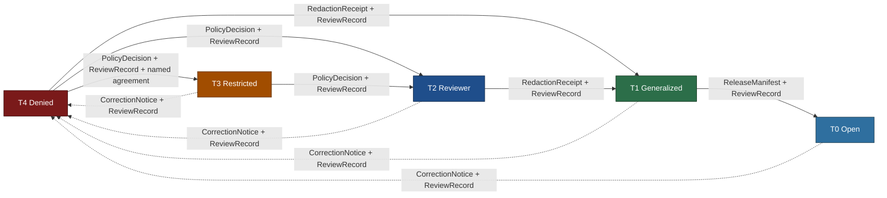
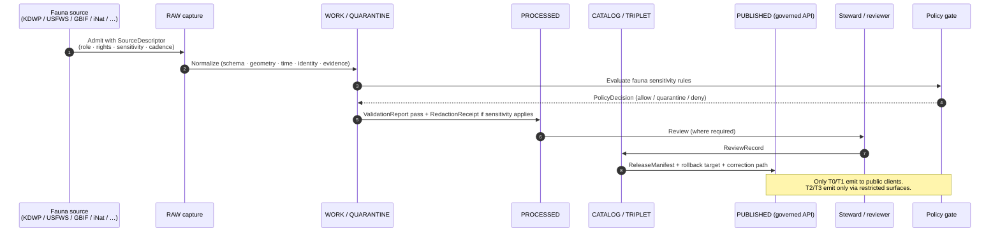

<!-- [KFM_META_BLOCK_V2]
doc_id: kfm://doc/fauna-preservation-matrix
title: Fauna Preservation Matrix
type: standard
version: v1
status: draft
owners: <fauna-domain-steward>; <release-authority>; <docs-steward> (TODO assign)
created: 2026-05-16
updated: 2026-05-16
policy_label: public
related:
  - docs/domains/fauna/README.md
  - docs/standards/PROV.md
  - docs/runbooks/fauna/SOURCE_REFRESH_RUNBOOK.md
  - docs/registers/VERIFICATION_BACKLOG.md
  - control_plane/policy_gate_register.yaml
  - policy/domains/fauna/
  - schemas/contracts/v1/domains/fauna/
tags: [kfm, fauna, sensitivity, geoprivacy, governance, preservation]
notes:
  - "Doc identity (file name + scope shape) is PROPOSED; canonical doctrinal anchors are Atlas v1.1 §24.5 (Master Sensitivity/Rights Tier Reference) and ENCY §13 (Deny-by-Default Register)."
  - "Schema, policy, and route paths cited inside are PROPOSED until a mounted-repo inspection or ADR confirms them."
[/KFM_META_BLOCK_V2] -->

# Fauna Preservation Matrix

> Per-object-class crosswalk from fauna sensitive material to its **default release tier**, **allowed transforms**, **required gates**, and **reversibility posture** — the operational shape of fauna's deny-by-default posture.

<!-- TODO: replace placeholders with verified Shields endpoints once CI/ADR pins are decided -->

**Status:** `draft` · **Owners:** fauna-domain-steward · release-authority · docs-steward (TODO assign) · **Last updated:** 2026-05-16

> [!IMPORTANT]
> This file is the **fauna-scoped instantiation** of the Master Sensitivity / Rights Tier Reference (Atlas v1.1 §24.5) and the Deny-by-Default Register (ENCY §13). Where the two conflict, **Atlas v1.0 §20.5 and the per-domain F. sections govern**, per the Atlas v1.1 completeness note. This matrix does **not** create a parallel sensitivity authority; it operationalizes the canonical one for fauna.

---

## Table of Contents

1. [Purpose & scope](#1-purpose--scope)
2. [How to read this matrix](#2-how-to-read-this-matrix)
3. [Tier scheme (T0–T4)](#3-tier-scheme-t0t4)
4. [Fauna preservation matrix (per object class)](#4-fauna-preservation-matrix-per-object-class)
5. [Allowed transforms (fauna vocabulary)](#5-allowed-transforms-fauna-vocabulary)
6. [Tier-transition mechanics](#6-tier-transition-mechanics)
7. [Required artifacts at each gate](#7-required-artifacts-at-each-gate)
8. [Cross-lane preservation interactions](#8-cross-lane-preservation-interactions)
9. [Governed AI behavior over fauna preservation](#9-governed-ai-behavior-over-fauna-preservation)
10. [Failure modes & anti-patterns](#10-failure-modes--anti-patterns)
11. [Open questions & verification backlog](#11-open-questions--verification-backlog)
12. [Related docs](#12-related-docs)

---

## 1. Purpose & scope

This document is the **fauna domain's preservation matrix**: a single auditable table that, for every fauna-owned object class, states the **default sensitivity tier**, the **allowed transforms** that can move it to a less-restricted tier, the **required gates** (receipts, reviews, policy decisions) for that motion, and the **reversibility posture** that returns an object to a more-restricted tier when correction or revocation is triggered.

**CONFIRMED doctrine.** Fauna owns sensitive material — exact occurrence geometry for sensitive taxa, nests, dens, roosts, hibernacula, and spawning sites — that **fails closed** for public exposure unless a documented geoprivacy transform and review state allow release.

**PROPOSED doc identity.** The file name `PRESERVATION_MATRIX.md` is not a previously named doctrinal artifact. Its **content** is grounded in canonical doctrine; its **placement** under `docs/domains/fauna/` follows Directory Rules §4 (Step 3): domain-specific documentation belongs as a **segment** inside the `docs/` responsibility root, never as a new root. Confirmation of file name and link targets is **NEEDS VERIFICATION** until a mounted-repo inspection or ADR closes it.

### 1.1 Bounded scope

| In scope | Out of scope |
|---|---|
| Fauna object classes named in DOM-FAUNA §C and ENCY §7.5 | Habitat patches, suitability surfaces, and connectivity (owned by Habitat) |
| Fauna obligations on geoprivacy, generalization, aggregation, redaction, withholding | Flora rare-plant geometry (mirrored in `docs/domains/flora/PRESERVATION_MATRIX.md` — proposed) |
| The fauna-specific instantiation of T0–T4 tiers | The cross-domain master matrix (Atlas v1.1 §24.5; canonical) |
| Required gates for each tier transition | The release authority's signing infrastructure (covered in `release/`) |
| Cross-lane join consequences when fauna sensitivity meets another domain | Hazards life-safety boundary (covered in `docs/domains/hazards/`) |

[⬆ Back to top](#table-of-contents)

---

## 2. How to read this matrix

Each row in §4 names a **fauna-owned object class** and gives, in order:

1. The **default tier** the object enters when admitted to RAW. Default reflects the **safest** plausible posture absent review.
2. The **public-safe payload shape** that exists at each lower-restriction tier, if one is allowed at all. Some rows have no public-safe shape.
3. The **transforms** that can lawfully move the object toward a less-restricted tier.
4. The **required gates** — the receipts, review records, and policy decisions that must close before the transition is recognized as governed.
5. The **reversibility note** — what artifact downgrades the object back toward T4 when correction, revocation, or new evidence demands it.

> [!NOTE]
> The matrix is **descriptive of intent, not of implementation**. Every row contains at least one PROPOSED element until policy bundles, schema homes, and validators are checked against a mounted repo. Treat the **tiers and the deny-by-default rule** as CONFIRMED doctrine and the **artifact names and policy paths** as PROPOSED until verified.

---

## 3. Tier scheme (T0–T4)

CONFIRMED doctrine, lifted verbatim in semantics from Atlas v1.1 §24.5.1.

| Tier | Name | Definition | Default audience |
|---:|---|---|---|
| **T0** | Open | Public-safe with no transforms required; standard release applies. | Any public client via governed API. |
| **T1** | Generalized | Public-safe **only after** generalization, fuzzing, aggregation, or redaction; transform is reviewed and recorded. | Any public client via governed API. |
| **T2** | Reviewer | Released only to authenticated reviewers or domain stewards; policy-bounded; correction path active. | Stewards, reviewers, named research collaborators. |
| **T3** | Restricted | Released only under named agreement (rights, sovereignty, or consent) and recorded. | Named authorized parties only. |
| **T4** | Denied | Not released to any audience; the **existence** of a record may be released only as steward review permits. | — |

> [!CAUTION]
> A row's **default tier** is the floor, not a ceiling target. A fauna object is published at the **safest tier that still answers the steward's and the public's reasonable needs** — not the most permissive tier the rules allow.

*Reading note:* a tier **upgrade** (toward more public) always needs both a **transform receipt** and a **review record**; a tier **downgrade** (toward less public) never needs both — a `CorrectionNotice` alone is sufficient to remove or restrict. (Atlas v1.1 §24.5.3)

[⬆ Back to top](#table-of-contents)

---

## 4. Fauna preservation matrix (per object class)

The object classes below are CONFIRMED as fauna-owned per DOM-FAUNA §B and ENCY §7.5.C. The default tiers and transforms are the operational instantiation of Atlas v1.1 §24.5.2 and ENCY §13 for fauna.

### 4.1 Identity, taxonomy, and conservation status

| Object class | Default tier | Public-safe shape (≤ T1) | Allowed transforms | Required gates | Reversibility |
|---|---:|---|---|---|---|
| `Taxon` | **T0** | Authoritative taxon record with cited source role | none required when source rights are clear | `SourceDescriptor` + standard release | `CorrectionNotice` for taxonomy revision |
| `TaxonCrosswalk` | **T0** | Cross-source identity map (CONFIRMED term; PROPOSED field realization) | none required | `SourceDescriptor` + standard release | `CorrectionNotice` re-emits a corrected crosswalk |
| `ConservationStatus` (federal / state / heritage) | **T0** (for status) / **T1** (for any geographic implication when joined to occurrence) | Status label + citation; **no join-induced precision leak** | aggregate-only when joined to range or occurrence | `SourceDescriptor` + `PolicyDecision` for joins | `CorrectionNotice` for status revision |

### 4.2 Occurrence evidence (the central sensitivity surface)

| Object class | Default tier | Public-safe shape (≤ T1) | Allowed transforms | Required gates | Reversibility |
|---|---:|---|---|---|---|
| `OccurrenceEvidence` (non-sensitive taxa) | **T0** | Point with declared uncertainty + uncertainty radius | none required | `SourceDescriptor` + evidence closure | `CorrectionNotice` |
| `OccurrenceRestricted` (sensitive taxa) | **T4** | **No public exact point**; only the public-safe derivative tier exists | geoprivacy generalization (grid / watershed / county) → `OccurrencePublic` | `RedactionReceipt` + `ReviewRecord` + `PolicyDecision` → T1 | `CorrectionNotice` returns to T4; downstream `OccurrencePublic` invalidated |
| `OccurrencePublic` (the generalized derivative) | **T1** | Generalized density grid, range-bounded points, or aggregate counts | further aggregation if join risk rises | `RedactionReceipt` + `ReleaseManifest` for T1→T0 (rare) | `CorrectionNotice` re-redacts or withdraws |
| `MonitoringEvent` (eDNA, acoustic, telemetry, survey) | **T2** (default) | not public until reviewed | aggregation, time-bucketing, generalization → T1 | `RedactionReceipt` + `ReviewRecord` | `CorrectionNotice` |

> [!WARNING]
> **Join-induced sensitivity is a deny condition for the join product even if the inputs were individually safe.** A T0 `Taxon` joined to a T0 `RangePolygon` does **not** mean the joined product is T0 — the resulting record can become T4 if the join surfaces a sensitive subpopulation or a hibernaculum centroid. The sensitivity is a property of the **product**, not just the inputs. (KFM-IDX-POL-001; Atlas §20.5 deny lane.)

### 4.3 Range, season, and movement

| Object class | Default tier | Public-safe shape (≤ T1) | Allowed transforms | Required gates | Reversibility |
|---|---:|---|---|---|---|
| `RangePolygon` (non-sensitive) | **T1** | Generalized public-safe polygon | aggregation; smoothing | `AggregationReceipt` or `RedactionReceipt` | `CorrectionNotice` |
| `RangePolygon` (sensitive taxa) | **T2** → **T1** by transform | Coarsened polygon, no fine boundary leak | aggregate to watershed/county | `RedactionReceipt` + `ReviewRecord` | `CorrectionNotice` |
| `SeasonalRange` | **T1** | Generalized season polygon + time window | as `RangePolygon` | `AggregationReceipt` | `CorrectionNotice` |
| `MigrationRoute` | **T1** for general; **T4** for staging/stopover at sensitive sites | Generalized corridor only; no precision stopover points | corridor generalization; stopover suppression | `RedactionReceipt` + `ReviewRecord` | `CorrectionNotice` |

### 4.4 Sensitive sites (deny-default core)

| Object class | Default tier | Public-safe shape (≤ T1) | Allowed transforms | Required gates | Reversibility |
|---|---:|---|---|---|---|
| `SensitiveSite` (umbrella) | **T4** | **None by default** | geoprivacy generalization to coarse cell only after review | `RedactionReceipt` + `ReviewRecord` + `PolicyDecision` → T1 (rare) | `CorrectionNotice` returns to T4 |
| `NestDenRoostSpawningSite` (the named sensitive geometry) | **T4** | **None by default** | coarse-cell generalization + temporal suppression (no season-specific exposure) | `RedactionReceipt` + `ReviewRecord` + `PolicyDecision` → T1 only with steward review | `CorrectionNotice` returns to T4; downstream public derivatives invalidated |
| Hibernaculum / staging / lekking subtype | **T4** | **None by default** | suppress entirely; aggregate to county-level **count only** with steward sign-off | `RedactionReceipt` + `ReviewRecord` + `PolicyDecision` | `CorrectionNotice` returns to T4 |

> [!CAUTION]
> **The deny-by-default invariant for nests, dens, roosts, hibernacula, and spawning sites holds regardless of source.** A site disclosed by an aggregator, a citizen-science feed, or a steward source enters the matrix at **T4** by default. Source vintage does not relax the tier; only a recorded transform plus review plus policy decision does. (DOM-FAUNA §§12–13; ENCY §13; Atlas §20.5.)

### 4.5 Mortality, disease, and invasive

| Object class | Default tier | Public-safe shape (≤ T1) | Allowed transforms | Required gates | Reversibility |
|---|---:|---|---|---|---|
| `MortalityObservation` (non-sensitive context) | **T1** | Generalized location; aggregated count over time window | aggregation; time-bucketing | `AggregationReceipt` | `CorrectionNotice` |
| `MortalityObservation` (sensitive taxa or sensitive site) | **T4** → **T1** by transform | Aggregated count, suppressed location | aggregation only | `RedactionReceipt` + `ReviewRecord` | `CorrectionNotice` returns to T4 |
| `DiseaseObservation` | **T1** | Generalized cluster, suppressed precise host detail | aggregation; cluster envelope | `AggregationReceipt`; **never** a life-safety/alert payload | `CorrectionNotice` |
| `InvasiveSpeciesRecord` | **T1** | Generalized public layer for monitoring | aggregation; corridor generalization | `RedactionReceipt` when joined to sensitive habitat | `CorrectionNotice` |

> [!IMPORTANT]
> **`DiseaseObservation` is never a life-safety substitute.** Even at T1, fauna disease layers are KFM **context**, never an alert authority. Joining disease to mortality or hazards must not become emergency messaging. (DOM-FAUNA boundary; Hazards life-safety boundary, Atlas §24.5.2.)

### 4.6 Indicators and receipts

| Object class | Default tier | Public-safe shape | Allowed transforms | Required gates | Reversibility |
|---|---:|---|---|---|---|
| `AbundanceIndicator` / `RichnessIndicator` (gridded, aggregated) | **T0**/**T1** | Aggregated grid; uncertainty band | aggregation parameters fixed at release | `AggregationReceipt` + `ReleaseManifest` | `CorrectionNotice` |
| `RedactionReceipt` | **T0** (the receipt itself) | The receipt is publicly inspectable; its **inputs** are not | none — receipts are evidence, not source | `EvidenceBundle` closure | `CorrectionNotice` if receipt is amended |

[⬆ Back to top](#table-of-contents)

---

## 5. Allowed transforms (fauna vocabulary)

CONFIRMED term (DOM-FAUNA §C) / PROPOSED field realization. The transform vocabulary below is the **fauna profile** of the master transform set (Atlas v1.1 §24.5); concrete profile names and parameters must be declared in `policy/domains/fauna/` and tested via `tests/domains/fauna/`.

| Transform | What it does | When fauna uses it | Receipt class |
|---|---|---|---|
| **Suppress** | Withhold the object or field entirely | T4 default for sensitive sites; never publishes precise geometry | `RedactionReceipt` |
| **Generalize to grid** | Replace point with a coarser-cell centroid | Public occurrence density; species-page maps | `RedactionReceipt` |
| **Generalize to watershed / county / admin unit** | Aggregate to a named administrative geography | `OccurrencePublic`; abundance/richness layers | `RedactionReceipt` or `AggregationReceipt` |
| **Buffer / coarsen polygon** | Smooth or coarsen a fine polygon boundary | Sensitive `RangePolygon`; corridor envelopes | `RedactionReceipt` |
| **Aggregate** | Replace records with counts/summaries | Disease clusters; mortality time series; richness | `AggregationReceipt` |
| **Time-bucket** | Replace exact times with windows | Migration timing; survey events | `AggregationReceipt` |
| **Delay publication** | Withhold release for a fixed embargo | Active breeding-season disclosure risk | `PolicyDecision` + `ReleaseManifest` with embargo |
| **Steward-only exact** | Keep exact geometry inside restricted surfaces; no public-safe derivative emitted | T4 deny — used when no safe transform exists | `PolicyDecision` only; no public emission |
| **Deny** | Refuse release entirely | Sensitive sites without steward review; uncertain rights | `PolicyDecision` (deny with reason code) |

> [!NOTE]
> **Jitter alone is not an approved fauna transform for sensitive taxa.** Random jitter of sensitive points is reversible by a sufficiently motivated observer who has independent prior information. The fauna profile therefore prefers **suppression + generalize-to-grid** over jitter for any T4-default object class. Seeded reproducible jitter may be acceptable for display redaction of **non-sensitive** records (C6-03 in Pass 10), but it does not promote a T4 object to T1 on its own.

[⬆ Back to top](#table-of-contents)

---

## 6. Tier-transition mechanics

A tier transition is a **governed state transition**, not a file move (Directory Rules §3; CORE INVARIANTS). The mechanics below mirror the canonical motion table (Atlas v1.1 §24.5.3) and apply unmodified to fauna.

The transition table — what artifact and what reviewer are required — is canonical doctrine:

| From → To | Required artifact(s) | Required reviewer | Reversibility |
|---|---|---|---|
| T4 → T3 | `PolicyDecision` + `ReviewRecord` + named agreement | Steward + rights-holder where applicable | Reversible: agreement revocation returns object to T4 with `CorrectionNotice` |
| T4 → T2 | `PolicyDecision` + `ReviewRecord` | Steward | Reversible: review revocation returns object to T4 |
| T4 → T1 | `RedactionReceipt` + `ReviewRecord` | Steward | Reversible: redaction can be re-evaluated; correction may demote a published T1 to T4 |
| T3 → T2 | `PolicyDecision` + `ReviewRecord` | Steward | Reversible |
| T2 → T1 | `RedactionReceipt` + `ReviewRecord` | Steward | Reversible |
| T1 → T0 | `ReleaseManifest` + `ReviewRecord` | Steward + release authority (separated where materiality applies) | Reversible: rollback via `RollbackCard` |
| any tier → T4 (downgrade) | `CorrectionNotice` + `ReviewRecord` | Steward + rights-holder where applicable | **Always permitted; precedes derivative invalidation** |

[⬆ Back to top](#table-of-contents)

---

## 7. Required artifacts at each gate

This section names the **artifacts** the fauna preservation matrix is consumed by. Their **canonical homes** are governed by Directory Rules §4 and remain PROPOSED until a mounted-repo inspection or ADR confirms them.

| Artifact | Role at fauna preservation | PROPOSED responsibility root | Status |
|---|---|---|---|
| `SourceDescriptor` | Declares source role, rights, sensitivity defaults, cadence at admission | `data/registry/sources/fauna/` (per Directory Rules §4 Step 3) | PROPOSED |
| `EvidenceBundle` / `EvidenceRef` | Closes evidence for every published fauna claim | `contracts/`, `schemas/contracts/v1/evidence/` | PROPOSED |
| `RedactionReceipt` | Records geoprivacy transform input class, output class, reason, policy ref, reviewer, residual risk | `schemas/contracts/v1/domains/fauna/receipts/` or `schemas/contracts/v1/receipts/` (ADR-S-03 unresolved) | PROPOSED |
| `AggregationReceipt` | Records aggregation method, parameters, and join inputs | as above | PROPOSED |
| `PolicyDecision` | Reason-coded ALLOW / DENY / ABSTAIN / ERROR / HOLD outcome | `policy/domains/fauna/` | PROPOSED |
| `ReviewRecord` | Steward or rights-holder review state | `schemas/contracts/v1/review/` | PROPOSED |
| `ReleaseManifest` | Pins the released artifact + rollback target + correction path | `release/candidates/fauna/`, `release/manifests/fauna/` | PROPOSED |
| `CorrectionNotice` | Triggers downgrade or invalidation of a previously released derivative | `schemas/contracts/v1/review/` | PROPOSED |
| `RollbackCard` | Names the rollback target and the artifact lineage to invalidate | `release/rollback/fauna/` | PROPOSED |
| `LayerManifest` | Declares the public fauna map layer's content tier and field allowlist | `schemas/contracts/v1/layers/` | PROPOSED |

> [!NOTE]
> The schema home and receipt class home for fauna are governed by ADR-S-01 through ADR-S-05 (Atlas v1.1 §24.12 ADR backlog). Until those ADRs close, any concrete path above is PROPOSED.

<strong>RedactionReceipt — required fields (PROPOSED)</strong>

The fauna `RedactionReceipt` must, at minimum, carry:

- `input_object_class` — the originating fauna object class (e.g., `NestDenRoostSpawningSite`).
- `input_tier` — the pre-transform tier (typically `T4`).
- `output_object_class` — the public-safe derivative class (e.g., `OccurrencePublic`).
- `output_tier` — the post-transform tier (typically `T1`).
- `transform` — the named transform (e.g., `generalize_to_county`, `aggregate_count_only`).
- `parameters` — concrete parameters (cell size, watershed level, count window).
- `policy_ref` — the policy bundle that authorized the transform.
- `reviewer` — steward or named reviewer identity.
- `residual_risk_note` — explicit statement of any residual disclosure risk.
- `evidence_refs` — content-addressed pointers (URI + digest) to inputs and outputs.
- `temporal_scope` — observed / valid / retrieval / release times.

PROPOSED schema home: `schemas/contracts/v1/domains/fauna/receipts/redaction_receipt.schema.json` (PENDING ADR-S-03).

<strong>Failure-closed outcomes (fauna lane)</strong>

The fauna preservation matrix never fails open. When a gate cannot close, the lane emits a reason-coded outcome and the public surface is **not** updated.

- **Admission failure** — source descriptor missing or sensitivity unknown → record is logged as candidate awaiting steward; no RAW promotion.
- **Normalization failure** — schema, geometry, time, identity, evidence, rights, or policy rule fails → record enters QUARANTINE with reason; never silently promotes.
- **Validation failure** — `ValidationReport` does not pass, or a required `RedactionReceipt`/`AggregationReceipt` is missing → record holds at WORK.
- **Catalog failure** — `EvidenceRef`s do not resolve or digests do not close → record holds at PROCESSED; no public edge.
- **Release failure** — `ReleaseManifest`, rollback target, correction path, or required `ReviewRecord` is missing → record holds at CATALOG; no public surface change.
- **Correction trigger** — error detected or new evidence arrives → object is downgraded toward T4 with `CorrectionNotice`; downstream derivatives are identified and invalidated.

These outcomes are the operational form of the CORE INVARIANT "Promotion is a governed state transition, not a file move."

[⬆ Back to top](#table-of-contents)

---

## 8. Cross-lane preservation interactions

Fauna sensitivity does not stay inside fauna. A join can elevate or relax the resulting product's tier — and fauna's rule is that **the join product inherits the highest sensitivity of any input plus any sensitivity created by the join itself**.

| Counterpart lane | Typical fauna interaction | Preservation consequence |
|---|---|---|
| **Habitat** | `OccurrencePublic` ↔ `HabitatPatch` for the habitat-fauna thin slice | Habitat outputs that reveal sensitive species context through join must be **generalized, redacted, reviewed, or denied** before public emission (DOM-HF §§1–5). |
| **Flora** | Ecological community, pollinator, invasive co-occurrence | Mirror fauna T-tier where joined; if joined to `RarePlantRecord`, take the stricter tier of the two. |
| **Hydrology** | Aquatic, riparian, wetland, spawning context | Spawning-site exposure follows fauna T4 default even when joined to a public hydrology layer. |
| **Hazards** | Disease, mortality, wildfire/flood/drought exposure | Fauna disease/mortality remains **context-only**; never an alert payload. Hazards-fauna join must not become emergency messaging. |
| **Archaeology** | Ethnobotanical / faunal-cultural context | Take the stricter tier; archaeology's T4 default for site coordinates wins over any fauna T0/T1 input. |
| **People / DNA / Land** | Survey-site land ownership; private landowner constraints | Private person-parcel join into fauna survey location demotes the product to ≥ T2 with `RedactionReceipt`. |

> [!IMPORTANT]
> The principle holds: **a benign source can become sensitive through join** (KFM-IDX-POL-001). The preservation matrix applies to the **product**, not just the inputs. Cross-lane join policy is the subject of ADR-S-14 (Atlas §24.12); until that closes, fauna treats every cross-lane join as **requiring an explicit relation-edge contract** before public emission.

[⬆ Back to top](#table-of-contents)

---

## 9. Governed AI behavior over fauna preservation

CONFIRMED doctrine: AI may summarize **released** fauna `EvidenceBundle`s, compare evidence, explain limitations, and draft steward-review notes. AI must **ABSTAIN** when evidence is insufficient and **DENY** when policy, rights, sensitivity, or release state blocks the request. AI never reads RAW or WORK content; only released `EvidenceBundle`. (DOM-FAUNA §L; ENCY §7.5.I; GAI master doctrine.)

| AI request | Permitted outcome |
|---|---|
| "Summarize the public-safe range of <species>." | **ANSWER** with citation + `AIReceipt`, drawing only from released `EvidenceBundle`s. |
| "Show the exact nest location of <species>." | **DENY** (fauna T4 default; no transform receipt requested). |
| "Where did the recent eDNA event happen?" | **ABSTAIN** unless a `MonitoringEvent` has been published at T1 with `RedactionReceipt`. |
| "Compare two GBIF and KDWP occurrence sources for <species>." | **ANSWER** at the comparison level; never reveal exact restricted geometry. |
| "Reverse-engineer the original point from the generalized layer." | **DENY** (this is a deliberate sensitivity bypass). |

> [!CAUTION]
> **Fluent generation never substitutes for the preservation matrix.** AI cannot grant a tier upgrade. AI cannot synthesize a redaction receipt. AI cannot publish. AI's role is interpretive over **released** evidence only. (GOVERNED AI RULE; FAILURE RULE.)

[⬆ Back to top](#table-of-contents)

---

## 10. Failure modes & anti-patterns

The patterns below have appeared often enough in cross-domain doctrine that fauna calls them out explicitly.

| Anti-pattern | What goes wrong | Correct posture |
|---|---|---|
| Treating jitter as sufficient redaction for sensitive taxa | Reversible by a motivated observer with prior information | Use suppression + generalize-to-grid; never rely on jitter alone for T4 objects |
| Publishing a `RangePolygon` derived from sensitive `OccurrenceRestricted` without aggregation | Polygon shape leaks site precision | Aggregate to watershed/county before public emission |
| Letting a public client request "show exact location for <restricted>" | Bypasses fauna T4 default | DENY at the governed API; do not surface even an existence message without steward review |
| Treating `OccurrencePublic` as the same object as `OccurrenceRestricted` | Conflates two distinct object classes | Keep restricted and public as **separate object families**; a public derivative is downstream of a redaction receipt |
| Re-publishing a T1 derivative without a fresh review when the source updates | Stale-state risk; derivative may no longer match input | Run the preservation pipeline end-to-end on every source refresh (see SOURCE_REFRESH_RUNBOOK) |
| Letting a Story Node or AI summary leak precision the map layer hides | Bypasses the preservation matrix through narrative | Citation preservation; AI ABSTAIN/DENY; Story Node references evidence, never sovereign |
| Creating a new sensitivity authority parallel to this matrix | Splits doctrine across competing files | Extend Atlas §24.5 and ENCY §13; this file is an **instantiation**, not an authority |

[⬆ Back to top](#table-of-contents)

---

## 11. Open questions & verification backlog

| Item to verify | Evidence that would settle it | Status |
|---|---|---|
| Schema home for fauna receipts (`receipts/` vs `domains/fauna/receipts/`) | ADR-S-03 closure; mounted-repo inspection | NEEDS VERIFICATION |
| Policy bundle layout for fauna (`policy/domains/fauna/`) | Mounted repo; ADR review | NEEDS VERIFICATION |
| Canonical names for fauna redaction profiles (e.g., `point_10km_hex_seeded_v1`) | `policy/redaction/profiles.yaml`; profile catalog | NEEDS VERIFICATION |
| Whether `OccurrencePublic` is a distinct schema or a tier label on `OccurrenceEvidence` | Schema definitions in `schemas/contracts/v1/domains/fauna/` | NEEDS VERIFICATION |
| Concrete generalization radius / cell size defaults for each sensitive object class | Steward decision + policy bundle | NEEDS VERIFICATION |
| Embargo windows for active breeding-season sensitive sites | Steward + rights-holder policy | NEEDS VERIFICATION |
| Whether AI is permitted to **acknowledge the existence** of a T4 record in fauna | ADR-S-06 (AI surface boundary) closure | NEEDS VERIFICATION |
| Reviewer separation-of-duties threshold for fauna release | ADR-S-09 closure | NEEDS VERIFICATION |
| Source-rights status for live KDWP / USFWS / NatureServe / GBIF / iNat / eBird / EDDMapS connectors | Source registry + rights review | NEEDS VERIFICATION |
| File name `PRESERVATION_MATRIX.md` placement vs. an alternative under `docs/standards/` or `docs/registers/` | Directory Rules check; ADR if scope generalizes | PROPOSED |
| Anchor stability with adjacent fauna docs (README, runbooks) | Mounted-repo inspection | NEEDS VERIFICATION |

[⬆ Back to top](#table-of-contents)

---

## 12. Related docs

- `docs/domains/fauna/README.md` — fauna domain landing and orientation (PROPOSED)
- `docs/runbooks/fauna/SOURCE_REFRESH_RUNBOOK.md` — fauna source refresh runbook (existing draft)
- `docs/standards/PROV.md` — provenance standard underlying every receipt referenced here
- `docs/registers/VERIFICATION_BACKLOG.md` — global verification register (PROPOSED)
- `docs/registers/AUTHORITY_LADDER.md` — doctrine vs repo vs runtime evidence ordering (PROPOSED)
- `docs/doctrine/lifecycle-law.md` — RAW → PUBLISHED invariant (PROPOSED path)
- `docs/doctrine/trust-membrane.md` — public surface deny-by-default (PROPOSED path)
- `policy/domains/fauna/` — fauna policy bundle (PROPOSED root)
- `schemas/contracts/v1/domains/fauna/` — fauna contract schemas (PROPOSED root)
- `release/manifests/fauna/` — fauna release manifests (PROPOSED root)
- Atlas v1.1 §24.5 — Master Sensitivity / Rights Tier Reference (canonical)
- ENCY §13 — Sensitive / Deny-by-Default Register (canonical)
- DOM-FAUNA §§1–3, 12–13 — fauna domain doctrine (canonical)
- DOM-HF §§1–5 — habitat-fauna thin-slice doctrine (canonical)

---

<em>Last updated: 2026-05-16 · Document version: v1 (draft) · Doctrine basis: Atlas v1.1, ENCY v0.1, DOM-FAUNA, DOM-HF, Directory Rules.</em>

[⬆ Back to top](#table-of-contents)
