<!-- [KFM_META_BLOCK_V2]
doc_id: kfm://doc/<uuid>
title: KFM Fauna Domain Lane
type: standard
version: v1.1
status: draft
owners: [NEEDS VERIFICATION — fauna domain steward; docs steward]
created: 2026-05-16
updated: 2026-06-02
policy_label: public
related:
  - docs/domains/README.md
  - docs/doctrine/directory-rules.md
  - docs/doctrine/ai-build-operating-contract.md
  - docs/runbooks/fauna/SOURCE_REFRESH_RUNBOOK.md
  - docs/standards/PROV.md
  - contracts/domains/fauna/
  - schemas/contracts/v1/domains/fauna/
  - policy/domains/fauna/
  - policy/sensitivity/fauna/
  - tests/domains/fauna/
  - fixtures/domains/fauna/
  - data/registry/sources/fauna/
  - release/candidates/fauna/
tags: [kfm, domain, fauna, sensitivity, geoprivacy, evidence-first]
notes:
  # Domain lane README. Doctrine CONFIRMED; implementation PROPOSED / NEEDS VERIFICATION.
  # Public exact sensitive occurrence release is denied by default (Fauna sensitive occurrence = T4).
  # Doctrine-adjacent doc; CONTRACT_VERSION = "3.0.0" pinned per AI Build Operating Contract v3.0.
  # Atlas anchors: v1.1 Ch. 7 (Fauna), §20.5 (Deny-by-Default Register), §24.3 (Outcome Envelope), §24.5 (Sensitivity Tiers).
[/KFM_META_BLOCK_V2] -->

<a id="top"></a>

# KFM Fauna Domain Lane

> Governance, evidence, and publication doctrine for animal taxonomy, occurrences, ranges, monitoring, and sensitive-site records inside the Kansas Frontier Matrix.

<p align="center">
  <b>Evidence-first · Sensitivity-aware · Deny-by-default · Reversible</b>
</p>

---


**Status:** draft · **Owners:** _NEEDS VERIFICATION (fauna domain steward + docs steward)_ · **Last updated:** 2026-06-02 · **`CONTRACT_VERSION = "3.0.0"`**

---

## Quick links

- [1. Scope](#1-scope)
- [2. Repo fit](#2-repo-fit)
- [3. What belongs here](#3-what-belongs-here)
- [4. What does NOT belong here](#4-what-does-not-belong-here)
- [5. Directory tree (lane pattern)](#5-directory-tree-lane-pattern)
- [6. Quickstart](#6-quickstart)
- [7. Usage and contribution paths](#7-usage-and-contribution-paths)
- [8. Lifecycle and sensitivity diagram](#8-lifecycle-and-sensitivity-diagram)
- [9. Reference tables](#9-reference-tables)
- [10. Open questions register](#10-open-questions-register)
- [11. Verification backlog](#11-verification-backlog)
- [12. Changelog](#12-changelog)
- [13. Definition of done](#13-definition-of-done)
- [14. FAQ](#14-faq)
- [15. Related docs](#15-related-docs)
- [16. Appendix and §15 README contract crosswalk](#16-appendix-and-15-readme-contract-crosswalk)

---

## 1. Scope

**CONFIRMED doctrine / PROPOSED implementation.** The Fauna lane governs animal taxonomic identity, conservation and legal status, occurrence and monitoring evidence, ranges and seasonal ranges, migration, sensitive-site records, mortality, disease, invasive species, geoprivacy, public-safe derivatives, and bounded governed-API surfaces. [DOM-FAUNA] [DOM-HF] [ENCY]

The lane is a **bounded responsibility area inside shared KFM governance**. It does **not** own root-folder authority, global schema-home decisions, publication law, or bypasses around the governed API. It expresses domain object families, source roles, validators, policy gates, pipelines, catalog entries, graph edges, UI layers, Evidence Drawer payloads, and Focus Mode constraints **within** the trust membrane defined by [Directory Rules][dir-rules] and the [Encyclopedia][ency-link].

> [!IMPORTANT]
> **Sensitivity posture is the lane's anchor invariant.** Sensitive taxa, nests, dens, roosts, hibernacula, spawning sites, steward-controlled records, and exact occurrence geometry **fail closed** unless a documented geoprivacy transform **and** a recorded review state authorize release. Public exact-occurrence tiles for sensitive taxa are **denied**. Sensitive occurrence defaults to **T4** and may move only to **T1** via `geoprivacy generalization + RedactionReceipt + ReviewRecord + PolicyDecision`. [DOM-FAUNA] [ENCY Atlas §24.5.2]

[Back to top ↑](#top)

---

## 2. Repo fit

**Path:** `docs/domains/fauna/README.md` — the canonical human-facing entry point for the Fauna lane.
**Authority level:** Canonical (within `docs/`) — domain-lane README, not a root-level authority.
**Lane authority shape:** lifecycle, schema, contract, policy, fixture, test, pipeline, registry, and release homes are distributed across responsibility roots per **Directory Rules §12 (Domain Placement Law)** and the §4 Step-3 domain-segment list. The Fauna lane does **not** become a root folder. [DIRRULES §3, §4 Step 3, §12]

| Aspect | Value | Status |
|---|---|---|
| Owning responsibility root | `docs/` (human-facing control plane) | CONFIRMED rule [DIRRULES §6.1] |
| Domain segment | `fauna` (as segment under each responsibility root) | CONFIRMED rule [DIRRULES §4 Step 3] |
| Schema home | `schemas/contracts/v1/domains/fauna/` | CONFIRMED rule per ADR-0001; lane presence PROPOSED |
| Contract home | `contracts/domains/fauna/` | PROPOSED |
| Policy home | `policy/domains/fauna/` + `policy/sensitivity/fauna/` | PROPOSED |
| Source registry | `data/registry/sources/fauna/` | PROPOSED |
| Release candidates | `release/candidates/fauna/` | PROPOSED |
| Companion runbook | `docs/runbooks/fauna/SOURCE_REFRESH_RUNBOOK.md` | PROPOSED — subfolder convention is a NEEDS VERIFICATION item |

> [!NOTE]
> Per **§12 Multi-domain and cross-cutting rule**, files that legitimately span domains (e.g., a habitat × fauna × hydrology validator) live under the **lowest common responsibility root without a domain segment** — `tools/validators/<topic>/`, `schemas/contracts/v1/<topic>/`, `docs/architecture/<topic>.md` — **not** under `docs/domains/fauna/`. Pairings with the Habitat lane belong under the **Habitat + Fauna thin-slice** dossier `[DOM-HF]`, not here. [DIRRULES §12]

[Back to top ↑](#top)

---

## 3. What belongs here

`docs/domains/fauna/` is the prose layer of the Fauna lane. It explains, it crosswalks, and it points readers at the machine-bearing homes elsewhere in the repo.

Accepted content under `docs/domains/fauna/`:

| Content family | Examples (PROPOSED filenames) | Notes |
|---|---|---|
| Lane orientation | `README.md` (this file), `OVERVIEW.md` | Stable entry points |
| Ubiquitous language | `GLOSSARY.md` | Mirrors `contracts/domains/fauna/` semantics |
| Source family doctrine | `SOURCES.md`, `SOURCE_ROLES.md` | Crosswalks to `data/registry/sources/fauna/` |
| Sensitivity doctrine | `SENSITIVITY.md`, `GEOPRIVACY.md` | Crosswalks to `policy/sensitivity/fauna/` |
| Object-family explanation | `OBJECTS.md` | Crosswalks to `contracts/domains/fauna/` |
| Pipeline and gate doctrine | `PIPELINES.md`, `PUBLICATION_GATES.md` | Crosswalks to `pipelines/`, `release/` |
| Cross-lane relation notes | `RELATIONS.md` (fauna × habitat / flora / hydrology / hazards) | High-level only |
| Verification backlog excerpts | `OPEN_QUESTIONS.md` | Mirrors `docs/registers/VERIFICATION_BACKLOG.md` |

[Back to top ↑](#top)

---

## 4. What does NOT belong here

`docs/domains/fauna/` is human-facing. It is **not** a truth store, not a publication authority, not a policy engine, and not a substitute for machine-checkable governance.

> [!WARNING]
> Files that are placed here by mistake should be migrated to their owning responsibility root, **not** kept here. Follow the §14 migration discipline in Directory Rules for any move. [DIRRULES §14]

| If the file is… | …it belongs in | Why |
|---|---|---|
| A JSON Schema for a Fauna object | `schemas/contracts/v1/domains/fauna/` | Schema home per ADR-0001 [DIRRULES §13.1] |
| A semantic object definition | `contracts/domains/fauna/` | Object meaning lives in contracts [DIRRULES §4 Step 1] |
| A policy / OPA bundle | `policy/domains/fauna/` or `policy/sensitivity/fauna/` | Admissibility decisions are policy |
| A validator (runnable) | `tools/validators/...` (with `domains/fauna/` only if fauna-specific) | Validators are tools, not docs |
| A test or fixture | `tests/domains/fauna/`, `fixtures/domains/fauna/` | Proof and golden data are separate |
| A connector / fetcher | `connectors/<source_id>/` | Output goes to `data/raw/fauna/...` |
| A pipeline step | `pipelines/domains/fauna/` (or shared `pipelines/<phase>/`) | Pipelines are executable logic |
| RAW, WORK, PROCESSED, CATALOG, or PUBLISHED artifact | `data/<phase>/fauna/...` | Lifecycle phases live in `data/` |
| A release manifest / rollback card | `release/candidates/fauna/`, `release/manifests/`, `release/rollback_cards/` | Release decisions live in `release/` |
| A habitat patch, suitability surface, or habitat assignment | **Habitat** lane (`[DOM-HAB]`) | Habitat owns habitat patches and suitability |
| A plant record (specimen/observation) | **Flora** lane (`[DOM-FLORA]`) | Flora owns plant records |
| A human / DNA / land record | **People/Genealogy/DNA/Land** lane (`[DOM-PEOPLE]`) | Deny-default lane |
| An archaeological site record | **Archaeology** lane (`[DOM-ARCH]`) | Deny-default lane |
| A cross-cutting renderer concern | `packages/maplibre/` (and `docs/architecture/...`) | Renderer is not a truth path |

**Hard exclusions** (these never appear in this lane under any framing):

- Live, unredacted exact sensitive-species coordinates.
- Steward-controlled records republished without a recorded **RedactionReceipt** + **ReviewRecord** + **PolicyDecision**.
- AI-generated narrative presented as authoritative without a resolved **EvidenceBundle** and validated citations.
- Operational emergency-alert messaging (KFM is not an alert authority; that boundary belongs to `[DOM-HAZ]`).

[Back to top ↑](#top)

---

## 5. Directory tree (lane pattern)

**PROPOSED tree.** This is the lane pattern from **Directory Rules §4 Step 3 + §12** applied to `fauna`. The *rules* are CONFIRMED; the *presence* of any specific per-root path in the mounted repo is **PROPOSED until verified**. [DIRRULES §5 status note]

```text
Kansas-Frontier-Matrix/
├── docs/
│   ├── domains/
│   │   └── fauna/
│   │       ├── README.md                  ← this file
│   │       ├── OVERVIEW.md                (PROPOSED)
│   │       ├── GLOSSARY.md                (PROPOSED)
│   │       ├── SOURCES.md                 (PROPOSED)
│   │       ├── SENSITIVITY.md             (PROPOSED)
│   │       ├── OBJECTS.md                 (PROPOSED)
│   │       ├── PIPELINES.md               (PROPOSED)
│   │       └── OPEN_QUESTIONS.md          (PROPOSED)
│   └── runbooks/
│       └── fauna/
│           └── SOURCE_REFRESH_RUNBOOK.md  (PROPOSED — subfolder convention NEEDS VERIFICATION)
├── contracts/
│   └── domains/
│       └── fauna/                          # object meaning (semantic Markdown)
├── schemas/
│   └── contracts/
│       └── v1/
│           └── domains/
│               └── fauna/                  # JSON Schemas (default schema home, ADR-0001)
├── policy/
│   ├── domains/
│   │   └── fauna/                          # admissibility, allow/deny/restrict/abstain
│   └── sensitivity/
│       └── fauna/                          # T4-default rules, geoprivacy gates
├── tests/
│   └── domains/
│       └── fauna/
├── fixtures/
│   └── domains/
│       └── fauna/                          # public-safe synthetic fixtures only
├── packages/
│   └── domains/
│       └── fauna/                          # shared lane-specific libraries
├── pipelines/
│   └── domains/
│       └── fauna/                          # executable pipeline logic
├── pipeline_specs/
│   └── fauna/                              # declarative pipeline specs
├── data/
│   ├── raw/fauna/
│   ├── work/fauna/
│   ├── quarantine/fauna/
│   ├── processed/fauna/
│   ├── catalog/domain/fauna/
│   ├── published/layers/fauna/
│   └── registry/sources/fauna/
└── release/
    └── candidates/fauna/
```

> [!NOTE]
> Cross-lane work with **Habitat** (habitat-assignment, suitability joins, public-safe occurrence-linked outputs) follows the **`[DOM-HF]` thin-slice** pattern. Habitat outputs remain **adjacent derivatives**, not fauna truth. [DOM-HF] [DIRRULES §12]

[Back to top ↑](#top)

---

## 6. Quickstart

**PROPOSED.** A minimum-viable Fauna-lane contribution path. Each step is governed; none of these steps publishes anything to public clients without explicit release support.

```text
1. Read this README, then the [DOM-FAUNA] dossier and Atlas v1.1 Ch. 7 (Fauna).
2. Inspect data/registry/sources/fauna/ for existing SourceDescriptors.
3. Propose a new SourceDescriptor (rights, role, sensitivity, cadence, steward) → review.
4. Open a SourceActivationDecision: allow | restrict | deny | needs-review.
5. Author public-safe synthetic fixtures under fixtures/domains/fauna/.
6. Add schema (schemas/contracts/v1/domains/fauna/) and contract (contracts/domains/fauna/).
7. Add policy under policy/domains/fauna/ and (if sensitive) policy/sensitivity/fauna/.
8. Add tests under tests/domains/fauna/ — source-role, occurrence split, redaction receipt.
9. Wire a no-network pipeline step under pipelines/domains/fauna/ or pipeline_specs/fauna/.
10. Open a release candidate under release/candidates/fauna/ — never write data/published/ directly.
```

> [!CAUTION]
> The **first PR** for any new Fauna source MUST be **synthetic and non-live-source**: source-registry skeleton, public-safety validators, synthetic fixtures, and **no activation of live wildlife connectors**. Connector activation comes only after rights, source roles, fixtures, validators, and policy gates exist. [DOM-FAUNA]

[Back to top ↑](#top)

---

## 7. Usage and contribution paths

| Reader / actor | Likely starting point | Then go to |
|---|---|---|
| New contributor | This README → §3, §5 | `docs/doctrine/directory-rules.md` §4 Step 3, §12 |
| Domain steward | §11 verification backlog | `docs/registers/VERIFICATION_BACKLOG.md` |
| Schema author | §5 lane pattern | `schemas/contracts/v1/domains/fauna/` + ADR-0001 |
| Policy author | §9.4 sensitivity tier matrix | `policy/sensitivity/fauna/` + Atlas §24.5 |
| Pipeline author | §6 quickstart | `pipeline_specs/fauna/`, `pipelines/domains/fauna/` |
| Source maintainer | §9.2 source families table | `docs/runbooks/fauna/SOURCE_REFRESH_RUNBOOK.md` (PROPOSED) |
| Reviewer / steward | §11 + §14 FAQ | `policy/sensitivity/fauna/` + ReviewRecord doctrine |
| AI / Focus Mode operator | §9.3 finite-outcomes table | `[GAI]` doctrine; AIReceipt + RuntimeResponseEnvelope |

[Back to top ↑](#top)

---

## 8. Lifecycle and sensitivity diagram

**PROPOSED diagram.** Shape reflects the CONFIRMED KFM lifecycle invariant and Fauna-specific sensitivity branching. Concrete file paths, validator names, and gate IDs are PROPOSED until verified against the mounted repo. [DIRRULES] [DOM-FAUNA]

```mermaid
flowchart LR
  A["Source<br/>(KDWP, USFWS, GBIF,<br/>eBird, EDDMapS, …)"] --> B["RAW<br/>data/raw/fauna/"]
  B --> C{"Sensitive<br/>taxon / site?"}
  C -- "yes" --> Q["QUARANTINE<br/>data/quarantine/fauna/<br/>(deny-by-default)"]
  C -- "no" --> W["WORK<br/>data/work/fauna/"]
  Q -- "steward review +<br/>Geoprivacy transform +<br/>RedactionReceipt" --> W
  W --> P["PROCESSED<br/>data/processed/fauna/"]
  P --> K["CATALOG / TRIPLET<br/>data/catalog/domain/fauna/<br/>EvidenceBundle closure"]
  K -- "release gate" --> RC["release/candidates/fauna/"]
  RC -- "PromotionDecision +<br/>ReleaseManifest +<br/>RollbackCard" --> PUB["PUBLISHED<br/>data/published/layers/fauna/"]
  PUB --> API["governed API<br/>apps/governed-api/"]
  API --> UI["MapLibre +<br/>Evidence Drawer +<br/>Focus Mode"]

  classDef deny fill:#fde2e2,stroke:#b71c1c,color:#7f1d1d;
  classDef gov fill:#e8f0fe,stroke:#1a73e8,color:#0b3d91;
  classDef pub fill:#e6f4ea,stroke:#137333,color:#0b5e1e;

  class Q deny;
  class C,K,RC gov;
  class PUB,API,UI pub;
```



**Reading the diagram.** Sensitive taxa, nests, dens, roosts, hibernacula, and spawning sites land in **QUARANTINE** by default; they only re-enter the WORK lane after **steward review + geoprivacy transform + RedactionReceipt**. Publication is a **governed state transition**, not a file move — every transition emits receipts, and rollback is always a valid target. [DIRRULES]

[Back to top ↑](#top)

---

## 9. Reference tables

### 9.1 Ubiquitous language (lane terms)

> [!NOTE]
> Terms are **CONFIRMED** in [DOM-FAUNA] / [DOM-HF] / [ENCY] doctrine; **field-level realization is PROPOSED** and lives in `contracts/domains/fauna/` + `schemas/contracts/v1/domains/fauna/`. KFM-specific casing is preserved. Atlas v1.1 Ch. 7 §B is the authoritative owned-object list. [ENCY Atlas §7.B–§7.C]

| Term | One-line meaning |
|---|---|
| **Taxon** | Animal taxonomic identity, scoped by source role, evidence, time, and release state. |
| **TaxonCrosswalk** | Mapping between authority taxonomies (ITIS, GBIF, KDWP, USFWS, NatureServe). |
| **ConservationStatus** | Legal / conservation classification tied to an authority source. |
| **OccurrenceEvidence** | Source-bound observational record before sensitivity split. |
| **OccurrenceRestricted** | Sensitive occurrence; geometry / metadata fail closed for public release. |
| **OccurrencePublic** | Public-safe occurrence after generalization or redaction. |
| **RangePolygon** | Aggregated species range geometry (default T1 public-safe). |
| **SeasonalRange** | Seasonal subset of range; temporal scope explicit. |
| **MigrationRoute** | Linear / corridor geometry tied to time windows. |
| **MonitoringEvent** | Monitoring / survey observation event with source attribution. |
| **SensitiveSite** | Nest / den / roost / hibernacula / spawning record (deny-default). |
| **MortalityObservation** | Recorded mortality event with source attribution. |
| **DiseaseObservation** | Disease / pathogen surveillance evidence. |
| **InvasiveSpeciesRecord** | Invasive feed entry (EDDMapS-like or steward). |
| **RedactionReceipt** | Public-safe transformation record (field- or geometry-level). |
| **Geoprivacy transform** | Documented generalization / fuzzing / withholding applied to sensitive geometry. |
| **Public-safe derivative** | Output that has passed sensitivity, rights, and release gates. |

> [!NOTE]
> **Explicit non-ownership** (Atlas §7.B). Habitat owns habitat patches and suitability; Flora owns plant records; Hydrology / soil / agriculture / roads / people provide **context only through governed joins** — never fauna truth. [ENCY Atlas §7.B] [DOM-FAUNA] [DOM-HF]

### 9.2 Key source families (rights status NEEDS VERIFICATION)

| Source family | Typical role | Sensitivity posture | Status |
|---|---|---|---|
| KDWP-like steward sources | authority / observation | sensitive joins fail closed | [DOM-FAUNA] [DOM-HF] [ENCY] — rights NEEDS VERIFICATION |
| USFWS ECOS-like federal | authority / legal status | follow federal sensitivity flags; sensitive joins fail closed | NEEDS VERIFICATION |
| NatureServe / heritage-style | authority / observation | element-occurrence sensitivity respected | NEEDS VERIFICATION |
| GBIF / eBird / iNaturalist / iDigBio / BISON | aggregator / observation | aggregator policy + record-level sensitivity respected | NEEDS VERIFICATION |
| EDDMapS / invasive feeds | observation / authority (invasives) | invasive non-target sensitivity reviewed | NEEDS VERIFICATION |
| Agency monitoring / surveys / eDNA / acoustic / telemetry | observation / model | telemetry geometry deny-default | NEEDS VERIFICATION |
| NLCD / NWI / PADUS / SSURGO (context) | context only (not fauna truth) | adjacency only via governed joins | [DOM-FAUNA] |

### 9.3 Finite governed-API outcomes

> [!NOTE]
> Outcome set and semantics are **CONFIRMED doctrine** at Atlas §24.3 and the Operating Contract §8 / finite-outcome vocabulary. `ANSWER / ABSTAIN / DENY / ERROR` are the public-surface set; `HOLD`, `PASS`, `FAIL` are review- and validator-class outcomes. [GAI] [ENCY Atlas §24.3]

| Outcome | When it applies in Fauna |
|---|---|
| **ANSWER** | EvidenceBundle resolved, PolicyDecision allow, ReleaseManifest applies. |
| **ABSTAIN** | EvidenceBundle missing, citations cannot validate, evidence stale with no released alternative. |
| **DENY** | Rights, sensitivity, source-role mismatch, or release state forbids the answer. **Default for exact sensitive occurrence requests.** |
| **ERROR** | Malformed request, missing schema, contract violation, infra failure. |
| **HOLD** | Pending steward / rights-holder review; no public claim emitted while held. |
| **PASS / FAIL** | Validator-class outcomes; internal only — do not directly emit a public answer. |

### 9.4 Sensitivity tier defaults (extends Atlas §20.5 via §24.5.2)

> [!NOTE]
> The **T0–T4** tier scheme and per-domain matrix are defined at Atlas v1.1 **§24.5** (extending the v1.0 **§20.5** Deny-by-Default Register). Tier definitions and transforms are **PROPOSED** in the Atlas pending ratification (see §11 / ADR-S-05). [ENCY Atlas §24.5.1–§24.5.2]

| Object class | Default tier | Allowed motion | Required gate |
|---|---|---|---|
| Sensitive **OccurrenceRecord** | **T4** | T4 → T1 via geoprivacy generalization + RedactionReceipt | RedactionReceipt + ReviewRecord + PolicyDecision |
| **SensitiveSite** (nest/den/roost/hibernacula/spawning) | **T4** | T4 → T2 only with steward review; T4 → T1 with generalization | RedactionReceipt + ReviewRecord + PolicyDecision |
| **RangePolygon** | **T1** | Aggregate / generalized public-safe layer | AggregationReceipt or RedactionReceipt |
| **OccurrencePublic** (general taxa) | **T0** | Standard release path | ReleaseManifest + ReviewRecord |
| **InvasiveSpeciesRecord** | **T0 / T1** | Public reporting layer; landowner detail aggregated | Review where private-parcel join is implicated |

### 9.5 Validators, tests, and fixtures (PROPOSED)

| Test class | Expectation |
|---|---|
| Source-role authority | An aggregator cannot stand in as a legal-status authority. |
| Taxonomy resolution / ambiguity | Cross-authority TaxonCrosswalk handles synonyms and conflicts. |
| Occurrence restricted / public split | T4 records never appear in T0 / T1 outputs by default. |
| Redaction receipt validation | Every T4 → public-tier motion carries a resolvable RedactionReceipt. |
| Tile field allowlist | Public tiles expose only whitelisted attributes. |
| Runtime Response Envelope negatives | ABSTAIN / DENY / ERROR paths return finite, reason-coded envelopes. |
| Rollback drill | Every published Fauna layer has a valid RollbackCard target. |

[Back to top ↑](#top)

---

## 10. Open questions register

| ID | Question | Owner role | Resolution path |
|---|---|---|---|
| OQ-FAUNA-01 | Is the first Fauna release candidate the species status / range layer or the public occurrence-density grid? | Fauna domain steward | Atlas §7.G review + release-candidate ADR |
| OQ-FAUNA-02 | Do Habitat-assignment outputs that incorporate fauna occurrence records always route through `[DOM-HF]` thin-slice review? | Habitat + Fauna stewards | `[DOM-HF]` dossier + cross-lane ADR |
| OQ-FAUNA-03 | Runbook subfolder convention: `docs/runbooks/fauna/` vs flat-prefix `docs/runbooks/fauna_*.md`? | Docs steward | ADR-fauna-runbook-subfolder (PROPOSED) |
| OQ-FAUNA-04 | Which taxonomic resolver is canonical (ITIS / GBIF backbone / NatureServe) and what is the crosswalk-conflict policy? | Fauna domain steward | Taxonomy-resolver ADR + repo inspection |
| OQ-FAUNA-05 | Exact geoprivacy parameters (generalization radius, fuzzing distribution, withholding rules) and their home under `policy/sensitivity/fauna/`? | Policy author + steward | Atlas §24.5 ratification (ADR-S-05) |

[Back to top ↑](#top)

---

## 11. Verification backlog

These items are checkable but not yet checked strongly enough to act as facts. They should be tracked in `docs/registers/VERIFICATION_BACKLOG.md`. They remain `NEEDS VERIFICATION` before this README is promoted from `draft` to `published`.

1. **NEEDS VERIFICATION** — Live connector rights and current terms for KDWP-like, USFWS ECOS-like, NatureServe, GBIF, eBird, iNaturalist, iDigBio, BISON, EDDMapS.
2. **NEEDS VERIFICATION** — Source-role assignments (authority vs observation vs context vs model) per source.
3. **NEEDS VERIFICATION** — Steward permissions and access classes for KDWP-like sensitive lanes.
4. **NEEDS VERIFICATION** — Schema home presence under `schemas/contracts/v1/domains/fauna/` and ADR-0001 conformance.
5. **NEEDS VERIFICATION** — Taxonomic resolver choice (ITIS / GBIF backbone / NatureServe) and crosswalk policy.
6. **NEEDS VERIFICATION** — Exact geoprivacy policy (generalization radius, fuzzing distributions, withholding rules) and where it lives under `policy/sensitivity/fauna/`.
7. **NEEDS VERIFICATION** — Runbook subfolder convention: `docs/runbooks/fauna/` vs flat-prefix `docs/runbooks/fauna_*.md`. ADR recommended.
8. **NEEDS VERIFICATION** — Fauna Evidence Drawer payload schema and MapLibre overlay registry entries.
9. **NEEDS VERIFICATION** — Mounted-repo presence of the lane pattern in §5; every PROPOSED path remains PROPOSED until inspected.
10. **NEEDS VERIFICATION** — Atlas §24.5 tier scheme ratification status (ADR-S-05) before T0–T4 motions are treated as enforced rather than proposed.

[Back to top ↑](#top)

---

## 12. Changelog

| Change | Type (per contract §37) | Reason |
|---|---|---|
| Pinned `CONTRACT_VERSION = "3.0.0"` in meta block, badge row, and status line | housekeeping | Doctrine-adjacent doc requirement |
| Added companion sections (Open Questions register, Definition of Done) and split the prior single backlog into §10 + §11 | gap closure | Doctrine-doc companion-section pattern |
| Corrected Atlas anchors: sensitivity tiers cite **§24.5** (extending v1.0 §20.5); Fauna chapter is **Ch. 7** | reconciliation | Atlas v1.1 structure; prior FAQ over-attributed tier scheme to §20.5 |
| Tightened tier-default wording (T4 → T1 via *geoprivacy generalization* + RedactionReceipt) to match §24.5.2 | clarification | Align lane defaults to ratified-pending matrix |
| Added `MonitoringEvent` to ubiquitous-language table; added explicit non-ownership note | gap closure | Atlas §7.B owned-object list |
| Added DIRRULES section citations to §2 / §4 / §5 placement claims | clarification | Make placement basis auditable per §4 Step 5 |
| Bumped doc `version` v1 → v1.1; `updated` 2026-05-16 → 2026-06-02 | housekeeping | MINOR — no operating-law change, no receipts re-issued |

> **Backward compatibility.** All prior heading anchors are preserved (`#1-scope` … `#13-appendix-and-15-readme-contract-crosswalk` retained where text was unchanged); the appendix anchor is renumbered to `#16-...` because §10–§13 were inserted for companion sections. Inbound links targeting the old `#10`–`#13` (Verification backlog, FAQ, Related docs, Appendix) should be re-pointed — see §16 anchor note.

[Back to top ↑](#top)

---

## 13. Definition of done

This document is done enough to enter the repository when:

- it is placed at `docs/domains/fauna/README.md` according to Directory Rules §4 Step 3 + §12;
- a docs steward **and** the fauna domain steward review it;
- it is linked from `docs/domains/README.md` (the domain-lane index);
- it does not conflict with accepted ADRs (notably ADR-0001 schema home);
- any conflict with current repo conventions is logged in `docs/registers/DRIFT_REGISTER.md`;
- the `GENERATED_RECEIPT.json` planned for this artifact is wired into CI;
- future changes follow the operating contract's §37 lifecycle.

[Back to top ↑](#top)

---

## 14. FAQ

> [!TIP]
> Short answers below; longer treatments live in the linked doctrine and dossiers.

**Q: Why does Fauna default to deny for sensitive occurrence locations?**
A: Exact location exposure of sensitive taxa, nests, dens, roosts, hibernacula, and spawning sites creates real-world harm risk (poaching, disturbance, habitat loss). Per Atlas §24.5.2 (extending the v1.0 §20.5 Deny-by-Default Register) and [DOM-FAUNA], such records are **T4 default**, released only via `geoprivacy generalization + RedactionReceipt + ReviewRecord + PolicyDecision`. KFM publishes only the safest representation that still answers the steward's and the public's reasonable needs.

**Q: Can I write a Fauna pipeline that publishes directly to `data/published/layers/fauna/`?**
A: No. Lifecycle skip is an anti-pattern. Promotion is a **governed state transition**, not a file move; every transition goes RAW → WORK/QUARANTINE → PROCESSED → CATALOG/TRIPLET → PUBLISHED, gated by validators, policy, and (where required) review. [DIRRULES]

**Q: Where does a Fauna × Habitat habitat-assignment file live?**
A: Cross-domain files live under their **lowest common responsibility root without a domain segment** (Directory Rules §12). The thin-slice doctrine is `[DOM-HF]` (Habitat + Fauna). Truth remains in the owning lane; habitat outputs are **adjacent derivatives**, not fauna truth.

**Q: How does Focus Mode answer Fauna questions?**
A: Through finite envelopes only — ANSWER / ABSTAIN / DENY / ERROR — over **released** EvidenceBundles, with AIReceipt and citation validation. A `RuntimeResponseEnvelope` carries the outcome; direct model output is never the authority. [GAI]

**Q: Where does an aggregator (e.g., GBIF) sit in source-role terms?**
A: As **observation / aggregator**. An aggregator is **never** a legal-status authority and **never** a regulatory authority. Crossing roles is a tested failure mode (Atlas §24.1 Source-Role Anti-Collapse).

[Back to top ↑](#top)

---

## 15. Related docs

- **Doctrine and placement:** `docs/doctrine/directory-rules.md` (§4 Placement Protocol; §12 Domain Placement Law; §15 Required README Contract)
- **Operating contract:** `docs/doctrine/ai-build-operating-contract.md` (`CONTRACT_VERSION = "3.0.0"`)
- **Lane orientation:** `docs/domains/README.md` (domain lane index — PROPOSED)
- **Standards (already authored):** `docs/standards/PROV.md`, `docs/standards/PMTILES.md`, `docs/standards/OGC-API-TILES.md`, `docs/standards/OAI-PMH.md`, `docs/standards/ISO-19115.md`
- **Fauna runbook:** `docs/runbooks/fauna/SOURCE_REFRESH_RUNBOOK.md` (PROPOSED path; subfolder convention NEEDS VERIFICATION)
- **Source descriptor standard:** `docs/sources/SOURCE_DESCRIPTOR_STANDARD.md` (PROPOSED)
- **Atlas references:** Atlas v1.1 Ch. 7 (Fauna), §20.5 (Deny-by-Default Register), §24.1 (Source-Role Anti-Collapse), §24.3 (Decision Outcome Envelope), §24.5 (Sensitivity / Rights Tiers T0–T4), §24.13 (Atlas ↔ Dossier ↔ Responsibility-Root Crosswalk)
- **Cross-lane partners:** `docs/domains/habitat/README.md`, `docs/domains/flora/README.md`, `docs/domains/hydrology/README.md`, `docs/domains/hazards/README.md` (each PROPOSED)
- **ADRs likely to apply:** ADR-0001 (schema home), ADR-S-05 (sensitivity tier ratification, PROPOSED), ADR-fauna-runbook-subfolder (PROPOSED), ADR-evidence-identity (PROPOSED)

[dir-rules]: ../../doctrine/directory-rules.md
[ency-link]: ../../doctrine/

[Back to top ↑](#top)

---

## 16. Appendix and §15 README contract crosswalk

<details>
<summary><b>Directory Rules §15 Required README Contract — crosswalk to this file</b></summary>

§15 of Directory Rules defines the required README contract for **canonical and compatibility roots**, with these sections **in order**: Purpose · Authority level · Status · What belongs here · What does NOT belong here · Inputs · Outputs · Validation · Review burden · Related folders · ADRs · Last reviewed. This README is a **domain-lane README** inside `docs/`, not a root README, so §15 is not strictly required here — but applying it improves trust and review consistency. The crosswalk:

| §15 section (in order) | Where it appears in this README |
|---|---|
| Purpose | §1 Scope |
| Authority level | §2 Repo fit ("Authority level" row) — Canonical (within `docs/`) |
| Status | KFM Meta Block + top-of-file Status line ("draft") |
| What belongs here | §3 |
| What does NOT belong here | §4 |
| Inputs | §3 + §5 (source families flow in via `data/registry/sources/fauna/`) |
| Outputs | §5 + §8 diagram (PUBLISHED → governed API → UI) |
| Validation | §9.5 Validators, tests, and fixtures |
| Review burden | Owners line + §13 Definition of done + steward references — owners **NEEDS VERIFICATION** |
| Related folders | §15 Related docs |
| ADRs | §10 / §11 (ADR-0001, ADR-S-05, ADR-fauna-runbook-subfolder) |
| Last reviewed | Top-of-file "Last updated" + footer |

> **Note.** The §15 contract governs **folder-level** READMEs. The KFM corpus also defines a separate **component-level** README order (Provenance → Promotion Contract → Citation → License → Contributing); the two are complementary, not in conflict. [DIRRULES §15 v1.1 note]

</details>

<details>
<summary><b>Anchor note (v1 → v1.1)</b></summary>

Sections §10–§13 were inserted for the doctrine-doc companion-section pattern. Anchors that shifted:

| Old anchor (v1) | New anchor (v1.1) |
|---|---|
| `#10-verification-backlog` | `#11-verification-backlog` |
| `#11-faq` | `#14-faq` |
| `#12-related-docs` | `#15-related-docs` |
| `#13-appendix-and-15-readme-contract-crosswalk` | `#16-appendix-and-15-readme-contract-crosswalk` |

Inbound links from other docs should be re-pointed. Anchors `#1`–`#9` are unchanged.

</details>

<details>
<summary><b>Source ledger short names used in this file</b></summary>

| Short name | What it points to |
|---|---|
| `[DOM-FAUNA]` | Fauna domain dossier |
| `[DOM-HF]` | Habitat + Fauna thin-slice dossier |
| `[DOM-HAB]` | Habitat domain dossier |
| `[DOM-FLORA]` | Flora domain dossier |
| `[DOM-ARCH]` | Archaeology domain dossier |
| `[DOM-PEOPLE]` | People / Genealogy / DNA / Land dossier |
| `[DOM-HAZ]` | Hazards domain dossier |
| `[ENCY]` | KFM Encyclopedia + Domains Culmination Atlas (master object/source/capability spine) |
| `[DIRRULES]` | Directory Rules |
| `[GAI]` | Governed AI dossier |
| `[MAP-MASTER]` | MapLibre Master atlas |

</details>

<details>
<summary><b>One-line acceptance contract for this lane</b></summary>

A Fauna lane PR is acceptable when: the file lives in the correct responsibility root with the `fauna` segment; truth labels are honest; sensitive records remain deny-by-default; receipts and rollback targets exist where promotion is proposed; and the PR cites the Directory Rules section justifying its placement (per §4 Step 5).

</details>

---

### Footer

**Related docs:** [docs/domains/README.md](../README.md) · [docs/doctrine/directory-rules.md](../../doctrine/directory-rules.md) · [docs/doctrine/ai-build-operating-contract.md](../../doctrine/ai-build-operating-contract.md) · [docs/runbooks/fauna/SOURCE_REFRESH_RUNBOOK.md](../../runbooks/fauna/SOURCE_REFRESH_RUNBOOK.md) · [docs/standards/PROV.md](../../standards/PROV.md)

**Last updated:** 2026-06-02 · **Owners:** _NEEDS VERIFICATION_ · **Status:** draft · **`CONTRACT_VERSION = "3.0.0"`**

[Back to top ↑](#top)
