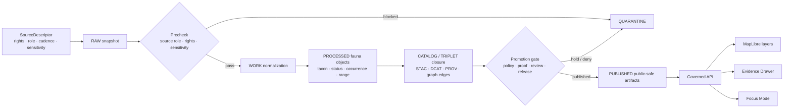

<!-- [KFM_META_BLOCK_V2]
doc_id: kfm://doc/TODO-uuid-after-repo-registration
title: Fauna Domain README
type: standard
version: v1
status: draft
owners: TODO(fauna-domain-stewards)
created: TODO(verify-original-created-date-or-set-on-first-commit)
updated: 2026-04-22
policy_label: TODO(verify-public-or-restricted)
related: ["source:KFM_Fauna_Architecture_PDF_Only_Report.pdf", "source:KFM_Habitat_Fauna_Thin_Slice_Extended_Pro_Blueprint.pdf", "source:KFM_MapLibre_UI_Architecture_and_Governed_Interaction_Design.pdf", "source:Kansas_Frontier_Matrix_Pipeline_Living_Implementation_Manual_v0.2.pdf"]
tags: [kfm, fauna, wildlife, geoprivacy, evidence, domain-readme]
notes: [Repo checkout was not mounted during authoring; doc_id, owners, created date, policy label, and relative repo links need verification.]
[/KFM_META_BLOCK_V2] -->

# Fauna Domain

Governed entrypoint for wildlife, taxonomic, occurrence, range, habitat-support, sensitivity, and public-safe fauna knowledge in Kansas Frontier Matrix.

<a id="top"></a>

<p>
  
  
  
  
  
</p>

> [!IMPORTANT]
> **Status:** experimental  
> **Owners:** TODO(fauna-domain-stewards)  
> **Current posture:** this README is source-grounded documentation for the requested path, not proof that the real repository already contains the described implementation.  
> **Quick jumps:** [Scope](#scope) · [Repo fit](#repo-fit) · [Inputs](#inputs) · [Exclusions](#exclusions) · [Lifecycle](#lifecycle) · [Source roles](#source-roles) · [Public safety](#public-safety) · [Review gates](#review-gates) · [Open verification](#open-verification)

---

## Scope

The fauna lane covers animal-related spatial evidence and public-safe derived products for KFM. It is not “just a species map.” It is a governed domain lane where claims about taxa, status, sightings, monitoring, range, seasonal use, habitat support, corridors, assemblages, disease, mortality, invasives, and public layers must remain traceable to admissible evidence and policy state.

**CONFIRMED doctrine:** KFM’s public value is the inspectable claim: a statement reconstructable to evidence, spatial and temporal scope, source role, policy posture, review state, release state, and correction lineage.

**PROPOSED fauna realization:** build the lane in small, reversible slices: repo evidence inventory, schema-home ADR, source registry, core contracts, public-safety validators, synthetic public-safe thin slice, then verified source connectors.

**UNKNOWN implementation depth:** package manager, schema home, API app, UI app, policy toolchain, source registry, CI workflows, runtime behavior, dashboards, and release artifacts must be verified in the actual checkout.

### What this README should do

- Orient contributors to the fauna lane without implying implementation that has not been verified.
- Preserve prior fauna and habitat+fauna lineage instead of restarting from zero.
- Keep sensitive species, exact location, source-rights, and steward-review rules visible at the point of contribution.
- Point future implementation toward contracts, fixtures, validators, receipts, catalog closure, governed API payloads, and rollback before live connectors or public layers.

[Back to top](#top)

---

## Repo fit

| Item | Status | Path / relationship |
|---|---:|---|
| README target | **CONFIRMED from task** | `docs/domains/fauna/README.md` |
| Directory role | **PROPOSED** | Human-facing domain orientation and control-plane landing page. |
| Baseline source | **CONFIRMED attached corpus** | `KFM_Fauna_Architecture_PDF_Only_Report.pdf` |
| Adjacent lane | **NEEDS VERIFICATION** | `docs/domains/habitat/README.md` or equivalent habitat doc. |
| Adjacent lane | **NEEDS VERIFICATION** | `docs/domains/flora/README.md` or equivalent flora doc. |
| Upstream governance | **NEEDS VERIFICATION** | documentation authority ledger, source registry, policy registry, schema registry, and ADR index. |
| Downstream consumers | **PROPOSED** | governed API, MapLibre layer registry, Evidence Drawer payloads, Focus Mode, release bundles, catalog/proof objects. |
| Machine contracts | **CONFLICTED / NEEDS VERIFICATION** | schema home must be resolved before adding `schemas/contracts/v1/fauna/*` or `contracts/fauna/*`. |
| Live source connectors | **BLOCKED** | no KDWP, USFWS, GBIF, eBird, iNaturalist, NatureServe, EDDMapS, or similar connector should be enabled until source terms and source role are verified. |

> [!NOTE]
> Relative upstream and downstream links are intentionally left as path text until the real repository tree is mounted. Add clickable relative links only after confirming the target files exist.

[Back to top](#top)

---

## Inputs

### Accepted inputs for this documentation directory

This directory should accept **human-facing, reviewable domain documentation**, not raw data or generated artifacts.

| Input | Accepted here? | Conditions |
|---|---:|---|
| Domain overview and lane rules | ✅ | Must preserve KFM truth labels and evidence posture. |
| Source-role guidance | ✅ | Must distinguish legal authority, occurrence support, context, model, mirror, and documentary roles. |
| Sensitivity and geoprivacy guidance | ✅ | Must fail closed for exact protected locations and unknown rights. |
| ADR summaries and links | ✅ | Link to the canonical ADR after repo verification. |
| Validation expectations | ✅ | Human-readable explanation belongs here; machine reports belong in validator output locations. |
| Synthetic thin-slice walkthrough | ✅ | Must be clearly fixture-only and not confused with production data. |
| Release and rollback runbook links | ✅ | Must distinguish receipts, proofs, catalogs, manifests, and corrections. |

### Accepted fauna-lane source classes

| Source class | Intake posture | Notes |
|---|---:|---|
| Synthetic public-safe fixtures | **ACCEPT FIRST** | Used to validate lifecycle, geoprivacy, catalog closure, API payloads, Focus outcomes, and rollback without live-source risk. |
| Kansas legal/status/range sources | **NEEDS VERIFICATION** | Use as legal/status context only after source descriptor, rights, and stewardship review. |
| Federal legal/status/critical-habitat sources | **NEEDS VERIFICATION** | Use federal authority separately from Kansas authority. Do not collapse jurisdictions. |
| Occurrence aggregators | **DEFER** | GBIF/eBird/iNaturalist/iDigBio/BISON-like sources require record-level rights, bias, source-role, and geoprivacy controls. |
| Monitoring records | **RESTRICT BY DEFAULT** | Exact monitoring, nest, den, roost, hibernaculum, spawning, telemetry, and controlled-access records require steward review. |
| Habitat/context layers | **SUPPORT ONLY** | Land cover, habitat, range, and model layers can support claims; they are not occurrence proof by themselves. |
| Derived model surfaces | **DERIVED ONLY** | Richness, density, suitability, corridor, and assemblage products must remain rebuildable derivatives, not canonical truth. |

[Back to top](#top)

---

## Exclusions

The fauna documentation directory must not become a dumping ground for data, secrets, generated outputs, or bypass routes.

| Does not belong here | Goes instead | Why |
|---|---|---|
| Raw source snapshots | `data/raw/fauna/...` **PROPOSED / NEEDS VERIFICATION** | Raw data belongs behind lifecycle controls, not in docs. |
| Work-in-progress normalized records | `data/work/fauna/...` **PROPOSED / NEEDS VERIFICATION** | WORK is not public documentation. |
| Quarantined or restricted records | `data/quarantine/fauna/...` or restricted store **PROPOSED / NEEDS VERIFICATION** | Quarantine and restricted data must not leak into GitHub docs. |
| Exact sensitive coordinates | Restricted canonical store only | Public docs, public APIs, public layers, screenshots, and examples must not expose them. |
| Credentials, tokens, API keys | Secret manager / environment-specific config | Never commit secrets to docs. |
| Machine JSON Schemas | `schemas/contracts/v1/fauna/...` or `contracts/fauna/...` after ADR | Schema authority is unresolved until repo inspection. |
| Rego / policy-as-code | `policy/fauna/...` **PROPOSED / NEEDS VERIFICATION** | Policy files need testable toolchain placement. |
| Validator code | `tools/validators/fauna/...` or package-native validator home | Docs can explain validators; validators must be executable elsewhere. |
| Generated validation reports | `build/fauna/reports/...` **PROPOSED / NEEDS VERIFICATION** | Generated reports should be reproducible outputs. |
| Public tiles and layer artifacts | `data/published/fauna/...` or release artifact store | Derived public artifacts need release manifests and rollback targets. |
| Direct model output | Nowhere as truth | AI can interpret released evidence; it cannot become the root evidence object. |

[Back to top](#top)

---

## Directory tree

**PROPOSED companion layout — NEEDS VERIFICATION before creating files.**

```text
docs/domains/fauna/
├── README.md                         # this file
├── CONTROL_PLANE.md                  # PROPOSED: domain doc registry, owners, source status
├── SOURCE_ROLES.md                   # PROPOSED: fauna source-role taxonomy and examples
├── GEOPRIVACY.md                     # PROPOSED: public geometry and sensitive-location rules
├── VALIDATION.md                     # PROPOSED: human-readable validator and gate guide
├── MIGRATION_AND_CONTINUITY.md       # PROPOSED: prior-gain preservation and old-to-new mappings
└── runbooks/
    ├── release-dry-run.md            # PROPOSED: fixture-only promotion rehearsal
    └── rollback.md                   # PROPOSED: release rollback and correction workflow
```

Directory creation should wait until the repo’s existing documentation pattern, ADR convention, and source registry home are verified.

[Back to top](#top)

---

## Lifecycle

The fauna lane follows the KFM trust path. Publication is a governed state transition, not a file move.



### Lifecycle rules

1. **RAW is not public.** Public clients must not read RAW, WORK, QUARANTINE, or restricted stores.
2. **Derived layers are rebuildable.** Tiles, summaries, graph projections, search indexes, and AI summaries must never replace canonical evidence.
3. **Evidence resolves before claims.** EvidenceRef must resolve to EvidenceBundle before a popup, drawer, Focus answer, export, or public API response makes a consequential statement.
4. **Negative outcomes are first-class.** ABSTAIN, DENY, HOLD, QUARANTINE, and ERROR are expected safety outcomes, not edge cases.
5. **Rollback is designed in.** Release bundles, layer aliases, receipts, proofs, and derived artifacts must support rebuild or withdrawal.

[Back to top](#top)

---

## Fauna object families

| Object family | Status | Role |
|---|---:|---|
| `Taxon` | **PROPOSED** | Stable taxonomic identity with deterministic key, authority scope, synonym/ambiguous handling, and migration mapping. |
| `SpeciesStatus` | **PROPOSED** | Legal/conservation status by jurisdiction, source, date, review state, and authority role. |
| `OccurrenceRecord` / `OccurrenceEvidence` | **PROPOSED** | Evidence-bound observation, specimen, survey, acoustic, telemetry, mortality, or documentary support. |
| `MonitoringEvent` | **PROPOSED** | Survey or monitoring context with controlled-access and steward-review posture. |
| `RangeFeature` / `SeasonalRange` | **PROPOSED** | Range, breeding, wintering, migratory, modeled, or generalized support. |
| `HabitatSupportRelation` | **PROPOSED** | Link between occurrence/taxon/range and habitat or land-cover support without making the join canonical truth. |
| `SensitivityPolicy` | **PROPOSED** | Rules for public geometry class, embargo, steward review, quarantine, and redaction. |
| `RedactionReceipt` | **PROPOSED** | Before/after hash, transform class, reason, policy version, actor/run, and EvidenceRefs for public-safe transforms. |
| `EvidenceBundle` | **PROPOSED / shared** | Inspectable evidence container for claims, payloads, and Focus answers. |
| `DecisionEnvelope` | **PROPOSED / shared** | Finite outcome wrapper for PASS/HOLD/DENY/ABSTAIN/ERROR-style decisions. |
| `LayerManifest` | **PROPOSED / shared** | Public layer contract tying source, style, artifact digest, policy state, and evidence references. |
| `RunReceipt` / `ReleaseBundle` | **PROPOSED / shared** | Execution and release proof objects for reproducibility, rollback, and correction lineage. |

### Anti-collapse rules

- A **taxon** is not an occurrence.
- An **occurrence** is not a range.
- A **range** is not legal status.
- A **habitat model** is not an animal observation.
- An **aggregator record** is not automatically a legal or conservation authority.
- A **public layer** is not canonical truth.
- An **AI answer** is not evidence.

[Back to top](#top)

---

## Source roles

Source roles are part of the meaning of a claim. They are not decorative metadata.

| Source role | Can support | Must not be used as |
|---|---|---|
| `legal_status_authority` | Kansas or federal legal/conservation status after verification. | Occurrence proof. |
| `taxonomic_authority` | Nomenclature, rank, synonym, accepted name, and authority scope. | Location proof or public release permission. |
| `occurrence_source` | Observation, specimen, monitoring, or documentary occurrence support. | Legal-status authority unless explicitly authoritative for that purpose. |
| `occurrence_aggregator` | Discovery and occurrence evidence with caveats, rights, bias, and source lineage. | Sovereign truth, legal status, or public exact-location permission. |
| `monitoring_source` | Survey effort, detection/non-detection context, seasonal or protocol evidence. | Public exact geometry without sensitivity review. |
| `habitat_context` | Environmental support or context for interpretation. | Proof that a species was present. |
| `derived_model` | Suitability, richness, density, corridor, or assemblage support. | Canonical observation or legal status. |
| `documentary_source` | Historical or narrative evidence when reviewed and cited. | Precise geometry unless source quality supports it. |

> [!WARNING]
> Unknown `source_role`, unknown rights, or unclear sensitivity must block public promotion. The safe state is HOLD, QUARANTINE, ABSTAIN, or DENY until the source descriptor is resolved.

[Back to top](#top)

---

## Public safety

The fauna lane has a conservative public boundary because animal-location data can expose protected species, nests, dens, roosts, hibernacula, spawning areas, monitoring sites, controlled-access steward records, and private-land contexts.

### Public geometry classes

| Class | Public behavior |
|---|---|
| `public_exact_allowed` | Exact geometry may publish only when taxon, source rights, source geoprivacy, coordinate uncertainty, and review state allow it. |
| `public_generalized` | Publish county, grid, watershed, bounding box, or generalized support with redaction receipt. |
| `restricted_precise` | Never publish exact coordinates to public API, public layer, Focus Mode, search, graph projection, screenshot, or export. |
| `embargoed` | Delay or suppress public release until embargo rules are satisfied. |
| `steward_review_required` | HOLD until authorized steward review resolves release class. |
| `quarantine` | Do not promote; rights, sensitivity, taxonomy, geometry, or source role remains unresolved. |

### Fail-closed checks

A fauna public artifact must fail validation when:

- restricted geometry appears in a public payload;
- sensitive occurrence data is published as an exact point;
- source geoprivacy flags are ignored;
- unknown rights are promoted;
- a redaction transform lacks a receipt;
- a public tile, label, popup, graph edge, screenshot, or search index can reverse-engineer a protected precise location;
- a Focus Mode answer includes restricted fields or uncited claims.

[Back to top](#top)

---

## API, UI, and governed AI boundary

The fauna lane is consumed through governed interfaces. Normal UI and public clients do not read canonical/internal stores.

| Surface | Required posture |
|---|---|
| Governed API | Returns public-safe, policy-checked payloads only. Separates Kansas authority, federal authority, occurrence support, derived support, and restricted state. |
| MapLibre layer | Consumes released layer manifests and public-safe tiles or GeoJSON only. Does not compute trust state in the browser. |
| Evidence Drawer | Shows EvidenceBundle, source role, rights posture, sensitivity transform, review state, release state, and correction lineage. |
| Focus Mode | Produces bounded ANSWER / ABSTAIN / DENY / ERROR outcomes over admissible released evidence. |
| AI runtime | Interpretive only. It must not read RAW, WORK, QUARANTINE, restricted coordinates, or unpublished candidate data directly. |

> [!NOTE]
> A beautiful map is not evidence. A fluent explanation is not evidence. The release-grade object is the inspected claim with resolved evidence, policy, review, and release state.

[Back to top](#top)

---

## Quickstart

Use this as a verification-first sequence after mounting the real repository.

### 1. Confirm repository reality

```bash
git status --short
git branch --show-current
find .github docs contracts schemas policy data apps packages tools tests pipelines migrations configs release \
  -maxdepth 3 -type f 2>/dev/null | sort | sed -n '1,200p'
```

Expected result: actual repo conventions are visible before adding or editing files.

### 2. Inventory existing fauna and adjacent work

```bash
grep -RInE "fauna|wildlife|species|taxon|occurrence|sensitivity|geoprivacy|EvidenceBundle|DecisionEnvelope|LayerManifest" \
  docs contracts schemas policy data apps packages tools tests 2>/dev/null | sed -n '1,200p'
```

Expected result: existing files are preserved, mapped, migrated, or explicitly marked out of scope. Do not overwrite prior gains blindly.

### 3. Resolve schema home before machine files

```bash
# PROPOSED ADR target; verify repo ADR convention first.
docs/adr/ADR-fauna-schema-home.md
```

Expected result: one canonical schema home is selected, and any legacy path becomes an alias or migration note rather than a competing authority.

### 4. Run the synthetic slice before live connectors

```bash
# PROPOSED commands; adjust to repo-standard tooling after verification.
python tools/validators/fauna/run_all.py \
  --fixture tests/fixtures/fauna/synthetic_public_safe_occurrence.json

conftest test policy/fauna tests/fixtures/fauna
```

Expected result: public-safe synthetic fixture PASS/HOLD is reproducible; live connector activation remains disabled until source verification.

[Back to top](#top)

---

## Usage patterns

### Adding a new fauna source

1. Create or update a `SourceDescriptor`.
2. Record source role, rights, access method, cadence, freshness signals, attribution, sensitivity, and release limits.
3. Add valid and invalid fixtures.
4. Run source registry and policy validators.
5. Keep live fetch disabled until official source terms and steward review are complete.

### Adding a public occurrence derivative

1. Resolve taxon and source identity.
2. Classify sensitivity and rights.
3. Derive public geometry.
4. Emit `RedactionReceipt`.
5. Link to `EvidenceBundle`.
6. Emit catalog/provenance closure.
7. Publish only through release manifest and governed API.

### Adding Focus Mode support

1. Use released, policy-safe payloads only.
2. Require EvidenceBundle resolution.
3. Return finite outcome: `ANSWER`, `ABSTAIN`, `DENY`, or `ERROR`.
4. Deny restricted fields and abstain when evidence is insufficient.
5. Preserve citation validation and response receipt.

[Back to top](#top)

---

## Review gates

Before a fauna PR is merged, reviewers should be able to check the following.

- [ ] Repo scan evidence is attached or referenced.
- [ ] README metadata block has registered `doc_id`, owners, dates, and policy label.
- [ ] Existing fauna, habitat+fauna, flora, and shared proof-object work has been inventoried.
- [ ] Schema-home ADR is accepted before machine schemas are added.
- [ ] Source descriptors include source role, rights, cadence, access method, freshness, sensitivity, and attribution.
- [ ] Unknown source role or unknown rights deny public promotion.
- [ ] Sensitive exact geometry cannot reach public API, layer, search, graph, Focus, screenshot, or export payloads.
- [ ] Taxonomy ambiguity produces HOLD/ABSTAIN rather than silent merge.
- [ ] Redaction transforms emit receipts with before/after hashes.
- [ ] EvidenceRefs resolve to EvidenceBundles before public claims are made.
- [ ] Catalog/proof/release objects stay separate and cross-referential.
- [ ] Synthetic thin slice runs before any live connector.
- [ ] MapLibre consumes released layer manifests, not raw source stores.
- [ ] Evidence Drawer shows source role, policy posture, review state, and correction lineage.
- [ ] Focus Mode renders ABSTAIN/DENY/ERROR states, not only happy-path answers.
- [ ] Rollback path identifies derived artifacts, caches, aliases, release bundles, and correction notices.

[Back to top](#top)

---

## Open verification

| Item | Status | Needed proof |
|---|---:|---|
| Real repo path exists | **UNKNOWN** | Mounted checkout with `docs/domains/fauna/README.md` or target directory. |
| Owners | **TODO** | CODEOWNERS, team roster, or governance registry. |
| Metadata `doc_id` | **TODO** | Registered KFM document UUID or canonical ID. |
| Policy label | **TODO** | Repo policy classification or steward decision. |
| Schema home | **CONFLICTED** | ADR selecting `schemas/contracts/v1/fauna` or `contracts/fauna` and migration rules. |
| API app/router convention | **UNKNOWN** | Direct route tree inspection. |
| UI shell location | **UNKNOWN** | Direct MapLibre/Evidence Drawer/Focus implementation inspection. |
| Policy engine and command | **UNKNOWN** | OPA/Conftest/Rego or repo-native policy toolchain evidence. |
| Source rights | **NEEDS VERIFICATION** | Official source terms, record-level licenses, redistribution rules, and attribution. |
| Sensitive species policy | **NEEDS VERIFICATION** | Steward rules, protected species handling, exact-location exposure policy. |
| Promotion gate | **UNKNOWN** | CI/workflow, proof-pack, release manifest, and dry-run evidence. |

[Back to top](#top)

---

## FAQ

### Can exact protected-species locations be published?

No. Exact restricted coordinates fail closed. Public output requires an allowed public geometry class, redaction/generalization where required, and a receipt explaining the transform.

### Can occurrence aggregators be treated as authoritative legal status sources?

No. Aggregators can support occurrence evidence when rights and source roles are verified. Legal or conservation status requires the correct legal/status authority for the jurisdiction.

### Can a habitat layer prove an animal occurred somewhere?

No. Habitat context can support interpretation, suitability, or range reasoning, but it is not occurrence proof by itself.

### Is this README proof that the fauna lane is implemented?

No. This README is repo-ready documentation content for the requested path. Implementation claims remain UNKNOWN until source files, tests, workflows, logs, or generated artifacts are inspected in the real repository.

[Back to top](#top)

---

## Appendix

<details>
<summary>Proposed companion file-home matrix</summary>

| Family | Proposed home | Status |
|---|---|---:|
| Domain README | `docs/domains/fauna/README.md` | Requested |
| Schema-home ADR | `docs/adr/ADR-fauna-schema-home.md` | PROPOSED / NEEDS VERIFICATION |
| Source registry | `data/registry/fauna/sources.yml` | PROPOSED / NEEDS VERIFICATION |
| Sensitivity policies | `data/registry/fauna/sensitivity_policies.yml` | PROPOSED / NEEDS VERIFICATION |
| Taxonomy authorities | `data/registry/fauna/taxa_authorities.yml` | PROPOSED / NEEDS VERIFICATION |
| Verification backlog | `data/registry/fauna/verification_backlog.yml` | PROPOSED / NEEDS VERIFICATION |
| Machine schemas | `schemas/contracts/v1/fauna/*.schema.json` | PROPOSED / CONFLICTED |
| Legacy schema alias | `contracts/fauna/*.schema.json` | NEEDS VERIFICATION |
| Rego policies | `policy/fauna/*.rego` | PROPOSED / NEEDS VERIFICATION |
| Validators | `tools/validators/fauna/*` | PROPOSED / NEEDS VERIFICATION |
| Fixtures | `tests/fixtures/fauna/*` | PROPOSED / NEEDS VERIFICATION |
| Synthetic source | `data/raw/fauna/synthetic/*` | PROPOSED / fixture-only |
| Processed objects | `data/processed/fauna/*` | PROPOSED / NEEDS VERIFICATION |
| Catalog records | `data/catalog/fauna/*` | PROPOSED / NEEDS VERIFICATION |
| Receipts | `data/receipts/fauna/*` | PROPOSED / NEEDS VERIFICATION |
| Proofs | `data/proofs/fauna/*` | PROPOSED / NEEDS VERIFICATION |
| Public artifacts | `data/published/fauna/*` | PROPOSED / NEEDS VERIFICATION |
| API contract | `contracts/api/fauna/*` | PROPOSED / NEEDS VERIFICATION |
| Layer manifest | `layers/fauna/*.layer.json` | PROPOSED / NEEDS VERIFICATION |

</details>

<details>
<summary>Minimum synthetic thin-slice acceptance path</summary>

```text
synthetic public-safe source fixture
  -> RAW snapshot
  -> source descriptor validation
  -> taxonomy normalization
  -> occurrence normalization
  -> sensitivity classification
  -> public geometry derivation
  -> redaction receipt
  -> processed fauna object
  -> EvidenceBundle
  -> STAC/DCAT/PROV closure
  -> LayerManifest
  -> governed API fixture
  -> Evidence Drawer fixture
  -> Focus ANSWER / ABSTAIN / DENY / ERROR fixture
  -> promotion dry-run PASS or HOLD with obligations
```

The thin slice must remain fixture-only until live source rights, sensitivity, source role, and steward review are verified.

</details>
