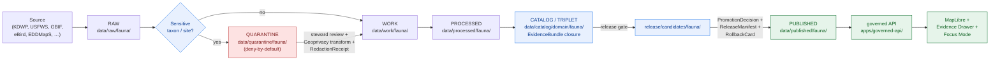

<!-- [KFM_META_BLOCK_V2]
doc_id: kfm://doc/domains/fauna/readme
title: KFM Fauna Domain Lane
type: standard
version: v1.2.0
status: draft
owners: ["@bartytime4life — CODEOWNERS review route", "NEEDS VERIFICATION — fauna domain steward; docs steward; independent reviewer"]
created: 2026-05-16
updated: 2026-08-28
policy_label: public
owning_root: docs/
responsibility: Human-readable scope, boundaries, maturity, sensitivity posture, and navigation for the Fauna domain lane
truth_posture: "CONFIRMED current repository paths, accepted Directory Rules placement, default CODEOWNERS review routing, and bounded synthetic validation / PARTIAL mixed implementation maturity / UNKNOWN source admission, production retrieval, runtime behavior, accountable stewardship, independent review, release, deployment, promotion, and publication / NEEDS VERIFICATION before positive operational claims"
related:
  - docs/domains/README.md
  - docs/doctrine/directory-rules.md
  - docs/doctrine/ai-build-operating-contract.md
  - docs/runbooks/fauna/SOURCE_REFRESH_RUNBOOK.md
  - docs/standards/PROV.md
  - contracts/domains/fauna/
  - schemas/contracts/v1/domains/fauna/
  - policy/domains/fauna/
  - policy/sensitivity/fauna/
  - tests/domains/fauna/
  - fixtures/domains/fauna/
  - data/registry/sources/fauna/
  - release/candidates/fauna/
tags: [kfm, domain, fauna, sensitivity, geoprivacy, evidence-first]
notes:
  # Repository paths and bounded synthetic validation were inspected at main@d0816eed65852b22577b9003e86159fd48f134df; presence, execution, review, release, and publication remain separate states.
  # Public exact sensitive occurrence release is denied by default (Fauna sensitive occurrence = T4).
  # Doctrine-adjacent doc; CONTRACT_VERSION = "3.0.0" pinned per AI Build Operating Contract v3.0.
  # Atlas anchors: v1.1 Ch. 7 (Fauna), §20.5 (Deny-by-Default Register), §24.3 (Outcome Envelope), §24.5 (Sensitivity Tiers).
[/KFM_META_BLOCK_V2] -->

<a id="top"></a>

# KFM Fauna Domain Lane

> Governance, evidence, and publication doctrine for animal taxonomy, occurrences, ranges, monitoring, and sensitive-site records inside the Kansas Frontier Matrix.

<p align="center">
  <b>Evidence-first · Sensitivity-aware · Deny-by-default · Reversible</b>
</p>

---


**Status:** draft; repository-grounded; mixed implementation maturity · **Review route:** `@bartytime4life` via CODEOWNERS; Fauna stewardship and independent review remain `NEEDS VERIFICATION` · **Last updated:** 2026-08-28 · **`CONTRACT_VERSION = "3.0.0"`**

---

## Quick links

- [1. Scope](#1-scope)
- [2. Repo fit](#2-repo-fit)
- [3. What belongs here](#3-what-belongs-here)
- [4. What does NOT belong here](#4-what-does-not-belong-here)
- [5. Current repository snapshot](#5-current-repository-snapshot)
- [6. Quickstart](#6-quickstart)
- [7. Usage and contribution paths](#7-usage-and-contribution-paths)
- [8. Lifecycle and sensitivity diagram](#8-lifecycle-and-sensitivity-diagram)
- [9. Reference tables](#9-reference-tables)
- [10. Open questions register](#10-open-questions-register)
- [11. Verification backlog](#11-verification-backlog)
- [12. Changelog](#12-changelog)
- [13. Definition of done](#13-definition-of-done)
- [14. FAQ](#14-faq)
- [15. Related docs](#15-related-docs)
- [16. Appendix and §15 README contract crosswalk](#16-appendix-and-15-readme-contract-crosswalk)

---

## 1. Scope

**REPOSITORY-GROUNDED documentation / MIXED implementation.** The Fauna lane governs animal taxonomic identity, conservation and legal status, occurrence and monitoring evidence, ranges and seasonal ranges, migration, sensitive-site records, mortality, disease, invasive species, geoprivacy, public-safe derivatives, and bounded governed-API surfaces. Current main contains substantial contracts, schema projections, policy files, public-safe synthetic fixtures, validators, tests, and six Fauna workflow definitions. The source registry has no admitted descriptor beyond its boundary files, the proof and release-candidate lanes have no task artifacts, and runtime delivery, release, deployment, promotion, and publication remain held. [DOM-FAUNA] [DOM-HF] [ENCY]

The lane is a **bounded responsibility area inside shared KFM governance**. It does **not** own root-folder authority, global schema-home decisions, publication law, or bypasses around the governed API. It expresses domain object families, source roles, validators, policy gates, pipelines, catalog entries, graph edges, UI layers, Evidence Drawer payloads, and Focus Mode constraints **within** the trust membrane defined by [Directory Rules][dir-rules] and the [Encyclopedia][ency-link].

> [!IMPORTANT]
> **Sensitivity posture is the lane's anchor invariant.** Sensitive taxa, nests, dens, roosts, hibernacula, spawning sites, steward-controlled records, and exact occurrence geometry **fail closed** unless a documented geoprivacy transform **and** a recorded review state authorize release. Public exact-occurrence tiles for sensitive taxa are **denied**. Sensitive occurrence defaults to **T4** and may move only to **T1** via `geoprivacy generalization + RedactionReceipt + ReviewRecord + PolicyDecision`. [DOM-FAUNA] [ENCY Atlas §24.5.2]

[Back to top ↑](#top)

---

## 2. Repo fit

**Path:** `docs/domains/fauna/README.md` — the canonical human-facing entry point for the Fauna lane.
**Authority level:** Canonical (within `docs/`) — domain-lane README, not a root-level authority.
**Lane authority shape:** lifecycle, schema, contract, policy, fixture, test, pipeline, registry, and release homes are distributed across responsibility roots per **Directory Rules §12 (Domain Placement Law)** and the §4 Step-3 domain-segment list. The Fauna lane does **not** become a root folder. [DIRRULES §3, §4 Step 3, §12]

| Aspect | Value | Status |
|---|---|---|
| Owning responsibility root | `docs/` (human-facing control plane) | CONFIRMED rule [DIRRULES §6.1] |
| Domain segment | `fauna` (as segment under each responsibility root) | CONFIRMED rule [DIRRULES §4 Step 3] |
| Schema home | `schemas/contracts/v1/domains/fauna/` | **PRESENT** — 35 non-README entries; ADR-0001 remains proposed, so presence is not acceptance or runtime proof |
| Contract home | `contracts/domains/fauna/` | **PRESENT** — 20 non-README semantic contract files; maturity remains file-specific |
| Policy home | `policy/domains/fauna/` + `policy/sensitivity/fauna/` | **PRESENT / MIXED** — Rego and mapping files exist; evaluator binding and accepted policy authority remain file-specific |
| Source registry | `data/registry/sources/fauna/` | **BOUNDARY ONLY** — `README.md` plus `.gitkeep`; no admitted source descriptor was observed |
| Release candidates | `release/candidates/fauna/` | **BOUNDARY ONLY** — `README.md`; no candidate record was observed |
| Companion runbooks | `docs/runbooks/fauna/` | **PRESENT** — lane README plus nine repository-grounded child procedures; operational maturity remains mixed |

> [!NOTE]
> Per **§12 Multi-domain and cross-cutting rule**, files that legitimately span domains (e.g., a habitat × fauna × hydrology validator) live under the **lowest common responsibility root without a domain segment** — `tools/validators/<topic>/`, `schemas/contracts/v1/<topic>/`, `docs/architecture/<topic>.md` — **not** under `docs/domains/fauna/`. Pairings with the Habitat lane belong under the **Habitat + Fauna thin-slice** dossier `[DOM-HF]`, not here. [DIRRULES §12]

[Back to top ↑](#top)

---

## 3. What belongs here

`docs/domains/fauna/` is the prose layer of the Fauna lane. It explains, it crosswalks, and it points readers at the machine-bearing homes elsewhere in the repo.

Current repository-grounded content under `docs/domains/fauna/` includes:

| Content family | Current files | Boundary |
|---|---|---|
| Lane orientation and architecture | `README.md`, `ARCHITECTURE.md`, `CANONICAL_PATHS.md`, `FILE_SYSTEM_PLAN.md` | Documentation only; accepted Directory Rules control placement |
| Objects and identity | `OBJECTS.md`, `OBJECT_FAMILIES.md`, `IDENTITY_MODEL.md`, `SCHEMAS.md` | Explanatory projection; contracts and schemas own machine meaning and shape |
| Sources and roles | `SOURCES.md`, `SOURCE_FAMILIES.md`, `SOURCE_REGISTRY.md`, `SOURCE_ROLES.md` | No source admission or live connector authority |
| Sensitivity and policy | `SENSITIVITY.md`, `SENSITIVITY_POSTURE.md`, `POLICY.md` | Exact sensitive locations remain fail-closed |
| Lifecycle, release, and UI | `DATA_LIFECYCLE.md`, `RELEASE_INDEX.md`, `MAP_UI_CONTRACTS.md`, `API_CONTRACTS.md` | Documentation does not establish a release, route, deployment, or publication |
| Cross-lane and continuity | `CROSS_LANE_RELATIONS.md`, `CONTINUITY_INVENTORY.md`, `PRESERVATION_MATRIX.md` | Relations do not transfer source or domain authority |
| Open work | `OPEN_QUESTIONS.md`, `VERIFICATION_BACKLOG.md`, `MISSING_OR_PLANNED_FILES.md`, `EXPANSION_BACKLOG.md` | Candidate work remains subordinate to current repository evidence |

[Back to top ↑](#top)

---

## 4. What does NOT belong here

`docs/domains/fauna/` is human-facing. It is **not** a truth store, not a publication authority, not a policy engine, and not a substitute for machine-checkable governance.

> [!WARNING]
> Files that are placed here by mistake should be migrated to their owning responsibility root, **not** kept here. Follow the §14 migration discipline in Directory Rules for any move. [DIRRULES §14]

| If the file is… | …it belongs in | Why |
|---|---|---|
| A JSON Schema for a Fauna object | `schemas/contracts/v1/domains/fauna/` | Schema home per ADR-0001 [DIRRULES §13.1] |
| A semantic object definition | `contracts/domains/fauna/` | Object meaning lives in contracts [DIRRULES §4 Step 1] |
| A policy / OPA bundle | `policy/domains/fauna/` or `policy/sensitivity/fauna/` | Admissibility decisions are policy |
| A validator (runnable) | `tools/validators/...` (with `domains/fauna/` only if fauna-specific) | Validators are tools, not docs |
| A test or fixture | `tests/domains/fauna/`, `fixtures/domains/fauna/` | Proof and golden data are separate |
| A connector / fetcher | `connectors/<source_id>/` | Output goes to `data/raw/fauna/...` |
| A pipeline step | `pipelines/domains/fauna/` (or shared `pipelines/<phase>/`) | Pipelines are executable logic |
| RAW, WORK, PROCESSED, CATALOG, or PUBLISHED artifact | `data/<phase>/fauna/...` | Lifecycle phases live in `data/` |
| A release manifest / rollback card | `release/candidates/fauna/`, `release/manifests/`, `release/rollback_cards/` | Release decisions live in `release/` |
| A habitat patch, suitability surface, or habitat assignment | **Habitat** lane (`[DOM-HAB]`) | Habitat owns habitat patches and suitability |
| A plant record (specimen/observation) | **Flora** lane (`[DOM-FLORA]`) | Flora owns plant records |
| A human / DNA / land record | **People/Genealogy/DNA/Land** lane (`[DOM-PEOPLE]`) | Deny-default lane |
| An archaeological site record | **Archaeology** lane (`[DOM-ARCH]`) | Deny-default lane |
| A cross-cutting renderer concern | `packages/maplibre/` (and `docs/architecture/...`) | Renderer is not a truth path |

**Hard exclusions** (these never appear in this lane under any framing):

- Live, unredacted exact sensitive-species coordinates.
- Steward-controlled records republished without a recorded **RedactionReceipt** + **ReviewRecord** + **PolicyDecision**.
- AI-generated narrative presented as authoritative without a resolved **EvidenceBundle** and validated citations.
- Operational emergency-alert messaging (KFM is not an alert authority; that boundary belongs to `[DOM-HAZ]`).

[Back to top ↑](#top)

---

## 5. Current repository snapshot

The table below records direct-child inventory at `main@f7af2c3dcefd38ae5e86141cfbc0931c0ef7d90f`. Counts prove path presence only; they do not establish correctness, evaluator binding, review, release, or publication.

| Responsibility lane | Direct children | Non-boundary entries | Current disposition |
|---|---:|---:|---|
| `docs/domains/fauna/` | 30 | 29 | Substantive documentation corpus; maturity remains file-specific |
| `contracts/domains/fauna/` | 21 | 20 | Semantic contracts present |
| `schemas/contracts/v1/domains/fauna/` | 36 | 35 | Schema projections present; ADR-0001 remains proposed |
| `fixtures/domains/fauna/` | 9 | 8 | Synthetic/public-safe fixture subtrees present |
| `policy/domains/fauna/` | 8 | 7 | Policy files present; accepted authority and evaluator binding remain file-specific |
| `policy/sensitivity/fauna/` | 8 | 7 | Sensitivity files present; exact-location release remains denied by default |
| `tests/domains/fauna/` | 24 | 23 | Mixed test corpus; the active smoke suite is bounded below |
| `tools/validators/fauna/` | 2 | 1 | Source-role validator subtree present |
| `tools/validators/domains/fauna/` | 8 | 7 | Domain validator modules/subtrees present |
| `docs/runbooks/fauna/` | 10 | 9 | Runbook index plus nine repository-grounded procedures |
| `data/registry/sources/fauna/` | 2 | 0 | Boundary only; no admitted source descriptor observed |
| `release/candidates/fauna/` | 1 | 0 | Boundary only; no release candidate observed |

The active workflow inventory contains `domain-fauna.yml`, `fauna-evidence-bundle-convergence.yml`, `fauna-evidence-drawer-convergence.yml`, `fauna-habitat-public-safe-assignment.yml`, `fauna-occurrence-evidence.yml`, and `fauna-tile-field-allowlist.yml`. Workflow presence is not a green exact-head result and does not establish operational readiness.

> [!NOTE]
> Cross-lane work with **Habitat** must preserve the Habitat + Fauna thin-slice boundary. Habitat outputs remain adjacent derivatives, not fauna truth. [DOM-HF] [DIRRULES §12]

[Back to top ↑](#top)

---

## 6. Quickstart

**Candidate contribution workflow.** The repository now contains many named lane surfaces, but a new source remains subject to the same governed sequence. The current source registry contains no admitted Fauna descriptor, so these steps do not authorize live access or activation. Each step is governed; none of these steps publishes anything to public clients without explicit release support.

```text
1. Read this README, then the [DOM-FAUNA] dossier and Atlas v1.1 Ch. 7 (Fauna).
2. Inspect data/registry/sources/fauna/ for existing SourceDescriptors.
3. Propose a new SourceDescriptor (rights, role, sensitivity, cadence, steward) → review.
4. Open a SourceActivationDecision: allow | restrict | deny | needs-review.
5. Author public-safe synthetic fixtures under fixtures/domains/fauna/.
6. Add schema (schemas/contracts/v1/domains/fauna/) and contract (contracts/domains/fauna/).
7. Add policy under policy/domains/fauna/ and (if sensitive) policy/sensitivity/fauna/.
8. Add tests under tests/domains/fauna/ — source-role, occurrence split, redaction receipt.
9. Wire a no-network pipeline step under pipelines/domains/fauna/ or pipeline_specs/fauna/.
10. Open a release candidate under release/candidates/fauna/ — never write data/published/ directly.
```

> [!CAUTION]
> The **first PR** for any new Fauna source MUST be **synthetic and non-live-source**: source-registry skeleton, public-safety validators, synthetic fixtures, and **no activation of live wildlife connectors**. Connector activation comes only after rights, source roles, fixtures, validators, and policy gates exist. [DOM-FAUNA]

[Back to top ↑](#top)

---

## 7. Usage and contribution paths

| Reader / actor | Likely starting point | Then go to |
|---|---|---|
| New contributor | This README → §3, §5 | `docs/doctrine/directory-rules.md` §4 Step 3, §12 |
| Domain steward | §11 verification backlog | `docs/registers/VERIFICATION_BACKLOG.md` |
| Schema author | §5 lane pattern | `schemas/contracts/v1/domains/fauna/` + ADR-0001 |
| Policy author | §9.4 sensitivity tier matrix | `policy/sensitivity/fauna/` + Atlas §24.5 |
| Pipeline author | §6 quickstart | `pipeline_specs/fauna/`, `pipelines/domains/fauna/` |
| Source maintainer | §9.2 source families table | `docs/runbooks/fauna/SOURCE_REFRESH_RUNBOOK.md` (repository-grounded procedure; live refresh remains held) |
| Reviewer / steward | §11 + §14 FAQ | `policy/sensitivity/fauna/` + ReviewRecord doctrine |
| AI / Focus Mode operator | §9.3 finite-outcomes table | `[GAI]` doctrine; AIReceipt + RuntimeResponseEnvelope |

[Back to top ↑](#top)

---

## 8. Lifecycle and sensitivity diagram

**Conceptual lifecycle diagram.** Shape reflects KFM lifecycle doctrine and Fauna-specific sensitivity branching. Current path presence is repository-grounded where listed in §5, but an arrow does not prove a producer, accepted policy, review, promotion, release, deployment, or publication. [DIRRULES] [DOM-FAUNA]


```mermaid
flowchart LR
  A["Source<br/>(KDWP, USFWS, GBIF,<br/>eBird, EDDMapS, …)"] --> B["RAW<br/>data/raw/fauna/"]
  B --> C{"Sensitive<br/>taxon / site?"}
  C -- "yes" --> Q["QUARANTINE<br/>data/quarantine/fauna/<br/>(deny-by-default)"]
  C -- "no" --> W["WORK<br/>data/work/fauna/"]
  Q -- "steward review +<br/>Geoprivacy transform +<br/>RedactionReceipt" --> W
  W --> P["PROCESSED<br/>data/processed/fauna/"]
  P --> K["CATALOG / TRIPLET<br/>data/catalog/domain/fauna/<br/>EvidenceBundle closure"]
  K -- "release gate" --> RC["release/candidates/fauna/"]
  RC -- "PromotionDecision +<br/>ReleaseManifest +<br/>RollbackCard" --> PUB["PUBLISHED<br/>data/published/fauna/"]
  PUB --> API["governed API<br/>apps/governed-api/"]
  API --> UI["MapLibre +<br/>Evidence Drawer +<br/>Focus Mode"]

  classDef deny fill:#fde2e2,stroke:#b71c1c,color:#7f1d1d;
  classDef gov fill:#e8f0fe,stroke:#1a73e8,color:#0b3d91;
  classDef pub fill:#e6f4ea,stroke:#137333,color:#0b5e1e;

  class Q deny;
  class C,K,RC gov;
  class PUB,API,UI pub;
```

**Reading the diagram.** Sensitive taxa, nests, dens, roosts, hibernacula, and spawning sites land in **QUARANTINE** by default; they only re-enter the WORK lane after **steward review + geoprivacy transform + RedactionReceipt**. Publication is a **governed state transition**, not a file move — every transition emits receipts, and rollback is always a valid target. [DIRRULES]

[Back to top ↑](#top)

---

## 9. Reference tables

### 9.1 Ubiquitous language (lane terms)

> [!NOTE]
> Terms are grounded in [DOM-FAUNA] / [DOM-HF] / [ENCY] lineage. Many corresponding semantic contracts and schema projections are now present under `contracts/domains/fauna/` and `schemas/contracts/v1/domains/fauna/`; presence does not establish accepted policy, runtime use, source authority, or release. KFM-specific casing is preserved. [ENCY Atlas §7.B–§7.C]

| Term | One-line meaning |
|---|---|
| **Taxon** | Animal taxonomic identity, scoped by source role, evidence, time, and release state. |
| **TaxonCrosswalk** | Mapping between authority taxonomies (ITIS, GBIF, KDWP, USFWS, NatureServe). |
| **ConservationStatus** | Legal / conservation classification tied to an authority source. |
| **OccurrenceEvidence** | Source-bound observational record before sensitivity split. |
| **OccurrenceRestricted** | Sensitive occurrence; geometry / metadata fail closed for public release. |
| **OccurrencePublic** | Public-safe occurrence after generalization or redaction. |
| **RangePolygon** | Aggregated species range geometry (default T1 public-safe). |
| **SeasonalRange** | Seasonal subset of range; temporal scope explicit. |
| **MigrationRoute** | Linear / corridor geometry tied to time windows. |
| **MonitoringEvent** | Monitoring / survey observation event with source attribution. |
| **SensitiveSite** | Nest / den / roost / hibernacula / spawning record (deny-default). |
| **MortalityObservation** | Recorded mortality event with source attribution. |
| **DiseaseObservation** | Disease / pathogen surveillance evidence. |
| **InvasiveSpeciesRecord** | Invasive feed entry (EDDMapS-like or steward). |
| **RedactionReceipt** | Public-safe transformation record (field- or geometry-level). |
| **Geoprivacy transform** | Documented generalization / fuzzing / withholding applied to sensitive geometry. |
| **Public-safe derivative** | Output that has passed sensitivity, rights, and release gates. |

> [!NOTE]
> **Explicit non-ownership** (Atlas §7.B). Habitat owns habitat patches and suitability; Flora owns plant records; Hydrology / soil / agriculture / roads / people provide **context only through governed joins** — never fauna truth. [ENCY Atlas §7.B] [DOM-FAUNA] [DOM-HF]

### 9.2 Key source families (rights status NEEDS VERIFICATION)

| Source family | Typical role | Sensitivity posture | Status |
|---|---|---|---|
| KDWP-like steward sources | authority / observation | sensitive joins fail closed | [DOM-FAUNA] [DOM-HF] [ENCY] — rights NEEDS VERIFICATION |
| USFWS ECOS-like federal | authority / legal status | follow federal sensitivity flags; sensitive joins fail closed | NEEDS VERIFICATION |
| NatureServe / heritage-style | authority / observation | element-occurrence sensitivity respected | NEEDS VERIFICATION |
| GBIF / eBird / iNaturalist / iDigBio / BISON | aggregator / observation | aggregator policy + record-level sensitivity respected | NEEDS VERIFICATION |
| EDDMapS / invasive feeds | observation / authority (invasives) | invasive non-target sensitivity reviewed | NEEDS VERIFICATION |
| Agency monitoring / surveys / eDNA / acoustic / telemetry | observation / model | telemetry geometry deny-default | NEEDS VERIFICATION |
| NLCD / NWI / PADUS / SSURGO (context) | context only (not fauna truth) | adjacency only via governed joins | [DOM-FAUNA] |

### 9.3 Finite governed-API outcomes

> [!NOTE]
> Outcome set and semantics are **CONFIRMED doctrine** at Atlas §24.3 and the Operating Contract §8 / finite-outcome vocabulary. `ANSWER / ABSTAIN / DENY / ERROR` are the public-surface set; `HOLD`, `PASS`, `FAIL` are review- and validator-class outcomes. [GAI] [ENCY Atlas §24.3]

| Outcome | When it applies in Fauna |
|---|---|
| **ANSWER** | EvidenceBundle resolved, PolicyDecision allow, ReleaseManifest applies. |
| **ABSTAIN** | EvidenceBundle missing, citations cannot validate, evidence stale with no released alternative. |
| **DENY** | Rights, sensitivity, source-role mismatch, or release state forbids the answer. **Default for exact sensitive occurrence requests.** |
| **ERROR** | Malformed request, missing schema, contract violation, infra failure. |
| **HOLD** | Pending steward / rights-holder review; no public claim emitted while held. |
| **PASS / FAIL** | Validator-class outcomes; internal only — do not directly emit a public answer. |

### 9.4 Sensitivity tier defaults (extends Atlas §20.5 via §24.5.2)

> [!NOTE]
> The **T0–T4** tier scheme and per-domain matrix are defined in Atlas lineage at §24.5. Repository sensitivity files and negative fixtures are present, but accepted Fauna-specific policy authority, evaluator binding, transform parameters, steward review, and public release remain `NEEDS VERIFICATION` or `HOLD`. [ENCY Atlas §24.5.1–§24.5.2]

| Object class | Default tier | Allowed motion | Required gate |
|---|---|---|---|
| Sensitive **OccurrenceRecord** | **T4** | T4 → T1 via geoprivacy generalization + RedactionReceipt | RedactionReceipt + ReviewRecord + PolicyDecision |
| **SensitiveSite** (nest/den/roost/hibernacula/spawning) | **T4** | T4 → T2 only with steward review; T4 → T1 with generalization | RedactionReceipt + ReviewRecord + PolicyDecision |
| **RangePolygon** | **T1** | Aggregate / generalized public-safe layer | AggregationReceipt or RedactionReceipt |
| **OccurrencePublic** (general taxa) | **T0** | Standard release path | ReleaseManifest + ReviewRecord |
| **InvasiveSpeciesRecord** | **T0 / T1** | Public reporting layer; landowner detail aggregated | Review where private-parcel join is implicated |

### 9.5 Validators, tests, fixtures, and workflows

| Surface | Current evidence | Bounded meaning |
|---|---|---|
| Public-safe fixture smoke suite | `tests/domains/fauna/test_fauna_smoke.py` contains eight deterministic `unittest` cases over two accepted and five fail-closed JSON fixtures | Proves only fixture validator behavior, explicit inventory, no-network guards, stable findings, and encoded/precision-clue denial |
| Public-safe fixture validator | `tools/validators/domains/fauna/validate_public_safe_fixture.py` | Fixture-only validation; not source admission, real-data validation, geoprivacy approval, or release |
| Broad Fauna workflow | `.github/workflows/domain-fauna.yml` runs the smoke suite and separately asserts explicit proof/release holds | A green held job is not an `EvidenceBundle`, ProofPack, release candidate, or publication decision |
| Focused workflows | Five additional Fauna workflow files cover EvidenceBundle convergence, Evidence Drawer convergence, Habitat assignment, occurrence evidence, and tile-field allowlisting | Each workflow proves only its own exact-head checks; workflow presence alone proves nothing |
| Wider test/validator corpus | Additional taxonomy, occurrence, redaction, publication, rollback, envelope, schema, source-descriptor, catalog, tile, UI, and policy files are present | Maturity and executable coverage remain file-specific until their exact commands and results are inspected |

The broad workflow's `build-proof-fauna` and `publish-dry-run-fauna` jobs intentionally emit explicit hold states when no accepted producer, proof artifact, release command, or candidate record exists. Those holds must not be normalized into success or readiness.

[Back to top ↑](#top)

---

## 10. Open questions register

| ID | Question | Owner role | Resolution path |
|---|---|---|---|
| OQ-FAUNA-01 | Is the first Fauna release candidate the species status / range layer or the public occurrence-density grid? | Fauna domain steward | Atlas §7.G review + release-candidate ADR |
| OQ-FAUNA-02 | Do Habitat-assignment outputs that incorporate fauna occurrence records always route through `[DOM-HF]` thin-slice review? | Habitat + Fauna stewards | `[DOM-HF]` dossier + cross-lane ADR |
| OQ-FAUNA-03 | `docs/runbooks/fauna/` is present and governed by accepted Directory Rules; what compatibility or deduplication treatment, if any, should apply to the domain-local `SOURCE_REFRESH_RUNBOOK.md`? | Docs steward | Consumer inventory plus reviewed migration/compatibility decision; do not normalize by assumption |
| OQ-FAUNA-04 | Which taxonomic resolver is canonical (ITIS / GBIF backbone / NatureServe) and what is the crosswalk-conflict policy? | Fauna domain steward | Taxonomy-resolver ADR + repo inspection |
| OQ-FAUNA-05 | Exact geoprivacy parameters (generalization radius, fuzzing distribution, withholding rules) and their home under `policy/sensitivity/fauna/`? | Policy author + steward | Atlas §24.5 ratification (ADR-S-05) |

[Back to top ↑](#top)

---

## 11. Verification backlog

Repository inspection resolves former blanket path questions but leaves authority and operational questions open.

1. **NEEDS VERIFICATION** — Live connector rights and current terms for KDWP-like, USFWS ECOS-like, NatureServe, GBIF, eBird, iNaturalist, iDigBio, BISON, and EDDMapS.
2. **NEEDS VERIFICATION** — Source-role assignments and authority boundaries for any proposed live source.
3. **NEEDS VERIFICATION** — Steward permissions, access classes, and independent review routes for sensitive Fauna lanes.
4. **CONFIRMED PRESENT / MATURITY FILE-SPECIFIC** — `schemas/contracts/v1/domains/fauna/` contains 35 non-README entries; ADR-0001 remains proposed and path presence is not acceptance, runtime use, or compatibility retirement.
5. **NEEDS VERIFICATION** — Canonical taxonomic resolver choice and conflict-preserving crosswalk policy.
6. **NEEDS VERIFICATION** — Accepted geoprivacy parameters, evaluator binding, transform confidentiality, and steward authority.
7. **CONFIRMED PRESENT / OPERATIONAL HOLD** — `docs/runbooks/fauna/` contains its index and nine repository-grounded procedures; the domain-local `SOURCE_REFRESH_RUNBOOK.md` remains a separate compatibility/duplication question and must not be normalized by assumption.
8. **PARTIAL** — Evidence Drawer schema and convergence workflow are present; governed API, released carrier, MapLibre registry, and public runtime binding remain unproved.
9. **PARTIAL** — Major responsibility-root lanes are present as recorded in §5; source admission, proof production, release candidates, live lifecycle artifacts, governed runtime delivery, and public carriers remain absent or held.
10. **NEEDS VERIFICATION** — Effective accepted policy for T0–T4 motion and Fauna-specific sensitive-location review. A detailed file, test, or proposed ADR is not acceptance.

[Back to top ↑](#top)

---

## 12. Changelog

| Change | Type (per contract §37) | Reason |
|---|---|---|
| Pinned `CONTRACT_VERSION = "3.0.0"` in meta block, badge row, and status line | housekeeping | Doctrine-adjacent doc requirement |
| Added companion sections (Open Questions register, Definition of Done) and split the prior single backlog into §10 + §11 | gap closure | Doctrine-doc companion-section pattern |
| Corrected Atlas anchors: sensitivity tiers cite **§24.5** (extending v1.0 §20.5); Fauna chapter is **Ch. 7** | reconciliation | Atlas v1.1 structure; prior FAQ over-attributed tier scheme to §20.5 |
| Tightened tier-default wording (T4 → T1 via *geoprivacy generalization* + RedactionReceipt) to match §24.5.2 | clarification | Align lane defaults to ratified-pending matrix |
| Added `MonitoringEvent` to ubiquitous-language table; added explicit non-ownership note | gap closure | Atlas §7.B owned-object list |
| Added DIRRULES section citations to §2 / §4 / §5 placement claims | clarification | Make placement basis auditable per §4 Step 5 |
| Bumped doc `version` v1 → v1.1; `updated` 2026-05-16 → 2026-06-02 | housekeeping | MINOR — no operating-law change, no receipts re-issued |
| Reconciled repository presence, bounded fixture workflow, explicit proof/release holds, CODEOWNERS routing, runbook maturity, path drift, and ADR status against current main | repository-state correction | Remove blanket `PROPOSED` and `CI TODO` claims without implying source admission, policy acceptance, review, runtime readiness, release, or publication |

> **Backward compatibility.** All prior heading anchors are preserved (`#1-scope` … `#13-appendix-and-15-readme-contract-crosswalk` retained where text was unchanged); the appendix anchor is renumbered to `#16-...` because §10–§13 were inserted for companion sections. Inbound links targeting the old `#10`–`#13` (Verification backlog, FAQ, Related docs, Appendix) should be re-pointed — see §16 anchor note.

[Back to top ↑](#top)

---

## 13. Definition of done

This document remains reviewable when:

- it is placed at `docs/domains/fauna/README.md` according to Directory Rules §4 Step 3 + §12;
- a docs steward **and** the fauna domain steward review it;
- it is linked from `docs/domains/README.md` (the domain-lane index);
- it preserves accepted ADR-0029 placement while treating ADR-0001 and other proposed records as non-authoritative until accepted;
- any conflict with current repo conventions is logged in `docs/registers/DRIFT_REGISTER.md`;
- the `GENERATED_RECEIPT.json` planned for this artifact is wired into CI;
- future changes follow the operating contract's §37 lifecycle.

[Back to top ↑](#top)

---

## 14. FAQ

> [!TIP]
> Short answers below; longer treatments live in the linked doctrine and dossiers.

**Q: Why does Fauna default to deny for sensitive occurrence locations?**
A: Exact location exposure of sensitive taxa, nests, dens, roosts, hibernacula, and spawning sites creates real-world harm risk (poaching, disturbance, habitat loss). Per Atlas §24.5.2 (extending the v1.0 §20.5 Deny-by-Default Register) and [DOM-FAUNA], such records are **T4 default**, released only via `geoprivacy generalization + RedactionReceipt + ReviewRecord + PolicyDecision`. KFM publishes only the safest representation that still answers the steward's and the public's reasonable needs.

**Q: Can I write a Fauna pipeline that publishes directly to `data/published/fauna/`?**
A: No. Lifecycle skip is an anti-pattern. Promotion is a **governed state transition**, not a file move; every transition goes RAW → WORK/QUARANTINE → PROCESSED → CATALOG/TRIPLET → PUBLISHED, gated by validators, policy, and (where required) review. [DIRRULES]

**Q: Where does a Fauna × Habitat habitat-assignment file live?**
A: Cross-domain files live under their **lowest common responsibility root without a domain segment** (Directory Rules §12). The thin-slice doctrine is `[DOM-HF]` (Habitat + Fauna). Truth remains in the owning lane; habitat outputs are **adjacent derivatives**, not fauna truth.

**Q: How does Focus Mode answer Fauna questions?**
A: Through finite envelopes only — ANSWER / ABSTAIN / DENY / ERROR — over **released** EvidenceBundles, with AIReceipt and citation validation. A `RuntimeResponseEnvelope` carries the outcome; direct model output is never the authority. [GAI]

**Q: Where does an aggregator (e.g., GBIF) sit in source-role terms?**
A: As **observation / aggregator**. An aggregator is **never** a legal-status authority and **never** a regulatory authority. Crossing roles is a tested failure mode (Atlas §24.1 Source-Role Anti-Collapse).

[Back to top ↑](#top)

---

## 15. Related docs

- **Doctrine and placement:** `docs/doctrine/directory-rules.md` (§4 Placement Protocol; §12 Domain Placement Law; §15 Required README Contract)
- **Operating contract:** `docs/doctrine/ai-build-operating-contract.md` (`CONTRACT_VERSION = "3.0.0"`)
- **Lane orientation:** `docs/domains/README.md` (repository-grounded domain lane index)
- **Standards (already authored):** `docs/standards/PROV.md`, `docs/standards/PMTILES.md`, `docs/standards/OGC-API-TILES.md`, `docs/standards/OAI-PMH.md`, `docs/standards/ISO-19115.md`
- **Fauna runbooks:** `docs/runbooks/fauna/README.md` and its nine repository-grounded child procedures; live operations remain held
- **Source descriptor standard:** `docs/sources/SOURCE_DESCRIPTOR_STANDARD.md` (PROPOSED)
- **Atlas references:** Atlas v1.1 Ch. 7 (Fauna), §20.5 (Deny-by-Default Register), §24.1 (Source-Role Anti-Collapse), §24.3 (Decision Outcome Envelope), §24.5 (Sensitivity / Rights Tiers T0–T4), §24.13 (Atlas ↔ Dossier ↔ Responsibility-Root Crosswalk)
- **Cross-lane partners:** `docs/domains/habitat/README.md`, `docs/domains/flora/README.md`, `docs/domains/hydrology/README.md`, `docs/domains/hazards/README.md`; each retains independent maturity
- **Decision status:** `ADR-0029` is accepted for Directory Rules placement. `ADR-0001` and Fauna/sensitivity/source-role candidates remain proposed or unassigned unless the current ADR record and index say otherwise.

[dir-rules]: ../../doctrine/directory-rules.md
[ency-link]: ../../doctrine/

[Back to top ↑](#top)

---

## 16. Appendix and §15 README contract crosswalk

<details>
<summary><b>Directory Rules §15 Required README Contract — crosswalk to this file</b></summary>

§15 of Directory Rules defines the required README contract for **canonical and compatibility roots**, with these sections **in order**: Purpose · Authority level · Status · What belongs here · What does NOT belong here · Inputs · Outputs · Validation · Review burden · Related folders · ADRs · Last reviewed. This README is a **domain-lane README** inside `docs/`, not a root README, so §15 is not strictly required here — but applying it improves trust and review consistency. The crosswalk:

| §15 section (in order) | Where it appears in this README |
|---|---|
| Purpose | §1 Scope |
| Authority level | §2 Repo fit ("Authority level" row) — Canonical (within `docs/`) |
| Status | KFM Meta Block + top-of-file Status line ("draft") |
| What belongs here | §3 |
| What does NOT belong here | §4 |
| Inputs | §3 + §5 (source families flow in via `data/registry/sources/fauna/`) |
| Outputs | §5 + §8 diagram (PUBLISHED → governed API → UI) |
| Validation | §9.5 Validators, tests, and fixtures |
| Review burden | Owners line + §13 Definition of done + steward references — owners **NEEDS VERIFICATION** |
| Related folders | §15 Related docs |
| ADRs | §2 / §11 / §15 (ADR-0029 accepted; ADR-0001 and Fauna-specific candidates not accepted by implication) |
| Last reviewed | Top-of-file "Last updated" + footer |

> **Note.** The §15 contract governs **folder-level** READMEs. The KFM corpus also defines a separate **component-level** README order (Provenance → Promotion Contract → Citation → License → Contributing); the two are complementary, not in conflict. [DIRRULES §15 v1.1 note]

</details>

<details>
<summary><b>Anchor note (v1 → v1.1)</b></summary>

Sections §10–§13 were inserted for the doctrine-doc companion-section pattern. Anchors that shifted:

| Old anchor (v1) | New anchor (v1.1) |
|---|---|
| `#10-verification-backlog` | `#11-verification-backlog` |
| `#11-faq` | `#14-faq` |
| `#12-related-docs` | `#15-related-docs` |
| `#13-appendix-and-15-readme-contract-crosswalk` | `#16-appendix-and-15-readme-contract-crosswalk` |

Inbound links from other docs should be re-pointed. Anchors `#1`–`#9` are unchanged.

</details>

<details>
<summary><b>Source ledger short names used in this file</b></summary>

| Short name | What it points to |
|---|---|
| `[DOM-FAUNA]` | Fauna domain dossier |
| `[DOM-HF]` | Habitat + Fauna thin-slice dossier |
| `[DOM-HAB]` | Habitat domain dossier |
| `[DOM-FLORA]` | Flora domain dossier |
| `[DOM-ARCH]` | Archaeology domain dossier |
| `[DOM-PEOPLE]` | People / Genealogy / DNA / Land dossier |
| `[DOM-HAZ]` | Hazards domain dossier |
| `[ENCY]` | KFM Encyclopedia + Domains Culmination Atlas (master object/source/capability spine) |
| `[DIRRULES]` | Directory Rules |
| `[GAI]` | Governed AI dossier |
| `[MAP-MASTER]` | MapLibre Master atlas |

</details>

<details>
<summary><b>One-line acceptance contract for this lane</b></summary>

A Fauna lane PR is acceptable when: the file lives in the correct responsibility root with the `fauna` segment; truth labels are honest; sensitive records remain deny-by-default; receipts and rollback targets exist where promotion is proposed; and the PR cites the Directory Rules section justifying its placement (per §4 Step 5).

</details>

---

### Footer

**Related docs:** [docs/domains/README.md](../README.md) · [docs/doctrine/directory-rules.md](../../doctrine/directory-rules.md) · [docs/doctrine/ai-build-operating-contract.md](../../doctrine/ai-build-operating-contract.md) · [docs/runbooks/fauna/SOURCE_REFRESH_RUNBOOK.md](../../runbooks/fauna/SOURCE_REFRESH_RUNBOOK.md) · [docs/standards/PROV.md](../../standards/PROV.md)

**Last updated:** 2026-08-28 · **Review route:** `@bartytime4life` via CODEOWNERS; specialist stewardship remains _NEEDS VERIFICATION_ · **Status:** draft; repository-grounded; mixed maturity · **`CONTRACT_VERSION = "3.0.0"`**

[Back to top ↑](#top)
