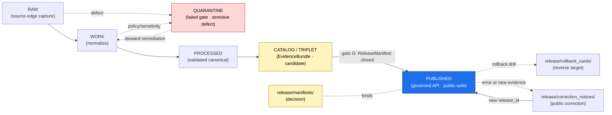

<!-- [KFM_META_BLOCK_V2]
doc_id: kfm://doc/docs-domains-fauna-release-index
title: Fauna Domain — Release Index
type: standard
version: v1
status: draft
owners: TODO Fauna domain steward + Docs steward + Release authority
created: 2026-05-16
updated: 2026-05-16
policy_label: public
related:
  - docs/doctrine/directory-rules.md
  - docs/doctrine/lifecycle-law.md
  - docs/doctrine/trust-membrane.md
  - docs/domains/fauna/README.md
  - docs/runbooks/fauna/SOURCE_REFRESH_RUNBOOK.md
  - release/manifests/
  - release/candidates/fauna/
  - data/published/layers/fauna/
  - schemas/contracts/v1/release/
  - contracts/release/release_manifest.md
tags: [kfm, fauna, release, governance, publication, index]
notes:
  - This file is the human-facing INDEX for Fauna releases; it does not hold release decisions or artifacts.
  - release_state enum is PROPOSED and currently has two candidate forms — see §13 Open Questions.
  - All release_id values shown are illustrative template form, not real releases.
[/KFM_META_BLOCK_V2] -->

# Fauna Domain — Release Index

> Human-facing register of Fauna releases — where they live, what gates they passed, and how to verify, correct, or roll them back. This document **explains and indexes**; it is not the release decision or the artifact.


**Status:** `draft` · **Owners:** `TODO Fauna domain steward + Docs steward + Release authority` · **Last updated:** `2026-05-16`

---

## Quick jump

- [1. Purpose & scope](#1-purpose--scope)
- [2. Repo fit](#2-repo-fit)
- [3. Release state vocabulary](#3-release-state-vocabulary)
- [4. Fauna release lifecycle](#4-fauna-release-lifecycle)
- [5. Sensitivity posture (Fauna)](#5-sensitivity-posture-fauna)
- [6. Publication gates](#6-publication-gates)
- [7. Fauna releases register](#7-fauna-releases-register)
- [8. Release entry template](#8-release-entry-template)
- [9. Artifact kinds in scope](#9-artifact-kinds-in-scope)
- [10. Rollback, correction & withdrawal](#10-rollback-correction--withdrawal)
- [11. AI behavior over Fauna releases](#11-ai-behavior-over-fauna-releases)
- [12. Adding or updating an entry](#12-adding-or-updating-an-entry)
- [13. Open questions & verification backlog](#13-open-questions--verification-backlog)
- [14. Related docs](#14-related-docs)

---

## 1. Purpose & scope

The Fauna Release Index is the **human-facing register** that answers four questions for the Fauna domain:

1. **What has been released, and at what state?** (`DRAFT`, `REVIEW`, candidate, published, withdrawn, corrected, superseded — see §3 for the unresolved enum.)
2. **Where is the supporting evidence and where is the actual artifact?** (links to `release/manifests/`, `data/proofs/`, `data/published/layers/fauna/`, `release/rollback_cards/`.)
3. **What gates did it pass, and what gates are still pending?**
4. **What is the correction and rollback target for each release?**

> [!IMPORTANT]
> This file **indexes** Fauna releases. It is **not** the canonical release decision (that lives in `release/manifests/<release_id>.json`), and it is **not** the published artifact (those live in `data/published/layers/fauna/<release_id>/`). The trust membrane forbids treating this index as the authority. See [Directory Rules §9.2][dr-9-2] for the `release/` ↔ `data/published/` split.

### 1.1 Out of scope

This document does **not**:

- Define `ReleaseManifest` field shape — see `schemas/contracts/v1/release/` and `contracts/release/release_manifest.md`. *(PROPOSED paths; verify with mounted-repo evidence.)*
- Decide rights, sensitivity, or geoprivacy outcomes — those are policy. See `policy/domains/fauna/` and the Fauna sensitivity ladder.
- Publish or promote a release — promotion is a **governed state transition**, not a file move (see [Lifecycle Law][doctrine-lifecycle]).
- Replace the Fauna domain README — see [`README.md`](./README.md).

---

## 2. Repo fit

**This file:** `docs/domains/fauna/RELEASE_INDEX.md` *(PROPOSED — placement basis: Directory Rules §6.1 `docs/` is the human-facing control plane; §12 Domain Placement Law puts domain segments under responsibility roots, never as roots; index/register-style naming follows the `docs/registers/` and `docs/intake/` convention of UPPER_SNAKE filenames.)*

### 2.1 Upstream (what feeds this index)

| Source | Role | Path *(PROPOSED unless noted)* |
|---|---|---|
| Release decisions | Source of truth for what is released | `release/manifests/<release_id>.json` |
| Release candidates (Fauna) | Pre-publish dossiers awaiting review | `release/candidates/fauna/<release_id>/` |
| Promotion decisions | Governed state-transition records | `release/promotion_decisions/<release_id>.json` |
| Signatures & attestations | DSSE / Sigstore | `release/signatures/<release_id>/` |
| EvidenceBundle | Resolved support package | `data/proofs/evidence_bundle/<bundle_id>.json` |
| Run receipts | Process memory for the publishing run | `data/receipts/release/<release_id>/` |
| Published artifacts | The public-safe outputs | `data/published/layers/fauna/<release_id>/` |
| Rollback cards | Rollback decision artifacts | `release/rollback_cards/<release_id>.json` |
| Correction notices | Public corrections | `release/correction_notices/<release_id>-cN.json` |

### 2.2 Downstream (who reads this index)

- Fauna domain steward & release authority (audit, planning, rollback drill prep).
- Docs steward (consistency with `docs/registers/`).
- Governed API and Evidence Drawer (the **decision** is upstream; this is a navigation aid for humans only).
- Reviewers performing separation-of-duties checks for sensitive Fauna lanes.

### 2.3 What lives where (compatibility map)

| If you want… | …go here, not here |
|---|---|
| The release decision | `release/manifests/<release_id>.json` — **not** this file |
| The PMTiles / GeoJSON / Parquet output | `data/published/layers/fauna/<release_id>/` — **not** `release/` |
| The EvidenceBundle | `data/proofs/evidence_bundle/<id>.json` — **not** `data/receipts/` |
| The rollback decision | `release/rollback_cards/<id>.json` — **not** `data/rollback/` (that holds alias-revert receipts) |
| A correction notice | `release/correction_notices/` — **not** an in-place edit of any prior artifact |

> [!NOTE]
> The split is doctrinal: `data/published/` owns the **artifacts**; `release/` owns the **decisions**. Mixing them is one of the four named drift patterns (Directory Rules §13.2).

[⬆ Back to top](#fauna-domain--release-index)

---

## 3. Release state vocabulary

The Fauna domain consumes the project-wide release-state vocabulary. **CONFIRMED doctrine:** every Fauna PUBLISHED claim must be reachable via a `ReleaseManifest` with a resolvable rollback target. **PROPOSED implementation:** the exact enum values for `release_state` are not yet ADR-frozen — two candidate enumerations appear in the project corpus and must be reconciled before any Fauna release ships under either name.

> [!WARNING]
> **Open conflict — `release_state` enum.** Two PROPOSED enumerations coexist in the project sources. Until an ADR resolves this (see §13), Fauna release entries below use the schema-side enum (UPPERCASE) and note the corresponding STAC profile token in a separate column.

### 3.1 PROPOSED enum — ReleaseManifest schema form (UPPERCASE)

| State | Meaning | Public-visible? | Required artifacts before entry |
|---|---|---|---|
| `DRAFT` | Authoring; gates not yet evaluated | No | None |
| `REVIEW` | Under review; closure work in progress | No | candidate dossier, partial EvidenceRefs |
| `PUBLISHED` | Released through governed APIs | **Yes** | `ReleaseManifest`, `EvidenceBundle`, rollback target, review where required |
| `REVOKED` | Pulled from public surfaces; correction or withdrawal lineage | No (notice only) | `CorrectionNotice` or `withdrawal_notices/` entry |
| `SUPERSEDED` | Replaced by a newer release; old release_id retained for lineage | No (lineage only) | Forward link to successor `release_id` |

### 3.2 PROPOSED enum — KFM STAC profile form (lowercase)

| State | Meaning | Rough mapping to §3.1 |
|---|---|---|
| `unreleased` | Not yet promoted | `DRAFT` |
| `candidate` | Awaiting closure | `REVIEW` |
| `released` | Available to public clients | `PUBLISHED` |
| `withdrawn` | Pulled from public surfaces | `REVOKED` (withdrawal lane) |
| `corrected` | Reissued under a CorrectionNotice | `REVOKED` → new PUBLISHED with `correction_lineage` |
| `superseded` | Replaced by a newer release | `SUPERSEDED` |

> [!NOTE]
> Both enums are PROPOSED. Whichever the ADR chooses, the Fauna domain inherits it without redefinition — domain docs do not create parallel vocabularies (Directory Rules §2.4).

[⬆ Back to top](#fauna-domain--release-index)

---

## 4. Fauna release lifecycle

**CONFIRMED doctrine:** the Fauna domain follows the canonical KFM lifecycle. Promotion is a **governed state transition**, not a file move — bypassing validators, policy gates, EvidenceBundle creation, catalog closure, or release-decision recording is a violation regardless of where the bytes ended up.



*Diagram reflects [Directory Rules §9.1][dr-9-1] (lifecycle phases), [§9.2][dr-9-2] (release decisions), and the Atlas §24.6.1 transition gate table. PROPOSED state labels above are doctrine names; specific gate identifiers (G1–G7) below are PROPOSED labels and may be renamed by an ADR.*

[⬆ Back to top](#fauna-domain--release-index)

---

## 5. Sensitivity posture (Fauna)

> [!CAUTION]
> **Fauna deny-by-default categories.** Exact occurrence geometry for sensitive taxa, nests, dens, roosts, hibernacula, spawning sites, and steward-controlled records **fails closed** unless a documented geoprivacy transform and review state allow release. This is CONFIRMED Fauna doctrine. Public exact-occurrence tiles for sensitive taxa are **denied**.

### 5.1 What may enter `PUBLISHED` (Fauna)

| Public-safe candidate | Allowed at PUBLISHED? | Required transforms / receipts |
|---|---|---|
| Public range polygons | Yes — when source rights and sensitivity allow | EvidenceBundle; LayerManifest; tile field allowlist |
| Occurrence density grid (generalized) | Yes — when generalization meets policy | Redaction Receipt; geoprivacy transform receipt |
| Species richness grid | Yes | EvidenceBundle; aggregation rule documented |
| Invasive monitoring public layer | Yes — observation-role only | Source-role authority test passed |
| Seasonal support layer | Yes | EvidenceBundle; temporal scope declared |
| Taxon search / public-safe popup | Yes | Tile field allowlist test; no exact-occurrence leakage |
| Public species status view | Yes | Conservation Status field provenance documented |

### 5.2 What must **not** enter `PUBLISHED` without explicit steward release

| Restricted category | Default outcome | Path if exception granted |
|---|---|---|
| Exact sensitive-taxon occurrence geometry | **DENY** | Steward-only review surface; Redaction Receipt + transform receipt + ReviewRecord |
| Nest / den / roost / hibernacula / spawning sites | **DENY** | Same as above; geometry generalization or suppression required |
| Steward-controlled records (e.g., tribal, landowner, agency-restricted) | **DENY** | Rights-holder representative co-signs; rights resolution recorded |
| Joins of public sources that re-identify sensitive locations | **DENY** | Join rule + sensitivity reviewer; route through steward queue |

> [!NOTE]
> A claim can be **well sourced and still unsafe** for public release. Source quality does not override sensitivity. The Fauna lane treats public exposure as a governed state, not a reward for data quality.

[⬆ Back to top](#fauna-domain--release-index)

---

## 6. Publication gates

> **CONFIRMED doctrine / PROPOSED implementation.** Fauna publication requires a complete closure across the gates below. Missing any required artifact means the transition **fails closed** and the prior state is preserved.

| ID *(PROPOSED label)* | Gate | Required artifact(s) | On fail |
|---|---|---|---|
| G1 | Source-role authority | `SourceDescriptor`; source-role registry entry | HOLD at RAW; reason `RIGHTS_UNKNOWN` or `ROLE_COLLAPSE` |
| G2 | Rights & sensitivity resolution | Rights review; sensitivity classification; Fauna sensitivity ladder | QUARANTINE; reason `SENSITIVITY_UNRESOLVED` |
| G3 | Taxonomy resolution | Taxon Crosswalk; taxonomy version pinned | HOLD at WORK; reason `SCHEMA_MISMATCH` (taxonomy) |
| G4 | Occurrence restricted/public split | Restricted vs public Occurrence classification; tile field allowlist | QUARANTINE if exact restricted leaks |
| G5 | Geoprivacy & redaction | Geoprivacy transform receipt; Redaction Receipt | HOLD at PROCESSED |
| G6 | EvidenceBundle closure | `EvidenceBundle` resolves all `EvidenceRef`; digest closure | HOLD at CATALOG; reason `MISSING_EVIDENCE` |
| G7 | Review state (where required) | `ReviewRecord` from independent reviewer for sensitive lanes | HOLD; reason `REVIEW_NEEDED` |
| G8 | Release manifest & rollback | `ReleaseManifest`; rollback target; signatures | HOLD; reason `RELEASE_MANIFEST_INVALID` or `ROLLBACK_TARGET_MISSING` |

**Watcher-as-non-publisher invariant.** *(CONFIRMED.)* Fauna source-drift detectors and ingest watchers emit candidate records — they do **not** publish, mutate canonical truth, or expose `RAW` / `WORK` / `QUARANTINE` payloads to public surfaces. Watcher output enters the lifecycle on the WORK side and requires explicit promotion.

[⬆ Back to top](#fauna-domain--release-index)

---

## 7. Fauna releases register

> [!NOTE]
> **No Fauna release is CONFIRMED in this session.** All entries below are illustrative **template** form to show the expected shape of the register. Replace with real entries only once `release/manifests/` evidence exists and an ADR has frozen the `release_state` enum (see §13).

| `release_id` *(template)* | Title | State *(PROPOSED enum)* | Created | Spec hash | Manifest | Evidence bundle | Rollback target | Notes |
|---|---|---|---|---|---|---|---|---|
| `rel-fauna-public-range-template` | *(template)* Fauna public range polygons | `DRAFT` | `YYYY-MM-DDTHH:MM:SSZ` | `sha256:…` | `release/manifests/rel-fauna-public-range-template.json` | `data/proofs/evidence_bundle/<bundle_id>.json` | `null` *(initial)* | NEEDS VERIFICATION — no manifest exists yet |
| `rel-fauna-density-grid-template` | *(template)* Fauna occurrence density grid (generalized) | `DRAFT` | `YYYY-MM-DDTHH:MM:SSZ` | `sha256:…` | `release/manifests/rel-fauna-density-grid-template.json` | `data/proofs/evidence_bundle/<bundle_id>.json` | `null` *(initial)* | NEEDS VERIFICATION — Redaction Receipt required |
| `rel-fauna-invasive-monitoring-template` | *(template)* Invasive species monitoring public layer | `DRAFT` | `YYYY-MM-DDTHH:MM:SSZ` | `sha256:…` | `release/manifests/rel-fauna-invasive-monitoring-template.json` | `data/proofs/evidence_bundle/<bundle_id>.json` | `null` *(initial)* | NEEDS VERIFICATION — observation source-role only |

> The register MUST be append-only with respect to the `release_id`; corrections to a release create a **new** `release_id` and append a row, then mark the prior row `SUPERSEDED` or `REVOKED` with a forward link. **Never silently edit** a prior released row.

[⬆ Back to top](#fauna-domain--release-index)

---

## 8. Release entry template

When adding a new entry to §7, fill out the block below in the release candidate dossier (`release/candidates/fauna/<release_id>/CANDIDATE.md`) first, then mirror the summary row into the register.

<details>
<summary><strong>Click to expand — Fauna release entry block (template)</strong></summary>

```yaml
# release/candidates/fauna/<release_id>/CANDIDATE.md  (PROPOSED path)
release_id: rel-fauna-<slug>-<yyyy>-<nnn>
title: <human title>
domain: fauna
release_state: DRAFT          # PROPOSED enum — see §3
policy_label: public          # public | restricted | unknown
rights_status: open           # open | controlled | restricted | unknown
sensitivity: public           # public | generalized | restricted | review_required
spec_hash: sha256:<canonicalized-content-hash>
artifacts:
  - artifact_id: <id>
    kind: pmtiles             # pmtiles | stac | geojson | parquet | model | manifest | receipt
    path: data/published/layers/fauna/<release_id>/<file>.pmtiles
    sha256: <hash>
    blake3: <hash>
evidence_refs:
  - kfm://evidence/<bundle_id>
  - kfm://run/<run_receipt_id>
review:
  required: true              # sensitive Fauna lanes: true
  record: release/reviews/<record_id>.json    # PROPOSED path
geoprivacy:
  transforms:                 # zero or more
    - type: generalize_to_grid   # suppress | generalize_to_grid | watershed | county | buffer | delayed_publication | steward_only
      input_class: occurrence_exact
      output_class: occurrence_density_grid
      receipt: kfm://redaction/<receipt_id>
rollback:
  rollback_supported: true
  previous_release: null
  rollback_plan_ref: release/rollback_cards/<release_id>.json
correction_lineage: []
attestations:
  - release/signatures/<release_id>/dsse.json
```

</details>

> [!IMPORTANT]
> Field names mirror the **PROPOSED** `ReleaseManifest` schema observed in the project corpus. Do **not** invent new fields here — propose new fields through an ADR against `schemas/contracts/v1/release/release_manifest.schema.json`.

[⬆ Back to top](#fauna-domain--release-index)

---

## 9. Artifact kinds in scope

**CONFIRMED doctrine / PROPOSED schema enum:** the `ReleaseManifest` `artifacts[].kind` enum is `pmtiles | stac | geojson | parquet | model | manifest | receipt`. Fauna releases routinely cover the kinds shown below.

| Kind | Typical Fauna use | Sensitivity-bound? | Integrity expectations *(PROPOSED)* |
|---|---|---|---|
| `pmtiles` | Range polygons, density grids, seasonal layers, public-safe popups | Yes — generalization required for sensitive taxa | BLAKE3 root hash; SHA-256 of file; OCI-native publication with sidecar |
| `geojson` | Public-safe occurrence summaries, polygon exports | Yes — exact occurrence must not appear | SHA-256; JCS canonicalization where appropriate |
| `parquet` (GeoParquet) | Tabular occurrence summaries, density panels | Yes | SHA-256; schema version pinned |
| `stac` | Catalog items for layer assets, attestation references | No (catalog, not payload) | Validates against STAC 1.0 + `kfm-stac-profile-v1` *(PROPOSED)* |
| `model` | Suitability / range models *(if any)* | Yes — model cards required; **derived**, not observation | Model card; training data lineage; rollback drill |
| `manifest` | LayerManifest, ReleaseManifest (carried as artifact) | n/a | `spec_hash` excludes `spec_hash` field itself; manifest closure |
| `receipt` | RunReceipt, Redaction Receipt, attestation | n/a | DSSE; cosign keyless; Rekor index where applicable |

> [!NOTE]
> 3D / planetary derivatives for Fauna are **not** an alternate truth path. Where present, they consume the **same** `EvidenceBundle` and `DecisionEnvelope` as 2D map products — they are alternate renderers, not alternate truth.

[⬆ Back to top](#fauna-domain--release-index)

---

## 10. Rollback, correction & withdrawal

> [!IMPORTANT]
> **Rollback is a closure property, not a recovery procedure.** A Fauna release that does not name a rollback target is not a complete release. Rollback drills must be tested as part of every release of map assets.

### 10.1 Decision artifacts

| Situation | Artifact | Lives at *(PROPOSED)* |
|---|---|---|
| Detected error or new evidence | `CorrectionNotice` | `release/correction_notices/<release_id>-cN.json` |
| Failed release / post-publication failure | `RollbackCard` | `release/rollback_cards/<release_id>.json` |
| Source rights revoked or sensitivity reclassified | `withdrawal_notices/` entry | `release/withdrawal_notices/<release_id>.json` |
| Supersession by a newer release | `ReleaseManifest` with `correction_lineage` filled | `release/manifests/<new_release_id>.json` |

### 10.2 Propagation surface (open)

Fauna rollback must consider downstream propagation: tiles, graph projections, Focus Mode caches, Story Nodes, and AI response envelopes may need invalidation. The propagation list is an **open question** — see §13.

[⬆ Back to top](#fauna-domain--release-index)

---

## 11. AI behavior over Fauna releases

**CONFIRMED doctrine / PROPOSED implementation.** Governed AI may:

- Summarize **released** Fauna `EvidenceBundle` content;
- Compare evidence across Fauna releases;
- Explain Fauna release limitations and stale-state markers;
- Draft steward-review notes for sensitive Fauna release candidates.

**AI must `ABSTAIN`** when evidence is insufficient, and **`DENY`** where policy, rights, sensitivity, or release state blocks the request. The trust membrane forbids AI surfaces from reaching `RAW` / `WORK` / `QUARANTINE`, canonical/internal stores, graph internals, source APIs, or direct model runtimes — only `PUBLISHED` content via the governed API.

| AI surface | Source for Fauna | Finite outcomes |
|---|---|---|
| Evidence Drawer | `EvidenceBundle` projection from released Fauna manifests | `ANSWER` / `ABSTAIN` / `DENY` / `ERROR` |
| Focus Mode | `RuntimeResponseEnvelope` + `AIReceipt` over released Fauna | `ANSWER` / `ABSTAIN` / `DENY` / `ERROR` |
| Search / index | `SearchIndexManifest` derived from PUBLISHED Fauna | `ANSWER` / `DENY` / `ERROR` |

[⬆ Back to top](#fauna-domain--release-index)

---

## 12. Adding or updating an entry

Use this procedure when a Fauna release reaches a state worth indexing. The PR description SHOULD cite the Directory Rules section justifying any new path.

1. **Author the candidate dossier** at `release/candidates/fauna/<release_id>/CANDIDATE.md` using the §8 template. *(PROPOSED path.)*
2. **Resolve gates G1–G8** (§6). Capture each gate's evidence: source-role registry entry, rights review, taxonomy version, geoprivacy transforms, `EvidenceBundle`, `ReviewRecord` (sensitive lanes), `ReleaseManifest`, rollback target.
3. **Run the validator suite** *(PROPOSED — see `tests/domains/fauna/`)*: source-role authority, taxonomy resolution, restricted/public occurrence split, Redaction Receipt validation, tile field allowlist, Runtime Response Envelope negative cases.
4. **Author the `ReleaseManifest`** at `release/manifests/<release_id>.json` and sign (`release/signatures/<release_id>/`).
5. **Promote** via governed state transition — record `PromotionDecision` at `release/promotion_decisions/<release_id>.json`. Author ≠ release authority for sensitive Fauna lanes (separation of duties).
6. **Add the row to §7** as a new entry. Do **not** edit prior rows; instead, mark them `SUPERSEDED` or `REVOKED` with a forward link.
7. **Cross-link** the new entry from `docs/domains/fauna/README.md` and from any affected `docs/runbooks/fauna/` runbook.
8. **Update the `updated:` field** in the Meta Block.

> [!TIP]
> If a candidate fails a gate, it should land in `QUARANTINE` with a structured reason code (e.g., `SENSITIVITY_UNRESOLVED`, `MISSING_EVIDENCE`, `ROLLBACK_TARGET_MISSING`) — not silently held in `WORK`. Reason codes are PROPOSED; see Atlas §24.6.3.

[⬆ Back to top](#fauna-domain--release-index)

---

## 13. Open questions & verification backlog

These items are surfaced for ADR resolution or `docs/registers/VERIFICATION_BACKLOG.md` tracking. None of them block index drafting; all of them block any specific claim of repo-state maturity.

| # | Item | Status | What would settle it |
|---|---|---|---|
| 1 | `release_state` enum form — UPPERCASE (`DRAFT`/`REVIEW`/`PUBLISHED`/`REVOKED`/`SUPERSEDED`) **vs** STAC-profile form (`unreleased`/`candidate`/`released`/`withdrawn`/`corrected`/`superseded`) | **PROPOSED — CONFLICT** | An ADR freezing one enum; cross-walk for the other; update `schemas/contracts/v1/release/release_manifest.schema.json` and `kfm-stac-profile-v1.schema.json` |
| 2 | Exact `release/` subtree presence (`manifests/`, `candidates/`, `promotion_decisions/`, `rollback_cards/`, `correction_notices/`, `withdrawal_notices/`, `signatures/`, `changelog/`) | **NEEDS VERIFICATION** | Mounted-repo evidence; per-root README |
| 3 | Schema home for `ReleaseManifest` (canonical `schemas/contracts/v1/release/` per ADR-0001) | **NEEDS VERIFICATION** | Mounted-repo confirmation; drift entry if `contracts/release/*.schema.json` also exists |
| 4 | Fauna live-connector rights, steward permissions, and source-role registry entries | **NEEDS VERIFICATION** | Mounted-repo `data/registry/sources/fauna/` entries; rights review records |
| 5 | Taxonomic resolver implementation and Taxon Crosswalk version pinning | **NEEDS VERIFICATION** | Mounted-repo schema, validator, and fixture coverage |
| 6 | Restricted/public Occurrence split mechanism and tile field allowlist | **NEEDS VERIFICATION** | `policy/domains/fauna/` rules; `tests/domains/fauna/` cases |
| 7 | Geoprivacy transform vocabulary and Redaction Receipt schema | **PROPOSED** | ADR enumerating transform types (`suppress`, `generalize_to_grid`, `watershed`, `county`, `buffer`, `delayed_publication`, `steward_only`) |
| 8 | Rollback propagation surface — tiles, graph projections, Focus Mode caches, Story Nodes, AI envelopes | **OPEN** | Rollback drill specification; propagation manifest |
| 9 | Separation-of-duties enforcement maturity for sensitive Fauna releases | **PROPOSED** | Tooling-enforced author ≠ release-authority rule; review console |
| 10 | Index location — is `docs/domains/fauna/RELEASE_INDEX.md` the right home, or should a register live under `docs/registers/` for cross-domain release indexing? | **PROPOSED** | ADR; or a `docs/registers/RELEASE_REGISTER.md` that links to per-domain indices |

> [!NOTE]
> Items 4–7 carry forward from the Fauna domain verification backlog *(N. Verification backlog, Atlas Ch. 7)* — they are not new questions introduced by this index.

[⬆ Back to top](#fauna-domain--release-index)

---

## 14. Related docs

- [`docs/domains/fauna/README.md`](./README.md) — Fauna domain landing page *(PROPOSED — verify presence)*
- [`docs/runbooks/fauna/SOURCE_REFRESH_RUNBOOK.md`](../../runbooks/fauna/SOURCE_REFRESH_RUNBOOK.md) — Fauna domain source refresh runbook
- [`docs/doctrine/directory-rules.md`](../../doctrine/directory-rules.md) — Canonical placement and lifecycle doctrine
- [`docs/doctrine/lifecycle-law.md`](../../doctrine/lifecycle-law.md) — RAW → PUBLISHED lifecycle invariant
- [`docs/doctrine/trust-membrane.md`](../../doctrine/trust-membrane.md) — Trust membrane and governed-API rules
- [`docs/standards/PROV.md`](../../standards/PROV.md) — W3C PROV-O / PAV provenance standards profile
- [`docs/standards/PMTILES.md`](../../standards/PMTILES.md) — PMTiles v3 governance and conformance profile
- [`docs/standards/ISO-19115.md`](../../standards/ISO-19115.md) — ISO 19115 crosswalk profile
- [`contracts/release/release_manifest.md`](../../../contracts/release/release_manifest.md) — `ReleaseManifest` semantic contract *(PROPOSED)*
- [`schemas/contracts/v1/release/`](../../../schemas/contracts/v1/release/) — `ReleaseManifest` JSON Schema home *(PROPOSED — ADR-0001)*
- [`policy/domains/fauna/`](../../../policy/domains/fauna/) — Fauna admissibility and release policy *(PROPOSED)*
- [`release/manifests/`](../../../release/manifests/) — All ReleaseManifest decisions
- [`release/candidates/fauna/`](../../../release/candidates/fauna/) — Fauna release candidate dossiers
- [`data/published/layers/fauna/`](../../../data/published/layers/fauna/) — Fauna published artifacts
- [`docs/registers/VERIFICATION_BACKLOG.md`](../../registers/VERIFICATION_BACKLOG.md) — Verification items index
- [`docs/registers/DRIFT_REGISTER.md`](../../registers/DRIFT_REGISTER.md) — Doctrine ↔ repo drift entries

---

[dr-9-1]: ../../doctrine/directory-rules.md#91-data--the-lifecycle-invariant
[dr-9-2]: ../../doctrine/directory-rules.md#92-release--release-decisions
[doctrine-lifecycle]: ../../doctrine/lifecycle-law.md

---

**Status:** `draft` · **Last updated:** `2026-05-16` · **Doc id:** `kfm://doc/docs-domains-fauna-release-index`

[⬆ Back to top](#fauna-domain--release-index)
