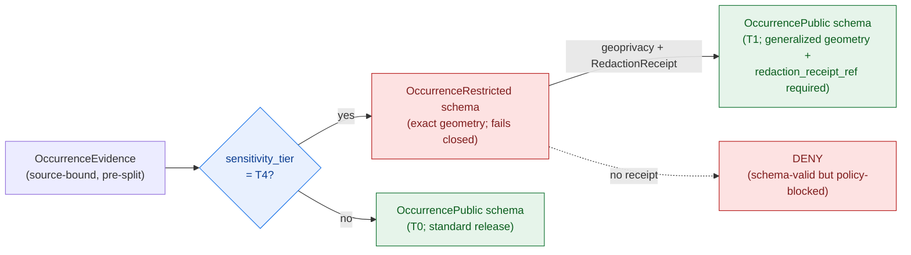

<!-- [KFM_META_BLOCK_V2]
doc_id: kfm://doc/docs-domains-fauna-schemas
title: Fauna Domain — Schemas
type: standard
version: v1
status: draft
owners: [NEEDS VERIFICATION — fauna domain steward; schema steward; docs steward]
created: 2026-06-02
updated: 2026-06-02
policy_label: public
related:
  - docs/domains/fauna/README.md
  - docs/doctrine/directory-rules.md
  - docs/doctrine/ai-build-operating-contract.md
  - docs/standards/CANONICALIZATION.md
  - contracts/domains/fauna/
  - schemas/contracts/v1/domains/fauna/
  - schemas/contracts/v1/common/
  - policy/sensitivity/fauna/
  - tests/domains/fauna/
  - fixtures/domains/fauna/
  - docs/adr/ADR-0001-schema-home.md
tags: [kfm, domain, fauna, schemas, json-schema, identity, spec-hash]
notes:
  # Explains the Fauna machine-schema home; it is NOT the schema authority. The .schema.json files at schemas/contracts/v1/domains/fauna/ are authoritative.
  # Schema home is CONFIRMED rule (ADR-0001); per-file presence is PROPOSED until mounted-repo verification.
  # Field-level realizations are PROPOSED; object-family NAMES are CONFIRMED (Atlas Ch. 7).
  # Doctrine-adjacent doc; CONTRACT_VERSION = "3.0.0" pinned per AI Build Operating Contract v3.0.
  # Sensitive occurrence = T4 default; restricted/public split is enforced at the schema + policy boundary.
[/KFM_META_BLOCK_V2] -->

<a id="top"></a>

# Fauna Domain — Schemas

> Where the Fauna machine-checkable shapes live, how they relate to contracts and policy, and how Fauna object identity is computed. This doc **explains and crosswalks**; the authoritative shapes are the `.schema.json` files under `schemas/contracts/v1/domains/fauna/`.

<p align="center">
  <b>Shape ≠ meaning · Schema ≠ policy · Deterministic identity · Deny-by-default sensitive</b>
</p>

---


**Status:** draft · **Owners:** _NEEDS VERIFICATION (fauna + schema + docs stewards)_ · **Last updated:** 2026-06-02 · **`CONTRACT_VERSION = "3.0.0"`**

---

## Quick links

- [1. Scope](#1-scope)
- [2. Repo fit](#2-repo-fit)
- [3. The meaning / shape / admissibility / proof split](#3-the-meaning--shape--admissibility--proof-split)
- [4. Schema directory tree](#4-schema-directory-tree)
- [5. Fauna object schemas](#5-fauna-object-schemas)
- [6. Identity and `spec_hash`](#6-identity-and-spec_hash)
- [7. Common base schemas Fauna composes](#7-common-base-schemas-fauna-composes)
- [8. Sensitivity at the schema boundary](#8-sensitivity-at-the-schema-boundary)
- [9. Versioning and migration](#9-versioning-and-migration)
- [10. Validation, fixtures, and CI](#10-validation-fixtures-and-ci)
- [11. Authoring a new Fauna schema](#11-authoring-a-new-fauna-schema)
- [12. Open questions register](#12-open-questions-register)
- [13. Verification backlog](#13-verification-backlog)
- [14. Changelog & definition of done](#14-changelog--definition-of-done)
- [15. Related docs](#15-related-docs)

---

## 1. Scope

**CONFIRMED doctrine / PROPOSED implementation.** This document describes the **machine-schema home** for the Fauna lane: the JSON Schema files that define the *shape* of Fauna object families, where they live, how they compose shared base schemas, how Fauna object identity is computed, and how schemas relate to the contract (meaning), policy (admissibility), and test (proof) layers. [DIRRULES §6.3–§6.5]

This doc is a **prose crosswalk**, not the schema authority. The authoritative shapes are the `.schema.json` files at `schemas/contracts/v1/domains/fauna/`. If this doc and a schema file disagree, **the schema file wins** and the discrepancy is a drift entry.

> [!IMPORTANT]
> **`.schema.json` files NEVER live under `contracts/` or `docs/`.** Per the schema-home rule (ADR-0001), the default and only machine-schema home is `schemas/contracts/v1/...`. A Fauna schema under `contracts/domains/fauna/` or inlined in this doc as authority is **CONFLICTED / lineage** and must be migrated before any new schema lands. [DIRRULES §6.4]

[Back to top ↑](#top)

---

## 2. Repo fit

**This file:** `docs/domains/fauna/SCHEMAS.md` *(PROPOSED — placement basis: Directory Rules §6.1 `docs/` is the human-facing control plane; §4 Step 1 puts "explains something to humans" under `docs/`; §4 Step 3 puts the `fauna` domain as a segment, never a root.)* [DIRRULES §4 Step 1, §4 Step 3, §6.1]

| Aspect | Value | Status |
|---|---|---|
| This doc (prose) | `docs/domains/fauna/SCHEMAS.md` | PROPOSED placement |
| Schema authority (machine) | `schemas/contracts/v1/domains/fauna/*.schema.json` | CONFIRMED rule (ADR-0001); presence PROPOSED |
| Meaning authority | `contracts/domains/fauna/*.md` | PROPOSED |
| Admissibility authority | `policy/domains/fauna/`, `policy/sensitivity/fauna/` | PROPOSED |
| Proof | `tests/domains/fauna/`, `fixtures/domains/fauna/`, `schemas/tests/{valid,invalid}/` | PROPOSED |
| Shared base schemas | `schemas/contracts/v1/common/`, `.../evidence/`, `.../source/` | CONFIRMED subtree (DIRRULES §6.4) |

> [!NOTE]
> Cross-domain Fauna schemas (e.g., a habitat × fauna × hydrology shape) do **not** live under `schemas/contracts/v1/domains/fauna/`. Per §12 they go to the lowest common responsibility root without a domain segment — `schemas/contracts/v1/<topic>/`. Fauna × Habitat pairings follow the `[DOM-HF]` thin-slice. [DIRRULES §12]

[Back to top ↑](#top)

---

## 3. The meaning / shape / admissibility / proof split

**CONFIRMED doctrine.** KFM separates four concerns that beginners tend to collapse. A Fauna schema only owns **shape**. [DIRRULES §6.3–§6.5]

| Concern | Owner root | What it answers for Fauna | Example |
|---|---|---|---|
| **Meaning** | `contracts/domains/fauna/` (`.md`) | *What does an OccurrenceRestricted mean?* | "A sensitive occurrence whose geometry fails closed for public release." |
| **Shape** | `schemas/contracts/v1/domains/fauna/` (`.schema.json`) | *What fields and constraints must it carry?* | `geometry` required; `sensitivity_tier` enum; `redaction_receipt_ref` required when public. |
| **Admissibility** | `policy/domains/fauna/`, `policy/sensitivity/fauna/` | *May this be released, and at what tier?* | Deny T4 exact occurrence; allow T1 generalized with RedactionReceipt. |
| **Proof** | `tests/domains/fauna/`, `fixtures/domains/fauna/` | *Is the rule enforceable?* | Valid/invalid fixtures; restricted-leak negative case. |

> [!WARNING]
> A schema MUST NOT encode admissibility ("public release allowed") as if it were shape. Shape says a field *exists and is well-formed*; policy decides whether the value is *permitted to be released*. Collapsing the two re-creates the source-role / claim-class anti-collapse failure at the schema layer.

[Back to top ↑](#top)

---

## 4. Schema directory tree

**PROPOSED tree.** The `schemas/contracts/v1/` subtree and the `domains/<domain>/` segment pattern are **CONFIRMED** (Directory Rules §6.4); the presence of specific Fauna files is **PROPOSED until verified** in the mounted repo. [DIRRULES §6.4, §5 status note]

```text
schemas/
├── README.md
├── contracts/
│   └── v1/
│       ├── common/        # base: geometry, temporal scope, identity, citation
│       ├── source/        # source_descriptor, ingest_receipt
│       ├── evidence/      # evidence_ref, evidence_bundle
│       ├── data/          # dataset_version, validation_report
│       ├── runtime/       # runtime_response_envelope, ai_receipt
│       ├── policy/        # policy_decision
│       ├── release/       # release_manifest, promotion_decision, rollback_card
│       ├── correction/    # correction_notice, redaction_receipt
│       └── domains/
│           └── fauna/                       ← Fauna machine-schema home (authoritative)
│               ├── taxon.schema.json                      (PROPOSED)
│               ├── taxon_crosswalk.schema.json            (PROPOSED)
│               ├── conservation_status.schema.json        (PROPOSED)
│               ├── occurrence_evidence.schema.json        (PROPOSED)
│               ├── occurrence_restricted.schema.json      (PROPOSED)
│               ├── occurrence_public.schema.json          (PROPOSED)
│               ├── range_polygon.schema.json              (PROPOSED)
│               ├── seasonal_range.schema.json             (PROPOSED)
│               ├── migration_route.schema.json            (PROPOSED)
│               ├── monitoring_event.schema.json           (PROPOSED)
│               ├── sensitive_site.schema.json             (PROPOSED)
│               ├── mortality_observation.schema.json      (PROPOSED)
│               ├── disease_observation.schema.json        (PROPOSED)
│               └── invasive_species_record.schema.json    (PROPOSED)
└── tests/
    ├── valid/         # schema-passing fixtures
    └── invalid/       # schema-failing fixtures (negative cases)
```

> [!NOTE]
> `redaction_receipt.schema.json` is shown under `correction/` (a cross-cutting receipt family), not under `domains/fauna/`, because the RedactionReceipt is a shared governance object many lanes emit. Whether receipt schemas live at `schemas/contracts/v1/<receipt>/` or `schemas/contracts/v1/<domain>/receipts/` is an open ADR (ADR-S-03). [DIRRULES §2.4(5)]

[Back to top ↑](#top)

---

## 5. Fauna object schemas

**Object-family NAMES are CONFIRMED** (Atlas v1.1 Ch. 7 §B owned-object list). **Field-level realizations are PROPOSED** and live in the schema files, not here. KFM-specific casing is preserved. [ENCY Atlas §7.B]

| Object family | Schema file *(PROPOSED)* | Owns shape of | Sensitivity default |
|---|---|---|---|
| **Taxon** | `taxon.schema.json` | Animal taxonomic identity scoped by source role, evidence, time | T0 |
| **TaxonCrosswalk** | `taxon_crosswalk.schema.json` | Mapping between authority taxonomies (ITIS, GBIF, KDWP, USFWS, NatureServe) | T0 |
| **ConservationStatus** | `conservation_status.schema.json` | Legal/conservation classification tied to an authority source | T0 |
| **OccurrenceEvidence** | `occurrence_evidence.schema.json` | Source-bound observational record **before** the sensitivity split | depends on taxon/site |
| **OccurrenceRestricted** | `occurrence_restricted.schema.json` | Sensitive occurrence; geometry/metadata fail closed | **T4** |
| **OccurrencePublic** | `occurrence_public.schema.json` | Public-safe occurrence after generalization/redaction | T0 |
| **RangePolygon** | `range_polygon.schema.json` | Aggregated species range geometry | T1 |
| **SeasonalRange** | `seasonal_range.schema.json` | Seasonal subset of range; explicit temporal scope | T1 |
| **MigrationRoute** | `migration_route.schema.json` | Linear/corridor geometry tied to time windows | T1 / review |
| **MonitoringEvent** | `monitoring_event.schema.json` | Monitoring/survey observation event with source attribution | depends on site |
| **SensitiveSite** | `sensitive_site.schema.json` | Nest / den / roost / hibernacula / spawning record | **T4** |
| **MortalityObservation** | `mortality_observation.schema.json` | Recorded mortality event with source attribution | depends on taxon |
| **DiseaseObservation** | `disease_observation.schema.json` | Disease/pathogen surveillance evidence | depends |
| **InvasiveSpeciesRecord** | `invasive_species_record.schema.json` | Invasive feed entry (EDDMapS-like or steward) | T0 / T1 |

> [!CAUTION]
> **OccurrenceRestricted and SensitiveSite default to T4.** Their schemas SHOULD make the public-safe path *structurally* impossible without a resolvable receipt — e.g., `occurrence_public.schema.json` requires a `redaction_receipt_ref` and a generalized geometry class, so a raw exact geometry cannot validate as public. Shape reinforces policy; it does not replace it. [DOM-FAUNA] [ENCY Atlas §24.5.2]

[Back to top ↑](#top)

---

## 6. Identity and `spec_hash`

**CONFIRMED doctrine.** Object identity in KFM is a **deterministic hash comparison**, not a field-by-field walk. The `spec_hash` is computed by canonicalizing the JSON via **RFC 8785 JSON Canonicalization Scheme (JCS)** and taking **SHA-256** over the canonical bytes, recorded as `jcs:sha256:<hex>`. Hashing developer-formatted JSON is **not** acceptable — trivial reformatting must not change identity. [ENCY C1-02] [RFC 8785]

```text
spec_hash = "jcs:sha256:" + hex( SHA-256( RFC8785_JCS_canonicalize( object ) ) )
```

**PROPOSED — Fauna object deterministic-identity basis.** Each Fauna object's identity derives from: `source id + object role + temporal scope + normalized digest`. This is the per-object identity rule recorded in the Atlas Fauna chapter, not yet field-frozen in a schema. [ENCY Atlas §7.E]

> [!IMPORTANT]
> **`spec_hash` excludes the `spec_hash` field itself.** When a schema carries its own `spec_hash`, that field is omitted from the canonicalization input, or the hash becomes self-referential and unstable. The same rule applies to ReleaseManifests and receipts.

**CONFIRMED — temporal roles stay distinct.** Fauna schemas MUST keep source, observed, valid, retrieval, release, and correction times as separate fields where material. Collapsing "when it was observed" into "when it was released" destroys auditability and corrupts identity. [ENCY Atlas §7.E]

| Time role | Meaning | Example field *(PROPOSED)* |
|---|---|---|
| `observed_time` | When the occurrence/event happened in the world | `2024-05-01` |
| `valid_time` | Interval the record is asserted to hold | `2024-01-01/2024-12-31` |
| `source_time` | Vintage of the source payload | `2024-06-10` |
| `retrieval_time` | When KFM fetched it | `2026-05-16T12:00:00Z` |
| `release_time` | When it was promoted to PUBLISHED | `2026-06-02T00:00:00Z` |
| `correction_time` | When a correction was issued | `null` (initial) |

[Back to top ↑](#top)

---

## 7. Common base schemas Fauna composes

**CONFIRMED subtree.** Fauna object schemas SHOULD compose shared base schemas under `schemas/contracts/v1/common/` and sibling families rather than redefining geometry, identity, citation, or evidence shapes locally. Reuse keeps validators, the Evidence Drawer, and crosswalks consistent. [DIRRULES §6.4]

| Base schema family *(PROPOSED path)* | What Fauna composes from it |
|---|---|
| `schemas/contracts/v1/common/` | Geometry shape, temporal-scope block, deterministic-identity block, citation block |
| `schemas/contracts/v1/source/` | `SourceDescriptor` reference; source-role enum (authority / observation / aggregator / context / model) |
| `schemas/contracts/v1/evidence/` | `EvidenceRef` → `EvidenceBundle` resolution; every claim-bearing Fauna object carries an `evidence_ref` |
| `schemas/contracts/v1/correction/` | `RedactionReceipt` shape referenced by T4 → public-tier motions |
| `schemas/contracts/v1/data/` | `ValidationReport` shape emitted by the Fauna validators |

> [!NOTE]
> The source-role enum is itself an open ADR (ADR-S-04, source-role vocabulary). Fauna schemas reference it by `$ref`; they do not fork a local copy. A forked enum is parallel-authority drift. [DIRRULES §2.4(5)]

[Back to top ↑](#top)

---

## 8. Sensitivity at the schema boundary

The Fauna lane's anchor invariant — deny-by-default for sensitive occurrence — is enforced at the **schema + policy** boundary together. Here is how shape supports it.



**Schema-side reinforcements (PROPOSED field-level realizations):**

- `occurrence_public.schema.json` requires `redaction_receipt_ref` and a generalized `geometry_class` (e.g., `density_grid`, `watershed`, `county`) — an exact point geometry cannot validate as public.
- `occurrence_restricted.schema.json` and `sensitive_site.schema.json` set `sensitivity_tier` to a constant `T4` and forbid a public `policy_label` without a receipt reference.
- Tile-facing schemas carry an explicit attribute **allowlist**; unlisted attributes fail validation rather than leaking.

> [!CAUTION]
> Schema validity is **necessary but not sufficient** for release. A T4 record can be perfectly schema-valid and still be **DENY** at the policy gate. The split/redaction is governed by `policy/sensitivity/fauna/`; this doc points to it, it does not decide it. [ENCY Atlas §24.5.2]

[Back to top ↑](#top)

---

## 9. Versioning and migration

**CONFIRMED doctrine.** The schema home is versioned at the `v1` path segment. A rename that changes what an object *means* is a content change requiring an ADR, a schema version bump, a compatibility map for old fixtures, old-fixture parity tests, and correction notices for any released artifacts that referenced the old identity. [DIRRULES §14.3]

| Change | What it requires |
|---|---|
| Add an optional field | Routine PR; backward-compatible; fixture added |
| Add a required field | MINOR-to-MAJOR depending on impact; migration map; fixture update |
| Rename / re-mean an object | ADR + version bump + compatibility map + parity tests + correction notices |
| New schema family at root | ADR per §2.4(5) (no parallel schema home) |
| Move a schema between paths | §14.2 structural-move discipline: ADR, migration manifest (`git_sha_before`/`after`), temporary mirror, deprecation entry, rollback dry-run |

> [!WARNING]
> Do **not** maintain divergent definitions in both `schemas/` and `contracts/`. One canonical (`schemas/contracts/v1/...`); the other is semantic Markdown only. Two homes for one authority is the most common KFM drift. [DIRRULES §6.4, §8.3]

[Back to top ↑](#top)

---

## 10. Validation, fixtures, and CI

**PROPOSED implementation.** Fauna schemas are exercised by fixtures and validators that prove the rules are enforceable, not merely stated.

| Check | Lives at *(PROPOSED)* | Proves |
|---|---|---|
| JSON Schema lint | CI; `schemas/` validation | Schemas are well-formed and resolve `$ref`s |
| Valid fixtures | `schemas/tests/valid/`, `fixtures/domains/fauna/` | Conforming records pass |
| Invalid fixtures (negatives) | `schemas/tests/invalid/` | Malformed / over-exposed records fail |
| Restricted-leak negative | `tests/domains/fauna/` | A T4 exact geometry cannot validate as public |
| Tile field allowlist | `tests/domains/fauna/` | Public tiles expose only whitelisted attributes |
| Identity / `spec_hash` reproducibility | `tools/spec_hash/` + CI | Same logical object → same `jcs:sha256:` hash across tools |
| Backward-compat scan | CI | A schema change does not silently break released fixtures |

> [!TIP]
> The **first PR** for any new Fauna schema is synthetic and public-safe: schema file + valid/invalid fixtures + the restricted-leak negative case, with **no live wildlife connector** activated. Connector activation comes only after shape, policy, and proof exist. [DOM-FAUNA]

[Back to top ↑](#top)

---

## 11. Authoring a new Fauna schema

```text
1. Confirm the object family is Fauna-owned (Atlas Ch. 7 §B). If it spans lanes, it is NOT a fauna schema (§2 note).
2. Write the meaning first in contracts/domains/fauna/<object>.md.
3. Compose base schemas from schemas/contracts/v1/common/ (geometry, time, identity, citation) — do not redefine them.
4. Author schemas/contracts/v1/domains/fauna/<object>.schema.json. Reference the source-role and evidence schemas by $ref.
5. Encode shape only. Leave allow/deny to policy/domains/fauna/ and policy/sensitivity/fauna/.
6. For sensitive objects: set sensitivity_tier; require redaction_receipt_ref on any public derivative.
7. Add valid + invalid fixtures, including a restricted-leak negative case.
8. Wire the schema into the validator suite and CI.
9. Cite the Directory Rules section (§6.4) and ADR-0001 in the PR description.
10. Plan the GENERATED_RECEIPT.json for the schema artifact.
```

> [!IMPORTANT]
> Do not invent fields in this doc and treat them as authority. Propose fields through the schema file and an ADR where the change is semantic. This doc tracks what the schemas mean; it does not define them.

[Back to top ↑](#top)

---

## 12. Open questions register

| ID | Question | Owner role | Resolution path |
|---|---|---|---|
| OQ-FAUNA-SCH-01 | Confirm `schemas/contracts/v1/domains/fauna/` is the live schema home (vs any `contracts/domains/fauna/*.schema.json` lineage). | Schema steward | ADR-0001 / ADR-S-01 + mounted-repo inspection |
| OQ-FAUNA-SCH-02 | RedactionReceipt schema home: `schemas/contracts/v1/correction/` vs `.../domains/fauna/receipts/`. | Schema steward | ADR-S-03 |
| OQ-FAUNA-SCH-03 | Source-role enum vocabulary and evolution rule referenced by Fauna schemas. | Domain + schema stewards | ADR-S-04 |
| OQ-FAUNA-SCH-04 | Which `common/` base schemas exist and what blocks (geometry, temporal, identity, citation) they expose. | Schema steward | Mounted-repo inspection |
| OQ-FAUNA-SCH-05 | Canonicalization choice for any graph-shaped Fauna artifacts (JCS vs URDNA2015). | Schema steward | `docs/standards/CANONICALIZATION.md` + ADR |
| OQ-FAUNA-SCH-06 | Exact `sensitivity_tier` field name, enum values (T0–T4), and where the constant is pinned. | Sensitivity reviewer | ADR-S-05 (tier ratification) |

[Back to top ↑](#top)

---

## 13. Verification backlog

These items remain `NEEDS VERIFICATION` before this doc is promoted from `draft` to `published`.

1. **NEEDS VERIFICATION** — Mounted-repo presence of `schemas/contracts/v1/domains/fauna/` and each `.schema.json` file in §4/§5; every PROPOSED file stays PROPOSED until inspected.
2. **NEEDS VERIFICATION** — Presence and contents of the `common/`, `source/`, `evidence/`, `correction/`, `data/` base-schema families in §7.
3. **NEEDS VERIFICATION** — Whether any Fauna `.schema.json` currently exists under `contracts/` (would be CONFLICTED / lineage; migrate per ADR-0001).
4. **NEEDS VERIFICATION** — `spec_hash` tooling (`tools/spec_hash/`) and the pinned JCS implementation per language.
5. **NEEDS VERIFICATION** — Field-level realization of every object in §5 (currently PROPOSED).
6. **NEEDS VERIFICATION** — ADR inventory: ADR-0001 is session-verifiable; ADR-0002 (contracts↔schemas split) is referenced from memory only and is **not** session-verified — enumerate `docs/adr/` against the mounted repo before citing it as fact.
7. **NEEDS VERIFICATION** — Owners of the Fauna schema home.

[Back to top ↑](#top)

---

## 14. Changelog & definition of done

### 14.1 Changelog

| Change | Type (per contract §37) | Reason |
|---|---|---|
| Initial draft of the Fauna schema crosswalk | new | No prior `SCHEMAS.md` existed for the lane |
| Pinned `CONTRACT_VERSION = "3.0.0"` and schema-home rule (ADR-0001) | housekeeping | Doctrine-adjacent doc requirement |
| Grounded identity section in RFC 8785 JCS + SHA-256 (`jcs:sha256:<hex>`) | gap closure | CONFIRMED corpus identity primitive (C1-02) |
| Marked ADR-0002 as memory-only / not session-verified | clarification | Truth-label discipline; memory is not evidence |

> **Backward compatibility.** New file; no existing anchors to preserve. Object-family names match Atlas Ch. 7 §B; schema filenames are PROPOSED snake_case and may be renamed by ADR.

### 14.2 Definition of done

This document is done enough to enter the repository when:

- it is placed at `docs/domains/fauna/SCHEMAS.md` per Directory Rules §4 Step 1 + §4 Step 3;
- a schema steward, the fauna domain steward, and a docs steward review it;
- it is linked from `docs/domains/fauna/README.md`;
- it does not conflict with accepted ADRs (notably ADR-0001 / ADR-S-01 schema home);
- any conflict with current repo conventions is logged in `docs/registers/DRIFT_REGISTER.md`;
- the `GENERATED_RECEIPT.json` planned for this artifact is wired into CI;
- future changes follow the operating contract's §37 lifecycle.

[Back to top ↑](#top)

---

## 15. Related docs

- [`docs/domains/fauna/README.md`](./README.md) — Fauna domain landing page
- [`docs/domains/fauna/RELEASE_INDEX.md`](./RELEASE_INDEX.md) — Fauna release index *(PROPOSED — verify presence)*
- [`docs/doctrine/directory-rules.md`](../../doctrine/directory-rules.md) — §6.3–§6.5 (meaning/shape/admissibility split), §6.4 (schema home), §14 (migration)
- [`docs/doctrine/ai-build-operating-contract.md`](../../doctrine/ai-build-operating-contract.md) — Operating contract (`CONTRACT_VERSION = "3.0.0"`)
- [`docs/standards/CANONICALIZATION.md`](../../standards/CANONICALIZATION.md) — JCS vs URDNA2015 decision *(PROPOSED)*
- [`contracts/domains/fauna/`](../../../contracts/domains/fauna/) — Fauna object meaning *(PROPOSED)*
- [`schemas/contracts/v1/domains/fauna/`](../../../schemas/contracts/v1/domains/fauna/) — Fauna schema home *(authoritative; PROPOSED presence)*
- [`schemas/contracts/v1/common/`](../../../schemas/contracts/v1/common/) — Shared base schemas
- [`policy/sensitivity/fauna/`](../../../policy/sensitivity/fauna/) — Fauna sensitivity rules *(PROPOSED)*
- [`docs/adr/ADR-0001-schema-home.md`](../../adr/ADR-0001-schema-home.md) — Schema-home rule
- **Atlas references:** Atlas v1.1 Ch. 7 (Fauna §7.B owned objects, §7.E identity/temporal), §24.5 (Sensitivity Tiers T0–T4); Pass-10 C1-02 (deterministic `spec_hash`)
- **External anchor:** RFC 8785 (JSON Canonicalization Scheme) — for the canonicalization step only

[Back to top ↑](#top)

---

### Footer

**Related docs:** [README.md](./README.md) · [RELEASE_INDEX.md](./RELEASE_INDEX.md) · [directory-rules.md](../../doctrine/directory-rules.md) · [ai-build-operating-contract.md](../../doctrine/ai-build-operating-contract.md)

**Last updated:** 2026-06-02 · **Owners:** _NEEDS VERIFICATION_ · **Status:** draft · **`CONTRACT_VERSION = "3.0.0"`**

[Back to top ↑](#top)
