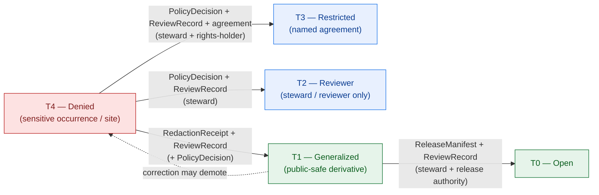

<!-- [KFM_META_BLOCK_V2]
doc_id: kfm://doc/docs-domains-fauna-sensitivity
title: Fauna Domain — Sensitivity & Geoprivacy
type: standard
version: v1
status: draft
owners: [NEEDS VERIFICATION — fauna domain steward; sensitivity reviewer; rights-holder representative; docs steward]
created: 2026-06-02
updated: 2026-06-02
policy_label: public
related:
  - docs/domains/fauna/README.md
  - docs/domains/fauna/SCHEMAS.md
  - docs/doctrine/directory-rules.md
  - docs/doctrine/ai-build-operating-contract.md
  - policy/sensitivity/fauna/
  - policy/domains/fauna/
  - schemas/contracts/v1/correction/redaction_receipt.schema.json
  - contracts/governance/review_record.md
  - tests/domains/fauna/
  - fixtures/domains/fauna/
tags: [kfm, domain, fauna, sensitivity, geoprivacy, deny-by-default, redaction]
notes:
  # Sensitivity is the Fauna lane's anchor invariant. This doc EXPLAINS the posture; policy/sensitivity/fauna/ DECIDES it.
  # Disposition is routed through the AI Build Operating Contract §23.2 sensitive-domain matrix; it is NOT re-derived here.
  # Deliberately contains NO exact coordinates, identifiers, generalization radii, or fuzzing parameters — naming those could be an exposure aid.
  # Sensitive occurrence = T4 default (Atlas §24.5.2). Tier scheme T0–T4 is PROPOSED pending ADR-S-05 ratification.
  # Doctrine-adjacent doc; CONTRACT_VERSION = "3.0.0" pinned per AI Build Operating Contract v3.0.
[/KFM_META_BLOCK_V2] -->

<a id="top"></a>

# Fauna Domain — Sensitivity & Geoprivacy

> How the Fauna lane protects sensitive taxa, sites, and steward-controlled records from harmful exposure: the deny-by-default posture, the tier scheme, the transforms and receipts that govern any release, and who must review what. This doc **explains and crosswalks**; the binding rules live in `policy/sensitivity/fauna/`.

<p align="center">
  <b>Deny-by-default · Fail-closed · Generalize before release · Reversible · Receipt-bearing</b>
</p>

---


**Status:** draft · **Owners:** _NEEDS VERIFICATION (fauna steward + sensitivity reviewer + rights-holder rep + docs steward)_ · **Last updated:** 2026-06-02 · **`CONTRACT_VERSION = "3.0.0"`**

---

## Quick links

- [1. Scope](#1-scope)
- [2. Repo fit](#2-repo-fit)
- [3. The anchor invariant](#3-the-anchor-invariant)
- [4. Tier scheme (T0–T4)](#4-tier-scheme-t0t4)
- [5. Fauna deny-by-default register](#5-fauna-deny-by-default-register)
- [6. Geoprivacy transforms](#6-geoprivacy-transforms)
- [7. Tier transitions and required receipts](#7-tier-transitions-and-required-receipts)
- [8. Who reviews what (separation of duties)](#8-who-reviews-what-separation-of-duties)
- [9. The §23.2 sensitive-domain route](#9-the-232-sensitive-domain-route)
- [10. Failure modes and anti-patterns](#10-failure-modes-and-anti-patterns)
- [11. Open questions register](#11-open-questions-register)
- [12. Verification backlog](#12-verification-backlog)
- [13. Changelog & definition of done](#13-changelog--definition-of-done)
- [14. Related docs](#14-related-docs)

---

## 1. Scope

**CONFIRMED doctrine / PROPOSED implementation.** This document explains the **sensitivity and geoprivacy posture** for the Fauna lane: which Fauna records are sensitive, what their default tier is, what transforms and receipts are required before any release, and who must review the decision. It is the prose layer over the binding rules in `policy/sensitivity/fauna/`. [DOM-FAUNA] [ENCY Atlas §24.5]

> [!CAUTION]
> **This is a safety-critical surface.** Exact location exposure of sensitive taxa, nests, dens, roosts, hibernacula, and spawning sites creates real-world harm (poaching, disturbance, collection, habitat loss). The Fauna lane **fails closed**: when sensitivity, rights, or review state is unresolved, the answer is **DENY** or **ABSTAIN**, never a guessed-safe release. This doc therefore contains **no exact coordinates, identifiers, generalization radii, or fuzzing parameters** — naming those values would itself be an exposure aid. [DOM-FAUNA] [OPCON §23]

This doc **explains**; it does not **decide**. If this doc and `policy/sensitivity/fauna/` disagree, **policy wins** and the discrepancy is a drift entry.

[Back to top ↑](#top)

---

## 2. Repo fit

**This file:** `docs/domains/fauna/SENSITIVITY.md` *(PROPOSED — placement basis: Directory Rules §4 Step 1 "explains something to humans" → `docs/`; §4 Step 3 puts `fauna` as a segment, never a root.)* [DIRRULES §4 Step 1, §4 Step 3]

| Concern | Owner | Status |
|---|---|---|
| This doc (prose explanation) | `docs/domains/fauna/SENSITIVITY.md` | PROPOSED placement |
| Binding admissibility rules | `policy/sensitivity/fauna/`, `policy/domains/fauna/` | PROPOSED — **authoritative** |
| Schema-side reinforcement | `schemas/contracts/v1/domains/fauna/` (see [SCHEMAS.md](./SCHEMAS.md)) | PROPOSED |
| RedactionReceipt shape | `schemas/contracts/v1/correction/redaction_receipt.schema.json` | PROPOSED |
| Proof | `tests/domains/fauna/`, `fixtures/domains/fauna/` | PROPOSED |
| Tier scheme + matrix doctrine | Atlas v1.1 §24.5; Operating Contract §23 | CONFIRMED doctrine (tier *values* PROPOSED, ADR-S-05) |

[Back to top ↑](#top)

---

## 3. The anchor invariant

**CONFIRMED doctrine.** Sensitive species default to **DENY or ABSTAIN** until redaction, aggregation, or role-gated access is explicitly approved. KFM publishes only the **safest representation that still answers the steward's and the public's reasonable needs** — not the most detailed one. [ENCY KFM-P24-IDEA-0002] [DOM-FAUNA]

Three principles follow:

1. **A claim can be well-sourced and still unsafe.** Source quality never overrides sensitivity. Public exposure is a *governed state*, not a reward for data quality.
2. **Existence ≠ location.** That a record *exists* may sometimes be releasable even when its *exact geometry* is denied — but only as steward review permits.
3. **Unresolved means closed.** Missing rights, unresolved sensitivity, or absent review state blocks public promotion. The default is denial, recorded with a reason. [ENCY] [DIRRULES]

[Back to top ↑](#top)

---

## 4. Tier scheme (T0–T4)

**CONFIRMED doctrine / PROPOSED values.** KFM uses a five-tier sensitivity / rights scheme (Atlas §24.5.1), extending the v1.0 §20.5 Deny-by-Default Register. The tier *definitions and adoption* are PROPOSED pending ADR-S-05. [ENCY Atlas §24.5.1, §20.5]

| Tier | Name | Definition | Default audience |
|---|---|---|---|
| **T0** | Open | Public-safe, no transform required beyond standard release | Any public client via governed API |
| **T1** | Generalized | Public-safe only after generalization, fuzzing, aggregation, or redaction; transform reviewed and recorded | Any public client via governed API |
| **T2** | Reviewer | Released only to authenticated reviewers / domain stewards; policy-bounded; correction path active | Stewards, reviewers, named collaborators |
| **T3** | Restricted | Released only under named agreement (rights, sovereignty, consent), recorded | Named authorized parties only |
| **T4** | Denied | Not released to any audience; existence may be released only as steward review permits | — |

> [!NOTE]
> **Two related vocabularies exist.** The **T0–T4 tier scheme** above governs release audience. The corpus also describes a **`sensitivity_rank` 0–5 rubric** with named redaction profiles (Pass-10 C6-01), where rank 5 is fail-closed. These are **distinct but compatible** vocabularies — a record may carry both a tier and a rank. Which is canonical for Fauna persistence is OQ-FAUNA-SEN-04; do not silently merge them. [ENCY C6-01] [ENCY Atlas §24.5.1]

[Back to top ↑](#top)

---

## 5. Fauna deny-by-default register

**CONFIRMED doctrine.** The Fauna rows below are taken from the Atlas per-domain tier matrix (§24.5.2) and the §20.5 Deny-by-Default Register. Default tiers are CONFIRMED; specific transform parameters are PROPOSED and live in policy. [ENCY Atlas §24.5.2, §20.5] [DOM-FAUNA]

| Fauna object class | Default tier | Denied by default | Released only when |
|---|---|---|---|
| **Sensitive OccurrenceRecord** (exact geometry) | **T4** | Exact sensitive-taxon coordinates | Geoprivacy generalization + RedactionReceipt → T1, with ReviewRecord + PolicyDecision |
| **SensitiveSite** (nest / den / roost / hibernacula / spawning) | **T4** | Exact site geometry | Generalization or suppression + RedactionReceipt → T1; T2 only with steward review |
| **Steward-controlled records** (e.g., tribal, landowner, agency-restricted) | **T4** | Republication without rights resolution | Rights-holder representative co-signs; rights resolution recorded |
| **Re-identifying joins** (public sources that together reveal a sensitive location) | **T4** | The join output | Join rule + sensitivity reviewer; route through steward queue |
| **RangePolygon** | **T1** | Raw exact geometry | Aggregated / generalized public-safe layer + AggregationReceipt or RedactionReceipt |
| **OccurrencePublic** (general, non-sensitive taxa) | **T0** | — | Standard release path + ReleaseManifest + ReviewRecord |
| **InvasiveSpeciesRecord** | **T0 / T1** | Private-parcel detail | Public reporting layer; landowner detail aggregated where a private-parcel join is implicated |

> [!IMPORTANT]
> **The KFM-as-authority boundary holds.** The Fauna lane is not an enforcement or alert authority. Where a record touches the emergency-adjacent boundary, that disposition belongs to `[DOM-HAZ]`, which is `T4 forever` for any "KFM as alert authority" framing. [ENCY Atlas §24.5.2] [DOM-HAZ]

[Back to top ↑](#top)

---

## 6. Geoprivacy transforms

**CONFIRMED doctrine / PROPOSED parameters.** A geoprivacy transform is a **documented, deterministic, reproducible** generalization, fuzzing, aggregation, or withholding applied to sensitive geometry, recorded in a `RedactionReceipt`. Redaction is **policy-driven, never improvised at the edges of the system**. [ENCY C6-02]

The corpus names a small library of redaction-profile *families* (Pass-10 C6.b). The Fauna lane draws from these; the **concrete parameters are deliberately not stated here** and live in `policy/sensitivity/fauna/`.

| Transform family | What it does (doctrine level) | Recorded in |
|---|---|---|
| **Generalize to grid** | Replace an exact point with a coarse cell / density grid | RedactionReceipt (`geometry_transform`) |
| **Generalize to administrative / hydrologic unit** | Snap to county, watershed, or coarser unit | RedactionReceipt |
| **Jitter / mask** | Deterministic, seeded displacement within a masked radius | RedactionReceipt |
| **Aggregation** | Roll up to a count or density over a scope; suppress small cells | AggregationReceipt |
| **Withhold / suppress** | Remove geometry entirely; release existence only if permitted | RedactionReceipt (or full denial) |
| **Delayed publication / embargo** | Time-bound suppression; release only after an embargo window | RedactionReceipt (`policy_ref` embargo) |

> [!WARNING]
> **Determinism matters.** A transform that is not reproducible cannot be audited, cannot be re-evaluated on correction, and cannot be proven safe. The same logical input under the same policy must produce the same redacted output. Non-deterministic redaction is a failure mode (§10). [ENCY C6-02]

**RedactionReceipt — required content (PROPOSED shape):** `policy_ref`, `redaction_method`, `kept_fields`, `removed_fields`, `geometry_transform`, `reviewer`. [ENCY Atlas §24.2 receipt catalog]

[Back to top ↑](#top)

---

## 7. Tier transitions and required receipts

**CONFIRMED doctrine.** Moving a Fauna record toward public release is a **governed transition** with required artifacts and a required reviewer, and it is **reversible**. The table below is the Atlas §24.5.3 allowed-motion table, filtered to the motions Fauna actually uses. [ENCY Atlas §24.5.3]

| From → To | Required artifact(s) | Required reviewer | Reversibility |
|---|---|---|---|
| **T4 → T1** (sensitive occurrence → generalized public) | RedactionReceipt + ReviewRecord (+ PolicyDecision) | Sensitivity reviewer / steward | Reversible: redaction can be re-evaluated; a correction may demote a published T1 back to T4 |
| **T4 → T2** (sensitive site → reviewer-only) | PolicyDecision + ReviewRecord | Steward | Reversible: review revocation returns the object to T4 |
| **T4 → T3** (steward-controlled → named agreement) | PolicyDecision + ReviewRecord + agreement | Steward + rights-holder representative | Reversible: agreement revocation returns to T4 with a CorrectionNotice |
| **T1 → T0** (generalized → fully open) | ReleaseManifest + ReviewRecord | Steward + release authority | Reversible: rollback via RollbackCard |



> [!NOTE]
> **Every transition is reversible by design.** Rollback and correction are first-class. Demoting a published T1 back to T4 (e.g., after a rights change or a re-identification discovery) is a normal, supported operation via CorrectionNotice + RollbackCard — not a system failure. [ENCY Atlas §24.5.3, Appendix E]

[Back to top ↑](#top)

---

## 8. Who reviews what (separation of duties)

**CONFIRMED doctrine (operating-law invariant 9).** For sensitive Fauna releases, **the author is never the sole approver**. Separation of duties is maturity-dependent and, as the public trust surface grows, must be enforced through tooling rather than custom (ADR-S-09). [ENCY Atlas §24.7] [DIRRULES §2]

| Action | May author also approve? | Required separation |
|---|---|---|
| Promotion to PROCESSED / CATALOG (sensitive lane) | **No** | Domain steward + sensitivity reviewer |
| **Sensitive-lane release to PUBLISHED** | **No** | Author + sensitivity reviewer + release authority + rights-holder representative (where applicable) |
| Correction / rollback (steward-significant) | **No** | Author / detector + correction reviewer + release authority |

**Roles that touch the Fauna sensitivity path:**

- **Sensitivity reviewer** — reviews redaction, generalization, withholding, and tier decisions; signs RedactionReceipts.
- **Domain steward** — owns Fauna object meaning, contracts, and validators.
- **Rights-holder representative** — confirms sovereignty, cultural-heritage, or consent-based release for steward-controlled records.
- **Release authority** — issues ReleaseManifests and authorizes PUBLISHED transitions; distinct from authorship when materiality applies.

[Back to top ↑](#top)

---

## 9. The §23.2 sensitive-domain route

**CONFIRMED doctrine.** Fauna disposition is **routed through** the AI Build Operating Contract §23.2 sensitive-domain decision matrix; this lane does **not** re-derive disposition. The relevant row is reproduced below for orientation. The matrix is **PROPOSED** as of v3.0; until ratified, **the most restrictive applicable row applies**. [OPCON §23.2]

| Domain (§23.2) | Default disposition at public surface | Required transform before release | Required reviewer beyond domain steward | Required receipts/manifests |
|---|---|---|---|---|
| **Rare species (occurrence)** | **DENY** exact coordinates | Generalize to public-safe grid | Wildlife steward | RedactionReceipt; LayerManifest (sensitive-flag) |
| Exact-harm coordinates | DENY | Generalize or full denial | Security reviewer | RedactionReceipt |
| Indigenous / cultural records (if a Fauna record is steward-controlled) | DENY unless steward-approved | Steward gate | Tribal / cultural reviewer | PolicyDecision; ReviewRecord |

**Default disposition when no row clearly matches** (Operating Contract §23.2 fallback):

```text
DENY public exact exposure
GENERALIZE before publication
REDACT when needed
QUARANTINE uncertain source material
REQUIRE steward review
REQUIRE transform receipt (RedactionReceipt)
ABSTAIN when support is inadequate
```

> [!CAUTION]
> When a Fauna record's correct disposition is unclear, **do not guess toward release.** Apply the most restrictive applicable §23.2 row, surface the uncertainty, and route to the sensitivity reviewer. Quarantine uncertain source material rather than admitting it. [OPCON §23.2]

[Back to top ↑](#top)

---

## 10. Failure modes and anti-patterns

| Anti-pattern | Why it is dangerous | Correct posture |
|---|---|---|
| Publishing exact sensitive geometry because "the source is public" | Aggregating public sources can re-identify a protected location | Treat the *join output* as T4; route through sensitivity review |
| Non-deterministic / improvised redaction | Cannot be audited, re-evaluated, or proven safe | Deterministic, seeded, policy-driven transforms only; record in RedactionReceipt |
| Treating schema-valid as release-safe | A T4 record can be perfectly schema-valid and still must be DENY | Shape is necessary, not sufficient; policy decides release |
| Author self-approving a sensitive release | Removes the independent safety check | Author ≠ release authority; sensitivity reviewer + rights-holder rep required |
| Leaking sensitive geometry via popup, label, tile attribute, or AI text | Side channels bypass the geometry gate | Tile field allowlist; AI cite-or-abstain; side-channel audits |
| Naming concrete radii / parameters in public docs | The parameters themselves become an exposure aid | Keep parameters in `policy/sensitivity/fauna/`, not in prose |
| Silent in-place "fix" of a published sensitive layer | Destroys correction lineage; rollback target lost | CorrectionNotice + RollbackCard; demote to T4 if needed |

[Back to top ↑](#top)

---

## 11. Open questions register

| ID | Question | Owner role | Resolution path |
|---|---|---|---|
| OQ-FAUNA-SEN-01 | Ratify the T0–T4 tier scheme as canonical for Fauna. | Sensitivity reviewer + steward | ADR-S-05 |
| OQ-FAUNA-SEN-02 | Exact geoprivacy parameters (generalization scope, jitter distribution, suppression thresholds) and their home under `policy/sensitivity/fauna/`. | Sensitivity reviewer | Policy authoring + ADR |
| OQ-FAUNA-SEN-03 | RedactionReceipt schema home and required-field set for Fauna. | Schema steward | ADR-S-03 + `schemas/contracts/v1/correction/` |
| OQ-FAUNA-SEN-04 | Canonical persistence vocabulary: T0–T4 tier vs `sensitivity_rank` 0–5 rubric (and any KDWP SINC mapping). | Domain + sensitivity stewards | ADR reconciling Atlas §24.5 with C6-01 |
| OQ-FAUNA-SEN-05 | Which Fauna joins require sensitivity review, which are denied, which are open. | Sensitivity reviewer | ADR-S-14 (cross-lane join policy) |
| OQ-FAUNA-SEN-06 | Two-person-rule scope and tooling enforcement for T4→public Fauna motions. | Release authority | ADR-S-09 / ADR-S-12 |

[Back to top ↑](#top)

---

## 12. Verification backlog

These items remain `NEEDS VERIFICATION` before this doc is promoted from `draft` to `published`.

1. **NEEDS VERIFICATION** — Steward permissions and access classes for KDWP-like sensitive Fauna lanes.
2. **NEEDS VERIFICATION** — Presence and contents of `policy/sensitivity/fauna/` (the binding rules this doc points to).
3. **NEEDS VERIFICATION** — RedactionReceipt and AggregationReceipt schema presence and field sets.
4. **NEEDS VERIFICATION** — Tile field allowlist and side-channel-leak tests under `tests/domains/fauna/`.
5. **NEEDS VERIFICATION** — Atlas §24.5 tier ratification status (ADR-S-05) before T0–T4 motions are treated as enforced rather than proposed.
6. **NEEDS VERIFICATION** — Whether the `sensitivity_rank` 0–5 rubric or the T0–T4 tier scheme is the persisted Fauna field (OQ-FAUNA-SEN-04).
7. **NEEDS VERIFICATION** — Owners and named reviewers for the Fauna sensitivity path.

[Back to top ↑](#top)

---

## 13. Changelog & definition of done

### 13.1 Changelog

| Change | Type (per contract §37) | Reason |
|---|---|---|
| Initial draft of the Fauna sensitivity & geoprivacy posture | new | No prior `SENSITIVITY.md` existed for the lane |
| Routed disposition through Operating Contract §23.2 rather than re-deriving | clarification | Sensitive-domain handling requires deferring to the matrix |
| Reproduced Atlas §24.5.2 Fauna tier rows and §24.5.3 transition table | gap closure | CONFIRMED tier defaults and allowed-motion artifacts |
| Surfaced the T0–T4 tier vs `sensitivity_rank` 0–5 rubric as distinct vocabularies (OQ-FAUNA-SEN-04) | reconciliation | Both appear in corpus; conflating them is unsafe |
| Deliberately excluded concrete geoprivacy parameters | clarification | Naming radii/distributions in public prose is itself an exposure aid |
| Pinned `CONTRACT_VERSION = "3.0.0"` | housekeeping | Doctrine-adjacent doc requirement |

> **Backward compatibility.** New file; no existing anchors to preserve. Object-class names match Atlas §24.5.2; tier values are PROPOSED pending ADR-S-05.

### 13.2 Definition of done

This document is done enough to enter the repository when:

- it is placed at `docs/domains/fauna/SENSITIVITY.md` per Directory Rules §4 Step 1 + §4 Step 3;
- a sensitivity reviewer, the fauna domain steward, a rights-holder representative, **and** a docs steward review it;
- it is linked from `docs/domains/fauna/README.md`;
- it does not conflict with accepted ADRs (notably ADR-S-05 tier scheme, ADR-S-03 receipt home);
- `policy/sensitivity/fauna/` exists and this doc accurately points to it (or the gap is logged in `docs/registers/DRIFT_REGISTER.md`);
- the `GENERATED_RECEIPT.json` planned for this artifact is wired into CI;
- future changes follow the operating contract's §37 lifecycle.

[Back to top ↑](#top)

---

## 14. Related docs

- [`docs/domains/fauna/README.md`](./README.md) — Fauna domain landing page
- [`docs/domains/fauna/SCHEMAS.md`](./SCHEMAS.md) — Fauna schema home (schema-side sensitivity reinforcement)
- [`docs/domains/fauna/RELEASE_INDEX.md`](./RELEASE_INDEX.md) — Fauna release index *(PROPOSED — verify presence)*
- [`docs/doctrine/directory-rules.md`](../../doctrine/directory-rules.md) — placement and lifecycle doctrine
- [`docs/doctrine/ai-build-operating-contract.md`](../../doctrine/ai-build-operating-contract.md) — §23 sensitive-domain handling; `CONTRACT_VERSION = "3.0.0"`
- [`policy/sensitivity/fauna/`](../../../policy/sensitivity/fauna/) — **binding** Fauna sensitivity rules *(PROPOSED — authoritative)*
- [`policy/domains/fauna/`](../../../policy/domains/fauna/) — Fauna admissibility policy *(PROPOSED)*
- [`schemas/contracts/v1/correction/redaction_receipt.schema.json`](../../../schemas/contracts/v1/correction/redaction_receipt.schema.json) — RedactionReceipt shape *(PROPOSED)*
- [`contracts/governance/review_record.md`](../../../contracts/governance/review_record.md) — ReviewRecord meaning *(PROPOSED)*
- **Atlas references:** Atlas v1.1 §20.5 (Deny-by-Default Register), §24.2 (Receipt Catalog), §24.5 (Sensitivity / Rights Tiers T0–T4), §24.7 (Reviewer / Separation-of-Duties); Pass-10 C6 (sensitivity rubric, redaction profiles, geoprivacy)
- **Operating Contract:** §23.1 (sensitive domain list), §23.2 (sensitive-domain decision matrix)

[Back to top ↑](#top)

---

### Footer

**Related docs:** [README.md](./README.md) · [SCHEMAS.md](./SCHEMAS.md) · [RELEASE_INDEX.md](./RELEASE_INDEX.md) · [ai-build-operating-contract.md](../../doctrine/ai-build-operating-contract.md) · [policy/sensitivity/fauna/](../../../policy/sensitivity/fauna/)

**Last updated:** 2026-06-02 · **Owners:** _NEEDS VERIFICATION_ · **Status:** draft · **`CONTRACT_VERSION = "3.0.0"`**

[Back to top ↑](#top)
