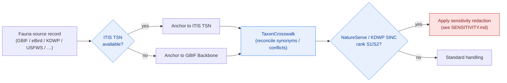

<!-- [KFM_META_BLOCK_V2]
doc_id: kfm://doc/docs-domains-fauna-sources
title: Fauna Domain — Sources & Source Roles
type: standard
version: v1
status: draft
owners: [NEEDS VERIFICATION — fauna domain steward; source steward; docs steward]
created: 2026-06-02
updated: 2026-06-02
policy_label: public
related:
  - docs/domains/fauna/README.md
  - docs/domains/fauna/SENSITIVITY.md
  - docs/domains/fauna/SCHEMAS.md
  - docs/doctrine/directory-rules.md
  - docs/doctrine/ai-build-operating-contract.md
  - data/registry/sources/fauna/
  - schemas/contracts/v1/source/source-descriptor.json
  - contracts/source/source_descriptor.md
  - policy/sensitivity/fauna/
  - docs/runbooks/fauna/SOURCE_REFRESH_RUNBOOK.md
tags: [kfm, domain, fauna, sources, source-role, anti-collapse, rights]
notes:
  # Explains the Fauna source families and the source-role discipline. Authoritative SourceDescriptors live in data/registry/sources/fauna/.
  # The canonical source-role enum is the SEVEN-class set (Atlas §24.1): observed | regulatory | modeled | aggregate | administrative | candidate | synthetic. The Fauna chapter's authority/observation/context/model phrasing is informal shorthand mapped here.
  # source_role is set at admission and NEVER upgraded by promotion (Atlas §24.1).
  # All connector rights/terms are NEEDS VERIFICATION. eBird EBD carries restricted-use republication terms.
  # Doctrine-adjacent doc; CONTRACT_VERSION = "3.0.0" pinned per AI Build Operating Contract v3.0.
[/KFM_META_BLOCK_V2] -->

<a id="top"></a>

# Fauna Domain — Sources & Source Roles

> The Fauna lane's source families, the source-role discipline that keeps an observation from masquerading as a regulation, and how rights and sensitivity gate every source. This doc **explains and crosswalks**; the authoritative source records are the `SourceDescriptor`s under `data/registry/sources/fauna/`.

<p align="center">
  <b>Role-first · Rights-gated · Anti-collapse · Sensitive joins fail closed</b>
</p>

---


**Status:** draft · **Owners:** _NEEDS VERIFICATION (fauna + source + docs stewards)_ · **Last updated:** 2026-06-02 · **`CONTRACT_VERSION = "3.0.0"`**

---

## Quick links

- [1. Scope](#1-scope)
- [2. Repo fit](#2-repo-fit)
- [3. Source role is first-class identity](#3-source-role-is-first-class-identity)
- [4. The canonical source-role enum](#4-the-canonical-source-role-enum)
- [5. Fauna source families](#5-fauna-source-families)
- [6. Anti-collapse failure modes](#6-anti-collapse-failure-modes)
- [7. Rights and the restricted-use trap](#7-rights-and-the-restricted-use-trap)
- [8. Taxonomy anchoring](#8-taxonomy-anchoring)
- [9. SourceDescriptor and the registry](#9-sourcedescriptor-and-the-registry)
- [10. Admitting a new Fauna source](#10-admitting-a-new-fauna-source)
- [11. Open questions register](#11-open-questions-register)
- [12. Verification backlog](#12-verification-backlog)
- [13. Changelog & definition of done](#13-changelog--definition-of-done)
- [14. Related docs](#14-related-docs)

---

## 1. Scope

**CONFIRMED doctrine / PROPOSED implementation.** This document explains the Fauna lane's **source families**, the **source-role discipline** that fixes what each source is and forbids collapsing roles, and the **rights and sensitivity** posture that gates admission. It is the prose layer over the `SourceDescriptor` records in `data/registry/sources/fauna/`. [DOM-FAUNA] [ENCY Atlas §24.1]

This doc **explains**; it does not **decide**. The authoritative source identity, role, rights, and sensitivity live in each `SourceDescriptor`. If this doc and a descriptor disagree, **the descriptor wins** and the discrepancy is a drift entry.

> [!IMPORTANT]
> **Biodiversity is the most plurally-sourced domain in KFM** — international aggregators, citizen science, federal authorities, state stewards, and in-state collections all feed it. That plurality is exactly why source role and rights must be pinned per source: a GBIF aggregate record and a USFWS listing determination are *not* interchangeable, and treating them as such is a governed failure. [ENCY C10-biodiversity] [DOM-FAUNA]

[Back to top ↑](#top)

---

## 2. Repo fit

**This file:** `docs/domains/fauna/SOURCES.md` *(PROPOSED — placement basis: Directory Rules §4 Step 1 "explains something to humans" → `docs/`; §4 Step 3 puts `fauna` as a segment, never a root.)* [DIRRULES §4 Step 1, §4 Step 3]

| Concern | Owner | Status |
|---|---|---|
| This doc (prose) | `docs/domains/fauna/SOURCES.md` | PROPOSED placement |
| Source records (authoritative) | `data/registry/sources/fauna/` | PROPOSED — **authoritative** |
| SourceDescriptor shape | `schemas/contracts/v1/source/source-descriptor.json` | CONFIRMED home rule (ADR-0001 / §7.4); presence PROPOSED |
| SourceDescriptor meaning | `contracts/source/source_descriptor.md` | PROPOSED |
| Source-role enum vocabulary | Atlas §24.1.1 → ADR-S-04 (canonical vocabulary) | CONFIRMED doctrine; enum freeze PROPOSED |
| Rights / sensitivity gating | `policy/sensitivity/fauna/`, `policy/domains/fauna/` | PROPOSED |
| Refresh procedure | `docs/runbooks/fauna/SOURCE_REFRESH_RUNBOOK.md` | PROPOSED |

[Back to top ↑](#top)

---

## 3. Source role is first-class identity

**CONFIRMED doctrine.** KFM treats **source role as a first-class identity attribute**. An observed reading is not interchangeable with a modeled estimate; a regulatory determination is not interchangeable with an administrative compilation; an aggregate is not a per-place record; synthetic content is never observed reality. The lifecycle and the governed API both **fail closed** when these roles are conflated. [ENCY Atlas §24.1]

Two rules follow that the Fauna lane must enforce:

1. **Role is set at admission and never upgraded by promotion.** Promotion does not turn a model into an observation, or a candidate into a verified record. Those are separate governed transitions with their own evidence. A "promotion that upgrades a source role" is an anti-pattern. [ENCY Atlas §24.1, §24.9.3]
2. **Corrections produce a new descriptor, not an in-place edit.** If a source's role was mislabeled, the fix is a new `SourceDescriptor` plus a `CorrectionNotice` — never a silent overwrite. [ENCY Atlas §24.1.3]

[Back to top ↑](#top)

---

## 4. The canonical source-role enum

> [!WARNING]
> **Two vocabularies appear in the corpus — use the canonical one.** The Atlas Fauna chapter (§7.D) uses an informal shorthand — *authority / observation / context / model* — in its source-family table. The **canonical, repo-bearing enum** is the **seven-class set** below (Atlas §24.1.1), which is what a `SourceDescriptor.source_role` field carries. This doc maps the shorthand to the canonical enum; the canonical enum governs. The enum freeze is ADR-S-04. [ENCY Atlas §24.1.1, §7.D]

| Canonical role | Definition (CONFIRMED) | Fauna example | Never relabeled as |
|---|---|---|---|
| **`observed`** | Direct reading / first-hand record tied to place + time | A field occurrence record; an acoustic detection | regulatory, administrative |
| **`regulatory`** | Authoritative determination with legal/administrative force | USFWS listing; designated critical-habitat unit; T&E status | observed, modeled |
| **`modeled`** | Derived product from inputs/assumptions; uncertainty preserved | Species suitability raster; range model | observation |
| **`aggregate`** | Summary/total over a unit; individual fidelity lost | Occurrence density grid; county species totals | per-place record |
| **`administrative`** | Compiled agency record (registration/accounting) | A survey roster; a permit register | observation, regulation |
| **`candidate`** | Watcher/ingest candidate not yet promoted | A drift-detector record awaiting review | a PUBLISHED record |
| **`synthetic`** | Generated/reconstructed content; not observed reality | A reconstructed range surface | observation |

**Shorthand → canonical mapping** (so the §7.D table and the README's "authority/observation/context/model" wording resolve cleanly):

| Fauna shorthand (§7.D) | Canonical enum |
|---|---|
| authority (legal/conservation status) | `regulatory` |
| observation | `observed` |
| context (e.g., NLCD/NWI/PAD-US/SSURGO) | usually `observed` or `aggregate`, used as **context only** — never fauna truth |
| model | `modeled` |
| (aggregator, e.g., GBIF) | `observed` records re-served by an aggregator — **aggregator is a distributor, not a role**; the underlying record keeps its role |

[Back to top ↑](#top)

---

## 5. Fauna source families

**CONFIRMED families / NEEDS VERIFICATION rights.** The families below are the Fauna source set from Atlas §7.D. Each family's **rights and current terms are NEEDS VERIFICATION**, and **sensitive joins fail closed** across all of them. Role is per-record, assigned at admission. [ENCY Atlas §7.D] [DOM-FAUNA]

| Source family | Typical canonical role(s) | Rights / sensitivity | Status |
|---|---|---|---|
| **KDWP-like steward sources** (incl. T&E county lists, SINC) | `regulatory` (status), `observed` | Steward-controlled; sensitive joins fail closed; rights **NEEDS VERIFICATION** | [DOM-FAUNA] [DOM-HF] [ENCY] |
| **USFWS ECOS / IPaC-like federal** | `regulatory` (listing, critical habitat), `observed` | Follow federal sensitivity flags; rights **NEEDS VERIFICATION** | NEEDS VERIFICATION |
| **NatureServe / heritage-style** | `regulatory`/`aggregate` (status ranks), `observed` | Element-occurrence sensitivity respected; **S1/S2 ranks drive redaction**; rights **NEEDS VERIFICATION** | NEEDS VERIFICATION |
| **GBIF / eBird / iNaturalist / iDigBio / BISON** (aggregators) | `observed` (records re-served via aggregator) | Aggregator + record-level sensitivity; **eBird EBD restricted-use** (see §7); rights **NEEDS VERIFICATION** | NEEDS VERIFICATION |
| **EDDMapS / invasive feeds** | `observed`, occasionally `regulatory` (invasives) | Invasive non-target sensitivity reviewed; rights **NEEDS VERIFICATION** | NEEDS VERIFICATION |
| **Agency monitoring / surveys / eDNA / acoustic / telemetry** | `observed`, `modeled` | **Telemetry geometry deny-default**; rights **NEEDS VERIFICATION** | NEEDS VERIFICATION |
| **NLCD / NWI / PAD-US / SSURGO** (context layers) | `observed`/`aggregate`, **context only** | Adjacency only via governed joins — **not fauna truth** | [DOM-FAUNA] |

> [!NOTE]
> The corpus names specific descriptor sketches worth modeling on: an **eBird EBD** descriptor (monthly cadence, `species_code`, `observation_id`, `checklist_id`, effort fields, `source_uri`, terms, sensitivity posture), a **USFWS IPaC** descriptor (Location API / project species, `taxon_id`, consultation identifiers, API-key requirement, sensitivity defaults), and a **KDWP T&E county** descriptor. These are PROPOSED shapes, not asserted repo files. [ENCY KFM-P24-PROG-0001/0002/0003]

[Back to top ↑](#top)

---

## 6. Anti-collapse failure modes

**CONFIRMED doctrine.** The collapses below are DENY conditions at publication and ABSTAIN at the AI surface. The Fauna-relevant rows: [ENCY Atlas §24.1.2]

| Collapse pattern | Fauna example | Denied outcome | Guardrail |
|---|---|---|---|
| **Modeled queried as observed** | A suitability raster cited as a sighting | DENY at publication; ABSTAIN at AI | ModelRunReceipt + uncertainty surface + role-preserving field |
| **Regulatory labeled as observed** | A listing/critical-habitat unit cited as a field observation | DENY publication as event evidence | Separate regulatory and observed lanes; UI banner |
| **Aggregate cited as per-place truth** | A density-grid cell read as a single occurrence | DENY join from cell to record; ABSTAIN at AI | AggregationReceipt; geometry-scope guard |
| **Candidate exposed publicly** | A watcher candidate served to a public client | DENY at trust membrane; route to QUARANTINE | Promotion gate; no PUBLISHED edge to WORK/QUARANTINE |
| **Synthetic presented as observed** | A reconstructed range shown without disclosure | DENY; HOLD for steward review; ABSTAIN at AI | Reality Boundary Note; Representation Receipt; UI badge |
| **AI text treated as evidence** | A Focus Mode summary cited as a source | DENY; ABSTAIN at Focus Mode; AIReceipt mandatory | Cite-or-abstain; release state required |

> [!IMPORTANT]
> **An aggregator is a distributor, not a role.** GBIF re-serving an `observed` museum record does not make the record an "aggregate," and it never makes the record a `regulatory` status. The record keeps the role of its origin; the aggregator is recorded as the access path, not the authority. Conflating "where I got it" with "what it is" is the most common Fauna source error. [ENCY Atlas §24.1]

[Back to top ↑](#top)

---

## 7. Rights and the restricted-use trap

**CONFIRMED doctrine / NEEDS VERIFICATION specifics.** Unclear rights block public promotion — the lane abstains or quarantines rather than guessing. Some biodiversity sources travel under terms that **limit republication even when the data is freely downloadable**. [ENCY] [DIRRULES]

> [!CAUTION]
> **eBird EBD carries restricted-use republication terms.** Any KFM release derived from the eBird Basic Dataset must be checked against the EBD terms and may require approval. "We could download it" is not "we may republish it." The same caution applies to any source whose `SourceDescriptor` rights field is unresolved. Treat rights as a gate, not a formality. [ENCY C10-biodiversity]

Rights posture for the Fauna lane:

- **Rights field is mandatory** on every Fauna `SourceDescriptor`; unresolved rights → `RIGHTS_UNKNOWN` → no public promotion.
- **A restricted-use registry** (a small machine-readable policy asset) should name what KFM can and cannot publish per source. [ENCY C10-biodiversity]
- **Rights can change.** Source rights/sovereignty status changing without re-evaluation is a named high-severity risk; freshness cadence and aged-out review tolerances apply. [ENCY Atlas §24.10]

[Back to top ↑](#top)

---

## 8. Taxonomy anchoring

**CONFIRMED convention.** Every Fauna occurrence should be anchored to a stable taxonomic identifier: **ITIS TSN**, or the **GBIF Backbone** where ITIS is silent. The originating institution is preserved, and the `TaxonCrosswalk` object reconciles synonyms and conflicts across authority taxonomies. [ENCY C10-biodiversity] [DOM-FAUNA]



> [!NOTE]
> **Conservation rank drives sensitivity.** Species that NatureServe or KDWP SINC ranks at **S1/S2** trigger redaction (see [SENSITIVITY.md](./SENSITIVITY.md)). The rank is `regulatory`/`aggregate` source-role context, not an observation — it gates exposure; it is not itself a sighting. [ENCY C10-biodiversity]

[Back to top ↑](#top)

---

## 9. SourceDescriptor and the registry

**CONFIRMED doctrine.** A `SourceDescriptor` records a source's identity, role, rights, sensitivity, cadence, access method, and admissibility limits. The canonical schema home is `schemas/contracts/v1/source/source-descriptor.json` (Directory Rules §7.4 / ADR-0001); the meaning lives in `contracts/source/source_descriptor.md`; the per-source records live under `data/registry/sources/fauna/`. [ENCY Atlas §24.1.3] [DIRRULES §7.4]

**Role-bearing descriptor fields (PROPOSED shape, illustrative — verify against the mounted schema):**

| Field | Vocabulary / type | Required when | Note |
|---|---|---|---|
| `source_role` | `observed \| regulatory \| modeled \| aggregate \| administrative \| candidate \| synthetic` | always | Set at admission; never edited in-place |
| `role_authority` | issuing body / model identity / steward | role ∈ {regulatory, modeled, aggregate} | Names the authoring authority for cite text |
| `role_aggregation_unit` | geometry-scope token (county, HUC, grid, year, …) | `source_role = aggregate` | Prevents geometry-scope drift on join |
| `role_model_run_ref` | EvidenceRef → ModelRunReceipt | `source_role = modeled` | Pins inputs/params/version |
| `role_candidate_disposition` | `pending \| merged \| rejected \| quarantined` | `source_role = candidate` | PUBLISHED edge forbidden until `merged` |
| `rights` | SPDX / terms / restricted-use flag | always | `RIGHTS_UNKNOWN` blocks promotion |
| `sensitivity` | tier / posture | always | Sensitive joins fail closed |

> [!IMPORTANT]
> **Watcher-as-non-publisher.** Fauna connectors and ingest watchers write only to `data/raw/fauna/` or `data/quarantine/fauna/` and emit candidate records (`source_role = candidate`). They do **not** publish, mutate canonical truth, or expose RAW/WORK/QUARANTINE to public surfaces. Promotion is a separate governed transition. [DIRRULES §13.5]

[Back to top ↑](#top)

---

## 10. Admitting a new Fauna source

```text
1. Draft a SourceDescriptor: identity, source_role (canonical enum), role_authority, rights, sensitivity, cadence, access method.
2. Resolve rights FIRST. If terms are restricted-use (e.g., eBird EBD), record the constraint; unresolved → RIGHTS_UNKNOWN → stop.
3. Assign sensitivity posture. Sensitive taxa / sites default deny; see SENSITIVITY.md.
4. Anchor taxonomy: ITIS TSN, else GBIF Backbone; preserve originating institution.
5. Open a SourceActivationDecision: allow | restrict | deny | needs-review.
6. First PR is synthetic-only: descriptor skeleton + public-safe fixtures + validators; NO live connector activation.
7. Connector (once approved) writes ONLY to data/raw/fauna/ or data/quarantine/fauna/ — never to processed/ or published/.
8. Cite the Directory Rules section (§7.4 / §4 Step 3) and ADR-0001 in the PR; record in data/registry/sources/fauna/.
```

> [!CAUTION]
> **The first PR for any new Fauna source MUST be synthetic and non-live.** Connector activation comes only after rights, source role, fixtures, validators, and policy gates exist. Activating a live wildlife connector before the rights and sensitivity gates are in place is a governed failure. [DOM-FAUNA]

[Back to top ↑](#top)

---

## 11. Open questions register

| ID | Question | Owner role | Resolution path |
|---|---|---|---|
| OQ-FAUNA-SRC-01 | Freeze the canonical source-role enum and its evolution rule. | Source steward | ADR-S-04 |
| OQ-FAUNA-SRC-02 | Live-connector rights and current terms for KDWP-like, USFWS ECOS/IPaC, NatureServe, GBIF, eBird (EBD), iNaturalist, iDigBio, BISON, EDDMapS. | Source steward + rights reviewer | Rights review records in `data/registry/sources/fauna/` |
| OQ-FAUNA-SRC-03 | Per-source canonical role assignment (observed vs regulatory vs aggregate vs modeled). | Source + domain stewards | Per-source `SourceDescriptor` review |
| OQ-FAUNA-SRC-04 | Restricted-use registry contents (what KFM may/may not publish per source, starting with eBird EBD). | Rights reviewer | Machine-readable policy asset under `policy/` |
| OQ-FAUNA-SRC-05 | Taxonomic resolver of record (ITIS vs GBIF Backbone) and crosswalk-conflict policy. | Domain steward | Taxonomy-resolver ADR |
| OQ-FAUNA-SRC-06 | Which Fauna joins require steward review, which are denied, which are open. | Sensitivity reviewer | ADR-S-14 (cross-lane join policy) |
| OQ-FAUNA-SRC-07 | Connector cadence and quarantine-recovery policy per source family. | Source steward | ADR-S-12 |

[Back to top ↑](#top)

---

## 12. Verification backlog

These items remain `NEEDS VERIFICATION` before this doc is promoted from `draft` to `published`.

1. **NEEDS VERIFICATION** — Rights and current terms for every Fauna source family in §5.
2. **NEEDS VERIFICATION** — eBird EBD republication constraint and whether a KFM-specific terms request exists.
3. **NEEDS VERIFICATION** — Per-source canonical `source_role` assignments.
4. **NEEDS VERIFICATION** — Presence of `data/registry/sources/fauna/` and the SourceDescriptor schema at `schemas/contracts/v1/source/source-descriptor.json`.
5. **NEEDS VERIFICATION** — Steward permissions and access classes for KDWP-like sensitive lanes.
6. **NEEDS VERIFICATION** — Taxonomic resolver of record and `TaxonCrosswalk` conflict policy.
7. **NEEDS VERIFICATION** — Restricted-use registry existence and contents.
8. **NEEDS VERIFICATION** — Owners and named source/rights reviewers.

[Back to top ↑](#top)

---

## 13. Changelog & definition of done

### 13.1 Changelog

| Change | Type (per contract §37) | Reason |
|---|---|---|
| Initial draft of the Fauna sources & source-role doc | new | No prior `SOURCES.md` existed for the lane |
| Promoted the **seven-class canonical source-role enum** (§24.1.1) as authoritative; mapped the §7.D shorthand to it | reconciliation | The Fauna chapter's authority/observation/context/model wording is informal; the canonical enum is what `SourceDescriptor` carries |
| Stated "aggregator is a distributor, not a role" and the role-fixed-at-admission rule | clarification | Most common Fauna source error; CONFIRMED at §24.1 |
| Surfaced eBird EBD restricted-use republication constraint with a `[!CAUTION]` | gap closure | CONFIRMED corpus rights trap (C10-biodiversity) |
| Added ITIS-TSN / GBIF-Backbone anchoring and S1/S2 → redaction driver | gap closure | CONFIRMED taxonomy and sensitivity convention |
| Pinned `CONTRACT_VERSION = "3.0.0"` | housekeeping | Doctrine-adjacent doc requirement |

> **Backward compatibility.** New file; no existing anchors. Note: the README and prior Fauna docs used the informal "authority/observation/context/model" shorthand; §4 here reconciles that with the canonical enum without contradicting them.

### 13.2 Definition of done

This document is done enough to enter the repository when:

- it is placed at `docs/domains/fauna/SOURCES.md` per Directory Rules §4 Step 1 + §4 Step 3;
- a source steward, the fauna domain steward, and a docs steward review it;
- it is linked from `docs/domains/fauna/README.md`;
- it does not conflict with accepted ADRs (notably ADR-S-04 source-role enum, ADR-0001 schema home);
- any conflict with current repo conventions (e.g., shorthand vs canonical enum) is logged in `docs/registers/DRIFT_REGISTER.md`;
- the `GENERATED_RECEIPT.json` planned for this artifact is wired into CI;
- future changes follow the operating contract's §37 lifecycle.

[Back to top ↑](#top)

---

## 14. Related docs

- [`docs/domains/fauna/README.md`](./README.md) — Fauna domain landing page
- [`docs/domains/fauna/SENSITIVITY.md`](./SENSITIVITY.md) — sensitivity & geoprivacy posture (S1/S2 redaction, deny-by-default)
- [`docs/domains/fauna/SCHEMAS.md`](./SCHEMAS.md) — Fauna schema home (SourceDescriptor composition)
- [`docs/doctrine/directory-rules.md`](../../doctrine/directory-rules.md) — §7.4 (source-descriptor home), §4 (placement), §13.5 (watcher/connector anti-patterns)
- [`docs/doctrine/ai-build-operating-contract.md`](../../doctrine/ai-build-operating-contract.md) — `CONTRACT_VERSION = "3.0.0"`
- [`data/registry/sources/fauna/`](../../../data/registry/sources/fauna/) — Fauna SourceDescriptors *(PROPOSED — authoritative)*
- [`schemas/contracts/v1/source/source-descriptor.json`](../../../schemas/contracts/v1/source/source-descriptor.json) — SourceDescriptor schema *(PROPOSED home)*
- [`contracts/source/source_descriptor.md`](../../../contracts/source/source_descriptor.md) — SourceDescriptor meaning *(PROPOSED)*
- [`policy/sensitivity/fauna/`](../../../policy/sensitivity/fauna/) — sensitivity gating *(PROPOSED)*
- [`docs/runbooks/fauna/SOURCE_REFRESH_RUNBOOK.md`](../../runbooks/fauna/SOURCE_REFRESH_RUNBOOK.md) — refresh procedure *(PROPOSED)*
- **Atlas references:** Atlas v1.1 §7.D (Fauna source families), §24.1 (Source-Role Anti-Collapse Register), §24.10 (Risk Register — source integrity); Pass-10 C7 (authority anchoring: ITIS/GBIF), C10 (biodiversity stack, eBird EBD restricted use), KFM-P24-PROG-0001/0002/0003 (source descriptor sketches)

[Back to top ↑](#top)

---

### Footer

**Related docs:** [README.md](./README.md) · [SENSITIVITY.md](./SENSITIVITY.md) · [SCHEMAS.md](./SCHEMAS.md) · [data/registry/sources/fauna/](../../../data/registry/sources/fauna/)

**Last updated:** 2026-06-02 · **Owners:** _NEEDS VERIFICATION_ · **Status:** draft · **`CONTRACT_VERSION = "3.0.0"`**

[Back to top ↑](#top)
