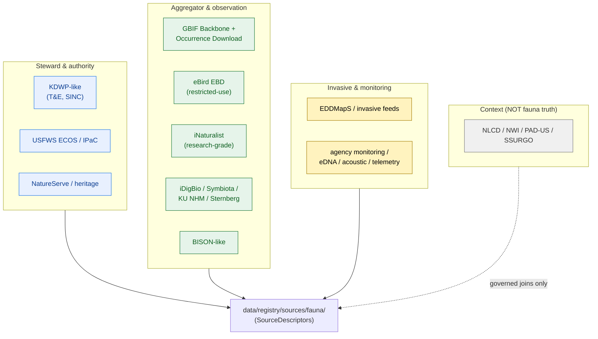

<!-- [KFM_META_BLOCK_V2]
doc_id: kfm://doc/docs-domains-fauna-source-families
title: Fauna Domain — Source Family Reference
type: standard
version: v1
status: draft
owners: [NEEDS VERIFICATION — fauna domain steward; source steward; rights reviewer; docs steward]
created: 2026-06-02
updated: 2026-06-02
policy_label: public
related:
  - docs/domains/fauna/SOURCES.md
  - docs/domains/fauna/SENSITIVITY.md
  - docs/domains/fauna/README.md
  - docs/doctrine/ai-build-operating-contract.md
  - data/registry/sources/fauna/
  - schemas/contracts/v1/source/source-descriptor.json
  - policy/sensitivity/fauna/
  - docs/runbooks/fauna/SOURCE_REFRESH_RUNBOOK.md
tags: [kfm, domain, fauna, sources, source-families, reference, rights]
notes:
  # Per-family deep reference. SOURCES.md holds the doctrine and the canonical role enum; this is the detail catalog SOURCES.md §5 links into.
  # Authoritative source records remain the SourceDescriptors under data/registry/sources/fauna/. This doc is navigation, not authority.
  # ALL rights / terms / cadence values are NEEDS VERIFICATION. eBird EBD carries restricted-use republication terms.
  # Canonical role enum (observed | regulatory | modeled | aggregate | administrative | candidate | synthetic) is defined in SOURCES.md §4.
  # Doctrine-adjacent doc; CONTRACT_VERSION = "3.0.0" pinned per AI Build Operating Contract v3.0.
[/KFM_META_BLOCK_V2] -->

# Fauna Domain — Source Family Reference

> One dossier per Fauna source family: what it is, how it is accessed, what role its records carry, what its rights and sensitivity constraints are, and the per-family gotchas. This is the **detail catalog**; the doctrine and the canonical role enum live in [SOURCES.md](./SOURCES.md), and the authoritative records live in `data/registry/sources/fauna/`.

  <b>Per-family detail · Role-pinned · Rights-gated · Specimen ≠ citizen-science ≠ aggregate</b>

---

**Status:** draft · **Authority:** reference (defers to [SOURCES.md](./SOURCES.md)) · **Owners:** _NEEDS VERIFICATION_ · **Last updated:** 2026-06-02 · **`CONTRACT_VERSION = "3.0.0"`**

> [!IMPORTANT]
> **This is a reference catalog, not the authority.** The Fauna source doctrine, the canonical seven-class role enum, the anti-collapse rules, and the admission procedure live in **[SOURCES.md](./SOURCES.md)**. Per-source authoritative records are the `SourceDescriptor`s in `data/registry/sources/fauna/`. On conflict: **SourceDescriptor wins over SOURCES.md, and SOURCES.md wins over this catalog.** Every rights / terms / cadence value below is **NEEDS VERIFICATION** until confirmed against current source terms.

---

## Quick links

- [1. How to read a dossier](#1-how-to-read-a-dossier)
- [2. Family overview](#2-family-overview)
- [3. Steward & authority families](#3-steward--authority-families)
  - [3.1 KDWP-like steward sources](#31-kdwp-like-steward-sources)
  - [3.2 USFWS ECOS / IPaC](#32-usfws-ecos--ipac)
  - [3.3 NatureServe / heritage](#33-natureserve--heritage)
- [4. Aggregator & observation families](#4-aggregator--observation-families)
  - [4.1 GBIF](#41-gbif)
  - [4.2 eBird (EBD)](#42-ebird-ebd)
  - [4.3 iNaturalist](#43-inaturalist)
  - [4.4 iDigBio / Symbiota / in-state collections](#44-idigbio--symbiota--in-state-collections)
  - [4.5 BISON-like aggregators](#45-bison-like-aggregators)
- [5. Invasive & monitoring families](#5-invasive--monitoring-families)
  - [5.1 EDDMapS / invasive feeds](#51-eddmaps--invasive-feeds)
  - [5.2 Agency monitoring / eDNA / acoustic / telemetry](#52-agency-monitoring--edna--acoustic--telemetry)
- [6. Context layers (not fauna truth)](#6-context-layers-not-fauna-truth)
- [7. Dedupe and UI-weight discipline](#7-dedupe-and-ui-weight-discipline)
- [8. Open questions register](#8-open-questions-register)
- [9. Verification backlog](#9-verification-backlog)
- [10. Changelog & definition of done](#10-changelog--definition-of-done)
- [11. Related docs](#11-related-docs)

---

## 1. How to read a dossier

Each dossier below uses the same fields. All factual values are **NEEDS VERIFICATION** unless a doctrine citation is attached; the *structure* is CONFIRMED. [DOM-FAUNA] [ENCY Atlas §24.1.3]

| Field | What it records |
|---|---|
| **What it is** | One-line identity of the source family |
| **Canonical role** | The seven-class `source_role` its records carry (see [SOURCES.md §4](./SOURCES.md#4-the-canonical-source-role-enum)) |
| **Access / cadence** | How KFM ingests it and how often (PROPOSED / NEEDS VERIFICATION) |
| **Rights posture** | Terms / restrictions / `RIGHTS_UNKNOWN` until resolved |
| **Sensitivity notes** | Per-family deny-by-default and redaction triggers |
| **Gotchas** | The family-specific trap a contributor must not fall into |

> [!NOTE]
> The canonical **role enum** is `observed | regulatory | modeled | aggregate | administrative | candidate | synthetic`. An **aggregator is a distributor, not a role**: a record served by GBIF keeps the role of its origin. See [SOURCES.md §4](./SOURCES.md#4-the-canonical-source-role-enum). [ENCY Atlas §24.1]

[Back to top ↑](#top)

---

## 2. Family overview

| Family | Typical canonical role | Restricted-use? | Default sensitivity flag |
|---|---|---|---|
| KDWP-like steward | `regulatory` (status), `observed` | steward-controlled | sensitive joins fail closed |
| USFWS ECOS / IPaC | `regulatory`, `observed` | API-key (IPaC) | federal sensitivity flags |
| NatureServe / heritage | `regulatory`/`aggregate` (ranks) | **NEEDS VERIFICATION** | **S1/S2 ranks drive redaction** |
| GBIF | `observed` (re-served) | open + per-record terms | record-level sensitivity |
| eBird (EBD) | `observed` | **restricted-use** | sensitive-species redaction; coarsen for public |
| iNaturalist | `observed` (research-grade) | per-observation license | obscured-coordinate respect |
| iDigBio / Symbiota / collections | `observed` (specimen) | per-institution | collection-security where applicable |
| BISON-like | `observed` (re-served) | **NEEDS VERIFICATION** | record-level sensitivity |
| EDDMapS / invasive | `observed`, sometimes `regulatory` | **NEEDS VERIFICATION** | non-target / private-parcel review |
| agency monitoring / telemetry | `observed`, `modeled` | steward / agency | **telemetry geometry deny-default** |
| context layers | `observed`/`aggregate`, **context only** | open | not fauna truth |

[Back to top ↑](#top)

---

## 3. Steward & authority families

<b>3.1 KDWP-like steward sources</b> — state authority for status, T&E, SINC

- **What it is:** Kansas Department of Wildlife & Parks-like state sources, including threatened & endangered (T&E) county lists, Ecological Review Tool / stewardship outputs, and Species In Need of Conservation (SINC) rankings.
- **Canonical role:** `regulatory` for status/listing determinations; `observed` for steward-collected records. **Never** relabel a status determination as an observation.
- **Access / cadence:** Steward-controlled; cadence source-specific. *(NEEDS VERIFICATION)*
- **Rights posture:** Steward-controlled; rights and current terms **NEEDS VERIFICATION**. Sensitive joins fail closed.
- **Sensitivity notes:** **KDWP SINC S1/S2 ranks drive redaction** (see [SENSITIVITY.md](./SENSITIVITY.md)). Steward-controlled records default deny; rights-holder representative co-signs any release.
- **Gotcha:** A SINC rank is `regulatory`/`aggregate` *context that gates exposure* — it is not itself a sighting. Do not treat a ranked-species list as occurrence evidence.
- **Descriptor sketch (PROPOSED):** KDWP T&E county descriptor. [ENCY KFM-P24-PROG-0003]

<b>3.2 USFWS ECOS / IPaC</b> — federal listing, critical habitat, consultation

- **What it is:** USFWS ECOS-like federal datasets (listed species, designated critical habitat) and the IPaC consultation service.
- **Canonical role:** `regulatory` for listings and critical-habitat units; `observed` for federal survey records.
- **Access / cadence:** IPaC via Location API / project species; **API-key requirement**. *(NEEDS VERIFICATION on cadence and current API surface.)*
- **Rights posture:** Follow federal sensitivity flags; rights **NEEDS VERIFICATION**.
- **Sensitivity notes:** Critical-habitat units are `regulatory` context; respect federal sensitivity flags on listed-species detail.
- **Gotcha:** A designated critical-habitat unit is a regulatory determination — never cited as an observed occurrence or a modeled range. [ENCY Atlas §24.1.1]
- **Descriptor sketch (PROPOSED):** IPaC descriptor records Location API / project species, `taxon_id`, consultation identifiers, API-key requirement, sensitivity defaults. [ENCY KFM-P24-PROG-0002]

<b>3.3 NatureServe / heritage</b> — conservation-status rankings

- **What it is:** NatureServe Explorer / Explorer Pro and heritage-program-style conservation-status rankings.
- **Canonical role:** `regulatory`/`aggregate` for status ranks; `observed` for element-occurrence records where present.
- **Access / cadence:** Source-specific. *(NEEDS VERIFICATION)*
- **Rights posture:** Rights and terms **NEEDS VERIFICATION**.
- **Sensitivity notes:** **NatureServe ranks (alongside KDWP SINC) at S1/S2 drive C6 redaction.** Element-occurrence sensitivity respected; sensitive joins fail closed. [ENCY C6-01, C10-biodiversity]
- **Gotcha:** Rankings drive sensitivity but are not occurrences; do not collapse a rank into a record.

[Back to top ↑](#top)

---

## 4. Aggregator & observation families

> [!NOTE]
> These families are **aggregators or observation distributors**, not authorities. They re-serve `observed` records that keep their origin role. None of them is a legal-status authority. [ENCY Atlas §24.1]

<b>4.1 GBIF</b> — international occurrence aggregator

- **What it is:** GBIF Backbone (taxonomy) and the Occurrence Download API.
- **Canonical role:** `observed` (records re-served via aggregator). GBIF is the **fallback taxonomic anchor** where ITIS is silent (see [SOURCES.md §8](./SOURCES.md#8-taxonomy-anchoring)).
- **Access / cadence:** Occurrence Download API; cadence per-pull. *(NEEDS VERIFICATION)*
- **Rights posture:** Open aggregator + per-record terms; rights **NEEDS VERIFICATION** at the record level.
- **Sensitivity notes:** Record-level sensitivity respected; S1/S2 → redaction.
- **Gotcha:** GBIF aggregates many publishers — preserve the **originating institution**; do not let GBIF re-serving make a record look like a GBIF-authored "aggregate."

<b>4.2 eBird (EBD)</b> — canonical citizen-science avian source · <b>restricted-use</b>

> [!CAUTION]
> **eBird EBD carries restricted-use republication terms.** Any KFM release derived from the eBird Basic Dataset must be checked against the EBD terms and may require approval. "Downloadable" ≠ "republishable." [ENCY C10-biodiversity]

- **What it is:** eBird Basic Dataset from the Cornell Lab — the canonical citizen-science avian occurrence source.
- **Canonical role:** `observed` (citizen-science). **Treated as a coverage / observation layer, not specimen-backed evidence.** [ENCY KFM-P2 cards]
- **Access / cadence:** eBird API with license + rate-limit handling; **monthly cadence**; descriptor records `species_code`, `observation_id`, `checklist_id`, effort fields, `source_uri`, terms, sensitivity posture. [ENCY KFM-P24-PROG-0001]
- **Rights posture:** **Restricted-use** (Cornell Lab terms); observer attribution flows through the watcher into the EvidenceBundle. A derivative-release policy naming what KFM can/cannot publish is recommended. [ENCY C10-biodiversity]
- **Sensitivity notes:** Sensitive-species rules applied at ingest; **open question whether eBird points may ever be published at point precision or must always be coarsened to a public-safe cell**. [ENCY]
- **Gotcha:** Citizen-science data has skill-distribution and identity-verification noise. **eBird points must not displace specimen records in dedupe, and must not carry identical UI weight to specimen-backed points** (see §7). [ENCY KFM-P2 cards]

<b>4.3 iNaturalist</b> — research-grade citizen-science observations

- **What it is:** iNaturalist research-grade observations with species-grade confidence ratings.
- **Canonical role:** `observed` (citizen-science, research-grade).
- **Access / cadence:** API; cadence per-pull. *(NEEDS VERIFICATION)*
- **Rights posture:** Per-observation license (varies); rights **NEEDS VERIFICATION**.
- **Sensitivity notes:** Respect iNaturalist obscured/private coordinate flags; S1/S2 → redaction.
- **Gotcha:** "Research-grade" is a quality flag, not a regulatory determination; it does not upgrade the record's role.

<b>4.4 iDigBio / Symbiota / in-state collections</b> — specimen records

- **What it is:** iDigBio and Symbiota specimen aggregators, plus in-state collections of record — the **KU Biodiversity Institute Natural History Museum (~454k specimens cited)** and the **Sternberg Museum at FHSU**.
- **Canonical role:** `observed` (specimen-backed).
- **Access / cadence:** APIs / portal access; negotiated terms for KU and Sternberg. *(NEEDS VERIFICATION)*
- **Rights posture:** Per-institution; rights **NEEDS VERIFICATION**; some require negotiated terms.
- **Sensitivity notes:** Collection-security where applicable; S1/S2 → redaction.
- **Gotcha:** Specimen records are the **highest-fidelity** occurrence class — they should anchor dedupe, not be displaced by citizen-science points (see §7).

<b>4.5 BISON-like aggregators</b> — U.S. occurrence aggregation

- **What it is:** BISON-style U.S. biodiversity occurrence aggregators.
- **Canonical role:** `observed` (re-served).
- **Access / cadence / rights:** **NEEDS VERIFICATION** (including whether the specific service is currently operational).
- **Sensitivity notes:** Record-level sensitivity respected.
- **Gotcha:** As with GBIF, preserve originating institution; aggregation is a distribution path, not a role.

[Back to top ↑](#top)

---

## 5. Invasive & monitoring families

<b>5.1 EDDMapS / invasive feeds</b>

- **What it is:** EDDMapS and invasive-species reporting feeds.
- **Canonical role:** `observed`; occasionally `regulatory` for invasive-species designations.
- **Access / cadence / rights:** **NEEDS VERIFICATION**.
- **Sensitivity notes:** Invasive **non-target sensitivity reviewed**; landowner / private-parcel detail aggregated where a private-parcel join is implicated.
- **Gotcha:** An invasive-presence report on private land can implicate a landowner; review private-parcel joins before public release.

<b>5.2 Agency monitoring / eDNA / acoustic / telemetry</b>

> [!CAUTION]
> **Telemetry geometry defaults to deny.** Tracking data can reveal exact animal locations and movement corridors; it fails closed unless generalized and reviewed. [DOM-FAUNA]

- **What it is:** Agency monitoring programs, surveys, environmental-DNA (eDNA), acoustic detection, and telemetry/tracking.
- **Canonical role:** `observed` for detections/readings; `modeled` for derived products (e.g., utilization surfaces). Keep them distinct.
- **Access / cadence / rights:** Steward / agency; **NEEDS VERIFICATION**.
- **Sensitivity notes:** Telemetry geometry deny-default; sensitive-site detections fail closed.
- **Gotcha:** A modeled utilization surface is `modeled`, not `observed` — cite with model identity, run receipt, and bounds; never as a sighting. [ENCY Atlas §24.1.1]

[Back to top ↑](#top)

---

## 6. Context layers (not fauna truth)

<b>NLCD / NWI / PAD-US / SSURGO</b> — context only, via governed joins

- **What it is:** Land cover (NLCD), wetlands (NWI), protected areas (PAD-US), and soils (SSURGO) layers.
- **Canonical role:** `observed`/`aggregate`, used as **context only**.
- **Rights posture:** Generally open; rights **NEEDS VERIFICATION**.
- **Sensitivity notes:** Adjacency only via governed joins.
- **Gotcha:** These are **never fauna truth**. They provide environmental context to a Fauna object through a governed join; they do not become Fauna occurrences, ranges, or status. Habitat/Soil/Hydrology own these layers. [DOM-FAUNA]

[Back to top ↑](#top)

---

## 7. Dedupe and UI-weight discipline

**CONFIRMED doctrine.** Fauna occurrence sources differ in evidentiary weight, and the lane must not flatten that difference. [ENCY KFM-P2 cards]

1. **Specimen records anchor dedupe.** Specimen-backed records (KU NHM, Sternberg, iDigBio) are the highest-fidelity class. eBird and other citizen-science points **must not displace specimen records** when deduplicating the same occurrence.
2. **Citizen-science points carry less UI weight.** Downstream layers should **not present eBird/iNaturalist points and specimen points with identical UI weight** — the quality variance is real and must be visible.
3. **Observer attribution flows to evidence.** eBird observer attribution and quality flags (reviewer flags, hotspot vs. personal checklists) are preserved through the watcher into the EvidenceBundle so consumers can filter.

> [!NOTE]
> This is not a slight on citizen science — it is the same anti-collapse discipline applied within the `observed` role: a high-coverage citizen-science observation and a vouchered specimen are both `observed`, but they are not interchangeable in dedupe or display. [ENCY Atlas §24.1]

[Back to top ↑](#top)

---

## 8. Open questions register

| ID | Question | Owner role | Resolution path |
|---|---|---|---|
| OQ-FAUNA-SF-01 | eBird EBD derivative-release policy: what may KFM publish, and at what precision (point vs coarsened cell)? | Rights reviewer + sensitivity reviewer | EBD-derivative-release policy asset; request KFM-specific eBird terms |
| OQ-FAUNA-SF-02 | Per-family current rights/terms and cadence (all families in §3–§6). | Source steward + rights reviewer | Rights review records in `data/registry/sources/fauna/` |
| OQ-FAUNA-SF-03 | Per-family canonical `source_role` assignment (especially status vs observation splits). | Source + domain stewards | Per-source `SourceDescriptor` review |
| OQ-FAUNA-SF-04 | Negotiated-terms status for KU NHM and Sternberg collections. | Source steward | Institutional agreements |
| OQ-FAUNA-SF-05 | Whether a BISON-like service is currently operational / in scope. | Source steward | Source discovery + descriptor |
| OQ-FAUNA-SF-06 | Dedupe authority order and UI-weight rules across specimen / citizen-science / aggregator. | Domain steward | Dedupe policy + UI spec |
| OQ-FAUNA-SF-07 | Restricted-use registry contents (machine-readable, starting with eBird EBD). | Rights reviewer | Policy asset under `policy/` |

[Back to top ↑](#top)

---

## 9. Verification backlog

These items remain `NEEDS VERIFICATION` before this doc is promoted from `draft` to `published`.

1. **NEEDS VERIFICATION** — Every rights / terms / cadence value in the dossiers (§3–§6).
2. **NEEDS VERIFICATION** — eBird EBD restricted-use constraint specifics and whether a KFM-specific terms request exists.
3. **NEEDS VERIFICATION** — USFWS IPaC current API surface and API-key handling.
4. **NEEDS VERIFICATION** — KU NHM / Sternberg negotiated-terms status and the cited specimen counts.
5. **NEEDS VERIFICATION** — Whether eBird/iNaturalist points are published at point precision or coarsened for public release.
6. **NEEDS VERIFICATION** — Per-family canonical `source_role` assignments and SINC/NatureServe rank mapping to redaction.
7. **NEEDS VERIFICATION** — Presence of `data/registry/sources/fauna/` records for each family.
8. **NEEDS VERIFICATION** — Owners and named source/rights reviewers.

[Back to top ↑](#top)

---

## 10. Changelog & definition of done

### 10.1 Changelog

| Change | Type (per contract §37) | Reason |
|---|---|---|
| Initial per-family reference catalog | new | Complements SOURCES.md §5 with one dossier per family |
| Recorded eBird EBD restricted-use, monthly cadence, coverage-layer status, observer attribution | gap closure | CONFIRMED corpus detail (C10-biodiversity, KFM-P2/P24 cards) |
| Recorded specimen-anchors-dedupe and citizen-science-UI-weight discipline (§7) | gap closure | CONFIRMED corpus rule |
| Recorded telemetry-geometry-deny-default and modeled-vs-observed split for monitoring | clarification | CONFIRMED anti-collapse doctrine |
| Recorded ITIS/GBIF anchoring fallback and S1/S2 redaction driver per family | clarification | CONFIRMED taxonomy + sensitivity convention |
| Scoped as reference catalog that defers to SOURCES.md (avoids parallel authority) | housekeeping | Prevents doc-layer drift with SOURCES.md |
| Pinned `CONTRACT_VERSION = "3.0.0"` | housekeeping | Doctrine-adjacent doc requirement |

> **Backward compatibility.** New file; no existing anchors. This catalog intentionally does **not** restate the role enum, anti-collapse table, or admission procedure — those remain single-sourced in SOURCES.md.

### 10.2 Definition of done

This document is done enough to enter the repository when:

- it is placed at `docs/domains/fauna/SOURCE_FAMILIES.md` per Directory Rules §4 Step 1 + §4 Step 3;
- a source steward, the fauna domain steward, a rights reviewer, and a docs steward review it;
- it is linked from [SOURCES.md](./SOURCES.md) and `docs/domains/fauna/README.md`;
- it does not duplicate or contradict SOURCES.md (the relationship is logged in `docs/registers/DRIFT_REGISTER.md` as a sanctioned reference companion);
- per-family rights values are either verified or clearly labeled NEEDS VERIFICATION;
- the `GENERATED_RECEIPT.json` planned for this artifact is wired into CI;
- future changes follow the operating contract's §37 lifecycle.

[Back to top ↑](#top)

---

## 11. Related docs

- [`docs/domains/fauna/SOURCES.md`](./SOURCES.md) — **doctrine** for sources & source roles (canonical role enum, anti-collapse, admission); this catalog defers to it
- [`docs/domains/fauna/SENSITIVITY.md`](./SENSITIVITY.md) — S1/S2 redaction, deny-by-default, geoprivacy
- [`docs/domains/fauna/README.md`](./README.md) — Fauna domain landing page
- [`docs/doctrine/ai-build-operating-contract.md`](../../doctrine/ai-build-operating-contract.md) — `CONTRACT_VERSION = "3.0.0"`
- [`data/registry/sources/fauna/`](../../../data/registry/sources/fauna/) — Fauna SourceDescriptors *(PROPOSED — authoritative)*
- [`schemas/contracts/v1/source/source-descriptor.json`](../../../schemas/contracts/v1/source/source-descriptor.json) — SourceDescriptor schema *(PROPOSED home)*
- [`policy/sensitivity/fauna/`](../../../policy/sensitivity/fauna/) — sensitivity gating *(PROPOSED)*
- [`docs/runbooks/fauna/SOURCE_REFRESH_RUNBOOK.md`](../../runbooks/fauna/SOURCE_REFRESH_RUNBOOK.md) — refresh procedure *(PROPOSED)*
- **Atlas references:** Atlas v1.1 §7.D (Fauna source families), §24.1 (Source-Role Anti-Collapse); Pass-10 C6 (sensitivity / grid generalization), C7 (ITIS/GBIF anchoring), C10-06 (biodiversity stack: GBIF, iNaturalist, eBird EBD, NatureServe, USFWS, iDigBio, Symbiota, KU NHM, Sternberg); KFM-P2 (eBird connector/QA), KFM-P24-PROG-0001/0002/0003 (eBird EBD / IPaC / KDWP T&E descriptor sketches)

[Back to top ↑](#top)

---

### Footer

**Doctrine companion:** [SOURCES.md](./SOURCES.md) · **Related:** [SENSITIVITY.md](./SENSITIVITY.md) · [README.md](./README.md) · [data/registry/sources/fauna/](../../../data/registry/sources/fauna/)

**Last updated:** 2026-06-02 · **Owners:** _NEEDS VERIFICATION_ · **Status:** draft · **`CONTRACT_VERSION = "3.0.0"`**

[Back to top ↑](#top)
