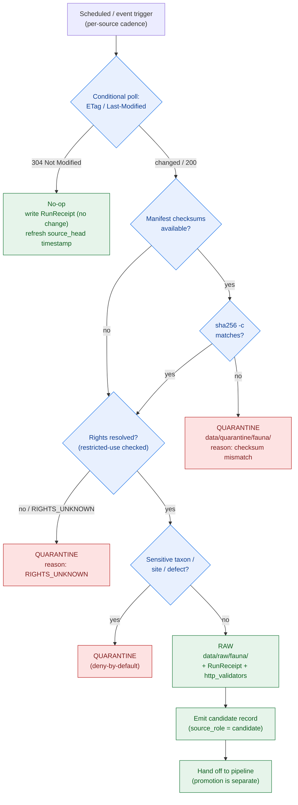

<!-- [KFM_META_BLOCK_V2]
doc_id: kfm://doc/docs-domains-fauna-source-refresh-runbook
title: Fauna Domain — Source Refresh Runbook
type: standard
version: v1
status: draft
owners: [NEEDS VERIFICATION — fauna domain steward; source steward; rights reviewer; on-call ingest operator]
created: 2026-06-02
updated: 2026-06-02
policy_label: public
related:
  - docs/domains/fauna/SOURCES.md
  - docs/domains/fauna/SOURCE_FAMILIES.md
  - docs/domains/fauna/SENSITIVITY.md
  - docs/domains/fauna/README.md
  - docs/doctrine/ai-build-operating-contract.md
  - docs/standards/SMART_SYNC.md
  - connectors/
  - data/registry/sources/fauna/
  - data/raw/fauna/
  - data/quarantine/fauna/
  - policy/sensitivity/fauna/
tags: [kfm, domain, fauna, runbook, source-refresh, connector, watcher, smart-sync]
notes:
  # PLACEMENT CONFLICT: requested at docs/domains/fauna/; doctrine + sibling docs point to docs/runbooks/fauna/. See §1.1. CONFLICTED → DRIFT_REGISTER + ADR.
  # Operational runbook. Procedures are CONFIRMED-doctrine / PROPOSED-implementation. No tool/command is asserted to exist in the mounted repo.
  # Watcher-as-non-publisher: connectors write ONLY to data/raw/fauna/ or data/quarantine/fauna/. Refresh never publishes.
  # eBird EBD is restricted-use; sensitive taxa fail closed; rights/cadence per source are NEEDS VERIFICATION.
  # Doctrine-adjacent doc; CONTRACT_VERSION = "3.0.0" pinned per AI Build Operating Contract v3.0.
[/KFM_META_BLOCK_V2] -->

<a id="top"></a>

# Fauna Domain — Source Refresh Runbook

> The operational procedure for refreshing Fauna sources: how to poll conditionally, when to fetch, where bytes land, how to handle staleness and quarantine, and what a refresh may **never** do. This is a **runbook**; it executes within the doctrine in [SOURCES.md](./SOURCES.md) and the sensitivity posture in [SENSITIVITY.md](./SENSITIVITY.md).

<p align="center">
  <b>Conditional fetch · Fail-closed · Watcher never publishes · Refresh ≠ release</b>
</p>

---


**Status:** draft · **Owners:** _NEEDS VERIFICATION_ · **Last updated:** 2026-06-02 · **`CONTRACT_VERSION = "3.0.0"`**

---

## Quick links

- [1. Scope](#1-scope)
- [1.1 Placement conflict (read first)](#11-placement-conflict-read-first)
- [2. What a refresh may and may not do](#2-what-a-refresh-may-and-may-not-do)
- [3. Refresh flow](#3-refresh-flow)
- [4. Procedure — conditional poll](#4-procedure--conditional-poll)
- [5. Procedure — fetch and land](#5-procedure--fetch-and-land)
- [6. Procedure — quarantine and recovery](#6-procedure--quarantine-and-recovery)
- [7. Staleness and supersession](#7-staleness-and-supersession)
- [8. Per-family refresh notes](#8-per-family-refresh-notes)
- [9. Pre-flight and post-run checklist](#9-pre-flight-and-post-run-checklist)
- [10. Open questions register](#10-open-questions-register)
- [11. Verification backlog](#11-verification-backlog)
- [12. Changelog & definition of done](#12-changelog--definition-of-done)
- [13. Related docs](#13-related-docs)

---

## 1. Scope

**CONFIRMED doctrine / PROPOSED implementation.** This runbook covers the **recurring refresh** of Fauna sources: checking whether an upstream source changed, fetching only when it did, landing bytes in the correct lifecycle phase, handling failures and sensitive defects via quarantine, and marking staleness. It applies the KFM smart-sync pattern (HTTP validators → manifest checksums → events → CDC) to the Fauna source families. [ENCY C3-01, C3-02] [DOM-FAUNA]

This runbook does **not** publish, promote, or release anything. Refresh feeds the **front** of the lifecycle (`RAW` / `QUARANTINE`); promotion to `PROCESSED → CATALOG → PUBLISHED` is a separate governed transition handled by the pipeline and release process. [DIRRULES §9.1]

### 1.1 Placement conflict (read first)

> [!WARNING]
> **CONFLICTED placement.** This file was requested at `docs/domains/fauna/SOURCE_REFRESH_RUNBOOK.md`, but the Fauna README's `related` list, the sibling docs, and Directory Rules all point runbooks to **`docs/runbooks/fauna/SOURCE_REFRESH_RUNBOOK.md`** (Directory Rules treats runbooks as a `docs/runbooks/` concern with a `fauna/` segment). Directory Rules also has an **open question** on runbook layout — domain-segmented subfolder (`docs/runbooks/fauna/…`, "Pattern A") vs flat domain-prefix (`docs/runbooks/fauna_*.md`, "Pattern B") — which an ADR should freeze. [DIRRULES §6.1, runbook-layout open question]
>
> **Recommendation:** home this runbook at `docs/runbooks/fauna/SOURCE_REFRESH_RUNBOOK.md` (Pattern A). Until the ADR lands, log this in `docs/registers/DRIFT_REGISTER.md` and mark the path **PROPOSED / CONFLICTED**. The content below is path-independent.

[Back to top ↑](#top)

---

## 2. What a refresh may and may not do

> [!IMPORTANT]
> **Watcher-as-non-publisher is the hard invariant of this runbook.** A refresh / watcher emits candidate records and receipts; it does **not** publish, mutate canonical truth, or expose `RAW` / `WORK` / `QUARANTINE` to public surfaces. A connector that writes to `data/processed/` or `data/published/` is a governed failure. [DIRRULES §13.5]

| A Fauna refresh **MAY** | A Fauna refresh **MUST NOT** |
|---|---|
| Poll an upstream conditionally and record validators | Re-download unchanged bytes (skip on `304`) |
| Fetch when the source changed and write a RunReceipt | Write to `data/processed/` or `data/published/` |
| Land bytes in `data/raw/fauna/` | Promote a record (promotion is a separate transition) |
| Route defects / sensitive material to `data/quarantine/fauna/` | Expose RAW/WORK/QUARANTINE to a public client |
| Emit candidate records (`source_role = candidate`) | Upgrade a source role (e.g., candidate → verified) |
| Mark a source stale when cadence expires | Republish restricted-use derivatives (e.g., eBird EBD) without approval |
| Apply ingest-time QA and sensitivity flags | Decide release — refresh ≠ release |

[Back to top ↑](#top)

---

## 3. Refresh flow

**PROPOSED diagram.** Shape reflects the CONFIRMED smart-sync layering and lifecycle invariant; specific tool/path names are PROPOSED until verified. [ENCY C3-01, C3-02] [DIRRULES §9.1]



[Back to top ↑](#top)

---

## 4. Procedure — conditional poll

**CONFIRMED doctrine / PROPOSED commands.** All HTTP polling against external publishers is **conditional**. [ENCY C3-01]

```text
1. Load the source's stored validators (ETag, Last-Modified) from the sidecar / checkpoint / receipt ledger.
2. Poll conditionally:
   - send If-None-Match: <stored ETag>  (prefer strong ETags; treat weak W/ ETags as advisory)
   - else send If-Modified-Since: <stored Last-Modified>
3. On 304 Not Modified:
   - DO NOT download. Write a RunReceipt recording the no-change decision and the validators seen.
   - Refresh the source_head freshness timestamp so the stale clock resets. Exit.
4. On 200 / changed:
   - Capture the new validators. Proceed to §5 (fetch and land).
5. If the publisher exposes no validators:
   - fall back to manifest checksums (§5 step 2); if neither exists, record reduced evidence quality and proceed with caution.
```

> [!NOTE]
> Validators are recorded in the RunReceipt's `http_validators` field so downstream gates and audits can replay the conditional request and confirm the no-change decision. Some publishers strip or rotate ETags on non-content rebuilds; this causes false-positive fetches, which the manifest checksum (§5) catches before anything promotes. [ENCY C3-01]

[Back to top ↑](#top)

---

## 5. Procedure — fetch and land

**CONFIRMED doctrine / PROPOSED commands.** Fetch only on change; verify integrity; gate rights and sensitivity; land in the correct phase. [ENCY C3-02] [DOM-FAUNA]

```text
1. Fetch the changed artifact(s). Preserve source geometry/payload as delivered.
2. Verify integrity (fail closed):
   - if a checksums file exists, run sha256 -c against local files.
   - on ANY mismatch → QUARANTINE (reason: checksum mismatch). Do not proceed.
3. Resolve rights BEFORE landing as RAW:
   - if rights/terms are unresolved → QUARANTINE (reason: RIGHTS_UNKNOWN).
   - if restricted-use (e.g., eBird EBD) → record the constraint; a refresh may store RAW but a derivative release still needs approval.
4. Apply ingest-time sensitivity flags:
   - sensitive taxon / nest / den / roost / hibernacula / spawning / steward-controlled → QUARANTINE (deny-by-default).
   - S1/S2 (NatureServe / KDWP SINC) → flag for redaction downstream (see SENSITIVITY.md).
5. Land clean, rights-clear, non-sensitive bytes in data/raw/fauna/<source_id>/<run_id>/.
6. Write the RunReceipt: dataset_id, dataset_version, fetch_time, source_url, http_validators, spec_hash (jcs:sha256), run_id, orchestrator, transform_git_sha, artifacts[]{path,digest}, rights_spdx, attestations[].
7. Emit a candidate record (source_role = candidate). Hand off to the pipeline; STOP — refresh does not promote.
```

> [!CAUTION]
> **Restricted-use is a gate, not a formality.** "We could fetch it" is not "we may republish it." eBird EBD and any source with unresolved rights must be checked against current terms before any derivative leaves `RAW`. Landing in `RAW` is not authorization to publish. [ENCY C10-biodiversity] [DOM-FAUNA]

[Back to top ↑](#top)

---

## 6. Procedure — quarantine and recovery

**CONFIRMED doctrine / PROPOSED reason codes.** Quarantine is the fail-closed holding area. Recovery is a steward action, not an automatic retry. [DIRRULES §9.1] [ENCY Atlas §24.6.3]

| Quarantine trigger | Reason code | Recovery path |
|---|---|---|
| Checksum / manifest mismatch | `CHECKSUM_MISMATCH` *(PROPOSED label)* | Re-fetch; if persistent, contact source steward; do not promote |
| Unresolved rights / terms | `RIGHTS_UNKNOWN` | Rights reviewer resolves terms; re-evaluate; restricted-use → record constraint |
| Sensitive taxon / site / steward-controlled | `SENSITIVITY_UNRESOLVED` | Sensitivity reviewer; geoprivacy transform + RedactionReceipt before any public path (see SENSITIVITY.md) |
| Source-role ambiguity | `ROLE_COLLAPSE` / `ROLE_DOWNCAST_FORBIDDEN` | Restore correct `source_role`; refuse upcast; new SourceDescriptor if mislabeled |
| Schema / contract mismatch | `SCHEMA_MISMATCH` | Schema fix and/or ADR; re-validate |

> [!IMPORTANT]
> **Quarantine recovery policy is an open ADR (ADR-S-12, connector cadence + quarantine recovery).** Until ratified, recovery is **steward-gated**: a record leaves quarantine only after the named reviewer for its reason code signs off. Do not auto-release from quarantine on retry. [ENCY ADR-S-12]

[Back to top ↑](#top)

---

## 7. Staleness and supersession

**CONFIRMED doctrine.** KFM separates **stale** (evidence/source aged past its declared tolerance) from **wrong** (substance incorrect). A refresh is how staleness is detected and reset. [ENCY Atlas §24.8]

| Marker | Triggered by | UI signal | Required action |
|---|---|---|---|
| **Source freshness expired** | Cadence in `SourceDescriptor` passed without a new admission | Stale-source badge in Evidence Drawer | Re-admit (this runbook) or supersede; else mark dependent claims stale |
| **Review aged out** | `ReviewRecord` older than the sensitive-lane review cycle | Review-aged badge | Trigger steward review; potentially downgrade tier |
| **Rights status changed** | Rights change in `SourceDescriptor` or rights-holder communication | Rights-changed badge | Re-evaluate tier; possibly downgrade; emit `CorrectionNotice` |

**Supersession on refresh.** When a refresh admits a new version of a source, the old `SourceDescriptor` is retained with a `superseded_by` link and a supersession entry in the source register — never silently overwritten. [ENCY Atlas §24.8.2]

> [!NOTE]
> A successful conditional poll that returns `304` **resets the stale clock** (refresh `source_head`) without re-admitting data — the source is confirmed current. A poll that cannot reach the source does **not** reset the clock; the source ages toward stale and the badge appears. Stale-state propagation to downstream claims is its own open ADR (ADR-S-10). [ENCY Atlas §24.8, ADR-S-10]

[Back to top ↑](#top)

---

## 8. Per-family refresh notes

Per-family detail lives in [SOURCE_FAMILIES.md](./SOURCE_FAMILIES.md); the refresh-specific notes are here. All cadence values are **NEEDS VERIFICATION**.

| Family | Refresh trigger / cadence | Refresh-specific caution |
|---|---|---|
| **eBird (EBD)** | Monthly cadence; eBird API with license + rate-limit handling | **Restricted-use** — RAW landing OK, derivative release needs approval; preserve observer attribution into the EvidenceBundle; sensitive-species rules at ingest |
| **GBIF** | Per-pull (Occurrence Download API) | Preserve originating institution; record-level sensitivity; S1/S2 → redaction flag |
| **iNaturalist** | Per-pull API | Respect obscured/private coordinate flags; research-grade is a quality flag, not a role upgrade |
| **iDigBio / Symbiota / collections** | Per-pull / negotiated | Specimen records anchor dedupe — do not let citizen-science points displace them |
| **USFWS ECOS / IPaC** | Per-pull; **API-key** (IPaC) | Listing / critical-habitat = `regulatory`, never relabeled observed |
| **NatureServe / heritage** | Source-specific | Ranks drive redaction; ranks are not occurrences |
| **KDWP-like steward** | Steward cadence | Steward-controlled; sensitive joins fail closed; rights-holder co-sign for release |
| **EDDMapS / invasive** | Per-feed | Review private-parcel joins; non-target sensitivity |
| **Agency monitoring / telemetry** | Agency cadence | **Telemetry geometry deny-default**; keep `observed` detections distinct from `modeled` surfaces |

> [!CAUTION]
> Citizen-science QA at ingest (eBird/iNaturalist): run presence checks (location, date, taxon, count, observation type), validity checks (coordinate bounds, dates), and **reject records missing license / attribution**. Map source license + attribution to the KFM license model and emit an EvidenceBundle + RunReceipt. [ENCY KFM-P2-PROG-0005]

[Back to top ↑](#top)

---

## 9. Pre-flight and post-run checklist

**Pre-flight (before a refresh run):**

- [ ] The source has a `SourceDescriptor` in `data/registry/sources/fauna/` with role, rights, sensitivity, cadence.
- [ ] Stored validators (ETag / Last-Modified) and/or manifest reference are available.
- [ ] Rights status is resolved; restricted-use constraints are recorded.
- [ ] Sensitivity posture is set; sensitive categories route to quarantine.
- [ ] The connector writes only to `data/raw/fauna/` or `data/quarantine/fauna/`.

**Post-run (after a refresh run):**

- [ ] A RunReceipt exists with `http_validators` and `spec_hash` (`jcs:sha256`).
- [ ] No bytes were written to `data/processed/` or `data/published/`.
- [ ] Defects / sensitive material / unresolved rights landed in quarantine with a reason code.
- [ ] Candidate records carry `source_role = candidate`; nothing was promoted.
- [ ] Stale clock reset on `304`; stale badge raised where the source could not be confirmed current.
- [ ] Superseded descriptors retain a `superseded_by` link and a register entry.

[Back to top ↑](#top)

---

## 10. Open questions register

| ID | Question | Owner role | Resolution path |
|---|---|---|---|
| OQ-FAUNA-RUN-01 | Runbook placement: `docs/runbooks/fauna/` (Pattern A) vs `docs/domains/fauna/` vs flat prefix. | Docs steward | ADR (runbook layout) + DRIFT_REGISTER |
| OQ-FAUNA-RUN-02 | Connector cadence and quarantine-recovery policy per family. | Source steward | ADR-S-12 |
| OQ-FAUNA-RUN-03 | Canonical watcher tool / entry point and checkpoint store location. | Ingest owner | `docs/standards/SMART_SYNC.md` + repo inspection |
| OQ-FAUNA-RUN-04 | eBird EBD derivative-release approval workflow (who approves, what is allowed). | Rights reviewer | EBD-derivative-release policy |
| OQ-FAUNA-RUN-05 | Whether a missing manifest blocks promotion or only downgrades evidence quality. | Source steward | Smart-sync standard + ADR |
| OQ-FAUNA-RUN-06 | Quarantine reason-code vocabulary freeze (labels used in §6). | Domain steward | Align to Atlas §24.6.3 reason codes |

[Back to top ↑](#top)

---

## 11. Verification backlog

These items remain `NEEDS VERIFICATION` before this runbook is promoted from `draft` to `published`.

1. **NEEDS VERIFICATION** — Per-family cadence and current API surfaces (eBird, GBIF, iNaturalist, IPaC, KDWP, NatureServe, EDDMapS).
2. **NEEDS VERIFICATION** — Canonical watcher implementation and checkpoint store (sidecar vs SQLite vs ledger).
3. **NEEDS VERIFICATION** — Existence of `connectors/<source>/` for each Fauna source and that each writes only to raw/quarantine.
4. **NEEDS VERIFICATION** — Quarantine recovery policy (ADR-S-12) and the reason-code vocabulary.
5. **NEEDS VERIFICATION** — RunReceipt schema field set (`http_validators`, `spec_hash`, etc.) and its schema home.
6. **NEEDS VERIFICATION** — Runbook placement decision (this file's home).
7. **NEEDS VERIFICATION** — Owners and on-call ingest operator.

[Back to top ↑](#top)

---

## 12. Changelog & definition of done

### 12.1 Changelog

| Change | Type (per contract §37) | Reason |
|---|---|---|
| Initial Fauna source-refresh runbook | new | No prior runbook existed for the lane |
| Surfaced placement conflict (`docs/domains/fauna/` vs `docs/runbooks/fauna/`) as CONFLICTED | clarification | Sibling docs + Directory Rules point to `docs/runbooks/fauna/`; runbook-layout ADR open |
| Grounded the conditional-poll / manifest-verify / quarantine flow in smart-sync doctrine | gap closure | CONFIRMED C3-01 / C3-02 + lifecycle invariant |
| Recorded watcher-as-non-publisher as the runbook's hard invariant | clarification | CONFIRMED §13.5; central to a refresh runbook |
| Tied staleness handling to the Atlas §24.8 marker table and supersession lineage | gap closure | CONFIRMED stale-state doctrine |
| Pinned `CONTRACT_VERSION = "3.0.0"` | housekeeping | Doctrine-adjacent doc requirement |

> **Backward compatibility.** New file. **Placement caveat:** sibling docs link to `docs/runbooks/fauna/SOURCE_REFRESH_RUNBOOK.md`; if this is homed at `docs/domains/fauna/`, those links break and must be re-pointed (or this file moved). Resolve via the runbook-layout ADR.

### 12.2 Definition of done

This runbook is done enough to enter the repository when:

- its placement is resolved (Pattern A `docs/runbooks/fauna/` recommended) and the choice is logged in `docs/registers/DRIFT_REGISTER.md`;
- a source steward, the fauna domain steward, a rights reviewer, and the ingest owner review it;
- it is linked from `docs/domains/fauna/README.md` and [SOURCES.md](./SOURCES.md);
- it does not conflict with accepted ADRs (notably ADR-S-12 quarantine recovery, ADR-S-04 source-role enum);
- per-family cadence values are verified or clearly labeled NEEDS VERIFICATION;
- the `GENERATED_RECEIPT.json` planned for this artifact is wired into CI;
- future changes follow the operating contract's §37 lifecycle.

[Back to top ↑](#top)

---

## 13. Related docs

- [`docs/domains/fauna/SOURCES.md`](./SOURCES.md) — source doctrine, canonical role enum, anti-collapse, admission
- [`docs/domains/fauna/SOURCE_FAMILIES.md`](./SOURCE_FAMILIES.md) — per-family deep reference (access, cadence, rights, gotchas)
- [`docs/domains/fauna/SENSITIVITY.md`](./SENSITIVITY.md) — deny-by-default, S1/S2 redaction, geoprivacy
- [`docs/domains/fauna/README.md`](./README.md) — Fauna domain landing page
- [`docs/doctrine/ai-build-operating-contract.md`](../../doctrine/ai-build-operating-contract.md) — `CONTRACT_VERSION = "3.0.0"`
- [`docs/standards/SMART_SYNC.md`](../../standards/SMART_SYNC.md) — HTTP-validator / manifest-checksum watcher pattern *(PROPOSED)*
- [`connectors/`](../../../connectors/) — source fetchers (write only to raw/quarantine) *(PROPOSED)*
- [`data/registry/sources/fauna/`](../../../data/registry/sources/fauna/) — Fauna SourceDescriptors *(PROPOSED — authoritative)*
- [`data/raw/fauna/`](../../../data/raw/fauna/) · [`data/quarantine/fauna/`](../../../data/quarantine/fauna/) — refresh landing zones
- [`policy/sensitivity/fauna/`](../../../policy/sensitivity/fauna/) — sensitivity gating *(PROPOSED)*
- **Atlas / corpus references:** Pass-10 C3 (smart sync: ETag/Last-Modified conditional GET, SHA-256 manifest verify), C1-01 (run receipt fields), C10-biodiversity (eBird EBD restricted-use); Atlas v1.1 §24.6.3 (reason codes), §24.8 (stale-state markers + supersession); ADR-S-10 (stale-state propagation), ADR-S-12 (connector cadence + quarantine recovery); KFM-P2-PROG-0005 (eBird connector QA)

[Back to top ↑](#top)

---

### Footer

**Related docs:** [SOURCES.md](./SOURCES.md) · [SOURCE_FAMILIES.md](./SOURCE_FAMILIES.md) · [SENSITIVITY.md](./SENSITIVITY.md) · [README.md](./README.md) · [SMART_SYNC.md](../../standards/SMART_SYNC.md)

**Last updated:** 2026-06-02 · **Owners:** _NEEDS VERIFICATION_ · **Status:** draft · **`CONTRACT_VERSION = "3.0.0"`** · **Placement:** _CONFLICTED — see §1.1_

[Back to top ↑](#top)
