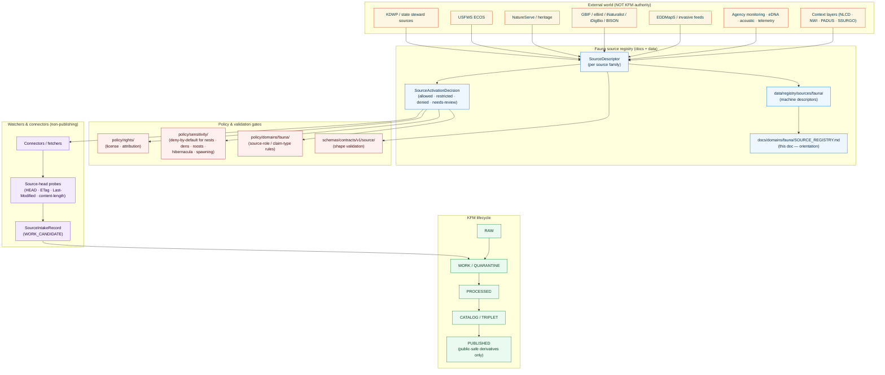
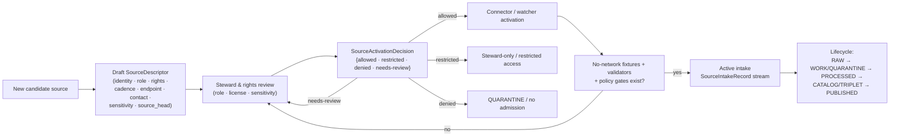

<!-- [KFM_META_BLOCK_V2]
doc_id: kfm://doc/domains/fauna/source-registry
title: Fauna Domain — Source Registry
type: standard
version: v1
status: draft
owners: Fauna domain steward · Source steward · Docs steward
created: 2026-05-16
updated: 2026-05-16
policy_label: public
related:
  - docs/doctrine/directory-rules.md
  - docs/sources/SOURCE_DESCRIPTOR_STANDARD.md
  - docs/domains/fauna/README.md
  - docs/runbooks/fauna/SOURCE_REFRESH_RUNBOOK.md
  - docs/standards/PROV.md
  - kfm://schema/source/source-descriptor
  - kfm://schema/source/source-intake-record
tags: [kfm, domain, fauna, sources, registry, governance]
notes:
  - All concrete paths are PROPOSED until verified against mounted-repo evidence.
  - Rights and current terms for every listed source family are NEEDS VERIFICATION.
  - Deny-by-default sensitivity posture for nests, dens, roosts, hibernacula, spawning sites is CONFIRMED doctrine.
[/KFM_META_BLOCK_V2] -->

# Fauna Domain — Source Registry

> Human-facing index of the sources that the Fauna lane admits, the roles they may play, the rights and sensitivity posture they carry, and the governance surfaces that decide whether they reach public claims.

<!-- Badges: TODO placeholders until repo CI surfaces and policy registers are mounted. -->


**Status:** draft &nbsp;·&nbsp; **Owners:** Fauna domain steward · Source steward · Docs steward &nbsp;·&nbsp; **Updated:** 2026-05-16

---

## Quick jump

- [1. Scope](#1-scope)
- [2. Repo fit](#2-repo-fit)
- [3. Inputs — what belongs here](#3-inputs--what-belongs-here)
- [4. Exclusions — what does not belong here](#4-exclusions--what-does-not-belong-here)
- [5. Directory placement (PROPOSED)](#5-directory-placement-proposed)
- [6. Registry topology diagram](#6-registry-topology-diagram)
- [7. Source families](#7-source-families)
- [8. Source roles](#8-source-roles)
- [9. Sensitivity & rights posture](#9-sensitivity--rights-posture)
- [10. Admission lifecycle](#10-admission-lifecycle)
- [11. Schemas, validators, fixtures](#11-schemas-validators-fixtures)
- [12. Watcher governance](#12-watcher-governance)
- [13. Tables — admission states & role × claim matrix](#13-tables--admission-states--role--claim-matrix)
- [14. Open questions](#14-open-questions)
- [15. FAQ](#15-faq)
- [16. Related docs](#16-related-docs)
- [Appendix A — Object families referenced](#appendix-a--object-families-referenced)
- [Appendix B — Glossary](#appendix-b--glossary)

---

## 1. Scope

CONFIRMED doctrine / PROPOSED implementation.

This document is the **human-facing index** of source admission for the **Fauna** domain lane. It explains which source families the lane may admit, what roles each source is permitted to play, what rights and sensitivity posture each carries, and which governance surfaces decide whether material from those sources can reach public claims.

The registry exists to convert external biological data from anonymous bytes into **accountable intake** — material whose identity, role, rights, cadence, endpoint, version, contact, `source_head`, sensitivity, and admissibility limits are recorded *before* any connector or watcher activates. It records *that a source exists* and *how it should be treated*, never *what the source says*. Truth about the world lives in `EvidenceBundle`s built from admitted material; the registry only governs admission.

> [!IMPORTANT]
> The source registry is an **admission and authority-control surface, not a bibliography**. A source appearing here does not entitle it to public release: every claim still requires evidence closure, policy decision, review state, and release state per the KFM lifecycle.

---

## 2. Repo fit

PROPOSED placement, per [Directory Rules §6.1 and §12](../../doctrine/directory-rules.md).

| Aspect | Where it lives | Authority |
|---|---|---|
| **This doc (human-facing index)** | `docs/domains/fauna/SOURCE_REGISTRY.md` | Canonical for orientation; PROPOSED until mounted-repo verification |
| **Cross-cutting source-descriptor standard** | `docs/sources/SOURCE_DESCRIPTOR_STANDARD.md` | Canonical convention; PROPOSED file presence |
| **Machine-readable registry entries** | `data/registry/sources/fauna/` | Canonical lifecycle home per Directory Rules §12 |
| **`SourceDescriptor` schema** | `schemas/contracts/v1/source/source-descriptor.json` | Per ADR-0001 default schema home; NEEDS VERIFICATION |
| **`SourceIntakeRecord` schema** | `schemas/contracts/v1/source/source-intake-record.json` | PROPOSED |
| **Policy gates (rights, sensitivity)** | `policy/rights/`, `policy/sensitivity/`, `policy/domains/fauna/` | PROPOSED |
| **Refresh / activation procedure** | [`docs/runbooks/fauna/SOURCE_REFRESH_RUNBOOK.md`](../../runbooks/fauna/SOURCE_REFRESH_RUNBOOK.md) | Canonical for ops; PROPOSED file presence |
| **Domain landing page** | `docs/domains/fauna/README.md` | PROPOSED |
| **Cross-domain register** | `control_plane/source_authority_register.yaml` | PROPOSED |

> [!NOTE]
> **Directory Rules basis.** `docs/` is the human-facing control plane; `data/registry/sources/<domain>/` is the lifecycle home for the actual machine-readable descriptors. This document MUST NOT duplicate or replace the machine register — it explains and orients to it.

[⬆ back to top](#quick-jump)

---

## 3. Inputs — what belongs here

The Fauna registry admits source families that support governed claims about animal taxonomy, occurrence evidence, range, seasonal range, migration, sensitive sites (with deny-by-default geoprivacy), mortality, disease/pathogen observations, invasive species, and conservation status. [CONFIRMED doctrine]

Concretely, the registry indexes:

- **Authority sources** — agency listings, legal/conservation status (e.g., USFWS ECOS-like federal sources, KDWP-like steward sources). [CONFIRMED]
- **Observation sources** — agency monitoring, surveys, eDNA, acoustic, telemetry, wildlife mortality, and disease surveillance programs. [CONFIRMED]
- **Aggregator sources** — GBIF, eBird, iNaturalist, iDigBio, BISON-like federated occurrence networks. [CONFIRMED]
- **Heritage / status sources** — NatureServe and natural-heritage-style ranks and tracking. [CONFIRMED]
- **Invasive-species feeds** — EDDMapS and similar. [CONFIRMED]
- **Context layers** — NLCD, NWI, PADUS, SSURGO when used *only* as joinable context (never as fauna truth). [CONFIRMED]
- **Steward / restricted sources** — sensitive-site lists, exact geometry feeds for nests, dens, roosts, hibernacula, spawning sites. [CONFIRMED — DENY by default]

Source families CONFIRMED for the Fauna lane: `SRC-FAUNA`, `SRC-HF`, `SRC-HAB`, `EXT-GBIF`, `EXT-INAT`, `EXT-FWS`, `EXT-NATSERVE`.

---

## 4. Exclusions — what does not belong here

The Fauna source registry does **not** own:

| Material | Owning lane | Why |
|---|---|---|
| Habitat patches and suitability surfaces | Habitat | Habitat owns suitability; Fauna only consumes governed joins. |
| Plant taxa, specimens, vegetation communities | Flora | Flora owns botanical claims. |
| Hydrology, soil, agriculture, hazards, roads, settlements, archaeology, people | Each owns its truth | Cross-domain context is allowed only through governed joins. |
| Title / parcel ownership records | People, Genealogy, DNA, Land Ownership | Assessor data is not title; parcels are not ownership truth. |
| Generic data catalogs or bibliographies | n/a | The registry is a governance surface, not a citation list. |

A source that *also* serves another lane (e.g., NLCD as context) is registered in **that lane's** registry as well, with its Fauna role explicitly scoped.

[⬆ back to top](#quick-jump)

---

## 5. Directory placement (PROPOSED)

PROPOSED tree. Specific paths remain PROPOSED until mounted-repo evidence verifies them. Path layout reflects [Directory Rules §6.1, §6.4–6.6, §9.1, §12](../../doctrine/directory-rules.md).

```text
docs/
├── domains/
│   └── fauna/
│       ├── README.md                   # PROPOSED — Fauna lane landing page
│       └── SOURCE_REGISTRY.md          # this file
├── sources/
│   └── SOURCE_DESCRIPTOR_STANDARD.md   # PROPOSED — cross-cutting standard
└── runbooks/
    └── fauna/
        └── SOURCE_REFRESH_RUNBOOK.md   # PROPOSED — refresh / activation runbook

schemas/contracts/v1/
├── source/
│   ├── source-descriptor.json          # PROPOSED canonical descriptor schema
│   ├── source-intake-record.json       # PROPOSED
│   └── drift-summary.json              # PROPOSED
└── domains/
    └── fauna/                          # PROPOSED — domain-specific object schemas

policy/
├── rights/                             # rights / license enforcement
├── sensitivity/                        # geoprivacy, redaction, deny-by-default classes
└── domains/
    └── fauna/                          # PROPOSED — Fauna-specific rules

tests/
└── domains/
    └── fauna/                          # PROPOSED — source-role, redaction, deny tests

fixtures/
└── domains/
    └── fauna/                          # PROPOSED — synthetic, no-network fixtures

data/
├── registry/
│   └── sources/
│       └── fauna/                      # PROPOSED — canonical machine registry
│           ├── <source_id>/
│           │   ├── descriptor.yaml     # SourceDescriptor instance
│           │   ├── activation.yaml     # SourceActivationDecision
│           │   └── intake/             # SourceIntakeRecord history
│           └── ...
├── raw/        fauna/                  # immutable source-native capture
├── work/       fauna/                  # in-flight normalization
├── quarantine/ fauna/                  # held by reason
├── processed/  fauna/                  # validated, normalized candidates
└── catalog/
    └── domain/fauna/                   # catalog records, EvidenceBundles
```

> [!WARNING]
> **NEEDS VERIFICATION** — every path above is PROPOSED until the live repo is mounted and inspected. Do not create siblings or parallel homes without an ADR (Directory Rules §2.4).

[⬆ back to top](#quick-jump)

---

## 6. Registry topology diagram

Logical topology of the Fauna source registry and the governance surfaces it touches. Reflects KFM doctrine; specific bindings PROPOSED.



> [!NOTE]
> **NEEDS VERIFICATION** — the precise binding between `SourceActivationDecision` and each `policy/` gate is doctrinal; concrete file paths and gate IDs remain PROPOSED.

[⬆ back to top](#quick-jump)

---

## 7. Source families

The following source families are CONFIRMED as Fauna-relevant in KFM doctrine. **Rights and current terms for every family below are `NEEDS VERIFICATION`**, and every sensitive join fails closed by default.

| Source family | Typical role(s) | Source-id token | Rights / sensitivity | Freshness | Status |
|---|---|---|---|---|---|
| KDWP-like state steward sources | authority · observation · steward | `SRC-FAUNA-KDWP-*` | rights NEEDS VERIFICATION · sensitive joins fail closed | per source / cadence-specific | PROPOSED admission |
| USFWS ECOS (federal) | authority (legal/conservation status) · context | `EXT-FWS-*` | rights NEEDS VERIFICATION · exact sensitive location DENY | per source / cadence-specific | PROPOSED admission |
| NatureServe / natural-heritage | authority (status ranks) · context | `EXT-NATSERVE-*` | controlled access · provider permissions NEEDS VERIFICATION | per source / cadence-specific | PROPOSED admission |
| GBIF / eBird / iNaturalist / iDigBio / BISON-like aggregators | aggregate · observation · candidate | `EXT-GBIF-*`, `EXT-INAT-*`, etc. | per-record license varies · eBird EBD terms restrict redistribution · geoprivacy varies | per source / cadence-specific | PROPOSED admission |
| EDDMapS & invasive-species feeds | observation · aggregate | `SRC-FAUNA-EDDMAPS-*` | rights NEEDS VERIFICATION | per source / cadence-specific | PROPOSED admission |
| Agency monitoring · surveys · eDNA · acoustic · telemetry | observation · steward | `SRC-FAUNA-MON-*` | typically restricted by program; sensitive joins fail closed | per program | PROPOSED admission |
| Disease surveillance & mortality programs | observation · authority (case status) | `SRC-FAUNA-DIS-*`, `SRC-FAUNA-MORT-*` | rights NEEDS VERIFICATION · sensitivity per program | per program | PROPOSED admission |
| Context layers (NLCD · NWI · PADUS · SSURGO) | context only (not Fauna truth) | external IDs from owning lanes | per upstream | per upstream | PROPOSED admission as **context** only |

> [!IMPORTANT]
> **No source family above is admitted live in this document.** Admission is a `SourceActivationDecision` action recorded in `data/registry/sources/fauna/<source_id>/activation.yaml`. This document orients reviewers to *which families may apply*, not *which are currently active*.

[⬆ back to top](#quick-jump)

---

## 8. Source roles

CONFIRMED cross-domain rule: **source role cannot be inferred from convenience**. A community-science occurrence is not a legal-status authority; a regulatory list is not an observed event; a remote-sensing anomaly is a candidate until reviewed.

| Role | Definition (Fauna lane) | Typical Fauna source families | Permitted Fauna claims | Forbidden Fauna claims |
|---|---|---|---|---|
| `observed` | Field observation of a taxon, mortality, or disease event with attributable observer, time, location | KDWP steward observations · agency monitoring · GBIF/eBird/iNaturalist (when supplying observer-anchored records) · telemetry · eDNA | "Taxon X was observed at place/time, with uncertainty radius R" | Legal status; range polygons as legal authority |
| `authority` | Issuing-body authoritative listing (legal/conservation status, official range/season designations) | USFWS ECOS · KDWP listings · NatureServe ranks | "Taxon X has status S issued by body B as of date D" | Per-place observation evidence |
| `aggregate` | Federated aggregation across providers, with geometry-scope semantics (cell · grid · HUC) | GBIF · iDigBio · BISON-like federations | "Aggregate count/density across scope U at time T" | Per-record identity or precise per-place truth |
| `modeled` | Output of a model run pinned by `ModelRunReceipt` | range/seasonal models · habitat-suitability surfaces (when consumed) | "Modeled range/suitability under inputs and parameters P" | Observation; legal status |
| `candidate` | Pending material awaiting review or merge | watcher outputs · remote-sensing anomalies · community-science low-confidence records | Pre-review summary only behind steward surfaces | Any PUBLISHED edge |
| `administrative` | Administrative compilation (program record, regulatory packet) | program rosters · compliance records | Administrative summary | Observation timeline; observed event |
| `synthetic` | Synthetic / illustrative carrier (must declare a `reality_boundary_note_ref`) | demonstration fixtures | Internal demonstration only | Any public presentation as observed reality |

Per [DOM-FAUNA] and [KFM-IDX-SRC-002 — Source Descriptor and Source-Role Registry] (Pass 20 Idea Index): "*source role is a property of the source's relationship to the claim, and a mismatch between role and claim type is a deny condition rather than a quality issue.*"

> [!TIP]
> A single source family can play **different roles in different claims**. The role is fixed at descriptor admission; corrections must produce a new descriptor and a `CorrectionNotice`, not edit the role in place.

[⬆ back to top](#quick-jump)

---

## 9. Sensitivity & rights posture

CONFIRMED doctrine. The Fauna lane is one of the strongest **deny-by-default** sensitivity domains in KFM.

> [!CAUTION]
> **Exact sensitive locations fail closed by default.** Nests, dens, roosts, hibernacula, spawning sites, steward-controlled records, and any exact occurrence geometry for sensitive taxa cannot enter a public surface unless a documented geoprivacy transform, a `RedactionReceipt`, and a release state explicitly permit it. Public exact-occurrence tiles for sensitive taxa are denied. [DOM-FAUNA · DOM-HF · ENCY · DIRRULES]

| Class | Fauna examples | Default outcome | Required controls |
|---|---|---|---|
| Rare species | Exact taxa occurrence · nest · den · roost · hibernacula · spawning sites | DENY public exact location · generalized public products only | Geoprivacy transform · `RedactionReceipt` · steward review |
| Source-rights-limited records | eBird EBD (redistribution-restricted) · restricted heritage data · steward-controlled sensitive records | DENY public release until terms resolved | Rights register · attribution · no public derivative if barred |
| Exact sensitive locations | Any exact point that increases harm risk (poaching · disturbance · take) | DENY by default | Redaction · generalization · audit |
| Living-person data adjacency | Observer identity for steward-restricted programs | DENY public exact/identifying output | Privacy review · aggregation |

CONFIRMED unblocking conditions for a public Fauna surface: rights resolved → source role resolved → evidence closure → sensitivity transform applied where required → review state recorded → release state recorded → rollback target named. Anything missing **blocks public promotion**.

Geoprivacy transform vocabulary (PROPOSED, from [KFM-IDX-POL-005]):

- `suppress` — withhold the record entirely from the public surface
- `generalize_to_grid` — coerce geometry to a fixed cell (e.g., 10 km grid)
- `generalize_to_watershed` / `generalize_to_county` — coerce to HUC or county
- `buffer` — apply a buffer of radius ≥ R
- `jitter_constrained` — small random offset within stated bounds (limited applicability)
- `delayed_publication` — release only after a stated lag
- `steward_only_exact` — exact geometry remains in steward view; public sees a derivative

Every transform emits a `RedactionReceipt` recording input class, output class, reason, policy, reviewer, and residual risk.

[⬆ back to top](#quick-jump)

---

## 10. Admission lifecycle

CONFIRMED doctrine: source admission is a **governed state transition, not a file move**. PROPOSED activation flow (from [BLD-COMP §§8.1-8.2; IMPL-PIPE §13; DOC-P18 §8.3]):



PROPOSED admission states (per `data/registry/sources/fauna/<source_id>/`):

| State | Meaning | Permitted next states |
|---|---|---|
| `draft` | Descriptor under preparation; not yet steward-reviewed | `needs-review`, `denied` |
| `needs-review` | Awaiting role / rights / sensitivity sign-off | `allowed`, `restricted`, `denied` |
| `allowed` | Connector / watcher may activate; public path conditional on full evidence closure | `restricted`, `retired` |
| `restricted` | Admitted for steward / research access only; no public surface | `allowed` (after policy change), `denied`, `retired` |
| `denied` | Not admitted; failure mode documented | `needs-review` only after new evidence |
| `quarantined` | Admitted material failed validation / policy and is held | `needs-review`, `denied` |
| `retired` | Previously active source no longer in use; lineage preserved | terminal |

> [!IMPORTANT]
> **Watchers do not promote.** Per CONFIRMED doctrine (`watcher-as-non-publisher`), watchers and pre-RAW handlers may observe, record, and propose, but never publish or admit material into public truth without governed review, validation, and promotion.

[⬆ back to top](#quick-jump)

---

## 11. Schemas, validators, fixtures

PROPOSED unless mounted-repo evidence verifies presence.

<details>
<summary><strong>Schemas</strong> — PROPOSED locations (Directory Rules §6.4, ADR-0001 default schema home)</summary>

| Schema | PROPOSED path | Purpose |
|---|---|---|
| `SourceDescriptor` | `schemas/contracts/v1/source/source-descriptor.json` | Identity · role · rights · cadence · endpoint · contact · `source_head` · sensitivity · admissibility limits |
| `SourceIntakeRecord` | `schemas/contracts/v1/source/source-intake-record.json` | Watcher / connector envelope: source URLs · fingerprints · `classmap_version` · geometry hashes · materiality reason · `publication_state` |
| `SourceActivationDecision` | `schemas/contracts/v1/source/source-activation-decision.json` | `allowed` · `restricted` · `denied` · `needs-review` with reviewer, basis, and obligations |
| `DriftSummary` | `schemas/contracts/v1/source/drift-summary.json` | Material-change summary for watcher-detected drift |
| `RedactionReceipt` | `schemas/contracts/v1/policy/redaction-receipt.json` | Records geoprivacy / sensitivity transforms |
| Fauna domain schemas | `schemas/contracts/v1/domains/fauna/...` | `Taxon`, `OccurrenceEvidence`, `RangePolygon`, `SeasonalRange`, `MigrationRoute`, `SensitiveSite`, `NestDenRoostSpawningSite`, `MortalityObservation`, `DiseaseObservation`, `InvasiveSpeciesRecord`, `ConservationStatus`, `AbundanceIndicator`, `RichnessIndicator` |

</details>

<details>
<summary><strong>Validators</strong> — PROPOSED, from [DOM-FAUNA §K]</summary>

- Source-descriptor schema validation (presence, shape)
- Source-role authority test (claim type matches admitted role)
- Rights validation (license / attribution / redistribution class present and current)
- Sensitivity validation (deny-by-default for nests · dens · roosts · hibernacula · spawning)
- Taxonomy resolution & ambiguity tests
- Occurrence `restricted` / `public` split tests
- Redaction-receipt validation (every public sensitive-class output has a receipt)
- Tile field-allowlist tests (public tiles do not leak restricted fields)
- Citation-validation tests (every public claim resolves to an `EvidenceBundle`)
- Runtime Response Envelope negative cases (`ABSTAIN` / `DENY` / `ERROR` rendered correctly)
- No-network fixture tests (admission can be exercised without live connectors)

</details>

<details>
<summary><strong>Fixtures</strong> — PROPOSED, no-network first</summary>

PROPOSED first fixture pair, aligned with [DOM-FAUNA] feature backlog "Build first":

- **Synthetic non-sensitive public occurrence** — joined to a habitat patch; exact point optionally steward-only; public generalized layer with a `RedactionReceipt`.
- **Synthetic sensitive sensitive-site fixture** — exact geometry that must fail closed on every public surface, with negative test asserting `DENY`.
- **Negative SourceDescriptor fixtures** — missing rights · missing `source_head` · missing contact · missing cadence · ambiguous role.
- **Aggregator-as-authority denial fixture** — claim "legal status from GBIF" must `DENY`.

</details>

[⬆ back to top](#quick-jump)

---

## 12. Watcher governance

CONFIRMED doctrine; PROPOSED implementation.

Fauna watchers (e.g., source-drift probes, occurrence-aggregator polling, conservation-status change watchers) **observe and emit candidates only**. They never publish, never bypass the trust membrane, and never modify the canonical registry without steward review.

Each watcher emits a `SourceIntakeRecord` shaped envelope carrying at minimum:

```yaml
object_type: SourceIntakeRecord
schema_version: v1
state: WORK_CANDIDATE        # never PUBLISHED from a watcher
publication_state: WORK_CANDIDATE
promotion_required: true
source_descriptor:
  source_id: <SRC-FAUNA-…>
  source_role: observed|authority|aggregate|candidate|modeled|administrative|synthetic
spec_hash: <hash>
source_head:
  etag: <value-or-null>
  last_modified: <value-or-null>
  content_length: <value-or-null>
materiality:
  reason: <structured>
rights_status: unknown|public|restricted|denied
sensitivity: review_required|public|restricted|denied
observed_at: <ISO-8601>
watcher_version: <version>
```

> [!WARNING]
> `source_head` metadata (`HEAD`, `ETag`, `Last-Modified`, `content-length`) is **intake evidence, not admission evidence**. A successful HEAD means the URL responded — not that the new content is admissible. Materiality, rights, sensitivity, and steward review still gate promotion. [Pass 19 P19-SRC-002]

Fauna-specific watcher concerns:

- **eBird EBD** redistribution terms must be reflected in every derivative receipt and in the activation decision.
- **iNaturalist** geoprivacy fields (`obscured` / `private`) must be preserved end-to-end; KFM never silently un-obscures.
- **NatureServe** access tiers (free Explorer vs. Explorer PRO) must drive the activation tier; controlled-access data may not enter a public path.
- **KDWP / state heritage** sensitive-site lists are deny-by-default; admission is restricted-only unless an explicit policy decision says otherwise.

[⬆ back to top](#quick-jump)

---

## 13. Tables — admission states & role × claim matrix

### 13.1 Admission states summary

| State | Public path eligible? | Steward path eligible? | Connectors / watchers active? |
|---|---|---|---|
| `draft` | No | No | No |
| `needs-review` | No | No | No |
| `allowed` | Conditional on full evidence closure | Yes | Yes |
| `restricted` | No | Yes (with policy approval) | Yes (restricted) |
| `denied` | No | No | No |
| `quarantined` | No | Review only | Paused |
| `retired` | No | Lineage only | No |

### 13.2 Source-role × Fauna-claim matrix (selected)

PROPOSED. "✓" = role may support claim; "✗" = role must NOT support claim; "△" = supports only with steward review.

| Source role → / Claim type ↓ | `observed` | `authority` | `aggregate` | `modeled` | `candidate` | `administrative` | `synthetic` |
|---|:--:|:--:|:--:|:--:|:--:|:--:|:--:|
| Per-record occurrence (public-safe) | ✓ | ✗ | △ | ✗ | ✗ | ✗ | ✗ |
| Legal / conservation status | ✗ | ✓ | ✗ | ✗ | ✗ | △ | ✗ |
| Range polygon (public) | △ | ✓ | △ | △ | ✗ | ✗ | ✗ |
| Modeled habitat suitability surface | ✗ | ✗ | ✗ | ✓ | ✗ | ✗ | ✗ |
| Mortality / disease observation | ✓ | △ | △ | ✗ | ✗ | △ | ✗ |
| Invasive-species occurrence | ✓ | △ | ✓ | ✗ | △ | ✗ | ✗ |
| Sensitive site (exact) | △ (steward only) | △ | ✗ | ✗ | ✗ | ✗ | ✗ |
| Public sensitive site (exact geometry) | ✗ | ✗ | ✗ | ✗ | ✗ | ✗ | ✗ |

[⬆ back to top](#quick-jump)

---

## 14. Open questions

| # | Question | Resolution path | Status |
|---|---|---|---|
| 1 | Which Fauna sources require legal or steward approval before connector activation? | Steward + legal review; record on each `SourceActivationDecision` | NEEDS VERIFICATION |
| 2 | Is the descriptor versioned independently of the source itself? | Decide via ADR; align with `spec_hash` discipline | UNKNOWN |
| 3 | Should `docs/runbooks/fauna/` (subfolder) be normalized across all domains, or kept as a per-domain choice? | ADR amending Directory Rules §6.1 or per-root README clarification | OPEN |
| 4 | Which county set / taxonomic scope seeds the first fauna no-network watcher fixture? | Steward decision; first proof-lane scoping | OPEN |
| 5 | Where should signed `SourceIntakeRecord` outbox state live under current Directory Rules conventions? | Cross-reference Pass 20 EXP-001/EXP-003 backlog | OPEN |
| 6 | Are eBird EBD terms negotiable for KFM-specific releases, or is generalization the only path? | Direct outreach + policy fixture | NEEDS VERIFICATION |
| 7 | Do NatureServe Explorer PRO terms permit any cached derivative under KFM's redistribution posture? | Provider review | NEEDS VERIFICATION |
| 8 | Which sensitive-site classes warrant `delayed_publication` vs `suppress` vs `generalize_to_grid`? | Sensitivity policy registry decision | OPEN |
| 9 | How does the registry surface "retired" sources in the public Evidence Drawer when prior claims still cite them? | UX + policy decision | OPEN |
| 10 | Naming alignment between `docs/standards/PROV.md` and any `PROVENANCE.md` corpus reference. | ADR | OPEN |

[⬆ back to top](#quick-jump)

---

## 15. FAQ

<details>
<summary><strong>Is this document the source registry, or does it just describe one?</strong></summary>

This document **describes and orients to** the registry. The canonical machine-readable registry lives at `data/registry/sources/fauna/` (PROPOSED). Reviewers should read this doc to understand the lane; tooling should read the machine register.
</details>

<details>
<summary><strong>Can a source be in the registry but not active?</strong></summary>

Yes. Admission states are explicit (`draft`, `needs-review`, `allowed`, `restricted`, `denied`, `quarantined`, `retired`). Listing a source family here does not entitle it to live intake — only a `SourceActivationDecision` with `allowed` or `restricted` does that, and only after fixtures, validators, and policy gates exist.
</details>

<details>
<summary><strong>Can a publicly available dataset be denied?</strong></summary>

Yes. Public availability does not satisfy KFM admissibility. Unclear rights, unresolved source role, missing evidence, unresolved sensitivity, or absent release state block public promotion regardless of whether the upstream data is technically downloadable.
</details>

<details>
<summary><strong>Why is the rights status for every source family <code>NEEDS VERIFICATION</code>?</strong></summary>

This document is a doctrine-and-orientation artifact. Concrete rights status is determined per `SourceDescriptor` instance under `data/registry/sources/fauna/<source_id>/`, and is fixed by `SourceActivationDecision`. The doc does not pre-decide live rights; the registry does, after review.
</details>

<details>
<summary><strong>What happens if a watcher detects drift in a source that's <code>restricted</code>?</strong></summary>

The watcher still emits a `SourceIntakeRecord` candidate at `WORK_CANDIDATE`, but `publication_state` cannot leave the restricted lane without policy review. No public surface — Evidence Drawer, map layer, Focus Mode, or release — receives the change automatically.
</details>

<details>
<summary><strong>What's the relationship to <code>SOURCE_REFRESH_RUNBOOK.md</code>?</strong></summary>

This doc explains *what the registry is*. The [Fauna source refresh runbook](../../runbooks/fauna/SOURCE_REFRESH_RUNBOOK.md) (PROPOSED) explains *how to keep it current* — drift handling, descriptor updates, activation decisions, and rollback drills.
</details>

[⬆ back to top](#quick-jump)

---

## 16. Related docs

- [`docs/doctrine/directory-rules.md`](../../doctrine/directory-rules.md) — placement law (`docs/domains/<domain>/`, `data/registry/sources/<domain>/`)
- [`docs/sources/SOURCE_DESCRIPTOR_STANDARD.md`](../../sources/SOURCE_DESCRIPTOR_STANDARD.md) — cross-cutting `SourceDescriptor` standard *(PROPOSED — TODO verify presence)*
- [`docs/domains/fauna/README.md`](./README.md) — Fauna lane landing page *(PROPOSED — TODO verify presence)*
- [`docs/runbooks/fauna/SOURCE_REFRESH_RUNBOOK.md`](../../runbooks/fauna/SOURCE_REFRESH_RUNBOOK.md) — refresh / activation procedure
- [`docs/standards/PROV.md`](../../standards/PROV.md) — W3C PROV-O / PAV profile
- [`docs/standards/ISO-19115.md`](../../standards/ISO-19115.md) — metadata crosswalk
- [`docs/standards/OAI-PMH.md`](../../standards/OAI-PMH.md) — harvest governance
- [`docs/standards/PMTILES.md`](../../standards/PMTILES.md) — public-tile delivery (used downstream of admitted Fauna sources)
- [`docs/adr/ADR-0001-schema-home.md`](../../adr/ADR-0001-schema-home.md) — default schema home *(PROPOSED — TODO verify presence)*
- [`control_plane/source_authority_register.yaml`](../../../control_plane/source_authority_register.yaml) — cross-domain source-authority register *(PROPOSED)*

---

## Appendix A — Object families referenced

CONFIRMED canonical object families for the Fauna lane (per [DOM-FAUNA · ENCY]):

- `Taxon`, `Taxon Crosswalk`, `ConservationStatus`
- `OccurrenceEvidence` (with `Occurrence Restricted` and `Occurrence Public` split)
- `RangePolygon`, `SeasonalRange`, `MigrationRoute`
- `SensitiveSite`, `NestDenRoostSpawningSite`
- `MortalityObservation`, `DiseaseObservation`
- `InvasiveSpeciesRecord`
- `AbundanceIndicator`, `RichnessIndicator`
- `RedactionReceipt`

Cross-cutting KFM objects this registry depends on:

- `SourceDescriptor`, `SourceIntakeRecord`, `SourceActivationDecision`, `DriftSummary`
- `EvidenceRef`, `EvidenceBundle`
- `ValidationReport`, `RunReceipt`, `PolicyDecision`, `PromotionDecision`
- `ReleaseManifest`, `RollbackCard`, `CorrectionNotice`, `ReviewRecord`

---

## Appendix B — Glossary

| Term | Meaning (Fauna lane) |
|---|---|
| **Source family** | A class of upstream provider (e.g., GBIF, KDWP) that may yield one or more individual sources. |
| **Source role** | The relationship between a source and the claim it supports (`observed`, `authority`, `aggregate`, `modeled`, `candidate`, `administrative`, `synthetic`). |
| **`SourceDescriptor`** | The canonical record of a single source's identity, role, rights, cadence, endpoint, contact, `source_head`, sensitivity, and admissibility limits. |
| **`SourceActivationDecision`** | Steward / governance decision permitting, restricting, denying, or returning a source for review. |
| **`SourceIntakeRecord`** | Watcher / connector envelope carrying a candidate change for steward review; never auto-publishes. |
| **Geoprivacy transform** | A function that converts sensitive source geometry into a public-safe derivative, with a `RedactionReceipt`. |
| **Public-safe derivative** | A product (tile, layer, polygon, summary) that the Fauna lane is permitted to expose publicly, subject to evidence closure and release state. |
| **Trust membrane** | The boundary separating canonical / internal stores from public surfaces; standard clients consume governed APIs only. |
| **Watcher-as-non-publisher** | The invariant that watchers observe and record but never promote material to public truth. |

---

<hr/>

**Related:** [Directory Rules](../../doctrine/directory-rules.md) · [Source descriptor standard (PROPOSED)](../../sources/SOURCE_DESCRIPTOR_STANDARD.md) · [Fauna refresh runbook](../../runbooks/fauna/SOURCE_REFRESH_RUNBOOK.md) · [Fauna lane README (PROPOSED)](./README.md)

**Last updated:** 2026-05-16

[⬆ back to top](#quick-jump)
