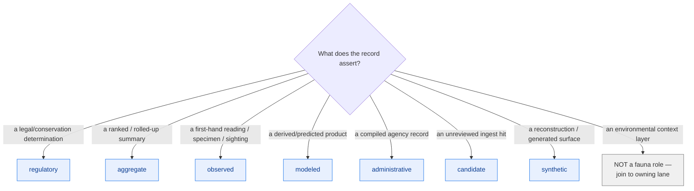

<!-- [KFM_META_BLOCK_V2]
doc_id: kfm://doc/docs-domains-fauna-source-roles
title: Fauna Domain — Source-Role Crosswalk
type: standard
version: v1
status: draft
owners: [NEEDS VERIFICATION — fauna domain steward; source steward; docs steward]
created: 2026-06-02
updated: 2026-06-02
policy_label: public
related:
  - docs/domains/fauna/SOURCES.md
  - docs/domains/fauna/SOURCE_FAMILIES.md
  - docs/domains/fauna/README.md
  - docs/doctrine/ai-build-operating-contract.md
  - schemas/contracts/v1/source/source-descriptor.json
  - data/registry/sources/fauna/
tags: [kfm, domain, fauna, source-role, crosswalk, anti-collapse]
notes:
  # Focused crosswalk: Atlas §7.D Fauna shorthand (authority/observation/context/model) <-> canonical 7-class source_role enum (Atlas §24.1.1).
  # SOURCES.md is the doctrine and holds the canonical enum (§4); this doc does the disambiguation + worked examples and defers to it.
  # The canonical enum is the repo-bearing SourceDescriptor.source_role; the §7.D shorthand is informal. On conflict, SOURCES.md / the SourceDescriptor wins.
  # Enum freeze is ADR-S-04. Doctrine-adjacent doc; CONTRACT_VERSION = "3.0.0" pinned per AI Build Operating Contract v3.0.
[/KFM_META_BLOCK_V2] -->

<a id="top"></a>

# Fauna Domain — Source-Role Crosswalk

> The careful mapping between the Atlas Fauna chapter's informal source-role shorthand (*authority / observation / context / model*) and the **canonical seven-class `source_role` enum** that a `SourceDescriptor` actually carries — with worked examples that resolve the one-to-many fan-outs. This is a **crosswalk**; the doctrine and the canonical enum live in [SOURCES.md §4](./SOURCES.md#4-the-canonical-source-role-enum).

<p align="center">
  <b>Shorthand → canonical · One-to-many disambiguated · Role fixed at admission · Aggregator ≠ role</b>
</p>

---


-purple)


**Status:** draft · **Authority:** crosswalk (defers to [SOURCES.md](./SOURCES.md)) · **Owners:** _NEEDS VERIFICATION_ · **Last updated:** 2026-06-02 · **`CONTRACT_VERSION = "3.0.0"`**

> [!IMPORTANT]
> **This is a crosswalk, not the authority.** The canonical seven-class `source_role` enum, the first-class-identity rule, and the anti-collapse register live in **[SOURCES.md](./SOURCES.md)**. The per-source authoritative assignment lives in each `SourceDescriptor` under `data/registry/sources/fauna/`. On conflict: **SourceDescriptor wins over SOURCES.md, and SOURCES.md wins over this crosswalk.** This doc exists to make the §7.D-shorthand → canonical mapping unambiguous and to walk worked examples — it does not re-decide doctrine.

---

## Quick links

- [1. Why a crosswalk is needed](#1-why-a-crosswalk-is-needed)
- [2. The two vocabularies](#2-the-two-vocabularies)
- [3. The crosswalk](#3-the-crosswalk)
- [4. The four shorthand terms, disambiguated](#4-the-four-shorthand-terms-disambiguated)
- [5. Worked examples](#5-worked-examples)
- [6. The aggregator trap](#6-the-aggregator-trap)
- [7. Role is fixed at admission](#7-role-is-fixed-at-admission)
- [8. Quick decision aid](#8-quick-decision-aid)
- [9. Open questions register](#9-open-questions-register)
- [10. Verification backlog](#10-verification-backlog)
- [11. Changelog & definition of done](#11-changelog--definition-of-done)
- [12. Related docs](#12-related-docs)

---

## 1. Why a crosswalk is needed

The Atlas Fauna chapter (§7.D) describes every source family's role with a four-word shorthand: *authority / observation / context / model*. The **repo-bearing** field a `SourceDescriptor` actually carries is the **canonical seven-class enum** (Atlas §24.1.1): `observed | regulatory | modeled | aggregate | administrative | candidate | synthetic`. [ENCY Atlas §7.D, §24.1.1]

These do not map one-to-one. "Authority" alone is ambiguous — a legal listing and an aggregated status rank are both "authorities" in plain English but are different canonical roles. "Context" is not a canonical role at all. Getting this mapping wrong is how a Fauna record ends up mislabeled at admission, which the anti-collapse register then has to catch downstream. This doc resolves the fan-outs **before** admission. [ENCY Atlas §24.1]

[Back to top ↑](#top)

---

## 2. The two vocabularies

| Vocabulary | Where it lives | Status | What it is |
|---|---|---|---|
| **§7.D shorthand** | Atlas Fauna chapter source-family table | informal / descriptive | `authority`, `observation`, `context`, `model` |
| **Canonical `source_role` enum** | `SourceDescriptor.source_role` (Atlas §24.1.1) | CONFIRMED doctrine; freeze = ADR-S-04 | `observed`, `regulatory`, `modeled`, `aggregate`, `administrative`, `candidate`, `synthetic` |

> [!NOTE]
> The shorthand is a *reading convenience* in a doctrine table; the enum is what gets validated, cited, and gated. When this doc says "maps to," it means: when you write the `SourceDescriptor`, use the canonical enum value — not the shorthand word. [ENCY Atlas §24.1.1]

[Back to top ↑](#top)

---

## 3. The crosswalk

```mermaid
flowchart LR
  subgraph SH["§7.D shorthand (informal)"]
    A["authority"]
    O["observation"]
    C["context"]
    M["model"]
  end
  subgraph EN["canonical source_role (Atlas §24.1.1)"]
    REG["regulatory"]
    AGG["aggregate"]
    OBS["observed"]
    MOD["modeled"]
    ADM["administrative"]
    CAN["candidate"]
    SYN["synthetic"]
  end

  A --> REG
  A --> AGG
  O --> OBS
  C -. "context only — not a role;<br/>realized as observed/aggregate via governed join" .-> OBS
  C -. .-> AGG
  M --> MOD

  ADM -. "admission state, not in §7.D" .-> ADM
  CAN -. "ingest state, not in §7.D" .-> CAN
  SYN -. "reconstruction, not in §7.D" .-> SYN

  classDef sh fill:#fff3bf,stroke:#a37b00,color:#000;
  classDef en fill:#e8f0fe,stroke:#1a73e8,color:#0b3d91;
  class A,O,C,M sh;
  class REG,AGG,OBS,MOD,ADM,CAN,SYN en;
```

**The mapping table:**

| §7.D shorthand | Canonical `source_role` | When |
|---|---|---|
| **authority** | `regulatory` | A legal / conservation determination with force (USFWS listing, KDWP T&E status, designated critical habitat) |
| **authority** | `aggregate` | A status *rank* rolled up over a unit (NatureServe / SINC S-rank) — drives sensitivity, not a per-place record |
| **observation** | `observed` | A direct reading / first-hand record (field occurrence, acoustic detection, specimen) |
| **context** | *(not a role)* → `observed` or `aggregate` | Context layers (NLCD/NWI/PAD-US/SSURGO) keep their own role; they reach Fauna **only via governed joins** and are **never fauna truth** |
| **model** | `modeled` | A derived product (suitability raster, range model) — cite with model identity + ModelRunReceipt + bounds |
| *(no shorthand)* | `administrative` | A compiled agency record (survey roster, permit register) — not an observation or a regulation |
| *(no shorthand)* | `candidate` | A watcher/ingest record not yet promoted — PUBLISHED edge forbidden until merged |
| *(no shorthand)* | `synthetic` | Generated / reconstructed content — never observed reality; needs a Reality Boundary Note |

[Back to top ↑](#top)

---

## 4. The four shorthand terms, disambiguated

<details>
<summary><b>"authority" — the most overloaded term</b></summary>

"Authority" in §7.D collapses two distinct canonical roles. Decide by **what the record asserts**:

- **It asserts a legal/conservation determination** → `regulatory`. Examples: a USFWS endangered listing; a KDWP T&E status; a designated critical-habitat unit. These have force and are cited as regulatory context — never as an observed event or a modeled estimate.
- **It asserts a ranked summary** → `aggregate`. Examples: a NatureServe global/state rank; a KDWP SINC S1/S2 rank. These are rolled up over a unit, drive sensitivity (S1/S2 → redaction), and are **not** per-place records.

> A status determination is `regulatory`; a status *rank* is `aggregate`. Both come from "authorities," but they are different canonical roles, cited differently, and gated differently. [ENCY Atlas §24.1.1]

</details>

<details>
<summary><b>"observation" — usually clean, but mind the sub-class</b></summary>

"observation" maps to `observed`. The trap is *within* the role: a vouchered specimen, a research-grade iNaturalist photo, and an eBird checklist are **all `observed`** but are not interchangeable in dedupe or UI weight (specimen anchors; citizen-science carries less weight — see [SOURCE_FAMILIES.md §7](./SOURCE_FAMILIES.md#7-dedupe-and-ui-weight-discipline)). Role assignment does not resolve fidelity; that is a separate discipline.

</details>

<details>
<summary><b>"context" — NOT a canonical role</b></summary>

"context" is the most dangerous shorthand because there is **no `context` value in the enum**. A context layer (NLCD, NWI, PAD-US, SSURGO) keeps **its own** canonical role in **its own** lane (Habitat / Soil / Hydrology). It reaches a Fauna object only through a **governed join**, and it is **never fauna truth**. In Fauna's registry you do not create a `context`-role descriptor; you reference the other lane's layer via a join, preserving that layer's role. [DOM-FAUNA]

</details>

<details>
<summary><b>"model" — clean, but keep observed and modeled apart</b></summary>

"model" maps to `modeled`. The discipline: a `modeled` product must travel with model identity, a `ModelRunReceipt`, and uncertainty bounds, and must **never** be relabeled `observed`. A telemetry-derived utilization surface is `modeled`; the telemetry detections feeding it are `observed`. Keep them as separate records. [ENCY Atlas §24.1.1]

</details>

[Back to top ↑](#top)

---

## 5. Worked examples

Each example walks a concrete Fauna record from its §7.D shorthand to the canonical `source_role` it should carry. All source specifics are **NEEDS VERIFICATION**; the *role logic* is CONFIRMED. [ENCY Atlas §24.1.1] [DOM-FAUNA]

| # | Record | §7.D reading | Canonical `source_role` | Why |
|---|---|---|---|---|
| 1 | A USFWS endangered-species **listing** for a Kansas taxon | authority | **`regulatory`** | A determination with legal force; cite as regulatory context |
| 2 | A **NatureServe S2 rank** for that taxon | authority | **`aggregate`** | A ranked roll-up; drives S1/S2 redaction; not a per-place record |
| 3 | A **vouchered KU NHM specimen** of that taxon | observation | **`observed`** | First-hand specimen record; anchors dedupe |
| 4 | An **eBird checklist** reporting the taxon | observation | **`observed`** | Citizen-science observation; lower UI weight; restricted-use on republish |
| 5 | A **suitability raster** predicting where the taxon could occur | model | **`modeled`** | Derived product; needs ModelRunReceipt + bounds; never "observed" |
| 6 | An **NLCD land-cover tile** used to interpret an occurrence | context | **not a Fauna role** → join to Habitat's `observed`/`aggregate` layer | Context only; never fauna truth |
| 7 | A **telemetry track** of a tagged individual | observation/model | detections = **`observed`** (geometry deny-default); utilization surface = **`modeled`** | Keep the reading and the derived surface as distinct records |
| 8 | A **drift-detector hit** from a watcher, not yet reviewed | — | **`candidate`** | Ingest state; no PUBLISHED edge until merged |
| 9 | A **reconstructed historical range** surface | — | **`synthetic`** | Not observed reality; needs Reality Boundary Note |

> [!CAUTION]
> Examples 1 and 2 are the classic Fauna error: both come from "authorities," so a contributor labels both the same. A **listing is `regulatory`**; a **rank is `aggregate`**. Cite a listing as a determination and a rank as a summary; never let either masquerade as an `observed` sighting. [ENCY Atlas §24.1.1]

[Back to top ↑](#top)

---

## 6. The aggregator trap

> [!IMPORTANT]
> **An aggregator is a distributor, not a role.** GBIF, iDigBio, Symbiota, and BISON re-serve records that originated elsewhere. The record keeps the **role of its origin**; the aggregator is recorded as the **access path**, not the authority. A specimen re-served by GBIF is still `observed` (specimen); it does not become an "aggregate," and it never becomes `regulatory`. [ENCY Atlas §24.1]

| What you got it from | What the record IS |
|---|---|
| A specimen, via GBIF | `observed` (specimen) — preserve originating institution |
| A citizen-science observation, via GBIF | `observed` (citizen-science) — lower UI weight |
| A NatureServe rank, however accessed | `aggregate` (ranked roll-up) |
| A USFWS listing, however accessed | `regulatory` (determination) |

Conflating "where I got it" with "what it is" is the single most common Fauna source-role error. The `aggregate` canonical role is for genuine **roll-ups** (density grids, county totals, ranked summaries) — **not** for "a record I got from an aggregator." [ENCY Atlas §24.1.1]

[Back to top ↑](#top)

---

## 7. Role is fixed at admission

**CONFIRMED doctrine.** `source_role` is set at admission and is **never upgraded by promotion**. Promotion does not turn a `modeled` product into an `observed` one, or a `candidate` into a verified record — those are separate governed transitions with their own evidence. A mislabeled role is fixed by a **new `SourceDescriptor` plus a `CorrectionNotice`**, never by an in-place edit. [ENCY Atlas §24.1, §24.1.3]

```text
- Set source_role at admission, from this crosswalk.
- Never edit it in place. Corrections => new descriptor + CorrectionNotice.
- Never "upgrade" a role on promotion (modeled !-> observed; candidate !-> verified).
- Record role-supporting fields per the canonical enum:
    role_authority         (regulatory / modeled / aggregate)
    role_aggregation_unit  (aggregate)
    role_model_run_ref     (modeled)
    role_candidate_disposition (candidate)
    role_synthetic_basis   (synthetic)
```

[Back to top ↑](#top)

---

## 8. Quick decision aid



> [!TIP]
> If you reach for "authority," ask the follow-up: *determination or rank?* Determination → `regulatory`; rank → `aggregate`. If you reach for "context," stop — that is a join to another lane, not a Fauna source-role.

[Back to top ↑](#top)

---

## 9. Open questions register

| ID | Question | Owner role | Resolution path |
|---|---|---|---|
| OQ-FAUNA-ROLE-01 | Freeze the canonical `source_role` enum and its evolution rule. | Source steward | ADR-S-04 |
| OQ-FAUNA-ROLE-02 | Confirm per-family default `source_role` assignments against the live `SourceDescriptor`s. | Source + domain stewards | `data/registry/sources/fauna/` review |
| OQ-FAUNA-ROLE-03 | Should the §7.D shorthand be retired in favor of the canonical enum in future Atlas revisions? | Docs steward | Atlas revision + DRIFT_REGISTER |
| OQ-FAUNA-ROLE-04 | Confirm `role_authority` / `role_aggregation_unit` / `role_model_run_ref` field names in the mounted schema. | Schema steward | `schemas/contracts/v1/source/source-descriptor.json` |

[Back to top ↑](#top)

---

## 10. Verification backlog

These items remain `NEEDS VERIFICATION` before this doc is promoted from `draft` to `published`.

1. **NEEDS VERIFICATION** — Canonical enum freeze status (ADR-S-04).
2. **NEEDS VERIFICATION** — Per-family / per-source default role assignments in `data/registry/sources/fauna/`.
3. **NEEDS VERIFICATION** — SourceDescriptor role-supporting field names (§7).
4. **NEEDS VERIFICATION** — Whether the worked-example sources (USFWS listing, NatureServe rank, KU NHM specimen, eBird, telemetry) have live descriptors.
5. **NEEDS VERIFICATION** — Owners.

[Back to top ↑](#top)

---

## 11. Changelog & definition of done

### 11.1 Changelog

| Change | Type (per contract §37) | Reason |
|---|---|---|
| Initial §7.D-shorthand ↔ canonical-enum crosswalk with worked examples | new | Disambiguates the one-to-many fan-outs SOURCES.md §4 states in summary |
| Disambiguated "authority" into `regulatory` (determination) vs `aggregate` (rank) | clarification | The most overloaded shorthand term; classic Fauna error |
| Stated "context is not a canonical role" and routed it to governed joins | clarification | CONFIRMED — no `context` value in the enum |
| Reinforced aggregator-is-a-distributor and role-fixed-at-admission | clarification | CONFIRMED §24.1; carried from SOURCES.md, applied to examples |
| Scoped as a crosswalk deferring to SOURCES.md (avoids parallel authority) | housekeeping | Prevents doc-layer drift |
| Pinned `CONTRACT_VERSION = "3.0.0"` | housekeeping | Doctrine-adjacent doc requirement |

> **Backward compatibility.** New file; no existing anchors. The canonical enum and anti-collapse register remain single-sourced in SOURCES.md; this doc references, does not restate, them.

### 11.2 Definition of done

This document is done enough to enter the repository when:

- it is placed at `docs/domains/fauna/SOURCE_ROLES.md` per Directory Rules §4 Step 1 + §4 Step 3;
- a source steward, the fauna domain steward, and a docs steward review it;
- it is linked from [SOURCES.md](./SOURCES.md) and `docs/domains/fauna/README.md`;
- it does not duplicate or contradict SOURCES.md (the relationship is logged in `docs/registers/DRIFT_REGISTER.md` as a sanctioned crosswalk companion);
- it does not conflict with accepted ADRs (notably ADR-S-04 source-role enum);
- the `GENERATED_RECEIPT.json` planned for this artifact is wired into CI;
- future changes follow the operating contract's §37 lifecycle.

[Back to top ↑](#top)

---

## 12. Related docs

- [`docs/domains/fauna/SOURCES.md`](./SOURCES.md) — **doctrine**: first-class identity (§3), canonical enum (§4), anti-collapse (§6), admission; this crosswalk defers to it
- [`docs/domains/fauna/SOURCE_FAMILIES.md`](./SOURCE_FAMILIES.md) — per-family detail; dedupe / UI-weight discipline (§7)
- [`docs/domains/fauna/README.md`](./README.md) — Fauna domain landing page
- [`docs/doctrine/ai-build-operating-contract.md`](../../doctrine/ai-build-operating-contract.md) — `CONTRACT_VERSION = "3.0.0"`
- [`schemas/contracts/v1/source/source-descriptor.json`](../../../schemas/contracts/v1/source/source-descriptor.json) — `source_role` field home *(PROPOSED)*
- [`data/registry/sources/fauna/`](../../../data/registry/sources/fauna/) — Fauna SourceDescriptors *(PROPOSED — authoritative role assignment)*
- **Atlas references:** Atlas v1.1 §7.D (Fauna source families / shorthand), §24.1 (Source-Role Anti-Collapse Register), §24.1.1 (canonical seven-class enum), §24.1.3 (roles → descriptor fields); ADR-S-04 (source-role vocabulary)

[Back to top ↑](#top)

---

### Footer

**Doctrine companion:** [SOURCES.md](./SOURCES.md) · **Related:** [SOURCE_FAMILIES.md](./SOURCE_FAMILIES.md) · [README.md](./README.md) · [data/registry/sources/fauna/](../../../data/registry/sources/fauna/)

**Last updated:** 2026-06-02 · **Owners:** _NEEDS VERIFICATION_ · **Status:** draft · **`CONTRACT_VERSION = "3.0.0"`**

[Back to top ↑](#top)
