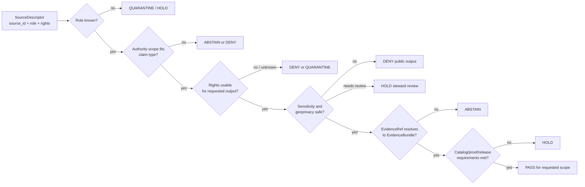

<!-- [KFM_META_BLOCK_V2]
doc_id: kfm://doc/TODO-register-fauna-source-roles
title: Fauna Source Roles
type: standard
version: v1
status: draft
owners: TODO(fauna-domain-stewards)
created: 2026-04-27
updated: 2026-05-07
policy_label: TODO(verify-public-or-restricted)
related: [README.md, CONTROL_PLANE.md, GEOPRIVACY.md, VALIDATION.md, MIGRATION_AND_CONTINUITY.md, ../../../data/registry/fauna/README.md]
tags: [kfm, fauna, source-role, source-authority, evidence, geoprivacy, governance]
notes: [Revised from existing repo file; owners, doc registry identifier, and policy label remain TODO until steward/registry verification.]
[/KFM_META_BLOCK_V2] -->

<a id="top"></a>

# Fauna Source Roles

Role taxonomy and claim-compatibility rules for admitting, validating, explaining, and publishing fauna evidence in Kansas Frontier Matrix.

<p>
  
  
  
  
  
</p>

> [!IMPORTANT]
> **Source roles are mandatory semantics, not optional labels.**
>
> | Field | Value |
> |---|---|
> | Target path | `docs/domains/fauna/SOURCE_ROLES.md` |
> | Status | `draft` |
> | Owners | `TODO(fauna-domain-stewards)` |
> | Operating posture | Evidence-first; source-role-aware; rights-aware; geoprivacy-aware; fail closed |
> | Public release posture | Unknown role, unknown rights, unclear sensitivity, or incompatible claim support blocks public promotion |
> | Quick jumps | [Scope](#scope) · [Repo fit](#repo-fit) · [Inputs](#inputs) · [Exclusions](#exclusions) · [Core rule](#core-rule) · [Canonical roles](#canonical-roles) · [Compatibility aliases](#compatibility-aliases) · [Claim compatibility](#claim-compatibility) · [Validation flow](#validation-flow) · [Examples](#examples) · [Review checklist](#review-checklist) · [Open verification](#open-verification) |

---

## Scope

This document defines the **allowed semantic roles** that fauna sources can play inside KFM.

It exists to prevent a common failure mode: a source that is useful for one kind of claim being quietly reused as authority for a different kind of claim. A species checklist, legal listing page, occurrence aggregator, survey record, habitat layer, derived suitability model, and historical narrative can all be useful, but they do **not** carry the same authority.

### This document governs

| Surface | How source roles apply |
|---|---|
| Source admission | Every fauna source descriptor must declare a role before use. |
| Claim validation | Every fauna claim must be compatible with the roles of its supporting evidence. |
| Public API payloads | Runtime output must not imply more authority than source roles allow. |
| Map layers | Layer titles, legends, popups, and metadata must distinguish observation, status, model, habitat context, and derived support. |
| Evidence Drawer | Source role, authority scope, rights, limitations, sensitivity posture, and review state must be visible. |
| Focus Mode | Answers must cite compatible EvidenceBundles or return `ABSTAIN`, `DENY`, or `ERROR`. |
| Release review | Promotion must fail closed when role support is unknown, incompatible, or contradicted. |
| Correction and rollback | Role mistakes are release-quality defects and require correction lineage. |

### This document does not govern

| Not governed here | Owning surface |
|---|---|
| Exact public geometry classes | [GEOPRIVACY.md](GEOPRIVACY.md) |
| Executable validator behavior | [VALIDATION.md](VALIDATION.md) plus repo-native validator code |
| Domain ownership and review cadence | [CONTROL_PLANE.md](CONTROL_PLANE.md) |
| Prior-gain preservation and migration mapping | [MIGRATION_AND_CONTINUITY.md](MIGRATION_AND_CONTINUITY.md) |
| Registry file layout and source descriptor inventory | [../../../data/registry/fauna/README.md](../../../data/registry/fauna/README.md) |
| Machine schemas | Accepted schema home after ADR verification |
| Policy-as-code | Accepted `policy/` root after repo verification |

[Back to top](#top)

---

## Repo fit

`SOURCE_ROLES.md` is a human-facing control document under the fauna domain documentation lane.

```text
docs/domains/fauna/
├── README.md
├── CONTROL_PLANE.md
├── SOURCE_ROLES.md                  # this file
├── GEOPRIVACY.md
├── VALIDATION.md
├── MIGRATION_AND_CONTINUITY.md
├── INGEST_EBIRD.md
├── runbooks/
└── sources/
```

### Upstream and downstream relationships

| Relationship | Status | Path / surface | Role |
|---|---:|---|---|
| Domain landing page | CONFIRMED | [README.md](README.md) | Defines fauna lane scope, object families, lifecycle, public-safety posture, and review gates. |
| Governance control plane | CONFIRMED | [CONTROL_PLANE.md](CONTROL_PLANE.md) | Tracks owners, active risks, review cadence, and change-control gates. |
| Geoprivacy companion | CONFIRMED | [GEOPRIVACY.md](GEOPRIVACY.md) | Defines public geometry classes, redaction receipt fields, leak vectors, and geoprivacy outcomes. |
| Validation companion | CONFIRMED | [VALIDATION.md](VALIDATION.md) | Defines gate matrix, fixture matrix, PR evidence, release dry-run, and rollback checks. |
| Migration companion | CONFIRMED | [MIGRATION_AND_CONTINUITY.md](MIGRATION_AND_CONTINUITY.md) | Prevents silent deletion, identifier repurposing, or unreviewed migration. |
| Registry companion | CONFIRMED | [../../../data/registry/fauna/README.md](../../../data/registry/fauna/README.md) | Defines source-admission registry posture and source descriptor expectations. |
| eBird source docs | CONFIRMED | [INGEST_EBIRD.md](INGEST_EBIRD.md), `sources/ebird/`, `sources/gbif/` | Source-specific docs that must conform to this role taxonomy. |
| Machine schemas | NEEDS VERIFICATION | `schemas/contracts/v1/...` or accepted repo convention | Must not become a competing semantic authority. |
| Policy-as-code | NEEDS VERIFICATION | `policy/fauna/...` or accepted repo convention | Enforces admissibility and deny/abstain obligations. |
| Validator code | NEEDS VERIFICATION | `tools/validators/fauna/...` or accepted repo convention | Executes checks described here. |

> [!NOTE]
> This file should remain readable by domain stewards and reviewers. Executable schemas, policy code, validator code, and generated reports should live in their responsibility roots, not in this Markdown document.

[Back to top](#top)

---

## Inputs

This document accepts role taxonomy, role-to-claim compatibility guidance, review expectations, and illustrative examples.

| Accepted input | Conditions |
|---|---|
| Canonical source-role definitions | Must preserve role boundaries and not silently change source meaning. |
| Compatibility aliases | Must map old or source-specific terms to canonical roles without creating parallel authority. |
| Claim compatibility tables | Must distinguish minimum required role, additional required evidence, and fail-closed outcome. |
| Validation expectations | Must remain human-readable and link to executable validator homes when verified. |
| Source-specific role notes | Must be generalizable or explicitly scoped to a source family such as eBird or GBIF. |
| Negative examples | Should show what must be denied, held, quarantined, or answered with abstention. |
| Review checklist items | Must help maintainers catch source-role collapse before release. |

[Back to top](#top)

---

## Exclusions

These items must not be placed in this file.

| Excluded item | Correct home or handling | Reason |
|---|---|---|
| Raw source payloads | `data/raw/fauna/...` or repo-confirmed equivalent | Docs must not become data storage. |
| Quarantined source records | `data/quarantine/fauna/...` or restricted store | Quarantine data may include sensitive or rights-conflicted material. |
| Exact restricted coordinates | Restricted canonical store only | Public docs must not leak sensitive locations. |
| Source credentials or keys | Secret manager / environment-specific config | Secrets never belong in docs. |
| Machine schemas | Accepted schema home after ADR verification | Schemas own machine shape; this file owns semantics. |
| Policy-as-code | `policy/fauna/...` or repo-confirmed equivalent | Policy must be executable and testable. |
| Validator implementation | `tools/validators/fauna/...` or repo-confirmed equivalent | Code should not be embedded in source-role prose. |
| Generated validation reports | Build artifacts, receipts, or proof homes | Reports must be reproducible and retained separately. |
| Release manifests or proof packs | `release/`, `data/proofs/`, or repo-confirmed equivalent | Release decisions and proof objects are separate trust records. |
| AI-generated claims | Nowhere as evidence | AI can interpret compatible released evidence; it cannot supply source authority. |

[Back to top](#top)

---

## Core rule

A fauna claim is valid only when the supporting source role is compatible with the claim type.

```text
source descriptor
  -> source role
  -> authority scope
  -> rights posture
  -> sensitivity posture
  -> evidence reference policy
  -> claim compatibility check
  -> public-safety check
  -> finite outcome
```

### Finite outcomes

| Outcome | Use |
|---|---|
| `PASS` | Role support is compatible for the requested validation scope. |
| `HOLD` | More review is required before the source can support the claim. |
| `DENY` | Policy, rights, public-safety, or source-role rules forbid the requested use. |
| `ABSTAIN` | Evidence is insufficient or incompatible for an asserted answer. |
| `QUARANTINE` | Source material must remain out of promotion flow because role, rights, sensitivity, or evidence is unresolved. |
| `ERROR` | Tooling, corruption, schema, or integrity failure prevents a reliable decision. |

> [!WARNING]
> The dangerous case is not an obviously bad source. The dangerous case is a useful source used for the wrong claim.

[Back to top](#top)

---

## Canonical roles

Use these canonical role codes unless an accepted schema or ADR supersedes them.

### Role table

| Canonical role | Can support | Must not imply | Required companion fields |
|---|---|---|---|
| `legal_status_authority` | Legal or regulatory status within a declared jurisdiction and effective date scope. | Occurrence truth, habitat suitability, abundance, public location permission, or conservation rank outside its scope. | `jurisdiction`, `authority_scope`, `effective_date`, `status_code`, `source_id`, `evidence_refs`. |
| `conservation_status_authority` | Conservation rank, conservation concern, imperilment, or reviewed status within a declared authority scope. | Legal protection, occurrence truth, or exact public release permission unless separately supported. | `authority_scope`, `rank_system`, `rank_date`, `review_state`, `source_id`, `evidence_refs`. |
| `taxonomic_authority` | Accepted name, synonymy, rank, classification, taxon concept, and taxon crosswalk support. | Legal status, conservation status, occurrence truth, habitat use, or public release permission. | `authority_name`, `authority_version`, `taxon_concept_scope`, `valid_from`, `valid_to`, `ambiguity_policy`. |
| `occurrence_source` | Observation, specimen, checklist, survey detection, acoustic record, camera/trap record, eDNA detection, mortality event, invasive report, disease/pathogen report, or documentary occurrence support. | Legal authority, conservation authority, true absence, population trend, or exact public release entitlement. | `event_time`, `location_support`, `coordinate_uncertainty`, `basis_of_record`, `rights_status`, `sensitivity_class`, `evidence_refs`. |
| `occurrence_aggregator` | Discovery and supporting occurrence context with provenance, caveats, and record-level rights. | Sovereign truth, legal status authority, original data authority, or public exact-location permission. | `upstream_sources`, `license_policy`, `record_level_rights`, `data_quality_flags`, `geoprivacy_flags`, `evidence_refs`. |
| `monitoring_source` | Survey effort, detection/non-detection context, route/transect/station protocol, monitoring summary, and temporal coverage. | Public precision entitlement, legal status, or true absence outside protocol scope. | `protocol`, `effort`, `target_taxa`, `survey_window`, `station_or_route_class`, `review_state`, `evidence_refs`. |
| `habitat_context` | Environmental support, habitat class, land-cover context, wetland/soil/hydrology covariate, or habitat-association context. | Proof that a species was present. | `context_layer_id`, `method`, `source_role`, `spatial_extent`, `temporal_extent`, `limitations`, `evidence_refs`. |
| `derived_model` | Suitability, range support, seasonal range support, richness, density, corridor, assemblage, risk, or modeled indicator. | Canonical fauna truth, raw evidence, legal status, or observed occurrence. | `model_id`, `model_version`, `input_sources`, `method`, `uncertainty`, `rebuild_path`, `evidence_bundle_ref`. |
| `documentary_source` | Historical, narrative, archival, report, photograph, publication, or field-note support when cited and reviewed. | Precise geometry, current status, legal status, or unreviewed occurrence certainty. | `citation`, `date`, `spatial_interpretation`, `confidence`, `review_state`, `evidence_refs`. |
| `steward_restricted_source` | Controlled-access steward record, heritage record, nest/den/roost/hibernacula/spawning record, telemetry summary, or sensitive monitoring source. | Public exact geometry or unrestricted public payload. | `access_class`, `steward_review_required`, `sensitivity_class`, `public_geometry_class`, `redaction_receipt_policy`. |
| `data_mirror_or_cache` | Technical mirroring, caching, deduplication, checksum comparison, or availability support. | Independent evidence authority or source truth. | `upstream_source_id`, `sync_time`, `digest`, `mirror_scope`, `integrity_policy`. |

### Required source descriptor posture

A fauna source descriptor should make the following visible before activation:

| Field family | Requirement |
|---|---|
| Identity | Stable `source_id`, publisher, title, access method, and version/cadence notes. |
| Role | One canonical `source_role` plus optional scoped subrole or alias. |
| Authority scope | What the source can authoritatively support and what it cannot support. |
| Rights | License, redistribution posture, attribution, record-level license handling, and unknown-rights behavior. |
| Sensitivity | Source geoprivacy flags, sensitive taxon triggers, steward review, public geometry class, and embargo posture. |
| Evidence policy | Citation policy, EvidenceRef requirement, EvidenceBundle requirement, and limitations. |
| Lifecycle | Whether the source may enter RAW, must enter QUARANTINE, or is fixture-only. |
| Review | Owner/steward, last verification date, next review date, unresolved blockers. |

[Back to top](#top)

---

## Compatibility aliases

Adjacent docs and source-specific records may already use role names that are not identical to this canonical table. Use aliases to preserve continuity while preventing semantic drift.

| Existing or source-specific term | Canonical role | Handling |
|---|---|---|
| `observed_occurrence` | `occurrence_source` | Preserve as alias when needed; normalize during validation. |
| `monitoring_effort` | `monitoring_source` | Preserve protocol/effort fields; do not treat non-detection as absence outside protocol scope. |
| `modeled_range` | `derived_model` | Use `derived_model` with `model_subtype: range` or equivalent. |
| `range_context` | `derived_model` or `documentary_source` | Choose based on whether the source is modeled/geospatial or narrative/documentary. |
| `habitat_support` | `habitat_context` | Habitat support is context, not occurrence proof. |
| `conservation_rank` | `conservation_status_authority` | Only if authority scope supports rank/status assertions. |
| `steward_restricted_record` | `steward_restricted_source` | Enforce restricted default and public geometry review. |
| `invasive_disease_mortality` | `occurrence_source` | Use subtype fields for invasive, disease/pathogen, or mortality incident context. |
| `mirror` / `cache` / `snapshot` | `data_mirror_or_cache` | Must point to upstream source authority; cannot stand alone as evidence authority. |
| `unknown` / missing role | none | `HOLD` or `QUARANTINE`; do not infer role from file name alone. |

> [!CAUTION]
> Aliases are a compatibility mechanism, not a second vocabulary. Validators should report both the original term and normalized canonical role.

[Back to top](#top)

---

## Claim compatibility

### Claim-to-role matrix

| Claim type | Minimum compatible role | Additional required support | Fail-closed outcome |
|---|---|---|---|
| “This species is legally listed in Kansas.” | `legal_status_authority` | Jurisdiction, effective date, status code, citation, review state. | `DENY` if supported only by occurrence, aggregator, or habitat context. |
| “This species is federally listed.” | `legal_status_authority` | Federal scope, effective date, source citation, species/taxon crosswalk. | `DENY` if source authority scope is only state, conservation rank, or aggregator. |
| “This taxon name is accepted.” | `taxonomic_authority` | Authority version/date, synonym handling, ambiguity state, taxon concept scope. | `HOLD` or `ABSTAIN` if ambiguous or unresolved. |
| “This record supports occurrence at a place and time.” | `occurrence_source` or `monitoring_source` | Event time, location support, uncertainty/precision, source/evidence refs, rights, sensitivity. | `ABSTAIN` if evidence cannot be resolved; `DENY` if public release violates rights/sensitivity. |
| “This survey did not detect the species.” | `monitoring_source` | Protocol, effort, target taxa, survey window, detection limits, spatial scope. | `ABSTAIN` if used as broad absence. |
| “This area is habitat context for the species.” | `habitat_context` | Method/source, temporal scope, habitat class/covariates, limitations. | `ABSTAIN` if used as occurrence proof. |
| “This area is modeled suitable habitat.” | `derived_model` | Model version, inputs, method, uncertainty, rebuild path, evidence bundle. | `ABSTAIN` if model support is used as observed presence. |
| “This public layer can show exact points.” | Role alone is insufficient | Rights + sensitivity + geoprivacy + public geometry class + review state. | `DENY` if exact sensitive geometry, unknown rights, or unresolved source geoprivacy. |
| “This source can be used in Focus Mode.” | Compatible role for the requested claim | EvidenceBundle, citation validation, policy decision, no restricted fields. | `ABSTAIN`, `DENY`, or `ERROR` when unresolved. |
| “This source can drive a release.” | Compatible role plus release support | Validation report, catalog/proof closure, release manifest, rollback target. | `HOLD` or `DENY` when proof or rollback is missing. |

### Role-to-output matrix

| Output surface | Role constraints |
|---|---|
| Public map popup | Must state source role and avoid implying legal/status/occurrence authority beyond support. |
| Evidence Drawer | Must expose role, authority scope, rights, sensitivity, limitations, and evidence refs. |
| Focus Mode answer | Must use compatible EvidenceBundle support or abstain/deny. |
| Public download/export | Must be field-allowlisted and role-compatible; no restricted exact fields. |
| Search/autocomplete | Must not leak restricted taxa/locations or imply more authority than source role supports. |
| Graph projection | Must retain edge/source role and not collapse occurrence, model, habitat, and legal/status edges. |
| Release manifest | Must preserve source role, authority scope, rights state, policy decision, and rollback target. |

[Back to top](#top)

---

## Validation flow



### Gate responsibilities

| Gate | Question | Blocks |
|---|---|---|
| Role gate | Is `source_role` declared and canonical or mapped by alias? | All claim and release use. |
| Authority gate | Is the claim within the source’s authority scope? | Role misuse and source-role collapse. |
| Rights gate | Are license, terms, redistribution, attribution, and record-level rights compatible with output? | Public promotion and exports. |
| Sensitivity gate | Is the source/taxon/record/public geometry class compatible with exposure? | Public APIs, layers, search, graph, screenshots, Focus Mode. |
| Evidence gate | Do EvidenceRefs resolve to EvidenceBundles with limitations and integrity support? | Claims, drawers, Focus answers, exports. |
| Release gate | Do proof, catalog, review, release manifest, correction path, and rollback target exist? | Publication. |

[Back to top](#top)

---

## Source-family notes

### Legal and conservation status sources

Use legal/status sources only inside their declared jurisdiction and scope.

| Rule | Required behavior |
|---|---|
| Jurisdiction must be explicit | Kansas legal status, federal legal status, and conservation rank are different claims. |
| Effective date matters | Status claims require date or version support. |
| Occurrence is not implied | A listed species is not thereby observed at a map location. |
| Authority conflict requires review | Conflicting status sources should produce `HOLD` or `ABSTAIN` until review. |

### Occurrence aggregators

Aggregators can be useful for discovery and occurrence support, but they require strict caveats.

| Rule | Required behavior |
|---|---|
| Preserve upstream lineage | Keep dataset, institution, observer/source, license, and upstream basis when available. |
| Treat record-level rights as material | Unknown or incompatible rights block public release. |
| Respect geoprivacy flags | Source-applied generalization, obscuration, or coordinate uncertainty must not be undone. |
| Do not use as legal authority | Aggregators are not legal/status authorities unless separately designated for that role, which should be rare and reviewed. |

### Monitoring and survey sources

Monitoring evidence is protocol-bound.

| Rule | Required behavior |
|---|---|
| Effort and method are evidence | Protocol, duration, route/transect/station, target taxa, and effort matter. |
| Non-detection is scoped | Non-detection is not broad absence. |
| Station or route locations may be sensitive | Public outputs may require generalization or suppression. |
| Review state matters | Steward-reviewed summaries may have different release class than raw monitoring data. |

### Habitat and derived model sources

Habitat and model outputs are supporting context unless paired with occurrence evidence.

| Rule | Required behavior |
|---|---|
| Habitat is context | Habitat does not prove presence. |
| Models are derived | Suitability, richness, corridors, and range models remain rebuildable derivatives. |
| Input lineage matters | A model inherits limitations, rights, sensitivity, and uncertainty from inputs. |
| Public interpretation must be bounded | Titles and legends should say “modeled,” “derived,” “support,” or equivalent. |

[Back to top](#top)

---

## Examples

### Example 1 — Compatible legal-status claim

```yaml
claim_type: legal_status_statement
claim_text: "Taxon X has Kansas status Y as of date Z."
required_role: legal_status_authority
support:
  source_role: legal_status_authority
  jurisdiction: Kansas
  effective_date: "TODO"
  evidence_refs:
    - TODO
outcome: PASS
```

### Example 2 — Incompatible aggregator-as-law claim

```yaml
claim_type: legal_status_statement
claim_text: "Taxon X is legally listed because an aggregator record says so."
support:
  source_role: occurrence_aggregator
outcome: DENY
reason_codes:
  - source_role.incompatible
  - aggregator.not_legal_authority
```

### Example 3 — Habitat context used correctly

```yaml
claim_type: habitat_context_statement
claim_text: "This area overlaps mapped habitat context associated with Taxon X."
support:
  source_role: habitat_context
  method: TODO
  limitations:
    - "Habitat context is not occurrence proof."
outcome: PASS
```

### Example 4 — Habitat context overclaimed as presence

```yaml
claim_type: occurrence_statement
claim_text: "Taxon X occurs here because the habitat model is suitable."
support:
  source_role: derived_model
outcome: ABSTAIN
reason_codes:
  - evidence.insufficient_for_occurrence
  - model.not_observation
```

### Example 5 — Sensitive precise occurrence requested for public layer

```yaml
claim_type: public_layer_publication
support:
  source_role: occurrence_source
  sensitivity_class: restricted_precise
  requested_geometry: exact_point
outcome: DENY
reason_codes:
  - geoprivacy.exact_sensitive_geometry
  - public_payload.restricted_geometry
required_action:
  - derive_public_geometry
  - create_redaction_receipt
  - rerun_public_safety_validation
```

### Example 6 — Unknown source role

```yaml
source_descriptor:
  source_id: TODO
  source_role: null
requested_use: public_api_claim
outcome: QUARANTINE
reason_codes:
  - source_role.missing
  - promotion.blocked
```

[Back to top](#top)

---

## Review checklist

Before accepting a fauna source-role change, reviewers should be able to answer these questions.

- [ ] Does every source descriptor declare a canonical role or documented alias?
- [ ] Does every alias map to one canonical role without changing meaning?
- [ ] Is authority scope explicit enough to block overclaiming?
- [ ] Are legal status, conservation status, taxonomy, occurrence, monitoring, habitat context, and derived models kept separate?
- [ ] Are record-level rights, redistribution rules, attribution, and unknown-rights behavior visible?
- [ ] Are source geoprivacy flags and sensitivity triggers preserved?
- [ ] Does claim-role compatibility produce `DENY` when an aggregator is used as legal authority?
- [ ] Does habitat/model support produce `ABSTAIN` when used as occurrence proof?
- [ ] Does monitoring non-detection remain scoped by protocol and effort?
- [ ] Does exact sensitive public geometry produce `DENY`?
- [ ] Does missing or conflicting role support produce `HOLD`, `ABSTAIN`, or `QUARANTINE` instead of a guessed answer?
- [ ] Are EvidenceRefs required before public claims, Evidence Drawer payloads, Focus answers, exports, or release manifests?
- [ ] Does the PR include validation evidence or a clear `NEEDS VERIFICATION` note?
- [ ] Does any role vocabulary change update [VALIDATION.md](VALIDATION.md), [CONTROL_PLANE.md](CONTROL_PLANE.md), and registry docs as needed?
- [ ] Is rollback or correction impact documented for release-facing role changes?

[Back to top](#top)

---

## Open verification

| Item | Status | Needed proof |
|---|---:|---|
| Owners | TODO | CODEOWNERS, governance registry, or steward assignment. |
| Registered `doc_id` | TODO | Document registry entry. |
| Policy label | TODO | Policy classification decision. |
| Canonical machine enum names | NEEDS VERIFICATION | Accepted source descriptor schema and validator behavior. |
| Schema home | NEEDS VERIFICATION | Accepted ADR resolving schema home and compatibility aliases. |
| Validator entrypoint | NEEDS VERIFICATION | Repo-native validator path and command. |
| Policy runner | NEEDS VERIFICATION | OPA/Conftest/Rego or repo-native policy tooling. |
| Source-specific role descriptors | NEEDS VERIFICATION | Verified source descriptor files for GBIF, eBird, iNaturalist, KDWP-like, USFWS-like, NatureServe-like, EDDMapS-like, and steward-controlled sources. |
| Public geometry integration | NEEDS VERIFICATION | Geoprivacy validator and redaction receipt examples. |
| Release gate integration | NEEDS VERIFICATION | Release manifest, promotion decision, proof pack, and rollback target evidence. |
| Focus Mode integration | NEEDS VERIFICATION | Runtime envelope, citation validation, no restricted fields, and finite negative outcomes. |

[Back to top](#top)

---

## Appendix

<details>
<summary>Minimum source-role packet</summary>

A role packet should be reviewable even before source connector code exists.

```yaml
source_id: TODO
source_title: TODO
publisher: TODO
source_role: TODO
source_role_alias: TODO
authority_scope:
  can_support:
    - TODO
  cannot_support:
    - TODO
jurisdiction: TODO
version_or_effective_date: TODO
rights:
  status: TODO(public|open|restricted|unknown|noassertion)
  redistribution: TODO
  attribution_required: TODO
sensitivity:
  default_class: TODO
  source_geoprivacy_applies: TODO
  steward_review_required: TODO
evidence_policy:
  evidence_ref_required: true
  evidence_bundle_required_for_public_claims: true
validation:
  last_verified: TODO
  next_review: TODO
  blockers:
    - TODO
```

</details>

<details>
<summary>Negative fixture ideas</summary>

| Fixture | Expected outcome |
|---|---|
| `unknown_source_role.json` | `QUARANTINE` |
| `aggregator_used_as_legal_authority.json` | `DENY` |
| `habitat_context_used_as_occurrence.json` | `ABSTAIN` |
| `model_used_as_observation.json` | `ABSTAIN` |
| `monitoring_nondetection_used_as_absence.json` | `ABSTAIN` |
| `legal_status_used_as_occurrence.json` | `ABSTAIN` |
| `taxonomic_authority_used_as_release_permission.json` | `DENY` |
| `unknown_rights_public_release.json` | `DENY` |
| `restricted_precise_public_layer.json` | `DENY` |
| `missing_evidence_ref_public_claim.json` | `ABSTAIN` or `DENY` |
| `alias_without_canonical_mapping.json` | `HOLD` |
| `role_conflict_between_sources.json` | `HOLD` or `ABSTAIN` |

</details>

<details>
<summary>Maintainer update triggers</summary>

Update this file when any of the following changes:

- source descriptor schema adds, removes, or renames role fields;
- source-role enum changes;
- source-specific docs introduce a new role or alias;
- policy denies or allows a new class of claim support;
- geoprivacy class behavior changes;
- release gate adds role-related requirements;
- Evidence Drawer or Focus Mode changes how source role is displayed;
- public API payloads add role, authority scope, or evidence support fields;
- a correction identifies role misuse in a released artifact.

</details>

[Back to top](#top)