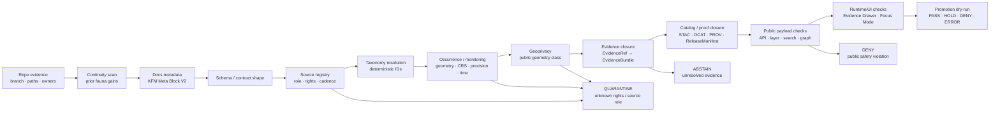

<!-- [KFM_META_BLOCK_V2]
doc_id: kfm://doc/TODO-register-fauna-validation
title: Fauna Validation and Gates
type: standard
version: v1
status: draft
owners: TODO(fauna-domain-stewards)
created: 2026-04-27
updated: 2026-05-07
policy_label: TODO(verify-public-or-restricted)
related: [README.md, CONTROL_PLANE.md, SOURCE_ROLES.md, GEOPRIVACY.md, MIGRATION_AND_CONTINUITY.md, runbooks/release-dry-run.md, runbooks/rollback.md, ../../../data/registry/fauna/README.md, ../../adr/ADR-0009-sensitive-location-policy.md]
tags: [kfm, fauna, validation, gates, geoprivacy, source-role, evidence, policy, release]
notes: [Existing repo file inspected and expanded into a validation control-plane document. doc_id, owners, and policy_label remain TODO until registry/steward verification.]
[/KFM_META_BLOCK_V2] -->

<a id="top"></a>

# Fauna Validation and Gates

Human-readable validation contract for the KFM fauna lane: fixture-first, evidence-bound, geoprivacy-safe, source-role-aware, and release-gated.

<p>
  
  
  
  
  
  
</p>

> [!IMPORTANT]
> **Impact block**
>
> | Field | Value |
> |---|---|
> | Target path | `docs/domains/fauna/VALIDATION.md` |
> | Status | `draft` documentation; executable validator maturity remains `NEEDS VERIFICATION` unless the active branch proves otherwise |
> | Owners | `TODO(fauna-domain-stewards)` |
> | Validation posture | Fail closed on unresolved evidence, source role, rights, sensitivity, public geometry, catalog closure, release state, or rollback target |
> | Source posture | Synthetic and public-safe fixtures first; live source connectors require source descriptor, rights, sensitivity, and steward review |
> | Public-safety posture | No restricted exact occurrence geometry in public API, layers, search, graph, screenshots, exports, Evidence Drawer, or Focus Mode |
> | Quick jumps | [Scope](#scope) · [Repo fit](#repo-fit) · [Inputs](#inputs) · [Exclusions](#exclusions) · [Validation flow](#validation-flow) · [Gate matrix](#gate-matrix) · [Fixture matrix](#fixture-matrix) · [Commands](#commands) · [PR evidence](#pr-evidence) · [Release dry-run](#release-dry-run) · [Rollback checks](#rollback-checks) · [Open verification](#open-verification) |

---

## Scope

This document defines what must be validated before fauna data, claims, map layers, API payloads, Evidence Drawer payloads, Focus Mode responses, or release candidates can move toward public or semi-public use.

It is a **validation control-plane document**, not the executable validator itself. It explains expected gates, fixtures, outcomes, review evidence, and failure handling so that maintainers can implement or review validators without weakening KFM doctrine.

### Covered surfaces

| Surface | Validation burden |
|---|---|
| Domain docs | Metadata, ownership, status, related docs, and no-overclaim posture stay current. |
| Source descriptors | Source role, rights, authority scope, cadence, access class, attribution, and geoprivacy posture are explicit. |
| Taxonomy | Ambiguous or unresolved names cannot silently merge or churn identifiers without migration mapping. |
| Occurrence records | Geometry, CRS, precision, observation time, source refs, evidence refs, rights, and sensitivity class are present and compatible with the requested use. |
| Monitoring records | Survey method, protocol, effort, time, station/transect/route context, and public-summary posture are explicit. |
| Public derivatives | Redaction/generalization receipts, public geometry class, field allowlists, and no-leak checks pass. |
| Catalog/proof/release | EvidenceBundle, STAC/DCAT/PROV closure, ReleaseManifest, PromotionDecision, and rollback references are present when applicable. |
| API/runtime/UI | Runtime envelopes are finite; Evidence Drawer and Focus Mode consume governed public-safe evidence only. |
| Migration/continuity | Prior fauna and habitat+fauna work is preserved, mapped, superseded, or retired with rollback notes. |

### Not covered here

This document does not decide source rights, steward approvals, schema-home ADRs, policy language, package manager, API framework, or UI framework. Those decisions must be verified in their owning roots and linked back here.

[Back to top](#top)

---

## Repo fit

This file sits in the human-facing fauna documentation control plane.

```text
docs/domains/fauna/
├── README.md
├── CONTROL_PLANE.md
├── SOURCE_ROLES.md
├── GEOPRIVACY.md
├── VALIDATION.md                  # this file
├── MIGRATION_AND_CONTINUITY.md
└── runbooks/
    ├── release-dry-run.md
    └── rollback.md
```

### Confirmed companion roles

| Companion | Role in validation |
|---|---|
| [README.md](README.md) | Domain orientation, scope, repo fit, source classes, lifecycle, and review gates. |
| [CONTROL_PLANE.md](CONTROL_PLANE.md) | Owners, cadence, active risk register, and change-control gate checklist. |
| [SOURCE_ROLES.md](SOURCE_ROLES.md) | Canonical source-role taxonomy and claim-role compatibility checks. |
| [GEOPRIVACY.md](GEOPRIVACY.md) | Public geometry classes, redaction receipt fields, leak vectors, and geoprivacy outcomes. |
| [MIGRATION_AND_CONTINUITY.md](MIGRATION_AND_CONTINUITY.md) | Prior-gain preservation, supersession mapping, migration protocol, and hard rules. |
| [runbooks/release-dry-run.md](runbooks/release-dry-run.md) | Safe release rehearsal using fixtures or approved public-safe inputs. |
| [runbooks/rollback.md](runbooks/rollback.md) | Withdrawal and restoration checks when policy, rights, evidence, or quality issues appear. |
| [../../../data/registry/fauna/README.md](../../../data/registry/fauna/README.md) | Source-admission registry posture for source descriptors, taxon authorities, sensitivity policies, and verification backlog. |
| [../../adr/ADR-0009-sensitive-location-policy.md](../../adr/ADR-0009-sensitive-location-policy.md) | Default-deny sensitive-location policy and validation expectations for public-safe release. |

### Proposed machine and runtime homes

The following homes are **PROPOSED / NEEDS VERIFICATION** unless the active branch already confirms them.

| Responsibility | Candidate home | Status |
|---|---|---:|
| Fauna validators | `tools/validators/fauna/` | `PROPOSED / NEEDS VERIFICATION` |
| Validation reports | `build/fauna/reports/*.json` | `PROPOSED / NEEDS VERIFICATION` |
| Fauna policies | `policy/fauna/*.rego` or repo-native equivalent | `PROPOSED / NEEDS VERIFICATION` |
| Test fixtures | `tests/fixtures/fauna/` or repo-native equivalent | `PROPOSED / NEEDS VERIFICATION` |
| Domain tests | `tests/fauna/` or `tests/domains/fauna/` | `PROPOSED / NEEDS VERIFICATION` |
| Source registry | `data/registry/fauna/` | `CONFIRMED README; registry file inventory NEEDS VERIFICATION` |
| Receipts | `data/receipts/fauna/` | `PROPOSED / NEEDS VERIFICATION` |
| Proofs | `data/proofs/fauna/` | `PROPOSED / NEEDS VERIFICATION` |
| Published public-safe fauna artifacts | `data/published/fauna/` | `PROPOSED / NEEDS VERIFICATION` |
| API contract tests | `tests/e2e/runtime_proof/fauna/` | `PROPOSED / NEEDS VERIFICATION` |

> [!CAUTION]
> Do not create duplicate homes for contracts, schemas, policy, fixtures, receipts, proofs, or release decisions. If repo-native homes differ, update this document with the accepted ADR or migration note.

[Back to top](#top)

---

## Inputs

Validation accepts reviewable artifacts, fixtures, manifests, and reports. It does **not** require live source access for the first safe slice.

| Input | Accepted when | Expected validation |
|---|---|---|
| Synthetic public-safe fauna fixture | Fixture is clearly local/synthetic and not a sensitive real occurrence | Schema, occurrence, source-role, geoprivacy, EvidenceBundle, catalog, API, and Focus dry-run checks. |
| Source descriptor | Includes source role, authority scope, rights, access class, cadence, attribution, geoprivacy, and steward-review state | Unknown role or unknown rights blocks public promotion. |
| Taxon authority record | Includes authority/version/date, rank/synonym rules, ambiguity handling, and migration policy | Ambiguous or unresolved taxonomy returns `HOLD` / `ABSTAIN`. |
| Occurrence record | Includes geometry, CRS, precision, event time, source/evidence refs, rights, sensitivity class, and provenance | Missing precision, unresolved evidence, or restricted exact public output fails closed. |
| Public geometry derivative | Produced from a restricted or candidate record through approved public geometry class | Redaction/generalization receipt required. |
| EvidenceBundle | Resolves all EvidenceRefs needed by a claim or runtime response | Missing or broken bundle produces `ABSTAIN`, `DENY`, or `ERROR` depending on failure type. |
| Release candidate | Includes validation reports, catalog/proof closure, policy decision, release manifest, review state, and rollback target | Missing gate support blocks promotion. |
| Migration mapping | Maps prior IDs, schema names, layer IDs, API shapes, fixtures, or paths to successors | Missing mapping blocks destructive migration. |

[Back to top](#top)

---

## Exclusions

These items must not be added to this document or treated as validation evidence here.

| Excluded item | Correct handling |
|---|---|
| RAW occurrence dumps or source exports | Store under governed lifecycle homes such as `data/raw/fauna/`, not docs. |
| WORK-stage repair outputs | Store in `data/work/fauna/` or repo-confirmed equivalent. |
| Quarantined sensitive records | Store in `data/quarantine/fauna/` or restricted store; expose only safe obligation summaries. |
| Exact protected coordinates | Never include in this doc, examples, screenshots, public fixtures, public API snapshots, or public tiles. |
| API keys, tokens, credentials, private URLs | Use the secret manager or deployment-specific config. |
| Machine schemas | Store in the accepted schema home after ADR verification. |
| Policy-as-code | Store under `policy/` or repo-confirmed policy root. |
| Validator code | Store under `tools/validators/`, package-native validator home, or accepted repo convention. |
| Generated release proof packs | Store in `data/proofs/` and `release/`, not prose. |
| Generated validation report bodies | Store in build artifacts or receipts; summarize in PR evidence. |
| Direct model output | Never treat as evidence. Focus Mode output must be evidence-bounded and citation-validated. |

[Back to top](#top)

---

## Validation flow



Validation is ordered this way so unsafe data does not travel downstream. A later gate may add obligations, but it must not “rescue” a record that failed a required upstream gate without a documented correction, receipt, and re-run.

[Back to top](#top)

---

## Outcome vocabulary

| Outcome | Meaning | Typical use |
|---|---|---|
| `PASS` | Gate succeeded for the requested scope. | Schema valid, public-safe fixture accepted, catalog closure complete. |
| `HOLD` | Action is blocked until review or missing proof is supplied. | Steward review required, schema-home ADR missing, taxonomy ambiguity. |
| `DENY` | Policy or public-safety rule forbids the requested action. | Sensitive exact public geometry, unknown rights at publication, source-role misuse. |
| `ABSTAIN` | The system cannot support a factual answer or claim from resolved evidence. | EvidenceBundle missing, source roles conflict, habitat-only support used as occurrence proof. |
| `QUARANTINE` | Data is held outside public/promotion flow because validity, rights, sensitivity, or source role is unresolved. | Unknown source role, invalid source payload, conflicting rights. |
| `ERROR` | Infrastructure, schema parsing, corruption, or tool failure prevents a reliable decision. | Broken manifest, malformed runtime envelope, validator crash. |

Runtime-facing fauna APIs and Focus Mode should use finite response outcomes: `ANSWER`, `ABSTAIN`, `DENY`, and `ERROR`. Validation gates may additionally use `PASS`, `HOLD`, and `QUARANTINE`.

[Back to top](#top)

---

## Gate matrix

| Gate | Blocking? | Validates | Required evidence | Fail-closed examples |
|---|---:|---|---|---|
| G0 — Repo evidence | Yes for implementation claims | Branch state, target paths, neighboring docs, owners, package/test conventions | Command transcript or connector evidence | Claiming route, CI, package, or validator maturity without proof. |
| G1 — Continuity | Yes for migrations | Prior fauna/habitat+fauna docs, schemas, fixtures, policies, layer IDs, API shapes | Preservation matrix or supersession mapping | Silent deletion, repurposed identifier, unmapped fixture change. |
| G2 — Documentation control | Yes for docs PRs | KFM Meta Block V2, status, owners, related docs, badges, quick links, no-overclaim notes | Updated docs and review notes | Missing owner placeholder, stale policy label, broken relative link. |
| G3 — Schema and contract | Yes for machine objects | Required fields, enums, type shape, object-family boundary | Schema validation report and valid/invalid fixtures | Missing `evidence_ref`, invalid geometry type, unsupported outcome enum. |
| G4 — Source registry | Yes | Source role, rights, authority scope, cadence, attribution, geoprivacy, access class | Source descriptor and registry validator report | Unknown rights, unknown source role, aggregator used as legal authority. |
| G5 — Taxonomy | Yes for taxon claims | Deterministic taxon key, authority version, synonym/crosswalk, ambiguity state | Taxon resolution receipt or validator report | Ambiguous match silently merged; taxon ID churn without mapping. |
| G6 — Occurrence / monitoring | Yes | Geometry, CRS, coordinate precision, event time, provenance, observer/source handling, method/effort where relevant | Occurrence validation report | Missing precision, unknown CRS, missing event time, unreviewed restricted monitoring station. |
| G7 — Geoprivacy | Yes | Public geometry class, sensitivity class, leak vectors, redaction receipt, field allowlist | Geoprivacy report and redaction/generalization receipt | Exact sensitive point in public payload, reverse-engineering risk, redaction without receipt. |
| G8 — Evidence closure | Yes | EvidenceRef resolution, EvidenceBundle integrity, limitations, rights/sensitivity summary | EvidenceBundle validation report | Runtime answer without resolved bundle; broken evidence link. |
| G9 — Catalog / proof / release | Yes for promotion | STAC/DCAT/PROV closure, release manifest, proof pack, rollback target | CatalogMatrix, ReleaseManifest, PromotionDecision | Missing rollback target, mismatched digest, catalog distribution without proof. |
| G10 — Public payload | Yes | API/layer/search/graph/export field allowlists and no restricted fields | Public-safety validator report | Restricted field in TileJSON, graph projection reveals coordinates, search index exposes source record. |
| G11 — Runtime / UI / Focus | Yes | RuntimeResponseEnvelope, Evidence Drawer trust fields, Focus Mode citations and negative states | API contract tests and UI payload fixtures | Unknown rights returns `ANSWER`; Focus reveals restricted location; drawer hides evidence limitations. |
| G12 — Release dry-run | Yes for release | Aggregated promotion state, validation artifacts, review state, rollback path | Release dry-run decision record | Auto-publish without manifest; `PASS` despite deny report. |

[Back to top](#top)

---

## Fixture matrix

The first complete validation suite should be no-network and fixture-first.

| Fixture | Purpose | Expected outcome | Gates exercised |
|---|---|---:|---|
| `valid/public_safe_occurrence.json` | Happy path for a public-safe synthetic occurrence | `PASS` | Schema, occurrence, evidence, geoprivacy, API payload. |
| `valid/public_generalized_occurrence.json` | Proves allowed generalized output plus receipt | `PASS` | Geoprivacy, redaction receipt, public payload. |
| `valid/habitat_context_only.json` | Allows habitat support while preserving non-occurrence boundary | `PASS` for context, `ABSTAIN` for occurrence claim | Source role, claim-role compatibility. |
| `invalid/protected_species_exact_geometry.json` | Prevents restricted exact location exposure | `DENY` | Geoprivacy, public payload, layer/search/graph leak checks. |
| `invalid/unknown_source_role.json` | Enforces source-role requirement | `HOLD` / `QUARANTINE` | Source registry, policy. |
| `invalid/missing_rights_metadata.json` | Blocks public promotion under unknown rights | `DENY` / `QUARANTINE` | Rights, source descriptor, promotion. |
| `invalid/aggregator_as_legal_authority.json` | Prevents source-role collapse | `DENY` | Source role, claim-role compatibility. |
| `invalid/missing_evidence_ref.json` | Prevents unsupported public claim | `ABSTAIN` / `DENY` | Evidence closure, API/Focus. |
| `invalid/unresolved_evidence_bundle.json` | Valid shape but unresolved support | `ABSTAIN` | EvidenceBundle resolver, runtime envelope. |
| `invalid/ambiguous_taxonomy.json` | Blocks silent taxon merge | `HOLD` / `ABSTAIN` | Taxonomy, continuity. |
| `invalid/missing_coordinate_precision.json` | Blocks unsafe spatial precision assumptions | `DENY` / `QUARANTINE` | Occurrence, geoprivacy. |
| `invalid/restricted_field_in_public_api.json` | Prevents field leakage | `DENY` | Public payload, API contract. |
| `invalid/restricted_field_in_tile_metadata.json` | Prevents tile/layer leakage | `DENY` | Layer manifest, PMTiles/TileJSON metadata. |
| `invalid/focus_uncited_claim.json` | Prevents AI claim without evidence | `ABSTAIN` / `DENY` | Focus Mode, citation validation. |
| `invalid/migration_without_mapping.json` | Prevents destructive schema/layer/API churn | `HOLD` / `DENY` | Continuity, migration, rollback. |

[Back to top](#top)

---

## Commands

The current repository should define canonical commands. Until verified, treat these commands as **PROPOSED placeholders**.

### Repository evidence preflight

```bash
git status --short
git branch --show-current
git rev-parse --show-toplevel

find docs/domains/fauna data/registry/fauna policy tools tests schemas contracts data release \
  -maxdepth 4 -type f 2>/dev/null | sort | sed -n '1,240p'
```

### Documentation link and control-plane checks

```bash
# PROPOSED: replace with repo-native docs lint if one exists.
python tools/validators/docs/check_kfm_meta_block.py docs/domains/fauna/VALIDATION.md
python tools/validators/docs/check_relative_links.py docs/domains/fauna/VALIDATION.md
```

### Fauna validation suite

```bash
# PROPOSED: validator home and args need repo verification.
python tools/validators/fauna/run_all.py \
  --fixtures tests/fixtures/fauna \
  --registry data/registry/fauna \
  --reports build/fauna/reports

# PROPOSED: policy runner depends on repo toolchain.
conftest test \
  --policy policy/fauna \
  tests/fixtures/fauna

# PROPOSED: adapt to repo-native test layout.
pytest -q \
  tests/fauna \
  tests/e2e/runtime_proof/fauna
```

### Release dry-run

```bash
# PROPOSED: release bundle path depends on accepted release/proof layout.
python tools/validators/fauna/validate_release_bundle.py \
  --bundle data/proofs/fauna/releases/<release_id>/release_bundle.json \
  --reports build/fauna/reports

python tools/validators/fauna/validate_public_safety.py \
  --published data/published/fauna/releases/<release_id> \
  --reports build/fauna/reports
```

### Expected report family

```text
build/fauna/reports/
├── repo_evidence.json
├── continuity.json
├── docs_metadata.json
├── schemas.json
├── source_registry.json
├── taxonomy.json
├── occurrences.json
├── geoprivacy.json
├── evidence_bundles.json
├── catalogs.json
├── layers.json
├── api_contracts.json
├── focus_ai.json
├── public_safety.json
├── release_dry_run.json
└── validation_summary.json
```

> [!NOTE]
> CI YAML should orchestrate validators. It should not become the only place where policy, evidence, catalog, or release rules are defined.

[Back to top](#top)

---

## PR evidence

A fauna PR that changes validation, source admission, sensitivity, publication, API, UI, or release behavior should include a compact evidence bundle in the PR body.

| PR field | Required content |
|---|---|
| Goal | What changed and why. |
| Owning root(s) | `docs/`, `data/registry/`, `policy/`, `tools/`, `tests/`, `schemas/`, `release/`, or other touched roots. |
| Directory Rules basis | Why each new or moved file belongs in its target responsibility root. |
| Source role impact | New, changed, or removed source roles; claim-role compatibility impact. |
| Rights/sensitivity impact | Whether public release, exact geometry, or steward review is affected. |
| Evidence impact | EvidenceRef/EvidenceBundle changes and unresolved evidence items. |
| Fixture impact | Valid/invalid fixtures added or changed. |
| Policy impact | Deny/restrict/abstain rules added or changed. |
| Public exposure impact | API/layer/export/search/graph/Focus/UI exposure changes. |
| Validation commands | Commands run, report paths, and outcomes. |
| Rollback plan | What to restore, invalidate, withdraw, or correct. |
| Unknowns | Remaining `UNKNOWN` / `NEEDS VERIFICATION` items. |

### Required attachments or links

- [ ] Validation summary report.
- [ ] Changed fixture list.
- [ ] Source descriptor diff.
- [ ] Geoprivacy report when geometry changes.
- [ ] EvidenceBundle/citation report when claims change.
- [ ] Catalog/proof/release report when publication changes.
- [ ] Migration/supersession mapping when IDs, schemas, paths, layer IDs, or API shapes change.
- [ ] Rollback note for publish-facing changes.

[Back to top](#top)

---

## Release dry-run

Fauna release validation must be rehearsed before public promotion.

### Preconditions

- [ ] No unresolved high-severity geoprivacy risks.
- [ ] No unknown rights or unknown source-role entries in the release candidate.
- [ ] EvidenceRefs resolve to EvidenceBundles.
- [ ] Public geometry class is assigned and validated.
- [ ] Restricted exact geometry is absent from public payloads.
- [ ] Release candidate includes catalog, proof, policy, review, and rollback references.
- [ ] Validation report family is attached or linked.

### Promotion gate checklist

| Gate | Requirement | Failure |
|---|---|---|
| A — Ownership | Domain/steward/release ownership known for release scope. | `HOLD` |
| B — Schema validity | All changed objects validate against accepted schemas. | `DENY` / `ERROR` |
| C — Source and rights | Source roles, rights, access classes, and attribution resolved. | `DENY` / `QUARANTINE` |
| D — Sensitivity and geoprivacy | Public geometry class and receipts are valid. | `DENY` |
| E — Evidence closure | EvidenceRefs resolve to EvidenceBundles. | `ABSTAIN` / `DENY` |
| F — Catalog/proof closure | CatalogMatrix, ReleaseManifest, receipts/proofs, and digests align. | `DENY` / `ERROR` |
| G — Public payload | API/layer/search/graph/export/Focus payloads contain no restricted fields. | `DENY` |
| H — Continuity and rollback | Prior gains mapped; rollback target and correction path exist. | `HOLD` / `DENY` |

### Exit states

| Exit state | Meaning |
|---|---|
| `PASS` | Candidate can proceed to governed review or publish lane according to repo release policy. |
| `HOLD` | Candidate needs obligations resolved before continuing. |
| `DENY` | Candidate violates policy, public-safety, source-role, rights, or release requirements. |
| `ERROR` | Tooling, schema, integrity, or infrastructure failure prevents a reliable decision. |

[Back to top](#top)

---

## Rollback checks

Rollback validation protects public trust when a fauna release is wrong, unsafe, stale, or incomplete.

### Rollback triggers

- Sensitive location exposure risk.
- Incorrect legal/status claim in released outputs.
- Evidence reference broken or non-resolving.
- Corrupt, incomplete, or mismatched release manifest.
- Rights/license change invalidates public release.
- Source-role mapping was wrong.
- Taxonomy migration caused incorrect public identity.
- Public layer, search index, graph projection, or Focus payload leaked restricted support.

### Required rollback validation

| Check | Required proof |
|---|---|
| Known-good target | Prior release manifest, spec hash, alias, and evidence bundle are valid. |
| Artifact enumeration | Affected API snapshots, PMTiles/TileJSON, map layers, exports, search indexes, graph projections, Focus caches, and docs/screenshots are listed. |
| Alias restoration | Public aliases point to prior known-good release or safe withdrawn state. |
| Cache invalidation | API, tile, search, graph, EvidenceBundle, and Focus caches are invalidated. |
| Correction notice | Public-facing correction scope and user impact are recorded without exposing restricted details. |
| Receipt retention | Rollback receipt preserves actor/run, time, reason, prior/new spec hashes, and validation outcomes. |
| Non-regression | The original failure has a fixture or validator test before re-release. |

[Back to top](#top)

---

## Open verification

| Item | Status | Needed proof |
|---|---:|---|
| Canonical validator entrypoint | `NEEDS VERIFICATION` | Existing validator files, package scripts, Make targets, or CI commands. |
| Policy toolchain | `NEEDS VERIFICATION` | OPA/Conftest/Rego or repo-native policy runner version and fixture layout. |
| Schema home for fauna machine contracts | `NEEDS VERIFICATION` | Accepted ADR or current repo convention resolving `contracts/` vs `schemas/`. |
| Test framework and fixture home | `NEEDS VERIFICATION` | Existing test layout and runner evidence. |
| Release manifest and proof-pack implementation | `NEEDS VERIFICATION` | Existing release/proof object files, schemas, or dry-run outputs. |
| Public fauna API path | `UNKNOWN` | Route tree, OpenAPI contract, or governed API app evidence. |
| MapLibre/Evidence Drawer implementation path | `UNKNOWN` | Current UI shell/component tree and layer registry evidence. |
| Live source activation rules | `NEEDS VERIFICATION` | Source descriptors, rights terms, source-role constraints, steward approval, and no-network fixture success. |
| Sensitive species steward policy | `NEEDS VERIFICATION` | Steward roster, sensitive-location policy, geoprivacy transform rules, and public geometry class thresholds. |
| CODEOWNERS / reviewer coverage | `NEEDS VERIFICATION` | CODEOWNERS or governance registry entry for fauna docs, registry, policy, validators, and release. |

[Back to top](#top)

---

## Appendix

<details>
<summary>Sample validation summary shape</summary>

```json
{
  "schema_version": "kfm.fauna.validation_summary.v1",
  "domain": "fauna",
  "run_id": "TODO",
  "created_at": "TODO",
  "target_ref": "TODO(branch-or-sha)",
  "overall_outcome": "HOLD",
  "gates": [
    {
      "gate_id": "G4",
      "name": "source_registry",
      "outcome": "DENY",
      "reason_codes": ["source_role.unknown", "rights.unknown"],
      "blocking": true,
      "report_ref": "build/fauna/reports/source_registry.json"
    },
    {
      "gate_id": "G7",
      "name": "geoprivacy",
      "outcome": "PASS",
      "reason_codes": [],
      "blocking": true,
      "report_ref": "build/fauna/reports/geoprivacy.json"
    }
  ],
  "release_allowed": false,
  "obligations": [
    "Resolve unknown source_role before public promotion.",
    "Attach rights verification or quarantine the source."
  ],
  "rollback_ref": null
}
```

</details>

<details>
<summary>Sample PR review card</summary>

```text
Goal:
Owning root(s):
Directory Rules basis:
Object families affected:
Contracts changed:
Schemas changed:
Fixtures added/updated:
Policy gates affected:
Source-role impact:
Rights/sensitivity impact:
Public exposure possible? yes/no
EvidenceRef/EvidenceBundle impact:
Release/correction/rollback impact:
Validation commands run:
Validation report refs:
Known UNKNOWN / NEEDS VERIFICATION:
Rollback plan:
```

</details>

<details>
<summary>Validator implementation backlog</summary>

| Validator | First responsibility |
|---|---|
| `validate_sources.py` | Source registry shape, source role, rights, cadence, access class, and authority scope. |
| `validate_taxonomy.py` | Deterministic keys, accepted/synonym/ambiguous/unresolved classifications, migration receipts. |
| `validate_occurrences.py` | Geometry, CRS, precision, event time, provenance, source/evidence refs, rights. |
| `validate_monitoring.py` | Protocol, effort, timestamp, station/transect/route, and public-summary checks. |
| `validate_geoprivacy.py` | No restricted geometry in public outputs; redaction receipts required. |
| `validate_evidence_bundles.py` | EvidenceRefs resolve; bundles include source, rights, sensitivity, limitation, and integrity support. |
| `validate_catalogs.py` | STAC/DCAT/PROV/catalog matrix closure and digest consistency. |
| `validate_layers.py` | Layer manifests, field allowlists, TileJSON/PMTiles metadata, zoom limits, and no-leak checks. |
| `validate_api_contracts.py` | Runtime envelopes and public API payload outcomes. |
| `validate_focus_ai.py` | Evidence-bounded prompts, citation validation, no restricted fields, finite outcomes. |
| `validate_public_safety.py` | Cross-surface leak scan for API, layer, search, graph, export, screenshot, and docs payloads. |
| `validate_continuity.py` | Prior gains preserved, migrated, superseded, or retired with mapping and rollback. |
| `run_all.py` | Aggregates report family and returns fail-closed CI status. |

</details>

[Back to top](#top)