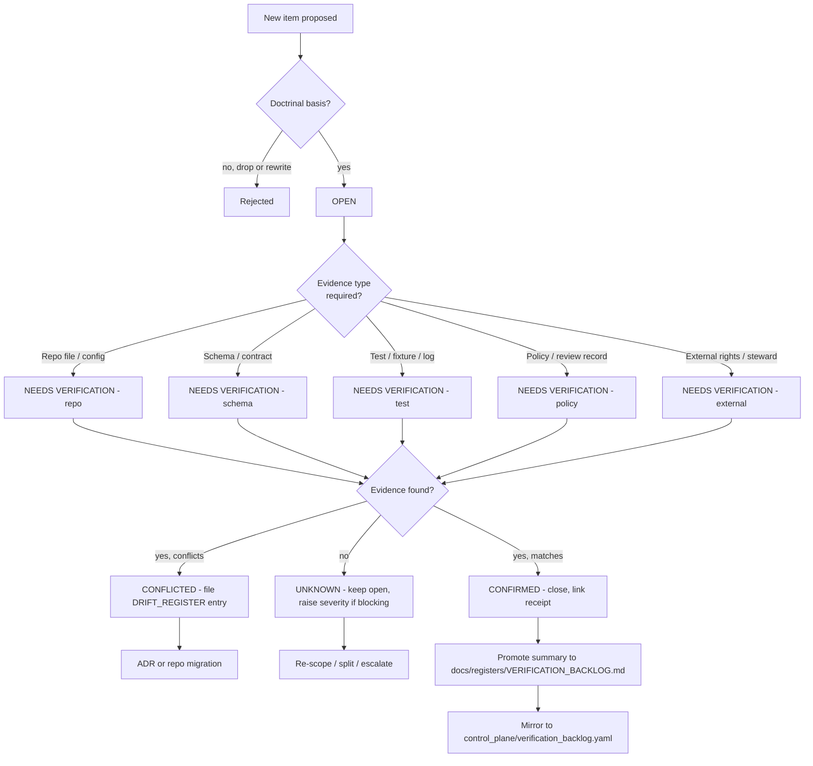

<!-- [KFM_META_BLOCK_V2]
doc_id: kfm://doc/fauna-verification-backlog
title: Fauna Domain — Verification Backlog
type: standard
version: v1.1
status: draft
owners: TODO (fauna-domain-steward, sensitivity-reviewer, ecology-lead)
created: 2026-05-16
updated: 2026-06-02
policy_label: public
related:
  - docs/domains/fauna/README.md
  - docs/domains/fauna/CANONICAL_PATHS.md
  - docs/domains/fauna/MISSING_OR_PLANNED_FILES.md
  - docs/domains/fauna/OPEN_QUESTIONS.md
  - docs/runbooks/fauna/SOURCE_REFRESH_RUNBOOK.md
  - docs/registers/VERIFICATION_BACKLOG.md
  - control_plane/verification_backlog.yaml
  - docs/doctrine/directory-rules.md
  - docs/doctrine/ai-build-operating-contract.md
tags: [kfm, fauna, register, verification, governance]
notes:
  # Domain-scoped backlog; feeds the central register and control_plane register.
  # All implementation-layer claims default to PROPOSED / NEEDS VERIFICATION until repo-mounted evidence settles them.
  # Envelope naming: three distinct envelopes exist — DecisionEnvelope (policy output), RuntimeResponseEnvelope (Focus Mode/AI), FaunaDecisionEnvelope (feature-resolver DTO, Atlas §7.J, route UNKNOWN). See §5.1.
  # Doctrine-adjacent doc; CONTRACT_VERSION = "3.0.0" pinned per AI Build Operating Contract v3.0.
[/KFM_META_BLOCK_V2] -->

# Fauna Domain — Verification Backlog

> The checkable items the Fauna lane owes evidence for, organized so any reviewer can pick one up and close it without reconstructing the doctrine from scratch.

<!-- Badges: at least three; placeholders permitted per presentation standard. -->


**Status:** `draft` · **Owners:** `TODO (fauna-domain-steward, sensitivity-reviewer, ecology-lead)` · **Last updated:** `2026-06-02` · **`CONTRACT_VERSION = "3.0.0"`**

---

## Contents

1. [Purpose](#1-purpose)
2. [Repo fit and authority](#2-repo-fit-and-authority)
3. [Doctrine constraints this register answers to](#3-doctrine-constraints-this-register-answers-to)
4. [How items move through the backlog](#4-how-items-move-through-the-backlog)
5. [Severity and status taxonomy](#5-severity-and-status-taxonomy)
   - 5.1 [A note on the three envelopes](#51-a-note-on-the-three-envelopes)
6. [Backlog register](#6-backlog-register)
   - 6.1 [Source registry, rights, steward roles `VB-FAUNA-SRC`](#61-source-registry-rights-steward-roles-vb-fauna-src)
   - 6.2 [Taxonomic identity and crosswalks `VB-FAUNA-TAX`](#62-taxonomic-identity-and-crosswalks-vb-fauna-tax)
   - 6.3 [Sensitivity, geoprivacy, SensitiveSite `VB-FAUNA-SEN`](#63-sensitivity-geoprivacy-sensitivesite-vb-fauna-sen)
   - 6.4 [Schema, contract, policy homes `VB-FAUNA-CSP`](#64-schema-contract-policy-homes-vb-fauna-csp)
   - 6.5 [Pipeline and lifecycle `VB-FAUNA-LIF`](#65-pipeline-and-lifecycle-vb-fauna-lif)
   - 6.6 [Validators, tests, fixtures `VB-FAUNA-VAL`](#66-validators-tests-fixtures-vb-fauna-val)
   - 6.7 [Publication, API surfaces, layer manifests `VB-FAUNA-PUB`](#67-publication-api-surfaces-layer-manifests-vb-fauna-pub)
   - 6.8 [Governed AI and Focus Mode `VB-FAUNA-AI`](#68-governed-ai-and-focus-mode-vb-fauna-ai)
   - 6.9 [Map, Evidence Drawer, UI `VB-FAUNA-UI`](#69-map-evidence-drawer-ui-vb-fauna-ui)
   - 6.10 [Cross-lane relations and joins `VB-FAUNA-XLN`](#610-cross-lane-relations-and-joins-vb-fauna-xln)
7. [Closure criteria](#7-closure-criteria)
8. [Adding a new item](#8-adding-a-new-item)
9. [Promotion to the central register](#9-promotion-to-the-central-register)
10. [Open questions](#10-open-questions)
11. [Changelog and definition of done](#11-changelog-and-definition-of-done)
12. [Related docs](#12-related-docs)
13. [Appendix A — Item template](#appendix-a--item-template)
14. [Appendix B — Doctrinal anchors quick map](#appendix-b--doctrinal-anchors-quick-map)

---

## 1. Purpose

This register is the **single, domain-scoped place** to track checkable items the Fauna lane owes evidence for before any of the following can be claimed as more than `PROPOSED`:

- A Fauna **source** is activated for ingest.
- A Fauna **object family** (Taxon, Occurrence Public, RangePolygon, SensitiveSite, …) is treated as schema-supported.
- A Fauna **public layer**, tile, or API surface is released.
- A Fauna claim is **summarized by Governed AI** or surfaced in **Focus Mode**.
- A Fauna **release** is promoted past `CATALOG / TRIPLET` toward `PUBLISHED`.

The register **does not** decide whether an item should exist (that is for `contracts/`, `schemas/`, `policy/`, source descriptors, ADRs, and reviews). It records what is **still unverified**, what evidence would close it, and who can close it.

The Fauna domain has unusually high consequence for misclassification because **nests, dens, roosts, hibernacula, spawning sites, and steward-controlled records fail closed by default** — leaking exact geometry is a real-world harm vector (`[DOM-FAUNA]`, `[ENCY] §20.5`, `[DIRRULES]`). Unverified items in this register are therefore not bureaucratic; they are gates against that harm.

> [!IMPORTANT]
> An item being in this register is itself meaningful. It is the difference between "we believe X" and "we have verified X." Until an item is closed, every dependent claim downstream of it must be labeled `PROPOSED`, `UNKNOWN`, or `NEEDS VERIFICATION` per `[ENCY]` and `[DIRRULES]` truth posture.

[⬆ Back to top](#fauna-domain--verification-backlog)

---

## 2. Repo fit and authority

| Field | Value |
|---|---|
| **This document** | `docs/domains/fauna/VERIFICATION_BACKLOG.md` (PROPOSED until repo evidence settles). |
| **Authority of this document** | Local to the Fauna lane. Not authoritative outside Fauna. |
| **Doctrinal placement** | `docs/` is the human-facing control plane; `docs/domains/<lane>/` is the dossier home per **Directory Rules §6.1 and §12 (Domain Placement Law)**. |
| **Central register (upstream)** | `docs/registers/VERIFICATION_BACKLOG.md` per **Directory Rules §6.1**. PROPOSED target. |
| **Machine-readable mirror (upstream)** | `control_plane/verification_backlog.yaml` per **Directory Rules §6.2**. PROPOSED target. |
| **Conformance language** | RFC 2119-style. **MUST / SHOULD / MAY** carry the same weight here as in Directory Rules §2.2. |
| **Truth labels** | `CONFIRMED`, `INFERRED`, `PROPOSED`, `UNKNOWN`, `NEEDS VERIFICATION` (this register's default), `EXTERNAL` (out of scope here). |
| **Repo-state caveat** | A live KFM repository is **not mounted** in this session. Every concrete path in this register is `PROPOSED`. Doctrine (rules, postures, invariants) is `CONFIRMED` where labeled. |

> [!NOTE]
> This file is the **Fauna prefilter**. Items here belong to the Fauna lane only. Items that span multiple domains (e.g., a habitat × fauna validator) belong in the lowest common responsibility root **without** a domain segment per Directory Rules §12.

[⬆ Back to top](#fauna-domain--verification-backlog)

---

## 3. Doctrine constraints this register answers to

The constraints below are `CONFIRMED` doctrine. Every backlog item must close consistent with them; an item that would loosen them is rejected.

| Constraint | Source | Why it gates the backlog |
|---|---|---|
| **Lifecycle invariant** `RAW → WORK / QUARANTINE → PROCESSED → CATALOG / TRIPLET → PUBLISHED`; promotion is a governed state transition, not a file move. | `[DIRRULES] §9.1`; `[ENCY]`; `[DOM-FAUNA] §H` | A "verified" item must show evidence at the right lifecycle stage; PUBLISHED claims need PUBLISHED-stage evidence. |
| **Trust membrane:** public clients read only via `apps/governed-api/`; connectors and watchers are not publishers. | `[DIRRULES] §13.5`; `[GAI]`; `[ENCY]` | Verification must include "where the public reads it from"; bypassing `apps/governed-api/` is itself a finding. |
| **Cite-or-abstain truth posture.** | `[ENCY]`; `[GAI]` | An unverified item must not be paraphrased as confirmed; the register itself models the discipline. |
| **Deny-by-default sensitivity:** exact sensitive occurrence, nest, den, roost, hibernacula, spawning, steward-controlled records fail closed. | `[DOM-FAUNA] §I`; `[ENCY] §20.5`; `[ENCY] §24.5` | Items touching sensitive geometry are flagged `Critical` and may not close without a RedactionReceipt + review record. |
| **Source-role discipline:** a source is not authoritative for claims outside its source role. | `[DOM-FAUNA] §D`; `[ENCY] §24.1` | Source-rights and source-role items cannot be closed by partial evidence (e.g., "rights are clear" without "and roles are recorded"). |
| **EvidenceRef → EvidenceBundle closure** must resolve before publication. | `[ENCY]`; `[GAI]` | Items about released artifacts require evidence-closure proof, not just artifact existence. |
| **Watcher non-publisher invariant:** watchers observe and record; they do not promote. | `[DIRRULES] §13.5`; `[ENCY]`; `[KFM-IDX-SRC-003]` | Items about watchers MUST verify the non-publisher boundary, not just watcher liveness. |

> [!CAUTION]
> Closing an item by **moving** evidence (e.g., dragging a RAW file into PROCESSED) is **not** verification. Closure requires governed state transition with receipts. Any closure that bypasses gates is itself a `Critical` backlog finding.

[⬆ Back to top](#fauna-domain--verification-backlog)

---

## 4. How items move through the backlog



> [!NOTE]
> This flowchart is `PROPOSED` shape — it reflects Directory Rules §2 (conflict resolution / authority order), §6.1 (`docs/registers/`), and §6.2 (`control_plane/`). The exact promotion pathway from a domain-scoped register to the central register **NEEDS VERIFICATION** against any existing ADR or workflow (see ADR-S-13 drift-register triage).

[⬆ Back to top](#fauna-domain--verification-backlog)

---

## 5. Severity and status taxonomy

| Severity | Meaning | Examples |
|---|---|---|
| **Critical** | Blocks public release. Failure risks sensitive-location exposure, mis-attribution to a non-authoritative source, false legal-status claims, or AI-leaked geometry. | Sensitive-site denial coverage, geoprivacy transform receipt schema. |
| **High** | Blocks promotion past `CATALOG / TRIPLET` for the affected object family. | Source-role registry for KDWP/USFWS ECOS sources, evidence-closure on `RangePolygon`. |
| **Medium** | Blocks production-quality publication but not a thin-slice proof. | Range polygon generalization parameters, Evidence Drawer payload shape for fauna. |
| **Low** | Polish or completeness; would not stop a governed release. | Per-source freshness badges, taxon search index coverage stats. |

| Status | Meaning |
|---|---|
| `OPEN` | Item identified; doctrinal basis confirmed; evidence search not begun in earnest. |
| `NEEDS VERIFICATION` | Checkable; not yet checked strongly enough to act as fact. (This register's default.) |
| `UNKNOWN` | Not resolvable in this session; needs repo mount, source mount, or steward input. |
| `CONFLICTED` | Two sources disagree; awaits ADR or `DRIFT_REGISTER` resolution. |
| `IN PROGRESS` | Owner assigned and active; receipts pending. |
| `CONFIRMED` | Evidence collected, receipt linked, item ready to retire. |
| `SUPERSEDED` | Replaced by another item; forward link required. |

### 5.1 A note on the three envelopes

> [!NOTE]
> The corpus carries **three distinct envelopes** that are easy to conflate; this register keeps them apart. Verifying one does not verify the others. [ENCY Atlas §7.J, §24.3; KFM-P5-PROG-0001]
>
> | Envelope | What it is | Where | Used by item(s) |
> |---|---|---|---|
> | **`DecisionEnvelope`** | Normalized **policy-output** object: `{decision_id, outcome, policy_family, reasons[], obligations[], evaluated_at}` | `schemas/contracts/v1/runtime/decision_envelope.schema.json` (PROPOSED) | policy/gate items (`VB-FAUNA-CSP-004`, `VB-FAUNA-LIF-002`) |
> | **`RuntimeResponseEnvelope`** | The **Focus Mode / AI-answer** envelope (+ `AIReceipt`) | runtime/AI surface (Atlas §7.J) | `VB-FAUNA-AI-001`, `VB-FAUNA-VAL-006` |
> | **`FaunaDecisionEnvelope`** | The Fauna **feature/detail resolver DTO**; Atlas §7.J marks it **PROPOSED, route UNKNOWN** | `apps/governed-api/` (route TBD) | `VB-FAUNA-PUB-001` |
>
> The naming reconciliation across these three (and whether `FaunaDecisionEnvelope` should be a domain extension of `DecisionEnvelope`) is an **open question** — see [§10 item 8](#10-open-questions). Do not "correct" one name to another without that reconciliation.

[⬆ Back to top](#fauna-domain--verification-backlog)

---

## 6. Backlog register

> Each row lists `ID · item · why it matters · evidence that would settle it · severity · status · doctrinal anchor`. The "Evidence that would settle it" column follows the Atlas `[DOM-FAUNA] §N` formulation: *mounted repo files, schemas, registry entries, tests, logs, emitted artifacts, review records, or release manifests*.

### 6.1 Source registry, rights, steward roles `VB-FAUNA-SRC`

| ID | Item | Why it matters | Evidence that would settle it | Severity | Status | Anchor |
|---|---|---|---|---|---|---|
| `VB-FAUNA-SRC-001` | Verify **fauna source rights and steward roles** are recorded with current terms for KDWP-like, USFWS ECOS-like, NatureServe / heritage-style, GBIF/eBird/iNaturalist/iDigBio/BISON-like, EDDMapS, agency monitoring (eDNA/acoustic/telemetry), and NLCD/NWI/PADUS/SSURGO context sources. | Rights uncertainty blocks public release; unrecorded steward roles allow misuse. | `SourceDescriptor` + `SourceAuthorityRegister` entries with `source_id`, `source_role`, `rights_state`, `sensitivity_state`, `update_cadence`, `permitted_claims`, `not_authoritative_for`. | **High** | `NEEDS VERIFICATION` | `[DOM-FAUNA] §D, §N`; `[ENCY] App. J, K`; `[KFM-IDX-SRC-002]` |
| `VB-FAUNA-SRC-002` | Verify **source role per family** is the canonical seven-class enum (`observed \| regulatory \| modeled \| aggregate \| administrative \| candidate \| synthetic`), explicit and validator-enforced, not inferred from name. | A community-science feed is not a legal-status authority; an aggregator is a distributor, not a role. | Source-role denial tests rejecting a claim whose cited source lacks the role; descriptor `source_role` set at admission. | **High** | `NEEDS VERIFICATION` | `[DOM-FAUNA] §D`; `[ENCY] §24.1`; `[KFM-IDX-SRC-002]`; ADR-S-04 |
| `VB-FAUNA-SRC-003` | Verify the **`data/registry/sources/fauna/`** lane contains at least one synthetic, no-network fixture demonstrating descriptor closure end-to-end. | No-network fixtures are the cite-or-abstain proof for trust spine; first PR is meant to be synthetic. | Fixture file present + validator passes on valid descriptor and fails closed on invalid. | **High** | `NEEDS VERIFICATION` | `[DOM-FAUNA] §L`; `[ENCY] App. K`; `[BLD-GREEN]` |
| `VB-FAUNA-SRC-004` | Verify **no live wildlife connectors are activated** before `SourceActivationDecision` is recorded for each. | Live activation without a recorded decision is a governance bypass. | `SourceActivationDecision` records in `data/registry/` or equivalent governance ledger. | **Critical** | `NEEDS VERIFICATION` | `[DOM-FAUNA] §N`; `[BLD-GREEN] §27` |
| `VB-FAUNA-SRC-005` | Verify **watcher implementations** for Fauna sources observe and record only — they MUST NOT promote artifacts to `PUBLISHED` or main, and write only to `data/raw/fauna/` or `data/quarantine/fauna/`. | Silent watcher commit-to-main is a known severe risk. | Code path inspection + tests asserting watchers raise `PromotionDecision` candidates only; no write outside raw/quarantine. | **Critical** | `NEEDS VERIFICATION` | `[DIRRULES] §13.5`; `[BLD-GREEN] §26`; `[KFM-IDX-SRC-003]` |
| `VB-FAUNA-SRC-006` | Verify **per-source freshness/cadence** is recorded and surfaced to the Evidence Drawer (stale-source badge). | Stale-state misleads researchers; stale-state UI is a `CONFIRMED` cross-cutting product. | `update_cadence` field present per descriptor + drawer payload renders freshness state. | **Medium** | `NEEDS VERIFICATION` | `[DOM-FAUNA] §D`; `[ENCY] §24.8`; `[MAP-MASTER]` |
| `VB-FAUNA-SRC-007` | Verify the **eBird EBD restricted-use** constraint is recorded and that no EBD-derived public artifact ships without a recorded rights resolution. | "Downloadable" ≠ "republishable"; EBD carries restricted-use terms. | Rights record + restricted-use registry entry; release-gate test denying EBD derivative without approval. | **High** | `NEEDS VERIFICATION` | `[ENCY] C10-biodiversity`; `[DOM-FAUNA] §D` |

[⬆ Back to top](#fauna-domain--verification-backlog)

### 6.2 Taxonomic identity and crosswalks `VB-FAUNA-TAX`

| ID | Item | Why it matters | Evidence that would settle it | Severity | Status | Anchor |
|---|---|---|---|---|---|---|
| `VB-FAUNA-TAX-001` | Verify **taxonomy resolution implementation** (`Taxon`, `Taxon Crosswalk`) resolves to a documented authority chain — ITIS TSN, GBIF Backbone, IUCN, NatureServe — with ambiguity-class outcomes. | Identifiers without authority anchors decay into local strings; merge/dedup becomes impossible. | Module + schema + tests demonstrating `Taxon` → authority IRI resolution and `ABSTAIN` on ambiguous identity. | **High** | `NEEDS VERIFICATION` | `[DOM-FAUNA] §N`; `[ENCY]`; `[KFM-IDX-AUT-C7]` |
| `VB-FAUNA-TAX-002` | Verify **`AmbiguityClass`** outcomes are surfaced (not silently coerced) when a name maps to multiple authority records. | Silent coercion produces wrong-species claims. | Validator-emitted `ABSTAIN` with reason code on ambiguous fixtures. | **High** | `NEEDS VERIFICATION` | `[ENCY] §6`; `[KFM-IDX-VAL-*]` |
| `VB-FAUNA-TAX-003` | Verify the **Wikidata-as-routing-anchor** convention is honored: QID stored alongside upstream taxonomic IRI rather than as sole truth. | Wikidata is community-edited; treating QID as sole truth produces drift. | Crosswalk-provenance record with `source`, `fetch_time`, `upstream_iri`, `qid`. | **Medium** | `NEEDS VERIFICATION` | `[KFM-IDX-AUT-C7-01]` |
| `VB-FAUNA-TAX-004` | Verify **Conservation Status** is sourced only from `regulatory`/`aggregate`-role authority sources (USFWS, KDWP, NatureServe, IUCN) and never from aggregator/observation-role sources. | A legal-status claim from an observation aggregator is a doctrinal collapse. | Source-role denial test rejects a Conservation Status claim cited to GBIF/eBird/iNaturalist. | **Critical** | `NEEDS VERIFICATION` | `[DOM-FAUNA] §C, §D`; `[ENCY] §24.1`; `[KFM-IDX-SRC-002]` |

[⬆ Back to top](#fauna-domain--verification-backlog)

### 6.3 Sensitivity, geoprivacy, SensitiveSite `VB-FAUNA-SEN`

> [!WARNING]
> Items in this section are the highest-consequence in the register. Any closure must include a **RedactionReceipt**, a **ReviewRecord**, and a **PolicyDecision** — not just a code change.

| ID | Item | Why it matters | Evidence that would settle it | Severity | Status | Anchor |
|---|---|---|---|---|---|---|
| `VB-FAUNA-SEN-001` | Verify **restricted/public occurrence split** is enforced — `Occurrence Restricted` and `Occurrence Public` are distinct object families with distinct schemas, policies, and tile pipelines. | A shared schema with a "public" flag is an exfiltration risk; the doctrine separates these as object families. | Two schemas under `schemas/contracts/v1/domains/fauna/`; policy gate denying cross-load. | **Critical** | `NEEDS VERIFICATION` | `[DOM-FAUNA] §B, §N`; `[ENCY] §20.5` |
| `VB-FAUNA-SEN-002` | Verify **exact sensitive occurrence, nest, den, roost, hibernacula, spawning, steward-controlled records fail closed** at every public surface (tiles, API, drawer, Focus Mode, exports, graph). | This is the explicit deny-by-default register entry for fauna. | Policy deny tests covering each surface with negative-state UI rendering. | **Critical** | `NEEDS VERIFICATION` | `[DOM-FAUNA] §I`; `[ENCY] §20.5, §24.5` |
| `VB-FAUNA-SEN-003` | Verify **geoprivacy transform receipt schema** is defined (canonical `RedactionReceipt`; some lineage uses `GeoprivacyTransformReceipt`) and required before any generalized public derivative of a sensitive taxon. | Without a receipt, a generalized public layer cannot be audited. | Schema file + valid/invalid fixtures + validator. ADR-S-03 fixes the canonical receipt home/name. | **Critical** | `NEEDS VERIFICATION` / `CONFLICTED` (naming) | `[ENCY] §24.5, §24.2`; `[DOM-FAUNA] §I`; ADR-S-03 |
| `VB-FAUNA-SEN-004` | Verify the **sensitivity tier scheme (T0–T4)** has a per-fauna-object-class mapping: `Fauna — sensitive occurrence` defaults to **T4** with a geoprivacy transform path to **T1**. | Without the mapping, "publish at tier N" is not reviewable. | Per-class tier matrix entry + transform pipeline + gates. | **High** | `NEEDS VERIFICATION` | `[ENCY] §24.5.2`; `[DIRRULES]`; ADR-S-05 |
| `VB-FAUNA-SEN-005` | Verify **tile field allowlist tests** prevent leaking sensitive attributes via popups, vector-tile properties, or PMTiles sidecars. | A style filter is not enough — leaks can occur via attributes. | Tile schema + allowlist test rejecting sensitive fields; tile-field allowlist test listed in `[DOM-FAUNA] §K`. | **Critical** | `NEEDS VERIFICATION` | `[DOM-FAUNA] §K`; `[MAP-MASTER]` |
| `VB-FAUNA-SEN-006` | Verify **redaction receipt validation** is wired into the catalog/release closure path. | A receipt that is not validated is rhetorical, not auditable. | Validator + catalog-closure test rejecting publication without resolvable receipt. | **High** | `NEEDS VERIFICATION` | `[DOM-FAUNA] §K`; `[ENCY] App. E` |

[⬆ Back to top](#fauna-domain--verification-backlog)

### 6.4 Schema, contract, policy homes `VB-FAUNA-CSP`

| ID | Item | Why it matters | Evidence that would settle it | Severity | Status | Anchor |
|---|---|---|---|---|---|---|
| `VB-FAUNA-CSP-001` | Verify the **canonical schema home** for fauna object families is `schemas/contracts/v1/domains/fauna/` per `ADR-0001` (schema home). | Parallel schema homes in `contracts/` and `schemas/` are a known drift pattern. | Inspection of `schemas/contracts/v1/domains/fauna/`; ADR-0001 status. | **High** | `NEEDS VERIFICATION` | `[DIRRULES] §6.4, §13.1`; `ADR-0001` |
| `VB-FAUNA-CSP-002` | Verify each owned object family (`Taxon`, `Taxon Crosswalk`, `Conservation Status`, `Occurrence Evidence`, `Occurrence Restricted`, `Occurrence Public`, `RangePolygon`, `SeasonalRange`, `MigrationRoute`, `MonitoringEvent`, `SensitiveSite`, `MortalityObservation`, `DiseaseObservation`, `Invasive Species Record`, `Redaction Receipt`) has a schema file and matching `contracts/` semantic doc. | Missing schemas leave the family un-validatable; missing semantic docs invite drift. | One schema per family + one contract Markdown per family. | **High** | `NEEDS VERIFICATION` | `[DOM-FAUNA] §B, §E`; `[DIRRULES] §6.3` |
| `VB-FAUNA-CSP-003` | Verify **deterministic identity rule** (`source id + object role + temporal scope + normalized digest`, hashed via RFC 8785 JCS + SHA-256 → `jcs:sha256:`) is implemented for each fauna object family. | Non-deterministic IDs break catalog closure and rollback. | ID-generation utility + tests asserting same inputs → same ID, different inputs → different ID. | **High** | `NEEDS VERIFICATION` | `[DOM-FAUNA] §E`; `[ENCY] §6, C1-02` |
| `VB-FAUNA-CSP-004` | Verify **policy lane** `policy/domains/fauna/` (or repo equivalent) contains policy rules for: sensitive-location denial, source-role mismatch denial, rights-unknown denial, stale-state handling, AI-no-leak — emitting a `DecisionEnvelope`. | Policy that lives only in code is invisible to reviewers. | Policy files + policy-engine-loaded receipts + reason codes + `DecisionEnvelope` outputs. | **High** | `NEEDS VERIFICATION` | `[DOM-FAUNA] §K`; `[DIRRULES] §6.5`; `[ADR-0010]`; KFM-P5-PROG-0001 |
| `VB-FAUNA-CSP-005` | Verify there is **no parallel schema home** (`contracts/` schemas duplicating `schemas/contracts/v1/`). | Directly named drift pattern §13.1. | `DRIFT_REGISTER` clean for fauna; or, if drift exists, an entry filed. | **Medium** | `NEEDS VERIFICATION` | `[DIRRULES] §13.1` |

[⬆ Back to top](#fauna-domain--verification-backlog)

### 6.5 Pipeline and lifecycle `VB-FAUNA-LIF`

| ID | Item | Why it matters | Evidence that would settle it | Severity | Status | Anchor |
|---|---|---|---|---|---|---|
| `VB-FAUNA-LIF-001` | Verify the fauna lane has the **canonical lifecycle data lanes**: `data/raw/fauna/`, `data/work/fauna/`, `data/quarantine/fauna/`, `data/processed/fauna/`, `data/catalog/domain/fauna/`, `data/published/layers/fauna/`. | Lifecycle without lanes flattens governance. | Directory presence + per-lane README. | **High** | `NEEDS VERIFICATION` | `[DIRRULES] §9.1, §12`; `[DOM-FAUNA] §H` |
| `VB-FAUNA-LIF-002` | Verify **promotion** between lanes is a governed state transition with a receipt (and a `DecisionEnvelope` where a gate runs), not a file move. | Moving a file is a governance bypass; the invariant says so explicitly. | `PromotionDecision` records + closure tests rejecting `mv`-only transitions. | **Critical** | `NEEDS VERIFICATION` | `[DIRRULES] §9.1`; `[ENCY]`; KFM-P22-PROG-0006 |
| `VB-FAUNA-LIF-003` | Verify **QUARANTINE** is wired for: missing signature, invalid DSSE, unknown SPDX, missing evidence, policy mismatch, hash mismatch, expired context. | These are the automatic quarantine conditions from `[NEW IDEAS 5-8]`. | Quarantine routing tests + reason-coded receipts. | **High** | `NEEDS VERIFICATION` | `[NEW IDEAS 5-8]`; `[BLD-COMP] §22` |
| `VB-FAUNA-LIF-004` | Verify each lifecycle stage emits the **declared receipt**: `SourceDescriptor`/`RawCaptureReceipt` at RAW; `TransformReceipt` + `ValidationReport` at WORK/PROCESSED; `EvidenceBundle` + catalog records at CATALOG/TRIPLET; `ReleaseManifest` + `RollbackCard` + `CorrectionNotice` path at PUBLISHED. | Stages without receipts cannot be audited or rolled back. | Receipt files per stage + closure tests. | **High** | `NEEDS VERIFICATION` | `[DOM-FAUNA] §H`; `[ENCY] §24.2, App. E` |
| `VB-FAUNA-LIF-005` | Verify a **rollback drill** has been run against a Fauna release candidate. | A release without a rehearsed rollback is irreversible in practice. | RollbackCard receipt + restored prior manifest. | **High** | `NEEDS VERIFICATION` | `[ENCY] App. K`; `[DOM-FAUNA] §M` |

[⬆ Back to top](#fauna-domain--verification-backlog)

### 6.6 Validators, tests, fixtures `VB-FAUNA-VAL`

| ID | Item | Why it matters | Evidence that would settle it | Severity | Status | Anchor |
|---|---|---|---|---|---|---|
| `VB-FAUNA-VAL-001` | Verify **source-role authority tests** exist and exercise both pass and fail-closed paths. | Source-role discipline is doctrine; uncovered paths invite the very collapse the doctrine prevents. | Test file + fixtures under `tests/domains/fauna/` + `fixtures/domains/fauna/`. | **High** | `NEEDS VERIFICATION` | `[DOM-FAUNA] §K`; `[ENCY] §24.1` |
| `VB-FAUNA-VAL-002` | Verify **taxonomy resolution and ambiguity tests** exist and exercise `ABSTAIN` on ambiguous names. | See `VB-FAUNA-TAX-002`. | Test cases producing `ABSTAIN` with reason code. | **High** | `NEEDS VERIFICATION` | `[DOM-FAUNA] §K` |
| `VB-FAUNA-VAL-003` | Verify **occurrence restricted/public split tests** exist and prevent cross-loading. | The split is the load-bearing sensitivity boundary. | Test + denied envelope on cross-load attempt. | **Critical** | `NEEDS VERIFICATION` | `[DOM-FAUNA] §K`; `[ENCY] §20.5` |
| `VB-FAUNA-VAL-004` | Verify **redaction receipt validation tests** exist. | A receipt without a validator is rhetorical. | Test + valid/invalid fixtures. | **High** | `NEEDS VERIFICATION` | `[DOM-FAUNA] §K` |
| `VB-FAUNA-VAL-005` | Verify **tile field allowlist tests** for fauna PMTiles/MVT layers exist. | See `VB-FAUNA-SEN-005`. | Test + denied tile schema fixture. | **Critical** | `NEEDS VERIFICATION` | `[DOM-FAUNA] §K`; `[MAP-MASTER]` |
| `VB-FAUNA-VAL-006` | Verify **RuntimeResponseEnvelope negative cases** are tested (`ABSTAIN`, `DENY`, `ERROR`). | Finite outcomes are doctrine; only `ANSWER` paths is over-permissive. | Test cases for each outcome with reason codes. | **High** | `NEEDS VERIFICATION` | `[DOM-FAUNA] §K`; `[GAI]`; `[ENCY] §24.3` |
| `VB-FAUNA-VAL-007` | Verify **no-live-network fixture pipeline** for fauna exists, so tests pass without external connectors. | Required for CI determinism and the first PR contract. | Fixture set + test marker excluding network. | **High** | `NEEDS VERIFICATION` | `[ENCY] App. K`; `[BLD-GREEN]` |
| `VB-FAUNA-VAL-008` | Verify **stale-state and non-regression tests** for prior fauna lineage exist. | Stale-state is a `CONFIRMED` cross-cutting product but must be tested per domain. | Test exercising stale-state UI/API path. | **Medium** | `NEEDS VERIFICATION` | `[ENCY] §24.8`; `[MAP-MASTER]` |

[⬆ Back to top](#fauna-domain--verification-backlog)

### 6.7 Publication, API surfaces, layer manifests `VB-FAUNA-PUB`

| ID | Item | Why it matters | Evidence that would settle it | Severity | Status | Anchor |
|---|---|---|---|---|---|---|
| `VB-FAUNA-PUB-001` | Verify **Fauna feature/detail resolver** route exists in `apps/governed-api/` and returns a `FaunaDecisionEnvelope` (Atlas §7.J feature-resolver DTO) with finite outcomes (`ANSWER` / `ABSTAIN` / `DENY` / `ERROR`). | Public clients must read through the governed API. | Route + OpenAPI/GraphQL schema + envelope fixtures. | **High** | `UNKNOWN` (exact route per Atlas §7.J) | `[DOM-FAUNA] §J`; see §5.1 |
| `VB-FAUNA-PUB-002` | Verify **`LayerManifest`** for fauna public-safe layers binds to released artifacts only (no RAW/WORK/QUARANTINE references). | The renderer is downstream of trust. | Manifest schema + denied fixture for unreleased reference. | **Critical** | `NEEDS VERIFICATION` | `[DOM-FAUNA] §J`; `[MAP-MASTER]` |
| `VB-FAUNA-PUB-003` | Verify **`ReleaseManifest`** for fauna includes evidence bundle, validation/policy support, review state, correction path, rollback target. | These are the publication preconditions from `[ENCY] App. E`. | Manifest example + closure test. | **High** | `NEEDS VERIFICATION` | `[DOM-FAUNA] §M`; `[ENCY] App. E` |
| `VB-FAUNA-PUB-004` | Verify **public-safe products** explicitly named are released only after public-safety review: public species status view, public range polygons, occurrence density grid, species richness grid, invasive monitoring public layer, seasonal support layer, public-safe popup, taxon search. | Each of these is a documented `PROPOSED` viewing product; releasing one without review is a doctrinal step skipped. | Per-product review record + release manifest. | **High** | `NEEDS VERIFICATION` | `[DOM-FAUNA] §G` |
| `VB-FAUNA-PUB-005` | Verify **public layer safety and AI no-leak behavior** — public-safe products do not leak sensitive geometry through derivative indexes (search, graph, tile sidecars, AI summaries). | Explicitly listed in `[DOM-FAUNA] §N`. | Adversarial fixture exercising every derivative; passes only with `DENY`/`ABSTAIN`. | **Critical** | `NEEDS VERIFICATION` | `[DOM-FAUNA] §N`; `[GAI]` |
| `VB-FAUNA-PUB-006` | Verify **release/rollback dossier** lives at `release/candidates/fauna/<release_id>/` with the documented file set. | The release lane must be machine-readable for closure. | Directory layout + per-candidate dossier. | **Medium** | `NEEDS VERIFICATION` | `[DIRRULES] §9.2`; `[ENCY] App. E` |

[⬆ Back to top](#fauna-domain--verification-backlog)

### 6.8 Governed AI and Focus Mode `VB-FAUNA-AI`

| ID | Item | Why it matters | Evidence that would settle it | Severity | Status | Anchor |
|---|---|---|---|---|---|---|
| `VB-FAUNA-AI-001` | Verify **Fauna Focus Mode** answers ride a `RuntimeResponseEnvelope` + `AIReceipt` and never bypass released EvidenceBundles. | AI must be subordinate to evidence; doctrine forbids RAW/WORK access. | Adapter wiring + tests rejecting unreleased context. | **Critical** | `NEEDS VERIFICATION` | `[DOM-FAUNA] §L, §J`; `[GAI]`; see §5.1 |
| `VB-FAUNA-AI-002` | Verify **citation validation** runs on every Fauna AI answer; uncited answers fail closed. | Cite-or-abstain truth posture is doctrine. | Citation validator + negative fixtures emitting `ABSTAIN`. | **Critical** | `NEEDS VERIFICATION` | `[ENCY] App. K`; `[GAI]` |
| `VB-FAUNA-AI-003` | Verify **AI no-leak behavior** for sensitive taxa — sensitive context never enters the prompt; outputs are filtered for sensitive identifiers, exact coordinates, or steward-only attributes. | Same harm surface as `VB-FAUNA-PUB-005`, applied to generation. | Prompt-redaction tests + output-filter tests. | **Critical** | `NEEDS VERIFICATION` | `[DOM-FAUNA] §N`; `[GAI]`; `[ENCY] §20.5` |
| `VB-FAUNA-AI-004` | Verify **`AIReceipt`** persists summaries and hashes only (no chain-of-thought, no secrets). | Cross-cutting risk from `[BLD-GREEN] §26`. | Receipt schema + retention test. | **High** | `NEEDS VERIFICATION` | `[BLD-GREEN] §26`; `[ENCY] §24.8.2` |

[⬆ Back to top](#fauna-domain--verification-backlog)

### 6.9 Map, Evidence Drawer, UI `VB-FAUNA-UI`

| ID | Item | Why it matters | Evidence that would settle it | Severity | Status | Anchor |
|---|---|---|---|---|---|---|
| `VB-FAUNA-UI-001` | Verify the **Fauna Evidence Drawer payload** resolves `EvidenceRef → EvidenceBundle` for one public-safe fauna feature end-to-end. | This is the documented thin-slice proof for the lane. | Click-to-drawer fixture passes; drawer renders provenance, policy state, freshness, citation. | **High** | `NEEDS VERIFICATION` | `[DOM-FAUNA] §L feature backlog`; `[MAP-MASTER]` |
| `VB-FAUNA-UI-002` | Verify the **trust badges** (source, version, evidence, policy, stale, review) are rendered on every fauna layer popup. | The renderer must show released/stale/degraded/denied state, not just rendered geometry. | Component test + visual regression. | **Medium** | `NEEDS VERIFICATION` | `[MAP-MASTER]`; `[ENCY] §24` |
| `VB-FAUNA-UI-003` | Verify the **sensitivity-redacted view** is the default for sensitive fauna taxa, and the **steward exact-location view** is gated by role + audit. | Deny-by-default for sensitivity is doctrine. | Two view fixtures + access-control test. | **Critical** | `NEEDS VERIFICATION` | `[DOM-FAUNA] §I`; `[ENCY] §20.5, §24.5` |
| `VB-FAUNA-UI-004` | Verify the **time slider and compare mode** for fauna respects versioned observations/layers and emits no false temporal alignment. | Listed in `[DOM-FAUNA] §L` as `PROPOSED`; over-aligning produces spurious change claims. | Temporal-logic tests against deliberately misaligned fixtures. | **Medium** | `NEEDS VERIFICATION` | `[DOM-FAUNA] §L`; `[ENCY]` |
| `VB-FAUNA-UI-005` | Verify the **public taxon search** does not return sensitive-occurrence records or sensitive attributes. | Search is a derivative index — it must inherit the trust posture. | Search index integration test + negative cases. | **High** | `NEEDS VERIFICATION` | `[DOM-FAUNA] §G`; `[ENCY] §6` |

[⬆ Back to top](#fauna-domain--verification-backlog)

### 6.10 Cross-lane relations and joins `VB-FAUNA-XLN`

| ID | Item | Why it matters | Evidence that would settle it | Severity | Status | Anchor |
|---|---|---|---|---|---|---|
| `VB-FAUNA-XLN-001` | Verify **Fauna ↔ Habitat** relations (derived habitat assignment, seasonal support) preserve ownership, source role, sensitivity, and EvidenceBundle support. | Cross-lane joins are where ownership boundaries break first. | Cross-lane relation-edge contract + tests. | **High** | `NEEDS VERIFICATION` | `[DOM-FAUNA] §F`; `[DOM-HF]` |
| `VB-FAUNA-XLN-002` | Verify **Fauna ↔ Flora** relations (ecological community, pollinator, invasive, food-web context) preserve ownership and do not let Fauna claim Flora-owned objects. | The atlas explicitly states Flora owns plant records; doctrinal collapse must be denied. | Relation contract + denial test for misowned write. | **Medium** | `NEEDS VERIFICATION` | `[DOM-FAUNA] §B, §F`; `[DOM-FLORA]` |
| `VB-FAUNA-XLN-003` | Verify **Fauna ↔ Hydrology** relations (aquatic/riparian/wetland/spawning context) treat hydrology as context only. | Hydrology/soil/agriculture/roads/people provide context only through governed joins. | Relation contract + tests. | **Medium** | `NEEDS VERIFICATION` | `[DOM-FAUNA] §B, §F` |
| `VB-FAUNA-XLN-004` | Verify **Fauna ↔ Hazards** relations (disease, mortality, wildfire, flood, drought exposure) do not turn KFM into a life-safety alert authority. | Hazards lane has its own deny-by-default for emergency-instruction misuse. | Relation contract + denial test for life-safety claims. | **High** | `NEEDS VERIFICATION` | `[DOM-FAUNA] §F`; `[DOM-HAZ]`; `[ENCY] §20.5` |
| `VB-FAUNA-XLN-005` | Verify **graph/triplet projections** for fauna are derivative and built only from released or review-authorized evidence. | Graph projections becoming truth is a known anti-pattern. | Graph projection tests over fixture catalog. | **High** | `NEEDS VERIFICATION` | `[DOM-FAUNA] §L`; `[ENCY] §6`; `[GAI]` |
| `VB-FAUNA-XLN-006` | Verify **cross-lane join policy** classifies each Fauna join as steward-review-required, denied, or open (which joins re-identify sensitive locations). | Cross-lane joins are inference-risk multipliers. | Join-policy entries + sensitivity-reviewer sign-off; denial test for re-identifying joins. | **High** | `NEEDS VERIFICATION` | `[DOM-FAUNA] §F`; ADR-S-14 |

[⬆ Back to top](#fauna-domain--verification-backlog)

---

## 7. Closure criteria

An item moves from `NEEDS VERIFICATION` to `CONFIRMED` when **all** of the following are met:

1. **Evidence linked.** A specific file path, commit hash, manifest URI, or receipt ID is recorded for the item.
2. **Doctrine satisfied.** The evidence is consistent with the constraints in [§3](#3-doctrine-constraints-this-register-answers-to). An item cannot be closed by evidence that violates an invariant.
3. **Receipts attached.** Where applicable (`RedactionReceipt`, `RunReceipt`, `PromotionDecision`, `ReleaseManifest`, `RollbackCard`, `AIReceipt`, `CorrectionNotice`), the receipt is dereferenced and validated.
4. **Negative path covered.** Closure for a validator/test item requires both pass and fail-closed coverage. A passing-only fixture is not closure.
5. **Surface coverage.** Items touching the trust membrane (sensitivity, API, UI, AI) require coverage at **every** public surface listed in `[ENCY] §20.5`: ingest, transform, publish, serve, focus, AI, exports, tiles, graph.
6. **Reviewer sign-off.** A fauna-domain steward and (for sensitivity items) a sensitivity reviewer have recorded review.
7. **Upstream promotion.** A summary row is appended to `docs/registers/VERIFICATION_BACKLOG.md` and mirrored to `control_plane/verification_backlog.yaml`.

A `Critical` item additionally requires a **dry-run rollback** receipt before closure.

[⬆ Back to top](#fauna-domain--verification-backlog)

---

## 8. Adding a new item

> [!TIP]
> Prefer **one small item with a clear evidence demand** to one large item with a vague one. Split anything that needs more than one receipt to close.

To add a new item:

1. Choose the right category (`SRC`, `TAX`, `SEN`, `CSP`, `LIF`, `VAL`, `PUB`, `AI`, `UI`, `XLN`). If none fits, raise it in [§10](#10-open-questions) first — adding a category requires an ADR or a one-paragraph rationale.
2. Assign the next ID (`VB-FAUNA-<CAT>-NNN`, three-digit zero-padded).
3. Fill in the [Appendix A template](#appendix-a--item-template) entirely. Do not leave fields blank — use `UNKNOWN` or `NEEDS VERIFICATION` rather than omitting.
4. Open the corresponding entry in `docs/domains/fauna/OPEN_QUESTIONS.md` if the item requires a doctrinal decision before evidence collection can begin.
5. If the item touches sensitivity, flag the row with `Critical` severity by default and require sensitivity-reviewer review for closure.

[⬆ Back to top](#fauna-domain--verification-backlog)

---

## 9. Promotion to the central register

The Fauna lane's responsibility is to **own the detail**. The central register's responsibility is to **own the rollup**. Items move upward like this:

| Local state | Central register action |
|---|---|
| `OPEN` / `NEEDS VERIFICATION` (Critical or High) | Append a one-line summary row in `docs/registers/VERIFICATION_BACKLOG.md` with a back-link to the local ID. |
| `CONFLICTED` | Open a `docs/registers/DRIFT_REGISTER.md` entry; reference the local ID. |
| `CONFIRMED` | Mark the central row closed; retain the row with a `closed_at` date and a link to the receipt. |
| `SUPERSEDED` | Mark the central row superseded; forward-link to the replacement local ID. |

Mirror the same lifecycle into `control_plane/verification_backlog.yaml`. The YAML form is for machines (CI scans, dashboards, validators); this Markdown is for humans.

> [!NOTE]
> The exact promotion workflow (whether by PR, by validator, by scheduled job, or by hand) `NEEDS VERIFICATION` against any existing ADR (ADR-S-13 drift-register triage is the nearest doctrine). Until that ADR is in hand, promote by PR and link the local row in the PR description.

[⬆ Back to top](#fauna-domain--verification-backlog)

---

## 10. Open questions

These are doctrinal or scoping questions this register raised but cannot resolve on its own.

1. **`RedactionReceipt` vs `GeoprivacyTransformReceipt` canonical name.** The Atlas uses `Redaction Receipt`; some lineage uses `GeoprivacyTransformReceipt`. Belongs to `ADR-S-03` (receipt class home).
2. **Domain-scoped backlog promotion.** Should domain-scoped items always be mirrored to the central register, or only when severity ≥ High? Pending ADR (ADR-S-13).
3. **`Critical` severity gate.** Should `Critical` items block **all** Fauna PRs by default, or only PRs touching the affected surface? Pending ADR.
4. **YAML mirror format.** Does `control_plane/verification_backlog.yaml` admit domain-scoped sub-registers (e.g., `fauna:`), or does it flatten all items? Pending repo inspection.
5. **Steward-role naming.** The doctrine names "fauna-domain steward," "sensitivity reviewer," and "ecology lead" but does not freeze the org-chart names. Pending governance ADR (ADR-S-09 reviewer separation).
6. **Subfolder convention for runbooks.** The Fauna lane currently references `docs/runbooks/fauna/...`. Directory Rules describes a `docs/runbooks/` lane and carries an **open question** on domain-segmented subfolder (Pattern A) vs flat domain-prefix (Pattern B). The sibling `SOURCE_REFRESH_RUNBOOK.md` recommends Pattern A; reconcile by per-root README or ADR.
7. **`release_state` enum form.** UPPERCASE schema form vs STAC-profile lowercase form (and the distinct `review_state` / `correction_state` vocabularies) — affects `VB-FAUNA-PUB-003`. Pending the release-state ADR.
8. **Three-envelope reconciliation.** `DecisionEnvelope` (policy output) vs `RuntimeResponseEnvelope` (Focus Mode/AI) vs `FaunaDecisionEnvelope` (feature-resolver DTO, route UNKNOWN). Should `FaunaDecisionEnvelope` be a domain extension of `DecisionEnvelope`, or fold into the runtime envelope? See [§5.1](#51-a-note-on-the-three-envelopes). Pending ADR.
9. **First closure target.** Which item should be the first closed — most likely `VB-FAUNA-SRC-003` (the no-network synthetic fixture) — to seed the trust spine?

[⬆ Back to top](#fauna-domain--verification-backlog)

---

## 11. Changelog and definition of done

### 11.1 Changelog v1 → v1.1

| Change | Type (per contract §37) | Reason |
|---|---|---|
| Pinned `CONTRACT_VERSION = "3.0.0"` (meta block, badge, status line, footer) | housekeeping | Doctrine-adjacent doc requirement |
| Added §5.1 "A note on the three envelopes" and reconciled `FaunaDecisionEnvelope` / `RuntimeResponseEnvelope` / `DecisionEnvelope` | reconciliation | Corpus carries three distinct envelopes; `VB-FAUNA-PUB-001`'s `FaunaDecisionEnvelope` is faithful to Atlas §7.J, not an error |
| Renamed `VB-FAUNA-VAL-006` "Runtime Response Envelope" to `RuntimeResponseEnvelope` (canonical casing) | clarification | Canonical term per Atlas §7.J / glossary |
| Corrected sensitivity anchors from `[ENCY] §13` to `[ENCY] §20.5` (Deny-by-Default Register) and `§24.5` (tier scheme) | reconciliation | §13 was a loose anchor; §20.5 + §24.5 are the precise homes |
| Sharpened source-role items to the canonical seven-class enum (was "authority/observation/context/model" shorthand) | reconciliation | Aligns with SOURCES.md §4 / Atlas §24.1.1; added ADR-S-04 anchor |
| Added `VB-FAUNA-SRC-007` (eBird EBD restricted-use), `VB-FAUNA-XLN-006` (cross-lane join policy), `MonitoringEvent` to `VB-FAUNA-CSP-002` | gap closure | CONFIRMED corpus items missing from v1 |
| Tied lifecycle/policy items to `DecisionEnvelope`; added `jcs:sha256` to the identity item | clarification | CONFIRMED envelope + identity primitives |
| Reconciled §10 open questions with sibling-doc findings (runbook placement, release_state enum, three envelopes) | reconciliation | Keeps the lane's registers consistent across docs |
| Replaced loose Directory Rules anchors (`§0`, `§2.5`, `§3`, `§7.4`, `§18`) with precise ones (`§9.1`, `§9.2`, `§6.4`, `§13.5`, `§2`) | reconciliation | Align to current Directory Rules section numbering |
| Added Changelog + Definition of Done; bumped version v1 → v1.1; updated date | housekeeping | Doctrine-doc companion-section pattern; MINOR bump (no operating-law change) |

> **Backward compatibility.** All `VB-FAUNA-*` item IDs are preserved (none renumbered). Section anchors §1–§10 are unchanged; §11 (Changelog/DoD) was inserted before the former §11 Related docs, which is now §12, and the appendices shift to §13/§14. Inbound links to `#11-related-docs` should be re-pointed to `#12-related-docs`. The §5.1 sub-anchor is new.

### 11.2 Definition of done

This register is done enough to enter the repository when:

- it is placed per Directory Rules §6.1 + §12 (this file at `docs/domains/fauna/VERIFICATION_BACKLOG.md`);
- a fauna-domain steward and a sensitivity reviewer review it;
- it is linked from `docs/domains/fauna/README.md` and feeds `docs/registers/VERIFICATION_BACKLOG.md` + `control_plane/verification_backlog.yaml`;
- it does not conflict with accepted ADRs (ADR-0001 schema home; ADR-S-03/-S-04/-S-05/-S-13/-S-14);
- any conflict with current repo conventions is logged in `docs/registers/DRIFT_REGISTER.md`;
- the `GENERATED_RECEIPT.json` planned for this artifact is wired into CI;
- future changes follow the operating contract's §37 lifecycle.

[⬆ Back to top](#fauna-domain--verification-backlog)

---

## 12. Related docs

| Path *(PROPOSED unless noted)* | Why it's adjacent |
|---|---|
| `docs/domains/fauna/README.md` | Fauna lane landing page; this register is referenced from there. |
| `docs/domains/fauna/CANONICAL_PATHS.md` | The lane's authoritative path map. |
| `docs/domains/fauna/MISSING_OR_PLANNED_FILES.md` | What this lane still needs to author. |
| `docs/domains/fauna/OPEN_QUESTIONS.md` | Sibling register of unresolved doctrine questions; this register links into it from §10. |
| `docs/domains/fauna/EXPANSION_BACKLOG.md` *(if present)* | Forward-looking proposals; this register holds the verification side. |
| `docs/domains/fauna/SOURCES.md` · `SOURCE_ROLES.md` · `SENSITIVITY.md` · `SCHEMAS.md` | Lane doctrine these items verify against. |
| `docs/runbooks/fauna/SOURCE_REFRESH_RUNBOOK.md` | Operational counterpart to §6.1 / §6.5 (note runbook-placement open question, §10.6). |
| `docs/registers/VERIFICATION_BACKLOG.md` | Central register that this domain backlog feeds. |
| `control_plane/verification_backlog.yaml` | Machine-readable mirror. |
| `docs/doctrine/directory-rules.md` | Placement and conformance authority for everything above. |
| `docs/doctrine/ai-build-operating-contract.md` | Operating contract (`CONTRACT_VERSION = "3.0.0"`). |
| `docs/registers/DRIFT_REGISTER.md` | Where `CONFLICTED` items go. |
| `docs/adr/ADR-0001-schema-home.md` *(if present)* | Schema-home authority for §6.4. |

> [!NOTE]
> Every link in this table is `PROPOSED` until a mounted-repo inspection confirms it. Treat any 404 as a verification finding to capture in §6 or §10, not a bug to silently fix.

[⬆ Back to top](#fauna-domain--verification-backlog)

---

## Appendix A — Item template

<details>
<summary>Click to expand the canonical backlog-item template</summary>

```yaml
# Copy this block, fill it out, and append the rendered row to the right §6 table.
id: VB-FAUNA-<CAT>-<NNN>          # e.g., VB-FAUNA-SEN-007
category: SRC | TAX | SEN | CSP | LIF | VAL | PUB | AI | UI | XLN
title: <short, action-oriented; starts with "Verify ...">
why_it_matters: <one or two sentences; the risk if unverified>
evidence_required:
  - <repo path | schema URI | test name | receipt ID | manifest URI | log line>
  - <...>
severity: Critical | High | Medium | Low
status: OPEN | NEEDS VERIFICATION | UNKNOWN | CONFLICTED | IN PROGRESS | CONFIRMED | SUPERSEDED
doctrinal_anchor:
  - <e.g., [DOM-FAUNA] §I>
  - <e.g., [DIRRULES] §13.1>
owner: TODO (named steward) | unassigned
opened: YYYY-MM-DD
closed: null
related_items:
  - <other VB-FAUNA-* IDs>
notes: |
  Free-form. Use for receipt links once collected, ADR pointers, or scope clarifications.
```

</details>

[⬆ Back to top](#fauna-domain--verification-backlog)

---

## Appendix B — Doctrinal anchors quick map

<details>
<summary>Click to expand the anchor abbreviations used in this register</summary>

| Abbreviation | Full reference | What it covers |
|---|---|---|
| `[DOM-FAUNA]` | Domains Culmination Atlas, Ch. 7 — Fauna | The fauna lane's A–N template. |
| `[DOM-HF]` | Domains Culmination Atlas — Habitat × Fauna thin-slice doctrine | The first proof-bearing cross-domain slice. |
| `[DOM-FLORA]` | Domains Culmination Atlas, Ch. 8 — Flora | Ownership boundary for plant records. |
| `[DOM-HAZ]` | Domains Culmination Atlas — Hazards | Life-safety boundary. |
| `[ENCY]` | KFM Domain and Capability Encyclopedia / Domains Atlas | Object/source/capability spine; §20.5 deny-by-default register; §24.1 source-role anti-collapse; §24.3 outcome envelope; §24.5 sensitivity tiers; §24.8 stale-state; App. E (release/correction/rollback). |
| `[GAI]` | Whole-UI + Governed AI Expansion Report | AI behavior, citation discipline, rollback for docs. |
| `[MAP-MASTER]` | Master MapLibre Components-Functions-Features | Renderer-downstream-of-trust doctrine, layer manifest, trust badges. |
| `[DIRRULES]` | Directory Rules | Placement authority, lifecycle invariant (§9.1), release split (§9.2), anti-patterns (§13). |
| `[BLD-GREEN]` / `[BLD-COMP]` / `[IMPL-PIPE]` | Unified Implementation Architecture Build Manual | Receipt, signing, watcher, OPA, replay risks. |
| `[NEW IDEAS 5-8]` | New Ideas dossier 5-8 packet | Quarantine conditions, DSSE/cosign workflow, validator lane. |
| `[KFM-IDX-*]` | Pass Idea Index | Cross-cutting idea references (e.g., C1-02 spec_hash, C3 smart sync, C10 biodiversity). |
| `[ADR-0001]` | ADR-0001 (schema home) | Canonical schema home. |
| `[ADR-S-*]` | Open-ADR backlog (Atlas §24.12) | 15 pending ADR slots (S-03 receipt home, S-04 source-role enum, S-05 tier scheme, S-09 reviewer separation, S-13 drift triage, S-14 cross-lane joins). |

</details>

[⬆ Back to top](#fauna-domain--verification-backlog)

---

**Related docs:** `docs/domains/fauna/README.md` · `docs/domains/fauna/CANONICAL_PATHS.md` · `docs/domains/fauna/OPEN_QUESTIONS.md` · `docs/runbooks/fauna/SOURCE_REFRESH_RUNBOOK.md` · `docs/registers/VERIFICATION_BACKLOG.md` · `control_plane/verification_backlog.yaml` · `docs/doctrine/directory-rules.md` · `docs/doctrine/ai-build-operating-contract.md`

**Last updated:** 2026-06-02 · **Version:** v1.1 (draft) · **`CONTRACT_VERSION = "3.0.0"`** · [⬆ Back to top](#fauna-domain--verification-backlog)
