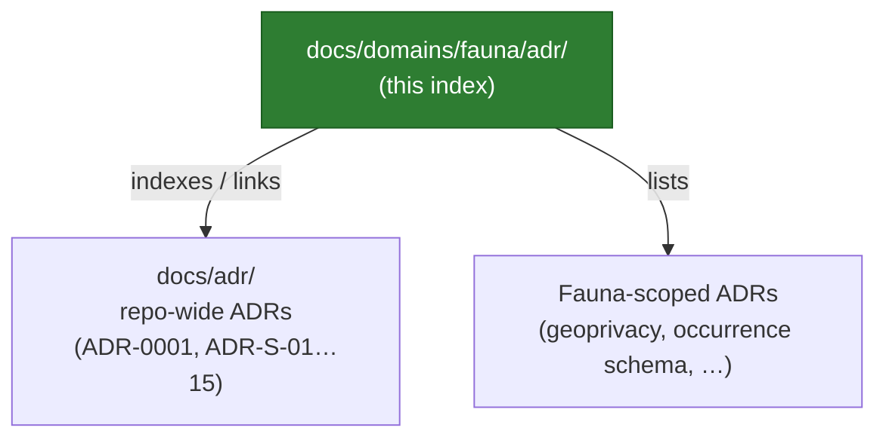

<!-- [KFM_META_BLOCK_V2]
doc_id: kfm://doc/domains/fauna/adr/readme
title: Fauna · Domain ADR Index
type: readme
version: v0.1
status: draft
owners: TBD (domain steward: Fauna); TBD (governance reviewer); TBD (sensitivity reviewer)
created: 2026-05-29
updated: 2026-05-29
policy_label: public
related: [docs/domains/fauna/README.md, docs/adr/README.md, docs/doctrine/directory-rules.md, policy/sensitivity/fauna/, schemas/contracts/v1/domains/fauna/, docs/registers/DRIFT_REGISTER.md, ai-build-operating-contract.md]
tags: [kfm, domain, fauna, adr, governance, sensitivity, geoprivacy]
notes: [CONTRACT_VERSION pinned 3.0.0 # per-domain ADR index; repo-wide ADRs live in docs/adr/ # fauna is a sensitive lane — T4 default for sensitive occurrences # whether per-domain adr/ subfolders are canonical vs all-ADRs-in-docs/adr/ is OPEN → OQ-FAUNA-ADR-01]
[/KFM_META_BLOCK_V2] -->

# 🦫 Fauna · Domain ADR Index

> The index of Architecture Decision Records that govern the **Fauna** lane — taxonomy, occurrence evidence, conservation/legal status, and the geoprivacy and sensitive-occurrence controls that make this one of KFM's strongest default-deny domains.

-red)

**Status:** `draft` · **Owners:** TBD (Fauna steward, governance reviewer, sensitivity reviewer) · **Updated:** 2026-05-29 · `CONTRACT_VERSION = "3.0.0"`

> [!CAUTION]
> **Fauna is a sensitive lane.** Exact sensitive occurrences and nests / dens / roosts / hibernacula / spawning areas are **denied by default** and released only with a geoprivacy transform, a `Redaction Receipt`, and a public-safe derivative. ADRs in this lane MUST NOT weaken that default. Any ADR that would expose precise sensitive geometry requires steward + rights-holder review and is, absent that, a `DENY`. [DOM-FAUNA] [ENCY §20.5]

---

## Quick jump

- [1. What this index is](#1-what-this-index-is)
- [2. Repo fit](#2-repo-fit)
- [3. Per-domain vs repo-wide ADRs](#3-per-domain-vs-repo-wide-adrs)
- [4. ADR lifecycle and statuses](#4-adr-lifecycle-and-statuses)
- [5. Fauna ADR register](#5-fauna-adr-register)
- [6. Repo-wide ADRs that bind this lane](#6-repo-wide-adrs-that-bind-this-lane)
- [7. When a Fauna change needs an ADR](#7-when-a-fauna-change-needs-an-adr)
- [8. How to add a Fauna ADR](#8-how-to-add-a-fauna-adr)
- [Open questions register](#open-questions-register)
- [Open verification backlog](#open-verification-backlog)
- [Changelog](#changelog-v0--v01)
- [Definition of done](#definition-of-done)
- [Related docs](#related-docs)

---

## 1. What this index is

This folder (`docs/domains/fauna/adr/`) is the **human-facing index of Architecture Decision Records scoped to the Fauna lane**. It lists the decisions that govern fauna's object families, source-role discipline, geoprivacy transforms, and public-safe release — with each ADR's status and a one-line summary.

It is an **index**, not the decisions themselves: each row points to an ADR file. An ADR is the durable record of *why* a structural choice was made; this README makes those choices discoverable for the lane.

> [!NOTE]
> Per Directory Rules §2.4, a decision is **ADR-class** when it changes a path/schema/policy/release home, introduces or evolves a controlled vocabulary, or alters a governance boundary. Routine content edits are not ADR-class. [DIRRULES §2.4]

[↑ Back to top](#top)

---

## 2. Repo fit

| Aspect | Value | Status |
|---|---|---|
| This file | `docs/domains/fauna/adr/README.md` | PROPOSED — see OQ-FAUNA-ADR-01 |
| Owning root | `docs/` (human-facing control plane) | CONFIRMED (`directory-rules.md` §6.1) |
| Domain segment | `fauna/` lane inside `docs/domains/` | CONFIRMED (`directory-rules.md` §12) |
| Repo-wide ADR home | `docs/adr/` | CONFIRMED home; per-domain `adr/` subfolder is PROPOSED convention |
| Fauna sensitivity policy | `policy/sensitivity/fauna/` | CONFIRMED lane (Atlas §24.13); presence NEEDS VERIFICATION |
| Fauna schemas | `schemas/contracts/v1/domains/fauna/` | PROPOSED (slug-drift caveat: Atlas §24.13 uses `…/v1/fauna/`) |

> [!IMPORTANT]
> **Per-domain ADR folders are an unsettled convention (OQ-FAUNA-ADR-01).** The repo-wide ADR home is `docs/adr/`. Whether each domain additionally keeps a `docs/domains/<domain>/adr/` index — or whether all ADRs live centrally in `docs/adr/` and domains only *link* to the relevant ones — is an open Directory-Rules question. This file assumes a per-domain **index** (pointers, not parallel ADR storage) to avoid creating a second authority home. Treat the path as PROPOSED until an ADR settles it.

[↑ Back to top](#top)

---

## 3. Per-domain vs repo-wide ADRs

- **Repo-wide ADRs** (`docs/adr/`) decide cross-cutting questions that bind every lane — schema home, source-role vocabulary, sensitivity tier scheme. Fauna inherits these; it does not re-decide them. See [§6](#6-repo-wide-adrs-that-bind-this-lane).
- **Fauna-scoped ADRs** decide questions that are specific to this lane — e.g., the geoprivacy conditional-schema rule, the sensitive-occurrence precision-degradation policy, the rare-species access gate. See [§5](#5-fauna-adr-register).

> [!WARNING]
> A Fauna-scoped ADR MUST NOT contradict a repo-wide ADR. If a lane need genuinely conflicts with a cross-cutting decision, that is a repo-wide ADR amendment (in `docs/adr/`), logged in `DRIFT_REGISTER.md` — not a local override here. [DIRRULES]

[↑ Back to top](#top)

---

## 4. ADR lifecycle and statuses

| Status | Meaning |
|---|---|
| `Proposed` | Drafted; under review; not yet binding. |
| `Accepted` | Ratified; binding on the lane. |
| `Superseded` | Replaced by a later ADR; retained for lineage with a forward pointer. |
| `Rejected` | Considered and declined; retained so the question is not silently reopened. |
| `Deprecated` | Still recorded but no longer recommended; migration path noted. |

> [!NOTE]
> ADRs are not deleted. Supersession preserves history per the contract's lifecycle discipline — an `Accepted` ADR that is later replaced becomes `Superseded` with a link to its replacement, never removed. [ENCY] [DIRRULES §17]

[↑ Back to top](#top)

---

## 5. Fauna ADR register

> [!IMPORTANT]
> Every row below is **PROPOSED**: these are the fauna-scoped decisions the doctrine implies are needed, not ADRs confirmed present in a mounted repo. ADR IDs (`ADR-FAUNA-NN`) are placeholder allocations pending the numbering decision in OQ-FAUNA-ADR-02. Each is grounded in a cited idea card or doctrine register.

| ADR (PROPOSED) | Decision needed | Why it's ADR-class | Status | Basis |
|---|---|---|---|---|
| `ADR-FAUNA-01` | **Occurrence geoprivacy conditional schema** — a fauna occurrence schema requires `public_safe_geometry` when `geoprivacy_status` is obscured, private, or generalized. | Schema shape + sensitivity boundary. | PROPOSED | [KFM-P25-PROG-0017] |
| `ADR-FAUNA-02` | **Sensitive-occurrence precision degradation** — sensitive fauna records require policy-controlled precision degradation, generalized geometry, or abstention before public exposure. | Policy-as-code + release boundary. | PROPOSED | [KFM-P25-IDEA-0006] |
| `ADR-FAUNA-03` | **Rare-species data access gate** — NatureServe / Natural Heritage rare-species data requires access controls, redaction, license checks, and public-safe-derivative rules. | Rights + sensitivity gate. | PROPOSED | [KFM-P25-PROG-0023] |
| `ADR-FAUNA-04` | **Deny-by-default sensitive geometry** — exact sensitive occurrences and nests/dens/roosts/hibernacula/spawning are denied unless geoprivacy + `Redaction Receipt` + public-safe derivative are present. | Trust-membrane / default-deny boundary. | PROPOSED | [DOM-FAUNA] [ENCY §20.5] |
| `ADR-FAUNA-05` | **Taxon-crosswalk authority** — how `Taxon` / `Taxon Crosswalk` reconcile across GBIF / eBird / iNaturalist / ITIS without source-role collapse. | Controlled-vocabulary + identity. | PROPOSED | [DOM-FAUNA] |
| `ADR-FAUNA-06` | **Schema/contract slug** — `schemas/contracts/v1/fauna/` (Atlas §24.13) vs `…/v1/domains/fauna/` (Directory Rules §12). | Path/schema home. | PROPOSED — CONFLICTED | [DIRRULES §12] [ENCY §24.13] |

> [!CAUTION]
> `ADR-FAUNA-04` encodes the lane's hardest rule and MUST remain at least as strict as the repo-wide deny-by-default register. The fauna row of that register denies *exact sensitive occurrences, nests/dens/roosts/hibernacula/spawning* and allows release *only* with **geoprivacy + Redaction Receipt + public-safe derivative**. [DOM-FAUNA] [ENCY §20.5]

[↑ Back to top](#top)

---

## 6. Repo-wide ADRs that bind this lane

These are decided in `docs/adr/` (or the Atlas §24.12 / §49 open-ADR backlog), not here. Fauna inherits them.

| ADR | Topic | Status | Relevance to Fauna |
|---|---|---|---|
| `ADR-0001` | Schema home (`schemas/contracts/v1/...` canonical) | Accepted | Governs where fauna schemas live (and the §5 `ADR-FAUNA-06` slug question). |
| `ADR-S-04` | Source-role enum vocabulary | Open (backlog) | Fauna source roles (KDWP, USFWS ECOS, NatureServe, GBIF/eBird) depend on it. |
| `ADR-S-05` | Sensitivity tier scheme (T0–T4) | Open (backlog) | Fauna defaults to T4 for sensitive occurrences; this ADR canonicalizes the scheme. |
| `ADR-S-11` / `ADR-S-14` | Cross-lane join policy (most-restrictive-applicable) | Open (backlog) | Fauna × habitat / hydrology / people joins must fail closed on sensitive geometry. |
| `ADR-S-12` | Two-person rule for T3/T4 promotion | Open (backlog) | Sensitive fauna release would fall under it. |

> [!NOTE]
> Backlog ADR IDs (`ADR-S-*`) come from the Atlas §24.12 Master Open-ADR Backlog and the unified-doctrine ADR backlog; numbering and final status are themselves NEEDS VERIFICATION against `docs/adr/`. [ENCY §24.12] [DIRRULES §18.c]

[↑ Back to top](#top)

---

## 7. When a Fauna change needs an ADR

A Fauna change is **ADR-class** (per Directory Rules §2.4) when it:

- changes where fauna schemas, contracts, policy, or release artifacts live;
- introduces or evolves a controlled vocabulary (source roles, conservation-status codes, geoprivacy statuses);
- changes a **sensitivity boundary** — any rule about what fauna geometry or occurrence detail may be exposed publicly;
- alters the deny-by-default posture, the geoprivacy-transform requirement, or the `Redaction Receipt` requirement;
- changes how fauna cross-lane joins fail closed.

It is **not** ADR-class for routine doc edits, fixture additions, or non-structural validator tweaks.

> [!CAUTION]
> **Sensitivity-boundary changes are always ADR-class and always require sensitivity-reviewer sign-off.** Loosening any fauna exposure rule without an accepted ADR and a steward + rights-holder review is a governance violation, not a shortcut. [DOM-FAUNA] [ENCY §20.5]

[↑ Back to top](#top)

---

## 8. How to add a Fauna ADR

1. **Confirm it's ADR-class** against [§7](#7-when-a-fauna-change-needs-an-adr) and Directory Rules §2.4.
2. **Check it doesn't belong repo-wide.** If the decision binds other lanes, it goes in `docs/adr/`, not here ([§3](#3-per-domain-vs-repo-wide-adrs)).
3. **Allocate an ID** per the numbering decision (OQ-FAUNA-ADR-02) — placeholder form `ADR-FAUNA-NN`.
4. **Author the ADR** using the repo ADR template (context, decision, status, consequences, alternatives).
5. **For any sensitivity-boundary ADR**, attach the sensitivity-reviewer and rights-holder review record.
6. **Add a row to [§5](#5-fauna-adr-register)** with status `Proposed`.
7. **On acceptance**, set status `Accepted`; on replacement, set the old one `Superseded` with a forward link.
8. **Log conflicts** with repo-wide ADRs in `docs/registers/DRIFT_REGISTER.md`.

[↑ Back to top](#top)

---

## Open questions register

| ID | Question | Owner role | Resolution path |
|---|---|---|---|
| OQ-FAUNA-ADR-01 | Are per-domain `docs/domains/<domain>/adr/` indexes canonical, or do all ADRs live in `docs/adr/` with domains only linking? | Directory Rules owner + docs steward | ADR / Directory Rules §6.1 check |
| OQ-FAUNA-ADR-02 | ADR numbering for per-domain ADRs (`ADR-FAUNA-NN` vs central `ADR-NNNN` vs `ADR-S-*`). | Governance steward | ADR |
| OQ-FAUNA-ADR-03 | Schema/contract slug: `fauna/` (Atlas §24.13) vs `domains/fauna/` (Directory Rules §12). | Schema owner | ADR (`ADR-FAUNA-06`) |
| OQ-FAUNA-ADR-04 | Which fauna-scoped ADRs are already authored/accepted in a mounted repo? | Fauna steward | `docs/adr/` + repo inspection |

## Open verification backlog

These items remain `NEEDS VERIFICATION` before promotion from `draft` to `published`:

1. Canonical per-domain ADR-folder convention (OQ-FAUNA-ADR-01).
2. ADR numbering scheme for fauna (OQ-FAUNA-ADR-02).
3. Schema/contract slug resolution (OQ-FAUNA-ADR-03).
4. Which of the §5 PROPOSED ADRs already exist as accepted ADRs.
5. Presence of `policy/sensitivity/fauna/` and the geoprivacy-transform / Redaction-Receipt enforcement.
6. Steward / governance / sensitivity-reviewer assignment for the meta block.

## Changelog v0 → v0.1

| Change | Type (per contract §37) | Reason |
|---|---|---|
| Initial Fauna ADR index authored | new | First-pass per-domain ADR index. |
| Fauna-scoped ADR register seeded from doctrine | gap closure | Ground geoprivacy/precision/rare-species/deny-default ADRs in cited idea cards and §20.5. |
| Repo-wide binding ADRs cross-referenced | clarification | Distinguish inherited cross-cutting ADRs from lane-scoped ones. |
| Per-domain-ADR-folder convention surfaced (OQ-FAUNA-ADR-01) | reconciliation | Convention not yet settled by Directory Rules. |

> **Backward compatibility.** New file; no anchors to preserve. ADR IDs are placeholders pending OQ-FAUNA-ADR-02.

## Definition of done

This index is done enough to enter the repository when:

- the per-domain ADR-folder convention (OQ-FAUNA-ADR-01) and numbering (OQ-FAUNA-ADR-02) are resolved by ADR;
- a docs steward, the Fauna domain steward, and the sensitivity reviewer review it;
- it is linked from `docs/domains/fauna/README.md` and `docs/adr/README.md`;
- it does not weaken the fauna deny-by-default register or any repo-wide ADR;
- conflicts are logged in `docs/registers/DRIFT_REGISTER.md`;
- the `GENERATED_RECEIPT.json` planned in the PR is wired into CI;
- future changes follow the operating contract's §37 lifecycle.

---

## Related docs

- [`docs/domains/fauna/README.md`](../README.md) — Fauna lane landing page *(NEEDS VERIFICATION)*
- [`docs/adr/README.md`](../../../adr/README.md) — repo-wide ADR index *(NEEDS VERIFICATION)*
- [`ai-build-operating-contract.md`](../../../../ai-build-operating-contract.md) — operating law (`CONTRACT_VERSION = "3.0.0"`)
- [`docs/doctrine/directory-rules.md`](../../../doctrine/directory-rules.md) — placement law, §2.4 ADR triggers *(path PROPOSED — verify)*
- `policy/sensitivity/fauna/` — fauna sensitivity / geoprivacy policy *(PROPOSED)*
- `schemas/contracts/v1/domains/fauna/` — fauna schemas *(PROPOSED; slug CONFLICTED)*

---

**Last updated:** 2026-05-29 · `CONTRACT_VERSION = "3.0.0"` · Status: `draft`

[↑ Back to top](#top)
