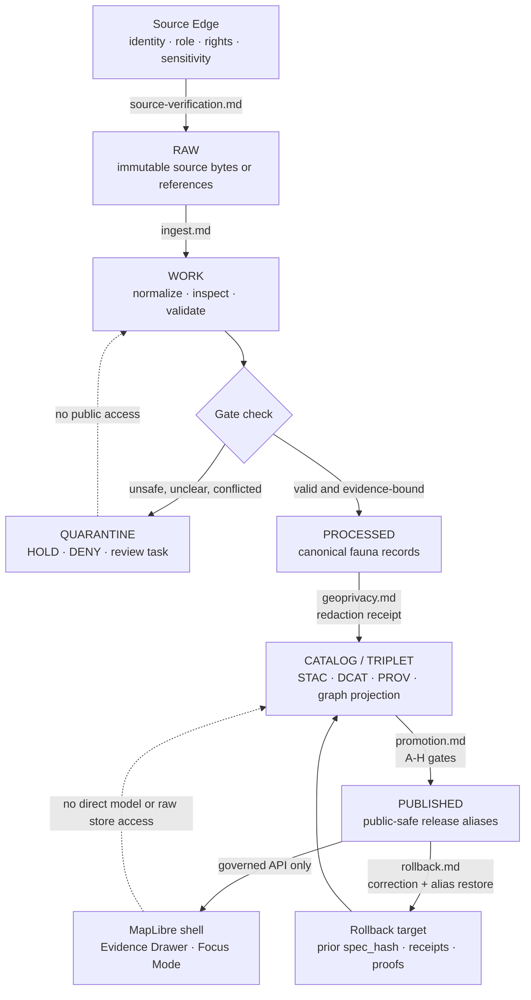

<!-- [KFM_META_BLOCK_V2]
doc_id: kfm://doc/NEEDS-VERIFICATION
title: Fauna Runbooks
type: standard
version: v1
status: draft
owners: <TODO-VERIFY-CODEOWNERS>
created: 2026-04-30
updated: 2026-04-30
policy_label: <TODO-VERIFY-public-or-restricted>
related: [../README.md, ../DATA_LIFECYCLE.md, ../VALIDATION_AND_GATES.md, ../SENSITIVITY_AND_GEOPRIVACY.md, ../SOURCE_ATLAS.md, ../NON_REGRESSION_MATRIX.md, ../RELEASE_LINEAGE.md, ../CHANGELOG.md, ../../../adr/ADR-fauna-schema-home.md, ../../../../data/registry/fauna/, ../../../../policy/fauna/, ../../../../tools/validators/fauna/, ../../../../schemas/contracts/v1/fauna/]
tags: [kfm, fauna, runbooks, wildlife, geoprivacy, validation, promotion, rollback]
notes: [Drafted from attached KFM fauna architecture and pipeline doctrine; no mounted KFM repository was available in this session; verify doc_id, owners, policy_label, neighboring file inventory, and final runbook path convention before merge.]
[/KFM_META_BLOCK_V2] -->

<a id="top"></a>

# Fauna Runbooks

Operator-facing index for fixture-first, public-safe fauna ingestion, validation, promotion, rollback, and source-verification runbooks.

> [!IMPORTANT]
> **Status:** experimental  
> **Document status:** draft  
> **Owners:** `<TODO-VERIFY-CODEOWNERS>`  
> **Path:** `docs/domains/fauna/runbooks/README.md`  
> **Repo fit:** child runbook directory for the Fauna domain; upstream from [`../README.md`](../README.md), [`../DATA_LIFECYCLE.md`](../DATA_LIFECYCLE.md), [`../VALIDATION_AND_GATES.md`](../VALIDATION_AND_GATES.md), and [`../SENSITIVITY_AND_GEOPRIVACY.md`](../SENSITIVITY_AND_GEOPRIVACY.md); downstream into proposed operator runbooks such as [`./ingest.md`](./ingest.md), [`./promotion.md`](./promotion.md), and [`./rollback.md`](./rollback.md).  
> **Quick jumps:** [Scope](#scope) · [Repo fit](#repo-fit) · [Inputs](#accepted-inputs) · [Exclusions](#exclusions) · [Directory tree](#directory-tree) · [Quickstart](#quickstart) · [Usage](#usage) · [Diagram](#diagram) · [Operating tables](#operating-tables) · [Definition of done](#task-list--definition-of-done) · [FAQ](#faq) · [Appendix](#appendix)


> [!NOTE]
> This README is written as a **README-like directory document** and a **standard KFM doc**. It keeps the KFM Meta Block V2, a top impact block, accepted inputs, exclusions, runbook selection rules, and fail-closed gates in one place.

---

## Scope

This directory is the operational runbook surface for the **KFM Fauna lane**.

It is for repeatable procedures that move fauna work through KFM’s governed lifecycle without bypassing evidence, source-role, sensitivity, policy, review, catalog, release, or rollback controls.

### In scope

Use these runbooks for:

- source verification before a connector or source snapshot is admitted;
- synthetic and no-network fauna ingest drills;
- taxon, status, occurrence, monitoring, range, habitat-support, invasive, disease, and mortality workflows;
- sensitivity classification and geoprivacy transforms;
- validation, promotion dry-runs, proof review, release preparation, rollback, and correction;
- Evidence Drawer and Focus Mode smoke checks after evidence is released through governed APIs.

### Current implementation posture

| Claim | Status | Working posture |
| --- | --- | --- |
| This target path was requested for documentation authoring. | CONFIRMED | Author this as `docs/domains/fauna/runbooks/README.md`. |
| The real checked-out repo exists in this session. | UNKNOWN | Do not claim current file inventory, package manager, CI, route names, or runtime behavior. |
| Fauna runbooks are needed. | CONFIRMED doctrine / PROPOSED file realization | Treat this README as the runbook index and merge target after live repo verification. |
| Live source connectors are safe to run. | NEEDS VERIFICATION | Run synthetic/no-network fixtures first. Block live connectors until source rights, sensitivity, stewardship, and repo gates are verified. |

[Back to top](#top)

---

## Repo fit

### Path

`docs/domains/fauna/runbooks/README.md`

### Relationship map

| Relationship | Path | Role | Verification posture |
| --- | --- | --- | --- |
| Parent domain index | [`../README.md`](../README.md) | Domain orientation, scope, object families, and control-plane links. | NEEDS VERIFICATION |
| Data lifecycle | [`../DATA_LIFECYCLE.md`](../DATA_LIFECYCLE.md) | Lifecycle states and admissible transitions for fauna data. | PROPOSED / NEEDS VERIFICATION |
| Validation and gates | [`../VALIDATION_AND_GATES.md`](../VALIDATION_AND_GATES.md) | Gate definitions, validator expectations, and fail-closed behavior. | PROPOSED / NEEDS VERIFICATION |
| Sensitivity and geoprivacy | [`../SENSITIVITY_AND_GEOPRIVACY.md`](../SENSITIVITY_AND_GEOPRIVACY.md) | Sensitive species, exact-location controls, and public geometry rules. | PROPOSED / NEEDS VERIFICATION |
| Source atlas | [`../SOURCE_ATLAS.md`](../SOURCE_ATLAS.md) | Source roles, source authority limits, rights, and activation backlog. | PROPOSED / NEEDS VERIFICATION |
| Release lineage | [`../RELEASE_LINEAGE.md`](../RELEASE_LINEAGE.md) | Prior release, alias, rollback, and correction lineage. | PROPOSED / NEEDS VERIFICATION |
| Schema-home ADR | [`../../../adr/ADR-fauna-schema-home.md`](../../../adr/ADR-fauna-schema-home.md) | Resolves `contracts/fauna` versus `schemas/contracts/v1/fauna`. | PROPOSED / CONFLICT |
| Registry files | `../../../../data/registry/fauna/` | Source, taxon authority, sensitivity policy, domain partition, backlog, and layer alias registries. | PROPOSED / NEEDS VERIFICATION |
| Validators | `../../../../tools/validators/fauna/` | Machine checks that produce PASS/HOLD/DENY/ERROR reports. | PROPOSED / NEEDS VERIFICATION |
| Policy | `../../../../policy/fauna/` | Publication, source-role, geoprivacy, AI, and continuity policies. | PROPOSED / NEEDS VERIFICATION |
| Contracts | `../../../../schemas/contracts/v1/fauna/` | Machine-readable fauna schemas after ADR resolution. | PROPOSED / CONFLICT |

> [!CAUTION]
> Prior fauna planning material proposed root-level runbooks such as `docs/runbooks/fauna-ingest.md`, `docs/runbooks/fauna-promotion.md`, and `docs/runbooks/fauna-rollback.md`. This file uses the user-specified domain-local path. During merge, either keep the local runbook home or add root-level compatibility links after the repo convention is verified.

[Back to top](#top)

---

## Accepted inputs

Only bring inputs into these runbooks when their role and lifecycle state are explicit.

| Input | Belongs here when | Required guardrail |
| --- | --- | --- |
| Source descriptor draft | A source identity, role, rights posture, access class, cadence, geography, and sensitivity posture must be reviewed. | Unknown rights or unknown source role blocks publication. |
| Synthetic fixture | It is public-safe, no-network, intentionally tiny, and used to prove the lane. | Must be labeled fixture-only and must not be confused with production evidence. |
| Source terms and steward notes | They clarify whether a source can be fetched, transformed, displayed, or cited. | Do not put secrets, restricted URLs, or controlled-access payloads in docs. |
| Taxon authority mapping | It supports deterministic taxon resolution, synonym handling, or ambiguity classification. | Ambiguous or unresolved taxonomy returns HOLD or ABSTAIN, not a silent merge. |
| Occurrence candidate | It is headed into RAW, WORK, QUARANTINE, or PROCESSED and is never public by default. | Sensitive exact geometry must remain restricted unless policy says otherwise. |
| Sensitivity policy | It defines public geometry behavior, embargo, steward review, or quarantine conditions. | Public exact geometry requires affirmative rights and policy support. |
| Redaction receipt | It explains before/after hashes, transform class, policy version, and reason. | Required for public generalized or redacted occurrence outputs. |
| Release bundle candidate | It is ready for dry-run gate review. | Must include evidence closure, catalog closure, policy posture, continuity status, and rollback target. |
| Rollback target | It identifies prior `spec_hash`, alias, catalog, proof, and public-safe state. | Rollback preserves evidence and emits a rollback receipt; it is not deletion. |

[Back to top](#top)

---

## Exclusions

These runbooks must not become a shortcut around KFM’s trust membrane.

| Do not place here | Goes instead | Why |
| --- | --- | --- |
| RAW source bytes, credentialed source payloads, or restricted source URLs | `data/raw/fauna/`, restricted source storage, or source registry with redacted access notes | Runbooks are operational docs, not raw evidence stores. |
| Precise protected species locations, nests, dens, roosts, hibernacula, spawning points, or steward-controlled records | Restricted occurrence stores and sensitivity policy workflows | Public docs must not leak sensitive location intelligence. |
| API keys, tokens, cookies, auth headers, or private account details | Secrets manager / deployment config, never Markdown | Prevent accidental exfiltration through docs. |
| Live connector activation commands without source verification | Source-verification runbook plus source descriptor review | Unknown rights or terms block connector activation. |
| Occurrence aggregator rows treated as legal-status authority | Source atlas and status-source review | Aggregators can support occurrence evidence; they are not legal-status authorities by default. |
| Raw model output or private chain-of-thought | Governed API receipts and validated response envelopes | AI is interpretive; EvidenceBundle and policy outrank generated text. |
| Emergency, field-safety, or life-safety instructions | Official agencies and emergency systems | KFM fauna runbooks are evidence and publication operations, not emergency response guidance. |

[Back to top](#top)

---

## Directory tree

PROPOSED until the actual repository is mounted and path conventions are verified.

```text
docs/domains/fauna/runbooks/
├── README.md
├── source-verification.md
├── ingest.md
├── geoprivacy.md
├── promotion.md
├── rollback.md
├── backfill.md
├── api-ui-smoke.md
└── ai-focus-mode.md
```

Compatibility targets to review during merge:

```text
docs/runbooks/fauna-ingest.md
docs/runbooks/fauna-promotion.md
docs/runbooks/fauna-rollback.md
```

[Back to top](#top)

---

## Quickstart

Use this sequence before running or editing any fauna runbook.

### 1. Re-establish repo evidence

```bash
git status --short
git branch --show-current
git rev-parse --show-toplevel

find docs/domains/fauna -maxdepth 3 -type f 2>/dev/null | sort
find docs/runbooks -maxdepth 2 -type f 2>/dev/null | grep -E 'fauna|habitat' || true
find schemas contracts policy data tools tests .github -maxdepth 5 -type f 2>/dev/null | grep -E 'fauna|habitat_fauna|EvidenceBundle|DecisionEnvelope|ReleaseManifest' || true
```

Record the result in the PR notes. If the repo evidence conflicts with this README, update the README and the relevant ADR before adding operational commands.

### 2. Choose the smallest safe runbook

| Task | Start with |
| --- | --- |
| New source, source refresh, or source authority review | `source-verification.md` |
| Fixture-first or snapshot ingest | `ingest.md` |
| Sensitive-location transform | `geoprivacy.md` |
| Release or public layer candidate | `promotion.md` |
| Bad release, stale output, leakage, or alias correction | `rollback.md` |
| Historical or bulk processing | `backfill.md` |
| Evidence Drawer, layer, or API check | `api-ui-smoke.md` |
| Focus Mode or bounded AI behavior check | `ai-focus-mode.md` |

### 3. Run synthetic/no-network checks first

```bash
# PROPOSED until repo tooling is verified.
# Do not run live source connectors from this directory.

python tools/validators/fauna/run_all.py \
  --mode dry-run \
  --fixture tests/fixtures/fauna/synthetic_public_safe
```

Expected outcome: `PASS` or `HOLD` with explicit obligations. `DENY` blocks publication. `ERROR` blocks until the infrastructure failure is resolved.

### 4. Treat live connectors as blocked until verified

A live connector remains blocked until the source descriptor has confirmed:

- source role and authority scope;
- rights and public release class;
- steward or reviewer obligations;
- sensitivity and geoprivacy behavior;
- evidence, catalog, proof, receipt, and rollback targets;
- no public exact sensitive geometry.

[Back to top](#top)

---

## Usage

Runbooks in this directory should all use the same operator rhythm.

1. **Declare scope.** Identify source, taxon, geography, time window, artifact, release class, and intended public surface.
2. **Resolve evidence.** Ensure every consequential statement can resolve from `EvidenceRef` to `EvidenceBundle`.
3. **Apply policy.** Check source role, rights, sensitivity, geoprivacy, publication class, continuity, and rollback obligations.
4. **Run validators.** Prefer no-network fixtures before source activation or public release work.
5. **Emit receipts.** Store process memory separately from release proofs.
6. **Decide outcome.** Use `PASS`, `HOLD`, `DENY`, or `ERROR`; never hide a failed gate behind prose.
7. **Update control docs.** Update lifecycle, validation, source atlas, release lineage, changelog, and non-regression matrix when behavior changes.

> [!IMPORTANT]
> Public clients and ordinary UI surfaces use governed APIs and released artifacts. They do not read RAW, WORK, QUARANTINE, restricted stores, source registries, raw source APIs, vector indexes, graph projections, or model runtimes directly.

[Back to top](#top)

---

## Diagram



[Back to top](#top)

---

## Operating tables

### Runbook registry

| Runbook | Status | Primary question | Allowed operations | Fail-closed trigger |
| --- | --- | --- | --- | --- |
| `source-verification.md` | PROPOSED | Can this source be admitted, and for what role? | Review source role, rights, access, cadence, authority scope, sensitivity, and steward obligations. | Unknown rights, unknown source role, missing steward review, or unsupported public release class. |
| `ingest.md` | PROPOSED | Can this fixture or verified source snapshot move from RAW to WORK/PROCESSED? | Snapshot, normalize, validate, receipt, and quarantine. | Live connector used before source verification; missing source hash; invalid CRS or temporal fields. |
| `geoprivacy.md` | PROPOSED | Can a record produce public-safe geometry? | Classify sensitivity, transform geometry, emit redaction receipt, validate public payload. | Restricted geometry, ignored geoprivacy flag, missing receipt, or reverse-engineering risk. |
| `promotion.md` | PROPOSED | Can a public-safe release candidate move toward review or publication? | Run A-H gates, validate evidence/catalog/policy/continuity/rollback. | Missing EvidenceBundle, unknown rights, policy denial, catalog break, or no rollback target. |
| `rollback.md` | PROPOSED | Can KFM restore a prior public-safe state without deleting history? | Verify prior release, repoint aliases, rebuild catalogs, emit CorrectionNotice and rollback receipt. | Prior proof cannot validate; rollback leaks restricted details; continuity regression remains unmapped. |
| `backfill.md` | PROPOSED | Can historical or bulk source material be processed safely? | Chunk, snapshot, hash, normalize, classify, and dry-run release bundles. | Mixed event/ingest dates, ambiguous taxonomy, unknown rights, unbounded runtime, or destructive churn. |
| `api-ui-smoke.md` | PROPOSED | Do governed API, layer manifest, and Evidence Drawer payloads remain public-safe? | Contract smoke tests and field allowlist checks. | API returns restricted geometry, raw source fields, or `ANSWER` for unknown rights. |
| `ai-focus-mode.md` | PROPOSED | Can Focus Mode answer from released evidence only? | Validate prompt scope, response envelope, citations, and ABSTAIN/DENY rendering. | Uncited species claim, restricted coordinates in prompt/output, direct model-public traffic. |

### Promotion gate summary

| Gate | Requirement | Failure outcome |
| --- | --- | --- |
| A · ownership_present | Owners, stewards, and reviewers present for release class. | HOLD or DENY |
| B · schema_valid | All artifacts validate against current schemas. | DENY |
| C · evidence_complete | EvidenceRefs resolve to EvidenceBundles; rights and sensitivity summaries present. | DENY or HOLD |
| D · catalog_linkage_closed | STAC/DCAT/PROV/catalog matrix links close. | DENY |
| E · signatures_or_digest_verified | Digests, signatures, or proofs verify according to repo policy. | DENY |
| F · policy_compliant | Publication, geoprivacy, source-role, AI, and continuity policies pass. | DENY |
| G · diff_clean | Diff is expected and no destructive unmapped churn remains. | HOLD or DENY |
| H · continuity_preserved_or_mapped | Prior fauna gains are preserved, migrated, or deprecated with mapping, tests, docs, and rollback. | HOLD or DENY |

### Outcome grammar

| Outcome | Meaning | Operator action |
| --- | --- | --- |
| PASS | Candidate can proceed to the next governed step. | Record receipts and continue. |
| HOLD | Required obligations remain. | Add review tasks; do not publish. |
| DENY | Policy or evidence blocks the action. | Stop; preserve decision evidence. |
| ERROR | Infrastructure or tooling failed. | Repair tooling; re-run without upgrading uncertainty. |

[Back to top](#top)

---

## Task list · definition of done

Every fauna runbook in this directory is done only when it meets these review gates:

- [ ] Includes KFM Meta Block V2 or a documented exception.
- [ ] States status, owners, path, repo fit, quick jumps, accepted inputs, and exclusions.
- [ ] Separates CONFIRMED, INFERRED, PROPOSED, UNKNOWN, and NEEDS VERIFICATION claims.
- [ ] Names lifecycle stage transitions and forbidden transitions.
- [ ] Identifies source-role, rights, sensitivity, stewardship, and review prerequisites.
- [ ] Uses fixture-first or no-network commands before live source activation.
- [ ] Emits or points to required receipts, proofs, EvidenceBundles, release bundles, and rollback targets.
- [ ] Includes public-safety checks for sensitive exact geometry.
- [ ] Uses PASS/HOLD/DENY/ERROR outcomes.
- [ ] Includes rollback or correction instructions for any public-facing change.
- [ ] Updates `../CHANGELOG.md`, `../NON_REGRESSION_MATRIX.md`, and `../RELEASE_LINEAGE.md` when behavior, names, aliases, gates, or artifacts change.
- [ ] Keeps AI behind governed API and cites or abstains.
- [ ] Contains no secrets, restricted locations, raw source payloads, or direct public paths into RAW/WORK/QUARANTINE.

[Back to top](#top)

---

## FAQ

### Can a runbook publish a live occurrence layer?

No. A runbook may prepare and validate a release candidate. Publication requires evidence closure, rights and sensitivity clearance, policy compliance, catalog/proof closure, continuity mapping, and rollback readiness.

### Can public fauna outputs include exact locations?

Only when the record is explicitly non-sensitive, rights allow public exact geometry, and source/steward policy allows it. Sensitive precise coordinates, protected species locations, nests, dens, roosts, hibernacula, spawning sites, and embargoed monitoring records fail closed.

### Can GBIF, eBird, iNaturalist, or other occurrence aggregators be used as legal-status authorities?

No by default. Occurrence aggregators can contribute occurrence evidence after rights and sensitivity review. Legal or conservation status claims require an appropriate legal/status authority source role.

### Can Focus Mode summarize fauna evidence?

Yes, but only through governed API, released public-safe EvidenceBundles, structured response envelopes, and citation validation. If evidence is insufficient, return `ABSTAIN`; if policy forbids the answer, return `DENY`.

### What happens when taxonomy is ambiguous?

The workflow returns `HOLD` or `ABSTAIN`. It must not silently merge taxa, churn deterministic taxon IDs, or publish claims that depend on unresolved taxonomy.

[Back to top](#top)

---

## Appendix

<details>
<summary>Runbook starter template</summary>

Use this starter shape for new files in this directory.

```markdown
<!-- [KFM_META_BLOCK_V2]
doc_id: kfm://doc/NEEDS-VERIFICATION
title: <Runbook Title>
type: standard
version: v1
status: draft
owners: <TODO-VERIFY-CODEOWNERS>
created: YYYY-MM-DD
updated: YYYY-MM-DD
policy_label: <TODO-VERIFY-public-or-restricted>
related: [./README.md, ../DATA_LIFECYCLE.md, ../VALIDATION_AND_GATES.md, ../SENSITIVITY_AND_GEOPRIVACY.md]
tags: [kfm, fauna, runbook]
notes: [Verify owner, policy label, exact path, and adjacent runbook links before merge.]
[/KFM_META_BLOCK_V2] -->

<a id="top"></a>

# <Runbook Title>

One-line purpose.

> [!IMPORTANT]
> **Status:** experimental  
> **Owners:** `<TODO-VERIFY-CODEOWNERS>`  
> **Path:** `docs/domains/fauna/runbooks/<file>.md`  
> **Quick jumps:** [Scope](#scope) · [Inputs](#accepted-inputs) · [Exclusions](#exclusions) · [Procedure](#procedure) · [Validation](#validation) · [Rollback](#rollback)

## Scope

## Accepted inputs

## Exclusions

## Preconditions

## Procedure

## Validation

## Outcomes

## Rollback

## Open verification items
```

</details>

<details>
<summary>Pre-publish checklist for this README</summary>

- [ ] Verify `docs/domains/fauna/runbooks/` exists in the target repo.
- [ ] Verify whether local runbooks or `docs/runbooks/fauna-*.md` are canonical.
- [ ] Verify CODEOWNERS for this exact path.
- [ ] Replace `doc_id` placeholder with a governed document ID.
- [ ] Confirm `policy_label`.
- [ ] Confirm sibling docs and relative links.
- [ ] Confirm validator command names, package manager, CI workflow, and report paths.
- [ ] Confirm schema home by ADR before linking release-critical commands to schemas.
- [ ] Run docs lint / link check once repo tooling is available.

</details>

[Back to top](#top)
