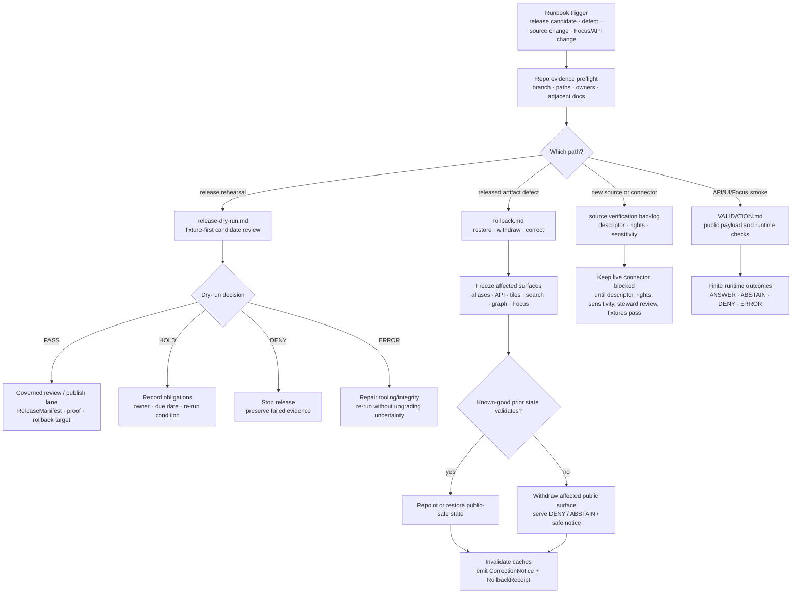

<!-- [KFM_META_BLOCK_V2]
doc_id: kfm://doc/NEEDS-VERIFICATION
title: Fauna Runbooks
type: standard
version: v1
status: draft
owners: ["@bartytime4life"]
created: 2026-04-30
updated: 2026-05-07
policy_label: TODO-VERIFY(public|restricted)
related: [./release-dry-run.md, ./rollback.md, ../README.md, ../CONTROL_PLANE.md, ../SOURCE_ROLES.md, ../GEOPRIVACY.md, ../VALIDATION.md, ../MIGRATION_AND_CONTINUITY.md, ../../../../data/registry/fauna/README.md, ../../../adr/ADR-0009-sensitive-location-policy.md, ../../../../.github/CODEOWNERS]
tags: [kfm, fauna, runbooks, wildlife, geoprivacy, validation, release-dry-run, rollback]
notes: [Revised against current GitHub repository evidence on main; doc_id, created date, policy_label, and domain-steward ownership remain NEEDS VERIFICATION; @bartytime4life is the confirmed CODEOWNERS fallback, not final publication approval.]
[/KFM_META_BLOCK_V2] -->

<a id="top"></a>

# Fauna Runbooks

Operator-facing index for fixture-first, public-safe fauna release rehearsal, rollback, correction, geoprivacy, evidence, and source-role runbooks.

<p>
  
  
  
  
  
  
</p>

> [!IMPORTANT]
> **Impact block**
>
> | Field | Value |
> |---|---|
> | Target path | `docs/domains/fauna/runbooks/README.md` |
> | Status | `draft` directory README; executable command maturity remains `NEEDS VERIFICATION` unless the active branch proves otherwise |
> | Owners | `@bartytime4life` as CODEOWNERS fallback; fauna-domain steward remains `NEEDS VERIFICATION` |
> | Current confirmed runbooks | [`release-dry-run.md`](./release-dry-run.md), [`rollback.md`](./rollback.md) |
> | Normal public path | Released artifacts → governed API → MapLibre / Evidence Drawer / Focus Mode |
> | Forbidden public path | RAW, WORK, QUARANTINE, restricted geometry, direct source APIs, direct model runtime, unpublished candidates, unreviewed derivatives |
> | Dry-run outcomes | `PASS`, `HOLD`, `DENY`, `ERROR` |
> | Runtime answer outcomes | `ANSWER`, `ABSTAIN`, `DENY`, `ERROR` |
> | Quick jumps | [Scope](#scope) · [Repo fit](#repo-fit) · [Accepted inputs](#accepted-inputs) · [Exclusions](#exclusions) · [Directory tree](#directory-tree) · [Quickstart](#quickstart) · [Usage](#usage) · [Diagram](#diagram) · [Operating tables](#operating-tables) · [Definition of done](#definition-of-done) · [FAQ](#faq) · [Appendix](#appendix) |

> [!CAUTION]
> This directory is a runbook control surface, not a publication system. A runbook may rehearse, validate, withdraw, restore, or correct a fauna release candidate. It must not silently publish, repoint public aliases, expose restricted geometry, activate live connectors, or treat AI output as evidence.

---

## Scope

This directory indexes operator-facing runbooks for the **KFM fauna lane**. It exists to keep publication-adjacent work boring, reviewable, fixture-first, and reversible.

Use these runbooks when a fauna change affects public-safe release rehearsal, rollback, correction, source-role validation, sensitive-location controls, EvidenceBundle closure, catalog/proof linkage, governed API payloads, Evidence Drawer payloads, or Focus Mode behavior.

### Current runbook posture

| Surface | Status | Use |
|---|---:|---|
| [`README.md`](./README.md) | CONFIRMED target | Directory index, operator rhythm, runbook selection, and common guardrails. |
| [`release-dry-run.md`](./release-dry-run.md) | CONFIRMED | Rehearses a fauna release without publishing, alias repointing, or live-source activation. |
| [`rollback.md`](./rollback.md) | CONFIRMED | Withdraws, restores, or corrects released fauna artifacts while preserving receipts, proofs, and correction lineage. |
| Source verification runbook | PROPOSED backlog | Should be added only after source-descriptor, rights, sensitivity, and steward-review conventions are verified. |
| Ingest/source-activation runbook | PROPOSED backlog | Should remain fixture-first and must not run live connectors before source verification. |
| API/UI/Focus smoke runbooks | PROPOSED backlog | Should be added only after governed API, Evidence Drawer, layer registry, and Focus Mode paths are verified. |

### In scope

- release dry-run rehearsal for synthetic or already approved public-safe candidates;
- rollback and correction of public-safe fauna artifacts;
- source-role, rights, sensitivity, geoprivacy, and evidence-closure checks before promotion;
- public payload review for API, layer, search, graph, export, Evidence Drawer, and Focus Mode surfaces;
- finite decision outcomes and review obligations;
- rollback target, CorrectionNotice, and RollbackReceipt expectations.

### Out of scope

- live source connector activation;
- emergency or life-safety guidance;
- raw source storage;
- exact sensitive wildlife locations;
- source credentials, tokens, private URLs, or restricted source payloads;
- machine schema authorship;
- policy-as-code implementation;
- direct model runtime output;
- public publication without release gates.

[Back to top](#top)

---

## Repo fit

`docs/domains/fauna/runbooks/README.md` is a **domain-local runbook directory README** under the human-facing documentation control plane.

```text
docs/domains/fauna/
├── README.md
├── CONTROL_PLANE.md
├── SOURCE_ROLES.md
├── GEOPRIVACY.md
├── VALIDATION.md
├── MIGRATION_AND_CONTINUITY.md
└── runbooks/
    ├── README.md
    ├── release-dry-run.md
    └── rollback.md
```

### Relationship map

| Relationship | Path | Status | Role |
|---|---|---:|---|
| Domain landing page | [`../README.md`](../README.md) | CONFIRMED | Fauna scope, lifecycle, object families, public-safety posture, and review gates. |
| Control plane | [`../CONTROL_PLANE.md`](../CONTROL_PLANE.md) | CONFIRMED | Ownership, activation posture, risk register, review rhythm, release readiness, and rollback triggers. |
| Source roles | [`../SOURCE_ROLES.md`](../SOURCE_ROLES.md) | CONFIRMED | Canonical source-role taxonomy and claim-role compatibility. |
| Geoprivacy | [`../GEOPRIVACY.md`](../GEOPRIVACY.md) | CONFIRMED | Public geometry classes, redaction receipts, exact-location denial, and leak prevention. |
| Validation | [`../VALIDATION.md`](../VALIDATION.md) | CONFIRMED | Gate matrix, fixture matrix, PR evidence, release dry-run, rollback checks, and command placeholders. |
| Migration and continuity | [`../MIGRATION_AND_CONTINUITY.md`](../MIGRATION_AND_CONTINUITY.md) | NEEDS VERIFICATION | Prior-gain preservation, supersession mapping, non-regression, and rollback alignment. |
| Release dry-run | [`./release-dry-run.md`](./release-dry-run.md) | CONFIRMED | Non-publishing release rehearsal and decision record. |
| Rollback | [`./rollback.md`](./rollback.md) | CONFIRMED | Restore, withdraw, correct, invalidate caches, and preserve rollback evidence. |
| Fauna registry | [`../../../../data/registry/fauna/README.md`](../../../../data/registry/fauna/README.md) | CONFIRMED | Source descriptors, taxon authorities, sensitivity policies, source-admission posture, and verification backlog. |
| Sensitive-location ADR | `../../../adr/ADR-0009-sensitive-location-policy.md` | NEEDS VERIFICATION | Cross-domain default-deny sensitive-location policy. |
| CODEOWNERS | [`../../../../.github/CODEOWNERS`](../../../../.github/CODEOWNERS) | CONFIRMED | GitHub-native review routing; not publication approval or policy override. |

### Responsibility-root basis

| Concern | Correct responsibility root | Runbook README rule |
|---|---|---|
| Human-facing operator guidance | `docs/domains/fauna/runbooks/` | Explain procedure, guardrails, outcomes, and references. |
| Source descriptors and registry records | `data/registry/fauna/` | Link and validate; do not duplicate registry truth in prose. |
| Machine schemas | `schemas/` or accepted schema home | Reference after ADR verification; do not invent schema authority here. |
| Policy-as-code | `policy/` or repo-confirmed policy home | Explain policy obligations; executable policy lives elsewhere. |
| Validator code | `tools/validators/` or repo-confirmed validator home | Commands here remain proposed until entrypoints are verified. |
| Receipts and proofs | `data/receipts/`, `data/proofs/`, `release/` | Link generated evidence; do not paste generated proof packs into the README. |
| Public-safe artifacts | `data/published/` or release-approved artifact home | Publication is a governed state transition, not a runbook side effect. |

[Back to top](#top)

---

## Accepted inputs

Bring only reviewable, public-safe, operator-relevant material into this directory.

| Input | Accepted when | Required guardrail |
|---|---|---|
| Runbook procedure | It explains a repeatable operator workflow. | Must name lifecycle boundary, evidence, policy, validation, and rollback expectations. |
| Dry-run scope statement | It names candidate, surfaces, source family, geography/time scope, and operator. | Must say whether input is synthetic fixture or approved public-safe candidate. |
| Synthetic fixture reference | Fixture is no-network, intentionally tiny, and public-safe. | Must be labeled fixture-only and not confused with production evidence. |
| Approved public-safe candidate reference | Source role, rights, sensitivity, evidence, and review posture are already supportable. | Must not introduce live-source or restricted-geometry surprises. |
| SourceDescriptor references | Source role, rights, authority scope, access class, cadence, attribution, and geoprivacy posture are explicit. | Unknown source role or unknown rights blocks promotion. |
| EvidenceBundle references | Consequential claims, drawer payloads, exports, and Focus answers can resolve evidence. | Broken evidence produces `ABSTAIN`, `HOLD`, `DENY`, or `ERROR`. |
| RedactionReceipt references | Public geometry was generalized, aggregated, delayed, suppressed, or otherwise transformed. | Required whenever precise internal support differs from public output. |
| Layer/API/Focus fixture references | Public payloads are field-allowlisted and finite-outcome aware. | Restricted fields must not reach public surfaces. |
| ReleaseManifest or rollback target refs | Candidate identifies artifacts, digests, correction path, stale rules, and rollback target. | Missing rollback target blocks `PASS`. |

[Back to top](#top)

---

## Exclusions

| Do not place here | Correct handling | Failure outcome |
|---|---|---|
| RAW source dumps, source-native exports, or API responses | Governed lifecycle storage such as `data/raw/fauna/` or restricted source storage. | `DENY` / `QUARANTINE` |
| WORK-stage repair outputs | `data/work/fauna/` or repo-confirmed equivalent. | `HOLD` |
| Quarantined or restricted records | `data/quarantine/fauna/` or restricted internal store. | `DENY` public use |
| Exact protected coordinates | Restricted internal store only. | `DENY` |
| API keys, tokens, cookies, auth headers, private URLs | Secret manager or deployment-specific configuration. | `ERROR` / security incident |
| Live connector commands | Source verification and connector activation workflow first. | `HOLD` / `DENY` |
| Machine schema definitions | Accepted schema home after ADR verification. | `HOLD` if schema authority is unresolved |
| Policy-as-code | Accepted `policy/` root or repo-native policy home. | `HOLD` |
| Generated proof packs and validation reports | `data/proofs/`, `data/receipts/`, `release/`, or build artifact locations. | `HOLD` |
| Raw model output | Nowhere as evidence. | `DENY` |
| Public alias repointing | Release workflow, not README-only procedure. | `DENY` |

[Back to top](#top)

---

## Directory tree

### Current confirmed runbook set

```text
docs/domains/fauna/runbooks/
├── README.md
├── release-dry-run.md
└── rollback.md
```

### Proposed future runbook backlog

These files are useful future additions, but they are **not claimed as present** by this README.

```text
docs/domains/fauna/runbooks/
├── source-verification.md       # PROPOSED: source descriptor, rights, sensitivity, steward review
├── source-activation.md         # PROPOSED: fixture-first connector activation guardrails
├── api-ui-smoke.md              # PROPOSED: governed API, layer manifest, Evidence Drawer smoke checks
└── focus-mode-smoke.md          # PROPOSED: evidence-bounded Focus Mode ANSWER / ABSTAIN / DENY / ERROR checks
```

> [!NOTE]
> Add future runbooks only when the owning root, adjacent docs, source registry, validator/report paths, and review owner are confirmed. Do not create parallel root-level fauna runbooks unless an ADR or migration note explains the compatibility reason.

[Back to top](#top)

---

## Quickstart

Use this sequence before executing or revising any fauna runbook.

### 1. Confirm repository state

```bash
git status --short
git branch --show-current
git rev-parse --show-toplevel

find docs/domains/fauna data/registry/fauna policy tools tests schemas contracts data release \
  -maxdepth 4 -type f 2>/dev/null | sort | sed -n '1,240p'
```

Record what is `CONFIRMED`, `UNKNOWN`, and `NEEDS VERIFICATION` in the PR body or runbook decision record.

### 2. Pick the correct runbook

| Situation | Use |
|---|---|
| Rehearsing a release candidate without publishing | [`release-dry-run.md`](./release-dry-run.md) |
| Sensitive-location, rights, evidence, manifest, API, layer, Focus, or public artifact defect after release | [`rollback.md`](./rollback.md) |
| New source admission, source role, rights, cadence, or source geoprivacy review | PROPOSED `source-verification.md` or the fauna registry README until that runbook exists |
| New live connector or source activation | Keep blocked until descriptor, rights, sensitivity, steward review, and fixture tests pass |
| API, Evidence Drawer, MapLibre, graph/search/export, or Focus Mode smoke check | Use [VALIDATION.md](../VALIDATION.md) until a dedicated smoke runbook exists |

### 3. Run fixture-first checks before release work

> [!CAUTION]
> The commands below are **PROPOSED** until repo-native validator entrypoints, policy runner, package manager, report locations, and CI wiring are verified.

```bash
python tools/validators/fauna/run_all.py \
  --mode dry-run \
  --fixtures tests/fixtures/fauna \
  --registry data/registry/fauna \
  --reports build/fauna/reports
```

Expected behavior:

- valid public-safe fixture returns `PASS`;
- unknown rights returns `DENY` or `QUARANTINE`;
- unknown source role returns `HOLD` or `QUARANTINE`;
- exact sensitive public geometry returns `DENY`;
- unresolved EvidenceBundle returns `ABSTAIN` or `HOLD`;
- malformed manifest returns `ERROR`.

### 4. Keep live connectors blocked by default

A live fauna connector remains blocked until:

- source role and authority scope are explicit;
- rights, redistribution, attribution, and record-level licensing are verified;
- sensitivity and public geometry class are assigned;
- steward review is complete when required;
- no-network fixtures pass;
- receipts and validation reports are emitted;
- catalog closure and EvidenceBundle linkage are proven;
- rollback target is recorded.

[Back to top](#top)

---

## Usage

All runbooks in this directory should follow the same operator rhythm.

1. **Declare scope.** Name the candidate, source family, geography, time scope, affected surfaces, operator, and release intent.
2. **Confirm repo evidence.** Inspect branch, paths, adjacent docs, owners, package/test conventions, and existing release/proof files before making implementation-shaped claims.
3. **Resolve source role.** Confirm the source can support the requested claim and output surface.
4. **Resolve rights and sensitivity.** Unknown rights, unclear sensitivity, or restricted exact geometry blocks public promotion.
5. **Resolve evidence.** Every consequential claim must resolve `EvidenceRef → EvidenceBundle`.
6. **Run validators.** Prefer no-network fixtures and negative-path tests before live-source or release-facing work.
7. **Emit or link receipts.** Keep process memory, proof support, release decisions, and correction records separate.
8. **Use finite outcomes.** Do not soften `HOLD`, `DENY`, `ABSTAIN`, `QUARANTINE`, or `ERROR` into optimistic prose.
9. **Rehearse rollback.** Release-adjacent work must identify prior known-good state or safe withdrawal.
10. **Update companion docs.** Behavior changes should update the domain README, control plane, source roles, geoprivacy, validation, and migration/continuity docs as needed.

[Back to top](#top)

---

## Diagram



[Back to top](#top)

---

## Operating tables

### Runbook registry

| Runbook | Status | Primary question | Allowed operations | Must not do |
|---|---:|---|---|---|
| [`README.md`](./README.md) | CONFIRMED | Which fauna runbook or gate should an operator use? | Index runbooks, define shared guardrails, distinguish confirmed vs proposed surfaces. | Claim unverified validators, routes, workflows, or publication maturity. |
| [`release-dry-run.md`](./release-dry-run.md) | CONFIRMED | Can this fauna candidate proceed to governed review or publish lane? | Rehearse validation, produce decision record, link reports, receipts, proof refs, and rollback target. | Publish, repoint aliases, run live connectors, or expose restricted geometry. |
| [`rollback.md`](./rollback.md) | CONFIRMED | How do we restore, withdraw, or correct unsafe or invalid public fauna state? | Freeze, enumerate, restore or withdraw, invalidate caches, emit CorrectionNotice and RollbackReceipt. | Delete history, hide evidence, mutate RAW/WORK/QUARANTINE, or bypass correction lineage. |
| `source-verification.md` | PROPOSED | Can this source be admitted, and for what role? | Review source role, rights, access class, cadence, authority scope, geoprivacy, and steward obligations. | Activate live connector before source admission gates pass. |
| `api-ui-smoke.md` | PROPOSED | Do public payloads remain governed and safe? | Check API, layer, Evidence Drawer, graph/search/export, and Focus payloads. | Treat rendered maps, search indexes, or AI answers as proof. |
| `focus-mode-smoke.md` | PROPOSED | Can Focus Mode answer from released evidence only? | Validate prompt scope, citations, response envelopes, negative states, and no restricted context. | Send restricted coordinates or RAW/WORK/QUARANTINE context to the model. |

### Decision outcomes

| Outcome | Meaning | Operator action |
|---|---|---|
| `PASS` | Gate succeeded for the requested scope. | Record reports and continue to the next governed step. |
| `HOLD` | Missing obligation or review blocks progress. | Assign owner, due date, and re-run condition. |
| `DENY` | Policy, rights, sensitivity, public safety, or source-role rule forbids the action. | Stop; preserve failed evidence and reason codes. |
| `ABSTAIN` | Evidence is insufficient or incompatible for a factual answer. | Do not answer or publish the claim; fix evidence or scope. |
| `QUARANTINE` | Data/source remains outside promotion flow due to unresolved validity, rights, sensitivity, or role. | Keep out of public path and assign review task. |
| `ERROR` | Tooling, integrity, manifest, schema, or infrastructure failure prevents a reliable decision. | Repair tooling or manifest; re-run without upgrading uncertainty. |

### Cross-surface safety checks

| Surface | Required check | Failure response |
|---|---|---|
| Public API | Field allowlist, finite outcome, EvidenceBundle ref, no restricted geometry. | `DENY` route or return safe `ABSTAIN` / `DENY`. |
| MapLibre layer | Released LayerManifest, digest, public geometry class, safe TileJSON/metadata. | Withdraw or repoint layer. |
| Evidence Drawer | Source role, rights, sensitivity, evidence, release, limitations, correction state visible. | Hold release or correct drawer payload. |
| Focus Mode | Evidence-bounded context, citation validation, no restricted fields, finite outcomes. | Disable scope or return `ABSTAIN` / `DENY`. |
| Search / graph / export | No reverse-engineering path for restricted coordinates or private source fields. | Invalidate derivative and add negative fixture. |
| Documentation / screenshots | No stale release claims, restricted details, or exact sensitive locations. | Correct docs and issue public-safe notice if needed. |

[Back to top](#top)

---

## Definition of done

This runbook README is ready for review when:

- [ ] KFM Meta Block V2 is present.
- [ ] `doc_id`, `policy_label`, and domain-steward ownership are explicitly marked until verified.
- [ ] `@bartytime4life` is described as CODEOWNERS fallback, not publication approval.
- [ ] The current runbook tree lists only confirmed runbooks as present.
- [ ] Future runbooks are marked `PROPOSED` and are not linked as if already present.
- [ ] Repo fit references current companion docs.
- [ ] Accepted inputs and exclusions are explicit.
- [ ] RAW, WORK, QUARANTINE, restricted geometry, direct source API, direct model runtime, and unpublished candidates are excluded from the public path.
- [ ] Source-role, rights, sensitivity, EvidenceBundle, catalog/proof, release, and rollback gates remain visible.
- [ ] Mermaid diagram reflects real current runbook responsibilities plus proposed backlog without implying implementation maturity.
- [ ] Commands are marked `PROPOSED` until repo-native entrypoints are confirmed.
- [ ] Release dry-run and rollback are treated as distinct but connected workflows.
- [ ] No exact sensitive wildlife location, credential, restricted source payload, or raw model output appears in examples.
- [ ] Companion docs are updated if this README changes runbook policy, outcome vocabulary, source-role posture, or geoprivacy obligations.

[Back to top](#top)

---

## FAQ

### Is this directory a release system?

No. It is a human-facing operator runbook index. Release decisions, receipts, proof packs, manifests, correction notices, rollback cards, and public artifacts belong in their responsibility roots.

### Can the release dry-run publish a fauna layer?

No. `release-dry-run.md` rehearses validation and produces a decision record. Publication remains a governed release transition.

### What happens if exact sensitive geometry appears in a public candidate?

The candidate is denied. Use geoprivacy rules, public geometry classes, redaction/generalization receipts, and rollback/correction workflows.

### Can an occurrence aggregator be used as a legal-status authority?

No by default. Occurrence aggregators may support occurrence evidence when rights and geoprivacy are verified. Legal or conservation status requires a compatible authority role.

### Can Focus Mode answer fauna questions directly from source records?

No. Focus Mode must use released, public-safe, EvidenceBundle-backed context through governed APIs. It returns `ABSTAIN` when evidence is insufficient and `DENY` when policy forbids the answer.

### Is `@bartytime4life` the final fauna steward?

Not necessarily. `@bartytime4life` is the current CODEOWNERS fallback. Final domain steward ownership remains `NEEDS VERIFICATION`.

[Back to top](#top)

---

## Appendix

<details>
<summary>Future runbook starter template</summary>

Use this shape when adding a new runbook under `docs/domains/fauna/runbooks/`.

```markdown
<!-- [KFM_META_BLOCK_V2]
doc_id: kfm://doc/NEEDS-VERIFICATION
title: <Fauna Runbook Title>
type: standard
version: v1
status: draft
owners: ["@bartytime4life"]
created: NEEDS-VERIFICATION
updated: YYYY-MM-DD
policy_label: TODO-VERIFY(public|restricted)
related: [./README.md, ../README.md, ../CONTROL_PLANE.md, ../SOURCE_ROLES.md, ../GEOPRIVACY.md, ../VALIDATION.md, ../MIGRATION_AND_CONTINUITY.md]
tags: [kfm, fauna, runbook]
notes: [Owner uses CODEOWNERS fallback until fauna-domain steward is verified; commands are PROPOSED until repo-native entrypoints are confirmed.]
[/KFM_META_BLOCK_V2] -->

<a id="top"></a>

# <Fauna Runbook Title>

One-line purpose.

> [!IMPORTANT]
> **Impact block**
>
> | Field | Value |
> |---|---|
> | Target path | `docs/domains/fauna/runbooks/<file>.md` |
> | Status | `draft` |
> | Owners | `@bartytime4life` fallback; fauna steward `NEEDS VERIFICATION` |
> | Quick jumps | [Scope](#scope) · [Repo fit](#repo-fit) · [Accepted inputs](#accepted-inputs) · [Exclusions](#exclusions) · [Procedure](#procedure) · [Validation](#validation) · [Rollback](#rollback) |

## Scope

## Repo fit

## Accepted inputs

## Exclusions

## Preconditions

## Procedure

## Validation

## Outcomes

## Rollback

## Open verification
```

</details>

<details>
<summary>Runbook PR evidence card</summary>

Use this in PR descriptions when changing fauna runbooks.

```text
Goal:
Target path:
Owning root:
Directory Rules / responsibility-root basis:
Current repo evidence checked:
Companion docs affected:
Source-role impact:
Rights/sensitivity impact:
Public exposure impact:
EvidenceBundle impact:
Release/correction/rollback impact:
Validation commands run:
Validation report refs:
Known UNKNOWN / NEEDS VERIFICATION:
Rollback plan:
```

</details>

<details>
<summary>Open verification backlog</summary>

| Item | Status | Needed proof |
|---|---:|---|
| Registered document ID | NEEDS VERIFICATION | KFM document registry entry for this README. |
| Domain steward owners | NEEDS VERIFICATION | Governance registry or maintainer assignment beyond CODEOWNERS fallback. |
| Policy label | NEEDS VERIFICATION | Repo policy classification for this runbook README. |
| Original created date | NEEDS VERIFICATION | Git history or document registry confirmation. |
| `MIGRATION_AND_CONTINUITY.md` link | NEEDS VERIFICATION | Confirm file exists on active branch before treating as stable dependency. |
| Sensitive-location ADR path | NEEDS VERIFICATION | Confirm `docs/adr/ADR-0009-sensitive-location-policy.md` exists and remains canonical. |
| Validator entrypoints | NEEDS VERIFICATION | Repo-native fauna validator commands, report paths, and CI wiring. |
| Policy runner | NEEDS VERIFICATION | OPA/Conftest/Rego or repo-native policy command. |
| Release/proof/receipt homes | NEEDS VERIFICATION | Confirm canonical homes for ReleaseManifest, PromotionDecision, RollbackCard, CorrectionNotice, ProofPack, and receipts. |
| API/UI/Focus paths | NEEDS VERIFICATION | Confirm governed API route tree, MapLibre layer registry, Evidence Drawer, and Focus Mode implementation paths. |
| Future source-verification runbook | PROPOSED | Add only after source-admission workflow, registry schema, and steward review process are confirmed. |

</details>

<p align="right"><a href="#top">Back to top ↑</a></p>
