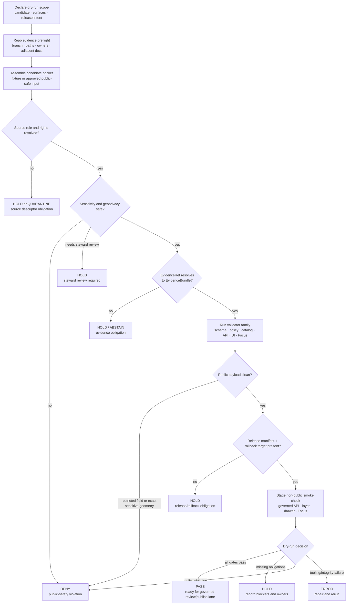

<!-- [KFM_META_BLOCK_V2]
doc_id: kfm://doc/NEEDS-VERIFICATION
title: Fauna Release Dry-Run Runbook
type: standard
version: v1
status: draft
owners: ["@bartytime4life"]
created: NEEDS-VERIFICATION
updated: 2026-05-07
policy_label: TODO-VERIFY(public|restricted)
related: [./README.md, ./rollback.md, ../README.md, ../CONTROL_PLANE.md, ../SOURCE_ROLES.md, ../GEOPRIVACY.md, ../VALIDATION.md, ../MIGRATION_AND_CONTINUITY.md, ../../../../data/registry/fauna/README.md, ../../../adr/ADR-0009-sensitive-location-policy.md, ../../../../.github/CODEOWNERS]
tags: [kfm, fauna, runbook, release-dry-run, promotion, geoprivacy, evidence, rollback]
notes: [Owner uses confirmed CODEOWNERS fallback; replace with verified fauna-domain steward when available. created date, doc_id, and policy label require registry verification. Validator commands below are PROPOSED until executable entrypoints are verified.]
[/KFM_META_BLOCK_V2] -->

<a id="top"></a>

# Fauna Release Dry-Run Runbook

Rehearse a fauna release with synthetic or already approved public-safe inputs before any public alias, layer, API payload, Evidence Drawer payload, or Focus Mode answer is promoted.

<p>
  
  
  
  
  
  
</p>

> [!IMPORTANT]
> **Impact block**
>
> | Field | Value |
> |---|---|
> | Target path | `docs/domains/fauna/runbooks/release-dry-run.md` |
> | Status | `draft` runbook; executable validator maturity remains `NEEDS VERIFICATION` unless the active branch proves otherwise |
> | Owners | `@bartytime4life` as CODEOWNERS fallback; fauna-domain steward remains `NEEDS VERIFICATION` |
> | Default input posture | Synthetic fixture or previously approved public-safe release candidate only |
> | Default public posture | No restricted exact geometry, no unknown-rights publication, no unreviewed live-source promotion |
> | Dry-run outcomes | `PASS`, `HOLD`, `DENY`, `ERROR` |
> | Normal public path | Released artifacts → governed API → MapLibre / Evidence Drawer / Focus Mode |
> | Forbidden path | RAW, WORK, QUARANTINE, restricted geometry, direct source APIs, direct model runtime, unpublished candidates |
> | Quick jumps | [Scope](#scope) · [Repo fit](#repo-fit) · [Accepted inputs](#accepted-inputs) · [Exclusions](#exclusions) · [Trigger conditions](#trigger-conditions) · [Dry-run flow](#dry-run-flow) · [Preconditions](#preconditions) · [Procedure](#procedure) · [Gate matrix](#gate-matrix) · [Commands](#proposed-validation-commands) · [Decision record](#decision-record-template) · [Exit criteria](#exit-criteria) · [Rollback rehearsal](#rollback-and-correction-rehearsal) · [Reviewer checklist](#reviewer-checklist) · [Definition of done](#definition-of-done) · [Open verification](#open-verification) |

---

## Scope

This runbook rehearses fauna publication without performing an actual public release.

It is used to prove that a fauna release candidate can pass source-role, rights, sensitivity, geoprivacy, evidence, catalog, proof, runtime, UI, Focus Mode, correction, and rollback checks before promotion. A dry-run may produce validation reports, receipts, review tasks, and a decision record. It must not silently repoint public aliases, activate live connectors, or publish new public artifacts.

### In scope

| Surface | Dry-run responsibility |
|---|---|
| Synthetic fixtures | Confirm the lane can pass happy-path and negative-path tests without live source risk. |
| Approved public-safe candidates | Rehearse a release only after source role, rights, sensitivity, evidence, and review posture are already supportable. |
| Source registry checks | Confirm source roles, authority scope, rights, access class, cadence, attribution, and geoprivacy posture are explicit. |
| Geoprivacy checks | Confirm restricted exact geometry and restricted fields cannot reach public outputs. |
| Evidence closure | Confirm EvidenceRefs resolve to EvidenceBundles before public claims, drawers, exports, or Focus answers. |
| Catalog and proof closure | Confirm catalog, provenance, manifest, proof, receipt, and rollback references are complete enough for review. |
| API/UI smoke checks | Confirm governed API payloads, map layer metadata, Evidence Drawer payloads, and Focus Mode outcomes stay public-safe. |
| Release decision rehearsal | Produce a `PASS`, `HOLD`, `DENY`, or `ERROR` decision with reason codes and obligations. |

### Out of scope

| Not allowed in this runbook | Reason |
|---|---|
| Live connector activation | Source activation requires separate source verification, rights review, sensitivity review, and steward approval. |
| Direct public publication | Publication is a governed state transition, not a dry-run side effect. |
| RAW / WORK / QUARANTINE access by public clients | Public clients consume governed APIs and released public-safe artifacts only. |
| Browser-only geoprivacy | Sensitive geometry must be transformed before release, not hidden by map styling. |
| AI-only proof | Focus Mode may interpret released evidence; it cannot supply release proof. |

[Back to top](#top)

---

## Repo fit

This file is a domain-local operator runbook under the human-facing fauna documentation lane.

```text
docs/domains/fauna/
├── README.md
├── CONTROL_PLANE.md
├── SOURCE_ROLES.md
├── GEOPRIVACY.md
├── VALIDATION.md
├── MIGRATION_AND_CONTINUITY.md
└── runbooks/
    ├── README.md
    ├── release-dry-run.md        # this file
    └── rollback.md
```

### Relationship map

| Relationship | Path | Role |
|---|---|---|
| Runbook index | [./README.md](./README.md) | Operator-facing index and common runbook rhythm. |
| Rollback companion | [./rollback.md](./rollback.md) | Withdrawal, cache invalidation, correction, and recovery workflow. |
| Fauna domain landing page | [../README.md](../README.md) | Domain scope, object families, lifecycle, source classes, public-safety posture. |
| Control plane | [../CONTROL_PLANE.md](../CONTROL_PLANE.md) | Ownership, source activation, risk register, release readiness, incident triggers. |
| Source roles | [../SOURCE_ROLES.md](../SOURCE_ROLES.md) | Source-role taxonomy and claim-role compatibility. |
| Geoprivacy | [../GEOPRIVACY.md](../GEOPRIVACY.md) | Public geometry classes, redaction receipts, leak prevention, rollback triggers. |
| Validation | [../VALIDATION.md](../VALIDATION.md) | Gate matrix, fixture matrix, PR evidence, release dry-run expectations. |
| Migration and continuity | [../MIGRATION_AND_CONTINUITY.md](../MIGRATION_AND_CONTINUITY.md) | Prior-gain preservation, supersession mapping, and non-regression rules. |
| Source registry | [../../../../data/registry/fauna/README.md](../../../../data/registry/fauna/README.md) | Source descriptors, taxon authorities, sensitivity policies, and verification backlog. |
| Sensitive-location ADR | [../../../adr/ADR-0009-sensitive-location-policy.md](../../../adr/ADR-0009-sensitive-location-policy.md) | Cross-domain sensitive-location decision posture. |
| Review routing | [../../../../.github/CODEOWNERS](../../../../.github/CODEOWNERS) | GitHub-native review routing; not release approval or policy override. |

> [!NOTE]
> Directory Rules basis: `docs/` is the human-facing control plane, and fauna belongs under the domain documentation lane rather than as a root-level `fauna/` directory. Release decisions, receipts, proofs, and published artifacts belong in their responsibility roots, not inside this Markdown file.

[Back to top](#top)

---

## Accepted inputs

A release dry-run should accept only reviewable, public-safe, release-candidate materials.

| Input | Accepted when | Required guardrail |
|---|---|---|
| Dry-run scope statement | It names release candidate, domain scope, geography, time window, source family, intended public surfaces, and operator. | Scope must say whether input is synthetic fixture or approved public-safe candidate. |
| Synthetic fixture | Fixture is no-network, public-safe, intentionally tiny, and clearly marked fixture-only. | Must not be confused with production evidence. |
| Approved public-safe release candidate | Candidate already passed source descriptor, rights, sensitivity, and evidence prechecks. | No live-source or restricted-geometry surprises during dry-run. |
| SourceDescriptor references | Source role, rights, authority scope, access class, cadence, attribution, and geoprivacy posture are explicit. | Unknown source role or unknown rights blocks promotion. |
| EvidenceBundle references | Every public claim, layer feature, drawer payload, export, or Focus answer can resolve evidence. | Broken evidence produces `ABSTAIN`, `HOLD`, `DENY`, or `ERROR`. |
| RedactionReceipt / transform receipt | Candidate includes generalized, aggregated, delayed, suppressed, or redacted public geometry. | Required whenever precise internal support differs from public output. |
| LayerManifest / API payload fixture | Candidate includes public-safe field allowlists and release references. | Restricted fields must not reach public API, tiles, graph, search, screenshots, exports, Evidence Drawer, or Focus Mode. |
| ReleaseManifest draft | Candidate identifies artifacts, digests, evidence/proof/policy/review refs, stale rules, and rollback target. | Missing rollback target blocks `PASS`. |
| Validation report family | Reports are reproducible or reviewable and scoped to the candidate. | Reports must be separate artifacts, not embedded as release truth in this runbook. |
| Rollback target | Prior known-good release or safe withdrawal state is identified. | Required before dry-run can pass. |

[Back to top](#top)

---

## Exclusions

| Excluded item | Correct handling | Failure outcome |
|---|---|---|
| RAW source dumps, exports, API responses, or credentialed payloads | Store under governed lifecycle homes such as `data/raw/fauna/` or restricted source storage. | `DENY` / `QUARANTINE` |
| WORK-stage repair outputs | Store under `data/work/fauna/` or repo-confirmed equivalent. | `HOLD` |
| Quarantined or restricted records | Store under `data/quarantine/fauna/` or restricted internal store. | `DENY` public use |
| Exact protected occurrence coordinates | Keep in restricted internal stores only; publish only approved derivatives. | `DENY` |
| API keys, tokens, cookies, auth headers, private URLs | Use secret manager or deployment-specific configuration. | `ERROR` / security incident |
| Live connector commands | Use source-verification runbook and connector activation decision first. | `HOLD` / `DENY` |
| Machine schema definitions | Accepted schema home after ADR verification. | `HOLD` if schema authority is unresolved |
| Policy-as-code | Accepted `policy/` root or repo-native policy home. | `HOLD` |
| Generated proof packs and reports | `data/proofs/`, `data/receipts/`, `release/`, or build artifact locations. | `HOLD` |
| Raw model output | Nowhere as evidence. | `DENY` |
| Public alias repointing | Release workflow, not dry-run. | `DENY` |

[Back to top](#top)

---

## Trigger conditions

Run this dry-run when any of the following is true:

| Trigger | Runbook action |
|---|---|
| A new fauna layer, API payload, export, or public evidence drawer payload is proposed. | Rehearse source-role, geoprivacy, evidence, catalog, proof, API, UI, and rollback gates. |
| A release candidate supersedes a prior fauna release. | Confirm continuity mapping and rollback target before review. |
| Source descriptors, rights, sensitivity, taxonomy, or public geometry behavior changed. | Re-run dry-run before public alias or release manifest changes. |
| Focus Mode or Evidence Drawer will consume fauna evidence. | Confirm finite outcomes and no restricted context leakage. |
| A prior release was rolled back or corrected. | Confirm the corrected candidate now passes negative fixtures. |
| CI or validator wiring changed. | Prove dry-run still fails closed on invalid fixtures. |

[Back to top](#top)

---

## Dry-run flow



[Back to top](#top)

---

## Preconditions

Do not start this runbook until the dry-run packet satisfies the checks below.

### Required before any dry-run

- [ ] Repo evidence has been checked for branch, target path, adjacent docs, and owner routing.
- [ ] Candidate is synthetic/no-network or already approved as public-safe.
- [ ] No live source connector will run as part of the dry-run.
- [ ] SourceDescriptor references exist for every source family used by the candidate.
- [ ] Source roles and authority scopes are explicit.
- [ ] Rights, redistribution, attribution, and record-level license posture are known or the candidate is blocked.
- [ ] Sensitivity class and public geometry class are explicit.
- [ ] Restricted exact geometry is absent from public payloads.
- [ ] RedactionReceipt or equivalent transform receipt exists for every public-safe geometry transform.
- [ ] EvidenceRefs resolve to EvidenceBundles for every consequential claim.
- [ ] Catalog/proof/release objects are separate and cross-referenced.
- [ ] Rollback target is known, or a safe withdrawn state is defined.
- [ ] Correction path is named for public-facing defects.
- [ ] Validator commands are repo-confirmed or clearly marked `PROPOSED`.

### High-risk blockers

| Blocker | Required outcome |
|---|---|
| Unknown rights | `DENY` public promotion or `QUARANTINE` source. |
| Unknown source role | `HOLD` or `QUARANTINE`; do not infer from source name. |
| Occurrence aggregator used as legal-status authority | `DENY`. |
| Habitat/model support used as occurrence proof | `ABSTAIN` or `DENY` depending on surface. |
| Exact sensitive geometry in public candidate | `DENY`. |
| Missing EvidenceBundle | `ABSTAIN` for runtime answer; `HOLD` or `DENY` for release candidate. |
| Missing rollback target | `HOLD` or `ERROR`; never `PASS`. |
| Validator crash or manifest corruption | `ERROR`. |

[Back to top](#top)

---

## Procedure

### 0. Declare the dry-run scope

Record the dry-run target before running checks.

| Field | Required value |
|---|---|
| `dry_run_id` | Stable ID for the rehearsal. |
| `candidate_id` | Release candidate, fixture, manifest, or bundle ID. |
| `input_class` | `synthetic_fixture`, `approved_public_safe_candidate`, or `staged_release_candidate`. |
| `domain_scope` | `fauna` plus any related habitat, flora, hydrology, or layer dependency. |
| `public_surfaces` | API, layer, Evidence Drawer, Focus Mode, export, search, graph, story, report. |
| `source_families` | Source descriptors involved. |
| `time_scope` | Observation/source/retrieval/release time windows where material. |
| `operator` | Human or automation identity. |
| `rollback_target` | Prior known-good release or safe withdrawn state. |

### 1. Run repo evidence preflight

```bash
git status --short
git branch --show-current
git rev-parse --show-toplevel

find docs/domains/fauna data/registry/fauna policy tools tests schemas contracts data release \
  -maxdepth 4 -type f 2>/dev/null | sort | sed -n '1,240p'
```

Record what was confirmed and what remains `UNKNOWN`. Do not upgrade a proposed command, validator, schema home, workflow, or route to confirmed status without repo evidence.

### 2. Assemble the dry-run packet

The packet should be a small folder, manifest, or issue/PR attachment that points to all candidate materials.

```text
dry-run packet
├── scope.md or scope.yaml
├── candidate_manifest.json
├── source_descriptor_refs.*
├── evidence_bundle_refs.*
├── redaction_receipt_refs.*
├── layer_manifest_ref.*
├── api_payload_fixture.*
├── focus_mode_fixture.*
├── validation_report_refs.*
├── release_manifest_draft.*
└── rollback_target_ref.*
```

### 3. Run source, rights, and sensitivity precheck

Confirm that the candidate does not depend on unresolved source roles, unknown rights, or unclear geoprivacy.

Minimum checks:

- source role exists and is compatible with the claim type;
- authority scope matches the claim;
- rights allow the requested dry-run surface;
- source geoprivacy flags are preserved;
- sensitivity class is assigned;
- public geometry class is assigned;
- public fields are allowlisted;
- steward review is complete or explicitly blocking.

### 4. Run validator family

Use repo-native validators when available. Until entrypoints are verified, use the command block below as a proposed placeholder.

Expected report family:

```text
build/fauna/reports/
├── repo_evidence.json
├── continuity.json
├── source_registry.json
├── taxonomy.json
├── occurrences.json
├── geoprivacy.json
├── evidence_bundles.json
├── catalogs.json
├── layers.json
├── api_contracts.json
├── focus_ai.json
├── public_safety.json
├── release_dry_run.json
└── validation_summary.json
```

### 5. Inspect public payloads manually

Automated validators should catch most issues, but reviewers must still inspect the release-facing payloads.

Check all public-facing surfaces:

- API JSON fixtures;
- layer manifests;
- TileJSON / PMTiles metadata;
- map popups;
- Evidence Drawer payloads;
- Focus Mode prompt context and response envelope;
- graph/search/export payloads;
- screenshots or docs created from public data.

Confirm none contain restricted geometry, restricted source fields, private locality text, raw source payloads, credentials, or unreviewed claims.

### 6. Stage smoke checks in a non-public target

The dry-run may stage non-public smoke checks if the repo supports them.

| Smoke check | Must prove |
|---|---|
| Governed API fixture | Finite outcome and public-safe payload. |
| Map layer fixture | Released layer manifest fields resolve; no restricted metadata. |
| Evidence Drawer fixture | Source role, rights, sensitivity, evidence, release, stale/correction state visible. |
| Focus Mode fixture | `ANSWER` only with evidence and policy support; `ABSTAIN`, `DENY`, and `ERROR` render correctly. |
| Rollback fixture | Alias restore or safe withdrawal can be rehearsed without deleting lineage. |

### 7. Classify the outcome

Use the narrowest truthful outcome.

| Outcome | When to use |
|---|---|
| `PASS` | All required gates pass, no blockers remain, rollback target exists, and candidate can proceed to governed review or publish lane. |
| `HOLD` | The candidate is not unsafe, but obligations remain. |
| `DENY` | Policy, rights, sensitivity, source-role, public-safety, or evidence rules forbid the release. |
| `ERROR` | Tooling, manifest integrity, schema parsing, corruption, or infrastructure failure prevents a reliable decision. |

### 8. Record decision and obligations

Every dry-run produces a decision record, even when it fails.

- Store the record in the repo-confirmed release/dry-run or review location.
- Link reports, receipts, proof objects, rollback target, and open obligations.
- Update related docs when behavior or gates change.
- Add or update negative fixtures for any defect discovered.

[Back to top](#top)

---

## Gate matrix

| Gate | Requirement | PASS condition | HOLD / DENY / ERROR triggers |
|---|---|---|---|
| A — Repo evidence | Target path, adjacent docs, owner routing, and affected roots inspected. | Command or connector evidence recorded. | `HOLD` if branch/path/owner state is unverified; `ERROR` if repo cannot be inspected but release is attempted. |
| B — Continuity | Prior fauna docs, aliases, fixtures, IDs, layers, API shapes, and releases preserved or mapped. | Migration or no-impact statement exists. | `HOLD` for missing mapping; `DENY` for destructive change without rollback. |
| C — Source role and rights | SourceDescriptor role, authority scope, rights, access class, cadence, attribution, and source geoprivacy resolved. | Every source supports requested claim and output. | `DENY` for unknown rights in public release; `HOLD` / `QUARANTINE` for unresolved source role. |
| D — Taxonomy and claim support | Taxon identity, synonym/crosswalk, status source, occurrence support, and habitat/model boundaries respected. | Ambiguity resolved or explicitly scoped. | `HOLD` / `ABSTAIN` for unresolved taxonomy; `DENY` for source-role collapse. |
| E — Geoprivacy | Public geometry class assigned; restricted exact geometry absent; redaction receipts present. | Public payload is safe and receipted. | `DENY` for exact sensitive public geometry, missing receipt, or reverse-engineering risk. |
| F — Evidence closure | EvidenceRefs resolve to EvidenceBundles with limitations, source role, rights, sensitivity, review, and release support. | Every consequential claim can be inspected. | `ABSTAIN` for unresolved evidence; `DENY` for public claim without evidence; `ERROR` for corrupted bundle. |
| G — Catalog, proof, and release | Catalog/proof/release objects are separate, digest-aligned, reviewable, and linked. | Candidate has catalog closure, proof support, release manifest draft, and rollback target. | `HOLD` for incomplete proof; `ERROR` for digest mismatch or missing rollback target. |
| H — Public payload and runtime | API/layer/search/graph/export/Evidence Drawer/Focus payloads are public-safe and finite. | No restricted fields; Focus outcomes render `ANSWER`, `ABSTAIN`, `DENY`, `ERROR`. | `DENY` for restricted leakage; `ABSTAIN` for unsupported answer; `ERROR` for malformed envelope. |
| I — Rollback and correction | Prior known-good release or safe withdrawn state is identified. | Rollback rehearsal can restore or withdraw without deleting lineage. | `HOLD` if incomplete; `ERROR` if release candidate cannot be safely withdrawn. |

[Back to top](#top)

---

## Proposed validation commands

> [!CAUTION]
> These commands are **PROPOSED** until the active branch confirms validator entrypoints, package manager, policy runner, report paths, and CI wiring. Replace them with repo-native commands when verified.

### Repo and docs preflight

```bash
git status --short
git branch --show-current
git rev-parse --show-toplevel

python tools/validators/docs/check_kfm_meta_block.py \
  docs/domains/fauna/runbooks/release-dry-run.md

python tools/validators/docs/check_relative_links.py \
  docs/domains/fauna/runbooks/release-dry-run.md
```

### Fauna validator family

```bash
python tools/validators/fauna/run_all.py \
  --mode dry-run \
  --fixtures tests/fixtures/fauna \
  --registry data/registry/fauna \
  --reports build/fauna/reports
```

### Policy checks

```bash
conftest test \
  --policy policy/fauna \
  tests/fixtures/fauna
```

### Release candidate checks

```bash
python tools/validators/fauna/validate_release_bundle.py \
  --bundle data/proofs/fauna/releases/<release_id>/release_bundle.json \
  --reports build/fauna/reports

python tools/validators/fauna/validate_public_safety.py \
  --published data/published/fauna/releases/<release_id> \
  --reports build/fauna/reports
```

### Runtime proof checks

```bash
pytest -q \
  tests/fauna \
  tests/e2e/runtime_proof/fauna
```

Expected behavior:

- valid public-safe fixture returns `PASS`;
- unknown rights returns `DENY` or `QUARANTINE`;
- unknown source role returns `HOLD` or `QUARANTINE`;
- exact sensitive public geometry returns `DENY`;
- unresolved EvidenceBundle returns `ABSTAIN` or `HOLD`;
- malformed manifest returns `ERROR`.

[Back to top](#top)

---

## Decision record template

Use this shape for the dry-run decision record. Field names are illustrative until repo schemas confirm canonical naming.

```yaml
schema_version: kfm.fauna.release_dry_run.v1
runbook: docs/domains/fauna/runbooks/release-dry-run.md
dry_run_id: TODO
created_at: TODO
operator: TODO
target_ref:
  branch: TODO
  commit_sha: TODO
candidate:
  release_candidate_id: TODO
  input_class: synthetic_fixture # synthetic_fixture | approved_public_safe_candidate | staged_release_candidate
  candidate_manifest_ref: TODO
  public_surfaces:
    - api
    - layer
    - evidence_drawer
    - focus_mode
source_support:
  source_descriptor_refs:
    - TODO
  source_roles_checked: true
  rights_checked: true
  sensitivity_checked: true
evidence_support:
  evidence_bundle_refs:
    - TODO
  evidence_closure_outcome: TODO
geoprivacy:
  public_geometry_class: TODO
  redaction_receipt_refs:
    - TODO
validation_reports:
  repo_evidence: build/fauna/reports/repo_evidence.json
  source_registry: build/fauna/reports/source_registry.json
  geoprivacy: build/fauna/reports/geoprivacy.json
  evidence_bundles: build/fauna/reports/evidence_bundles.json
  public_safety: build/fauna/reports/public_safety.json
  release_dry_run: build/fauna/reports/release_dry_run.json
release_support:
  release_manifest_ref: TODO
  rollback_target_ref: TODO
  correction_path_ref: TODO
decision:
  outcome: HOLD # PASS | HOLD | DENY | ERROR
  reason_codes:
    - TODO
  blocking_obligations:
    - TODO
  non_blocking_notes:
    - TODO
review:
  reviewer: TODO
  review_state: TODO
  next_action_owner: TODO
  next_review_due: TODO
```

[Back to top](#top)

---

## Exit criteria

| Outcome | Candidate may proceed? | Required documentation |
|---|---:|---|
| `PASS` | Yes, to governed review or publish lane only. | Decision record, validation summary, release manifest draft, rollback target, and PR review card. |
| `HOLD` | No. | Decision record with blockers, owner, due date, and re-run condition. |
| `DENY` | No. | Decision record with policy/safety/evidence reason codes, preservation of failed evidence, and correction or quarantine path. |
| `ERROR` | No. | Decision record describing tool, integrity, schema, manifest, or infrastructure failure; repair plan required before re-run. |

### PASS requires all of the following

- [ ] Source role and rights are resolved for the requested release scope.
- [ ] Sensitive exact geometry is absent from public payloads.
- [ ] Redaction/generalization receipts exist where applicable.
- [ ] EvidenceRefs resolve to EvidenceBundles.
- [ ] Catalog, proof, release, and rollback references are complete.
- [ ] API/layer/search/graph/export/Evidence Drawer/Focus payloads are public-safe.
- [ ] Focus Mode has valid `ANSWER`, `ABSTAIN`, `DENY`, and `ERROR` behavior for fixtures.
- [ ] Release manifest draft identifies artifact digests, review state, correction path, stale rules, and rollback target.
- [ ] No blocking `UNKNOWN` or `NEEDS VERIFICATION` item remains for public exposure.
- [ ] Reviewer confirms this is a dry-run and not a public publish.

[Back to top](#top)

---

## Rollback and correction rehearsal

A fauna release dry-run cannot pass unless rollback is rehearsable.

Use [./rollback.md](./rollback.md) as the operational companion when the dry-run identifies a defect or when a candidate supersedes a prior release.

### Rollback rehearsal requirements

| Requirement | Why it matters |
|---|---|
| Known-good target | Public aliases must be restorable or withdrawable without guessing. |
| Artifact enumeration | API snapshots, PMTiles/TileJSON, map layers, exports, search indexes, graph projections, EvidenceBundles, Evidence Drawer caches, and Focus caches may all need invalidation. |
| Correction path | Users must be able to inspect what changed and why without exposing restricted details. |
| Receipt retention | Failed candidate evidence, validator reports, and rollback decisions remain auditable. |
| Non-regression fixture | The failure must become a fixture before re-release. |
| Steward review | Sensitive location, rights, source-role, taxonomy, or legal/status defects require domain review before retry. |

### Rollback trigger examples

- sensitive location exposure risk;
- incorrect legal or conservation status claim;
- occurrence aggregator used as status authority;
- habitat/model support overclaimed as occurrence evidence;
- unknown rights discovered after candidate assembly;
- broken EvidenceBundle reference;
- corrupted or incomplete release manifest;
- restricted field found in API, tile metadata, graph, search, export, drawer, or Focus payload.

[Back to top](#top)

---

## Reviewer checklist

Before accepting a dry-run decision, reviewers should confirm:

- [ ] This runbook did not run live connectors.
- [ ] Candidate input class is clear.
- [ ] Source descriptors exist for each source family.
- [ ] Source role and claim compatibility are explicit.
- [ ] Rights, redistribution, attribution, and record-level license posture are resolved.
- [ ] Sensitive taxa and precise location risks were checked.
- [ ] Public geometry class is assigned.
- [ ] RedactionReceipt exists for each transformed public geometry.
- [ ] No restricted exact geometry or restricted field appears in public surfaces.
- [ ] EvidenceRefs resolve to EvidenceBundles.
- [ ] Catalog/proof/release objects remain separate.
- [ ] ReleaseManifest draft includes artifact digests and rollback target.
- [ ] API payloads use governed finite envelopes.
- [ ] Evidence Drawer displays source role, rights, sensitivity, limitations, review, release, and correction state.
- [ ] Focus Mode returns `ABSTAIN` or `DENY` when evidence or policy requires it.
- [ ] Negative fixtures cover the most important failure paths.
- [ ] Rollback/correction rehearsal is complete.
- [ ] Open `UNKNOWN` or `NEEDS VERIFICATION` items are listed and do not hide public-exposure risk.
- [ ] The dry-run decision uses `PASS`, `HOLD`, `DENY`, or `ERROR` without rhetorical upgrade.

[Back to top](#top)

---

## Definition of done

This runbook revision is done when:

- [ ] KFM Meta Block V2 is present and placeholders are explicit.
- [ ] Owner fallback is documented and domain steward verification remains visible.
- [ ] Repo fit, accepted inputs, exclusions, and forbidden public paths are clear.
- [ ] Dry-run lifecycle and procedure are understandable without relying on tribal knowledge.
- [ ] Commands are marked `PROPOSED` until repo-native entrypoints are verified.
- [ ] Gate matrix covers source role, rights, taxonomy, geoprivacy, evidence, catalog/proof/release, runtime/UI, and rollback.
- [ ] Exit criteria include `PASS`, `HOLD`, `DENY`, and `ERROR`.
- [ ] Rollback and correction rehearsal are first-class, not an appendix afterthought.
- [ ] No raw source data, exact sensitive geometry, credentials, generated reports, proof packs, or release manifests are embedded in the doc.
- [ ] Adjacent docs that define source roles, geoprivacy, validation, control plane, and rollback are linked.
- [ ] Remaining verification items are clear enough for a maintainer to resolve.

[Back to top](#top)

---

## Open verification

| Item | Status | Needed proof |
|---|---:|---|
| `doc_id` | `NEEDS VERIFICATION` | Registered KFM document ID from document registry. |
| `created` date | `NEEDS VERIFICATION` | Original file creation date or first commit metadata for this doc. |
| `policy_label` | `NEEDS VERIFICATION` | Steward or policy classification decision. |
| Fauna-domain steward | `NEEDS VERIFICATION` | CODEOWNERS currently provides fallback; named fauna steward/team still needed. |
| Validator entrypoints | `NEEDS VERIFICATION` | Actual `tools/validators/fauna/*` commands or repo-native equivalents. |
| Policy runner | `NEEDS VERIFICATION` | OPA/Conftest/Rego or repo-native policy tooling and version. |
| Schema home | `NEEDS VERIFICATION` | Accepted ADR resolving `contracts/` vs `schemas/` path authority for fauna objects. |
| Release manifest schema | `NEEDS VERIFICATION` | Machine schema or contract for release candidate and release manifest. |
| Proof and receipt homes | `NEEDS VERIFICATION` | Confirmed `data/proofs/`, `data/receipts/`, and `release/` object layout for fauna. |
| Public fauna API path | `UNKNOWN` | Governed API route tree or OpenAPI contract evidence. |
| MapLibre layer registry path | `UNKNOWN` | Confirmed layer manifest and map shell path. |
| Evidence Drawer implementation | `UNKNOWN` | Confirmed UI/API payload contract and component path. |
| Focus Mode implementation | `UNKNOWN` | Runtime envelope, citation validation, prompt boundary, and negative-state tests. |
| Source rights and terms | `NEEDS VERIFICATION` | Official source terms and record-level rights for any live fauna source. |
| Sensitive-location thresholds | `NEEDS VERIFICATION` | Steward-approved grid/generalization/embargo/withheld-count policy. |
| Branch protections and release environments | `NEEDS VERIFICATION` | GitHub rulesets, protected environments, required checks, and review enforcement. |

[Back to top](#top)

---

## Appendix

<details>
<summary>Minimal candidate packet checklist</summary>

A release dry-run packet should include:

- [ ] `scope.md` or `scope.yaml`
- [ ] candidate manifest
- [ ] input class label: synthetic fixture, approved public-safe candidate, or staged release candidate
- [ ] source descriptor references
- [ ] rights and attribution review references
- [ ] sensitivity and public geometry class summary
- [ ] taxon authority / crosswalk notes where applicable
- [ ] EvidenceBundle references
- [ ] redaction/generalization receipts
- [ ] layer manifest reference
- [ ] governed API payload fixture
- [ ] Evidence Drawer payload fixture
- [ ] Focus Mode fixture
- [ ] validation report references
- [ ] release manifest draft
- [ ] rollback target reference
- [ ] correction path reference
- [ ] open obligations list

</details>

<details>
<summary>Negative checks that should block PASS</summary>

| Negative condition | Required outcome |
|---|---|
| Unknown source role | `HOLD` / `QUARANTINE` |
| Unknown rights for public release | `DENY` |
| Occurrence aggregator used as legal-status authority | `DENY` |
| Habitat/model layer used as occurrence proof | `ABSTAIN` / `DENY` |
| Exact sensitive geometry in public API | `DENY` |
| Restricted field in TileJSON or PMTiles metadata | `DENY` |
| Restricted field in search or graph projection | `DENY` |
| Missing redaction receipt after geometry transform | `DENY` |
| Missing EvidenceBundle | `ABSTAIN` / `HOLD` |
| Release manifest missing rollback target | `ERROR` / `HOLD` |
| Focus Mode answer without citation | `ABSTAIN` / `DENY` |
| Broken catalog/proof digest | `ERROR` |
| Migration without prior-gain mapping | `HOLD` / `DENY` |

</details>

<details>
<summary>PR review card for release dry-run changes</summary>

```text
Goal:
Owning root(s):
Directory Rules basis:
Target release candidate:
Input class:
Public surfaces affected:
Source roles affected:
Rights/sensitivity impact:
EvidenceRef/EvidenceBundle impact:
Geoprivacy impact:
Catalog/proof/release impact:
API/UI/Focus impact:
Validation commands run:
Validation report refs:
Dry-run outcome:
Blocking obligations:
Known UNKNOWN / NEEDS VERIFICATION:
Rollback target:
Correction path:
Reviewer:
```

</details>

[Back to top](#top)
