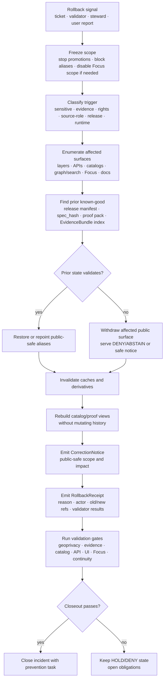

<!-- [KFM_META_BLOCK_V2]
doc_id: kfm://doc/TODO-register-fauna-rollback
title: Fauna Rollback Runbook
type: standard
version: v1
status: draft
owners: TODO(fauna-domain-stewards)
created: TODO(verify-original-created-date-or-set-on-first-commit)
updated: 2026-05-07
policy_label: TODO(verify-public-or-restricted)
related: [./README.md, ../README.md, ../VALIDATION.md, ../GEOPRIVACY.md, ../MIGRATION_AND_CONTINUITY.md, ../SOURCE_ROLES.md, ../CONTROL_PLANE.md, ../../../adr/ADR-0009-sensitive-location-policy.md]
tags: [kfm, fauna, rollback, correction, release, geoprivacy, evidence, public-safety]
notes: [Expanded from existing rollback stub; verify doc_id, owners, created date, policy_label, release/proof/receipt paths, and repo-native validation commands before publication.]
[/KFM_META_BLOCK_V2] -->

<a id="top"></a>

# Fauna Rollback Runbook

Safely withdraw, restore, or correct a released fauna artifact when evidence, policy, rights, geoprivacy, release integrity, or public-quality issues are discovered.

<p>
  
  
  
  
  
  
</p>

> [!IMPORTANT]
> **Impact block**
>
> | Field | Value |
> |---|---|
> | Target path | `docs/domains/fauna/runbooks/rollback.md` |
> | Status | `draft` runbook; executable rollback commands remain `NEEDS VERIFICATION` until the active branch confirms release tooling |
> | Owners | `TODO(fauna-domain-stewards)` |
> | Operating posture | Restore previous public-safe state while preserving evidence, receipts, proof history, correction lineage, and rollback audit trail |
> | Public-safety posture | Exact sensitive wildlife locations, restricted source fields, and unsupported public claims fail closed |
> | Quick jumps | [Scope](#scope) · [Repo fit](#repo-fit) · [Accepted inputs](#accepted-inputs) · [Exclusions](#exclusions) · [Rollback triggers](#rollback-triggers) · [Severity guide](#severity-guide) · [Rollback flow](#rollback-flow) · [Procedure](#procedure) · [Validation gates](#validation-gates) · [Receipts](#receipts-and-records) · [Closeout](#closeout-and-prevention) · [Open verification](#open-verification) |

---

## Scope

This runbook is for **rollback and correction of fauna releases**: public-safe layers, API payload snapshots, EvidenceBundle views, Focus Mode context, search or graph projections, public catalog records, release aliases, and related documentation.

Use it when a released fauna artifact may be wrong, unsafe, stale, incomplete, unverifiable, or policy-incompatible.

### This runbook covers

| Surface | Examples |
|---|---|
| Public layers | PMTiles, TileJSON, layer manifests, public range polygons, density grids, county status layers |
| Public API payloads | `GET /api/fauna/*`, EvidenceBundle views, public occurrence derivatives |
| Evidence surfaces | Evidence Drawer payloads, EvidenceBundle indexes, citation validation reports |
| Focus Mode | Evidence-bounded fauna answers, abstentions, denial states, AI receipts |
| Release objects | ReleaseManifest, PromotionDecision, ProofPack, RollbackCard, CorrectionNotice |
| Derived projections | Public-safe search indexes, graph/triplet projections, catalog records |
| Documentation | Public-facing claims, release notes, changelog entries, screenshots, examples |

### This runbook does not cover

- emergency or life-safety guidance;
- deletion of evidence history;
- direct mutation of RAW, WORK, QUARANTINE, or restricted canonical stores;
- bypassing source-rights, steward-review, geoprivacy, or release gates;
- private source credentials, secret rotation, or infrastructure incident response beyond fauna artifact withdrawal.

> [!CAUTION]
> Rollback is **not deletion**. A KFM rollback restores or withdraws public-safe state while preserving the record of what happened, why it happened, what evidence changed, what users may have seen, and how the system prevents recurrence.

[Back to top](#top)

---

## Repo fit

`rollback.md` is an operator-facing domain runbook under the fauna documentation control plane.

```text
docs/domains/fauna/
├── README.md
├── CONTROL_PLANE.md
├── SOURCE_ROLES.md
├── GEOPRIVACY.md
├── VALIDATION.md
├── MIGRATION_AND_CONTINUITY.md
└── runbooks/
    ├── README.md
    ├── release-dry-run.md
    └── rollback.md          # this file
```

### Relationship map

| Relationship | Path | Role |
|---|---|---|
| Runbook index | [`./README.md`](./README.md) | Selects the correct fauna runbook and keeps operator posture consistent. |
| Domain README | [`../README.md`](../README.md) | Defines fauna lane scope, public-safety boundary, source classes, and lifecycle. |
| Validation guide | [`../VALIDATION.md`](../VALIDATION.md) | Defines fail-closed validation gates and rollback checks. |
| Geoprivacy guide | [`../GEOPRIVACY.md`](../GEOPRIVACY.md) | Defines public geometry classes, redaction receipts, and exact-location denial posture. |
| Migration and continuity | [`../MIGRATION_AND_CONTINUITY.md`](../MIGRATION_AND_CONTINUITY.md) | Preserves prior gains, aliases, IDs, fixtures, and non-regression expectations. |
| Source roles | [`../SOURCE_ROLES.md`](../SOURCE_ROLES.md) | Prevents source-role collapse during correction or re-release. |
| Control plane | [`../CONTROL_PLANE.md`](../CONTROL_PLANE.md) | Tracks owners, cadence, active risks, and review obligations. |
| Sensitive-location ADR | [`../../../adr/ADR-0009-sensitive-location-policy.md`](../../../adr/ADR-0009-sensitive-location-policy.md) | Governs sensitive-location defaults and public-safe handling. |

### Responsibility-root basis

This file belongs under `docs/domains/fauna/runbooks/` because it is a **human-facing domain runbook**. It does not own machine schemas, policy code, release decisions, raw data, receipts, proofs, or published artifacts.

| Responsibility | Correct home |
|---|---|
| Human runbook | `docs/domains/fauna/runbooks/rollback.md` |
| Machine schemas | `schemas/contracts/v1/...` or repo-confirmed schema home |
| Policy-as-code | `policy/...` or repo-confirmed policy home |
| Validator code | `tools/validators/...` or repo-confirmed validator home |
| Process receipts | `data/receipts/...` |
| Proof packs and EvidenceBundles | `data/proofs/...` |
| Release decisions and rollback cards | `release/...` |
| Public-safe outputs | `data/published/...` |

[Back to top](#top)

---

## Accepted inputs

Bring only reviewable rollback evidence into this runbook process.

| Input | Required fields or proof | Why it matters |
|---|---|---|
| Incident or rollback ticket | time opened, reporter, release/artifact scope, severity, suspected cause | Establishes accountable rollback scope. |
| Affected release reference | release ID, spec hash, release manifest path, layer IDs, API paths, catalog refs | Identifies what must be restored or withdrawn. |
| Previous known-good release | previous release manifest, previous spec hash, layer alias mapping, proof refs | Prevents rolling back into an unverified state. |
| EvidenceBundle report | affected bundle IDs, missing refs, stale refs, denied refs, conflict reasons | Determines whether public claims should answer, abstain, deny, or withdraw. |
| Geoprivacy report | public geometry class, restricted-field scan, redaction receipt refs | Protects sensitive locations and restricted fields. |
| Public payload inventory | API snapshots, layer metadata, search/graph exports, Focus context caches | Prevents stale or unsafe derivatives from remaining live. |
| Correction note draft | public-safe summary, affected users/surfaces, corrected state, limitations | Keeps correction visible without leaking restricted details. |
| Rollback receipt draft | prior/new state, actor/run, reason codes, validation results | Preserves auditable rollback history. |

[Back to top](#top)

---

## Exclusions

| Do not put here | Correct handling |
|---|---|
| Exact restricted coordinates | Keep in restricted canonical store; rollback docs may reference safe IDs only. |
| RAW source dumps or source-native payloads | Keep under governed lifecycle storage. |
| Private source URLs, API keys, tokens, cookies, or credentials | Use secret manager or deployment configuration. |
| Sensitive observer, landowner, steward, or collector details | Redact or store under access-controlled review records. |
| Full generated proof packs | Link to proof refs; do not paste bulky generated artifacts into the runbook. |
| Direct model prompts containing restricted fields | Store only governed AI receipts and safe validation outcomes. |
| Destructive shell commands without repo-specific review | Use repo-native release tooling and dry-run mode first. |
| Emergency wildlife, field-safety, or life-safety instructions | Defer to official agencies and emergency systems. |

[Back to top](#top)

---

## Rollback triggers

The earlier rollback stub named four core triggers: sensitive-location exposure risk, incorrect legal/status claim, broken evidence reference, and corrupt release manifest. This expanded runbook keeps those triggers and adds KFM-specific release, geoprivacy, source-role, and runtime cases.

| Trigger | Rollback posture | First action |
|---|---|---|
| Sensitive location exposure risk | Immediate fail-closed containment | Freeze affected public surfaces and remove or repoint public aliases. |
| Incorrect legal/status claim | Public correction and evidence revalidation | Identify source-role error and affected taxa/status scopes. |
| Evidence reference broken or non-resolving | Abstain, deny, or withdraw affected claim | Re-run EvidenceRef → EvidenceBundle closure checks. |
| Corrupt or incomplete release manifest | Block release state and restore prior manifest | Verify previous manifest, proof pack, and rollback card. |
| Rights/license change invalidates public release | Withdraw or restrict affected artifacts | Quarantine source until rights posture is resolved. |
| Source-role misuse | Deny affected claims | Restore source registry and add negative fixture. |
| Taxonomy migration error | Restore prior taxon mapping or publish correction | Rebuild affected bundles, layer aliases, and API payloads. |
| Restricted field in public API/layer/search/graph/export | Immediate public-safety rollback | Invalidate all derived public caches and add leak fixture. |
| Focus Mode gives uncited or policy-forbidden answer | Disable affected Focus scope | Re-run citation validation and AI/public-safety policy checks. |
| Public layer points to unreleased or stale artifact | Repoint alias or withdraw layer | Restore previous public-safe layer manifest. |
| Catalog/proof/release mismatch | Halt publication and restore known-good release | Rebuild catalog closure only after validation passes. |

[Back to top](#top)

---

## Severity guide

| Severity | Description | Required response |
|---|---|---|
| SEV-0 · sensitive exposure | Public exact sensitive wildlife location, restricted coordinates, or private/steward-controlled details may have leaked. | Freeze affected public surfaces immediately; withdraw or repoint aliases; notify steward/release roles; issue correction if public users may have accessed it. |
| SEV-1 · public-truth defect | Released legal/status, occurrence, range, source-role, or evidence claim is materially wrong. | Restore prior known-good state or withdraw claim; publish CorrectionNotice; add non-regression fixture. |
| SEV-2 · release-integrity defect | Release manifest, catalog, proof pack, digest, alias, or rollback target is broken or inconsistent. | Block release candidate or restore prior manifest; rebuild only after proof closure passes. |
| SEV-3 · stale or incomplete derivative | Public layer/API/search/graph/Focus artifact is stale, partial, or out of sync but not actively leaking restricted details. | Mark stale, abstain where needed, rebuild derivative, and record validation/correction outcome. |
| SEV-4 · documentation mismatch | Docs, examples, screenshots, or changelog overstate release state or hide limitations. | Correct docs and examples; verify links, badges, and visible limitations. |

[Back to top](#top)

---

## Rollback flow



[Back to top](#top)

---

## Procedure

### 0. Freeze the release surface

Stop new fauna promotions and prevent the affected release from spreading.

- [ ] Stop or pause new fauna publication/promotions.
- [ ] Disable or hold the affected release candidate.
- [ ] Disable affected Focus Mode scope if it may repeat unsafe claims.
- [ ] Switch public aliases to a safe prior release or safe withdrawn state when necessary.
- [ ] Preserve current state before making changes: release manifest, layer manifest, tile metadata, API payload sample, EvidenceBundle report, validator output.

> [!WARNING]
> Do not delete the bad release evidence. Preserve enough state to reconstruct what users may have seen, what failed, and what corrective action was taken.

### 1. Open the rollback record

Create a rollback record before changing aliases or public payloads.

| Field | Required value |
|---|---|
| `rollback_id` | Stable ID from repo release/rollback convention |
| `opened_at` | timestamp |
| `opened_by` | operator, steward, validator, or system |
| `severity` | `SEV-0` through `SEV-4` |
| `affected_release_id` | release ID or candidate ID |
| `affected_spec_hash` | current bad or suspect spec hash |
| `affected_surfaces` | API, layer, catalog, graph, search, Focus, docs, exports |
| `reason_codes` | machine-readable cause candidates |
| `public_safety_risk` | yes/no/unknown |
| `initial_action` | freeze, repoint, withdraw, abstain, deny, correct |

### 2. Enumerate affected artifacts

Use repo-native inventory commands when available. Until confirmed, treat this command shape as illustrative.

```bash
# PROPOSED: adapt to repo-native release tooling before use.
# Purpose: inventory references; do not mutate artifacts.

RELEASE_ID="<affected-release-id>"
DOMAIN="fauna"

find data/published/"${DOMAIN}" release data/catalog data/proofs data/receipts \
  -maxdepth 6 -type f 2>/dev/null \
  | grep -E "${RELEASE_ID}|${DOMAIN}" \
  | sort
```

Inventory all affected surfaces:

- [ ] ReleaseManifest / PromotionDecision / RollbackCard.
- [ ] LayerManifest, TileJSON, PMTiles, GeoParquet, API snapshot, export.
- [ ] STAC/DCAT/PROV catalog records.
- [ ] EvidenceBundle and EvidenceRef indexes.
- [ ] Public graph/triplet projections and search indexes.
- [ ] Evidence Drawer payload fixtures.
- [ ] Focus Mode context caches and AI receipts.
- [ ] Documentation, screenshots, examples, changelog, release notes.

### 3. Identify previous known-good state

A previous state is usable only when it validates.

| Check | Required proof |
|---|---|
| Release manifest exists | Previous `ReleaseManifest` or accepted repo equivalent. |
| Spec hash known | Previous `spec_hash` or manifest digest. |
| Evidence bundles resolve | EvidenceRef → EvidenceBundle closure passes. |
| Catalog links close | STAC/DCAT/PROV/catalog records point to valid artifacts. |
| Public geometry is safe | Geoprivacy validator confirms no restricted exact geometry. |
| Layer aliases map cleanly | Public layer IDs can repoint without ambiguity. |
| Rollback target exists | RollbackCard or release-lineage record identifies restore target. |

If no known-good state validates, withdraw the affected public surface and return `DENY`, `ABSTAIN`, or safe stale/correction notices until a replacement passes review.

### 4. Restore or withdraw public state

Choose the smallest safe action.

| Case | Action |
|---|---|
| Known-good prior release exists | Repoint public aliases, current pointers, and catalog public views to the prior release. |
| No known-good release exists | Withdraw affected public artifact and serve safe `DENY`, `ABSTAIN`, or correction state. |
| Sensitive location exposed | Remove public exact exposure immediately; invalidate derivatives; preserve internal evidence for investigation. |
| Source rights invalidated | Withdraw or restrict public artifacts from the source; quarantine source for re-review. |
| Broken EvidenceBundle only | Force runtime `ABSTAIN` or `DENY` until resolver closure is restored. |
| Focus-only issue | Disable affected Focus action/context; preserve released data if otherwise valid. |

### 5. Invalidate caches and downstream derivatives

| Cache or derivative | Required action |
|---|---|
| TileJSON | Repoint to known-good or withdraw. |
| PMTiles / vector tiles | Invalidate CDN/browser/tile caches or update alias to prior digest. |
| Public API snapshots | Remove stale snapshot from public route; restore prior payload or `ABSTAIN/DENY`. |
| Search index | Rebuild or remove affected public documents. |
| Graph/triplet projection | Rebuild public-safe graph projection from restored release. |
| EvidenceBundle resolver cache | Clear affected bundle IDs and claim refs. |
| Focus Mode cache/context | Clear prompt/context/output caches for affected scope. |
| Browser/app layer aliases | Repoint to prior release ID or show withdrawn/corrected state. |
| Docs/screenshots/examples | Remove or correct unsafe examples and stale claims. |

### 6. Rebuild catalog records without mutating history

Regenerate public catalog views for the restored state, but do not rewrite historical release records invisibly.

- [ ] Keep the failed or withdrawn release visible to release history according to repo policy.
- [ ] Mark it corrected, withdrawn, superseded, or rolled back.
- [ ] Generate current public STAC/DCAT/PROV records for the active alias.
- [ ] Link CorrectionNotice and RollbackReceipt.
- [ ] Preserve prior and current hashes.

### 7. Issue correction notice

A public CorrectionNotice is required when users may have seen or relied on incorrect, leaked, stale, or misclassified public output.

Correction notice must be public-safe and must not expose restricted details.

| Field | Required content |
|---|---|
| `correction_notice_id` | stable ID |
| `affected_release_id` | release or artifact scope |
| `affected_surfaces` | public layer, API, catalog, Focus, docs, exports |
| `issue_class` | sensitive exposure, evidence defect, rights defect, status defect, stale artifact, manifest defect |
| `plain_language_summary` | safe user-facing summary |
| `user_impact` | what may have been wrong or unavailable |
| `corrective_action` | restored, withdrawn, corrected, generalized, or abstained |
| `old_state_ref` | prior release or bad release ref |
| `new_state_ref` | restored/current release ref |
| `created_at` | timestamp |
| `review_state` | steward/release review status |

### 8. Emit rollback receipt

The rollback receipt records the operational action.

See [Receipts and records](#receipts-and-records) for the minimum shape.

### 9. Run validation gates

Do not close rollback until validation passes or open obligations are explicitly recorded.

- [ ] Geoprivacy validation.
- [ ] Public-safety field scan.
- [ ] EvidenceRef → EvidenceBundle closure.
- [ ] Catalog/proof/release closure.
- [ ] API contract checks.
- [ ] Evidence Drawer payload check.
- [ ] Focus Mode citation/policy checks.
- [ ] Layer manifest and tile metadata checks.
- [ ] Continuity and alias mapping checks.
- [ ] Non-regression fixture added for the failure.

[Back to top](#top)

---

## Validation gates

| Gate | Closeout requirement | Failure outcome |
|---|---|---|
| Geoprivacy | No restricted exact geometry or sensitive reverse-engineering path remains public. | Keep `DENY` or withdrawn state. |
| Public payload | API, layer, graph, search, export, Evidence Drawer, Focus, screenshots, and docs contain no restricted fields. | Keep surface disabled or repointed. |
| Evidence closure | All restored public claims resolve EvidenceRefs to EvidenceBundles. | Return `ABSTAIN` or withdraw affected claim. |
| Source-role compatibility | Source roles match the claims being restored. | Deny affected claim and update source registry/fixtures. |
| Rights posture | Public release is allowed or restricted according to source terms and policy. | Withdraw or quarantine affected source/artifact. |
| Catalog closure | STAC/DCAT/PROV/catalog public views match restored release state. | Keep release in `HOLD` or `ERROR`. |
| Release integrity | ReleaseManifest, ProofPack, PromotionDecision, and rollback target align. | Block public alias update. |
| Layer integrity | LayerManifest digest, field allowlist, bounds, zoom, and release ID are valid. | Withdraw or repoint layer. |
| Runtime envelope | APIs and Focus return `ANSWER`, `ABSTAIN`, `DENY`, or `ERROR` with reason codes. | Block route or Focus action. |
| Continuity | Prior valid fauna behavior is restored or mapped; no unmapped destructive churn. | Keep incident open. |

[Back to top](#top)

---

## Receipts and records

### RollbackReceipt minimum shape

```json
{
  "schema_version": "kfm.fauna.rollback_receipt.v1",
  "rollback_id": "TODO",
  "domain": "fauna",
  "created_at": "TODO",
  "actor_or_run_id": "TODO",
  "severity": "SEV-0|SEV-1|SEV-2|SEV-3|SEV-4",
  "reason_codes": [
    "TODO"
  ],
  "affected_release": {
    "release_id": "TODO",
    "spec_hash": "TODO",
    "release_manifest_ref": "TODO"
  },
  "restored_or_withdrawn_state": {
    "action": "restore_prior|withdraw|repoint_alias|disable_focus|mark_stale",
    "target_release_id": "TODO-or-null",
    "target_spec_hash": "TODO-or-null"
  },
  "affected_surfaces": [
    "layer",
    "api",
    "catalog",
    "graph",
    "search",
    "focus",
    "docs"
  ],
  "validation_report_refs": [
    "TODO"
  ],
  "correction_notice_ref": "TODO-or-null",
  "public_notice_required": true,
  "open_obligations": [
    "TODO"
  ]
}
```

### RollbackCard minimum

| Field | Purpose |
|---|---|
| `rollback_card_id` | Stable handle for rollback instructions. |
| `release_id` | Release that can be rolled back. |
| `previous_release_id` | Known-good target. |
| `affected_artifact_refs` | Layer/API/catalog/search/graph/Focus/docs refs. |
| `restore_steps_ref` | Procedure or automation target. |
| `cache_invalidation_scope` | Cache and derivative surfaces to refresh. |
| `validation_required` | Gates required before closeout. |
| `communication_required` | Whether CorrectionNotice or public note is required. |
| `owner` | Release manager or steward role. |

### CorrectionNotice minimum

| Field | Purpose |
|---|---|
| `correction_notice_id` | Stable correction identity. |
| `affected_claims_or_layers` | Public-facing scope. |
| `safe_summary` | Public-safe statement of issue. |
| `corrective_action` | Restored, withdrawn, corrected, generalized, or abstained. |
| `effective_time` | When the correction became active. |
| `prior_release_ref` | Prior/bad state reference. |
| `current_release_ref` | Current state reference. |
| `evidence_bundle_refs` | Evidence supporting correction. |
| `rollback_receipt_ref` | Link to rollback action where applicable. |

[Back to top](#top)

---

## Closeout and prevention

A rollback is not complete when the old layer renders. It is complete when evidence, release, public surfaces, correction lineage, and prevention are all auditable.

### Closeout checklist

- [ ] Public alias or withdrawn state confirmed.
- [ ] Affected caches invalidated.
- [ ] Geoprivacy and public-safety validators pass.
- [ ] EvidenceBundle closure passes or affected claims return `ABSTAIN`/`DENY`.
- [ ] Catalog and release records link to current state.
- [ ] CorrectionNotice issued or explicitly marked not required.
- [ ] RollbackReceipt stored in repo-confirmed receipt home.
- [ ] Prior failed release remains auditable.
- [ ] Non-regression fixture added.
- [ ] Validation guide updated if a gate was missing.
- [ ] Geoprivacy/source-role/migration docs updated if doctrine changed.
- [ ] Release notes or changelog updated.
- [ ] Follow-up owner and due date assigned.

### Prevention task types

| Failure class | Prevention task |
|---|---|
| Sensitive location leak | Add negative fixture for exact restricted public geometry and run public-payload leak scan. |
| Source-role misuse | Add source-role compatibility fixture and update `SOURCE_ROLES.md`. |
| Unknown rights promoted | Add policy fixture denying `rights_status: unknown` or equivalent. |
| Broken EvidenceBundle | Add resolver fixture for missing or stale EvidenceRef. |
| Layer manifest defect | Add layer digest/field allowlist test. |
| Focus Mode unsupported answer | Add citation validation and policy-denial fixture. |
| Taxonomy migration error | Add taxon crosswalk receipt and migration fixture. |
| Release manifest missing rollback target | Add release dry-run gate requiring RollbackCard. |
| Documentation overclaim | Add docs lint or review checklist item for truth labels and implementation claims. |

[Back to top](#top)

---

## Operator quick cards

### Immediate actions

1. Stop new fauna publication/promotions.
2. Repoint public aliases to a prior known-good release or withdraw affected public surface.
3. Invalidate affected caches and public derivatives.
4. Publish or draft a CorrectionNotice with scope and user impact.
5. Re-run geoprivacy, public-safety, evidence, catalog, API, UI, Focus, release, and continuity checks.

### Recovery checklist

- [ ] Incident ticket opened with timestamp and owner.
- [ ] Impacted artifacts, layers, endpoints, catalogs, bundles, caches, and docs enumerated.
- [ ] Known-good release confirmed and restored, or unsafe surface withdrawn.
- [ ] Correction lineage recorded in release notes.
- [ ] RollbackReceipt emitted.
- [ ] Public-safe CorrectionNotice issued if needed.
- [ ] Follow-up validation and prevention action assigned.
- [ ] Non-regression fixture added for the trigger.

[Back to top](#top)

---

## Open verification

| Item | Status | Needed proof |
|---|---:|---|
| `doc_id` | TODO | Register this document in the KFM document registry. |
| Owners | TODO | Confirm CODEOWNERS or fauna steward/release manager roles. |
| Policy label | TODO | Confirm whether this runbook is public, restricted, or another repo-defined label. |
| Original created date | TODO | Use Git history or document registry. |
| Release object homes | NEEDS VERIFICATION | Confirm paths for ReleaseManifest, ProofPack, RollbackCard, PromotionDecision, CorrectionNotice. |
| Receipt home | NEEDS VERIFICATION | Confirm whether rollback receipts live under `data/receipts/fauna/`, `release/`, or another repo-approved home. |
| Validator commands | NEEDS VERIFICATION | Confirm repo-native fauna validator entrypoints. |
| Policy runner | NEEDS VERIFICATION | Confirm OPA/Conftest/Rego or repo-native policy engine. |
| Cache invalidation tooling | UNKNOWN | Confirm tile/API/search/graph/Focus cache controls. |
| Public API route names | UNKNOWN | Confirm governed API paths before adding route-specific rollback commands. |
| UI layer registry path | UNKNOWN | Confirm MapLibre layer registry and Evidence Drawer implementation. |
| Rollback automation | UNKNOWN | Confirm whether rollback is manual, CLI-driven, workflow-driven, or release-manager approved. |
| Public correction format | NEEDS VERIFICATION | Confirm repo convention for CorrectionNotice content, publication, and user visibility. |

[Back to top](#top)

---

## Appendix

<details>
<summary>Rollback PR evidence card</summary>

Use this in the PR or incident follow-up.

| Field | Required content |
|---|---|
| Goal | What was restored, withdrawn, or corrected. |
| Trigger | Trigger class and severity. |
| Owning roots | `docs/`, `data/`, `release/`, `policy/`, `tools/`, `tests/`, `apps/`, or other touched roots. |
| Directory Rules basis | Why changed files belong in their roots. |
| Affected public surfaces | API, layer, catalog, graph, search, Focus, docs, exports. |
| Evidence impact | EvidenceBundle and EvidenceRef changes. |
| Rights/sensitivity impact | Public geometry class, source rights, steward review. |
| Release impact | ReleaseManifest, ProofPack, PromotionDecision, RollbackCard, CorrectionNotice. |
| Validation reports | Report refs and outcomes. |
| Cache invalidation | What was invalidated and when. |
| Correction notice | Public-safe notice ref or reason not required. |
| Non-regression | Fixture/test added to prevent recurrence. |
| Open obligations | Remaining HOLD/NEEDS VERIFICATION items. |

</details>

<details>
<summary>Rollback reason-code starter set</summary>

```yaml
reason_codes:
  - fauna.sensitive_location.public_exact_exposure
  - fauna.restricted_field.public_payload
  - fauna.evidence_ref.unresolved
  - fauna.evidence_bundle.missing
  - fauna.source_role.misuse
  - fauna.rights.unknown_or_changed
  - fauna.taxonomy.migration_error
  - fauna.release_manifest.corrupt
  - fauna.layer_manifest.digest_mismatch
  - fauna.catalog.linkage_broken
  - fauna.focus.uncited_claim
  - fauna.api.unknown_rights_answered
  - fauna.continuity.unmapped_churn
```

</details>

<details>
<summary>Example safe public correction summary</summary>

> A fauna layer released under `<release_id>` was withdrawn or restored because one or more supporting records did not meet KFM evidence, rights, sensitivity, or release validation requirements. KFM has restored the prior public-safe state or withdrawn the affected surface while review continues. No restricted location details are included in this notice.

</details>

<p align="right"><a href="#top">Back to top ↑</a></p>
