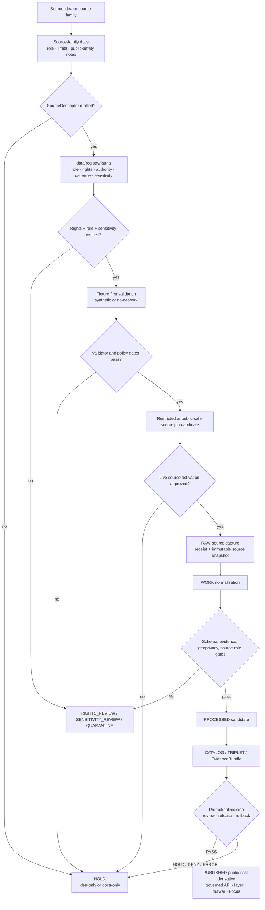

<!-- [KFM_META_BLOCK_V2]
doc_id: kfm://doc/TODO-register-fauna-sources-readme-uuid
title: Fauna Sources README
type: standard
version: v1
status: draft
owners: TODO(fauna-source-stewards)
created: TODO(verify-original-created-date-or-set-on-first-meaningful-commit)
updated: 2026-05-07
policy_label: TODO(verify-public-or-restricted)
related: ["../README.md", "../CONTROL_PLANE.md", "../SOURCE_ROLES.md", "../GEOPRIVACY.md", "../VALIDATION.md", "../MIGRATION_AND_CONTINUITY.md", "../../../../data/registry/fauna/README.md", "ebird/README.md", "gbif/README.md"]
tags: [kfm, fauna, sources, source-directory, source-roles, geoprivacy, evidence, public-safety]
notes: [Target file contained placeholder content before this revision; doc_id, owners, created date, and policy_label require steward or document-registry verification; this README is a source-directory index and does not activate live source connectors.]
[/KFM_META_BLOCK_V2] -->

<a id="top"></a>

# Fauna Sources

Source-family directory for admitting, documenting, and reviewing fauna evidence sources before any live connector, public layer, Evidence Drawer payload, or Focus Mode answer can rely on them.

<p>
  
  
  
  
  
  
</p>

> [!IMPORTANT]
> **Impact block**
>
> | Field | Value |
> |---|---|
> | Status | `draft` source-directory README |
> | Owners | `TODO(fauna-source-stewards)` |
> | Target path | `docs/domains/fauna/sources/README.md` |
> | Directory role | Human-facing index for fauna source-family documentation |
> | Source posture | Source descriptors, roles, rights, sensitivity, cadence, and authority scope must be visible before activation |
> | Public-safety posture | Unknown rights, unknown role, unresolved sensitivity, or exact sensitive geometry blocks public promotion |
> | Connector posture | This README does not enable live KDWP, USFWS, GBIF, eBird, iNaturalist, NatureServe, EDDMapS, museum, monitoring, or steward-controlled connectors |
> | Public runtime posture | Released artifacts and governed APIs only; no public RAW, WORK, QUARANTINE, restricted-store, direct-source, or direct-model access |
> | Quick jumps | [Scope](#scope) · [Repo fit](#repo-fit) · [Accepted inputs](#accepted-inputs) · [Exclusions](#exclusions) · [Directory map](#directory-map) · [Source admission flow](#source-admission-flow) · [Source families](#source-families) · [Guardrails](#guardrails) · [Quickstart](#quickstart) · [Review gates](#review-gates) · [Open verification](#open-verification) |

---

## Scope

This directory organizes fauna source-family documentation. It is where maintainers explain how source families may enter the KFM fauna lane, what each source can support, what it must not be used for, and what evidence, rights, geoprivacy, validation, release, correction, and rollback controls must exist before public use.

This directory supports source-family docs for:

- occurrence aggregators and community-science sources;
- legal and conservation-status authorities;
- taxonomic authority sources;
- monitoring, survey, eDNA, acoustic, telemetry, mortality, disease, and invasive records;
- museum and specimen sources;
- habitat, range, model, and environmental context sources;
- steward-restricted or controlled-access source families.

It does **not** make any source canonical truth. Source docs are orientation and control-plane material. Source activation still requires registry records, source descriptors, rights review, sensitivity review, validation fixtures, policy gates, receipts/proofs where applicable, release review, and rollback targets.

### What this directory governs

| Surface | Source-directory responsibility |
|---|---|
| Source-family navigation | Index the docs that explain each fauna source family. |
| Source-role discipline | Keep legal/status, taxonomy, occurrence, monitoring, habitat context, derived model, documentary, and restricted steward sources distinct. |
| Public-safety posture | Preserve exact-location denial and public-safe aggregate/generalized output rules. |
| Connector readiness | Make it clear whether a source is idea-only, fixture-only, descriptor-draft, rights-review, steward-review, internal-restricted, release-candidate, or published-public-safe. |
| Review navigation | Point contributors to domain docs, registry docs, source-role docs, geoprivacy docs, validation docs, and source-specific docs. |
| Anti-collapse guidance | Prevent occurrence records, aggregators, habitat models, or AI summaries from being treated as legal truth, confirmed presence, complete census, or exact-location authority. |

### What this directory does not govern

| Not governed here | Owning surface |
|---|---|
| Whole fauna lane scope | [`../README.md`](../README.md) |
| Ownership, risk, cadence, and activation states | [`../CONTROL_PLANE.md`](../CONTROL_PLANE.md) |
| Canonical source-role taxonomy | [`../SOURCE_ROLES.md`](../SOURCE_ROLES.md) |
| Sensitive-location and public-geometry rules | [`../GEOPRIVACY.md`](../GEOPRIVACY.md) |
| Validation gates and fixture expectations | [`../VALIDATION.md`](../VALIDATION.md) |
| Migration and prior-gain preservation | [`../MIGRATION_AND_CONTINUITY.md`](../MIGRATION_AND_CONTINUITY.md) |
| Source descriptors and verification backlog | [`../../../../data/registry/fauna/README.md`](../../../../data/registry/fauna/README.md) |
| Machine schemas | Accepted schema home after ADR / repo verification |
| Policy-as-code | `../../../../policy/fauna/` or repo-confirmed policy home |
| Validator implementation | `../../../../tools/validators/fauna/` or repo-confirmed validator home |
| Release decisions, receipts, proof packs, and rollback cards | `data/receipts/`, `data/proofs/`, `release/`, or repo-confirmed equivalents |

<p align="right"><a href="#top">Back to top ↑</a></p>

---

## Repo fit

`docs/domains/fauna/sources/README.md` is a README-like source-directory landing page under `docs/`, the human-facing control plane.

```text
docs/domains/fauna/
├── README.md
├── CONTROL_PLANE.md
├── SOURCE_ROLES.md
├── GEOPRIVACY.md
├── VALIDATION.md
├── MIGRATION_AND_CONTINUITY.md
├── INGEST_EBIRD.md
├── runbooks/
└── sources/
    ├── README.md                    # this file
    ├── ebird/
    │   └── README.md
    └── gbif/
        └── README.md
```

### Directory Rules basis

This path follows the KFM responsibility-root rule. `docs/` explains governance and source semantics; it does not store source payloads, executable policy, machine schemas, validator code, receipts, proofs, release decisions, or public artifacts.

| Concern | Correct responsibility root | Source-directory rule |
|---|---|---|
| Source-family docs | `docs/domains/fauna/sources/` | Explain source-family role, limits, and review posture. |
| Source descriptors | `data/registry/fauna/` or accepted registry home | Store source role, rights, authority scope, cadence, access class, and verification state. |
| RAW source captures | `data/raw/fauna/` | Never store source payloads in docs. |
| Quarantine | `data/quarantine/fauna/` | Unresolved rights, role, sensitivity, taxonomy, or geometry stays out of docs. |
| Machine schemas | `schemas/` or ADR-accepted schema home | Shape validation belongs outside prose. |
| Policy-as-code | `policy/` | Policy must be executable and tested. |
| Validators | `tools/validators/`, `packages/`, or repo-native tool home | Validator implementation emits machine-readable reports. |
| Tests and fixtures | `tests/`, `fixtures/`, or repo-native test home | Proves source-role, rights, geoprivacy, and runtime behavior. |
| Receipts/proofs/release | `data/receipts/`, `data/proofs/`, `release/` | Process memory, proof support, and release decisions stay separate. |
| Runtime/API/UI | `apps/`, `packages/`, or repo-native runtime homes | Consume released public-safe artifacts through governed interfaces. |

> [!CAUTION]
> Do not solve a source-family problem by creating a root-level `fauna/`, `ebird/`, `gbif/`, or `wildlife/` directory. Put each file under the responsibility root that owns its function.

<p align="right"><a href="#top">Back to top ↑</a></p>

---

## Accepted inputs

This directory accepts source-family documentation and review guidance. It should remain readable by maintainers, stewards, and reviewers.

| Input | Accepted here? | Conditions |
|---|---:|---|
| Source-family README files | ✅ | Must state source role, allowed claim types, public-safety posture, connector status, and open verification items. |
| Source-specific architecture notes | ✅ | Must not imply live activation, public release, or legal/status authority without proof. |
| Source-role compatibility notes | ✅ | Must align with [`../SOURCE_ROLES.md`](../SOURCE_ROLES.md). |
| Geoprivacy and public aggregate guidance | ✅ | Must align with [`../GEOPRIVACY.md`](../GEOPRIVACY.md). |
| Validation and conformance guidance | ✅ | Must be fixture-first unless live-source activation is explicitly approved elsewhere. |
| Public portal/download/consumer guidance | ✅ | Must inherit warnings, hashes, policy labels, release refs, and correction state. |
| Negative examples | ✅ | Preferred when they demonstrate `DENY`, `ABSTAIN`, `HOLD`, `QUARANTINE`, or `ERROR`. |
| External source reference links | ✅ | Use as review aids only; links do not activate connectors. |
| Source activation notes | ✅ | Must point to registry/state records and remain truth-labeled. |
| Review checklists | ✅ | Must identify blockers, owner placeholders, and validation evidence. |

### Accepted source maturity states

| State | Meaning | Public release allowed? |
|---|---|---:|
| `IDEA_ONLY` | Source is named but not described. | No |
| `DESCRIPTOR_DRAFT` | Source descriptor is being drafted. | No |
| `RIGHTS_REVIEW` | Source terms, license, redistribution, or attribution are unresolved. | No |
| `SENSITIVITY_REVIEW` | Source may include protected, precise, steward-controlled, or private locations. | No |
| `FIXTURE_ONLY` | Synthetic or no-network fixture path exists. | No production release |
| `INTERNAL_RESTRICTED` | Internal/steward review only. | No public release |
| `RELEASE_CANDIDATE` | Public-safe candidate assembled but not promoted. | Not yet |
| `PUBLISHED_PUBLIC_SAFE` | Governed release approved for a specific scope. | Yes, within release scope |
| `SUSPENDED` | Source or derivative paused due to risk or defect. | No new promotion |
| `WITHDRAWN` | Public release withdrawn or superseded. | No |

<p align="right"><a href="#top">Back to top ↑</a></p>

---

## Exclusions

These items must not be committed under `docs/domains/fauna/sources/`.

| Excluded item | Correct handling | Why |
|---|---|---|
| Raw source downloads, API captures, exports, or snapshots | `data/raw/fauna/...` after source descriptor and receipt handling | Docs are not lifecycle storage. |
| Work-stage normalized records | `data/work/fauna/...` | WORK is mutable and not public documentation. |
| Quarantined records | `data/quarantine/fauna/...` | May contain unresolved rights, source-role, taxonomy, or sensitivity defects. |
| Exact sensitive coordinates | Restricted internal store only | Public docs must not leak protected locations. |
| Source credentials, keys, tokens, cookies, private URLs | Secret manager / local ignored environment | Secrets never belong in docs. |
| Record-level restricted locality notes | Restricted canonical store or steward review packet | Public docs and examples must avoid reverse-engineering sensitive sites. |
| Machine JSON Schemas | Accepted schema home after ADR/repo verification | Schemas own machine-checkable shape. |
| Policy-as-code | `policy/fauna/...` or repo-confirmed policy home | Policy must be executable and tested. |
| Validator implementation | `tools/validators/fauna/...` or repo-confirmed validator home | Validators must emit reports and run in CI/tooling. |
| Generated validation reports | Build/report/receipt/proof homes | Generated evidence should be reproducible and separated. |
| Release manifests, proofs, rollback cards | `release/`, `data/proofs/`, `data/receipts/`, or accepted homes | Release decisions and proof support are trust objects, not prose. |
| Direct AI answers or model traces | Nowhere as evidence | AI is interpretive; EvidenceBundle and policy outrank generated language. |
| Public exact point tiles for sensitive taxa | Deny by default | Exact sensitive public geometry violates fauna geoprivacy posture. |

<p align="right"><a href="#top">Back to top ↑</a></p>

---

## Directory map

Current and expected source-family documentation surface.

| Path | Status | Source role family | Purpose |
|---|---:|---|---|
| `README.md` | **CONFIRMED target** | Directory index | This source-directory overview. |
| [`ebird/README.md`](ebird/README.md) | **CONFIRMED** | Community-science bird occurrence support | eBird source-directory landing page, aggregate rules, public-safety posture, and source-family navigation. |
| [`gbif/README.md`](gbif/README.md) | **CONFIRMED** | Occurrence aggregator support | GBIF source-directory landing page for occurrence ingestion, public aggregates, catalog/triplet/read-model, and publication operations. |
| `inaturalist/README.md` | **PROPOSED / NEEDS VERIFICATION** | Community-science occurrence support | Record-level geoprivacy and rights posture for iNaturalist-like observations. |
| `kdwp/README.md` | **PROPOSED / NEEDS VERIFICATION** | Kansas legal/status and steward-source candidate | Kansas legal/status, county/status, and steward-review documentation after source verification. |
| `usfws/README.md` | **PROPOSED / NEEDS VERIFICATION** | Federal legal/status and critical-habitat context | Federal ESA/listing/critical habitat source-family docs after endpoint/terms verification. |
| `natureserve/README.md` | **PROPOSED / NEEDS VERIFICATION** | Conservation-status and model context | Conservation rank/model context with license and precision controls. |
| `eddmaps/README.md` | **PROPOSED / NEEDS VERIFICATION** | Invasive detection/reporting context | Invasive species report/verification context after terms review. |
| `museum-specimens/README.md` | **PROPOSED / NEEDS VERIFICATION** | Specimen evidence | Museum/specimen evidence, locality restrictions, and current-presence interpretation limits. |
| `monitoring/README.md` | **PROPOSED / NEEDS VERIFICATION** | Survey, eDNA, acoustic, telemetry, agency monitoring | Protocol-bound monitoring evidence and public-summary controls. |
| `steward-restricted/README.md` | **PROPOSED / NEEDS VERIFICATION** | Controlled-access steward records | Restricted exact records, review gates, and public-safe derivative expectations. |

> [!NOTE]
> `CONFIRMED` here means the documentation path was inspected in the repository connector or explicitly requested as the target. It does not mean a live source connector, CI gate, source descriptor, release artifact, or runtime endpoint is active.

<p align="right"><a href="#top">Back to top ↑</a></p>

---

## Source admission flow

A source-family README is early in the trust path. It documents intent and constraints; it does not publish.



### Flow rules

1. A source-family doc is **not** a source activation decision.
2. Source descriptor, rights, sensitivity, cadence, access class, and authority scope are required before live use.
3. Synthetic/no-network fixtures should prove behavior before live source work.
4. Public derivatives require geoprivacy transforms, receipts, EvidenceBundles, catalog closure, policy decisions, release state, correction path, and rollback target.
5. Public clients and Focus Mode consume governed public-safe release surfaces only.

<p align="right"><a href="#top">Back to top ↑</a></p>

---

## Source families

### Confirmed source-family documentation

| Source family | Status | Canonical role posture | Public posture | Key notes |
|---|---:|---|---|---|
| eBird | **CONFIRMED docs** | Community-science bird occurrence support; not legal-status authority | Public aggregate/generalized only; `suppression_min_n >= 10`; no exact public points | Public runtime must not fetch eBird directly; use released KFM artifacts through governed APIs. |
| GBIF | **CONFIRMED docs** | Occurrence aggregator support; not legal-status authority | Aggregate/generalized only; exact public coordinates denied by default | GBIF records support aggregate evidence language, not exact-site confirmed presence or legal status. |

### Proposed or future source families

| Source family | Status | Candidate source role | Default public posture | Verification needed |
|---|---:|---|---|---|
| Kansas wildlife/status/steward sources | **NEEDS VERIFICATION** | `legal_status_authority`, `steward_restricted_source`, or scoped occurrence support depending on source | Legal/status summaries may be public after verification; exact records restricted by default | Official source URL, terms, update cadence, jurisdiction scope, steward rules, sensitive-location posture. |
| USFWS ECOS/IPaC-like sources | **NEEDS VERIFICATION** | Federal `legal_status_authority`, critical-habitat context | Federal scope only; do not treat as Kansas legal status | Endpoint/schema, terms, federal scope, citation, public-release class. |
| NatureServe-like sources | **NEEDS VERIFICATION** | `conservation_status_authority`, model/context support | Public only at licensed/public resolution; high-precision data restricted | License, access tier, precision limits, conservation-rank scope, steward review. |
| iNaturalist-like sources | **NEEDS VERIFICATION** | Community-science `occurrence_source` / `occurrence_aggregator` | Record-level rights and geoprivacy required; exact public default deny | Observation-level license, media rights, geoprivacy fields, quality grade, source terms. |
| EDDMapS-like invasive sources | **NEEDS VERIFICATION** | Invasive detection/reporting context | Public only when terms allow and private/sensitive details are removed | Verification state, rights, source role, data fields, citation. |
| Museum/specimen collections | **NEEDS VERIFICATION** | Specimen occurrence evidence | Locality may be restricted; current presence requires interpretation | Collection rights, locality restrictions, event date, specimen basis, taxon authority. |
| Monitoring/survey/eDNA/agency field records | **NEEDS VERIFICATION / RESTRICTED BY DEFAULT** | `monitoring_source` or `steward_restricted_source` | Public summaries only after review | Protocol, effort, station/transect sensitivity, access class, steward review. |
| Habitat/range/context sources | **NEEDS VERIFICATION** | `habitat_context` or `derived_model` | Public context only after rights and model/provenance checks | Must not become occurrence proof; uncertainty and method required. |
| Documentary and archival sources | **NEEDS VERIFICATION** | `documentary_source` | Cited, reviewed, confidence-labeled; precise geometry only when support warrants | Citation, spatial interpretation, confidence, review state. |

<p align="right"><a href="#top">Back to top ↑</a></p>

---

## Guardrails

### Source-role guardrails

| Rule | Required behavior | Failure outcome |
|---|---|---|
| Source role is required | Every source descriptor declares a canonical role or documented alias. | `HOLD` / `QUARANTINE` |
| Authority scope is bounded | A source supports only the claims allowed by its role and scope. | `ABSTAIN` or `DENY` |
| Aggregators are not legal authorities | GBIF, eBird, iNaturalist, and similar sources do not establish legal status. | `DENY` |
| Habitat context is not occurrence proof | Habitat, suitability, range, and model surfaces are support/context. | `ABSTAIN` when used as observed occurrence |
| Monitoring non-detection is scoped | Non-detection does not prove broad absence outside protocol and effort. | `ABSTAIN` |
| Legal status is not occurrence evidence | A listed species is not thereby observed at a map location. | `ABSTAIN` |
| Unknown rights block public release | Unknown or incompatible source rights deny public promotion. | `DENY` / `QUARANTINE` |
| Exact sensitive public geometry denies by default | Protected species/site precision does not reach public payloads. | `DENY` |

### Public payload guardrails

Public source-family outputs must not include:

- exact restricted coordinates;
- protected nest, den, roost, hibernacula, lek, spawning, cave, colony, nursery, telemetry, or steward-controlled precise geometry;
- raw source rows;
- private locality notes;
- source credentials, tokens, private URLs, or query secrets;
- suppressed-group internals or hidden rejoin keys;
- restricted observer, collector, landowner, or steward details;
- AI prompt context containing restricted geometry;
- misleading language such as “confirmed present,” “known population,” “exact location,” or “legal status” unless the claim is separately supported by compatible evidence.

### Required public warning pattern

Use this warning, or a steward-approved equivalent, for public aggregate occurrence products:

> This fauna source output is descriptive public aggregate or generalized evidence support only. It does not show exact sensitive observations, does not include restricted records, and must not be interpreted as legal status, complete census, confirmed site-level presence, true absence, population trend, abundance, or causal effect unless separately supported by compatible evidence.

<p align="right"><a href="#top">Back to top ↑</a></p>

---

## Quickstart

Run this from a verified checkout. These commands are inspection aids; adapt them to repo-native scripts once validator and policy commands are confirmed.

### 1. Confirm the target file and source directories

```bash
git status --short
git branch --show-current

find docs/domains/fauna/sources -maxdepth 2 -type f | sort
```

Expected result: this README, `ebird/README.md`, `gbif/README.md`, and any verified source-family docs are visible.

### 2. Check source-role and public-safety language

```bash
rg -n --no-heading \
  "source_role|occurrence support|legal-status|geoprivacy|exact|suppression|EvidenceBundle|ABSTAIN|DENY|QUARANTINE" \
  docs/domains/fauna docs/domains/fauna/sources data/registry/fauna policy tools tests 2>/dev/null
```

Expected result: source-role, rights, geoprivacy, evidence, and finite-outcome language is consistent across source docs, registry docs, policy, validators, and fixtures.

### 3. Check source descriptor readiness

```bash
# PROPOSED: replace with repo-native validator once confirmed.
python tools/validators/fauna/validate_sources.py \
  --registry data/registry/fauna \
  --reports build/fauna/reports
```

Expected result: unknown roles, unknown rights, missing authority scope, missing sensitivity posture, or missing evidence policy block activation.

### 4. Run no-network source-family fixture checks

```bash
# PROPOSED: adapt to repo-native test layout.
pytest -q tests/fauna tests/e2e/runtime_proof/fauna
```

Expected result: fixture-only tests prove public-safe source behavior without live fetches or public publication.

> [!WARNING]
> Do not add live source fetching to quickstart commands. Live connectors require source descriptor approval, rights review, sensitivity review, steward review, receipts, validation reports, and release gating.

<p align="right"><a href="#top">Back to top ↑</a></p>

---

## Usage

### Add a new source-family directory

1. Create a source-family README under `docs/domains/fauna/sources/<source-family>/README.md`.
2. Add KFM Meta Block V2 with TODO placeholders for unverified owners, dates, policy labels, and doc IDs.
3. State the source’s allowed source role and what it must not be used for.
4. State public-geometry posture and exact-location restrictions.
5. State whether the source is idea-only, fixture-only, descriptor-draft, rights-review, sensitivity-review, internal-restricted, release-candidate, published-public-safe, suspended, or withdrawn.
6. Link to [`../SOURCE_ROLES.md`](../SOURCE_ROLES.md), [`../GEOPRIVACY.md`](../GEOPRIVACY.md), [`../VALIDATION.md`](../VALIDATION.md), and [`../../../../data/registry/fauna/README.md`](../../../../data/registry/fauna/README.md).
7. Add negative examples for source-role misuse, unknown rights, exact sensitive public geometry, missing EvidenceBundle, and unsupported Focus Mode answers.
8. Update this README’s [Directory map](#directory-map).

### Move a source from docs-only to registry review

1. Draft the source descriptor in the accepted registry home.
2. Declare source role, authority scope, rights, access class, cadence, citation, sensitivity posture, and evidence policy.
3. Add `NEEDS VERIFICATION` items for unresolved source terms, endpoint behavior, record-level licensing, or steward decisions.
4. Add no-network fixtures before live source jobs.
5. Run source-role, rights, geoprivacy, EvidenceBundle, public payload, and runtime negative tests.
6. Keep activation state blocked until review clears.

### Update eBird or GBIF docs

1. Preserve their existing source role: occurrence support / occurrence aggregator support.
2. Do not add exact public point examples.
3. Keep public outputs aggregate/generalized unless a reviewed policy change explicitly says otherwise.
4. Preserve warnings against legal-status, confirmed-site-presence, occupancy, abundance, true-absence, population-trend, and causality overclaims.
5. Update validators, fixtures, policy docs, and this index when behavior changes.

<p align="right"><a href="#top">Back to top ↑</a></p>

---

## Review gates

Before merging changes in this directory, reviewers should verify:

- [ ] Target paths sit under the correct responsibility root.
- [ ] KFM Meta Block V2 exists and visible placeholders are intentional.
- [ ] Owners, doc IDs, dates, and policy labels are verified or explicitly marked TODO.
- [ ] Source role is stated for every source family.
- [ ] Source-role limits are stated, not just allowed uses.
- [ ] Source rights and record-level licensing are either verified or marked `NEEDS VERIFICATION`.
- [ ] Sensitive-location and public-geometry posture is explicit.
- [ ] Exact sensitive public coordinates are denied by default.
- [ ] Live connector activation is not implied by source documentation.
- [ ] Public outputs are described as released derivatives, not canonical truth.
- [ ] EvidenceRefs and EvidenceBundles are required for public claims and Focus Mode answers.
- [ ] Focus Mode examples include `ABSTAIN`, `DENY`, and `ERROR`, not only happy-path `ANSWER`.
- [ ] Negative examples cover aggregator-as-legal-authority, habitat-as-occurrence-proof, unknown rights, missing evidence, and sensitive exact geometry.
- [ ] Any new source-family docs update this README’s directory map.
- [ ] Any behavior change updates companion docs, validators, fixtures, policy, registry docs, release notes, or rollback docs as needed.
- [ ] Public release claims include rollback and correction posture.

<p align="right"><a href="#top">Back to top ↑</a></p>

---

## Definition of done

This README is ready to merge when:

| Area | Done means |
|---|---|
| Metadata | `doc_id`, owners, created date, updated date, and policy label are resolved or intentionally left as TODO placeholders. |
| Target replacement | The placeholder target file is replaced by this complete source-directory README. |
| Repo fit | Upstream and downstream relationships are correct relative links from `docs/domains/fauna/sources/`. |
| Source-family index | Confirmed eBird and GBIF source docs are indexed, and future source families are marked `PROPOSED / NEEDS VERIFICATION`. |
| Guardrails | Source-role, rights, geoprivacy, evidence, release, and runtime boundaries are visible. |
| Diagram | Source admission flow shows docs → registry → validation → lifecycle → release path. |
| Review checklist | Maintainers can review docs-only changes and source activation changes separately. |
| Unknowns | Remaining unknowns are listed and not hidden in confident prose. |

<p align="right"><a href="#top">Back to top ↑</a></p>

---

## Open verification

| Item | Status | Needed proof |
|---|---:|---|
| Registered `doc_id` | TODO | Document registry entry for this README. |
| Owners | TODO | CODEOWNERS, steward register, source-lane owner assignment, or governance registry. |
| Created date | TODO | Git history or steward-approved first meaningful commit date. |
| Policy label | TODO | Repo policy classification decision. |
| Target path content before merge | CONFIRMED placeholder before this revision | Review diff from placeholder to full README. |
| Source-family inventory | NEEDS VERIFICATION | Confirm all children under `docs/domains/fauna/sources/` in the active branch. |
| Source descriptors | NEEDS VERIFICATION | Confirm `data/registry/fauna` files and source-family descriptor entries. |
| Schema home | NEEDS VERIFICATION | Accepted ADR or repo convention for fauna schemas. |
| Policy runner | NEEDS VERIFICATION | OPA/Conftest/Rego or repo-native policy runner and command. |
| Validator commands | NEEDS VERIFICATION | Actual files, package scripts, CI commands, or accepted validator entrypoints. |
| CI enforcement | UNKNOWN | Workflow evidence and passing/failing check history. |
| Source rights | NEEDS VERIFICATION | Current official source terms, licenses, attribution, redistribution, and record-level rights. |
| Steward-sensitive source rules | NEEDS VERIFICATION | Protected species, exact-location, monitoring, telemetry, and steward-controlled release rules. |
| Release object conventions | NEEDS VERIFICATION | ReleaseManifest, PromotionDecision, ProofPack, CorrectionNotice, RollbackCard homes and schemas. |
| Public API/UI routes | UNKNOWN | Governed API route tree, MapLibre layer registry, Evidence Drawer payload, and Focus Mode implementation evidence. |
| Live connector status | UNKNOWN / BLOCKED BY DEFAULT | SourceActivationDecision or equivalent source-run approval. |

<p align="right"><a href="#top">Back to top ↑</a></p>

---

## FAQ

### Does this README activate eBird, GBIF, or any other live source?

No. This README is documentation and source-family navigation only. Live source activation requires registry records, source descriptors, rights review, sensitivity review, steward review, validation, receipts, and release gating.

### Can source-family docs contain example coordinates?

Only synthetic, public-safe examples should appear in public docs. Do not include exact sensitive, steward-restricted, private, or source-native precise coordinates.

### Can GBIF or eBird support legal-status claims?

No. They may support occurrence evidence or aggregate public occurrence context after review. Legal/status claims require a compatible legal or conservation-status authority source.

### Can a habitat model prove that a species occurred somewhere?

No. Habitat and model outputs are support/context. They do not prove occurrence by themselves.

### Can public users query RAW or WORK source data?

No. Public users, public APIs, map layers, Evidence Drawer, exports, and Focus Mode consume governed public-safe released artifacts only.

### What happens when source rights are unknown?

Unknown or incompatible rights block public promotion. The correct posture is `HOLD`, `DENY`, or `QUARANTINE`, depending on the requested use and source state.

<p align="right"><a href="#top">Back to top ↑</a></p>

---

## Appendix

<details>
<summary>Minimum source-family README checklist</summary>

A source-family README should include:

- KFM Meta Block V2.
- One H1.
- One-line purpose under the title.
- Impact block with status, owners, posture, and quick links.
- Scope and non-scope.
- Repo fit and Directory Rules basis.
- Accepted inputs.
- Exclusions.
- Source role and authority scope.
- Rights and source-terms posture.
- Sensitivity and public geometry posture.
- Public payload denylist or source-specific restrictions.
- Fixture-first validation expectations.
- Public runtime and Focus Mode boundaries.
- Review gates.
- Open verification table.
- FAQ or examples when useful.

</details>

<details>
<summary>Illustrative source-family packet</summary>

This is illustrative only. Align field names to the accepted registry schema before use.

```yaml
source_family_id: TODO
source_family_name: TODO
documentation_path: docs/domains/fauna/sources/TODO/README.md
activation_state: DESCRIPTOR_DRAFT
canonical_source_role: TODO
source_role_aliases: []
authority_scope:
  can_support:
    - TODO
  cannot_support:
    - TODO
rights:
  status: TODO(public|restricted|unknown|noassertion)
  redistribution: TODO
  attribution_required: TODO
  record_level_rights_apply: TODO
sensitivity:
  default_public_geometry_class: TODO
  exact_public_allowed_default: false
  steward_review_required: TODO
evidence_policy:
  evidence_ref_required: true
  evidence_bundle_required_for_public_claims: true
runtime_policy:
  public_clients_may_fetch_source_directly: false
  focus_mode_allowed_from_released_evidence_only: true
validation:
  no_network_fixture_required: true
  negative_fixtures_required:
    - unknown_rights
    - source_role_misuse
    - exact_sensitive_public_geometry
    - missing_evidence_bundle
open_verification:
  - TODO
```

</details>

<details>
<summary>Negative fixture seed list</summary>

| Fixture | Expected outcome |
|---|---|
| `unknown_source_role.json` | `HOLD` / `QUARANTINE` |
| `unknown_rights_public_release.json` | `DENY` |
| `aggregator_used_as_legal_authority.json` | `DENY` |
| `legal_status_used_as_occurrence.json` | `ABSTAIN` |
| `habitat_context_used_as_occurrence.json` | `ABSTAIN` |
| `model_used_as_observation.json` | `ABSTAIN` |
| `monitoring_nondetection_used_as_absence.json` | `ABSTAIN` |
| `restricted_precise_public_payload.json` | `DENY` |
| `missing_redaction_receipt.json` | `DENY` |
| `missing_evidence_bundle_public_claim.json` | `ABSTAIN` / `DENY` |
| `focus_exact_location_request.json` | `DENY` |
| `public_download_contains_raw_source_row.json` | `DENY` |
| `public_layer_contains_suppression_internal.json` | `DENY` |

</details>

<details>
<summary>Maintainer update triggers</summary>

Update this README when:

- a new source-family directory is added;
- eBird or GBIF source-family docs are renamed, moved, deprecated, or superseded;
- a source-family activation state changes;
- source-role vocabulary changes;
- source descriptor schema changes;
- geoprivacy classes or public geometry rules change;
- source rights, attribution, or redistribution posture changes;
- public aggregate thresholds change;
- validators or policy runners become confirmed;
- release object conventions change;
- governed API, Evidence Drawer, or Focus Mode behavior changes;
- a correction identifies source-role misuse, source-rights error, or sensitive-location leakage.

</details>

<p align="right"><a href="#top">Back to top ↑</a></p>
