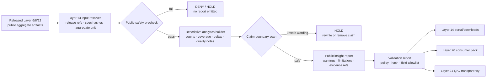

<!-- [KFM_META_BLOCK_V2]
doc_id: kfm://doc/TODO-register-ebird-analytics-uuid
title: eBird Layer 13 Analytics and Insights
type: standard
version: v1
status: draft
owners: TODO(fauna-domain-stewards)
created: TODO(verify-original-created-date-or-set-on-first-commit)
updated: 2026-05-07
policy_label: TODO(verify-public-or-restricted)
related: ["../../README.md", "../../SOURCE_ROLES.md", "../../GEOPRIVACY.md", "../../VALIDATION.md", "EBIRD_CONTRACTS.md", "EBIRD_FEDERATION.md", "EBIRD_MAINTENANCE.md", "EBIRD_PORTAL.md", "EBIRD_CONSUMER_INTEGRATION.md", "EBIRD_QUALITY_AND_TRIAGE.md", "EBIRD_REDTEAM.md", "../../../../../policy/fauna/ebird.rego"]
tags: [kfm, fauna, ebird, analytics, public-aggregate, evidence, geoprivacy]
notes: [Revised from existing repo file; doc_id, owners, created date, and policy_label remain TODO until registry and steward verification.]
[/KFM_META_BLOCK_V2] -->

<a id="top"></a>

# eBird Layer 13 Analytics and Insights

Descriptive, public-safe analytics guidance for already-published eBird aggregate artifacts; this layer does **not** authorize raw eBird access, exact-coordinate exposure, or ecological inference beyond documented public aggregate support.

<p>
  
  
  
  
  
  
</p>

> [!IMPORTANT]
> **Status:** draft  
> **Owners:** `TODO(fauna-domain-stewards)`  
> **Target path:** `docs/domains/fauna/sources/ebird/EBIRD_ANALYTICS.md`  
> **Operating posture:** public aggregate analytics only; no raw eBird downloads, credentials, API keys, exact coordinates, restricted observations, suppression receipts, or suppressed-group details.  
> **Quick jumps:** [Scope](#scope) · [Repo fit](#repo-fit) · [Inputs](#inputs) · [Exclusions](#exclusions) · [Layer 13 flow](#layer-13-flow) · [Analytics contract](#analytics-contract) · [Allowed analytics](#allowed-analytics) · [Claim boundary](#claim-boundary) · [Validation gates](#validation-gates) · [CLI contract](#cli-contract) · [Review checklist](#review-checklist) · [Open verification](#open-verification)

---

## Scope

Layer 13 builds **descriptive public aggregate indicators** and **public-safe insight reports** from already-public eBird aggregate artifacts.

It sits downstream of earlier eBird productization and federation layers. Layer 13 may summarize, compare, explain, and package public aggregate artifacts, but it must not return to raw source data or reinterpret aggregate outputs as biological truth.

### Layer 13 is allowed to

- summarize already-published county or HUC12 aggregate outputs;
- report descriptive counts that passed suppression gates;
- compare released public aggregate artifacts across release IDs or time windows;
- produce public-safe insight reports with interpretation warnings;
- emit validation evidence for downstream portal, download, consumer, and transparency layers;
- preserve `public_safe=true`, `exact_points=restricted`, `policy_label=public_aggregate`, and `kfm:spec_hash` expectations.

### Layer 13 is not allowed to

- download eBird data;
- require credentials, API keys, tokens, or live source access;
- expose exact coordinates or coordinate-derived fields;
- expose restricted observations, quarantine paths, suppression receipts, or suppressed-group details;
- claim occupancy, abundance, true absence, population trend, causal relationships, or biological population change;
- let a public chart, report, map caption, portal card, or AI summary imply more than the aggregate evidence supports.

> [!WARNING]
> “Reported in a public aggregate artifact” is not the same as “present,” “absent,” “abundant,” “increasing,” “declining,” or “caused by.” Layer 13 language must remain descriptive unless a future, separately governed evidence model supports stronger claims.

[Back to top](#top)

---

## Repo fit

| Relationship | Status | Path / surface | Role |
|---|---:|---|---|
| This document | CONFIRMED target | `docs/domains/fauna/sources/ebird/EBIRD_ANALYTICS.md` | Layer 13 analytics and insight-report guidance. |
| Fauna domain landing page | CONFIRMED | [`../../README.md`](../../README.md) | Defines fauna lifecycle, public safety, source roles, APIs, and review gates. |
| Source-role rules | CONFIRMED | [`../../SOURCE_ROLES.md`](../../SOURCE_ROLES.md) | Defines role/claim compatibility and aggregator caution. |
| Geoprivacy rules | NEEDS VERIFICATION | [`../../GEOPRIVACY.md`](../../GEOPRIVACY.md) | Owns exact-location and public geometry rules. |
| Validation rules | NEEDS VERIFICATION | [`../../VALIDATION.md`](../../VALIDATION.md) | Owns validation gate descriptions and fixture expectations. |
| Layer 10 contract/productization | CONFIRMED | [`EBIRD_CONTRACTS.md`](EBIRD_CONTRACTS.md) | Defines no-download/no-credential posture, governed filter, hash recipe, and productization surface. |
| Layer 11 maintenance | CONFIRMED | [`EBIRD_MAINTENANCE.md`](EBIRD_MAINTENANCE.md) | Owns compatibility, migration, deprecation, inventory, and public-safety scan posture. |
| Layer 12 federation/export | CONFIRMED | [`EBIRD_FEDERATION.md`](EBIRD_FEDERATION.md) | Provides public-safe discovery/export inputs for Layer 13. |
| Layer 14 portal/downloads | CONFIRMED | [`EBIRD_PORTAL.md`](EBIRD_PORTAL.md) | Consumes public-safe reports and bundle metadata after Layer 13 validation. |
| Layer 18 red-team | CONFIRMED | [`EBIRD_REDTEAM.md`](EBIRD_REDTEAM.md) | Provides synthetic adversarial checks for public-safety and claim-boundary failures. |
| Layer 21 quality/triage | CONFIRMED | [`EBIRD_QUALITY_AND_TRIAGE.md`](EBIRD_QUALITY_AND_TRIAGE.md) | Operational QA and triage context for analytics outputs. |
| Layer 26 consumer integration | CONFIRMED | [`EBIRD_CONSUMER_INTEGRATION.md`](EBIRD_CONSUMER_INTEGRATION.md) | Downstream local-only handoff contracts for public aggregate eBird data. |
| eBird policy gate | CONFIRMED | [`../../../../../policy/fauna/ebird.rego`](../../../../../policy/fauna/ebird.rego) | Enforces public aggregate safety constraints. |
| Pipeline smoke evidence | CONFIRMED | [`../../../../../tests/fauna/test_ebird_pipeline.py`](../../../../../tests/fauna/test_ebird_pipeline.py) | Exercises pipeline plan/execute behavior against synthetic fixture paths. |

> [!NOTE]
> This file is a human-facing source-layer document under `docs/`. It should not own schemas, policy code, generated reports, raw data, credentials, or published artifacts.

[Back to top](#top)

---

## Inputs

Layer 13 accepts only public-safe aggregate and metadata artifacts that have already passed upstream gates.

| Input | Accepted? | Required posture |
|---|---:|---|
| Released county aggregate artifact | ✅ | `public_safe=true`, `exact_points=restricted`, `policy_label=public_aggregate`, valid `kfm:spec_hash`, suppression applied. |
| Released HUC12 aggregate artifact | ✅ | Same as county aggregate; no exact geometry or coordinate field leakage. |
| Layer 12 federation index | ✅ | Public-safe discovery/export index only; no restricted rows, raw paths, quarantine paths, suppression receipts, or hidden groups. |
| Public discovery docs | ✅ | Descriptive, public-safe, field-allowlisted, and citation-bearing. |
| Semantic graph export | ✅ | Public graph only; no restricted geometry, raw observation fields, or source-private values. |
| Catalog/proof/release metadata | ✅ | Used to show release ID, spec hash, provenance, validation state, and correction lineage. |
| Validation reports | ✅ | Used as evidence that public aggregate artifacts passed Layer 13 gates. |
| Prior public release snapshots | ✅ | Used for descriptive release-to-release diffs only; not population trend claims. |
| Synthetic fixtures | ✅ | Used for tests, red-team checks, and examples; must be clearly fixture-only. |

### Minimum input assertions

Layer 13 analytics should refuse an input set unless it can establish the following:

| Assertion | Required value |
|---|---|
| `public_safe` | `true` |
| `exact_points` | `restricted` |
| `policy_label` | `public_aggregate` |
| `aggregate` | `county` or `huc12` |
| `suppression_min_n` | `>= 10` |
| `kfm:spec_hash` | present and valid |
| coordinate field allowlist | no `latitude`, `longitude`, `lat`, `lon`, `point`, `geom`, `geometry`, or equivalent exact-coordinate fields |
| interpretation warning | present for charts, tables, deltas, and reports |

[Back to top](#top)

---

## Exclusions

| Excluded material | Handling | Reason |
|---|---|---|
| Raw eBird Basic Dataset rows | Keep in governed lifecycle homes only; never use directly in Layer 13. | Layer 13 is downstream of public aggregate outputs. |
| Sampling Event Data with exact coordinates | Excluded from public analytics. | Coordinate leakage and reverse-engineering risk. |
| Credentials, API keys, tokens, cookies, or private URLs | Never commit or request. | Secrets and access tokens do not belong in docs or analytics artifacts. |
| Live source downloads | Excluded from Layer 13. | Analytics must be repeatable from released public artifacts. |
| Restricted observations | Excluded from public analytics. | Public output must remain aggregate/generalized. |
| Quarantine paths or records | Excluded from reports, portals, bundles, and examples. | Quarantine is not public evidence. |
| Suppression receipts or suppressed-group details | Excluded from public outputs. | Suppression internals can leak sensitive or small-group information. |
| Exact coordinate fields | Deny. | Public eBird aggregate outputs require `exact_points=restricted`. |
| Occupancy/abundance/true absence/population-trend/causal claims | Deny or rewrite as descriptive aggregate language. | These require stronger models and evidence than Layer 13 provides. |
| AI-written insight text without EvidenceBundle/citation support | Deny or hold. | AI is interpretive only and cannot create authority. |

[Back to top](#top)

---

## Layer 13 flow



### Flow rules

1. Layer 13 reads **released public aggregate artifacts**, not raw source rows.
2. Every chart/table/report carries release identity, aggregate unit, suppression posture, and interpretation limits.
3. A failed public-safety gate emits no public insight artifact.
4. A failed claim-boundary scan blocks publication even when numeric summaries are otherwise valid.
5. Downstream portal and consumer artifacts inherit Layer 13 warnings and validation references.

[Back to top](#top)

---

## Analytics contract

> [!NOTE]
> Field names below are a **PROPOSED documentation contract** for maintainers. Machine schemas and executable validators must live in the accepted schema/validator homes after repo verification.

| Field | Status | Purpose |
|---|---:|---|
| `object_type` | PROPOSED | Suggested value: `EbirdAnalyticsReport` or repo-accepted equivalent. |
| `analytics_id` | PROPOSED | Deterministic ID over canonicalized input release refs, input hashes, aggregate targets, indicator set, and analytics tool version. |
| `layer` | CONFIRMED | Suggested value: `13`. |
| `source_family` | CONFIRMED | Suggested value: `ebird`. |
| `input_release_refs` | PROPOSED | Released public aggregate artifacts used as inputs. |
| `input_spec_hashes` | PROPOSED | Hashes for all analytics inputs. |
| `aggregate` | CONFIRMED gate | Must be `county` or `huc12` for public aggregate policy compatibility. |
| `suppression_min_n` | CONFIRMED gate | Must be `>= 10`. |
| `public_safe` | CONFIRMED gate | Must remain `true`. |
| `exact_points` | CONFIRMED gate | Must remain `restricted`. |
| `policy_label` | CONFIRMED gate | Must remain `public_aggregate` for public aggregate outputs. |
| `indicator_set` | PROPOSED | List of descriptive analytics emitted. |
| `allowlist_fields` | CONFIRMED gate | Must exclude exact coordinate and raw geometry fields. |
| `interpretation_warnings` | CONFIRMED | Required warnings for descriptive-only interpretation. |
| `evidence_refs` | PROPOSED | EvidenceRefs or release/proof references supporting report inputs. |
| `validation_refs` | PROPOSED | Validation reports, policy decisions, and claim-boundary scans. |
| `kfm:spec_hash` | CONFIRMED gate | Required for public aggregate outputs and release comparison. |
| `generated_at` | PROPOSED | Generation timestamp; exclude from canonical content hash if repo hash recipe requires. |
| `correction_lineage` | PROPOSED | Correction, supersession, or withdrawal references when report inputs change. |

### Illustrative report envelope

```json
{
  "object_type": "EbirdAnalyticsReport",
  "layer": 13,
  "source_family": "ebird",
  "analytics_id": "sha256:TODO",
  "aggregate": "county",
  "public_safe": true,
  "exact_points": "restricted",
  "policy_label": "public_aggregate",
  "suppression_min_n": 10,
  "input_release_refs": ["TODO"],
  "input_spec_hashes": ["sha256:TODO"],
  "indicator_set": [
    "public_checklist_count_summary",
    "reported_taxon_count_summary",
    "coverage_gap_note",
    "release_delta_summary"
  ],
  "interpretation_warnings": [
    "Descriptive public aggregate reporting only.",
    "Do not interpret changes as population trend, abundance, occupancy, true absence, or causal effect."
  ],
  "allowlist_fields": [
    "aggregate_id",
    "aggregate_type",
    "time_window",
    "checklist_count",
    "reported_taxon_count",
    "release_id",
    "kfm:spec_hash"
  ],
  "evidence_refs": ["TODO"],
  "validation_refs": ["TODO"],
  "kfm:spec_hash": "sha256:TODO"
}
```

[Back to top](#top)

---

## Allowed analytics

Layer 13 analytics are intentionally conservative. They describe the **published aggregate artifact**, not the underlying bird population.

| Analytics family | Allowed wording | Required caveat |
|---|---|---|
| Public checklist counts | “The released aggregate includes `N` public-safe checklists for this aggregate unit and time window.” | Checklist counts reflect accepted public aggregate inputs, not total bird activity. |
| Reported taxon count | “The released aggregate reports `N` taxa after filtering and suppression.” | Reported taxon count is not true species richness. |
| Aggregate coverage | “This county/HUC12 has public aggregate coverage for the selected window.” | Lack of public coverage is not evidence of absence. |
| Coverage gap note | “Public aggregate coverage is sparse or missing for this unit/window.” | Sparse public data should not be interpreted as ecological absence. |
| Release delta summary | “The published aggregate value changed between release A and release B.” | Release changes may reflect data updates, filtering, suppression, taxonomy, or processing changes; not population trend. |
| Quality flag summary | “This output carries quality or interpretation warnings.” | Quality warnings bound use; they do not invalidate all source evidence by default. |
| Source-role summary | “Inputs are public aggregate outputs derived from occurrence-source workflows.” | Public aggregate artifacts are not legal-status authorities. |
| Public artifact inventory | “These public aggregate artifacts are available for portal/download consumption.” | Availability is not endorsement of stronger biological claims. |

[Back to top](#top)

---

## Claim boundary

| Safe Layer 13 statement | Unsafe statement |
|---|---|
| “The public aggregate artifact includes 42 checklists for this county/time window after filtering and suppression.” | “There were 42 bird populations in this county.” |
| “The reported taxon count differs between release A and release B.” | “Species richness increased.” |
| “Public aggregate coverage is sparse for this HUC12.” | “The species is absent from this HUC12.” |
| “This chart is descriptive and release-bound.” | “This chart proves a trend.” |
| “This aggregate is based on public-safe, field-allowlisted artifacts.” | “This output can be joined back to exact observations.” |
| “This report excludes restricted observations and exact coordinates.” | “Suppressed details are available in the public bundle.” |
| “The result reflects a governed filter and suppression policy.” | “The result is a complete census.” |
| “This source supports occurrence-derived public aggregate reporting.” | “This source is legal status authority.” |

### Required interpretation warning

Use clear warning text in every public insight report, portal card, chart caption, downloadable report, and consumer handoff:

> This eBird analytics output is descriptive public aggregate reporting only. It does not show exact observations, does not include restricted records, and must not be interpreted as occupancy, abundance, true absence, population trend, causal effect, or a complete species census.

[Back to top](#top)

---

## Validation gates

| Gate | Outcome on failure | Check |
|---|---:|---|
| Input release gate | HOLD | Inputs must be released public aggregate artifacts, not raw or quarantine records. |
| Aggregate unit gate | DENY | `aggregate` must be `county` or `huc12`. |
| Suppression gate | DENY | `suppression_min_n >= 10`; public rows must not fall below threshold. |
| Exact-points gate | DENY | Public artifacts must keep `exact_points=restricted`. |
| Coordinate allowlist gate | DENY | Public output fields must not include exact coordinate or geometry fields. |
| Policy label gate | DENY | Public aggregate rows require `policy_label=public_aggregate`. |
| Spec hash gate | DENY | Public aggregate outputs require a valid `kfm:spec_hash`. |
| Restricted data gate | DENY | No restricted observations, quarantine paths, suppression receipts, or suppressed-group details. |
| Claim-boundary gate | HOLD | Unsafe language must be rewritten or removed before release. |
| Evidence gate | ABSTAIN/HOLD | Claims must resolve to release/proof/evidence references appropriate for the requested statement. |
| Consumer inheritance gate | HOLD | Downstream portal/download/consumer packages must inherit warnings and validation refs. |
| Correction lineage gate | HOLD | Changed input release, spec hash, filter, or suppression policy must update correction/supersession notes. |

### Negative states

| State | Use |
|---|---|
| `ANSWER` | Public-safe descriptive answer/report is supported by released aggregate evidence. |
| `ABSTAIN` | Evidence does not support the requested interpretation. |
| `DENY` | Requested output violates policy, safety, rights, coordinate, or suppression rules. |
| `HOLD` | Maintainer or steward review is required before release. |
| `ERROR` | Tooling, schema, integrity, or validation failure prevents a reliable result. |

[Back to top](#top)

---

## CLI contract

The existing Layer 13 file names two CLI anchors. Treat them as **contract names** until executable entrypoints are verified in the checked-out repository.

| CLI | Status | Intended role |
|---|---:|---|
| `kfm-ebird-analytics` | NEEDS VERIFICATION | Build, validate, report, and diff descriptive public aggregate analytics. |
| `kfm-ebird-insights` | NEEDS VERIFICATION | Produce insight-report Markdown/JSON from validated analytics outputs and interpretation-warning templates. |

### Suggested command modes

```bash
# PROPOSED — verify actual executable path before use.
kfm-ebird-analytics build \
  --input-release TODO \
  --aggregate county \
  --suppression-min-n 10 \
  --out build/fauna/ebird/analytics/TODO

kfm-ebird-analytics validate \
  --report build/fauna/ebird/analytics/TODO/public_analytics_report.json

kfm-ebird-insights report \
  --analytics build/fauna/ebird/analytics/TODO/public_analytics_report.json \
  --format markdown
```

> [!CAUTION]
> Do not wire these commands to raw eBird download, credential, or live source-access behavior. Layer 13 starts from released public aggregate artifacts only.

[Back to top](#top)

---

## Outputs

| Output | Public? | Required controls |
|---|---:|---|
| `public_analytics_report.json` | ✅ | Public aggregate fields only; valid spec hash; interpretation warnings. |
| `public_analytics_report.md` | ✅ | Plain-language descriptive insight report; no unsafe inference. |
| `public_indicator_summary.jsonl` | ✅ | Field allowlist; no coordinate, restricted, or suppression-detail fields. |
| `public_release_delta_summary.json` | ✅ | Delta is release-bound; no population trend language. |
| `public_quality_notes.md` | ✅ | Coverage and limitations, not occurrence certainty. |
| `analytics_validation_report.json` | Review/public depending on policy | Must not include restricted inputs or suppression internals if public. |
| `claim_boundary_scan.json` | Review/public depending on policy | Blocks unsafe language and records required rewrites. |
| `analytics_receipt.json` | Review/audit | Captures input hashes, tool version, validation state, and output hashes. |

[Back to top](#top)

---

## Review checklist

Before changing or approving Layer 13 analytics behavior, verify:

- [ ] Inputs are released public aggregate artifacts, not raw, work, quarantine, or restricted records.
- [ ] No eBird credentials, API keys, tokens, private URLs, or live downloads are introduced.
- [ ] Public outputs keep `public_safe=true`.
- [ ] Public outputs keep `exact_points=restricted`.
- [ ] Public aggregate rows use `policy_label=public_aggregate`.
- [ ] Public aggregate rows include valid `kfm:spec_hash`.
- [ ] Suppression minimum remains `>= 10`.
- [ ] `aggregate` is restricted to `county` or `huc12` unless policy and docs are deliberately updated.
- [ ] Public field allowlist excludes exact coordinate and geometry fields.
- [ ] Restricted rows, quarantine paths, suppression receipts, and suppressed-group details are absent from public outputs.
- [ ] Every chart/table/report carries descriptive-only interpretation warnings.
- [ ] Occupancy, abundance, true absence, population trend, causal, and census language is absent or explicitly denied.
- [ ] Release deltas are described as artifact/release changes, not biological trends.
- [ ] Source-role compatibility is preserved; public aggregates are not treated as legal-status authority.
- [ ] Downstream portal/download/consumer packages inherit warnings, hashes, policy labels, and validation refs.
- [ ] Any change to filters, suppression, public field allowlist, or claim vocabulary updates maintenance, validation, and red-team fixtures.
- [ ] Rollback/correction notes exist when analytics outputs supersede prior public reports.

[Back to top](#top)

---

## Open verification

| Item | Status | Needed proof |
|---|---:|---|
| Registered `doc_id` | TODO | Document registry entry. |
| Owners | TODO | CODEOWNERS, steward assignment, or governance registry. |
| Created date | TODO | Git history or steward-approved first-commit date. |
| Policy label | TODO | Repo policy classification. |
| CLI executable paths | NEEDS VERIFICATION | Actual package entrypoints or scripts for `kfm-ebird-analytics` and `kfm-ebird-insights`. |
| Machine schema home | NEEDS VERIFICATION | Accepted schema path and object naming convention. |
| Analytics report schema | PROPOSED | JSON Schema or equivalent machine-checkable contract. |
| Claim-boundary scanner | NEEDS VERIFICATION | Validator, red-team, or policy command that detects unsafe inference language. |
| Layer 6/8 input contract references | NEEDS VERIFICATION | Exact upstream layer documents or registry entries. |
| Layer 13 report output path | NEEDS VERIFICATION | Repo-native generated report or build output convention. |
| Public validation command | NEEDS VERIFICATION | Repo-native test, policy, and validator command sequence. |
| Portal/consumer inheritance check | NEEDS VERIFICATION | Layer 14 and Layer 26 tests proving warnings and validation refs propagate. |

[Back to top](#top)

---

## Appendix

<details>
<summary>Negative fixture ideas</summary>

| Fixture | Expected result |
|---|---|
| `analytics_input_raw_ebd_path.json` | `DENY` |
| `analytics_input_quarantine_path.json` | `DENY` |
| `analytics_public_contains_latitude.json` | `DENY` |
| `analytics_public_contains_geometry.json` | `DENY` |
| `analytics_suppression_min_5.json` | `DENY` |
| `analytics_policy_label_public.json` | `DENY` unless policy explicitly allows the object class |
| `analytics_missing_spec_hash.json` | `DENY` |
| `analytics_release_delta_claims_population_trend.md` | `HOLD` |
| `analytics_coverage_gap_claims_absence.md` | `ABSTAIN` or `HOLD` |
| `analytics_aggregator_as_legal_authority.md` | `DENY` |
| `analytics_suppression_receipt_public.json` | `DENY` |
| `analytics_downstream_missing_warning.json` | `HOLD` |

</details>

<details>
<summary>Safe wording snippets</summary>

Use these snippets when building insight reports.

- “This report summarizes a released public aggregate artifact.”
- “Counts are descriptive and suppression-gated.”
- “A change between releases may reflect data updates, filtering, taxonomy, suppression, or processing differences.”
- “Coverage gaps are not evidence of absence.”
- “No exact observations or restricted records are included.”
- “This output must not be interpreted as occupancy, abundance, true absence, population trend, causal effect, or complete census.”

</details>

<details>
<summary>Maintainer update triggers</summary>

Update this file when any of the following changes:

- public aggregate policy fields or names;
- suppression threshold;
- aggregate unit vocabulary;
- public field allowlist;
- contract hash recipe;
- analytics report schema;
- insight-report wording templates;
- CLI entrypoints;
- Layer 12 federation/export contract;
- Layer 14 portal/download contract;
- Layer 26 consumer handoff contract;
- eBird public-safety policy;
- claim-boundary scanner;
- red-team fixtures;
- source-role compatibility rules;
- correction or rollback procedure for public aggregate analytics.

</details>

[Back to top](#top)