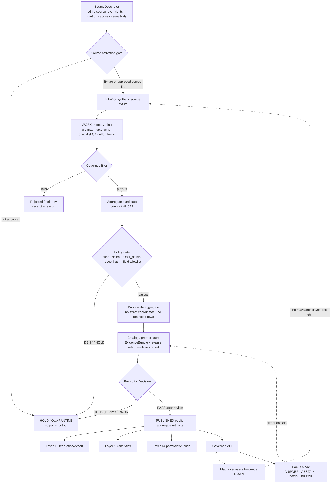

<!-- [KFM_META_BLOCK_V2]
doc_id: kfm://doc/TODO-register-ebird-architecture-uuid
title: eBird Architecture
type: standard
version: v1
status: draft
owners: TODO(fauna-source-stewards)
created: TODO(verify-original-created-date-or-set-on-first-commit)
updated: 2026-05-07
policy_label: TODO(verify-public-or-restricted)
related: ["../../README.md", "../../INGEST_EBIRD.md", "../../SOURCE_ROLES.md", "../../GEOPRIVACY.md", "../../VALIDATION.md", "EBIRD_CONTRACTS.md", "EBIRD_FEDERATION.md", "EBIRD_ANALYTICS.md", "EBIRD_PORTAL.md", "EBIRD_QUALITY_AND_TRIAGE.md", "../../../../runbooks/fauna/EBIRD_OPERATIONS.md", "../../../../../policy/fauna/ebird.rego", "../../../../../tests/connectors/fauna/test_kfm_ebird_layer10.py"]
tags: [kfm, fauna, ebird, architecture, occurrence-support, geoprivacy, public-aggregate]
notes: [Revises an existing short Layer 10 eBird architecture note; doc_id, owners, created date, and policy_label remain TODO until registry/steward verification; local workspace was not a mounted Git checkout, so repo-state claims are based on GitHub connector inspection and marked where needed.]
[/KFM_META_BLOCK_V2] -->

<a id="top"></a>

# eBird Architecture

Architecture, trust-boundary, and release guidance for KFM’s governed eBird occurrence-support lane.

<p>
  
  
  
  
  
  = 10" src="https://img.shields.io/badge/suppression-n_%3E%3D_10-b60205?style=flat-square">
  
</p>

> [!IMPORTANT]
> **Impact block**
>
> | Field | Value |
> |---|---|
> | Status | `draft` |
> | Target path | `docs/domains/fauna/sources/ebird/EBIRD_ARCHITECTURE.md` |
> | Primary role | Source-family architecture and trust-boundary guide for KFM eBird productization |
> | Source role | Occurrence support only; not legal-status authority |
> | Public geometry posture | No public exact coordinates; public artifacts are aggregate/generalized |
> | Runtime posture | No direct public source fetch; no credentials or API keys in docs, fixtures, public artifacts, portals, or Focus context |
> | Command posture | Command names are documented/test-referenced; executable path and packaging remain **NEEDS VERIFICATION** in a checked-out repo |
> | Quick jumps | [Scope](#scope) · [Repo fit](#repo-fit) · [Inputs](#inputs) · [Exclusions](#exclusions) · [Architecture flow](#architecture-flow) · [Layer map](#layer-map) · [Governed filter](#governed-filter) · [Policy contract](#policy-contract) · [Claim boundary](#claim-boundary) · [Runtime surfaces](#runtime-surfaces) · [Review checklist](#review-checklist) · [Open verification](#open-verification) |

---

## Scope

This file defines the **architecture** for KFM’s eBird source family: how eBird-derived occurrence support may move from governed source admission into synthetic tests, aggregate products, public-safe discovery/export, portal/download bundles, analytics, quality review, and bounded runtime consumption.

The existing short note identified the Layer 10 eBird productization rules. This revision keeps those rules and expands them into a maintainer-facing architecture document.

### Architecture position

eBird belongs in the fauna lane as **occurrence support**. It can help answer questions about reported bird observations and public aggregate support after filtering, rights review, sensitivity review, suppression, and release gates. It does **not** become:

- a legal-status authority;
- a complete census;
- proof of true absence;
- proof of abundance or occupancy;
- proof of population trend unless a separately governed model/product explicitly supports that claim;
- permission to expose exact coordinates;
- permission to fetch live source data from public UI or Focus Mode.

> [!WARNING]
> A public aggregate eBird artifact is a released KFM derivative. It is not raw eBird data, not a hidden exact-point layer, and not a shortcut around source terms, geoprivacy, evidence closure, or release review.

[Back to top](#top)

---

## Repo fit

This document is a human-facing source architecture file under `docs/`. It should explain the architecture and boundaries; it should not own raw data, machine schema authority, executable policy, generated reports, release proof objects, or credentials.

| Relationship | Status | Path / surface | Role |
|---|---:|---|---|
| This file | CONFIRMED target | `docs/domains/fauna/sources/ebird/EBIRD_ARCHITECTURE.md` | eBird source-family architecture |
| Fauna domain overview | CONFIRMED | [`../../README.md`](../../README.md) | Domain lifecycle, public safety, source roles, API/UI/AI boundary |
| eBird ingest hub | CONFIRMED | [`../../INGEST_EBIRD.md`](../../INGEST_EBIRD.md) | Ingest, governed filter, productization, command examples |
| Source-role doctrine | CONFIRMED | [`../../SOURCE_ROLES.md`](../../SOURCE_ROLES.md) | Claim/source compatibility |
| Geoprivacy posture | NEEDS VERIFICATION | [`../../GEOPRIVACY.md`](../../GEOPRIVACY.md) | Exact-location, generalization, redaction, and public geometry rules |
| Validation posture | NEEDS VERIFICATION | [`../../VALIDATION.md`](../../VALIDATION.md) | Human-readable validator and gate expectations |
| Layer 10 contracts | CONFIRMED | [`EBIRD_CONTRACTS.md`](EBIRD_CONTRACTS.md) | Productization contract summary and smoke commands |
| Layer 12 federation/export | CONFIRMED | [`EBIRD_FEDERATION.md`](EBIRD_FEDERATION.md) | Public-safe federation/discovery/export |
| Layer 13 analytics | CONFIRMED | [`EBIRD_ANALYTICS.md`](EBIRD_ANALYTICS.md) | Public aggregate analytics and claim-boundary guidance |
| Layer 14 portal/downloads | CONFIRMED | [`EBIRD_PORTAL.md`](EBIRD_PORTAL.md) | Static portal and download bundle manifests |
| Layer 21 quality/triage | CONFIRMED | [`EBIRD_QUALITY_AND_TRIAGE.md`](EBIRD_QUALITY_AND_TRIAGE.md) | Operational QA and triage-only posture |
| Operations runbook | CONFIRMED | [`../../../../runbooks/fauna/EBIRD_OPERATIONS.md`](../../../../runbooks/fauna/EBIRD_OPERATIONS.md) | Scan, trend, attest, evidence-pack, incident workflows |
| Policy gate | CONFIRMED | [`../../../../../policy/fauna/ebird.rego`](../../../../../policy/fauna/ebird.rego) | Public aggregate denial rules |
| Layer 10 connector smoke test | CONFIRMED | [`../../../../../tests/connectors/fauna/test_kfm_ebird_layer10.py`](../../../../../tests/connectors/fauna/test_kfm_ebird_layer10.py) | Documented CLI smoke/hash behavior |
| CLI executable path | NEEDS VERIFICATION | `tools/connectors/fauna/kfm-ebird-ingest/*` | Command family is documented/test-referenced; executable files must be confirmed in checkout |
| Source registry | NEEDS VERIFICATION | `data/registry/fauna/...` or repo-accepted equivalent | SourceDescriptor, rights, source-role, cadence, attribution, sensitivity |
| Machine schemas | NEEDS VERIFICATION | `schemas/contracts/v1/...` or repo-accepted equivalent | Machine-checkable shape after schema-home authority is confirmed |

### Directory Rules basis

`docs/domains/fauna/sources/ebird/` is appropriate because this is a **domain/source documentation path** under the human-facing control plane. eBird must not become a root-level topic folder. Machine validation, policy, tests, data lifecycle, and release objects belong under their responsibility roots.

[Back to top](#top)

---

## Inputs

Layered eBird architecture accepts only inputs that have a declared role, lifecycle stage, and safety posture.

| Input | Accepted? | Required posture |
|---|---:|---|
| Synthetic eBird-like fixtures | ✅ | Preferred first input for smoke, tests, red-team, and no-network proof slices |
| eBird source descriptor | ✅ | Must record source role, rights, citation, access class, credentials posture, cadence, sensitivity, and release constraints |
| Raw eBird Basic Dataset or API-derived observations | CONDITIONAL | RAW source material only; not public docs, not public runtime, not direct UI/Focus input |
| eBird API responses | CONDITIONAL | Governed source job only after key/terms/source descriptor review; not public runtime |
| eBird Status and Trends products | CONDITIONAL | Model/product support only; do not collapse into raw observation support |
| eBird Observation Dataset via GBIF-style publication | CONDITIONAL | Lower-support public occurrence discovery; sampling-event/effort limitations must remain visible |
| Released county aggregate artifacts | ✅ | Public-safe, suppression-gated, hash-addressed, no exact coordinate fields |
| Released HUC12 aggregate artifacts | ✅ | Public-safe, suppression-gated, hash-addressed, no exact coordinate fields |
| Federation/discovery/export indexes | ✅ | Public-safe only; no restricted rows, quarantine paths, or suppression internals |
| Catalog/proof/release metadata | ✅ | Used to resolve evidence, release identity, validation state, correction lineage, and rollback targets |
| Public analytics reports | ✅ | Descriptive only; must include interpretation warnings and evidence/release references |

### Minimum accepted public aggregate assertions

| Assertion | Required value |
|---|---|
| `public_safe` | `true` |
| `exact_points` | `restricted` |
| `policy_label` | `public_aggregate` |
| `aggregate` | `county` or `huc12` |
| `suppression_min_n` | `>= 10` |
| `kfm:spec_hash` | present and valid |
| coordinate fields | absent from public rows and public field allowlists |
| evidence support | resolvable release/proof/EvidenceBundle references where claims are made |
| interpretation warning | present in analytics, portal, download, consumer, and Focus-facing summaries |

[Back to top](#top)

---

## Exclusions

| Excluded material | Required handling | Why |
|---|---|---|
| eBird API keys, EBD request credentials, cookies, tokens, private URLs | Never commit; use secret manager or ignored local environment | Secrets do not belong in docs, tests, public bundles, portals, or Focus context |
| Raw EBD files or raw API captures in docs | Store only in governed lifecycle homes after source admission | RAW is not public documentation |
| Public exact coordinates | Deny | Public eBird products use aggregate/generalized support |
| Restricted observations | Deny from public outputs | Avoid sensitive-location and source-term leakage |
| Quarantine paths | Deny from public outputs | Quarantine is not published evidence |
| Suppression receipts and suppressed-group details | Deny from public outputs | Suppression internals can leak low-count or sensitive patterns |
| Legal-status claims from eBird | Deny unless separate legal/status authority evidence supports the claim | eBird is occurrence support in this lane |
| Occupancy, abundance, true absence, causal, complete-census, or population-trend claims | Deny or hold unless separately governed model/evidence supports them | Public aggregates alone do not carry those claims |
| Browser-to-source eBird fetch | Deny | Public runtime consumes released KFM artifacts through governed API |
| Direct model access to eBird data | Deny | AI is interpretive and evidence-bounded |
| Map popups as authoritative evidence | Deny | Evidence Drawer and EvidenceBundle are the trust surface |

[Back to top](#top)

---

## Architecture flow



### Flow rules

1. **Source admission comes first.** Source role, rights, access class, citation, sensitivity, and release constraints must be known before live source use.
2. **Synthetic fixtures come before live source activation.** No-network fixture proof is the safest first slice.
3. **The governed filter is not enough.** Passing effort/filter constraints does not make a row public-safe.
4. **Public aggregation is a release artifact.** It must carry spec hashes, suppression posture, policy state, evidence refs, and rollback path.
5. **Map/UI/AI consume released artifacts only.** Browser, MapLibre, portal, download, and Focus Mode must not pull raw eBird records or credentials.

[Back to top](#top)

---

## Layer map

| Layer | Surface | Status | Architecture role | Public-safety posture |
|---:|---|---:|---|---|
| 9 | [`../../../../runbooks/fauna/EBIRD_OPERATIONS.md`](../../../../runbooks/fauna/EBIRD_OPERATIONS.md) | CONFIRMED | Observability, scan, trend, attest, evidence pack, incident workflows | No published downloads, credentials, exact coordinates, quarantines, suppression receipts, or suppressed-group details |
| 10 | `EBIRD_ARCHITECTURE.md` | THIS FILE | Architecture and trust-boundary guide | Source role and public aggregate rules stay visible |
| 10 | [`EBIRD_CONTRACTS.md`](EBIRD_CONTRACTS.md) | CONFIRMED | Productization contract summary | No downloads, credentials, network calls, or public exact coordinates |
| 10 | [`../../INGEST_EBIRD.md`](../../INGEST_EBIRD.md) | CONFIRMED | Ingest/productization hub | Governed filter, public aggregate posture, command examples |
| 12 | [`EBIRD_FEDERATION.md`](EBIRD_FEDERATION.md) | CONFIRMED | Federation, discovery, semantic graph, public exports | County/HUC12 aggregate outputs only; no exact points |
| 13 | [`EBIRD_ANALYTICS.md`](EBIRD_ANALYTICS.md) | CONFIRMED | Descriptive public aggregate analytics and insight reports | No occupancy, abundance, absence, trend, causal, or census claims from public aggregates alone |
| 14 | [`EBIRD_PORTAL.md`](EBIRD_PORTAL.md) | CONFIRMED | Static portal and download bundle manifests | Built from already-public artifacts only; local assets; restrictive CSP |
| 18 | [`EBIRD_REDTEAM.md`](EBIRD_REDTEAM.md) | NEEDS VERIFICATION | Synthetic adversarial mutation corpus and red-team checks | Synthetic only; no real rows, credentials, network, or exact coordinates |
| 21 | [`EBIRD_QUALITY_AND_TRIAGE.md`](EBIRD_QUALITY_AND_TRIAGE.md) | CONFIRMED | Operational QA and triage | No network, credentials, real eBird data, or exact public coordinates |
| 26 | [`EBIRD_CONSUMER_INTEGRATION.md`](EBIRD_CONSUMER_INTEGRATION.md) | NEEDS VERIFICATION | Consumer handoff for public aggregate data | Must inherit warnings, hashes, policy labels, and validation refs |

[Back to top](#top)

---

## Governed filter

The Layer 10 governed checklist filter is:

```sql
complete = TRUE
AND protocol_type != 'Incidental'
AND duration_min >= 5
AND distance_km <= 5
AND number_observers <= 10
```

| Filter | Purpose | Failure outcome |
|---|---|---|
| `complete = TRUE` | Prefer complete checklist support over ambiguous partial support | Exclude or hold |
| `protocol_type != 'Incidental'` | Avoid weak protocol/effort support | Exclude from governed aggregate candidate |
| `duration_min >= 5` | Require minimum effort signal | Exclude or hold |
| `distance_km <= 5` | Keep checklist effort spatially bounded | Exclude from public aggregate candidate |
| `number_observers <= 10` | Avoid unusually large observer groups skewing support | Exclude or triage |

> [!CAUTION]
> Passing the governed filter does not authorize public release. Public release still requires rights review, source-role compatibility, geoprivacy, coordinate-field removal, suppression, catalog/proof closure, policy decision, review state, release manifest, and rollback target.

[Back to top](#top)

---

## Policy contract

The eBird policy contract centers on public aggregate safety.

| Contract rule | Required outcome |
|---|---|
| `kfm:spec_hash` | Must be present and match `sha256:<64 lowercase hex>` |
| `suppression_min_n` | Must be `>= 10` |
| `aggregate` | Must be `county` or `huc12` where policy applies |
| public `exact_points` | Must be `restricted` |
| public coordinate fields | Must be absent from rows and allowlists |
| public aggregate `policy_label` | Must be `public_aggregate` |
| public aggregate `checklist_count` | Must be `>= suppression_min_n` |
| `PromotionReceipt` | Must be `public_aggregate` and `public_safe=true` when promoted as public aggregate |
| `CatalogRecord` | Must keep `exact_points=restricted` |
| `PipelineManifest` | Must keep `public_safe_final_outputs=true` and `exact_points=restricted` |
| `ValidationReport` | Must not be `fail` for promoted/public run |
| critical public-safety finding | Must block gate and transparency pass |
| audit response packet | Cannot pass while critical findings remain unresolved |

### Contract hash recipe

```text
contract_hash = sha256(canonical_json(contract_payload_without_generated_at_or_contract_hash))
```

The recipe intentionally excludes volatile fields such as `generated_at` and `contract_hash` from the contract hash input.

[Back to top](#top)

---

## Claim boundary

eBird-derived public artifacts are descriptive occurrence-support artifacts. They do not become stronger biological or legal claims unless a separate governed evidence model supports that claim.

| Safe statement | Unsafe statement |
|---|---|
| “The released public aggregate includes `N` checklists for this county/time window after filtering and suppression.” | “There were `N` bird populations in this county.” |
| “The public aggregate reports `N` taxa after filtering and suppression.” | “Species richness is exactly `N`.” |
| “The release changed between version A and version B.” | “The population increased.” |
| “Public aggregate coverage is sparse for this HUC12.” | “The species is absent from this HUC12.” |
| “This source supports occurrence-derived public aggregate reporting.” | “This source is legal status authority.” |
| “No exact observations or restricted records are included in this public artifact.” | “Suppressed details are available in the public bundle.” |
| “The result reflects a governed filter and suppression policy.” | “The result is a complete census.” |

### Required interpretation warning

Use this warning, or a steward-approved equivalent, in public reports, portals, downloads, consumer handoffs, chart captions, and Focus-facing summaries:

> This eBird output is descriptive public aggregate reporting only. It does not show exact observations, does not include restricted records, and must not be interpreted as occupancy, abundance, true absence, population trend, causal effect, or a complete species census.

[Back to top](#top)

---

## Rights, terms, and source activation

Live eBird source activation is **NEEDS VERIFICATION** until the source descriptor and terms review are complete.

### Source activation checklist

- [ ] Source role is recorded as occurrence support.
- [ ] Terms of use and allowed use are recorded.
- [ ] Citation/acknowledgement requirements are recorded.
- [ ] Credentials are kept out of docs, fixtures, public bundles, portals, and committed config.
- [ ] Data products and API endpoints are separated by source class.
- [ ] Record-level or product-level license constraints are represented where applicable.
- [ ] Redistribution limits are represented.
- [ ] Public aggregate release is allowed by source terms or explicitly reviewed.
- [ ] Sensitive/geoprivacy posture is recorded.
- [ ] Source cadence and retrieval/update time are recorded.
- [ ] SourceActivationDecision or equivalent release gate exists before live jobs run.

### Source class posture

| Source class | Default KFM posture |
|---|---|
| eBird API | Governed source job only; API token/key must not appear in docs or public runtime |
| eBird Basic Dataset | RAW source snapshot only after request/approval/terms review; not public runtime |
| eBird Status and Trends | Model/product support class; not raw observation proof |
| eBird Observation Dataset via public aggregator | Discovery/public occurrence support with known limitations; not sampling-effort equivalent |
| Synthetic eBird fixtures | Safe first implementation/test path |

[Back to top](#top)

---

## Runtime surfaces

### Command families

The current documentation names the following command families. Treat them as **documented command contracts** until executable paths, packaging, and CI invocation are verified in a checkout.

| Command family | Status | Intended role |
|---|---:|---|
| `ingest` | DOCUMENTED / NEEDS VERIFICATION | Source-to-lifecycle intake |
| `aggregate` | DOCUMENTED / NEEDS VERIFICATION | County/HUC12 public aggregate candidate building |
| `promote` | DOCUMENTED / NEEDS VERIFICATION | Promotion candidate handling |
| `build-public-view` | DOCUMENTED / NEEDS VERIFICATION | Public-safe aggregate/materialized view building |
| `run-pipeline` | DOCUMENTED / NEEDS VERIFICATION | Plan/execute eBird pipeline |
| `release-ops` | DOCUMENTED / NEEDS VERIFICATION | Release and rollback operations |
| `observe` | DOCUMENTED / NEEDS VERIFICATION | Scan, trend, attest, evidence-pack, incident workflows |
| `doctor` | DOCUMENTED / TEST-REFERENCED / NEEDS VERIFICATION | Local adapter health/smoke report |
| `conformance` | DOCUMENTED / TEST-REFERENCED / NEEDS VERIFICATION | Local conformance report over aggregates/output formats |

### Smoke commands

Run these only from a verified checkout where executable paths are confirmed.

```bash
tools/connectors/fauna/kfm-ebird-ingest/kfm-ebird-doctor \
  --strict \
  --json
```

```bash
tools/connectors/fauna/kfm-ebird-ingest/kfm-ebird-conformance \
  --aggregate both \
  --format jsonl \
  --json
```

> [!NOTE]
> The command names and expected smoke behavior are documented and test-referenced. The physical executable files and package installation path require checkout verification before this file should label them CONFIRMED implementation.

[Back to top](#top)

---

## API, UI, and Focus Mode boundary

| Surface | Required posture |
|---|---|
| Governed API | Serves released public aggregate artifacts and public-safe evidence payloads only |
| MapLibre layer | Reads released layer manifests/public tiles only; never raw eBird rows or credentials |
| Evidence Drawer | Shows source role, aggregate unit, release ID, policy state, evidence refs, limitations, stale/correction state |
| Focus Mode | Uses released public-safe EvidenceBundles only; returns `ANSWER`, `ABSTAIN`, `DENY`, or `ERROR` |
| Portal/downloads | Built from already-public artifacts only; no trackers, remote scripts, credentials, or exact coordinates |
| Consumer handoff | Inherits warnings, hashes, policy labels, validation refs, and correction lineage |
| Review/QA | Can inspect validation and audit artifacts without exposing restricted rows in public outputs |

### Runtime outcomes

| Outcome | Meaning |
|---|---|
| `ANSWER` | Released aggregate evidence supports a public-safe descriptive response |
| `ABSTAIN` | Evidence is insufficient, stale, ambiguous, or outside the supported claim boundary |
| `DENY` | Policy, rights, sensitivity, exact-location, source-role, or release-state rules forbid response |
| `ERROR` | Tooling, schema, integrity, resolver, or runtime failure prevents a reliable answer |

### Evidence Drawer minimum payload

| Field family | Requirement |
|---|---|
| Source role | eBird shown as occurrence support |
| Aggregate unit | County, HUC12, or approved public-safe unit |
| Filter/suppression | Governed filter and `suppression_min_n` visible |
| Evidence support | EvidenceBundle or release/proof references |
| Public geometry | `exact_points=restricted` and no exact-coordinate fields |
| Policy posture | `public_aggregate`, rights/citation state, validation state |
| Limitations | Not legal status, not complete census, not true absence, not trend/causality |
| Correction lineage | Current/superseded/withdrawn state when applicable |

[Back to top](#top)

---

## Public artifact field allowlist

Public eBird aggregate artifacts should expose only fields needed for public-safe interpretation.

| Field family | Public posture |
|---|---|
| Aggregate identifier | Allowed: county, HUC12, or approved public-safe summary ID |
| Aggregate type | Allowed |
| Time bucket/window | Allowed when not revealing restricted observation precision |
| Public checklist count | Allowed after suppression |
| Reported public taxon count | Allowed with caveats |
| Release ID | Allowed and recommended |
| `kfm:spec_hash` | Required for public aggregate outputs |
| Evidence/release refs | Allowed when public-safe |
| Exact latitude/longitude | Denied |
| Raw geometry/point fields | Denied |
| Private locality/observer-sensitive fields | Denied |
| Quarantine paths | Denied |
| Suppression receipts or suppressed-group details | Denied |
| Credentials/tokens/private URLs | Denied |

[Back to top](#top)

---

## Validation gates

| Gate | Outcome on failure | Check |
|---|---:|---|
| Source descriptor gate | HOLD | Source role, rights, citation, cadence, sensitivity, and access class recorded |
| Live source activation gate | DENY/HOLD | No live fetch without source activation decision |
| Governed filter gate | HOLD/EXCLUDE | Checklist row meets Layer 10 filter requirements |
| Aggregate unit gate | DENY | Public aggregate must use `county` or `huc12` unless policy/docs are updated |
| Suppression gate | DENY | `suppression_min_n >= 10` and row count threshold satisfied |
| Exact-points gate | DENY | Public artifact keeps `exact_points=restricted` |
| Coordinate allowlist gate | DENY | Public fields do not include coordinate or geometry fields |
| Policy label gate | DENY | Public aggregate output uses `policy_label=public_aggregate` |
| Spec hash gate | DENY | Valid `kfm:spec_hash` exists |
| Restricted data gate | DENY | No restricted observations, quarantine paths, suppression internals, or exact points |
| Evidence gate | ABSTAIN/HOLD | Claims resolve to released evidence/proof/EvidenceBundle references |
| Claim-boundary gate | HOLD | Unsafe inference language is removed or rewritten |
| Correction/rollback gate | HOLD | Superseded artifacts carry correction lineage and rollback targets |

[Back to top](#top)

---

## Review checklist

Before changing this architecture file, related eBird docs, policy, validators, pipeline commands, or public artifacts, verify:

- [ ] Metadata block placeholders remain intentional or are replaced with registry-confirmed values.
- [ ] Any new relative link exists or is marked `NEEDS VERIFICATION`.
- [ ] eBird is described as occurrence support, not legal-status authority.
- [ ] No example includes real credentials, API keys, cookies, tokens, or private URLs.
- [ ] No example includes exact sensitive coordinates.
- [ ] Local smoke examples remain no-network unless explicitly marked otherwise.
- [ ] The governed filter is unchanged or policy/tests/docs are updated together.
- [ ] Public aggregates remain county/HUC12 unless policy and docs deliberately change.
- [ ] `suppression_min_n >= 10` remains enforced.
- [ ] Public outputs keep `exact_points=restricted`.
- [ ] Public aggregate rows and allowlists exclude coordinate/geometry fields.
- [ ] `kfm:spec_hash` remains required.
- [ ] Public artifacts include interpretation warnings.
- [ ] Portal/download/consumer outputs inherit warnings and validation refs.
- [ ] Focus Mode returns `ABSTAIN` or `DENY` for unsupported or policy-blocked claims.
- [ ] Source terms and citation posture are reviewed before live source activation.
- [ ] Critical public-safety findings block public promotion.
- [ ] Correction, withdrawal, and rollback paths remain visible.

[Back to top](#top)

---

## Open verification

| Item | Status | Needed proof |
|---|---:|---|
| Registered `doc_id` | TODO | Document registry entry |
| Owners | TODO | CODEOWNERS, steward register, or source-lane owner assignment |
| Created date | TODO | Git history or steward-approved first-commit date |
| Policy label | TODO | Repo policy classification |
| eBird source descriptor | NEEDS VERIFICATION | Registry entry with role, rights, citation, access class, cadence, sensitivity, allowed uses |
| Live source activation | NEEDS VERIFICATION | SourceActivationDecision or equivalent |
| CLI executable paths | NEEDS VERIFICATION | Actual executable files, package scripts, or installed entrypoints |
| CLI packaging | NEEDS VERIFICATION | Confirm command installation and invocation from CI/local checkout |
| Full CI enforcement | UNKNOWN | Workflow evidence and check results |
| Policy runner | NEEDS VERIFICATION | OPA/Conftest/Rego or repo-native policy runner command |
| Schema home | NEEDS VERIFICATION | Accepted ADR or repo convention |
| Public release object family | NEEDS VERIFICATION | ReleaseManifest / PromotionReceipt / ProofPack conventions |
| eBird terms/citation review | NEEDS VERIFICATION | Current source terms, citation instructions, redistribution limits, downstream-use limits |
| Portal/consumer inheritance checks | NEEDS VERIFICATION | Tests proving warnings, hashes, validation refs, and policy labels propagate |
| Red-team corpus status | NEEDS VERIFICATION | Synthetic-only mutation corpus, no real rows, no credentials, no exact coordinates |

[Back to top](#top)

---

## Appendix

<details>
<summary>Negative fixture ideas</summary>

| Fixture | Expected result |
|---|---|
| `ebird_public_row_contains_latitude.json` | `DENY` |
| `ebird_public_row_contains_geometry.json` | `DENY` |
| `ebird_public_allowlist_contains_lon.json` | `DENY` |
| `ebird_suppression_min_5.json` | `DENY` |
| `ebird_public_aggregate_missing_spec_hash.json` | `DENY` |
| `ebird_public_aggregate_bad_spec_hash.json` | `DENY` |
| `ebird_public_aggregate_policy_label_public.json` | `DENY` unless policy intentionally changes |
| `ebird_checklist_count_below_threshold.json` | `DENY` |
| `ebird_live_fetch_without_source_activation.json` | `DENY` or `HOLD` |
| `ebird_occurrence_support_as_legal_authority.json` | `DENY` |
| `ebird_focus_exact_location_request.json` | `DENY` |
| `ebird_focus_absence_claim_from_missing_aggregate.json` | `ABSTAIN` |
| `ebird_analytics_population_trend_wording.md` | `HOLD` |
| `ebird_portal_remote_script.html` | `DENY` |
| `ebird_public_bundle_includes_suppression_receipt.json` | `DENY` |

</details>

<details>
<summary>Maintainer update triggers</summary>

Update this architecture file when any of the following changes:

- eBird source role;
- eBird source terms, citation posture, or redistribution posture;
- governed filter;
- suppression threshold;
- aggregate unit vocabulary;
- public field allowlist;
- public geometry class;
- contract hash recipe;
- `kfm:spec_hash` rules;
- public aggregate object type;
- CLI command names or executable paths;
- policy file behavior;
- validation runner behavior;
- portal/download contract;
- analytics claim-boundary wording;
- consumer handoff contract;
- red-team fixture families;
- source activation workflow;
- release/rollback/correction procedure;
- Evidence Drawer payload contract;
- Focus Mode response contract.

</details>

<details>
<summary>KFM PR review card for eBird architecture changes</summary>

| Field | Review entry |
|---|---|
| Goal | TODO |
| Owning root(s) | `docs/`, plus any changed responsibility roots |
| Directory Rules basis | Domain/source docs under `docs/domains/fauna/sources/ebird/` |
| Object families affected | TODO |
| Contracts changed | TODO |
| Schemas changed | TODO |
| Fixtures added/updated | TODO |
| Policy gates affected | TODO |
| Public exposure possible? | yes/no |
| EvidenceRef/EvidenceBundle impact | TODO |
| Release/correction/rollback impact | TODO |
| Validation commands run | TODO |
| Known UNKNOWN / NEEDS VERIFICATION | TODO |
| Rollback plan | TODO |

</details>

[Back to top](#top)