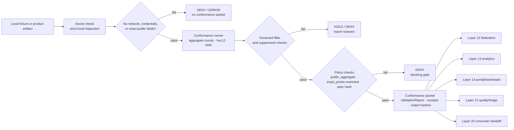

<!-- [KFM_META_BLOCK_V2]
doc_id: kfm://doc/TODO-register-ebird-conformance-uuid
title: eBird Layer 10 Conformance and Acceptance
type: standard
version: v1
status: draft
owners: TODO(fauna-domain-stewards)
created: TODO(verify-original-created-date-or-set-on-first-commit)
updated: 2026-05-07
policy_label: TODO(verify-public-or-restricted)
related: ["../../README.md", "../../SOURCE_ROLES.md", "../../GEOPRIVACY.md", "../../VALIDATION.md", "EBIRD_CONTRACTS.md", "EBIRD_FEDERATION.md", "EBIRD_MAINTENANCE.md", "EBIRD_PORTAL.md", "EBIRD_ANALYTICS.md", "EBIRD_QUALITY_AND_TRIAGE.md", "EBIRD_REDTEAM.md", "../../../../runbooks/fauna/EBIRD_OPERATIONS.md", "../../../../../policy/fauna/ebird.rego", "../../../../../tests/fauna/test_ebird_pipeline.py"]
tags: [kfm, fauna, ebird, conformance, public-aggregate, geoprivacy, validation, release-gates]
notes: [Revised from existing Layer 10 conformance note; doc_id, owners, created date, and policy_label remain TODO until document registry and steward verification.]
[/KFM_META_BLOCK_V2] -->

<a id="top"></a>

# eBird Layer 10 Conformance and Acceptance

Local-only acceptance guidance for `kfm-ebird` productization: conformance proves public-safe aggregate behavior, not live source activation or ecological truth.

<p>
  
  
  
  
  
  
  
</p>

> [!IMPORTANT]
> **Status:** draft  
> **Owners:** `TODO(fauna-domain-stewards)`  
> **Target path:** `docs/domains/fauna/sources/ebird/EBIRD_CONFORMANCE.md`  
> **Operating posture:** no download, no credentials, no network calls, no public exact coordinates, and no public promotion without public aggregate policy gates.  
> **Quick jumps:** [Scope](#scope) · [Repo fit](#repo-fit) · [Inputs](#inputs) · [Exclusions](#exclusions) · [Conformance standard](#conformance-standard) · [Governed filter](#governed-filter) · [Hash contract](#hash-contract) · [Acceptance flow](#acceptance-flow) · [Gate matrix](#gate-matrix) · [CLI contract](#cli-contract) · [Outputs](#outputs) · [Review checklist](#review-checklist) · [Open verification](#open-verification)

---

## Scope

Layer 10 conformance is the local acceptance surface for `kfm-ebird` productization. It verifies that eBird-derived KFM artifacts remain public-safe, aggregate-only, hashable, policy-gated, and suitable for downstream federation, analytics, portal, consumer, quality, and audit workflows.

Layer 10 does **not** activate eBird as a live source. It does **not** grant permission to download source data. It does **not** approve credentials. It does **not** certify ecological abundance, occupancy, population trend, true absence, or legal status.

### Layer 10 is allowed to

- validate local `kfm-ebird` output packets, manifests, reports, and public aggregate artifacts;
- confirm that public outputs keep `exact_points=restricted`;
- verify that aggregate outputs use `county`, `huc12`, or an explicitly approved local aggregate mode;
- verify suppression, field allowlists, policy labels, hashes, receipts, and validation reports;
- run local smoke checks through `doctor` and `conformance` commands;
- produce machine-readable conformance results for review, release dry-run, and downstream consumer certification;
- block public handoff when required gates fail.

### Layer 10 is not allowed to

- download eBird data;
- request, store, echo, or validate credentials, API keys, tokens, cookies, or private URLs;
- expose exact coordinates, raw observation fields, restricted observations, quarantines, suppression receipts, or suppressed-group details;
- treat public aggregates as legal-status authority;
- treat aggregate counts as true abundance, occupancy, absence, population trend, or complete census;
- allow browser display, portal packaging, analytics, Focus Mode, or consumer exports to bypass policy and evidence checks.

> [!WARNING]
> A conformance pass means “this local artifact satisfied the Layer 10 public-safety and contract checks for the tested scope.” It does **not** mean the external source terms, current eBird access rules, or production steward approvals are verified.

[Back to top](#top)

---

## Repo fit

| Relationship | Status | Path / surface | Role |
|---|---:|---|---|
| This document | CONFIRMED target | `docs/domains/fauna/sources/ebird/EBIRD_CONFORMANCE.md` | Layer 10 source-specific conformance and local acceptance rules. |
| Fauna domain landing page | CONFIRMED | [`../../README.md`](../../README.md) | Defines fauna lifecycle, public safety, source roles, APIs, and review gates. |
| Fauna source roles | CONFIRMED | [`../../SOURCE_ROLES.md`](../../SOURCE_ROLES.md) | Defines role/claim compatibility and aggregator caution. |
| Fauna geoprivacy | CONFIRMED | [`../../GEOPRIVACY.md`](../../GEOPRIVACY.md) | Owns exact-location denial and public geometry rules. |
| Fauna validation | CONFIRMED | [`../../VALIDATION.md`](../../VALIDATION.md) | Owns validation gate vocabulary and fixture-first posture. |
| Layer 10 contract note | CONFIRMED adjacent | [`EBIRD_CONTRACTS.md`](EBIRD_CONTRACTS.md) | Carries the original Layer 10 productization bullets and smoke commands. |
| Operations runbook | CONFIRMED adjacent | [`../../../../runbooks/fauna/EBIRD_OPERATIONS.md`](../../../../runbooks/fauna/EBIRD_OPERATIONS.md) | Defines Layer 9 observability handoff and Layer 10 smoke handoff. |
| Layer 12 federation | CONFIRMED adjacent | [`EBIRD_FEDERATION.md`](EBIRD_FEDERATION.md) | Consumes public-safe aggregate outputs after conformance. |
| Layer 13 analytics | CONFIRMED adjacent | [`EBIRD_ANALYTICS.md`](EBIRD_ANALYTICS.md) | Consumes conformance-proven public aggregate artifacts for descriptive analytics. |
| Layer 14 portal/downloads | CONFIRMED adjacent | [`EBIRD_PORTAL.md`](EBIRD_PORTAL.md) | Consumes public-safe bundles after validation. |
| Layer 21 quality/triage | CONFIRMED adjacent | [`EBIRD_QUALITY_AND_TRIAGE.md`](EBIRD_QUALITY_AND_TRIAGE.md) | Operational QA and triage only. |
| eBird policy gate | CONFIRMED | [`../../../../../policy/fauna/ebird.rego`](../../../../../policy/fauna/ebird.rego) | Enforces public aggregate and exact-point denial rules. |
| Pipeline smoke test | CONFIRMED | [`../../../../../tests/fauna/test_ebird_pipeline.py`](../../../../../tests/fauna/test_ebird_pipeline.py) | Exercises local pipeline plan and execute behavior against fixtures. |

> [!NOTE]
> This is a human-facing documentation file under `docs/`. It may describe contract expectations, but it must not become the canonical home for executable policy, schemas, generated reports, proof packs, raw source data, or credentials.

[Back to top](#top)

---

## Inputs

Layer 10 conformance accepts local files and local command outputs only.

| Input | Accepted? | Required posture |
|---|---:|---|
| Synthetic eBird fixture rows | ✅ | Clearly fixture-only; no real credentials or sensitive exact public outputs. |
| Local EBD-like test file | ✅ | Local path only; no download behavior; must pass governed filter before public aggregate outputs are accepted. |
| `PipelinePlan` | ✅ | Must keep `suppression_min_n >= 10`; should be safe to inspect without source credentials. |
| `PipelineManifest` | ✅ | Must declare public-safe final outputs and restricted exact points. |
| County aggregate output | ✅ | Must be public aggregate, suppression-gated, field-allowlisted, and hashable. |
| HUC12 aggregate output | ✅ | Same as county aggregate; no exact coordinates or reverse-engineering fields. |
| Public view output | ✅ | Must expose only public-safe fields and no restricted geometry. |
| Catalog record | ✅ | Must preserve `exact_points=restricted` for public eBird aggregate catalog surfaces. |
| Promotion receipt | ✅ | Must use `policy_label=public_aggregate` and `public_safe=true`. |
| Validation report | ✅ | Must not have `status=fail` for promoted or public candidate outputs. |
| Doctor/conformance JSON output | ✅ | Used as local acceptance evidence; must not include secrets or restricted coordinates. |
| Release or observability receipt | ✅ | Local audit support only; no public exact details or suppression internals. |

### Minimum accepted public aggregate assertions

| Assertion | Required value |
|---|---|
| `public_safe` | `true` |
| `exact_points` | `restricted` |
| `policy_label` | `public_aggregate` |
| `aggregate` | `county` or `huc12` unless explicitly approved by policy and docs |
| `suppression_min_n` | `>= 10` |
| `kfm:spec_hash` | `sha256:<64 lowercase hex characters>` |
| coordinate field allowlist | no `decimalLatitude`, `decimalLongitude`, `latitude`, `longitude`, `lat`, `lon`, `point`, `geom`, `geometry`, or equivalent exact-coordinate fields |
| interpretation warning | present where output is consumed by reports, portals, analytics, exports, or Focus Mode |

[Back to top](#top)

---

## Exclusions

| Excluded material | Handling | Reason |
|---|---|---|
| Live eBird downloads | Excluded from Layer 10 conformance | Source activation, terms, credentials, quota, and access are separate governed decisions. |
| Credentials, API keys, tokens, private URLs, cookies | Never commit, request, or print | Secrets must not appear in docs, fixtures, logs, reports, or conformance output. |
| RAW source-native rows in public output | Deny public handoff | Public consumers receive aggregate, field-allowlisted artifacts only. |
| Exact coordinates | Deny public handoff | Public eBird aggregate products require `exact_points=restricted`. |
| Restricted observations | Excluded from public artifacts | Restricted records cannot be surfaced through public docs, API, map, portal, search, graph, or Focus Mode. |
| Quarantine paths | Excluded from public artifacts | Quarantine is not public evidence. |
| Suppression receipts and suppressed-group details | Excluded from public outputs | Suppression internals can leak sensitive or low-count information. |
| Public claim of abundance, occupancy, absence, trend, causality, or census | Deny or rewrite as descriptive aggregate language | Layer 10 validates public aggregate safety, not ecological inference. |
| Legal-status assertions | Deny unless supported by a compatible legal/status authority | eBird-derived aggregate evidence is not legal-status authority. |
| Direct model output | Never accepted as conformance evidence | AI output must remain downstream of released evidence, policy, and citation validation. |

[Back to top](#top)

---

## Conformance standard

A Layer 10 artifact is conformant only when it passes all required checks for the requested scope.

### Conformance means

| Requirement | Meaning |
|---|---|
| Local-only | Commands run against local fixtures or local product artifacts; no network or credential access. |
| Public aggregate | Public artifacts are aggregated and suppression-gated. |
| Exact points restricted | Public outputs cannot expose exact point coordinates or coordinate-derived fields. |
| Governed filter applied | Public aggregate candidates are derived only from records passing the governed checklist filter. |
| Hash recipe stable | Contract hashes are deterministic and ignore only allowed volatile fields. |
| Policy gates pass | Public aggregate, layer, manifest, receipt, validation, and audit gates return no blocking denials. |
| Evidence/release handoff preserved | Downstream federation, analytics, portal, and consumer layers can trace conformance evidence. |
| Negative states visible | `DENY`, `HOLD`, `ABSTAIN`, and `ERROR` are valid outcomes, not documentation failures. |
| Rollback/correction compatible | Conformance output can be superseded, corrected, withdrawn, or rolled back without silent replacement. |

### Conformance does not mean

| Misread | Correct interpretation |
|---|---|
| “The source is approved for production use.” | Source activation remains separate. |
| “The data can be downloaded.” | Layer 10 forbids download behavior. |
| “The map can show exact observations.” | Exact public coordinates remain restricted. |
| “Counts prove abundance or trend.” | Counts describe released aggregate artifacts only. |
| “Policy passed forever.” | Policy is tied to a tested artifact, policy version, release scope, and review state. |
| “External terms are current.” | Source terms require fresh verification before activation. |

[Back to top](#top)

---

## Governed filter

Layer 10 preserves the existing governed filter:

```sql
complete = TRUE
AND protocol_type != 'Incidental'
AND duration_min >= 5
AND distance_km <= 5
AND number_observers <= 10
```

### Filter obligations

| Field | Required behavior | Failure |
|---|---|---|
| `complete` | Must be true. | Exclude from public aggregate candidate set. |
| `protocol_type` | Must not be `Incidental`. | Exclude from public aggregate candidate set. |
| `duration_min` | Must be `>= 5`. | Exclude or fail validation depending artifact stage. |
| `distance_km` | Must be `<= 5`. | Exclude or fail validation depending artifact stage. |
| `number_observers` | Must be `<= 10`. | Exclude or fail validation depending artifact stage. |
| Missing required filter field | Must not silently pass. | `HOLD`, `DENY`, or `ERROR` depending schema/tool stage. |

> [!CAUTION]
> Filtering is not source-rights review, sensitivity review, or ecological inference. It only narrows which local fixture/product records may support public aggregate outputs.

[Back to top](#top)

---

## Hash contract

Layer 10 keeps the existing contract hash rule:

> Compute `contract_hash` as `sha256` over canonical JSON, excluding `generated_at` and `contract_hash`.

### Hash rules

| Rule | Required behavior |
|---|---|
| Canonicalization | Use repo-approved canonical JSON serialization. |
| Excluded fields | Exclude `generated_at` and `contract_hash`. |
| Included policy fields | Include policy-relevant fields such as `aggregate`, `suppression_min_n`, `policy_label`, `public_safe`, `exact_points`, `allowlist_fields`, input refs, output refs, and validation refs. |
| Stable output | Same semantic input produces same hash. |
| Hash format | Use `sha256:<64 lowercase hex characters>` where policy expects `kfm:spec_hash`. |
| Failure | Missing, malformed, or mismatched hash blocks public aggregate promotion. |

### Fields that must not be excluded casually

- `policy_label`
- `public_safe`
- `exact_points`
- `suppression_min_n`
- `aggregate`
- `allowlist_fields`
- source/product input references
- release references
- validation references
- correction or supersession references
- redaction/generalization references

[Back to top](#top)

---

## Acceptance flow



### Flow rules

1. Conformance starts from local inputs.
2. Doctor checks should catch obvious local contract and safety defects before full conformance.
3. Conformance output must be machine-readable enough for CI, review, release dry-run, audit response, and consumer handoff.
4. Failed conformance should emit reasons without leaking exact coordinates, credentials, suppression internals, or quarantine details.
5. Downstream layers inherit Layer 10 warnings, policy state, hashes, and validation references.

[Back to top](#top)

---

## Gate matrix

| Gate | Outcome on failure | Required check |
|---|---:|---|
| Local-only gate | `DENY` / `ERROR` | Command and artifact handling must not perform downloads, network access, or credential use. |
| Secret hygiene gate | `DENY` | No token, key, credential, cookie, or private URL in inputs, outputs, logs, reports, or docs. |
| Governed filter gate | `HOLD` / `DENY` | Public aggregate candidate rows must pass the governed filter. |
| Aggregate unit gate | `DENY` | Public aggregate output uses `county` or `huc12` unless docs and policy deliberately admit another aggregate. |
| Suppression gate | `DENY` | `suppression_min_n >= 10`; public rows do not publish below threshold. |
| Exact-point gate | `DENY` | Public layers and aggregate artifacts keep `exact_points=restricted`. |
| Coordinate allowlist gate | `DENY` | Public fields exclude exact coordinate and geometry names. |
| Policy-label gate | `DENY` | Public aggregate rows use `policy_label=public_aggregate`. |
| Spec-hash gate | `DENY` | `kfm:spec_hash` exists and matches required `sha256:<64 lowercase hex>` format. |
| Public-safe manifest gate | `DENY` | `PipelineManifest.public_safe_final_outputs=true`. |
| Validation report gate | `DENY` | `ValidationReport.status` is not `fail` for promoted/public candidate output. |
| Catalog exact-point gate | `DENY` | `CatalogRecord.exact_points=restricted`. |
| Promotion receipt gate | `DENY` | `PromotionReceipt.policy_label=public_aggregate` and `public_safe=true`. |
| Certification gate | `DENY` | Approved certification packet cannot contain failed hard gates. |
| Audit response gate | `DENY` | A passing audit response cannot leave critical findings unresolved. |
| Correction/takedown safety gate | `DENY` | Public workflows must not request credentials or exact private locations. |
| Critical finding gate | `DENY` | Critical public-safety findings must block conformance/transparency pass. |
| Evidence handoff gate | `HOLD` / `ABSTAIN` | Public claim-bearing outputs must carry validation/evidence/release refs adequate for the requested downstream use. |
| Correction lineage gate | `HOLD` | Superseding a conformance packet must preserve prior ID/hash/release context and correction notes. |

[Back to top](#top)

---

## CLI contract

The existing Layer 10 note names these CLI families for `kfm-ebird` productization:

| CLI family | Role |
|---|---|
| `ingest` | Local fixture/product intake and normalization entrypoint. |
| `aggregate` | Aggregate output builder. |
| `promote` | Promotion or promotion-candidate support. |
| `build-public-view` | Public-safe aggregate view builder. |
| `run-pipeline` | End-to-end local plan/execute pipeline entrypoint. |
| `release-ops` | Release operation support. |
| `observe` | Observability and evidence-pack workflows. |
| `doctor` | Local strict health/safety/smoke check. |
| `conformance` | Layer 10 acceptance and conformance check. |

### Smoke commands

```bash
tools/connectors/fauna/kfm-ebird-ingest/kfm-ebird-doctor \
  --strict \
  --json
```

```bash
tools/connectors/fauna/kfm-ebird-ingest/kfm-ebird-conformance \
  --aggregate both \
  --format jsonl \
  --json
```

### Pipeline smoke expectation

A local pipeline smoke should be able to:

1. produce a `PipelinePlan`;
2. execute against fixture input;
3. emit a `PipelineManifest`;
4. pass the pipeline-run validator;
5. write public-safe outputs only to test/published paths;
6. avoid MapLibre/public release side effects unless explicitly requested and gated.

> [!NOTE]
> Executable paths are treated as current repo evidence only after direct checkout verification. This document preserves known command names and intended behavior, but conformance must still be proven by CI or local command output.

[Back to top](#top)

---

## Outputs

Layer 10 should emit or validate conformance outputs that are safe to retain as audit/review evidence.

| Output | Public? | Required controls |
|---|---:|---|
| `ebird_doctor_report.json` | Review/public-safe summary | No secrets, no exact coordinates, no raw/private source payloads. |
| `ebird_conformance.jsonl` | Review/public-safe summary | One record per checked artifact or gate; reason codes on failures. |
| `ebird_conformance_summary.json` | Review/public-safe summary | Overall outcome, checked refs, blocking failures, warnings, and hashes. |
| `ValidationReport` | Review/public depending fields | Must not include restricted rows, suppression internals, or quarantine details if public. |
| `PipelinePlan` | Review | No credential or live-download requirement. |
| `PipelineManifest` | Review/public-safe summary | `public_safe_final_outputs=true`; `exact_points=restricted`. |
| `PromotionReceipt` | Review/audit | `policy_label=public_aggregate`; `public_safe=true`; no restricted content. |
| `CatalogRecord` | Public-safe after release | `exact_points=restricted`; evidence/release refs preserved. |
| `ConformancePacket` | Review/audit | Bundle of reports, receipts, hashes, and gate outcomes. |
| `AuditResponsePacket` | Review/audit | Cannot pass while critical unresolved findings remain. |
| `ConsumerCertificationPacket` | Review/public-safe summary | Approved packet cannot include failed hard gates. |

### Illustrative conformance summary

```json
{
  "object_type": "KfmEbirdConformanceSummary",
  "layer": 10,
  "source_family": "ebird",
  "status": "HOLD",
  "aggregate": "both",
  "public_safe": true,
  "exact_points": "restricted",
  "policy_label": "public_aggregate",
  "suppression_min_n": 10,
  "checked_artifacts": [
    "PipelinePlan",
    "PipelineManifest",
    "AggregateOccurrence",
    "CatalogRecord",
    "PromotionReceipt",
    "ValidationReport"
  ],
  "blocking_failures": [],
  "warnings": [
    "External eBird terms and source activation remain NEEDS VERIFICATION."
  ],
  "evidence_refs": [
    "TODO"
  ],
  "validation_refs": [
    "TODO"
  ],
  "kfm:spec_hash": "sha256:TODO"
}
```

[Back to top](#top)

---

## Runtime and downstream handoff

Layer 10 conformance is upstream of downstream public consumption.

| Downstream layer | Receives from Layer 10 | Must preserve |
|---|---|---|
| Layer 12 federation/export | Public-safe aggregate artifacts, hashes, validation refs | No exact coordinates, geometries, restricted rows, quarantine paths, or suppression receipts. |
| Layer 13 analytics | Released or candidate public aggregate artifacts | Descriptive-only interpretation warnings; no occupancy/abundance/trend/absence claims. |
| Layer 14 portal/downloads | Public-safe reports and bundle manifests | Local assets only, restrictive CSP, no remote scripts, no restricted details. |
| Layer 21 quality/triage | Conformance failures, warnings, and quality signals | Operational QA posture; no real source credentials or exact public locations. |
| Layer 26 consumer integration | Certified public aggregate handoff packet | Warnings, validation refs, policy labels, hashes, correction state, and field allowlist. |
| Evidence Drawer / Focus Mode | Released public-safe evidence context only | Finite outcomes, citations, no restricted fields, no direct model/source bypass. |

[Back to top](#top)

---

## Review checklist

Before changing or approving Layer 10 behavior, verify:

- [ ] Target file includes KFM Meta Block V2 with TODOs clearly reviewable.
- [ ] No network, download, credential, token, cookie, or private URL behavior is added.
- [ ] Smoke commands remain local-only.
- [ ] Governed filter remains documented and tested.
- [ ] Public aggregate outputs use `county`, `huc12`, or explicitly approved aggregate modes only.
- [ ] `suppression_min_n >= 10` is enforced.
- [ ] Public outputs keep `exact_points=restricted`.
- [ ] Public field allowlists exclude exact coordinate and geometry fields.
- [ ] Public aggregate rows use `policy_label=public_aggregate`.
- [ ] `kfm:spec_hash` is present and valid.
- [ ] Contract hash recipe excludes only approved volatile fields.
- [ ] `PipelineManifest.public_safe_final_outputs=true` is required.
- [ ] `ValidationReport.status=fail` blocks promoted/public runs.
- [ ] Critical public-safety findings block conformance and transparency.
- [ ] A passing audit response cannot leave critical findings unresolved.
- [ ] Public correction/takedown workflows do not request credentials or exact private locations.
- [ ] Conformance output does not include restricted observations, quarantine paths, suppression receipts, or suppressed-group details.
- [ ] Downstream Layer 12/13/14/21/26 docs are updated if Layer 10 output shape changes.
- [ ] Any release-facing change includes rollback/correction impact.
- [ ] External eBird source terms, rights, and source activation remain `NEEDS VERIFICATION` unless separately proven.

[Back to top](#top)

---

## Open verification

| Item | Status | Needed proof |
|---|---:|---|
| Registered `doc_id` | TODO | Document registry entry. |
| Owners | TODO | CODEOWNERS, steward assignment, or governance registry. |
| Created date | TODO | Git history or steward-approved first commit date. |
| Policy label | TODO | Repo policy classification. |
| CLI executable paths | NEEDS VERIFICATION | Direct checkout evidence and command execution for `doctor` and `conformance`. |
| Package manager / test runner | NEEDS VERIFICATION | Repo-native scripts, Make targets, Python tooling, Node tooling, or CI workflow. |
| Conformance packet schema | PROPOSED | Accepted machine schema or equivalent contract. |
| Hash canonicalization implementation | NEEDS VERIFICATION | Repo-approved canonical JSON implementation and tests. |
| Policy runner | NEEDS VERIFICATION | OPA/Conftest/Rego or repo-native policy tooling. |
| External eBird source terms | NEEDS VERIFICATION | Fresh source-rights and terms review before any live activation. |
| Live connector activation | BLOCKED | SourceDescriptor, rights/sensitivity assessment, SourceActivationDecision, fixtures, and review. |
| Downstream consumer certification | NEEDS VERIFICATION | Layer 26 tests proving warning/hash/policy propagation. |
| Release dry-run integration | NEEDS VERIFICATION | PromotionDecision, ReleaseManifest, ProofPack, CorrectionNotice, and RollbackCard evidence. |

[Back to top](#top)

---

## Appendix

<details>
<summary>Negative fixture ideas</summary>

| Fixture | Expected result |
|---|---|
| `conformance_network_requested.json` | `DENY` |
| `conformance_credentials_in_output.json` | `DENY` |
| `conformance_public_latitude_field.json` | `DENY` |
| `conformance_public_geometry_field.json` | `DENY` |
| `conformance_suppression_min_5.json` | `DENY` |
| `conformance_aggregate_precise_point.json` | `DENY` |
| `conformance_policy_label_public.json` | `DENY` unless policy explicitly allows the object class |
| `conformance_missing_spec_hash.json` | `DENY` |
| `conformance_bad_spec_hash_format.json` | `DENY` |
| `conformance_validation_report_fail_promoted.json` | `DENY` |
| `conformance_manifest_not_public_safe.json` | `DENY` |
| `conformance_manifest_exact_points_public.json` | `DENY` |
| `conformance_public_suppression_receipt.json` | `DENY` |
| `conformance_audit_response_critical_open.json` | `DENY` |
| `conformance_certification_approved_failed_gate.json` | `DENY` |
| `conformance_correction_requests_credentials.md` | `DENY` |
| `conformance_takedown_requests_exact_private_locations.md` | `DENY` |
| `conformance_claims_population_trend.md` | `HOLD` or `ABSTAIN` |
| `conformance_aggregator_as_legal_authority.md` | `DENY` |

</details>

<details>
<summary>Conformance reason-code suggestions</summary>

| Reason code | Meaning |
|---|---|
| `network.forbidden` | A conformance path attempted network or download behavior. |
| `credentials.forbidden` | Credentials, tokens, cookies, keys, or private URLs appeared. |
| `filter.incomplete_checklist` | `complete` was not true. |
| `filter.incidental_protocol` | Protocol was incidental. |
| `filter.duration_too_short` | Duration below threshold. |
| `filter.distance_too_long` | Distance above threshold. |
| `filter.observer_count_too_high` | Number of observers above threshold. |
| `suppression.too_low` | Suppression threshold below 10. |
| `aggregate.unsupported` | Aggregate unit not allowed. |
| `coordinates.public_leak` | Public allowlist or output contains coordinate/geometry fields. |
| `policy_label.invalid` | Policy label is not `public_aggregate` where required. |
| `spec_hash.invalid` | Hash missing, malformed, or mismatched. |
| `manifest.public_safe_false` | Pipeline manifest does not assert public-safe final outputs. |
| `validation.status_fail` | Validation report failure present in public/promoted run. |
| `critical_finding.unresolved` | Critical public-safety finding remains unresolved. |
| `claim.overreach` | Output language exceeds public aggregate evidence support. |

</details>

<details>
<summary>Safe wording snippets</summary>

Use these snippets in conformance, analytics, portal, and consumer-facing outputs.

- “This artifact passed Layer 10 local conformance for the tested public aggregate scope.”
- “This output contains public aggregate data only.”
- “No exact observations or restricted records are included.”
- “Counts describe the released aggregate artifact, not abundance, occupancy, true absence, population trend, causal effect, or complete census.”
- “External source activation, terms, and production release remain separate governed decisions.”
- “Public outputs keep `exact_points=restricted`.”

</details>

<details>
<summary>Maintainer update triggers</summary>

Update this file when any of the following changes:

- governed filter fields or thresholds;
- suppression threshold;
- public aggregate unit vocabulary;
- `policy_label` vocabulary;
- public field allowlist;
- contract hash recipe;
- `kfm:spec_hash` format;
- `doctor` or `conformance` CLI names;
- `PipelinePlan`, `PipelineManifest`, `ValidationReport`, `CatalogRecord`, or `PromotionReceipt` behavior;
- eBird policy rules;
- Layer 12 federation/export inputs;
- Layer 13 analytics inputs;
- Layer 14 portal/download inputs;
- Layer 21 quality/triage expectations;
- Layer 26 consumer certification handoff;
- audit response or remediation gate behavior;
- release dry-run or rollback requirements.

</details>

---

<p align="right"><a href="#top">Back to top ↑</a></p>