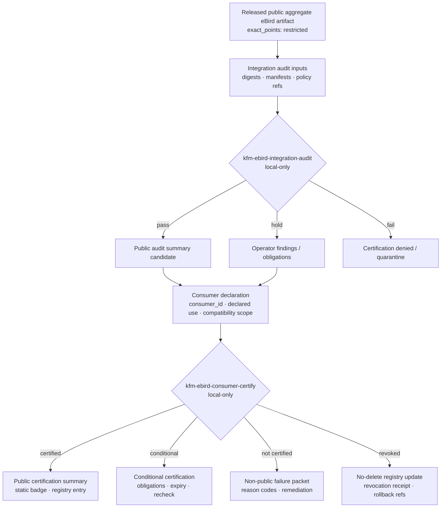

<!-- [KFM_META_BLOCK_V2]
doc_id: kfm://doc/NEEDS_VERIFICATION
title: eBird Consumer Certification
type: standard
version: v1
status: draft
owners: [TODO-fauna-ebird-stewards-NEEDS_VERIFICATION]
created: NEEDS_VERIFICATION
updated: 2026-05-07
policy_label: TODO-public-or-restricted-NEEDS_VERIFICATION
related: [../../README.md, ../../GEOPRIVACY.md, ./EBIRD_CONSUMER_INTEGRATION.md, ./EBIRD_INDEPENDENT_VERIFICATION.md, ./EBIRD_AUDIT_RESPONSE.md, ../../../../../policy/fauna/ebird.rego, ../../../../../tests/policy/fauna/ebird_test.rego]
tags: [kfm, fauna, ebird, consumer-certification, public-safety, offline, governance]
notes: [Layer 28 consumer certification doc; doc_id, owners, created date, and policy label need steward verification; all CLI behavior remains planned/contractual unless implementation and CI are verified]
[/KFM_META_BLOCK_V2] -->

<a id="top"></a>

# eBird Consumer Certification

Local-only certification rules for downstream consumers of KFM public aggregate eBird artifacts.

<p align="center">
  
  
  
  
  
  
  
  
</p>

> [!IMPORTANT]
> **Layer 28 certifies compatibility and public-safety posture only.** It does **not** certify ecological correctness, species presence, abundance, occupancy, migration, trend, habitat suitability, causal interpretation, or biological validity.

> [!WARNING]
> A consumer certification packet must never include eBird API keys, credentials, real eBird rows, raw checklist details, exact coordinates, point geometries, restricted observations, quarantine material, suppressed group hashes/details, suppression receipts, or raw row numbers.

---

## Quick jumps

[Status and impact](#status-and-impact) ·
[Scope](#scope) ·
[Repo fit](#repo-fit) ·
[Accepted inputs](#accepted-inputs) ·
[Exclusions](#exclusions) ·
[Workflow](#workflow) ·
[CLI contracts](#cli-contracts) ·
[Certification model](#certification-model) ·
[Artifact contracts](#artifact-contracts) ·
[Deterministic IDs](#deterministic-ids) ·
[Validation gates](#validation-gates) ·
[Public outputs](#public-outputs) ·
[Revocation](#revocation-and-no-delete-history) ·
[Reviewer checklist](#reviewer-checklist) ·
[Open verification](#open-verification)

---

## Status and impact

| Field | Determination |
|---|---|
| Layer | **Layer 28 — eBird Consumer Certification** |
| Status | **Draft / planned certification lane** |
| Execution posture | **Local-only**; no network calls |
| Data posture | **No real eBird data**; synthetic, redacted, aggregate, or digest-only inputs |
| Public output posture | **Aggregate-only compatibility summaries**; exact points restricted |
| Certification type | **Consumer compatibility and public-safety certification** |
| Certification is not | Ecological correctness certification, legal permission to redistribute source data, or source-rights approval |
| Primary consumers | Downstream systems, static public artifact consumers, API fixture consumers, map/viewer integrators, review operators |
| Failure posture | DENY, ABSTAIN, HOLD, QUARANTINE, or ERROR instead of guessing |

Layer 28 exists to answer one narrow governance question:

> Can a downstream consumer safely consume a KFM public aggregate eBird artifact without bypassing the KFM trust membrane, exposing sensitive detail, inventing ecological claims, or violating the public-output contract?

If the answer cannot be proven locally from released public-safe artifacts, validated manifests, and reviewable certification evidence, the correct outcome is **not certified**.

<p align="right"><a href="#top">Back to top ↑</a></p>

---

## Scope

Layer 28 covers downstream consumer certification for **public aggregate eBird artifacts** produced by KFM.

It evaluates whether a consumer:

- uses only released public-safe aggregate artifacts;
- respects `exact_points: restricted`;
- preserves attribution and terms reminders;
- avoids real eBird rows and exact coordinates;
- avoids restricted observations and suppression internals;
- uses deterministic artifact identifiers;
- carries release, policy, validation, and rollback references;
- exposes status badges or registry entries without scripts, trackers, external assets, or dynamic calls;
- avoids biological overclaiming.

### In scope

| In scope | Description |
|---|---|
| Integration audit | Checks whether a consumer can safely read KFM public aggregate outputs. |
| Consumer certification | Produces a pass/conditional/fail/revoked certification outcome. |
| Static badge generation | Produces JSON/SVG compatibility badges with no scripts, links, trackers, or external assets. |
| Registry entry generation | Produces public-safe registry metadata for certified consumers. |
| Operator packet generation | Produces non-public review artifacts for maintainers. |
| Revocation planning | Records no-delete certification changes when consumers drift or become unsafe. |

### Out of scope

| Out of scope | Reason |
|---|---|
| Live eBird API access | Layer 28 is local-only and must not call external services. |
| Raw eBird data redistribution | Certification uses released KFM public aggregate artifacts only. |
| Real observation validation | No real eBird rows, checklist IDs, observer identity, raw row numbers, or exact points are admitted. |
| Ecological interpretation | Compatibility certification is not species-presence, trend, abundance, occupancy, or habitat certification. |
| Source-rights approval | Source rights are upstream governance requirements, not consumer certification outputs. |
| Browser-only privacy | Sensitive fields must be removed before publication; the consumer must not rely on display filters as policy. |

<p align="right"><a href="#top">Back to top ↑</a></p>

---

## Repo fit

**Target file:** `docs/domains/fauna/sources/ebird/EBIRD_CONSUMER_CERTIFICATION.md`

This document belongs under `docs/domains/fauna/sources/ebird/` because it is a human-facing source-lane governance document. It does not belong in a root-level `fauna/` folder, a generated artifact folder, or a runtime implementation package.

| Relationship | Path | Status | Role |
|---|---|---:|---|
| Domain README | `../../README.md` | CONFIRMED in repo lookup | Fauna lane orientation and shared source/sensitivity doctrine |
| Fauna geoprivacy | `../../GEOPRIVACY.md` | CONFIRMED in repo lookup | Public geometry and sensitive-location policy |
| Consumer integration | `./EBIRD_CONSUMER_INTEGRATION.md` | CONFIRMED in repo lookup | Upstream local consumer handoff lane |
| Independent verification | `./EBIRD_INDEPENDENT_VERIFICATION.md` | CONFIRMED in repo lookup | Offline verifier kit and proof report lane |
| Audit response | `./EBIRD_AUDIT_RESPONSE.md` | CONFIRMED in repo lookup | Local audit response and public status update lane |
| eBird policy gate | `../../../../../policy/fauna/ebird.rego` | CONFIRMED in repo lookup | Public aggregate deny rules |
| eBird policy tests | `../../../../../tests/policy/fauna/ebird_test.rego` | CONFIRMED in repo lookup | Negative/positive policy fixtures |
| Planned validator family | `../../../../../tools/validators/fauna/` | CONFIRMED adjacent files exist | Validator home for eBird quality, triage, audit, redteam, reconciliation, fixity, and root-of-trust checks |

> [!NOTE]
> The CLI names and output objects in this document are still certification contracts unless the repository implementation, package entry points, workflow YAML, and runtime outputs are verified.

<p align="right"><a href="#top">Back to top ↑</a></p>

---

## Accepted inputs

Layer 28 accepts only local, reviewable, public-safe inputs.

| Input | Accepted? | Conditions |
|---|---:|---|
| Public aggregate target descriptor | ✅ | Must identify the KFM aggregate artifact without embedding raw rows or exact locations. |
| Released artifact hash list | ✅ | Must use stable digest strings such as `sha256:<64-hex>`. |
| Layer manifest reference | ✅ | Must point to released public-safe layer metadata. |
| Validation report summary | ✅ | Must not include sensitive raw values. |
| Policy decision summary | ✅ | Must be public-safe and reason-code based. |
| Consumer ID | ✅ | Must be non-secret, stable, and safe to publish. |
| Consumer declared use | ✅ | Must be status/compatibility use only; no ecological inference. |
| Static badge candidate | ✅ | Must contain no scripts, remote assets, external tracking, or exact-location data. |
| Registry entry candidate | ✅ | Must be public-safe and no-delete compatible. |
| Operator review packet | ✅ | Internal only; still no credentials, real eBird rows, exact points, or suppression internals. |

### Minimum accepted aggregate target shape

```json
{
  "aggregate_target_version": "kfm.ebird.aggregate_target.v1",
  "aggregate": "county",
  "taxon_scope": "public_safe_summary",
  "time_scope": "monthly",
  "exact_points": "restricted",
  "policy_label": "public_aggregate",
  "artifact_refs": [
    {
      "artifact_id": "kfm-ebird-public-aggregate-NEEDS_VERIFICATION",
      "artifact_digest": "sha256:NEEDS_VERIFICATION"
    }
  ],
  "release_manifest_ref": "kfm://release/NEEDS_VERIFICATION",
  "layer_manifest_ref": "kfm://layer/NEEDS_VERIFICATION"
}
```

<p align="right"><a href="#top">Back to top ↑</a></p>

---

## Exclusions

Layer 28 must reject, deny, or quarantine any input containing prohibited material.

| Does not belong here | Failure disposition | Safer path |
|---|---|---|
| eBird API keys, tokens, auth headers, cookies, or credentials | **DENY / QUARANTINE** | Secret manager; never certification artifacts |
| Live API endpoints intended for execution | **ERROR / DENY** | Source activation and connector docs, not Layer 28 |
| Real eBird observations, raw rows, checklist IDs, observer details, raw row numbers | **DENY / QUARANTINE** | Upstream restricted lifecycle lanes only |
| Exact coordinates, point geometry, `lat`, `lon`, `geometry`, `geom`, `point` fields | **DENY** for public/certification payloads | Released generalized or aggregate artifacts |
| Restricted observations or suppressed internals | **DENY** | Steward-only review path; never public certification |
| Suppression receipts, suppressed group hashes, suppressed group details | **DENY** | Internal proof store, not consumer certification |
| RAW / WORK / QUARANTINE references | **DENY** | Released public-safe `PUBLISHED` artifact references only |
| Ecological inference claims | **ABSTAIN / DENY** | Evidence-bound domain analysis lane, not Layer 28 |
| Dynamic SVG badge scripts, external links, remote images, trackers | **DENY** | Static JSON/SVG with embedded text only |
| “Certified by Cornell/eBird” language | **DENY** | KFM may certify only KFM consumer compatibility, not external endorsement |

<p align="right"><a href="#top">Back to top ↑</a></p>

---

## External source terms checkpoint

Layer 28 does not perform live eBird access, but it still reminds maintainers and consumers that upstream eBird-derived material carries external terms, attribution, sensitive-species, and redistribution constraints.

| Checkpoint | Certification handling |
|---|---|
| API-key handling | Layer 28 never accepts or emits API keys. |
| Non-commercial / permission posture | Consumer certification is not permission for commercial use or redistribution. |
| Attribution | Public summaries and registry entries should preserve source attribution reminders where applicable. |
| Original-format redistribution | Consumer outputs must not publish or redistribute original eBird data format. |
| Purpose limitation | Consumer certification should record declared use and fail when the consumer claims a new incompatible use. |
| Sensitive species | Sensitive species and site-level records must remain protected; KFM public outputs stay aggregate/generalized. |
| No endorsement | Do not imply Cornell Lab or eBird endorses KFM-derived products or certified consumers. |
| Terms freshness | Recheck official eBird terms before activating or renewing any consumer certification class. |

Reference anchors:

- [eBird API Terms of Use][ebird-api-terms]
- [eBird Data Access Terms of Use][ebird-data-terms]
- [How can your eBird data be used?][ebird-data-use]
- [Sensitive Species in eBird][ebird-sensitive-species]

<p align="right"><a href="#top">Back to top ↑</a></p>

---

## Workflow

Layer 28 sits downstream of public aggregate production and upstream of public consumer registry publication.



Lifecycle posture:

```text
PUBLISHED KFM PUBLIC AGGREGATE
  -> LOCAL CONSUMER AUDIT
  -> CONSUMER CERTIFICATION CANDIDATE
  -> VALIDATION / POLICY / REVIEW
  -> PUBLIC CERTIFICATION SUMMARY + BADGE + REGISTRY ENTRY
  -> RENEWAL / REVOCATION / CORRECTION
```

> [!IMPORTANT]
> Promotion of a certification summary or badge is a governed state transition. It is not a file copy into a public directory.

<p align="right"><a href="#top">Back to top ↑</a></p>

---

## CLI contracts

The CLIs below are **planned interface contracts**. Do not treat these commands as implemented unless the package entry points and CI jobs are verified.

### `kfm-ebird-integration-audit`

Purpose: inspect a local public aggregate artifact and determine whether it is safe enough to present to a downstream consumer certification workflow.

```bash
kfm-ebird-integration-audit \
  --aggregate-target ./fixtures/ebird/public_aggregate_target.safe.json \
  --artifact-hashes ./fixtures/ebird/public_artifact_hashes.safe.json \
  --consumer-adapter-version 0.0.0-NEEDS-VERIFICATION \
  --contract-hash sha256:NEEDS_VERIFICATION \
  --strict \
  --offline \
  --no-network \
  --out ./data/work/fauna/ebird/consumer-certification/<audit_id>/
```

Required behavior:

1. Refuse network access.
2. Refuse credentials or secret-like values.
3. Validate aggregate target shape.
4. Validate artifact digests.
5. Validate `exact_points: restricted`.
6. Validate no coordinate or point-geometry field allowlist.
7. Validate public output mode is aggregate-only.
8. Validate policy and release references exist as references, not raw private contents.
9. Emit audit summary, operator report, and machine-readable result.
10. Return nonzero on hard-gate failure.

### `kfm-ebird-consumer-certify`

Purpose: produce a public-safe consumer certification summary and optional static badge/registry entry from a successful or conditionally successful local integration audit.

```bash
kfm-ebird-consumer-certify \
  --aggregate-target ./fixtures/ebird/public_aggregate_target.safe.json \
  --consumer ./fixtures/ebird/consumer_profile.public_safe.json \
  --audit ./data/work/fauna/ebird/consumer-certification/<audit_id>/integration_audit_summary.json \
  --decision certified_public_compatible \
  --validity-days 90 \
  --adapter-version 0.0.0-NEEDS-VERIFICATION \
  --contract-hash sha256:NEEDS_VERIFICATION \
  --strict \
  --offline \
  --no-network \
  --out ./data/processed/fauna/ebird/consumer-certification/<consumer_certification_id>/
```

Required behavior:

1. Refuse network access.
2. Refuse credentials, tokens, cookies, auth headers, and secret-like values.
3. Refuse real eBird rows, checklist IDs, raw row numbers, exact points, and restricted observations.
4. Validate the consumer profile is public-safe.
5. Validate the consumer declared use is compatible with aggregate public outputs.
6. Validate that certification decision, obligations, and validity are deterministic and reviewable.
7. Emit public summary JSON.
8. Emit optional static JSON/SVG badge.
9. Emit public registry entry candidate.
10. Emit non-public operator packet and validation report.
11. Emit revocation plan when certification is not durable.
12. Return nonzero on hard-gate failure.

<p align="right"><a href="#top">Back to top ↑</a></p>

---

## Certification model

Layer 28 emits a finite certification decision.

| Decision | Meaning | Public output allowed? | Renewal required? |
|---|---|---:|---:|
| `certified_public_compatible` | Consumer passed all hard gates and has no open blocking obligations. | ✅ | ✅ |
| `certified_with_obligations` | Consumer passed hard gates but has explicit non-blocking obligations. | ✅ with obligations shown | ✅ |
| `conditional_review_required` | Consumer may be safe, but one or more review gates remain unresolved. | ⚠️ limited or internal only | ✅ |
| `not_certified` | Consumer failed compatibility or public-safety gates. | ❌ | Reapply after remediation |
| `revoked` | Previously certified consumer no longer satisfies the contract. | ❌ for current registry | Re-certification required |
| `error` | Certification could not be computed reliably. | ❌ | Rerun after system/input repair |

### Certification dimensions

| Dimension | Pass condition | Failure examples |
|---|---|---|
| Local-only execution | No network access required or attempted. | CLI attempts to fetch eBird/API/web resources. |
| Credential safety | No secrets accepted, logged, emitted, or embedded. | API key appears in input, logs, badge, summary, or operator report. |
| Public aggregate boundary | Consumer uses KFM released aggregate artifacts only. | Consumer references raw rows, checklist detail, exact points, restricted stores. |
| Field allowlist | Consumer payload excludes exact coordinate and restricted fields. | `lat`, `lon`, `geometry`, `geom`, `point`, raw locality, or restricted refs appear. |
| Suppression boundary | Consumer cannot see suppressed hashes/details or suppressed internals. | Suppression receipt or suppressed group hash leaks into output. |
| Attribution / terms reminder | Public output includes required source and terms reminders where applicable. | Consumer strips source terms warning or implies endorsement. |
| No ecological inference | Consumer uses status/compatibility language only. | Consumer claims trend, abundance, occurrence, occupancy, habitat suitability, causation. |
| Static badge safety | Badge has no script, tracker, external asset, or click-through requirement. | SVG includes remote image/script/link or dynamic fetch. |
| Registry history | Registry updates are append/supersede/revoke, not silent deletion. | Certification entry is overwritten without correction/revocation record. |

<p align="right"><a href="#top">Back to top ↑</a></p>

---

## Artifact contracts

Layer 28 separates public outputs from non-public operator evidence.

### Public outputs

| Artifact | Format | Public? | Must include | Must not include |
|---|---|---:|---|---|
| Integration audit summary | JSON + Markdown | ✅ | `audit_id`, target digest refs, result, reason codes, aggregate class, `exact_points: restricted` | Raw rows, exact coordinates, credentials, suppressed hashes |
| Consumer certification summary | JSON | ✅ | `consumer_certification_id`, consumer ID, decision, validity, obligations, release refs | Real observations, checklist details, API keys |
| Static compatibility badge | JSON/SVG | ✅ | decision label, certification ID, validity, static text | scripts, external assets, links, trackers, raw details |
| Public registry entry | JSON | ✅ | consumer ID, current decision, decision time, supersession/revocation refs | deletion-only history, hidden revocation, sensitive fields |

### Non-public outputs

| Artifact | Format | Public? | Role |
|---|---|---:|---|
| Integration audit manifest | JSON | ❌ | Full local audit input/output index |
| Integration audit report | JSON/Markdown | ❌ | Detailed validator findings and obligation notes |
| Route/DTO/claims/test/diff lint reports | JSON/Markdown | ❌ | Consumer adapter compatibility checks |
| Operator report | Markdown | ❌ | Reviewer-facing explanation and remediation plan |
| Consumer certification plan | JSON/Markdown | ❌ | Certification decision plan before publication |
| Consumer certification packet | JSON | ❌ | Complete decision packet and validation closure |
| Consumer certification receipt | JSON | ❌ | Process memory and traceability |
| Registry update plan | JSON | ❌ | Append/update/revoke operations |
| Revocation plan | JSON | ❌ | No-delete revocation and correction actions |

### Public certification summary shape

```json
{
  "object_type": "KfmEbirdConsumerCertificationSummary",
  "schema_version": "kfm.ebird.consumer_certification.summary.v1",
  "consumer_certification_id": "ebird_cert_0000000000000000",
  "consumer_id": "consumer_NEEDS_VERIFICATION",
  "aggregate_target_ref": "kfm://fauna/ebird/public-aggregate/NEEDS_VERIFICATION",
  "audit_id": "ebird_audit_0000000000000000",
  "decision": "certified_public_compatible",
  "validity": {
    "not_before": "2026-05-07",
    "not_after": "2026-08-05",
    "renewal_required": true
  },
  "public_output_mode": "aggregate_only",
  "exact_points": "restricted",
  "ecological_correctness_certified": false,
  "source_terms_notice": "Use of eBird-derived artifacts remains subject to applicable eBird/Cornell terms and KFM release policy.",
  "obligations": [
    "preserve_attribution_notice",
    "do_not_redistribute_original_ebird_data",
    "do_not_infer_species_presence_from_certification"
  ],
  "reason_codes": [
    "consumer.local_only.pass",
    "consumer.public_aggregate_only.pass",
    "consumer.no_exact_points.pass",
    "consumer.no_credentials.pass"
  ],
  "release_manifest_ref": "kfm://release/NEEDS_VERIFICATION",
  "rollback_ref": "kfm://rollback/NEEDS_VERIFICATION"
}
```

### Static badge JSON shape

```json
{
  "schemaVersion": 1,
  "label": "KFM eBird consumer",
  "message": "certified public-compatible",
  "color": "blue",
  "namedLogo": "",
  "isError": false,
  "cacheSeconds": 86400
}
```

### Static badge SVG rules

A badge SVG must be:

- static text and shapes only;
- no `<script>`;
- no remote images;
- no external CSS;
- no `<a href>`;
- no hidden metadata containing raw data;
- no exact location data;
- no consumer secrets;
- no data URI embedding of non-public payloads.

<p align="right"><a href="#top">Back to top ↑</a></p>

---

## Deterministic IDs

Layer 28 keeps the existing deterministic-ID posture: first 16 lowercase hex characters of SHA-256 over canonical JSON.

> [!NOTE]
> Prefix length is inherited from current Layer 28 planning notes. If a repository-wide deterministic ID policy exists or changes, update this document and the validator together.

### `audit_id`

```text
audit_id =
  "ebird_audit_" +
  sha256(canonical_json({
    "kind": "kfm.ebird.consumer_integration_audit.v1",
    "aggregate_target": <aggregate_target_object>,
    "supplied_artifact_hashes": <ordered_artifact_hash_refs>,
    "adapter_version": <consumer_adapter_version>,
    "contract_hash": <contract_hash>,
    "strict": <boolean>
  }))[0:16]
```

### `consumer_certification_id`

```text
consumer_certification_id =
  "ebird_cert_" +
  sha256(canonical_json({
    "kind": "kfm.ebird.consumer_certification.v1",
    "aggregate_target": <aggregate_target_object>,
    "consumer_id": <public_safe_consumer_id>,
    "audit_evidence_hashes": <ordered_audit_evidence_hashes>,
    "certification_evidence_hashes": <ordered_certification_evidence_hashes>,
    "decision": <decision>,
    "validity": <validity_object>,
    "adapter_version": <adapter_version>,
    "contract_hash": <contract_hash>
  }))[0:16]
```

### Canonicalization requirements

Canonical JSON must use:

- stable key ordering;
- UTF-8 encoding;
- normalized booleans and nulls;
- stable array ordering for hash-significant arrays;
- no volatile `generated_at` field unless it is intentionally part of a validity decision;
- no private payload values;
- digest references instead of embedded sensitive artifacts;
- explicit contract hash.

<p align="right"><a href="#top">Back to top ↑</a></p>

---

## Validation gates

Layer 28 hard gates are designed to fail closed.

| Gate | Severity | Applies to | Pass condition | Failure outcome |
|---|---:|---|---|---|
| No network | Hard | Both CLIs | No network access attempted or required. | ERROR / DENY |
| No credentials | Hard | All inputs/outputs/logs | No secret-like values detected. | QUARANTINE |
| No real rows | Hard | All artifacts | No raw eBird rows, checklist IDs, observer detail, raw row numbers. | DENY |
| No exact coordinates | Hard | Public + certification payloads | No exact point geometry or coordinate fields. | DENY |
| `exact_points: restricted` | Hard | Public outputs | Field exists and equals `restricted`. | DENY |
| Public aggregate only | Hard | Public outputs | `policy_label: public_aggregate`, aggregate class allowed. | DENY |
| Suppression boundary | Hard | Public outputs | No suppression receipts, suppressed hashes, or suppressed details. | DENY |
| `kfm:spec_hash` | Hard | Public aggregate references | Valid `sha256:<64-hex>` hash reference. | ERROR / DENY |
| Checklist threshold | Hard | Aggregate rows | `checklist_count >= suppression_min_n`; default floor not below 10. | DENY |
| Static badge safety | Hard | Badge JSON/SVG | No script, link, remote asset, tracker, or hidden sensitive data. | DENY |
| No ecological inference | Hard | Public text | No abundance, trend, occupancy, presence, habitat, causation, or correctness claims. | ABSTAIN / DENY |
| Attribution/terms reminder | Required | Public summary / registry | Source terms notice preserved where applicable. | HOLD |
| Validity window | Required | Certification | `not_before`, `not_after`, renewal state present. | HOLD |
| Revocation path | Required | Certification/registry | No-delete revocation and rollback refs present. | HOLD |
| Deterministic ID recompute | Hard | All generated IDs | Recomputed ID matches emitted ID. | ERROR |
| Artifact closure | Hard | Certification | Summary, badge, registry entry, validation report, and receipt are linked. | ERROR / HOLD |

### Companion policy expectations

The eBird policy gate should continue to block at least the following:

- public eBird layer where `exact_points` is not `restricted`;
- public layer allowlist containing exact coordinate fields;
- public aggregate row containing exact coordinate fields;
- public aggregate output where `policy_label` is not `public_aggregate`;
- public aggregate output missing `kfm:spec_hash`;
- public aggregate row where `checklist_count < suppression_min_n`;
- approved certification packet containing failed hard gates;
- public workflows that request credentials or exact private locations;
- critical unresolved public-safety findings.

### Policy smoke command

Use the repository-native policy runner if available. With OPA available, the expected smoke command is:

```bash
opa test policy/fauna/ebird.rego tests/policy/fauna/ebird_test.rego
```

> [!CAUTION]
> Do not mark Layer 28 implemented or CI-enforced until the actual repository workflow, package manager, policy runner, validator commands, and expected artifacts are verified.

<p align="right"><a href="#top">Back to top ↑</a></p>

---

## Public outputs

Public certification artifacts must be boring, static, and explicit.

### Public integration audit summary

Allowed statements:

- “This audit checked public aggregate compatibility.”
- “Exact points are restricted.”
- “No raw eBird rows were included.”
- “No credentials were included.”
- “The target artifact passed/failed the local compatibility gate.”
- “This audit does not certify ecological correctness.”

Disallowed statements:

- “This species occurs here.”
- “This location is important habitat.”
- “The population trend is increasing.”
- “The consumer has permission to redistribute eBird data.”
- “Cornell/eBird approved this consumer.”
- “Suppressed groups exist at this place.”

### Public registry entry

A public registry entry must preserve change history.

```json
{
  "object_type": "KfmEbirdConsumerRegistryEntry",
  "schema_version": "kfm.ebird.consumer_registry_entry.v1",
  "consumer_id": "consumer_NEEDS_VERIFICATION",
  "current_certification_ref": "kfm://fauna/ebird/consumer-certification/ebird_cert_0000000000000000",
  "current_decision": "certified_public_compatible",
  "exact_points": "restricted",
  "public_output_mode": "aggregate_only",
  "history": [
    {
      "event": "certified",
      "certification_ref": "kfm://fauna/ebird/consumer-certification/ebird_cert_0000000000000000",
      "decision_time": "2026-05-07",
      "reason_codes": ["consumer.local_only.pass"]
    }
  ],
  "revocation_ref": null,
  "correction_notice_refs": [],
  "rollback_ref": "kfm://rollback/NEEDS_VERIFICATION"
}
```

<p align="right"><a href="#top">Back to top ↑</a></p>

---

## Revocation and no-delete history

Consumer certification can expire, be superseded, or be revoked. It must not be silently deleted.

| Event | Required record | Public behavior |
|---|---|---|
| Certification renewal | New certification summary and registry event | Show current certification and prior certification history. |
| Certification supersession | Supersession event with old/new refs | Preserve old summary; current registry points to new summary. |
| Certification expiration | Expiry event or stale state | Badge/registry indicates expired or not current. |
| Revocation | Revocation plan, revocation receipt, registry event | Badge/registry indicates revoked; do not erase history. |
| Safety defect | CorrectionNotice and rollback target | Public users can see that prior certification was corrected or withdrawn. |
| Consumer remediation | New candidate certification | Prior failure remains linked as lineage. |

Revocation trigger examples:

- consumer begins using exact coordinates;
- consumer claims biological correctness;
- consumer strips terms/attribution warnings;
- consumer embeds dynamic badge scripts;
- source terms or KFM policy changes;
- public-safety finding remains unresolved;
- certification validity expires;
- artifact digest no longer matches the certified target.

<p align="right"><a href="#top">Back to top ↑</a></p>

---

## Consumer profile contract

A consumer profile is a local declaration. It is not a secret.

```json
{
  "object_type": "KfmEbirdConsumerProfile",
  "schema_version": "kfm.ebird.consumer_profile.v1",
  "consumer_id": "consumer_NEEDS_VERIFICATION",
  "consumer_name": "NEEDS_VERIFICATION",
  "consumer_type": "static_public_viewer",
  "declared_use": "display_kfm_public_aggregate_status",
  "network_required": false,
  "stores_artifacts": false,
  "redistributes_original_ebird_data": false,
  "uses_exact_coordinates": false,
  "uses_restricted_observations": false,
  "claims_ecological_correctness": false,
  "displays_terms_notice": true,
  "displays_exact_points_restricted_notice": true,
  "badge_requested": true,
  "registry_entry_requested": true
}
```

Consumer profiles must not include:

- API keys;
- endpoint credentials;
- private user emails unless governance approves them;
- hidden raw source data;
- exact coordinates;
- real eBird checklist identifiers;
- claims of Cornell/eBird endorsement.

<p align="right"><a href="#top">Back to top ↑</a></p>

---

## Fixture matrix

Layer 28 needs both happy-path and failure-path fixtures.

| Fixture | Expected outcome |
|---|---|
| Safe public aggregate target with valid hashes | `certified_public_compatible` |
| Consumer profile with static badge request | badge generated |
| Consumer profile with declared ecological correctness claim | DENY |
| Aggregate target missing `exact_points: restricted` | DENY |
| Artifact hash malformed | ERROR |
| Public field allowlist includes `latitude` | DENY |
| Input contains `decimalLongitude` | DENY |
| Input contains credential-like token | QUARANTINE |
| Input references raw checklist ID | DENY |
| Input includes suppression receipt ref | DENY |
| Public badge SVG includes script | DENY |
| Registry update attempts delete-only change | DENY |
| Certification validity missing expiry | HOLD |
| Revoked consumer requests current badge | revoked badge emitted / no certification badge |
| Expired certification used as current | HOLD / stale |
| Policy test with `checklist_count < suppression_min_n` | DENY |

<p align="right"><a href="#top">Back to top ↑</a></p>

---

## Reviewer checklist

Before approving a Layer 28 change, reviewers should confirm:

- [ ] The document meta block is registered or placeholders are still clearly marked.
- [ ] Owners and policy label are verified or left as explicit `NEEDS_VERIFICATION`.
- [ ] CLI names are marked planned/contractual unless implementation is confirmed.
- [ ] No network behavior is introduced.
- [ ] No credentials or secret-like values appear in fixtures, docs, logs, examples, or badges.
- [ ] No real eBird rows, checklist IDs, raw row numbers, observer details, exact coordinates, or point geometry appear.
- [ ] Public artifacts keep `exact_points: restricted`.
- [ ] Public artifacts are aggregate-only and carry `policy_label: public_aggregate` where applicable.
- [ ] Coordinate-like public fields are denied.
- [ ] `kfm:spec_hash` or equivalent content hash validation exists.
- [ ] Suppression internals stay non-public.
- [ ] The badge is static and contains no scripts, links, or remote assets.
- [ ] Certification language avoids ecological correctness, abundance, trend, habitat, occurrence, or endorsement claims.
- [ ] Certification validity and renewal are explicit.
- [ ] Revocation uses append/supersede/correct history, not deletion.
- [ ] Public summaries preserve terms/attribution reminders.
- [ ] Negative fixtures cover credential, exact point, raw row, ecological claim, and dynamic badge failures.
- [ ] Rollback/correction path exists for a mistaken certification.
- [ ] Official eBird terms and sensitive-species guidance have been rechecked for the release window.

<p align="right"><a href="#top">Back to top ↑</a></p>

---

## Open verification

| Item | Status | Needed proof |
|---|---:|---|
| `doc_id` | NEEDS VERIFICATION | Register in the KFM document registry. |
| Owners | NEEDS VERIFICATION | Confirm fauna/eBird steward or owning team. |
| Created date | NEEDS VERIFICATION | Use repository history or steward assignment. |
| Policy label | NEEDS VERIFICATION | Confirm whether this doc is public, restricted, or another repo-defined label. |
| CLI implementation | NEEDS VERIFICATION | Verify entry points, packages, command output, and tests. |
| Validator home | NEEDS VERIFICATION | Confirm whether Layer 28 validators live under `tools/validators/fauna/` or another repo-native package. |
| Schema home | NEEDS VERIFICATION | Confirm machine schema placement before adding new schemas. |
| Workflow enforcement | NEEDS VERIFICATION | Confirm CI actually runs policy, schema, fixture, and badge-safety checks. |
| Certification artifact paths | NEEDS VERIFICATION | Confirm lifecycle home for work/processed/published certification artifacts. |
| Static badge format | NEEDS VERIFICATION | Confirm accepted badge JSON/SVG format and publishing path. |
| Consumer registry home | NEEDS VERIFICATION | Confirm registry file path and no-delete update process. |
| Official eBird terms | NEEDS VERIFICATION | Recheck API/data/sensitive-species terms before source activation, renewal, or public release. |
| Suppression threshold | NEEDS VERIFICATION | Existing policy floor is 10; confirm against current KFM governance before relying on it universally. |

<p align="right"><a href="#top">Back to top ↑</a></p>

---

## Change log

| Date | Version | Change |
|---|---:|---|
| 2026-05-07 | v1 draft | Expanded Layer 28 from a thin planning note into a repo-ready certification governance document with meta block, badges, scope, workflow, CLI contracts, artifact contracts, validation gates, revocation behavior, and open verification items. |

---

## References

- [eBird API Terms of Use][ebird-api-terms]
- [eBird Data Access Terms of Use][ebird-data-terms]
- [How can your eBird data be used?][ebird-data-use]
- [Sensitive Species in eBird][ebird-sensitive-species]

[ebird-api-terms]: https://www.birds.cornell.edu/home/ebird-api-terms-of-use/
[ebird-data-terms]: https://www.birds.cornell.edu/home/ebird-data-access-terms-of-use/
[ebird-data-use]: https://support.ebird.org/en/support/solutions/articles/48001078113
[ebird-sensitive-species]: https://support.ebird.org/en/support/solutions/articles/48000803210-sensitive-species-in-ebird

<p align="right"><a href="#top">Back to top ↑</a></p>