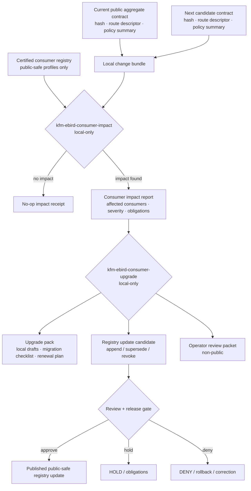

<!-- [KFM_META_BLOCK_V2]
doc_id: kfm://doc/NEEDS_VERIFICATION
title: eBird Consumer Change Management
type: standard
version: v1
status: draft
owners: [TODO-fauna-ebird-stewards-NEEDS_VERIFICATION]
created: NEEDS_VERIFICATION
updated: 2026-05-07
policy_label: TODO-public-or-restricted-NEEDS_VERIFICATION
related: [../../README.md, ../../GEOPRIVACY.md, ../../SOURCE_ROLES.md, ./EBIRD_CONSUMER_INTEGRATION.md, ./EBIRD_CONSUMER_CERTIFICATION.md, ./EBIRD_CONTRACTS.md, ./EBIRD_MAINTENANCE.md, ./EBIRD_QUALITY_AND_TRIAGE.md, ../../../../../policy/fauna/ebird.rego, ../../../../../tests/connectors/fauna/test_kfm_ebird_layer29_cli.py, ../../../../../tests/policy/fauna/ebird_test.rego]
tags: [kfm, fauna, ebird, consumer-change-management, consumer-impact, upgrade-pack, public-safety, offline, governance]
notes: [Layer 29 consumer change-management doc; doc_id, owners, created date, and policy label require steward verification; CLI implementation path and CI enforcement need repo verification before treating commands as implemented behavior]
[/KFM_META_BLOCK_V2] -->

<a id="top"></a>

# eBird Consumer Change Management

Local-only impact analysis, compatibility renewal, and upgrade-pack governance for downstream consumers of KFM public aggregate eBird artifacts.

<p align="center">
  
  
  
  
  
  
  
  
  
</p>

> [!IMPORTANT]
> **Layer 29 manages downstream consumer change, not upstream source truth.** It can compute local impact, compatibility, renewal, migration, and upgrade artifacts for certified consumers. It must not fetch eBird, send notifications, expose exact coordinates, publish raw observations, or certify ecological correctness.

> [!WARNING]
> A consumer impact or upgrade pack must never include eBird API keys, credentials, live API calls, real eBird rows, raw checklist details, observer identifiers, exact coordinates, point geometries, restricted observations, suppression internals, suppression receipts, or external notification delivery.

---

## Quick jumps

[Status and impact](#status-and-impact) ·
[Scope](#scope) ·
[Repo fit](#repo-fit) ·
[Accepted inputs](#accepted-inputs) ·
[Exclusions](#exclusions) ·
[Change classes](#change-classes) ·
[Workflow](#workflow) ·
[CLI contracts](#cli-contracts) ·
[Impact model](#impact-model) ·
[Upgrade packs](#upgrade-packs) ·
[Deterministic IDs](#deterministic-ids) ·
[Validation gates](#validation-gates) ·
[Public outputs](#public-outputs) ·
[Reviewer checklist](#reviewer-checklist) ·
[Open verification](#open-verification)

---

## Status and impact

| Field | Determination |
|---|---|
| Layer | **Layer 29 — eBird Consumer Change Management** |
| Status | **Draft / partially documented lane** |
| Execution posture | **Local-only**; no network calls |
| Data posture | **No real eBird data**; synthetic, redacted, aggregate, or digest-only inputs |
| Notification posture | **No external delivery**; local drafts and operator packets only |
| Public output posture | **Aggregate-only compatibility summaries**; exact points restricted |
| Primary CLIs | `kfm-ebird-consumer-impact`, `kfm-ebird-consumer-upgrade` |
| Confirmed current doc substance | Existing brief doc names Layer 29, both CLIs, deterministic IDs, and safety constraints |
| Implementation confidence | **NEEDS VERIFICATION** for executable CLI path, package entry points, workflow wiring, and generated artifacts |
| Failure posture | DENY, ABSTAIN, HOLD, QUARANTINE, or ERROR instead of guessing |

Layer 29 answers one narrow operational question:

> When a KFM eBird public aggregate contract, release, policy, certification, or consumer adapter changes, which downstream consumers are affected, what renewal or migration is required, and what local upgrade materials can be produced without bypassing KFM’s public-safety boundary?

This document upgrades the existing short note into a full change-management control document while preserving the original Layer 29 safety rule: **no network calls, no credential usage, no external notification delivery, no real eBird data, and no public exact coordinates**.

<p align="right"><a href="#top">Back to top ↑</a></p>

---

## Scope

Layer 29 covers change management for **certified downstream consumers** of KFM public aggregate eBird artifacts.

It evaluates consumer impact when any of the following changes:

- public aggregate contract shape;
- OpenAPI-lite or route descriptor shape;
- consumer contract manifest;
- policy decision shape or reason-code vocabulary;
- field allowlist or forbidden-field list;
- suppression threshold or aggregation class;
- badge or registry entry template;
- static consumer certification status;
- release manifest or rollback reference;
- source terms checkpoint language;
- adapter version or contract hash;
- validation gate severity;
- public-safe output vocabulary.

### In scope

| In scope | Description |
|---|---|
| Consumer inventory scan | Reads a local registry of certified or candidate consumers. |
| Impact analysis | Computes affected consumers, severity, renewal requirements, and blocking gates. |
| Compatibility report | Compares prior and next contract expectations without touching live source systems. |
| Upgrade pack | Produces local-only upgrade materials, operator notes, renewal checklists, and static draft messages. |
| Renewal plan | Identifies certifications that must be renewed, superseded, or revoked. |
| No-delete history | Preserves prior certification and registry lineage rather than overwriting history. |
| Rollback notes | Records rollback and correction references for consumer-facing changes. |

### Out of scope

| Out of scope | Reason |
|---|---|
| Live eBird API calls | Layer 29 is local-only. |
| External notification delivery | This layer may generate local notification drafts; it must not send email, Slack, webhook, API, or social notifications. |
| Raw eBird data | Change management uses public-safe aggregate refs, hashes, manifests, and consumer metadata only. |
| Exact point geometry | Public aggregate eBird contracts require `exact_points: restricted`. |
| Ecological correctness | Consumer change management does not certify species presence, abundance, occupancy, trend, habitat suitability, or causal claims. |
| Source-rights approval | eBird terms, source activation, and redistribution approvals belong upstream of consumer change management. |
| UI-only enforcement | Sensitive fields must be absent before publication; the browser cannot be the policy gate. |

<p align="right"><a href="#top">Back to top ↑</a></p>

---

## Repo fit

**Target file:** `docs/domains/fauna/sources/ebird/EBIRD_CONSUMER_CHANGE_MANAGEMENT.md`

This is a human-facing source-lane governance document. It belongs under `docs/domains/fauna/sources/ebird/`, not in a root-level `fauna/` folder, not in generated artifacts, and not in a runtime package.

| Relationship | Path | Status | Role |
|---|---|---:|---|
| Domain README | `../../README.md` | CONFIRMED in GitHub connector lookup | Fauna lane orientation and shared source/sensitivity doctrine |
| Fauna geoprivacy | `../../GEOPRIVACY.md` | CONFIRMED in GitHub connector lookup | Public geometry and sensitive-location policy |
| Source roles | `../../SOURCE_ROLES.md` | CONFIRMED in GitHub connector lookup | Fauna source-role discipline |
| Consumer integration | `./EBIRD_CONSUMER_INTEGRATION.md` | CONFIRMED in GitHub connector lookup | Layer 26 local downstream handoff artifacts |
| Consumer certification | `./EBIRD_CONSUMER_CERTIFICATION.md` | CONFIRMED in GitHub connector lookup | Layer 28 public-compatible consumer certification |
| eBird contracts | `./EBIRD_CONTRACTS.md` | CONFIRMED in GitHub connector lookup | Layer 10 productization and contract notes |
| Maintenance | `./EBIRD_MAINTENANCE.md` | CONFIRMED in GitHub connector lookup | Layer 11 diff/check/compat/migration posture |
| Quality and triage | `./EBIRD_QUALITY_AND_TRIAGE.md` | CONFIRMED in GitHub connector lookup | Layer 21 QA and triage posture |
| eBird policy gate | `../../../../../policy/fauna/ebird.rego` | CONFIRMED in GitHub connector lookup | Public aggregate deny rules |
| Layer 29 test | `../../../../../tests/connectors/fauna/test_kfm_ebird_layer29_cli.py` | CONFIRMED in GitHub connector lookup | Test references Layer 29 CLI names and deterministic `impact_id` behavior |
| Policy tests | `../../../../../tests/policy/fauna/ebird_test.rego` | CONFIRMED by search result | Policy negative/positive fixtures |
| Config lane | `../../../../../configs/fauna/ebird/README.md` | CONFIRMED by search result | Safe local configuration context |
| Connector CLI implementation | `../../../../../tools/connectors/fauna/kfm-ebird-ingest/` | TEST-REFERENCED / NEEDS VERIFICATION | CLI path referenced by tests; actual executable files must be verified before claiming implementation |

### Directory tree context

```text
docs/domains/fauna/sources/ebird/
├── EBIRD_CONTRACTS.md
├── EBIRD_MAINTENANCE.md
├── EBIRD_QUALITY_AND_TRIAGE.md
├── EBIRD_CONSUMER_INTEGRATION.md
├── EBIRD_CONSUMER_CERTIFICATION.md
└── EBIRD_CONSUMER_CHANGE_MANAGEMENT.md  # this file
```

> [!NOTE]
> This document is intentionally documentation/control-plane material. Generated impact reports, upgrade packs, receipts, and registry updates should be emitted under data/work, data/processed, data/receipts, data/proofs, data/published, or release homes according to repository conventions and release state.

<p align="right"><a href="#top">Back to top ↑</a></p>

---

## Accepted inputs

Layer 29 accepts only local, reviewable, public-safe inputs.

| Input | Accepted? | Conditions |
|---|---:|---|
| Certified consumer registry | ✅ | Must contain non-secret consumer IDs, current certification refs, declared use, adapter version, and public-safe compatibility fields. |
| Consumer certification summary | ✅ | Must come from Layer 28 or an equivalent reviewed public-safe certification record. |
| Public aggregate target descriptor | ✅ | Must identify aggregate artifact class without raw rows or exact locations. |
| Current contract manifest | ✅ | Must be public-safe and digestable. |
| Next contract manifest | ✅ | Used for diff and impact only; not automatically published. |
| Route descriptor / OpenAPI-lite descriptor | ✅ | Public-safe route and DTO shape only. |
| Policy summary or reason-code vocabulary | ✅ | No sensitive internal policy payloads; reason-code summaries only. |
| Validation report summary | ✅ | Must not include raw restricted values. |
| Release manifest reference | ✅ | Reference only; no secret release-signing material. |
| Static badge / registry template | ✅ | Must contain no scripts, trackers, remote assets, or sensitive embedded data. |
| Operator-reviewed compatibility decision | ✅ | Local decision evidence only; publication still requires review/release gate. |

### Minimum consumer registry shape

```json
{
  "object_type": "KfmEbirdConsumerRegistry",
  "schema_version": "kfm.ebird.consumer_registry.v1",
  "registry_id": "consumer_registry_NEEDS_VERIFICATION",
  "generated_from_release_ref": "kfm://release/NEEDS_VERIFICATION",
  "consumers": [
    {
      "consumer_id": "consumer_NEEDS_VERIFICATION",
      "consumer_name": "NEEDS_VERIFICATION",
      "consumer_type": "static_public_viewer",
      "declared_use": "display_kfm_public_aggregate_status",
      "current_certification_ref": "kfm://fauna/ebird/consumer-certification/NEEDS_VERIFICATION",
      "adapter_version": "0.0.0-NEEDS-VERIFICATION",
      "contract_hash": "sha256:NEEDS_VERIFICATION",
      "public_output_mode": "aggregate_only",
      "exact_points": "restricted",
      "renewal_due": "NEEDS_VERIFICATION"
    }
  ]
}
```

<p align="right"><a href="#top">Back to top ↑</a></p>

---

## Exclusions

Layer 29 must reject, deny, or quarantine prohibited material.

| Does not belong here | Failure disposition | Safer path |
|---|---|---|
| eBird API keys, tokens, auth headers, cookies, secrets | **DENY / QUARANTINE** | Secret manager only; never docs, reports, badges, or upgrade packs |
| Live API endpoints intended for execution | **ERROR / DENY** | Source activation docs and connector runtime, not Layer 29 |
| Real eBird observations, raw rows, checklist IDs, observer details, raw row numbers | **DENY / QUARANTINE** | Restricted upstream lifecycle lanes only |
| Exact coordinates, point geometry, `lat`, `lon`, `geometry`, `geom`, `point` fields | **DENY** for public/change-management payloads | Released generalized or aggregate artifacts |
| Restricted observations or suppressed internals | **DENY** | Steward-only proof/review paths |
| Suppression receipts, suppressed group hashes, suppressed group details | **DENY** | Internal proof store, not consumer change-management artifacts |
| RAW / WORK / QUARANTINE source data references as consumer payloads | **DENY** | Released public-safe artifact references only |
| Ecological inference claims | **ABSTAIN / DENY** | Evidence-bound domain analysis lane |
| Dynamic notification delivery | **DENY** | Generate local drafts only |
| “Certified by Cornell/eBird” language | **DENY** | KFM may certify only KFM consumer compatibility, not external endorsement |
| Commercial-permission claims | **DENY** | External permission/legal review outside Layer 29 |

<p align="right"><a href="#top">Back to top ↑</a></p>

---

## Change classes

Consumer impact depends on the type of change. Layer 29 must classify change before assigning severity.

| Change class | Examples | Default severity | Required response |
|---|---|---:|---|
| `contract_shape_change` | field added/removed/renamed; DTO version change; schema hash change | High | Impact report, compatibility matrix, adapter check, renewal decision |
| `public_field_allowlist_change` | fields added/removed from public aggregate payload | High | Coordinate/sensitive-field scan, consumer display check |
| `policy_gate_change` | deny reason added; suppression threshold changed; exact-points rule changed | High | Policy summary diff, renewal or revocation plan |
| `release_manifest_change` | artifact digest changed; rollback ref changed; correction state changed | Medium/High | Release impact summary, stale-state check, registry update |
| `source_terms_checkpoint_change` | attribution/terms reminder text changes; redistribution notice changes | Medium | Consumer notice draft and renewal obligation |
| `certification_status_change` | consumer certification expires, is superseded, revoked, or becomes conditional | High | No-delete registry event, local upgrade pack, public status update candidate |
| `route_descriptor_change` | path, method, response envelope, status codes, or finite outcomes change | Medium/High | Route compatibility report and consumer adapter guidance |
| `badge_template_change` | badge label/message/color/cache fields change | Low/Medium | Static badge regeneration and safety scan |
| `registry_template_change` | registry entry shape or public status vocabulary changes | Medium | Registry migration plan |
| `adapter_version_change` | consumer adapter version changes | Medium | Recompute deterministic IDs and pack compatibility |
| `validation_rule_change` | new hard gate; changed severity; reason-code vocabulary change | Medium/High | Re-run impact and certification renewal checks |
| `documentation_only_change` | prose clarification with no contract/policy/output change | Low | Changelog entry; no consumer upgrade unless obligations change |

### Severity vocabulary

| Severity | Meaning | Default handling |
|---|---|---|
| `critical_blocking` | Consumer may leak restricted data, bypass policy, violate terms posture, or rely on an invalid release. | DENY upgrade; revoke or hold certification until resolved. |
| `high_required` | Consumer remains public-safe but must update contract/adapter/certification before next release. | Generate required upgrade pack and renewal checklist. |
| `medium_recommended` | Consumer should update but current public-safe posture is not immediately broken. | Generate advisory upgrade pack and next renewal obligation. |
| `low_informational` | No behavioral change; maintainers need awareness only. | Changelog and local notice draft. |
| `none` | No consumer impact detected. | Record proof and no-op receipt. |

<p align="right"><a href="#top">Back to top ↑</a></p>

---

## Workflow

Layer 29 sits downstream of public aggregate contracts and consumer certification, and upstream of consumer registry publication or renewal.



Lifecycle posture:

```text
PUBLISHED PUBLIC AGGREGATE CONTRACT
  -> LOCAL CHANGE BUNDLE
  -> LOCAL CONSUMER IMPACT SCAN
  -> IMPACT REPORT / NO-OP RECEIPT
  -> LOCAL UPGRADE PACK
  -> REVIEW / POLICY / RELEASE
  -> PUBLIC-SAFE REGISTRY UPDATE OR HOLD/DENY/REVOKE
```

> [!IMPORTANT]
> A generated upgrade pack is not a release decision. Public registry updates, badge changes, certification renewals, and revocations still require validation, policy, review, release, correction path, and rollback target.

<p align="right"><a href="#top">Back to top ↑</a></p>

---

## CLI contracts

The CLIs below are **documented/test-referenced interface contracts**. Treat actual executable availability, package entry points, workflow invocation, and artifact emission as **NEEDS VERIFICATION** until checked in the target branch.

### `kfm-ebird-consumer-impact`

Purpose: scan certified or candidate consumers, compare current and next public aggregate contract state, compute deterministic `impact_id`, and write compatibility and renewal artifacts.

```bash
kfm-ebird-consumer-impact \
  --mode scan \
  --aggregate both \
  --consumer-registry ./fixtures/ebird/consumer_registry.public_safe.json \
  --current-contract ./fixtures/ebird/current_contract_manifest.public_safe.json \
  --next-contract ./fixtures/ebird/next_contract_manifest.public_safe.json \
  --policy-summary ./fixtures/ebird/policy_summary.public_safe.json \
  --adapter-version 0.0.0-NEEDS-VERIFICATION \
  --contract-hash sha256:NEEDS_VERIFICATION \
  --strict \
  --offline \
  --no-network \
  --dry-run \
  --out ./data/work/fauna/ebird/consumer-change/<impact_id>/
```

Required behavior:

1. Refuse network access.
2. Refuse credentials or secret-like values.
3. Validate registry input is public-safe.
4. Validate no raw rows or exact point fields are present.
5. Validate current and next manifests have digestable contract state.
6. Compare contracts, route descriptors, policy summaries, badge templates, and registry templates.
7. Classify change classes and consumer severity.
8. Emit deterministic `impact_id`.
9. Emit impact summary, affected consumer list, compatibility report, renewal manifest, validation report, and no-op receipt if no impact.
10. Return nonzero on hard-gate failure.

### `kfm-ebird-consumer-upgrade`

Purpose: build local-only upgrade and notification materials from an impact report and compute deterministic `upgrade_pack_id`.

```bash
kfm-ebird-consumer-upgrade \
  --impact ./data/work/fauna/ebird/consumer-change/<impact_id>/impact_summary.json \
  --consumer-registry ./fixtures/ebird/consumer_registry.public_safe.json \
  --upgrade-template ./fixtures/ebird/upgrade_template.public_safe.json \
  --decision required \
  --validity-days 90 \
  --adapter-version 0.0.0-NEEDS-VERIFICATION \
  --contract-hash sha256:NEEDS_VERIFICATION \
  --strict \
  --offline \
  --no-network \
  --dry-run \
  --out ./data/processed/fauna/ebird/consumer-change/<upgrade_pack_id>/
```

Required behavior:

1. Refuse network access.
2. Refuse external notification delivery.
3. Refuse credentials, tokens, cookies, auth headers, and secret-like values.
4. Refuse real eBird rows, checklist IDs, raw row numbers, exact points, and restricted observations.
5. Validate the referenced `impact_id` and input artifact digests.
6. Generate public-safe upgrade summary.
7. Generate local notification drafts only.
8. Generate renewal, supersession, revocation, or no-op registry update candidates.
9. Generate non-public operator packet.
10. Emit deterministic `upgrade_pack_id`.
11. Return nonzero on hard-gate failure.

### Smoke checks

```bash
python -m pytest tests/connectors/fauna/test_kfm_ebird_layer29_cli.py
```

> [!CAUTION]
> Do not mark Layer 29 implemented or CI-enforced until the actual CLI files, package metadata, executable permissions, test runner, and workflow jobs are verified. A test that references a command is useful evidence, but it does not by itself prove release-grade operation.

<p align="right"><a href="#top">Back to top ↑</a></p>

---

## Impact model

Layer 29 produces a consumer impact report. The report is a local decision-support artifact, not a public release by itself.

### Impact summary shape

```json
{
  "object_type": "KfmEbirdConsumerImpactSummary",
  "schema_version": "kfm.ebird.consumer_impact.summary.v1",
  "impact_id": "ebird_impact_0000000000000000",
  "change_bundle_id": "ebird_change_NEEDS_VERIFICATION",
  "aggregate_scope": "both",
  "public_output_mode": "aggregate_only",
  "exact_points": "restricted",
  "current_contract_hash": "sha256:NEEDS_VERIFICATION",
  "next_contract_hash": "sha256:NEEDS_VERIFICATION",
  "policy_summary_hash": "sha256:NEEDS_VERIFICATION",
  "adapter_version": "0.0.0-NEEDS-VERIFICATION",
  "computed_at": "2026-05-07T00:00:00Z",
  "network_used": false,
  "credentials_used": false,
  "external_notifications_sent": false,
  "consumers_scanned": 1,
  "consumers_affected": 1,
  "max_severity": "high_required",
  "change_classes": [
    "contract_shape_change",
    "policy_gate_change"
  ],
  "affected_consumers": [
    {
      "consumer_id": "consumer_NEEDS_VERIFICATION",
      "current_certification_ref": "kfm://fauna/ebird/consumer-certification/NEEDS_VERIFICATION",
      "severity": "high_required",
      "required_action": "renew_certification",
      "reason_codes": [
        "contract.hash.changed",
        "policy.reason_code_vocabulary.changed"
      ],
      "upgrade_required": true,
      "revocation_required": false
    }
  ],
  "release_manifest_refs": [
    "kfm://release/NEEDS_VERIFICATION"
  ],
  "rollback_ref": "kfm://rollback/NEEDS_VERIFICATION"
}
```

### Compatibility report shape

```json
{
  "object_type": "KfmEbirdConsumerCompatibilityReport",
  "schema_version": "kfm.ebird.consumer_compatibility_report.v1",
  "impact_id": "ebird_impact_0000000000000000",
  "result": "incompatible_until_upgrade",
  "public_safe": true,
  "hard_gates": [
    {
      "gate": "no_network",
      "status": "pass"
    },
    {
      "gate": "no_credentials",
      "status": "pass"
    },
    {
      "gate": "no_exact_coordinates",
      "status": "pass"
    },
    {
      "gate": "aggregate_only",
      "status": "pass"
    }
  ],
  "compatibility_findings": [
    {
      "finding_id": "finding_NEEDS_VERIFICATION",
      "severity": "high_required",
      "change_class": "contract_shape_change",
      "consumer_action": "update_adapter_contract_hash",
      "blocks_current_certification": false,
      "blocks_next_release_without_upgrade": true
    }
  ]
}
```

### Renewal manifest shape

```json
{
  "object_type": "KfmEbirdConsumerRenewalManifest",
  "schema_version": "kfm.ebird.consumer_renewal_manifest.v1",
  "impact_id": "ebird_impact_0000000000000000",
  "renewal_required": true,
  "renewal_due": "2026-08-05",
  "consumers": [
    {
      "consumer_id": "consumer_NEEDS_VERIFICATION",
      "renewal_action": "renew_certification",
      "current_certification_ref": "kfm://fauna/ebird/consumer-certification/NEEDS_VERIFICATION",
      "next_required_certification_scope": "public_aggregate_compatible_vNEXT",
      "obligations": [
        "preserve_attribution_notice",
        "do_not_redistribute_original_ebird_data",
        "do_not_infer_species_presence_from_certification",
        "update_contract_hash_before_next_release"
      ]
    }
  ]
}
```

<p align="right"><a href="#top">Back to top ↑</a></p>

---

## Upgrade packs

An upgrade pack is a local bundle for maintainers and downstream consumers. It may include public-safe summaries and local draft notices, but it must not deliver those notices externally.

### Upgrade pack contents

| Artifact | Public? | Required? | Role |
|---|---:|---:|---|
| `upgrade_pack_summary.json` | ✅ | ✅ | Public-safe summary of upgrade action and compatibility state |
| `affected_consumers.json` | ✅ if consumer IDs are public-safe | ✅ | Affected consumer list and required actions |
| `compatibility_report.json` | ✅ if field-safe | ✅ | Contract/route/policy compatibility findings |
| `renewal_manifest.json` | ✅ if field-safe | ✅ | Renewal plan and obligation list |
| `registry_update_candidate.json` | ✅ | ✅ | Append/supersede/revoke candidate for consumer registry |
| `static_badge_updates/` | ✅ | Optional | Static badge JSON/SVG candidates |
| `local_notice_drafts/` | ✅ or steward-only depending content | Optional | Local draft messages for maintainers to review manually |
| `operator_packet.md` | ❌ | ✅ | Non-public reviewer notes and remediation details |
| `validation_report.json` | ❌ by default | ✅ | Gate results and failure details |
| `upgrade_receipt.json` | ❌ by default | ✅ | Process memory and reproducibility |
| `rollback_notes.md` | ❌ by default | Required for release-impacting changes | Rollback and correction guidance |

### Upgrade pack summary shape

```json
{
  "object_type": "KfmEbirdConsumerUpgradePackSummary",
  "schema_version": "kfm.ebird.consumer_upgrade_pack.summary.v1",
  "upgrade_pack_id": "ebird_upgrade_0000000000000000",
  "impact_id": "ebird_impact_0000000000000000",
  "decision": "required",
  "public_safe": true,
  "network_used": false,
  "external_notifications_sent": false,
  "credentials_used": false,
  "real_ebird_data_used": false,
  "exact_points": "restricted",
  "consumer_count": 1,
  "actions": [
    {
      "consumer_id": "consumer_NEEDS_VERIFICATION",
      "action": "renew_certification",
      "severity": "high_required",
      "manual_review_required": true
    }
  ],
  "notices": {
    "external_delivery_performed": false,
    "local_drafts_generated": true,
    "manual_review_required_before_delivery": true
  },
  "registry_update_candidate_ref": "kfm://fauna/ebird/consumer-registry-update/NEEDS_VERIFICATION",
  "rollback_ref": "kfm://rollback/NEEDS_VERIFICATION"
}
```

### Local notice draft rules

Local notice drafts must:

- use neutral compatibility language;
- avoid implying eBird/Cornell endorsement;
- avoid source-rights or commercial-permission claims;
- avoid ecological correctness claims;
- include `exact_points: restricted`;
- include required action and renewal deadline;
- include manual-review status;
- include no raw data;
- include no click-tracking or remote assets;
- never auto-send.

Example local draft:

```text
Subject: KFM eBird public aggregate consumer upgrade required

Consumer: consumer_NEEDS_VERIFICATION
Impact ID: ebird_impact_0000000000000000
Upgrade Pack: ebird_upgrade_0000000000000000
Required Action: renew_certification
Severity: high_required

KFM changed the public aggregate eBird contract/policy surface used by this consumer.
This notice is a local draft only. No external delivery has been performed.

The upgrade does not authorize redistribution of original eBird data, does not certify ecological correctness,
and does not change the KFM rule that exact eBird points remain restricted in public outputs.

Manual maintainer review is required before any communication or registry publication.
```

<p align="right"><a href="#top">Back to top ↑</a></p>

---

## Deterministic IDs

Layer 29 preserves deterministic identifiers.

> [!NOTE]
> Existing Layer 29 notes state that `impact_id` and `upgrade_pack_id` are deterministic. The exact canonicalization policy should be kept in sync with repository-wide hashing rules if those rules are registered elsewhere.

### `impact_id`

```text
impact_id =
  "ebird_impact_" +
  sha256(canonical_json({
    "kind": "kfm.ebird.consumer_impact.v1",
    "aggregate_scope": <aggregate_scope>,
    "consumer_registry_hash": <consumer_registry_hash>,
    "current_contract_hash": <current_contract_hash>,
    "next_contract_hash": <next_contract_hash>,
    "policy_summary_hash": <policy_summary_hash>,
    "route_descriptor_hash": <route_descriptor_hash>,
    "adapter_version": <adapter_version>,
    "strict": <boolean>
  }))[0:16]
```

### `upgrade_pack_id`

```text
upgrade_pack_id =
  "ebird_upgrade_" +
  sha256(canonical_json({
    "kind": "kfm.ebird.consumer_upgrade_pack.v1",
    "impact_id": <impact_id>,
    "affected_consumers_hash": <affected_consumers_hash>,
    "upgrade_template_hash": <upgrade_template_hash>,
    "decision": <decision>,
    "validity": <validity_object>,
    "adapter_version": <adapter_version>,
    "contract_hash": <contract_hash>,
    "strict": <boolean>
  }))[0:16]
```

### Canonicalization requirements

Canonical JSON must use:

- stable key ordering;
- UTF-8 encoding;
- stable array ordering for hash-significant arrays;
- normalized booleans and nulls;
- digest references instead of embedded sensitive artifacts;
- explicit contract hash;
- no private payload values;
- no credentials;
- no live API content;
- no volatile `generated_at` field unless it is intentionally part of a validity decision.

<p align="right"><a href="#top">Back to top ↑</a></p>

---

## Validation gates

Layer 29 hard gates fail closed.

| Gate | Severity | Applies to | Pass condition | Failure outcome |
|---|---:|---|---|---|
| No network | Hard | Both CLIs | No network access attempted or required. | ERROR / DENY |
| No external delivery | Hard | Upgrade CLI | No email, webhook, Slack, API, SMS, social, or remote notification delivery. | ERROR / DENY |
| No credentials | Hard | All inputs/outputs/logs | No secret-like values detected. | QUARANTINE |
| No real eBird rows | Hard | All artifacts | No raw rows, checklist IDs, observer detail, raw row numbers. | DENY |
| No exact coordinates | Hard | Public + change-management payloads | No exact point geometry or coordinate fields. | DENY |
| `exact_points: restricted` | Hard | Public outputs and target descriptors | Field exists and equals `restricted`. | DENY |
| Public aggregate only | Hard | Public outputs | `policy_label: public_aggregate` or compatible public aggregate class. | DENY |
| Suppression boundary | Hard | Public outputs | No suppression receipts, suppressed hashes, or suppressed details. | DENY |
| `kfm:spec_hash` | Hard | Aggregate refs | Valid `sha256:<64-hex>` hash reference. | ERROR / DENY |
| Checklist threshold | Hard | Aggregate rows if represented | `checklist_count >= suppression_min_n`; default floor not below 10. | DENY |
| No ecological inference | Hard | Public text | No abundance, trend, occupancy, presence, habitat, causation, or correctness claims. | ABSTAIN / DENY |
| Deterministic ID recompute | Hard | All generated IDs | Recomputed ID matches emitted ID. | ERROR |
| Registry no-delete | Hard | Registry update candidates | Append/supersede/revoke history, not silent overwrite. | ERROR / HOLD |
| Terms checkpoint | Required | Impact/upgrade summaries | Attribution, redistribution, no-endorsement, purpose-use reminders preserved where applicable. | HOLD |
| Validity window | Required | Upgrade and renewal plans | `not_before`, `not_after`, renewal state present. | HOLD |
| Rollback path | Required | Release-impacting changes | Rollback refs and correction path present. | HOLD / ERROR |

### Policy smoke command

Use the repository-native policy runner if available. With OPA available, the expected smoke command is:

```bash
opa test policy/fauna/ebird.rego tests/policy/fauna/ebird_test.rego
```

> [!CAUTION]
> Policy commands and CI status remain **NEEDS VERIFICATION** until the actual workflow and toolchain are inspected.

<p align="right"><a href="#top">Back to top ↑</a></p>

---

## Public outputs

Public Layer 29 outputs must be boring, static, and explicit.

### Allowed public statements

- “This consumer impact scan checked KFM public aggregate compatibility.”
- “Exact eBird points remain restricted.”
- “No real eBird rows were used.”
- “No credentials were used.”
- “No external notifications were delivered.”
- “This upgrade pack is a local draft bundle requiring maintainer review.”
- “This output does not certify ecological correctness.”
- “This output does not authorize redistribution of original eBird data.”
- “This output does not imply Cornell Lab or eBird endorsement.”

### Disallowed public statements

- “This species occurs here.”
- “This place is important habitat.”
- “This consumer has permission to redistribute eBird data.”
- “Cornell/eBird approved this consumer.”
- “Sensitive species were observed in this location.”
- “Suppressed groups exist at this place.”
- “This upgrade was delivered to users.”
- “This certification proves biological correctness.”

### Public registry update candidate

```json
{
  "object_type": "KfmEbirdConsumerRegistryUpdateCandidate",
  "schema_version": "kfm.ebird.consumer_registry_update_candidate.v1",
  "update_id": "ebird_registry_update_NEEDS_VERIFICATION",
  "upgrade_pack_id": "ebird_upgrade_0000000000000000",
  "impact_id": "ebird_impact_0000000000000000",
  "operation": "supersede",
  "consumer_id": "consumer_NEEDS_VERIFICATION",
  "previous_certification_ref": "kfm://fauna/ebird/consumer-certification/OLD_NEEDS_VERIFICATION",
  "next_certification_ref": "kfm://fauna/ebird/consumer-certification/NEW_NEEDS_VERIFICATION",
  "history_event": {
    "event": "upgrade_required",
    "reason_codes": [
      "contract.hash.changed",
      "consumer.renewal_required"
    ],
    "event_time": "2026-05-07T00:00:00Z"
  },
  "public_output_mode": "aggregate_only",
  "exact_points": "restricted",
  "external_notifications_sent": false,
  "rollback_ref": "kfm://rollback/NEEDS_VERIFICATION",
  "correction_notice_refs": []
}
```

<p align="right"><a href="#top">Back to top ↑</a></p>

---

## Renewal, revocation, and correction

Layer 29 must preserve certification history.

| Event | Required record | Public behavior |
|---|---|---|
| Consumer not affected | No-op impact receipt | Registry unchanged; no external delivery |
| Consumer affected, compatible with update | Impact summary + compatibility report | Registry may record advisory update |
| Consumer requires renewal | Renewal manifest + upgrade pack | Public registry shows renewal obligation after review |
| Consumer becomes incompatible | Not-certified or hold update candidate | Public registry may show conditional/expired after release |
| Consumer must be revoked | Revocation plan + revocation receipt | Registry indicates revoked; prior record remains visible |
| Consumer remediates | New certification candidate | Prior failure remains linked as lineage |
| Public defect found | CorrectionNotice + rollback target | Public consumers can inspect correction lineage |

Revocation triggers include:

- consumer starts using exact coordinates;
- consumer claims ecological correctness;
- consumer strips attribution/terms reminders;
- consumer embeds dynamic badge scripts;
- consumer adapter digest no longer matches certified contract;
- source terms or KFM policy changes;
- public-safety finding remains unresolved;
- certification validity expires;
- release artifact digest no longer matches certified target.

<p align="right"><a href="#top">Back to top ↑</a></p>

---

## Security and sensitivity posture

Layer 29 is downstream of the fauna geoprivacy gate.

### Required security behavior

- No secrets accepted.
- No secrets logged.
- No network calls.
- No dynamic notification delivery.
- No source API calls.
- No exact coordinates.
- No real eBird rows.
- No suppressed internals.
- No source-private links.
- No browser-only policy enforcement.
- No AI-generated claims as proof.

### Sensitive-field denylist

Public and change-management payloads must deny at least:

```text
decimalLatitude
decimalLongitude
latitude
longitude
lat
lon
raw_latitude
raw_longitude
point
geom
geometry
checklist_id
observer_id
observer_name
raw_row_number
restricted_geometry_ref
suppression_receipt
suppressed_group_hash
suppressed_group_details
api_key
token
authorization
cookie
```

<p align="right"><a href="#top">Back to top ↑</a></p>

---

## Quickstart

Run only after mounting the real repository and verifying package/runtime conventions.

### 1. Confirm repo state

```bash
git status --short
git branch --show-current
```

### 2. Confirm the target and adjacent docs

```bash
find docs/domains/fauna/sources/ebird -maxdepth 1 -type f | sort
```

### 3. Confirm Layer 29 tests

```bash
python -m pytest tests/connectors/fauna/test_kfm_ebird_layer29_cli.py
```

### 4. Confirm policy gate

```bash
opa test policy/fauna/ebird.rego tests/policy/fauna/ebird_test.rego
```

### 5. Run a local dry-run impact scan

```bash
kfm-ebird-consumer-impact \
  --mode scan \
  --aggregate both \
  --consumer-registry ./fixtures/ebird/consumer_registry.public_safe.json \
  --dry-run \
  --offline \
  --no-network
```

### 6. Run a local dry-run upgrade pack

```bash
kfm-ebird-consumer-upgrade \
  --impact ./data/work/fauna/ebird/consumer-change/<impact_id>/impact_summary.json \
  --dry-run \
  --offline \
  --no-network
```

> [!NOTE]
> Paths under `fixtures/` and `data/` in these snippets are examples until the repository fixture and artifact-home conventions are verified.

<p align="right"><a href="#top">Back to top ↑</a></p>

---

## Reviewer checklist

Before approving a Layer 29 change, reviewers should confirm:

- [ ] Existing `EBIRD_CONSUMER_CHANGE_MANAGEMENT.md` substance is preserved and expanded, not erased.
- [ ] Metadata block uses real registered values or explicit placeholders.
- [ ] Related links are valid from `docs/domains/fauna/sources/ebird/`.
- [ ] CLI implementation files and package entry points are verified before claims of implementation.
- [ ] Layer 29 tests pass or are explicitly marked pending.
- [ ] Policy tests pass or are explicitly marked pending.
- [ ] Impact and upgrade artifacts are local-only.
- [ ] No input/output/log examples contain credentials.
- [ ] No input/output/log examples contain real eBird rows.
- [ ] No public or change-management payload contains exact coordinates or point geometry.
- [ ] Public aggregate outputs preserve `exact_points: restricted`.
- [ ] Public text avoids ecological correctness, abundance, occupancy, trend, presence, habitat, and causation claims.
- [ ] External terms reminders are preserved where applicable.
- [ ] No external notification delivery is performed.
- [ ] Registry updates are append/supersede/revoke, not silent overwrite.
- [ ] Upgrade packs include rollback/correction references for release-impacting changes.
- [ ] Deterministic IDs recompute from canonical JSON.
- [ ] Change severity is finite and reason-code based.
- [ ] Renewal/revocation decisions have review state and release gate.
- [ ] Documentation, policy, tests, and fixtures are updated together.

<p align="right"><a href="#top">Back to top ↑</a></p>

---

## Open verification

| Item | Status | Needed proof |
|---|---:|---|
| `doc_id` | NEEDS VERIFICATION | Assign real `kfm://doc/<uuid>` from repository document registry. |
| Owners | NEEDS VERIFICATION | Confirm fauna/eBird steward names or team. |
| Created date | NEEDS VERIFICATION | Confirm original file creation date from Git history or document registry. |
| Policy label | NEEDS VERIFICATION | Confirm public/restricted classification. |
| CLI executable paths | NEEDS VERIFICATION | Verify `tools/connectors/fauna/kfm-ebird-ingest/kfm-ebird-consumer-impact` and `kfm-ebird-consumer-upgrade` exist, are executable, and match tests. |
| Package entry points | NEEDS VERIFICATION | Verify package manager and command installation path. |
| Layer 29 CI enforcement | NEEDS VERIFICATION | Verify workflow job runs Layer 29 tests. |
| Artifact homes | NEEDS VERIFICATION | Confirm exact `data/work`, `data/processed`, `data/receipts`, `data/proofs`, `data/published`, and `release` homes. |
| Consumer registry schema | NEEDS VERIFICATION | Confirm whether it lives under `schemas/`, `contracts/`, `data/registry/`, or another repo-defined home. |
| eBird terms checkpoint cadence | NEEDS VERIFICATION | Confirm current eBird terms and review cadence before source activation or certification renewal. |
| Static badge contract | NEEDS VERIFICATION | Confirm badge JSON/SVG schema and safety scanner. |
| External notice policy | NEEDS VERIFICATION | Confirm there is no automatic notification path in Layer 29 or related workflows. |
| Public registry publication gate | NEEDS VERIFICATION | Confirm review/release process before publishing registry updates. |

<p align="right"><a href="#top">Back to top ↑</a></p>

---

## FAQ

### Is Layer 29 allowed to contact eBird?

No. Layer 29 is local-only. It works from public-safe KFM manifests, contract hashes, consumer registries, and local evidence produced by earlier layers.

### Can Layer 29 send emails or Slack messages?

No. It may generate local draft notices for manual review. It must not deliver anything externally.

### Can an upgrade pack include exact coordinates?

No. Exact eBird points remain restricted in public and consumer-facing artifacts.

### Does an impact report certify biological correctness?

No. It certifies only local compatibility and public-safety implications for KFM consumer artifacts.

### Can a consumer remain certified after a breaking contract change?

Only if the impact scan and review process prove the change is non-breaking for that consumer. Otherwise the certification must be renewed, superseded, held, or revoked.

### Is this document proof that the Layer 29 CLIs are implemented?

No. It is a repo-ready documentation upgrade grounded in visible repo evidence. CLI implementation, package entry points, workflow behavior, and emitted artifacts remain verification items until inspected directly.

<p align="right"><a href="#top">Back to top ↑</a></p>

---

## Appendix

<details>
<summary>Layer 29 no-network fixture plan</summary>

| Fixture | Purpose | Expected result |
|---|---|---|
| `consumer_registry.public_safe.json` | Baseline valid consumer registry | PASS |
| `consumer_registry.with_secret.invalid.json` | Secret detection | DENY / QUARANTINE |
| `consumer_registry.with_exact_point.invalid.json` | Exact-coordinate deny test | DENY |
| `current_contract_manifest.public_safe.json` | Current contract baseline | PASS |
| `next_contract_manifest.breaking.public_safe.json` | Breaking change detection | High impact |
| `next_contract_manifest.nonbreaking.public_safe.json` | No-op/advisory change | Low/no impact |
| `policy_summary.changed.public_safe.json` | Policy reason-code update | Renewal required |
| `badge_template.with_script.invalid.svg` | Static badge safety check | DENY |
| `notice_template.external_delivery.invalid.json` | External-delivery guard | DENY |
| `upgrade_pack.required.golden.json` | Golden output for required upgrade | Deterministic ID match |
| `upgrade_pack.noop.golden.json` | Golden output for no-op impact | Deterministic ID match |

</details>

<details>
<summary>Reason-code starter vocabulary</summary>

```text
consumer.local_only.pass
consumer.no_network.pass
consumer.no_credentials.pass
consumer.no_external_delivery.pass
consumer.public_aggregate_only.pass
consumer.no_exact_points.pass
consumer.no_real_ebird_rows.pass
consumer.contract_hash.changed
consumer.route_descriptor.changed
consumer.policy_summary.changed
consumer.field_allowlist.changed
consumer.badge_template.changed
consumer.registry_template.changed
consumer.certification.expired
consumer.certification.revocation_required
consumer.renewal_required
consumer.upgrade_required
consumer.noop.no_affected_consumers
consumer.hold.review_required
consumer.deny.secret_detected
consumer.deny.exact_coordinate_detected
consumer.deny.external_delivery_requested
consumer.deny.ecological_claim_detected
consumer.error.id_recompute_mismatch
```

</details>

<details>
<summary>External terms checkpoint references for maintainers</summary>

These references are reminders for maintainers. Recheck official pages before source activation, certification renewal, or publication.

- [eBird API Terms of Use][ebird-api-terms]
- [eBird Data Access Terms of Use][ebird-data-terms]
- [How can your eBird data be used?][ebird-data-use]
- [Sensitive Species in eBird][ebird-sensitive-species]

</details>

---

## Change log

| Date | Version | Change |
|---|---:|---|
| 2026-05-07 | v1 draft | Expanded Layer 29 from a brief note into a full consumer change-management governance document. |

[ebird-api-terms]: https://www.birds.cornell.edu/home/ebird-api-terms-of-use/
[ebird-data-terms]: https://www.birds.cornell.edu/home/ebird-data-access-terms-of-use/
[ebird-data-use]: https://support.ebird.org/en/support/solutions/articles/48001158707-how-can-your-ebird-data-be-used-
[ebird-sensitive-species]: https://support.ebird.org/en/support/solutions/articles/48000803210-sensitive-species-in-ebird

<p align="right"><a href="#top">Back to top ↑</a></p>