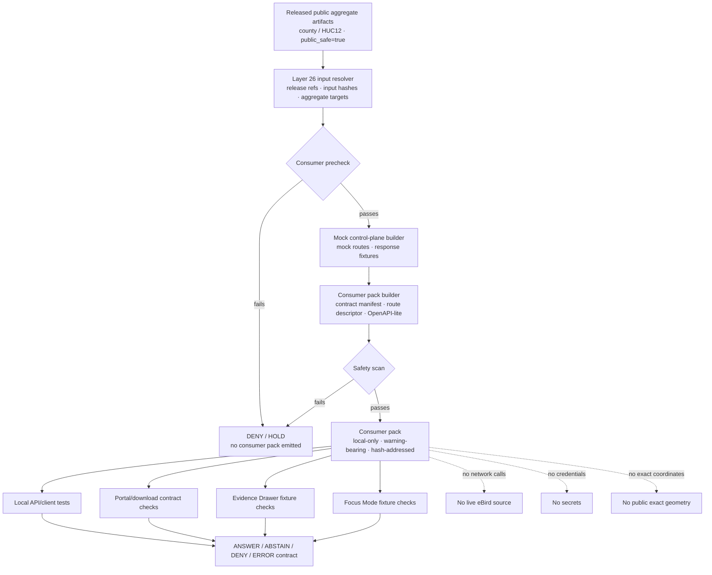

<!-- [KFM_META_BLOCK_V2]
doc_id: kfm://doc/TODO-register-ebird-consumer-integration-uuid
title: eBird Consumer Integration
type: standard
version: v1
status: draft
owners: TODO(fauna-source-stewards)
created: TODO(verify-original-created-date-or-set-on-first-commit)
updated: 2026-05-07
policy_label: TODO(verify-public-or-restricted)
related: ["../../README.md", "../../INGEST_EBIRD.md", "../../SOURCE_ROLES.md", "../../GEOPRIVACY.md", "../../VALIDATION.md", "EBIRD_ARCHITECTURE.md", "EBIRD_CONTRACTS.md", "EBIRD_FEDERATION.md", "EBIRD_ANALYTICS.md", "EBIRD_PORTAL.md", "EBIRD_QUALITY_AND_TRIAGE.md", "../../../../runbooks/fauna/EBIRD_OPERATIONS.md", "../../../../../policy/fauna/ebird.rego", "../../../../../tests/connectors/fauna/test_kfm_ebird_layer10.py"]
tags: [kfm, fauna, ebird, consumer-integration, public-aggregate, local-only, evidence]
notes: [Revises an existing short Layer 26 consumer-integration note; doc_id, owners, created date, and policy_label remain TODO until registry/steward verification; local workspace was not a mounted Git checkout, so implementation-depth claims require checkout verification.]
[/KFM_META_BLOCK_V2] -->

<a id="top"></a>

# eBird Consumer Integration

Local-only consumer handoff guidance for already-published public aggregate eBird artifacts in the KFM fauna lane.

<p>
  
  
  
  
  
  
  
</p>

> [!IMPORTANT]
> **Impact block**
>
> | Field | Value |
> |---|---|
> | Status | `draft` |
> | Target path | `docs/domains/fauna/sources/ebird/EBIRD_CONSUMER_INTEGRATION.md` |
> | Layer | `26` — consumer integration and local handoff |
> | Primary role | Package already-public eBird aggregate artifacts into local mock/control-plane and consumer contract handoff bundles |
> | Runtime posture | Local-only; no source downloads, no network calls, no credentials, no live eBird API use |
> | Source role | eBird remains occurrence support; not legal-status authority |
> | Public geometry posture | Aggregate/generalized only; public exact coordinates remain denied |
> | Claim posture | Descriptive public aggregate reporting only |
> | Quick jumps | [Scope](#scope) · [Repo fit](#repo-fit) · [Inputs](#inputs) · [Exclusions](#exclusions) · [Consumer flow](#consumer-flow) · [CLI contract](#cli-contract) · [Deterministic IDs](#deterministic-ids) · [Contract surfaces](#contract-surfaces) · [Claim boundary](#claim-boundary) · [Validation gates](#validation-gates) · [Runtime handoff](#runtime-handoff) · [Review checklist](#review-checklist) · [Open verification](#open-verification) |

---

## Scope

Layer 26 provides **local-only downstream handoff artifacts** for public aggregate eBird data.

It sits after eBird productization, federation/export, analytics, portal/downloads, quality checks, and release-facing validation. It does not fetch eBird data. It does not create evidence. It does not strengthen claims. It packages already-public, already-validated, already-release-bound eBird aggregate artifacts into consumer-facing contracts and fixtures that downstream clients can test against without touching raw data, credentials, restricted observations, or source systems.

### Layer 26 is allowed to

- build mock route and response fixtures for already-public aggregate artifacts;
- package consumer-facing contract manifests;
- emit route descriptors and OpenAPI-lite descriptors;
- preserve release IDs, input hashes, policy labels, warnings, validation references, and correction lineage;
- support local API/UI/Focus integration testing without live network access;
- help downstream consumers understand what they may safely display or ask.

### Layer 26 is not allowed to

- call the eBird API;
- request or store eBird credentials, tokens, cookies, or private URLs;
- package raw EBD rows, raw API captures, or source-native observation records;
- expose exact coordinates, coordinate-derived fields, geometries, restricted observations, quarantine paths, suppression receipts, or suppressed-group details;
- claim occupancy, abundance, true absence, population trend, causal effect, or complete census status;
- turn local mock artifacts into release proof;
- let consumer convenience weaken KFM evidence, policy, geoprivacy, or release boundaries.

> [!WARNING]
> A consumer contract is not a truth source. It is a local handoff surface derived from released public aggregate artifacts. EvidenceBundle, validation, policy, release, correction, and rollback records remain the trust-bearing objects.

[Back to top](#top)

---

## Repo fit

This file is a human-facing source-layer document under `docs/`. It explains how Layer 26 should package consumer-facing handoff artifacts. It should not own schemas, policy code, generated packages, raw data, release manifests, proof packs, credentials, or runtime implementation.

| Relationship | Status | Path / surface | Role |
|---|---:|---|---|
| This document | CONFIRMED target | `docs/domains/fauna/sources/ebird/EBIRD_CONSUMER_INTEGRATION.md` | Layer 26 consumer-integration guidance |
| Fauna domain landing page | CONFIRMED | [`../../README.md`](../../README.md) | Fauna lane scope, lifecycle, source roles, public safety, and review posture |
| eBird ingest hub | CONFIRMED | [`../../INGEST_EBIRD.md`](../../INGEST_EBIRD.md) | Ingest, governed filter, productization, policy, and command posture |
| Source-role doctrine | CONFIRMED | [`../../SOURCE_ROLES.md`](../../SOURCE_ROLES.md) | Claim/source compatibility; eBird as occurrence support |
| Geoprivacy posture | CONFIRMED | [`../../GEOPRIVACY.md`](../../GEOPRIVACY.md) | Public geometry classes, redaction receipts, exact-location denial |
| Validation posture | CONFIRMED | [`../../VALIDATION.md`](../../VALIDATION.md) | Fail-closed gates, fixture matrix, runtime outcomes, release dry-run |
| Layer 10 contracts | CONFIRMED | [`EBIRD_CONTRACTS.md`](EBIRD_CONTRACTS.md) | Productization contracts, governed filter, contract hash, smoke commands |
| Layer 12 federation/export | CONFIRMED | [`EBIRD_FEDERATION.md`](EBIRD_FEDERATION.md) | Public federation index, discovery docs, graph/export surfaces |
| Layer 13 analytics | CONFIRMED | [`EBIRD_ANALYTICS.md`](EBIRD_ANALYTICS.md) | Public aggregate analytics and warning inheritance |
| Layer 14 portal/downloads | CONFIRMED | [`EBIRD_PORTAL.md`](EBIRD_PORTAL.md) | Public download bundle and static portal manifests |
| Layer 21 quality/triage | CONFIRMED | [`EBIRD_QUALITY_AND_TRIAGE.md`](EBIRD_QUALITY_AND_TRIAGE.md) | Operational QA and triage-only posture |
| Operations runbook | NEEDS VERIFICATION | [`../../../../runbooks/fauna/EBIRD_OPERATIONS.md`](../../../../runbooks/fauna/EBIRD_OPERATIONS.md) | Scan, trend, attest, evidence pack, incident workflows |
| eBird policy gate | NEEDS VERIFICATION | [`../../../../../policy/fauna/ebird.rego`](../../../../../policy/fauna/ebird.rego) | Executable public aggregate safety policy |
| Consumer pack implementation | NEEDS VERIFICATION | repo-native tool/package home | Physical executable path and packaging must be verified in checkout |
| Generated consumer packs | PROPOSED / NEEDS VERIFICATION | repo-native build or release artifact home | Must not replace `data/receipts/`, `data/proofs/`, `release/`, or `data/published/` trust objects |

### Directory Rules basis

`docs/domains/fauna/sources/ebird/` is the correct responsibility-root location for this file because it is **human-facing domain/source documentation**. eBird must not become a root-level folder. Machine schemas, policy code, validators, tests, generated artifacts, data lifecycle products, receipts, proofs, and release objects belong under their own responsibility roots.

[Back to top](#top)

---

## Inputs

Layer 26 accepts only public-safe, downstream-ready artifacts and metadata.

| Input | Accepted? | Required posture |
|---|---:|---|
| Released county aggregate artifact | Yes | `public_safe=true`, `exact_points=restricted`, `policy_label=public_aggregate`, valid `kfm:spec_hash`, suppression applied |
| Released HUC12 aggregate artifact | Yes | Same as county aggregate; no exact geometry or coordinate field leakage |
| Layer 12 federation index | Yes | Public-safe discovery/export index only; no restricted rows or suppression internals |
| Layer 13 analytics report | Yes | Descriptive-only output with warnings, validation refs, and no unsafe inference |
| Layer 14 portal/download manifest | Yes | Built from already-public artifacts only; local assets; no remote scripts/trackers |
| Validation report references | Yes | Must not include restricted rows or suppression internals in public handoff |
| Catalog/proof/release metadata | Yes | Release ID, spec hash, evidence refs, validation state, correction lineage, rollback target |
| Mock route fixture | Yes | Local-only, public-safe, deterministic, no credentials, no network |
| Mock response fixture | Yes | Field-allowlisted and warning-bearing |
| OpenAPI-lite descriptor | Yes | Describes public-safe consumer surface only |
| Synthetic fixtures | Yes | Useful for testing; must be clearly fixture-only |
| Raw eBird data | No | Excluded from Layer 26 |

### Minimum input assertions

A Layer 26 consumer pack should refuse an input set unless the following can be established:

| Assertion | Required value |
|---|---|
| `public_safe` | `true` |
| `exact_points` | `restricted` |
| `policy_label` | `public_aggregate` |
| `aggregate` | `county` or `huc12` |
| `suppression_min_n` | `>= 10` |
| `kfm:spec_hash` | present and valid |
| coordinate fields | absent from public rows, descriptors, fixtures, and allowlists |
| restricted rows | absent |
| quarantine paths | absent |
| suppression receipts | absent from public handoff |
| interpretation warning | present |
| validation refs | present |
| release refs | present |
| correction lineage | present when superseded/withdrawn/replaced |

[Back to top](#top)

---

## Exclusions

| Excluded material | Required handling | Why |
|---|---|---|
| eBird API calls | Deny in Layer 26 | Consumer integration is local-only |
| eBird credentials, API keys, cookies, tokens, private URLs | Never commit or package | Secrets do not belong in docs, fixtures, bundles, portals, or Focus context |
| Raw EBD files or raw API captures | Governed lifecycle homes only | RAW is not a consumer handoff surface |
| Exact latitude/longitude, point, geometry, route, or precise locality fields | Deny from public contracts and fixtures | Public eBird outputs remain aggregate/generalized |
| Restricted observations | Deny from public handoff | Avoid sensitive-location and source-term leakage |
| Quarantine paths | Deny | Quarantine is not published evidence |
| Suppression receipts or suppressed-group details | Deny from public handoff | Suppression internals can leak low-count or sensitive patterns |
| Live source activation assumptions | Mark NEEDS VERIFICATION | Layer 26 cannot authorize source access or downstream redistribution |
| Occupancy, abundance, true absence, population trend, causal, or census language | Deny or rewrite | Public aggregates do not support those claims by themselves |
| Direct model context or AI-generated claims as evidence | Deny | AI is interpretive only |
| Release proof replacement | Deny | Consumer packs do not replace receipts, proofs, manifests, or EvidenceBundles |

[Back to top](#top)

---

## Consumer flow



### Flow rules

1. Layer 26 starts from released public aggregate artifacts, not raw source data.
2. Consumer fixtures inherit upstream warnings, policy labels, validation refs, and release refs.
3. Every consumer surface must be local-only unless a future ADR deliberately creates a separate online runtime contract.
4. A safety failure emits no consumer pack.
5. Mock route fixtures support integration tests; they do not prove publication readiness.

[Back to top](#top)

---

## CLI contract

The existing Layer 26 note names two command families. Treat them as **documented command contracts** until executable paths, package scripts, and CI invocations are verified in the active checkout.

| CLI | Status | Intended role |
|---|---:|---|
| `kfm-ebird-mock-control-plane` | DOCUMENTED / NEEDS VERIFICATION | Build local mock route and response fixtures for already-public aggregate artifacts |
| `kfm-ebird-consumer-pack` | DOCUMENTED / NEEDS VERIFICATION | Package consumer contract manifest, route descriptor, OpenAPI-lite descriptor, warnings, and validation refs |

### Suggested local command modes

```bash
# PROPOSED — verify actual executable path before use.
kfm-ebird-mock-control-plane build \
  --input-release TODO_RELEASE_ID \
  --aggregate county \
  --out-dir build/fauna/ebird/consumer/TODO/mock-control-plane
```

```bash
# PROPOSED — verify actual executable path before use.
kfm-ebird-consumer-pack build \
  --input-release TODO_RELEASE_ID \
  --federation-index build/fauna/ebird/federation/public_federation_index.json \
  --analytics-report build/fauna/ebird/analytics/public_analytics_report.json \
  --portal-manifest build/fauna/ebird/portal/public_download_manifest.json \
  --language en-US \
  --out-dir build/fauna/ebird/consumer/TODO/pack
```

```bash
# PROPOSED — local-only safety validation.
kfm-ebird-consumer-pack validate \
  --pack build/fauna/ebird/consumer/TODO/pack \
  --strict \
  --json
```

> [!CAUTION]
> These examples are intentionally local and repo-shaped. Do not wire Layer 26 commands to live source downloads, API keys, source credentials, or raw eBird payloads.

[Back to top](#top)

---

## Deterministic IDs

Layer 26 keeps deterministic handoff IDs so consumer bundles can be diffed, audited, and rolled back.

| ID | Recipe | Status |
|---|---|---:|
| `mock_id` | `sha256` over canonicalized aggregate targets, input hashes, and adapter version; first 16 hex chars | CONFIRMED from existing note |
| `consumer_pack_id` | `sha256` over canonicalized aggregate targets, input hashes, language, and adapter version; first 16 hex chars | CONFIRMED from existing note |
| `contract_hash` | `sha256(canonical_json(contract_payload_without_generated_at_or_contract_hash))` | Inherits Layer 10 recipe |
| `route_descriptor_hash` | `sha256` over canonicalized public route descriptor and route fixture hashes | PROPOSED |
| `openapi_lite_hash` | `sha256` over canonicalized OpenAPI-lite descriptor excluding generated timestamp fields | PROPOSED |

### Hashing rules

- Exclude volatile generation timestamps from stable content hashes unless the schema explicitly says otherwise.
- Exclude the target hash field from its own hash input.
- Include input release refs and input spec hashes.
- Include adapter/tool version.
- Include language when language affects warning text, route summaries, or consumer docs.
- Do not hash hidden restricted details into public identifiers.

[Back to top](#top)

---

## Contract surfaces

Layer 26 should produce a small, reviewable consumer packet rather than a sprawling SDK.

| Output | Public? | Purpose | Required controls |
|---|---:|---|---|
| `mock_control_plane_manifest.json` | Yes | Declares mock routes, fixtures, inputs, hashes, and warnings | No network, no credentials, no exact coordinates |
| `mock_route_descriptor.json` | Yes | Defines local mock routes and finite outcomes | Public-safe route names only |
| `mock_response_fixture.json` | Yes | Provides local response payloads for consumer tests | Field allowlist, warnings, validation refs |
| `consumer_contract_manifest.json` | Yes | Top-level consumer pack manifest | Release refs, input hashes, `consumer_pack_id`, policy label |
| `consumer_route_descriptor.json` | Yes | Human/client-readable route contract | Public-safe aggregate claims only |
| `openapi_lite_descriptor.json` | Yes | Lightweight API shape for clients/tests | No raw source routes, no credential fields, no restricted fields |
| `consumer_warning_manifest.json` | Yes | Required language to propagate into clients | Descriptive-only warning required |
| `consumer_validation_refs.json` | Yes | References validation, policy, release, and claim-boundary reports | No suppression internals |
| `consumer_pack_readme.md` | Yes | Human-readable local handoff summary | Warning-bearing and release-bound |
| `consumer_pack_receipt.json` | Review/public depending policy | Captures builder version, inputs, output hashes, and safety-scan outcome | Must not include restricted rows or credentials |

### Illustrative consumer contract manifest

```json
{
  "object_type": "EbirdConsumerPack",
  "layer": 26,
  "source_family": "ebird",
  "consumer_pack_id": "TODO_16_HEX",
  "mock_id": "TODO_16_HEX",
  "language": "en-US",
  "public_safe": true,
  "exact_points": "restricted",
  "policy_label": "public_aggregate",
  "aggregate_targets": ["county"],
  "suppression_min_n": 10,
  "input_release_refs": ["TODO_RELEASE_REF"],
  "input_spec_hashes": ["sha256:TODO"],
  "validation_refs": ["TODO_VALIDATION_REF"],
  "warning_manifest_ref": "consumer_warning_manifest.json",
  "route_descriptor_ref": "consumer_route_descriptor.json",
  "openapi_lite_ref": "openapi_lite_descriptor.json",
  "interpretation_warnings": [
    "Descriptive public aggregate reporting only.",
    "Do not interpret as occupancy, abundance, true absence, population trend, causal effect, or complete census."
  ],
  "kfm:spec_hash": "sha256:TODO"
}
```

[Back to top](#top)

---

## Field allowlist

Public consumer payloads should expose only fields needed for public-safe interpretation.

| Field family | Public posture |
|---|---|
| Aggregate identifier | Allowed: county, HUC12, or approved public-safe summary ID |
| Aggregate type | Allowed |
| Time bucket/window | Allowed when not revealing restricted observation precision |
| Public checklist count | Allowed after suppression |
| Reported public taxon count | Allowed with caveats |
| Release ID | Allowed and recommended |
| `kfm:spec_hash` | Required |
| Evidence/release refs | Allowed when public-safe |
| Validation refs | Allowed when public-safe |
| Interpretation warnings | Required |
| Exact latitude/longitude | Denied |
| Raw point/geometry fields | Denied |
| Route/transect/station precision fields | Denied unless separately public-safe and reviewed |
| Private locality/observer-sensitive fields | Denied |
| Quarantine paths | Denied |
| Suppression receipt contents | Denied |
| Credentials/tokens/private URLs | Denied |

[Back to top](#top)

---

## Claim boundary

Layer 26 packages descriptive contract surfaces. It must not make downstream consumers stronger than the evidence allows.

| Safe consumer-facing statement | Unsafe consumer-facing statement |
|---|---|
| “This response describes a released public aggregate artifact.” | “This response describes all bird activity in the area.” |
| “The released aggregate includes `N` checklists after filtering and suppression.” | “There are `N` bird populations here.” |
| “The artifact reports `N` taxa after filtering and suppression.” | “True species richness is `N`.” |
| “This public aggregate has no exact observation coordinates.” | “Exact observations are available through this contract.” |
| “Coverage is sparse for this HUC12/time window.” | “The species is absent from this HUC12.” |
| “Release A and release B differ.” | “The population increased or declined.” |
| “eBird is occurrence support.” | “eBird is legal-status authority.” |
| “The route may return `ABSTAIN` or `DENY` when evidence/policy does not support the request.” | “Every consumer query should get an answer.” |

### Required interpretation warning

Consumer packs, mock responses, OpenAPI-lite descriptions, route docs, portal handoffs, and Focus-facing summaries must carry this warning or a steward-approved equivalent:

> This eBird output is descriptive public aggregate reporting only. It does not show exact observations, does not include restricted records, and must not be interpreted as occupancy, abundance, true absence, population trend, causal effect, or a complete species census.

[Back to top](#top)

---

## Source terms and activation posture

Layer 26 does not authorize live source use or downstream redistribution by itself.

Before any live eBird source activation, public consumer distribution, or external-facing consumer pack release, verify the current source terms for the relevant source class:

| Source / product class | Verification burden |
|---|---|
| eBird API | API key handling, permitted use, attribution, rate/usage posture, non-commercial or commercial constraints |
| eBird Basic Dataset / raw data products | Data request scope, requested purpose, redistribution limits, citation/acknowledgement, derivative-data obligations |
| eBird Status and Trends products | Separate product terms, attribution, commercial-use permission, model/product caveats |
| Public aggregate derivatives | Whether downstream handoff is permitted under source terms and KFM release policy |
| Consumer-facing packages | Whether package contents avoid original source-data redistribution and preserve required attribution/citation |

> [!CAUTION]
> If source terms, citation obligations, allowed use, redistribution posture, or commercial-use status are unclear, the consumer pack must stay local, fixture-only, or held from public release.

[Back to top](#top)

---

## Validation gates

| Gate | Outcome on failure | Check |
|---|---:|---|
| Input release gate | HOLD | Inputs must be released public aggregate artifacts, not raw, work, quarantine, or restricted records |
| Local-only gate | DENY | No command, descriptor, or fixture may require network calls |
| Credential gate | DENY | No API keys, tokens, cookies, private URLs, credentials, or secret-like fields |
| Aggregate unit gate | DENY | `aggregate` must be `county` or `huc12` unless policy/docs deliberately change |
| Suppression gate | DENY | `suppression_min_n >= 10`; public rows must not fall below threshold |
| Exact-points gate | DENY | Public consumer surfaces must keep `exact_points=restricted` |
| Coordinate allowlist gate | DENY | Public descriptors and fixtures must not include exact coordinate or geometry fields |
| Policy label gate | DENY | Public aggregate rows require `policy_label=public_aggregate` |
| Spec hash gate | DENY | Public aggregate outputs require valid `kfm:spec_hash` |
| Warning inheritance gate | HOLD | Consumer pack must include interpretation warning text |
| Validation refs gate | HOLD | Consumer pack must reference validation and release evidence |
| Restricted data gate | DENY | No restricted observations, quarantine paths, suppression receipts, or suppressed-group details |
| Claim-boundary gate | HOLD | Unsafe inference wording must be rewritten or removed |
| Source terms gate | HOLD / DENY | Public consumer distribution cannot proceed while source-term posture is unresolved |
| Correction lineage gate | HOLD | Superseded inputs must update correction/supersession notes |
| Consumer pack receipt gate | HOLD | Output hashes and builder version must be recorded for audit and rollback |

[Back to top](#top)

---

## Runtime handoff

### Governed API

Layer 26 may support mock and contract fixtures for governed API behavior.

| Request condition | Required outcome |
|---|---|
| Released aggregate evidence supports a public-safe descriptive response | `ANSWER` |
| Evidence is insufficient, stale, ambiguous, or outside claim boundary | `ABSTAIN` |
| Rights, sensitivity, exact-location, source-role, or release-state rules forbid response | `DENY` |
| Schema, resolver, integrity, or runtime failure prevents reliable response | `ERROR` |

### Evidence Drawer

Consumer fixtures should preserve the minimum trust context needed for the Evidence Drawer:

| Field family | Requirement |
|---|---|
| Source role | eBird shown as occurrence support |
| Aggregate unit | County, HUC12, or approved public-safe unit |
| Release state | Release ID, current/superseded/withdrawn state where applicable |
| Filter/suppression | Governed filter and `suppression_min_n` visible where relevant |
| Evidence support | EvidenceBundle or release/proof references |
| Public geometry | `exact_points=restricted`; no exact-coordinate fields |
| Policy posture | `public_aggregate`, rights/citation state, validation state |
| Limitations | Not legal status, not complete census, not true absence, not trend/causality |
| Correction lineage | Correction, rollback, supersession, or withdrawal refs when applicable |

### Focus Mode

Consumer handoff may provide Focus-compatible local fixtures only when:

- input evidence is already public-safe and released;
- EvidenceBundle or release/proof references are available;
- no exact coordinates or restricted fields are present;
- warning language is included;
- unsupported claims return `ABSTAIN`;
- policy-blocked claims return `DENY`;
- every factual response remains descriptive and citation-bound.

[Back to top](#top)

---

## Outputs

| Output family | Required status | Description |
|---|---:|---|
| Mock route fixture artifacts | CONFIRMED from existing note / expanded here | Local route and response fixtures for consumer tests |
| Consumer contract manifest | CONFIRMED from existing note / expanded here | Handoff manifest with release refs, input hashes, warnings, and validation refs |
| Route descriptor | CONFIRMED from existing note / expanded here | Public-safe local route description |
| OpenAPI-lite descriptor | CONFIRMED from existing note / expanded here | Lightweight public-safe API contract for consumers |
| Warning manifest | PROPOSED | Central warning text for clients, portal cards, docs, and Focus fixtures |
| Validation refs index | PROPOSED | Links to validation, policy, release, and claim-boundary reports |
| Consumer pack receipt | PROPOSED | Captures input refs, output hashes, builder version, local-only validation |
| Consumer README | PROPOSED | Human-facing handoff summary inside the generated pack |

[Back to top](#top)

---

## Review checklist

Before changing this file or approving Layer 26 behavior, verify:

- [ ] Metadata block placeholders remain intentional or are replaced with registry-confirmed values.
- [ ] New relative links exist or are marked `NEEDS VERIFICATION`.
- [ ] Layer 26 remains local-only.
- [ ] No command, descriptor, fixture, or consumer pack requires network calls.
- [ ] No eBird API key, token, credential, cookie, private URL, or secret-like field appears.
- [ ] Inputs are released public aggregate artifacts, not raw, work, quarantine, or restricted records.
- [ ] Public outputs keep `public_safe=true`.
- [ ] Public outputs keep `exact_points=restricted`.
- [ ] Public aggregate rows use `policy_label=public_aggregate`.
- [ ] Public aggregate rows include valid `kfm:spec_hash`.
- [ ] Suppression minimum remains `>= 10`.
- [ ] `aggregate` remains `county` or `huc12` unless policy and docs deliberately change.
- [ ] Public field allowlists exclude exact coordinate and geometry fields.
- [ ] Restricted rows, quarantine paths, suppression receipts, and suppressed-group details are absent.
- [ ] Every mock response and descriptor carries descriptive-only interpretation warnings.
- [ ] Occupancy, abundance, true absence, population trend, causal, and census language is absent or denied.
- [ ] Consumer route descriptors preserve `ANSWER`, `ABSTAIN`, `DENY`, and `ERROR` behavior.
- [ ] Evidence Drawer fixture fields include source role, release, validation, limitations, and correction lineage.
- [ ] Source terms, citation, attribution, redistribution, and commercial-use posture are reviewed before public consumer distribution.
- [ ] Rollback/correction notes exist when consumer packs supersede prior handoff artifacts.

[Back to top](#top)

---

## Open verification

| Item | Status | Needed proof |
|---|---:|---|
| Registered `doc_id` | TODO | Document registry entry |
| Owners | TODO | CODEOWNERS, steward assignment, or governance registry |
| Created date | TODO | Git history or steward-approved first-commit date |
| Policy label | TODO | Repo policy classification |
| CLI executable paths | NEEDS VERIFICATION | Actual package entrypoints or scripts for `kfm-ebird-mock-control-plane` and `kfm-ebird-consumer-pack` |
| Physical output location | NEEDS VERIFICATION | Repo-native generated artifact/build directory convention |
| Machine schema home | NEEDS VERIFICATION | Accepted schema path and object naming convention |
| Consumer pack schema | PROPOSED | JSON Schema or equivalent machine-checkable contract |
| OpenAPI-lite shape | PROPOSED | Repo-accepted OpenAPI-lite object or contract |
| Validation command | NEEDS VERIFICATION | Repo-native test, policy, and validator command sequence |
| Source-term review | NEEDS VERIFICATION | Current eBird API, data, product, citation, redistribution, and commercial-use terms |
| Public release object family | NEEDS VERIFICATION | ReleaseManifest / PromotionReceipt / ProofPack conventions in current repo |
| Portal/consumer inheritance check | NEEDS VERIFICATION | Tests proving warnings, hashes, validation refs, and policy labels propagate |
| Focus Mode fixture check | NEEDS VERIFICATION | Tests proving unsupported claims abstain and policy-blocked claims deny |

[Back to top](#top)

---

## Appendix

<details>
<summary>Negative fixture ideas</summary>

| Fixture | Expected result |
|---|---|
| `consumer_pack_input_raw_ebd_path.json` | `DENY` |
| `consumer_pack_input_quarantine_path.json` | `DENY` |
| `consumer_pack_requires_network.json` | `DENY` |
| `consumer_pack_contains_api_key.json` | `DENY` |
| `mock_response_contains_latitude.json` | `DENY` |
| `mock_response_contains_geometry.json` | `DENY` |
| `openapi_lite_exact_point_route.json` | `DENY` |
| `consumer_pack_suppression_min_5.json` | `DENY` |
| `consumer_pack_missing_spec_hash.json` | `DENY` |
| `consumer_pack_policy_label_public.json` | `DENY` unless policy intentionally changes |
| `consumer_pack_missing_warning.json` | `HOLD` |
| `consumer_pack_missing_validation_refs.json` | `HOLD` |
| `consumer_pack_suppression_receipt_public.json` | `DENY` |
| `consumer_pack_claims_population_trend.md` | `HOLD` |
| `consumer_pack_claims_true_absence.md` | `ABSTAIN` or `HOLD` |
| `consumer_pack_ebird_as_legal_authority.md` | `DENY` |
| `consumer_pack_missing_correction_lineage.json` | `HOLD` when superseding a prior pack |

</details>

<details>
<summary>Safe wording snippets</summary>

Use these snippets in consumer-facing local fixtures and handoff docs.

- “This response summarizes a released public aggregate artifact.”
- “Counts are descriptive and suppression-gated.”
- “No exact observations or restricted records are included.”
- “Coverage gaps are not evidence of absence.”
- “A release-to-release change may reflect source updates, filtering, taxonomy, suppression, or processing differences.”
- “This output must not be interpreted as occupancy, abundance, true absence, population trend, causal effect, or complete census.”
- “eBird-derived artifacts in this lane support occurrence-derived public aggregate reporting only.”

</details>

<details>
<summary>Maintainer update triggers</summary>

Update this file when any of the following changes:

- `kfm-ebird-mock-control-plane` command name, mode, output shape, or packaging;
- `kfm-ebird-consumer-pack` command name, mode, output shape, or packaging;
- consumer pack manifest schema;
- route descriptor schema;
- OpenAPI-lite descriptor schema;
- public aggregate policy fields or names;
- suppression threshold;
- aggregate unit vocabulary;
- public field allowlist;
- contract hash recipe;
- warning text;
- validation reference requirements;
- Layer 12 federation/export contract;
- Layer 13 analytics contract;
- Layer 14 portal/download contract;
- Evidence Drawer payload contract;
- Focus Mode response contract;
- eBird source terms, citation posture, or redistribution posture;
- public release/correction/rollback procedure.

</details>

[Back to top](#top)