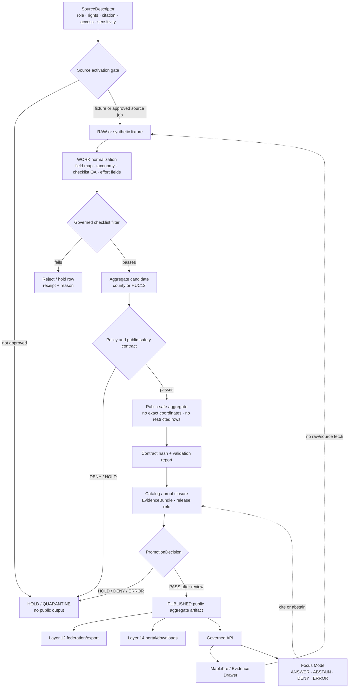

<!-- [KFM_META_BLOCK_V2]
doc_id: kfm://doc/TODO-register-ebird-contracts-uuid
title: eBird Contracts
type: standard
version: v1
status: draft
owners: TODO(fauna-source-stewards)
created: TODO(verify-original-created-date-or-set-on-first-commit)
updated: 2026-05-07
policy_label: TODO(verify-public-or-restricted)
related: ["../../README.md", "../../INGEST_EBIRD.md", "../../SOURCE_ROLES.md", "../../GEOPRIVACY.md", "../../VALIDATION.md", "EBIRD_ARCHITECTURE.md", "EBIRD_FEDERATION.md", "EBIRD_CONFORMANCE.md", "EBIRD_PORTAL.md", "EBIRD_QUALITY_AND_TRIAGE.md", "../../../../runbooks/fauna/EBIRD_OPERATIONS.md", "../../../../../policy/fauna/ebird.rego", "../../../../../configs/fauna/ebird/README.md", "../../../../../data/registry/fauna/README.md"]
tags: [kfm, fauna, ebird, contracts, occurrence-support, geoprivacy, public-aggregate, layer-10]
notes: [Revises an existing short Layer 10 eBird contract note; doc_id, owners, created date, and policy_label remain TODO until registry/steward verification; target path and adjacent repository files were inspected through the GitHub connector on main, while local workspace was not a mounted checkout.]
[/KFM_META_BLOCK_V2] -->

<a id="top"></a>

# eBird Contracts

Contract, hash, policy, and public-safety rules for KFM’s governed eBird occurrence-support productization lane.

<p>
  
  
  
  
  
  = 10" src="https://img.shields.io/badge/suppression-n_%3E%3D_10-b60205?style=flat-square">
  
</p>

> [!IMPORTANT]
> **Impact block**
>
> | Field | Value |
> |---|---|
> | Status | `draft` |
> | Target path | `docs/domains/fauna/sources/ebird/EBIRD_CONTRACTS.md` |
> | Primary role | Human-facing contract index for eBird Layer 10 productization |
> | Source role | eBird is **occurrence support**, not legal-status authority |
> | Public geometry posture | `exact_points=restricted`; no public exact coordinates |
> | Public aggregate posture | County/HUC12 aggregate products only unless policy/docs are deliberately updated |
> | Minimum suppression | `suppression_min_n >= 10` |
> | Hash posture | Canonical JSON SHA-256, excluding volatile fields |
> | Runtime posture | Public clients consume released KFM artifacts through governed APIs; no browser-to-eBird source fetch |
> | Quick jumps | [Scope](#scope) · [Repo fit](#repo-fit) · [Inputs](#inputs) · [Exclusions](#exclusions) · [Contract flow](#contract-flow) · [Contract map](#contract-map) · [Hash recipe](#contract-hash-recipe) · [Governed filter](#governed-filter) · [Public aggregate contract](#public-aggregate-contract) · [Policy mirror](#policy-mirror) · [Commands](#command-contracts) · [Runtime](#runtime-api-ui-and-focus-contract) · [Validation](#validation-matrix) · [Review](#review-checklist) · [Open verification](#open-verification) |

---

## Scope

This document defines the **contract surface** for KFM’s eBird source family. It preserves the original Layer 10 productization note and expands it into a reviewable, repo-ready contract guide for maintainers, validators, policy reviewers, and downstream consumers.

This file governs the human-readable meaning of the eBird contract lane:

- what eBird-derived artifacts may claim;
- what public aggregate outputs must contain;
- what fields must never appear in public artifacts;
- how contract hashes are computed;
- which CLI command families are expected;
- how policy, validation, release, API, Evidence Drawer, and Focus Mode should treat eBird outputs;
- what must be verified before live source activation or public release.

### Core determination

eBird-derived KFM products are **public-safe occurrence-support derivatives** only after filtering, aggregation, suppression, evidence closure, policy evaluation, review, and release. They are not raw eBird data, not legal-status authority, not complete census records, not true absence proof, and not exact public occurrence layers.

> [!WARNING]
> A public eBird aggregate can support a bounded statement such as “this released aggregate contains filtered checklist support for this county/HUC12 and time window.” It must not be inflated into occupancy, abundance, population trend, legal status, true absence, or exact-location claims without separately governed evidence.

[Back to top](#top)

---

## Repo fit

This file is a **source-family contract document** under the fauna documentation lane.

| Relationship | Status | Path / surface | Role |
|---|---:|---|---|
| This file | CONFIRMED target | `docs/domains/fauna/sources/ebird/EBIRD_CONTRACTS.md` | Layer 10 eBird contract/productization guide |
| eBird architecture | CONFIRMED | [`EBIRD_ARCHITECTURE.md`](EBIRD_ARCHITECTURE.md) | Source-family architecture and trust boundary |
| eBird ingest hub | CONFIRMED | [`../../INGEST_EBIRD.md`](../../INGEST_EBIRD.md) | Ingest, productization, governed filter, command hub |
| Fauna domain overview | CONFIRMED | [`../../README.md`](../../README.md) | Fauna lane lifecycle and public-safety posture |
| Source-role doctrine | CONFIRMED | [`../../SOURCE_ROLES.md`](../../SOURCE_ROLES.md) | Role/claim compatibility rules |
| Geoprivacy doctrine | CONFIRMED | [`../../GEOPRIVACY.md`](../../GEOPRIVACY.md) | Sensitive-location and public geometry rules |
| Validation doctrine | NEEDS VERIFICATION | [`../../VALIDATION.md`](../../VALIDATION.md) | Human-readable validator/gate guidance |
| Operations runbook | CONFIRMED | [`../../../../runbooks/fauna/EBIRD_OPERATIONS.md`](../../../../runbooks/fauna/EBIRD_OPERATIONS.md) | Scan, trend, attest, evidence-pack, incident workflows |
| eBird policy | CONFIRMED | [`../../../../../policy/fauna/ebird.rego`](../../../../../policy/fauna/ebird.rego) | Executable deny rules for public aggregates and related objects |
| eBird config docs | CONFIRMED | [`../../../../../configs/fauna/ebird/README.md`](../../../../../configs/fauna/ebird/README.md) | Non-secret config posture |
| Source registry | NEEDS VERIFICATION | [`../../../../../data/registry/fauna/README.md`](../../../../../data/registry/fauna/README.md) | SourceDescriptor, rights, source-role, sensitivity, cadence |
| Federation/export | CONFIRMED | [`EBIRD_FEDERATION.md`](EBIRD_FEDERATION.md) | Layer 12 public-safe federation and discovery exports |
| Portal/downloads | CONFIRMED | [`EBIRD_PORTAL.md`](EBIRD_PORTAL.md) | Layer 14 portal and download bundle manifests |
| Quality/triage | CONFIRMED | [`EBIRD_QUALITY_AND_TRIAGE.md`](EBIRD_QUALITY_AND_TRIAGE.md) | Layer 21 operational QA and triage |
| Connector CLI path | NEEDS VERIFICATION | `../../../../../tools/connectors/fauna/kfm-ebird-ingest/*` | Documented command surface; executable files must be verified in checkout |
| Validator path | CONFIRMED / NEEDS VERIFICATION by file | `../../../../../tools/validators/fauna/validate_ebird_*.ts` | Validator family surfaced by repo search; command wiring must be verified |

### Directory Rules basis

`docs/domains/fauna/sources/ebird/` is the correct responsibility-root placement for this document because it is human-facing domain/source documentation under `docs/`. eBird must not become a root-level `ebird/` or `fauna/` folder. Machine schemas, policy rules, validators, tests, lifecycle data, receipts, proof objects, published artifacts, and release decisions belong under their own responsibility roots.

[Back to top](#top)

---

## Inputs

The contract lane accepts only reviewable inputs with declared source role, lifecycle stage, rights posture, and public-safety posture.

| Input | Accepted? | Contract posture |
|---|---:|---|
| Synthetic eBird-like fixtures | ✅ | Preferred first proof path; safe for no-network contract tests |
| eBird source descriptor | ✅ | Must record role, rights, citation, access class, cadence, sensitivity, and release constraints |
| eBird API/EBD-derived records | CONDITIONAL | RAW source material only after activation review; never direct public runtime input |
| Public county aggregate candidate | ✅ | Must pass governed filter, suppression, field allowlist, policy, and release gates |
| Public HUC12 aggregate candidate | ✅ | Same as county aggregate; no exact coordinates |
| Contract hash payload | ✅ | Must use canonical JSON and exclude volatile fields |
| Promotion receipt | ✅ | Must state `policy_label=public_aggregate` and `public_safe=true` |
| Catalog record | ✅ | Must keep `exact_points=restricted` |
| Pipeline plan / manifest | ✅ | Must preserve suppression, public-safe final outputs, and exact-point restriction |
| Validation report | ✅ | Must not be `fail` for promoted/public run |
| Audit/verifier packet | ✅ | Critical public-safety findings must block gate/transparency until resolved |
| Portal/download/federation output | ✅ | Built from already-public artifacts only; no exact points, credentials, quarantine paths, or suppression receipts |
| Evidence Drawer / Focus payload | ✅ | Public-safe, evidence-bound, source-role-visible, finite-outcome payloads only |

[Back to top](#top)

---

## Exclusions

| Excluded material | Required handling | Reason |
|---|---|---|
| eBird credentials, API keys, cookies, tokens, private URLs | Never commit; use secret manager or ignored local environment | Secrets cannot appear in docs, tests, public artifacts, portals, or Focus context |
| Raw EBD files or raw API captures | Governed lifecycle roots only after source activation | RAW is not public documentation or contract proof |
| Public exact coordinates | Deny | Public eBird products use aggregate/generalized support |
| Restricted observations | Deny from public outputs | Prevent sensitive-location and source-term leakage |
| Quarantine paths | Deny from public outputs | Quarantine is not published evidence |
| Suppression receipts and suppressed-group details | Restricted receipt/proof homes only | Suppression internals can leak low-count or sensitive patterns |
| Public aggregate rows with coordinate/geometry fields | Deny | Public fields must not contain exact coordinates or raw geometry |
| Legal-status claims from eBird | Deny unless separate legal/status authority evidence supports the claim | eBird is occurrence support in this lane |
| Occupancy, abundance, true absence, causal, census, or population-trend claims | Deny or abstain unless separately governed evidence/model supports them | Public aggregates alone do not carry those claims |
| Browser-to-source eBird fetch | Deny | Public runtime consumes released KFM artifacts through governed API |
| Direct AI/model access to eBird data | Deny | AI is interpretive and evidence-bounded |

[Back to top](#top)

---

## Contract flow



[Back to top](#top)

---

## Contract map

Layer 10 contracts define the minimum obligations that must hold before eBird-derived products can be promoted as public-safe KFM artifacts.

| Contract family | Required meaning | Owning / checking surface |
|---|---|---|
| Source contract | eBird source material is occurrence support; live activation requires descriptor, rights, sensitivity, citation, cadence, and access review | Source registry + source steward |
| Ingest contract | Raw/source-native data is never public; fixture-first proof is preferred | `INGEST_EBIRD.md` + connector tests |
| Checklist filter contract | Only complete, non-incidental, bounded-effort checklist support can enter aggregate candidates | Connector/pipeline validator |
| Public aggregate contract | County/HUC12 public products only; `suppression_min_n >= 10`; `exact_points=restricted`; no exact coordinate fields | Policy + validators |
| Hash contract | Contract payload hash uses canonical JSON excluding `generated_at` and `contract_hash` | CLI/validator |
| Catalog/proof contract | Public claims resolve to catalog/proof/EvidenceBundle support | Evidence resolver + release dry-run |
| Release contract | Promotion requires public-safe flag, policy label, validation pass, release manifest, correction path, and rollback target | Release manager + policy |
| UI/runtime contract | API, map, portal, downloads, Evidence Drawer, and Focus consume released public-safe artifacts only | Governed API/UI tests |
| Audit contract | Critical public-safety findings block gate and transparency pass until resolved | Audit/verification validators |
| Consumer contract | Public warnings, hashes, policy labels, validation refs, source role, and limitations must propagate downstream | Consumer integration tests |

[Back to top](#top)

---

## Contract hash recipe

The Layer 10 contract hash is deterministic and ignores fields that would otherwise change every run.

```text
contract_hash = sha256(canonical_json(contract_payload_without_generated_at_or_contract_hash))
```

### Hash rules

| Rule | Required behavior |
|---|---|
| Canonical input | Serialize contract payload using stable key ordering and stable primitive representation |
| Excluded fields | Exclude `generated_at` and `contract_hash` from hash input |
| Output form | Use lowercase SHA-256 hex, preferably with `sha256:` prefix where policy expects `kfm:spec_hash` |
| Volatile fields | Do not include local paths, temporary output directories, wall-clock run labels, or mutable diagnostics in contract hash |
| Reproducibility | Same semantic contract payload must produce same hash across runs |
| Drift handling | Changed filter, aggregate unit, suppression, public field allowlist, or exact-point posture must change the relevant content/spec hash |
| Review use | Hash differences require changelog/review notes for public-facing contracts |

### Hash-sensitive fields

| Field | Hash-sensitive? | Notes |
|---|---:|---|
| `contract_version` | ✅ | Contract evolution must be visible |
| `source_role` | ✅ | Role changes affect claim compatibility |
| `aggregate` | ✅ | County/HUC12 scope affects output meaning |
| `suppression_min_n` | ✅ | Threshold changes affect public-safety posture |
| `exact_points` | ✅ | Must remain `restricted` for public eBird aggregate products |
| `public_fields` / `allowlist_fields` | ✅ | Public surface must be reviewable |
| `governed_filter` | ✅ | Filter changes alter accepted evidence |
| `claim_boundary` | ✅ | Changes affect what consumers may infer |
| `generated_at` | ❌ | Volatile run metadata |
| `contract_hash` | ❌ | Self-reference must be excluded |
| `local_tmp_dir` | ❌ | Not a contract semantic field |

[Back to top](#top)

---

## Governed filter

The governed checklist filter preserved from the original Layer 10 note is:

```sql
complete = TRUE
AND protocol_type != 'Incidental'
AND duration_min >= 5
AND distance_km <= 5
AND number_observers <= 10
```

### Filter semantics

| Filter | Purpose | Failure outcome |
|---|---|---|
| `complete = TRUE` | Prefer complete checklist support over ambiguous partial support | Exclude or hold |
| `protocol_type != 'Incidental'` | Avoid weak protocol/effort support | Exclude from governed aggregate candidate |
| `duration_min >= 5` | Require minimum effort signal | Exclude or hold |
| `distance_km <= 5` | Keep checklist effort spatially bounded | Exclude from public aggregate candidate |
| `number_observers <= 10` | Avoid unusually large observer groups skewing support | Exclude or triage |

> [!CAUTION]
> The governed filter is not a release decision. Passing the filter does not authorize publication. Public release still requires rights, source-role compatibility, geoprivacy, coordinate-field removal, suppression, catalog/proof closure, policy decision, review state, release manifest, and rollback target.

[Back to top](#top)

---

## Public aggregate contract

A public aggregate eBird artifact must satisfy the contract below before promotion.

| Contract field | Required value / behavior | Failure outcome |
|---|---|---|
| `object_type` | `AggregateOccurrence` or accepted public aggregate object name | DENY / HOLD |
| `source_role` | Occurrence support | DENY if used as legal/status authority |
| `aggregate` | `county` or `huc12` unless policy/docs are intentionally revised | DENY |
| `policy_label` | `public_aggregate` | DENY |
| `public_safe` | `true` | DENY |
| `exact_points` | `restricted` | DENY |
| `suppression_min_n` | `>= 10` | DENY |
| `checklist_count` | `>= suppression_min_n` | DENY |
| `kfm:spec_hash` | `sha256:<64 lowercase hex>` | DENY |
| `public_fields` / `allowlist_fields` | Must exclude coordinate and geometry fields | DENY |
| exact-coordinate values | Must not appear in public rows | DENY |
| restricted observations | Must not appear in public rows | DENY |
| quarantine paths | Must not appear in public rows, manifests, portal docs, or exports | DENY |
| suppression receipts | Must not appear in public artifacts | DENY |
| evidence refs | Required for claim-bearing public outputs | ABSTAIN / HOLD |
| release refs | Required before public publication | HOLD / ERROR |
| rollback target | Required before release | ERROR |
| interpretation warning | Required for reports, portals, downloads, consumer docs, and Focus summaries | HOLD |

### Required interpretation warning

Use this warning, or a steward-approved equivalent, in public reports, portals, downloads, consumer handoffs, chart captions, and Focus-facing summaries:

> This eBird output is descriptive public aggregate reporting only. It does not show exact observations, does not include restricted records, and must not be interpreted as occupancy, abundance, true absence, population trend, causal effect, legal status, or a complete species census.

[Back to top](#top)

---

## Public field allowlist and denial list

### Preferred public field families

| Field family | Public posture |
|---|---|
| Aggregate identifier | Allowed: county, HUC12, or approved public-safe summary ID |
| Aggregate type | Allowed |
| Time bucket/window | Allowed when it does not reveal restricted observation precision |
| Taxon public label | Allowed when rights/citation permit |
| Public checklist count | Allowed after suppression |
| Public taxon count | Allowed with caveats |
| Release ID | Allowed and recommended |
| `kfm:spec_hash` | Required |
| Evidence/release refs | Allowed when public-safe |
| Limitation text | Required for explanatory surfaces |
| Correction state | Allowed and recommended |

### Denied public fields

Public eBird aggregate artifacts must deny fields whose name or value exposes exact coordinates, raw geometry, restricted records, or operational secrets.

| Denied field pattern | Reason |
|---|---|
| `decimalLatitude`, `decimalLongitude` | Exact coordinate leakage |
| `latitude`, `longitude`, `lat`, `lon` | Exact coordinate leakage |
| `raw_latitude`, `raw_longitude` | Source-native coordinate leakage |
| `point`, `geom`, `geometry` | Geometry leakage |
| `private_locality`, `restricted_geometry_ref` | Sensitive locality leakage |
| `quarantine_path`, `work_path`, `raw_path` | Lifecycle leakage |
| `suppression_receipt`, `suppressed_group_details` | Suppression/internal leakage |
| `api_key`, `token`, `credentials`, `cookie`, `private_url` | Secret leakage |
| `observer_private_*` | Privacy / rights leakage |
| `source_payload` | Raw-source leakage |

[Back to top](#top)

---

## Policy mirror

The policy file is the executable authority for deny rules. This Markdown summarizes it for maintainers; it must not drift from executable policy.

| Policy rule | Required behavior |
|---|---|
| `kfm:spec_hash` format | Must match `^sha256:[a-f0-9]{64}$` where required |
| `suppression_min_n` | Must be `>= 10` |
| `aggregate` | Must be `county` or `huc12` when provided under current eBird policy |
| public layer exact points | `exact_points` must be `restricted` |
| public allowlist fields | Must not include latitude, longitude, point, geom, or geometry equivalents |
| public aggregate row fields | Must not contain exact coordinate or geometry fields |
| public aggregate policy label | Must be `public_aggregate` |
| public aggregate checklist count | Must be `>= suppression_min_n` |
| `PromotionReceipt` | Must use `policy_label=public_aggregate` and `public_safe=true` |
| `CatalogRecord` | Must keep `exact_points=restricted` |
| `PipelinePlan` | Must enforce `suppression_min_n >= 10` |
| `PipelineManifest` | Must use `public_safe_final_outputs=true` and `exact_points=restricted` |
| `ValidationReport` | Must not be `fail` in promoted/public run |
| production certification packet | Cannot approve failed hard gates |
| public correction workflow | Must not request credentials |
| public takedown workflow | Must not request exact private locations |
| verifier finding queue item | Critical public-safety findings must block gate and transparency pass |
| audit response packet | Cannot pass while critical findings remain open |

> [!IMPORTANT]
> When this Markdown and executable policy disagree, treat the executable policy and validator tests as the immediate enforcement surface, then update this document or file a correction.

[Back to top](#top)

---

## Command contracts

The original contract note listed the eBird CLI command family. This revision keeps those names while marking executable path and packaging as **NEEDS VERIFICATION** until confirmed in a checkout.

| Command family | Status | Intended contract role |
|---|---:|---|
| `ingest` | DOCUMENTED / NEEDS VERIFICATION | Source-to-lifecycle intake |
| `aggregate` | DOCUMENTED / NEEDS VERIFICATION | County/HUC12 aggregate candidate building |
| `promote` | DOCUMENTED / NEEDS VERIFICATION | Promotion candidate handling |
| `build-public-view` | DOCUMENTED / NEEDS VERIFICATION | Public-safe view/materialization |
| `run-pipeline` | DOCUMENTED / NEEDS VERIFICATION | Plan/execute eBird pipeline |
| `release-ops` | DOCUMENTED / NEEDS VERIFICATION | Release and rollback operations |
| `observe` | DOCUMENTED / TEST-REFERENCED | Scan, trend, attest, evidence-pack, incident workflows |
| `doctor` | DOCUMENTED / TEST-REFERENCED / NEEDS VERIFICATION | Local adapter health/smoke report |
| `conformance` | DOCUMENTED / TEST-REFERENCED / NEEDS VERIFICATION | Local conformance report over aggregate/output formats |

### Smoke commands

Run only from a verified checkout where executable paths are confirmed.

```bash
tools/connectors/fauna/kfm-ebird-ingest/kfm-ebird-doctor \
  --strict \
  --json
```

```bash
tools/connectors/fauna/kfm-ebird-ingest/kfm-ebird-conformance \
  --aggregate both \
  --format jsonl \
  --json
```

### Expected smoke posture

| Smoke check | Required result |
|---|---|
| Network behavior | No eBird downloads, no live source fetch, no credentials |
| Public geometry | No exact coordinates |
| Policy summary | Suppression and exact-points posture visible |
| Hash behavior | Contract hash reproducible over canonical payload |
| Output | JSON/JSONL as requested |
| Failure mode | `DENY`, `ABSTAIN`, `HOLD`, or `ERROR` with reason codes rather than silent pass |

[Back to top](#top)

---

## Object contract families

| Object family | Public/release contract |
|---|---|
| `SourceDescriptor` | Records eBird source role, rights, citation, access, cadence, sensitivity, and allowed uses before activation |
| `PipelinePlan` | Declares plan and constraints; must enforce suppression and public-safety posture before execution |
| `PipelineManifest` | Records executed run; must keep public-safe final outputs and exact-point restriction explicit |
| `AggregateOccurrence` | Public aggregate row candidate; must not contain exact coordinate/geometry fields |
| `CatalogRecord` | Catalog closure for released aggregate products; exact points remain restricted |
| `ValidationReport` | Cannot be `fail` in promoted/public run |
| `PromotionReceipt` | Promotion memory for public-safe aggregate release; must state `public_safe=true` |
| `ReleaseManifest` | Release identity, artifacts, hashes, policy/review state, correction path, rollback target |
| `EvidenceBundle` | Evidence support package for public claims and Focus answers |
| `LayerManifest` | Public layer contract tying source, style, artifact digest, field allowlist, release, evidence refs, and stale/correction state |
| `EbirdDoctorReport` | Local health/smoke report for adapter readiness |
| `EbirdProductionCertificationPacket` | Release-readiness packet; failed hard gates must block approval |
| `KfmEbirdVerifierFindingQueueItem` | Critical public-safety findings block gate and transparency |
| `KfmEbirdAuditResponsePacket` | Cannot pass while critical findings remain unresolved |
| `CorrectionNotice` | Required when public interpretation, release, sensitivity, or contract state changes after publication |
| `RollbackCard` | Required target/instructions for reverting or withdrawing release aliases/artifacts |

[Back to top](#top)

---

## Runtime, API, UI, and Focus contract

Public runtime surfaces consume released public-safe artifacts. They do not fetch live eBird source records, read RAW/WORK/QUARANTINE, or expose restricted fields.

| Surface | Required contract |
|---|---|
| Governed API | Returns finite outcome and public-safe payload only |
| MapLibre layer | Reads released layer manifests/public tiles or approved public GeoJSON only |
| Evidence Drawer | Shows source role, aggregate unit, release ID, policy state, evidence refs, limitations, stale/correction state |
| Focus Mode | Uses released public-safe EvidenceBundles; returns `ANSWER`, `ABSTAIN`, `DENY`, or `ERROR` |
| Portal/downloads | Built from already-public artifacts only; no trackers, remote scripts, credentials, exact coordinates, restricted rows, quarantine paths, or suppression receipts |
| Consumer handoff | Inherits warnings, hashes, policy labels, validation refs, source role, release refs, and correction lineage |
| Review/QA | May inspect validation/audit artifacts without exposing restricted rows in public outputs |

### Runtime outcomes

| Outcome | Meaning |
|---|---|
| `ANSWER` | Released aggregate evidence supports a public-safe descriptive response |
| `ABSTAIN` | Evidence is insufficient, stale, ambiguous, outside the supported claim boundary, or missing EvidenceBundle closure |
| `DENY` | Policy, rights, sensitivity, exact-location, source-role, access, or release-state rules forbid response |
| `ERROR` | Tooling, schema, resolver, integrity, runtime, or release-state failure prevents a reliable answer |

### Evidence Drawer minimum payload

| Field family | Requirement |
|---|---|
| Source role | eBird shown as occurrence support |
| Aggregate unit | County, HUC12, or approved public-safe unit |
| Filter/suppression | Governed filter and `suppression_min_n` visible |
| Evidence support | EvidenceBundle or release/proof references |
| Public geometry | `exact_points=restricted` and no exact-coordinate fields |
| Policy posture | `public_aggregate`, rights/citation state, validation state |
| Limitations | Not legal status, not complete census, not true absence, not trend/causality |
| Correction lineage | Current/superseded/withdrawn state when applicable |
| Rollback state | Release alias/rollback target where relevant |

[Back to top](#top)

---

## Federation, portal, and quality handoffs

Layer 10 contracts feed downstream eBird surfaces.

| Downstream surface | Contract inherited from Layer 10 |
|---|---|
| [`EBIRD_FEDERATION.md`](EBIRD_FEDERATION.md) | Public-safe federation/discovery/export uses county/HUC12 aggregate outputs; no exact coordinates, geometries, restricted rows, quarantine paths, or suppression receipts |
| [`EBIRD_PORTAL.md`](EBIRD_PORTAL.md) | Portal/download manifests build from already-public artifacts only; no credentials/API keys, network calls, trackers, remote scripts, exact coordinates, restricted observations, quarantines, suppression receipts, or suppressed-group details |
| [`EBIRD_QUALITY_AND_TRIAGE.md`](EBIRD_QUALITY_AND_TRIAGE.md) | Operational QA/triage remains no-network, no-credentials, no-real-eBird-data, and no-exact-public-coordinates |
| [`../../../../runbooks/fauna/EBIRD_OPERATIONS.md`](../../../../runbooks/fauna/EBIRD_OPERATIONS.md) | Observe, trend, attest, evidence-pack, and incident workflows must not publish exact coordinates, restricted observations, quarantines, suppression receipts, or suppressed-group details |

[Back to top](#top)

---

## Validation matrix

| Gate | Outcome on failure | Check |
|---|---:|---|
| Source descriptor gate | HOLD / QUARANTINE | Source role, rights, citation, cadence, sensitivity, and access class recorded |
| Live source activation gate | DENY / HOLD | No live fetch without activation decision |
| Governed filter gate | HOLD / EXCLUDE | Checklist row meets Layer 10 filter |
| Aggregate unit gate | DENY | Public aggregate uses `county` or `huc12` unless policy/docs update |
| Suppression gate | DENY | `suppression_min_n >= 10`; row count threshold satisfied |
| Exact-points gate | DENY | Public artifact keeps `exact_points=restricted` |
| Coordinate allowlist gate | DENY | Public fields exclude coordinate/geometry fields |
| Policy label gate | DENY | Public aggregate uses `policy_label=public_aggregate` |
| Spec hash gate | DENY | Valid `kfm:spec_hash` exists |
| Restricted data gate | DENY | No restricted observations, quarantine paths, suppression internals, exact points, credentials, or private URLs |
| Evidence gate | ABSTAIN / HOLD | Claims resolve to released evidence/proof/EvidenceBundle references |
| Claim-boundary gate | HOLD / ABSTAIN | Unsafe inference language removed or rewritten |
| Catalog/proof closure gate | HOLD | Public artifact linked to catalog/proof/release state |
| Correction/rollback gate | HOLD / ERROR | Superseded artifacts carry correction lineage and rollback target |
| Audit critical finding gate | DENY / HOLD | Critical public-safety findings block public transparency and approval |

### Negative fixture backlog

| Fixture | Expected outcome |
|---|---|
| `ebird_public_row_contains_latitude.json` | `DENY` |
| `ebird_public_row_contains_geometry.json` | `DENY` |
| `ebird_public_allowlist_contains_lon.json` | `DENY` |
| `ebird_suppression_min_5.json` | `DENY` |
| `ebird_public_aggregate_missing_spec_hash.json` | `DENY` |
| `ebird_public_aggregate_bad_spec_hash.json` | `DENY` |
| `ebird_public_aggregate_wrong_policy_label.json` | `DENY` |
| `ebird_checklist_count_below_threshold.json` | `DENY` |
| `ebird_live_fetch_without_source_activation.json` | `DENY` or `HOLD` |
| `ebird_occurrence_support_as_legal_authority.json` | `DENY` |
| `ebird_focus_exact_location_request.json` | `DENY` |
| `ebird_focus_absence_claim_from_missing_aggregate.json` | `ABSTAIN` |
| `ebird_analytics_population_trend_wording.md` | `HOLD` |
| `ebird_portal_remote_script.html` | `DENY` |
| `ebird_public_bundle_includes_suppression_receipt.json` | `DENY` |
| `ebird_audit_response_pass_with_open_critical_finding.json` | `DENY` |
| `ebird_public_correction_workflow_requests_credentials.json` | `DENY` |
| `ebird_public_takedown_workflow_requests_exact_private_locations.json` | `DENY` |

[Back to top](#top)

---

## Change protocol

Any change to an eBird contract field is a governance-relevant change when it affects public meaning, source role, evidence support, sensitivity, runtime output, release state, or rollback.

| Change | Required companion updates |
|---|---|
| Governed filter changes | Policy tests, validator fixtures, `INGEST_EBIRD.md`, this file, release notes |
| `suppression_min_n` changes | `policy/fauna/ebird.rego`, negative fixtures, public interpretation docs, consumer docs |
| Aggregate unit vocabulary changes | Policy, schemas/contracts, API payloads, federation/export, portal/download docs |
| Public field allowlist changes | Policy, validators, portal/download docs, consumer docs, Evidence Drawer payload contract |
| Hash recipe changes | Tests, CLI docs, migration note, release notes, downstream verifier docs |
| `source_role` changes | `SOURCE_ROLES.md`, source descriptor registry, Focus/Evidence Drawer wording |
| Exact-point posture changes | `GEOPRIVACY.md`, policy, public-safety fixtures, release gate, rollback plan |
| CLI command names change | `INGEST_EBIRD.md`, operations runbook, conformance docs, tests |
| Release object family changes | Release docs, validators, data/proof paths, rollback docs |
| Public interpretation warning changes | Portal/download docs, analytics, consumer integration, Focus summaries |
| Audit/verification gates change | Audit docs, verifier queues, red-team docs, policy and tests |

[Back to top](#top)

---

## Review checklist

Before approving a change to this file or a related eBird contract surface, reviewers should verify:

- [ ] Metadata block TODOs are still intentional or replaced with registry-confirmed values.
- [ ] eBird is described as occurrence support, not legal-status authority.
- [ ] No example includes real credentials, API keys, cookies, tokens, or private URLs.
- [ ] No example includes exact sensitive coordinates.
- [ ] Local smoke examples remain no-network unless explicitly marked otherwise.
- [ ] The governed checklist filter is unchanged or tests/policy/docs are updated together.
- [ ] Public aggregate units remain `county` / `huc12` unless policy/docs deliberately change.
- [ ] `suppression_min_n >= 10` remains enforced.
- [ ] Public outputs keep `exact_points=restricted`.
- [ ] Public aggregate rows and public allowlists exclude coordinate/geometry fields.
- [ ] `kfm:spec_hash` remains required and correctly formatted.
- [ ] Contract hash recipe excludes `generated_at` and `contract_hash`.
- [ ] Public artifacts include the interpretation warning.
- [ ] Federation/export, portal/download, analytics, consumer, and Focus outputs inherit limitations and validation refs.
- [ ] Focus Mode returns `ABSTAIN` or `DENY` for unsupported or policy-blocked claims.
- [ ] Source terms and citation posture are reviewed before live source activation.
- [ ] Critical public-safety findings block public promotion and transparency pass.
- [ ] Correction, withdrawal, and rollback paths remain visible.
- [ ] Any new relative link is valid from this file location or marked `NEEDS VERIFICATION`.

[Back to top](#top)

---

## Open verification

| Item | Status | Needed proof |
|---|---:|---|
| Registered `doc_id` | TODO | Document registry entry |
| Owners | TODO | CODEOWNERS, steward register, or source-lane owner assignment |
| Created date | TODO | Git history or steward-approved first-commit date |
| Policy label | TODO | Repo policy classification |
| eBird source descriptor | NEEDS VERIFICATION | Registry entry with role, rights, citation, access class, cadence, sensitivity, and allowed uses |
| Live source activation | NEEDS VERIFICATION | SourceActivationDecision or equivalent |
| CLI executable paths | NEEDS VERIFICATION | Actual executable files, package scripts, installed entrypoints, and executable permissions |
| CLI packaging | NEEDS VERIFICATION | Confirm command installation and invocation from CI/local checkout |
| Full CI enforcement | UNKNOWN | Workflow evidence and check results |
| Policy runner | NEEDS VERIFICATION | OPA/Conftest/Rego or repo-native policy runner command |
| Schema home | NEEDS VERIFICATION | Accepted ADR or repo convention |
| Release object family | NEEDS VERIFICATION | ReleaseManifest / PromotionReceipt / ProofPack / RollbackCard conventions |
| eBird terms/citation review | NEEDS VERIFICATION | Current source terms, citation instructions, redistribution limits, downstream-use limits |
| Portal/consumer inheritance checks | NEEDS VERIFICATION | Tests proving warnings, hashes, validation refs, release refs, and policy labels propagate |
| Red-team corpus status | NEEDS VERIFICATION | Synthetic-only mutation corpus, no real rows, no credentials, no exact coordinates |
| Branch protection / required checks | UNKNOWN | GitHub branch rules or repo governance evidence |

[Back to top](#top)

---

## Appendix A — Illustrative contract sketches

> [!CAUTION]
> These sketches are illustrative. They are not canonical JSON Schemas until the accepted schema home, schema IDs, and validator implementation are verified.

<details>
<summary>Public aggregate contract sketch</summary>

```json
{
  "object_type": "AggregateOccurrence",
  "contract_version": "v1",
  "source_family": "ebird",
  "source_role": "occurrence_support",
  "aggregate": "huc12",
  "policy_label": "public_aggregate",
  "public_safe": true,
  "exact_points": "restricted",
  "suppression_min_n": 10,
  "checklist_count": 10,
  "public_fields": [
    "aggregate_id",
    "aggregate",
    "time_window",
    "taxon_public_label",
    "checklist_count",
    "release_id",
    "kfm:spec_hash",
    "evidence_bundle_ref",
    "limitations"
  ],
  "claim_boundary": {
    "legal_status_authority": false,
    "complete_census": false,
    "true_absence": false,
    "abundance": false,
    "occupancy": false,
    "population_trend": false,
    "causal_effect": false
  },
  "governed_filter": {
    "complete": true,
    "protocol_type_not": "Incidental",
    "duration_min_gte": 5,
    "distance_km_lte": 5,
    "number_observers_lte": 10
  },
  "evidence_bundle_ref": "kfm://evidence-bundle/TODO",
  "release_ref": "kfm://release/TODO",
  "rollback_ref": "kfm://rollback/TODO",
  "kfm:spec_hash": "sha256:TODO64LOWERHEX"
}
```

</details>

<details>
<summary>Source descriptor sketch</summary>

```yaml
source_id: TODO-ebird-source-id
source_family: ebird
source_role: occurrence_support
authority_scope:
  can_support:
    - filtered_checklist_occurrence_support
    - public_aggregate_occurrence_support_after_release
  cannot_support:
    - legal_status
    - complete_census
    - true_absence
    - abundance
    - occupancy
    - population_trend_without_separate_model
rights:
  status: TODO
  redistribution: TODO
  attribution_required: TODO
  terms_review_ref: TODO
sensitivity:
  exact_points: restricted
  public_geometry_class: aggregate
  steward_review_required: TODO
activation:
  live_source_fetch_allowed: false
  activation_decision_ref: TODO
evidence_policy:
  evidence_ref_required: true
  evidence_bundle_required_for_public_claims: true
review:
  owner: TODO(fauna-source-stewards)
  last_verified: TODO
  next_review: TODO
```

</details>

<details>
<summary>Contract hash pseudocode</summary>

```python
# pseudocode only — use repo-native canonical JSON implementation
import hashlib
import json

VOLATILE_FIELDS = {"generated_at", "contract_hash"}

def canonical_contract_payload(payload: dict) -> dict:
    return {
        key: value
        for key, value in sorted(payload.items())
        if key not in VOLATILE_FIELDS
    }

def contract_hash(payload: dict) -> str:
    body = json.dumps(
        canonical_contract_payload(payload),
        sort_keys=True,
        separators=(",", ":"),
        ensure_ascii=False,
    ).encode("utf-8")
    return "sha256:" + hashlib.sha256(body).hexdigest()
```

</details>

[Back to top](#top)

---

## Appendix B — Maintainer update triggers

Update this file when any of the following changes:

- governed checklist filter;
- source role;
- source terms/citation posture;
- suppression threshold;
- aggregate unit vocabulary;
- public field allowlist or denial list;
- coordinate/geometry field policy;
- contract hash recipe;
- `kfm:spec_hash` format;
- public aggregate object type;
- CLI command names or executable paths;
- eBird policy behavior;
- validation runner behavior;
- portal/download contract;
- federation/export contract;
- analytics claim-boundary wording;
- consumer handoff contract;
- red-team fixture families;
- source activation workflow;
- release/rollback/correction procedure;
- Evidence Drawer payload contract;
- Focus Mode response contract.

[Back to top](#top)
