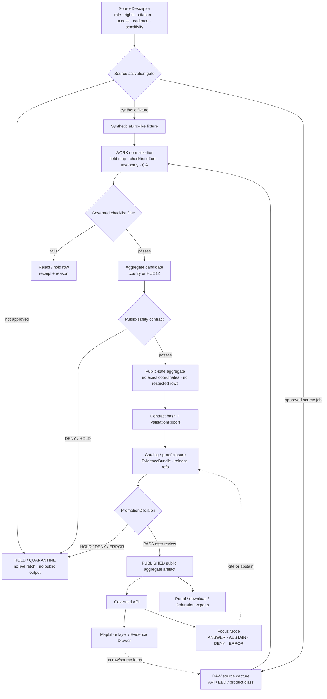

<!-- [KFM_META_BLOCK_V2]
doc_id: kfm://doc/TODO-register-ebird-developer-guide-uuid
title: eBird Developer Guide
type: standard
version: v1
status: draft
owners: TODO(fauna-source-stewards)
created: TODO(verify-original-created-date-or-set-on-first-commit)
updated: 2026-05-07
policy_label: TODO(verify-public-or-restricted)
related: ["../../README.md", "../../INGEST_EBIRD.md", "../../SOURCE_ROLES.md", "../../GEOPRIVACY.md", "../../VALIDATION.md", "EBIRD_ARCHITECTURE.md", "EBIRD_CONTRACTS.md", "EBIRD_CONFORMANCE.md", "EBIRD_FEDERATION.md", "EBIRD_PORTAL.md", "EBIRD_QUALITY_AND_TRIAGE.md", "../../../../runbooks/fauna/EBIRD_OPERATIONS.md", "../../../../../policy/fauna/ebird.rego", "../../../../../configs/fauna/ebird/README.md", "../../../../../data/registry/fauna/README.md"]
tags: [kfm, fauna, ebird, developer-guide, occurrence-support, geoprivacy, public-aggregate]
notes: [Revises the existing short eBird Developer Guide into a governed source-adapter guide; doc_id, owners, created date, and policy_label remain TODO until registry/steward verification; local workspace was not a mounted checkout, so repo-state claims remain bounded to GitHub connector evidence and marked where needed.]
[/KFM_META_BLOCK_V2] -->

<a id="top"></a>

# eBird Developer Guide

Developer-facing guide for building, testing, and maintaining KFM’s governed eBird source adapter without bypassing evidence, policy, geoprivacy, release state, or source terms.

<p>
  
  
  
  
  
  = 10" src="https://img.shields.io/badge/suppression-n_%3E%3D_10-b60205?style=flat-square">
  
</p>

> [!IMPORTANT]
> **Impact block**
>
> | Field | Value |
> |---|---|
> | Status | `draft` |
> | Target path | `docs/domains/fauna/sources/ebird/EBIRD_DEVELOPER_GUIDE.md` |
> | Primary role | Developer guide for eBird source-adapter, fixtures, smoke checks, public aggregate contracts, and release-safe runtime behavior |
> | Source role | eBird is **occurrence support**, not legal-status authority |
> | Default dev mode | No-network synthetic fixtures first |
> | Live source posture | Manual/steward-approved source job only after source activation and terms review |
> | Public geometry posture | `exact_points=restricted`; no public exact coordinates |
> | Public aggregate posture | County/HUC12 aggregates only unless policy/docs are deliberately updated |
> | Minimum suppression | `suppression_min_n >= 10` |
> | Runtime posture | Public clients consume released KFM artifacts through governed APIs; no browser-to-eBird fetch |
> | Quick jumps | [Scope](#scope) · [Repo fit](#repo-fit) · [Inputs](#inputs) · [Exclusions](#exclusions) · [Architecture flow](#architecture-flow) · [Quickstart](#developer-quickstart) · [Source classes](#ebird-source-classes) · [Credentials](#credentials-and-network-rules) · [Adapter contract](#adapter-contract) · [Filter](#governed-checklist-filter) · [Public aggregate](#public-aggregate-contract) · [Testing](#testing-matrix) · [Troubleshooting](#troubleshooting) · [Open verification](#open-verification) |

---

## Scope

This guide is for contributors building or maintaining KFM’s eBird source-family adapter, fixtures, validation surfaces, public aggregate outputs, and developer-facing smoke checks.

It keeps the existing Layer 10 productization rules, then expands them into a practical development guide for:

- fixture-first adapter development;
- source descriptor and activation checks;
- safe handling of eBird API and EBD-derived source material;
- checklist filtering and public aggregation;
- contract hashing and `kfm:spec_hash` behavior;
- suppression, geoprivacy, and public field allowlists;
- policy/validator smoke checks;
- governed API, MapLibre, Evidence Drawer, and Focus Mode boundaries;
- release, rollback, and correction readiness.

### Non-negotiable posture

eBird-derived KFM products are **descriptive occurrence-support derivatives**. They must not be inflated into legal status, true absence, abundance, occupancy, population trend, causal claims, or complete species-census claims unless a separate governed evidence/model product explicitly supports that claim.

> [!WARNING]
> Passing the eBird governed checklist filter is not publication approval. Public release still requires source-role compatibility, source terms review, rights/citation posture, geoprivacy checks, suppression, evidence closure, policy decision, review state, release manifest, correction path, and rollback target.

[Back to top](#top)

---

## Repo fit

This file is a developer guide under the fauna source documentation lane. It explains how developers should work with eBird support code and artifacts; it does not own raw data, credentials, executable policy, schemas, generated proof objects, release decisions, or public artifacts.

| Relationship | Status | Path / surface | Role |
|---|---:|---|---|
| This file | CONFIRMED target | `docs/domains/fauna/sources/ebird/EBIRD_DEVELOPER_GUIDE.md` | Developer guide for eBird adapter/productization work |
| eBird architecture | CONFIRMED | [`EBIRD_ARCHITECTURE.md`](EBIRD_ARCHITECTURE.md) | Source-family architecture and trust boundary |
| eBird contracts | CONFIRMED | [`EBIRD_CONTRACTS.md`](EBIRD_CONTRACTS.md) | Layer 10 contract and public aggregate rules |
| eBird ingest hub | CONFIRMED | [`../../INGEST_EBIRD.md`](../../INGEST_EBIRD.md) | Ingest/productization overview |
| Source-role doctrine | CONFIRMED | [`../../SOURCE_ROLES.md`](../../SOURCE_ROLES.md) | Claim/source compatibility rules |
| Geoprivacy doctrine | CONFIRMED | [`../../GEOPRIVACY.md`](../../GEOPRIVACY.md) | Sensitive-location and public geometry rules |
| Validation doctrine | NEEDS VERIFICATION | [`../../VALIDATION.md`](../../VALIDATION.md) | Human-readable validator and gate expectations |
| Conformance guide | CONFIRMED | [`EBIRD_CONFORMANCE.md`](EBIRD_CONFORMANCE.md) | CLI and artifact conformance posture |
| Federation/export | CONFIRMED | [`EBIRD_FEDERATION.md`](EBIRD_FEDERATION.md) | Public-safe federation and discovery exports |
| Portal/downloads | CONFIRMED | [`EBIRD_PORTAL.md`](EBIRD_PORTAL.md) | Static portal and download bundle manifests |
| Quality/triage | CONFIRMED | [`EBIRD_QUALITY_AND_TRIAGE.md`](EBIRD_QUALITY_AND_TRIAGE.md) | Operational QA and triage-only posture |
| Operations runbook | CONFIRMED | [`../../../../runbooks/fauna/EBIRD_OPERATIONS.md`](../../../../runbooks/fauna/EBIRD_OPERATIONS.md) | Scan, trend, attest, evidence-pack, and incident workflows |
| eBird policy | CONFIRMED | [`../../../../../policy/fauna/ebird.rego`](../../../../../policy/fauna/ebird.rego) | Executable public aggregate denial rules |
| Safe eBird configs | CONFIRMED | [`../../../../../configs/fauna/ebird/README.md`](../../../../../configs/fauna/ebird/README.md) | Non-secret config posture |
| Source registry | NEEDS VERIFICATION | [`../../../../../data/registry/fauna/README.md`](../../../../../data/registry/fauna/README.md) | SourceDescriptor, rights, source-role, sensitivity, and cadence |
| Connector executable path | NEEDS VERIFICATION | `tools/connectors/fauna/kfm-ebird-ingest/*` | Documented/test-referenced command surface; executable files must be confirmed in checkout |
| eBird validators | CONFIRMED / NEEDS VERIFICATION by file | `tools/validators/fauna/validate_ebird_*.ts` | Validator family surfaced in repo search; CI wiring and exact invocation need verification |

### Directory Rules basis

`docs/domains/fauna/sources/ebird/` is the correct responsibility-root placement because this is human-facing domain/source documentation under `docs/`. eBird must not become a root-level domain folder. Machine schemas, policy, validators, tests, configs, lifecycle data, receipts, proof objects, releases, and runtime code belong under their own responsibility roots.

[Back to top](#top)

---

## Inputs

Developer work on this guide and adjacent eBird surfaces accepts only reviewable inputs with declared source role, lifecycle stage, rights posture, and public-safety posture.

| Input | Accepted? | Developer posture |
|---|---:|---|
| Synthetic eBird-like fixtures | ✅ | Preferred first proof path; no-network, no credentials, no real restricted rows |
| eBird source descriptor | ✅ | Must record role, rights, citation, access class, cadence, sensitivity, allowed uses, and activation state |
| eBird API response examples | CONDITIONAL | Use only redacted/minimal examples; never include API keys, private localities, or exact sensitive coordinates |
| eBird Basic Dataset-derived records | CONDITIONAL | RAW source material only after approval/terms review; not committed as docs or public fixtures |
| eBird Observation Dataset / GBIF-style public occurrence records | CONDITIONAL | Discovery/occurrence-support only; not sampling-effort equivalent |
| eBird Status and Trends products | CONDITIONAL | Model/product support class; not raw observation proof |
| Public county aggregate candidate | ✅ | Must satisfy filter, suppression, field allowlist, policy, evidence, and release checks |
| Public HUC12 aggregate candidate | ✅ | Same posture as county aggregate; no exact coordinates |
| Contract hash payload | ✅ | Canonical JSON SHA-256 excluding volatile fields |
| Promotion/release/correction metadata | ✅ | Must preserve release identity, evidence refs, correction lineage, and rollback target |
| Developer smoke reports | ✅ | No-network by default; live probes manual and explicitly gated |

[Back to top](#top)

---

## Exclusions

| Excluded material | Required handling | Reason |
|---|---|---|
| eBird API keys, EBD access keys, cookies, tokens, private URLs | Never commit; use local environment or secret manager | Secrets cannot appear in docs, fixtures, config examples, public bundles, portals, or Focus context |
| Raw EBD files or raw API captures in docs | Governed lifecycle homes only after source activation | RAW is not documentation or public truth |
| Public exact coordinates | Deny | Public eBird products use aggregate/generalized support |
| Restricted observations | Deny from public outputs | Prevent sensitive-location and source-term leakage |
| Private locality or observer-sensitive fields | Deny from public outputs | Protect privacy and source restrictions |
| Quarantine paths | Deny from public outputs | Quarantine is not published evidence |
| Suppression receipts and suppressed-group details | Restricted receipt/proof homes only | Suppression internals can leak low-count or sensitive patterns |
| Legal-status claims from eBird | Deny unless separate legal/status authority evidence supports the claim | eBird is occurrence support in this lane |
| Occupancy, abundance, true absence, causal, census, or population-trend claims | Deny or abstain unless separately governed evidence/model supports them | Public aggregates alone do not carry those claims |
| Browser-to-source eBird fetch | Deny | Public runtime consumes released KFM artifacts through governed API |
| Direct AI/model access to eBird data | Deny | AI is interpretive and evidence-bounded |

[Back to top](#top)

---

## Architecture flow



### Flow rules

1. **Source descriptor before source job.** Do not run live source fetch until source role, terms, rights, citation, access class, cadence, and sensitivity are recorded.
2. **Fixture-first development.** Build and test against synthetic fixtures before live eBird material.
3. **Live source material stays lifecycle-bound.** Source-native records start as RAW; they do not enter docs, public API, portal, or map surfaces directly.
4. **Filter is not release.** The checklist filter only admits candidate rows into aggregation.
5. **Public artifacts are aggregate/generalized.** Public products are county/HUC12 aggregates with suppression and coordinate denial.
6. **Runtime consumes released KFM artifacts.** API/UI/Focus surfaces consume release-backed KFM payloads, not eBird source APIs.

[Back to top](#top)

---

## Developer quickstart

> [!CAUTION]
> Commands below are development templates. Run them only in a verified checkout. Do not run live eBird network calls in CI, public runtime, examples, or docs unless source activation, token handling, terms review, and steward approval are complete.

### 1. Confirm repository reality

```bash
git status --short
git branch --show-current

find .github docs contracts schemas policy data apps packages tools tests pipelines migrations configs release \
  -maxdepth 3 -type f 2>/dev/null | sort | sed -n '1,240p'
```

Expected result: actual repo conventions are visible before editing code, docs, schemas, policy, validators, or tests.

### 2. Inventory the eBird lane

```bash
find docs/domains/fauna/sources/ebird docs/runbooks/fauna policy/fauna configs/fauna/ebird tools/validators/fauna \
  -maxdepth 2 -type f 2>/dev/null | sort
```

Expected result: adjacent eBird docs, policy, validator, config, and runbook surfaces are visible and no local changes overwrite prior work blindly.

### 3. Read the required companion docs

| Read first | Why |
|---|---|
| [`EBIRD_ARCHITECTURE.md`](EBIRD_ARCHITECTURE.md) | Architecture boundary and trust posture |
| [`EBIRD_CONTRACTS.md`](EBIRD_CONTRACTS.md) | Layer 10 contract, hash, public aggregate, and policy mirror |
| [`../../SOURCE_ROLES.md`](../../SOURCE_ROLES.md) | Source-role and claim compatibility |
| [`../../GEOPRIVACY.md`](../../GEOPRIVACY.md) | Sensitive-location and public geometry rules |
| [`../../INGEST_EBIRD.md`](../../INGEST_EBIRD.md) | Ingest/productization overview |
| [`../../../../runbooks/fauna/EBIRD_OPERATIONS.md`](../../../../runbooks/fauna/EBIRD_OPERATIONS.md) | Operational scan, attest, evidence-pack, and incident workflows |
| [`../../../../../policy/fauna/ebird.rego`](../../../../../policy/fauna/ebird.rego) | Executable denial posture |

### 4. Run no-network smoke checks

```bash
tools/connectors/fauna/kfm-ebird-ingest/kfm-ebird-doctor \
  --strict \
  --json
```

```bash
tools/connectors/fauna/kfm-ebird-ingest/kfm-ebird-conformance \
  --aggregate both \
  --format jsonl \
  --json
```

Expected posture:

| Smoke check | Required result |
|---|---|
| Network behavior | No eBird downloads, no live source fetch, no credentials |
| Public geometry | No exact coordinates |
| Suppression | `suppression_min_n >= 10` visible where public aggregate products are tested |
| Output format | JSON or JSONL as requested |
| Hash behavior | Contract hash reproducible over canonical payload |
| Failure mode | Finite outcome and reason codes, not silent pass |

### 5. Verify policy behavior

Use the repo-standard policy runner once confirmed. Example pattern only:

```bash
# Example only — verify repo policy runner first.
opa eval \
  --data policy/fauna/ebird.rego \
  --input tests/fixtures/fauna/ebird/invalid/ebird_public_row_contains_latitude.json \
  'data.kfm.fauna.ebird.deny'
```

Expected result: invalid public rows with exact-coordinate fields are denied.

[Back to top](#top)

---

## eBird source classes

KFM must distinguish eBird source classes because they support different claims.

| Source class | KFM role | Developer posture |
|---|---|---|
| eBird API | Live source endpoint for recent observations, taxonomy, region products, and related lookups | Manual/steward-approved source job only; key in header; no public runtime calls |
| eBird Basic Dataset | Source-native observation/checklist dataset | RAW source snapshot only after request/approval/terms review; not committed to docs |
| eBird Observation Dataset via public aggregator | Basic occurrence discovery/public occurrence data | Occurrence support with limitations; not sampling-effort equivalent |
| eBird Status and Trends | Modeled distribution/relative abundance/trend product class | Model/product support only; do not treat as raw observations |
| Synthetic eBird fixtures | Local no-network implementation and policy proof | Preferred first developer path |

### Source class constraints

- eBird API observations can include exact latitude/longitude and locality fields; those belong in restricted lifecycle handling, not public aggregate outputs.
- API keys are tied to eBird accounts and must be guarded.
- eBird-derived data has terms, attribution, and downstream-use constraints.
- Status and Trends products are modeled outputs and must remain labeled as model support.
- Public aggregate KFM outputs must carry limitations and evidence/release references.

[Back to top](#top)

---

## Credentials and network rules

### Required token posture

| Rule | Requirement |
|---|---|
| Token storage | Use local environment or secret manager; never commit tokens |
| Token transmission | Prefer `x-ebirdapitoken` header |
| Query-string keys | Avoid in examples and operational code because URLs are commonly logged |
| CI | Do not require live eBird tokens for default CI |
| Docs and fixtures | Never include real keys, cookies, tokens, private URLs, or private source download paths |
| Public runtime | No browser-to-eBird source fetch |
| Logs | Do not log full request headers, private URLs, or token-bearing URLs |
| Failures | Return `ERROR` or `DENY` with sanitized reason codes |

### Live probe template

Use only for manual local verification after source activation and terms review.

```bash
curl --fail --silent --show-error \
  --header "x-ebirdapitoken: ${EBIRD_API_TOKEN:?set token in local shell only}" \
  "https://api.ebird.org/v2/data/obs/US-KS/recent?back=1&maxResults=5"
```

> [!WARNING]
> A successful live API response does not authorize ingestion, redistribution, publication, public UI exposure, or model use. Live source activation still requires KFM source descriptor, rights, citation, geoprivacy, policy, review, and release controls.

[Back to top](#top)

---

## Adapter contract

The adapter should be designed as a governed source job, not as a public data service.

| Stage | Developer contract | Failure posture |
|---|---|---|
| Source descriptor | Load source role, rights, citation, access class, cadence, sensitivity, allowed uses, and activation status | `DENY` or `HOLD` live fetch if unresolved |
| Fetch / load | Use approved source class; capture retrieval time, source URL class, parameters, response metadata, and source hash where practical | `ERROR` if malformed; `HOLD` if terms/source class mismatch |
| RAW capture | Store source-native data in lifecycle-approved RAW home only | No public exposure |
| Field mapping | Map eBird fields into KFM internal names; keep exact coordinates restricted | `DENY` public coordinate leakage |
| Checklist QA | Preserve effort fields needed for governed filter | `HOLD` rows missing required effort support |
| Taxonomy handling | Use source taxonomy/version and record unresolved/ambiguous IDs | `ABSTAIN` or `HOLD` on ambiguity |
| Governed filter | Apply Layer 10 checklist filter before aggregate candidate creation | Exclude or hold failed rows |
| Aggregation | Build county/HUC12 aggregate candidates only unless policy/docs update | `DENY` unsupported aggregate units |
| Suppression | Enforce `suppression_min_n >= 10` and row-level threshold | `DENY` low-count public rows |
| Public field allowlist | Exclude coordinate/geometry/private/local/raw/quarantine/suppression internals | `DENY` leakage |
| Hashing | Compute canonical hash excluding volatile fields | `ERROR` malformed hash |
| Evidence closure | Attach release/proof/EvidenceBundle refs to claim-bearing outputs | `ABSTAIN` or `HOLD` if unresolved |
| Promotion | Require policy, validation, release manifest, correction path, rollback target | `HOLD`, `DENY`, or `ERROR` |

[Back to top](#top)

---

## Governed checklist filter

The preserved Layer 10 checklist filter is:

```sql
complete = TRUE
AND protocol_type != 'Incidental'
AND duration_min >= 5
AND distance_km <= 5
AND number_observers <= 10
```

| Filter | Purpose | Failure outcome |
|---|---|---|
| `complete = TRUE` | Prefer complete checklist support over ambiguous partial support | Exclude or hold |
| `protocol_type != 'Incidental'` | Avoid weak protocol/effort support | Exclude from governed aggregate candidate |
| `duration_min >= 5` | Require minimum effort signal | Exclude or hold |
| `distance_km <= 5` | Keep checklist effort spatially bounded | Exclude from public aggregate candidate |
| `number_observers <= 10` | Avoid unusually large observer groups skewing support | Exclude or triage |

### Filter implementation notes

- Treat missing required fields as `HOLD`, not silent failure.
- Keep original source values available only in restricted/internal lifecycle artifacts where allowed.
- Emit row rejection counts and reason codes.
- Do not treat filtered-out rows as biological absence.
- Do not treat accepted rows as public until aggregate, suppression, policy, and release checks pass.

[Back to top](#top)

---

## Endpoint planning

All endpoint use is **NEEDS VERIFICATION** before live activation. This table is for adapter planning, not an authorization to fetch.

| eBird API family | Possible developer use | KFM posture |
|---|---|---|
| Recent observations by region | Source probe or live source job after activation | RAW source input only; not public runtime |
| Recent observations by species and region | Source probe or scoped source job after activation | RAW source input only; not public runtime |
| Nearby recent observations | Generally avoid unless specifically justified | High exact-location risk; source job only |
| Historic observations by date | Source job where time-scoped evidence is required | RAW source input only; preserve date/source scope |
| Region/list products | Region support and lookup | Verify mapping before relying on geography |
| Taxonomy endpoints | Taxonomy/source-code support | Record taxonomy version/source date where available |
| Checklist/view endpoints | Effort/checklist support where authorized | Respect terms and avoid public exact-detail leakage |

> [!CAUTION]
> eBird API responses can contain fields such as latitude, longitude, locality, private-location indicators, validation/review state, and checklist IDs. Public KFM aggregate outputs must deny exact-coordinate and restricted fields even when the source response contains them.

[Back to top](#top)

---

## Public aggregate contract

A public aggregate eBird artifact must satisfy the contract below before promotion.

| Contract field | Required value / behavior | Failure outcome |
|---|---|---|
| `object_type` | `AggregateOccurrence` or accepted public aggregate object name | `DENY` / `HOLD` |
| `source_role` | `occurrence_support` or repo-approved equivalent | `DENY` if used as legal/status authority |
| `aggregate` | `county` or `huc12` unless policy/docs are intentionally revised | `DENY` |
| `policy_label` | `public_aggregate` | `DENY` |
| `public_safe` | `true` | `DENY` |
| `exact_points` | `restricted` | `DENY` |
| `suppression_min_n` | `>= 10` | `DENY` |
| `checklist_count` | `>= suppression_min_n` | `DENY` |
| `kfm:spec_hash` | `sha256:<64 lowercase hex>` | `DENY` |
| `public_fields` / `allowlist_fields` | Must exclude coordinate and geometry fields | `DENY` |
| Exact-coordinate values | Must not appear in public rows | `DENY` |
| Restricted observations | Must not appear in public rows | `DENY` |
| Quarantine/work/raw paths | Must not appear in public rows, manifests, portal docs, or exports | `DENY` |
| Suppression receipts | Must not appear in public artifacts | `DENY` |
| Evidence refs | Required for claim-bearing public outputs | `ABSTAIN` / `HOLD` |
| Release refs | Required before public publication | `HOLD` / `ERROR` |
| Rollback target | Required before release | `ERROR` |
| Interpretation warning | Required for reports, portals, downloads, consumer docs, and Focus summaries | `HOLD` |

### Required interpretation warning

Use this warning, or a steward-approved equivalent, in public reports, portals, downloads, consumer handoffs, chart captions, and Focus-facing summaries:

> This eBird output is descriptive public aggregate reporting only. It does not show exact observations, does not include restricted records, and must not be interpreted as occupancy, abundance, true absence, population trend, causal effect, legal status, or a complete species census.

[Back to top](#top)

---

## Public field allowlist and denial list

### Preferred public field families

| Field family | Public posture |
|---|---|
| Aggregate identifier | Allowed: county, HUC12, or approved public-safe summary ID |
| Aggregate type | Allowed |
| Time bucket/window | Allowed when it does not reveal restricted observation precision |
| Taxon public label | Allowed when rights/citation permit |
| Public checklist count | Allowed after suppression |
| Public taxon count | Allowed with caveats |
| Release ID | Allowed and recommended |
| `kfm:spec_hash` | Required |
| Evidence/release refs | Allowed when public-safe |
| Limitation text | Required for explanatory surfaces |
| Correction state | Allowed and recommended |

### Denied public fields

| Denied field pattern | Reason |
|---|---|
| `decimalLatitude`, `decimalLongitude` | Exact coordinate leakage |
| `latitude`, `longitude`, `lat`, `lon`, `lng` | Exact coordinate leakage |
| `raw_latitude`, `raw_longitude` | Source-native coordinate leakage |
| `point`, `geom`, `geometry` | Geometry leakage |
| `private_locality`, `restricted_geometry_ref` | Sensitive locality leakage |
| `quarantine_path`, `work_path`, `raw_path` | Lifecycle leakage |
| `suppression_receipt`, `suppressed_group_details` | Suppression/internal leakage |
| `api_key`, `token`, `credentials`, `cookie`, `private_url` | Secret leakage |
| `observer_private_*` | Privacy / rights leakage |
| `source_payload` | Raw-source leakage |

[Back to top](#top)

---

## Contract hash recipe

The contract hash is deterministic and ignores fields that would otherwise change every run.

```text
contract_hash = sha256(canonical_json(contract_payload_without_generated_at_or_contract_hash))
```

| Rule | Required behavior |
|---|---|
| Canonical input | Serialize contract payload using stable key ordering and stable primitive representation |
| Excluded fields | Exclude `generated_at` and `contract_hash` from hash input |
| Output form | Use lowercase SHA-256 hex, preferably with `sha256:` prefix where policy expects `kfm:spec_hash` |
| Volatile fields | Do not include local paths, temporary output directories, wall-clock run labels, or mutable diagnostics |
| Reproducibility | Same semantic contract payload must produce same hash across runs |
| Drift handling | Changed filter, aggregate unit, suppression, public field allowlist, or exact-point posture must change the relevant content/spec hash |
| Review use | Hash differences require changelog/review notes for public-facing contracts |

[Back to top](#top)

---

## Policy and validation gates

| Gate | Outcome on failure | Check |
|---|---:|---|
| Source descriptor gate | `HOLD` / `QUARANTINE` | Source role, rights, citation, cadence, sensitivity, and access class recorded |
| Live source activation gate | `DENY` / `HOLD` | No live fetch without activation decision |
| Credential gate | `ERROR` / `DENY` | No secrets in docs, fixtures, config, logs, public bundles, or URLs |
| Governed filter gate | `HOLD` / `EXCLUDE` | Checklist row meets Layer 10 filter |
| Aggregate unit gate | `DENY` | Public aggregate uses `county` or `huc12` unless policy/docs update |
| Suppression gate | `DENY` | `suppression_min_n >= 10`; row count threshold satisfied |
| Exact-points gate | `DENY` | Public artifact keeps `exact_points=restricted` |
| Coordinate allowlist gate | `DENY` | Public fields exclude coordinate/geometry fields |
| Policy label gate | `DENY` | Public aggregate uses `policy_label=public_aggregate` |
| Spec hash gate | `DENY` | Valid `kfm:spec_hash` exists |
| Restricted data gate | `DENY` | No restricted observations, quarantine paths, suppression internals, exact points, credentials, or private URLs |
| Evidence gate | `ABSTAIN` / `HOLD` | Claims resolve to released evidence/proof/EvidenceBundle references |
| Claim-boundary gate | `HOLD` / `ABSTAIN` | Unsafe inference language removed or rewritten |
| Catalog/proof closure gate | `HOLD` | Public artifact linked to catalog/proof/release state |
| Correction/rollback gate | `HOLD` / `ERROR` | Superseded artifacts carry correction lineage and rollback target |
| Audit critical finding gate | `DENY` / `HOLD` | Critical public-safety findings block public transparency and approval |

[Back to top](#top)

---

## Runtime, API, UI, and Focus contract

Public runtime surfaces consume released public-safe artifacts. They do not fetch live eBird source records, read RAW/WORK/QUARANTINE, or expose restricted fields.

| Surface | Required contract |
|---|---|
| Governed API | Returns finite outcome and public-safe payload only |
| MapLibre layer | Reads released layer manifests/public tiles or approved public GeoJSON only |
| Evidence Drawer | Shows source role, aggregate unit, release ID, policy state, evidence refs, limitations, stale/correction state |
| Focus Mode | Uses released public-safe EvidenceBundles; returns `ANSWER`, `ABSTAIN`, `DENY`, or `ERROR` |
| Portal/downloads | Built from already-public artifacts only; no trackers, remote scripts, credentials, exact coordinates, restricted rows, quarantine paths, or suppression receipts |
| Consumer handoff | Inherits warnings, hashes, policy labels, validation refs, source role, release refs, and correction lineage |
| Review/QA | May inspect validation/audit artifacts without exposing restricted rows in public outputs |

### Runtime outcomes

| Outcome | Meaning |
|---|---|
| `ANSWER` | Released aggregate evidence supports a public-safe descriptive response |
| `ABSTAIN` | Evidence is insufficient, stale, ambiguous, outside the supported claim boundary, or missing EvidenceBundle closure |
| `DENY` | Policy, rights, sensitivity, exact-location, source-role, access, or release-state rules forbid response |
| `ERROR` | Tooling, schema, resolver, integrity, runtime, or release-state failure prevents a reliable answer |

[Back to top](#top)

---

## Testing matrix

| Test class | Default mode | What it proves |
|---|---|---|
| Contract hash test | No-network | Hash excludes `generated_at` and `contract_hash` and stays reproducible |
| Governed filter test | No-network | Fixture rows pass/fail exactly as intended |
| Public field allowlist test | No-network | Public outputs cannot include coordinate, geometry, secret, private locality, raw path, quarantine path, or suppression internals |
| Policy deny test | No-network | `kfm:spec_hash`, suppression, aggregate unit, exact-point, and public aggregate rules fail closed |
| Source descriptor test | No-network | Live source use cannot proceed without role, rights, citation, sensitivity, cadence, and activation state |
| Geoprivacy test | No-network | Public aggregates and layers expose no exact restricted geometry |
| Evidence closure test | No-network | Claim-bearing output resolves to evidence/proof/release refs or abstains |
| Portal/download test | No-network | Public bundles inherit warnings, hashes, policy labels, and validation refs |
| Focus Mode fixture test | No-network | Unsupported exact-location, absence, legal-status, and trend claims return `DENY` or `ABSTAIN` |
| Live API probe | Manual only | Source availability and shape after activation; never release proof by itself |
| Release dry-run | No-network preferred | Public aggregate has validation report, release refs, correction path, and rollback target |

### Negative fixture backlog

<details>
<summary>Fixture ideas</summary>

| Fixture | Expected outcome |
|---|---|
| `ebird_public_row_contains_latitude.json` | `DENY` |
| `ebird_public_row_contains_lng.json` | `DENY` |
| `ebird_public_row_contains_geometry.json` | `DENY` |
| `ebird_public_allowlist_contains_lon.json` | `DENY` |
| `ebird_suppression_min_5.json` | `DENY` |
| `ebird_public_aggregate_missing_spec_hash.json` | `DENY` |
| `ebird_public_aggregate_bad_spec_hash.json` | `DENY` |
| `ebird_public_aggregate_wrong_policy_label.json` | `DENY` |
| `ebird_checklist_count_below_threshold.json` | `DENY` |
| `ebird_live_fetch_without_source_activation.json` | `DENY` or `HOLD` |
| `ebird_occurrence_support_as_legal_authority.json` | `DENY` |
| `ebird_focus_exact_location_request.json` | `DENY` |
| `ebird_focus_absence_claim_from_missing_aggregate.json` | `ABSTAIN` |
| `ebird_analytics_population_trend_wording.md` | `HOLD` |
| `ebird_portal_remote_script.html` | `DENY` |
| `ebird_public_bundle_includes_suppression_receipt.json` | `DENY` |
| `ebird_public_manifest_contains_api_key.json` | `DENY` |
| `ebird_api_key_in_query_url.log` | `DENY` / `ERROR` |
| `ebird_public_export_contains_quarantine_path.json` | `DENY` |

</details>

[Back to top](#top)

---

## Troubleshooting

| Symptom | Likely cause | Safe response |
|---|---|---|
| `kfm:spec_hash missing or malformed` | Hash not generated or wrong format | Regenerate canonical hash; keep volatile fields excluded |
| Public aggregate denied for suppression | `suppression_min_n < 10` or `checklist_count < suppression_min_n` | Do not publish; aggregate at coarser unit or hold |
| Public row denied for coordinates | Coordinate/geometry field leaked into public row | Fix allowlist and regenerate public artifact |
| Focus Mode denies exact-location request | User requested precise observation detail | Keep denial; offer aggregate/public-safe explanation |
| Focus Mode abstains on absence | Public aggregate missing support does not prove true absence | Keep abstention and explain limitation |
| Live API returns unauthorized | Missing/invalid token or token not in header | Fix local env; do not commit key |
| Live API shape changed | Endpoint/version/parameter behavior shifted | Hold live source activation and update source descriptor/tests |
| CI needs eBird token | Test accidentally depends on live source | Convert to synthetic fixture or manual live-probe workflow |
| Portal bundle includes remote script | Portal/download contract violated | Remove remote dependency and rebuild from local assets |
| Public artifact lacks rollback target | Release contract incomplete | Hold promotion until rollback card/release manifest exists |

[Back to top](#top)

---

## Development checklist

Before opening a PR that changes eBird adapter behavior, contracts, policy, fixtures, docs, public artifacts, portal/downloads, or Focus surfaces:

- [ ] Confirm the active checkout and branch.
- [ ] Preserve adjacent eBird docs and update cross-links.
- [ ] Keep metadata placeholders intentional or replace them with registry-confirmed values.
- [ ] Confirm no real eBird credentials, keys, cookies, tokens, or private URLs are present.
- [ ] Confirm no real restricted observations or exact sensitive coordinates are present in fixtures, docs, screenshots, portal assets, or public bundles.
- [ ] Keep eBird described as occurrence support, not legal-status authority.
- [ ] Keep the governed checklist filter synchronized across docs/tests/code.
- [ ] Keep `suppression_min_n >= 10`.
- [ ] Keep public aggregate units limited to county/HUC12 unless policy/docs/tests intentionally change.
- [ ] Keep public `exact_points=restricted`.
- [ ] Keep public rows and allowlists free of coordinate/geometry fields.
- [ ] Compute hash over canonical payload excluding `generated_at` and `contract_hash`.
- [ ] Include interpretation warning in public summaries and handoffs.
- [ ] Ensure EvidenceBundle/release refs exist for claim-bearing outputs.
- [ ] Ensure Focus Mode returns `DENY` or `ABSTAIN` for unsupported claims.
- [ ] Ensure source terms/citation posture is reviewed before live source activation.
- [ ] Ensure critical public-safety findings block public promotion.
- [ ] Ensure correction, withdrawal, and rollback paths remain visible.
- [ ] Update this guide if command names, policy rules, public field allowlists, source classes, or runtime contracts change.

[Back to top](#top)

---

## Open verification

| Item | Status | Needed proof |
|---|---:|---|
| Registered `doc_id` | TODO | Document registry entry |
| Owners | TODO | CODEOWNERS, steward register, or source-lane owner assignment |
| Created date | TODO | Git history or steward-approved first-commit date |
| Policy label | TODO | Repo policy classification |
| CLI executable paths | NEEDS VERIFICATION | Actual executable files, package scripts, or installed entrypoints |
| CLI packaging | NEEDS VERIFICATION | Confirm command installation and invocation from CI/local checkout |
| Policy runner | NEEDS VERIFICATION | OPA/Conftest/Rego or repo-native policy runner command |
| Source descriptor | NEEDS VERIFICATION | eBird SourceDescriptor with source role, terms, citation, cadence, access class, and sensitivity |
| Live source activation | NEEDS VERIFICATION | SourceActivationDecision or equivalent approval |
| eBird terms/citation review | NEEDS VERIFICATION | Current terms, attribution, redistribution limits, downstream-use limits |
| EBD access posture | NEEDS VERIFICATION | Approved request, storage class, raw snapshot rules, and redistribution posture |
| Status and Trends access posture | NEEDS VERIFICATION | Access key/product version, model-use label, and downstream limits |
| Public release object family | NEEDS VERIFICATION | ReleaseManifest / PromotionReceipt / ProofPack conventions |
| Portal/consumer inheritance checks | NEEDS VERIFICATION | Tests proving warnings, hashes, validation refs, and policy labels propagate |
| Full CI enforcement | UNKNOWN | Workflow evidence and check results |
| Source endpoint field drift | NEEDS VERIFICATION | Live probe or fixture update after source-doc/version changes |

[Back to top](#top)

---

## Appendix

<details>
<summary>Manual source-activation checklist</summary>

- [ ] Source role recorded as `occurrence_support`.
- [ ] Current eBird API terms reviewed.
- [ ] Current eBird data access terms reviewed.
- [ ] Attribution/citation requirements recorded.
- [ ] API key handling documented without exposing the key.
- [ ] EBD/EOD/API/Status-and-Trends source classes separated.
- [ ] Redistribution/public-release posture recorded.
- [ ] Record/product-level license constraints represented where applicable.
- [ ] Public aggregate release allowed by terms or explicitly reviewed.
- [ ] Sensitive/geoprivacy posture recorded.
- [ ] Source cadence and retrieval/update time recorded.
- [ ] Source activation decision recorded before live job runs.
- [ ] Live source output held in RAW/WORK until validated and promoted.
- [ ] No public output contains exact coordinates or restricted rows.

</details>

<details>
<summary>Maintainer update triggers</summary>

Update this guide when any of the following changes:

- eBird source role;
- eBird terms, citation posture, access method, or redistribution posture;
- source descriptor schema or source activation workflow;
- governed checklist filter;
- suppression threshold;
- aggregate unit vocabulary;
- public field allowlist or denial list;
- public geometry class;
- contract hash recipe;
- `kfm:spec_hash` rules;
- CLI command names or executable paths;
- policy file behavior;
- validation runner behavior;
- portal/download contract;
- analytics claim-boundary wording;
- consumer handoff contract;
- red-team fixture families;
- release/rollback/correction procedure;
- Evidence Drawer payload contract;
- Focus Mode response contract.

</details>

<details>
<summary>Reference links</summary>

- [eBird API documentation][ext-ebird-api-docs]
- [eBird API terms][ext-ebird-api-terms]
- [eBird data products][ext-ebird-data-products]
- [eBird Status and Trends data access][ext-ebird-status-trends]
- [`ebirdst` data access notes][ext-ebirdst-data-access]

</details>

[ext-ebird-api-docs]: https://documenter.getpostman.com/view/664302/S1ENwy59
[ext-ebird-api-terms]: https://support.ebird.org/en/support/solutions/articles/48000838205-ebird-api-terms-of-use
[ext-ebird-data-products]: https://science.ebird.org/en/use-ebird-data/download-ebird-data-products
[ext-ebird-status-trends]: https://science.ebird.org/en/status-and-trends/data-access
[ext-ebirdst-data-access]: https://ebird.github.io/ebirdst/
