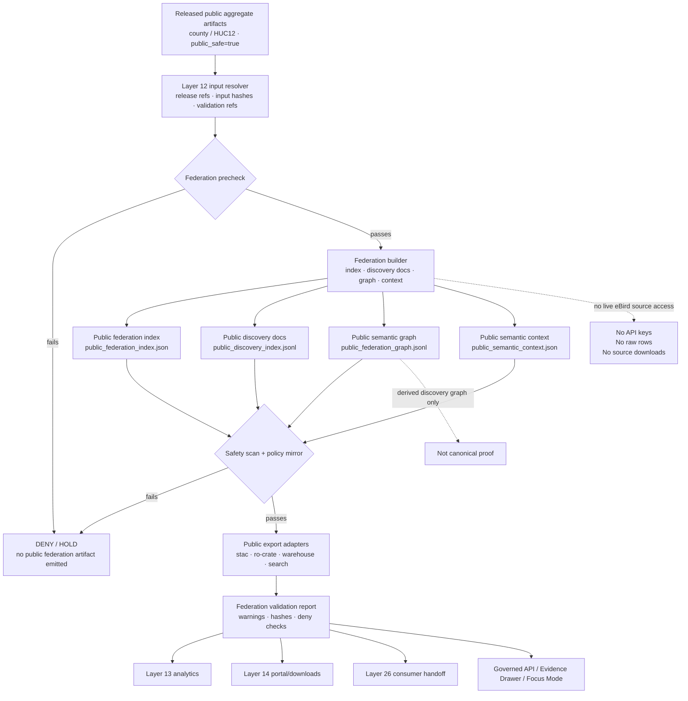

<!-- [KFM_META_BLOCK_V2]
doc_id: kfm://doc/TODO-register-ebird-federation-uuid
title: eBird Federation
type: standard
version: v1
status: draft
owners: TODO(fauna-source-stewards)
created: TODO(verify-original-created-date-or-set-on-first-commit)
updated: 2026-05-07
policy_label: TODO(verify-public-or-restricted)
related: ["../../README.md", "../../INGEST_EBIRD.md", "../../SOURCE_ROLES.md", "../../GEOPRIVACY.md", "../../VALIDATION.md", "EBIRD_ARCHITECTURE.md", "EBIRD_CONTRACTS.md", "EBIRD_ANALYTICS.md", "EBIRD_PORTAL.md", "EBIRD_CONSUMER_INTEGRATION.md", "EBIRD_QUALITY_AND_TRIAGE.md", "../../../../runbooks/fauna/EBIRD_OPERATIONS.md", "../../../../../policy/fauna/ebird.rego", "../../../../../data/registry/fauna/README.md"]
tags: [kfm, fauna, ebird, federation, discovery, public-aggregate, evidence, geoprivacy, layer-12]
notes: [Revises an existing short Layer 12 eBird federation note; doc_id, owners, created date, and policy_label remain TODO until registry/steward verification; local workspace was not a mounted checkout, so implementation-depth claims are based on GitHub connector inspection and marked where needed.]
[/KFM_META_BLOCK_V2] -->

<a id="top"></a>

# eBird Federation

Public-safe federation, discovery, export, and semantic-context guidance for already-released eBird aggregate artifacts in the KFM fauna lane.

<p>
  
  
  
  
  
  
  
  
</p>

> [!IMPORTANT]
> **Impact block**
>
> | Field | Value |
> |---|---|
> | Status | `draft` |
> | Target path | `docs/domains/fauna/sources/ebird/EBIRD_FEDERATION.md` |
> | Layer | `12` — public-safe federation, discovery, export, and semantic graph handoff |
> | Primary role | Federate already-published county/HUC12 eBird aggregate artifacts into public discovery and export surfaces |
> | Source role | eBird remains occurrence support; not legal-status authority |
> | Public geometry posture | Aggregate/generalized only; `exact_points=restricted` |
> | Runtime posture | No eBird downloads, no credentials/API keys, no live source calls, no direct public source fetch |
> | Public artifact posture | No exact coordinates, geometries, restricted rows, quarantine paths, suppression receipts, or suppressed-group details |
> | Downstream consumers | Layer 13 analytics, Layer 14 portal/downloads, Layer 26 consumer handoff, governed API, Evidence Drawer, Focus Mode |
> | Quick jumps | [Scope](#scope) · [Repo fit](#repo-fit) · [Inputs](#inputs) · [Exclusions](#exclusions) · [Federation flow](#federation-flow) · [Workflows](#workflows) · [Federation contracts](#federation-contracts) · [Discovery docs](#discovery-docs) · [Semantic graph](#semantic-graph) · [Export modes](#export-modes) · [Claim boundary](#claim-boundary) · [Validation gates](#validation-gates) · [Review checklist](#review-checklist) · [Open verification](#open-verification) |

---

## Scope

Layer 12 adds **public-safe federation, discovery, semantic graph, and export packaging** for eBird aggregate outputs that have already passed upstream KFM gates.

This file preserves the existing Layer 12 intent and expands it into a maintainable source-family document. It does not authorize live eBird access, raw data redistribution, public exact points, hidden sensitive joins, or stronger ecological claims than the released aggregate evidence supports.

### Layer 12 is allowed to

- federate already-released county or HUC12 aggregate artifacts;
- build public discovery indexes;
- build public discovery documents;
- build a public semantic graph for discovery and handoff;
- publish a public JSON-LD context for released aggregate semantics;
- produce public-safe export packages for catalog, search, warehouse, portal, and consumer handoff use;
- preserve release refs, input hashes, validation refs, policy labels, evidence refs, warnings, correction lineage, and rollback targets;
- support downstream public-safe analytics, portals, downloads, mock consumers, Evidence Drawer payloads, and Focus Mode context.

### Layer 12 is not allowed to

- download eBird data;
- request, store, display, or package credentials, API keys, tokens, cookies, or private URLs;
- read RAW, WORK, QUARANTINE, restricted stores, direct source APIs, or unpublished candidate records;
- expose exact coordinates, point geometry, private localities, route geometry, or reverse-engineerable fields;
- expose restricted observations, quarantine paths, suppression receipts, or suppressed-group details;
- turn discovery/search/semantic graph records into proof;
- treat eBird as legal-status authority;
- claim occupancy, abundance, true absence, population trend, causal effect, or complete census status from public aggregates alone.

> [!WARNING]
> Federation is a downstream public-discovery layer. It helps people find, inspect, export, and consume released public aggregate artifacts. It does not create new evidence, weaken source terms, bypass geoprivacy, or turn a derived graph/search index into canonical truth.

[Back to top](#top)

---

## Repo fit

This document is a human-facing source-layer file under `docs/`. It explains the Layer 12 federation boundary and should not own raw data, machine schemas, policy code, generated exports, release proof objects, credentials, or runtime implementation.

| Relationship | Status | Path / surface | Role |
|---|---:|---|---|
| This document | CONFIRMED target | `docs/domains/fauna/sources/ebird/EBIRD_FEDERATION.md` | Layer 12 federation and export guidance |
| Fauna domain landing page | CONFIRMED | [`../../README.md`](../../README.md) | Fauna lane scope, lifecycle, source roles, public safety, and review posture |
| eBird ingest hub | CONFIRMED | [`../../INGEST_EBIRD.md`](../../INGEST_EBIRD.md) | Ingest, governed filter, productization, policy, and command posture |
| Source-role doctrine | CONFIRMED | [`../../SOURCE_ROLES.md`](../../SOURCE_ROLES.md) | Claim/source compatibility; eBird as occurrence support |
| Geoprivacy posture | CONFIRMED | [`../../GEOPRIVACY.md`](../../GEOPRIVACY.md) | Public geometry classes, redaction receipts, exact-location denial |
| Validation posture | NEEDS VERIFICATION | [`../../VALIDATION.md`](../../VALIDATION.md) | Fail-closed gates, fixture matrix, runtime outcomes, release dry-run |
| Layer 10 contracts | CONFIRMED | [`EBIRD_CONTRACTS.md`](EBIRD_CONTRACTS.md) | Productization contract, governed filter, public aggregate posture |
| Layer 13 analytics | CONFIRMED | [`EBIRD_ANALYTICS.md`](EBIRD_ANALYTICS.md) | Descriptive public aggregate analytics built from Layer 12 inputs |
| Layer 14 portal/downloads | CONFIRMED | [`EBIRD_PORTAL.md`](EBIRD_PORTAL.md) | Public portal and download bundles built from already-public artifacts |
| Layer 21 quality/triage | CONFIRMED | [`EBIRD_QUALITY_AND_TRIAGE.md`](EBIRD_QUALITY_AND_TRIAGE.md) | Operational QA and triage-only posture |
| Layer 26 consumer handoff | CONFIRMED | [`EBIRD_CONSUMER_INTEGRATION.md`](EBIRD_CONSUMER_INTEGRATION.md) | Local-only consumer pack handoff using Layer 12 artifacts |
| Operations runbook | NEEDS VERIFICATION | [`../../../../runbooks/fauna/EBIRD_OPERATIONS.md`](../../../../runbooks/fauna/EBIRD_OPERATIONS.md) | Scan, trend, attest, evidence pack, incident workflows |
| eBird policy gate | CONFIRMED | [`../../../../../policy/fauna/ebird.rego`](../../../../../policy/fauna/ebird.rego) | Executable public aggregate safety policy |
| Fauna registry | CONFIRMED | [`../../../../../data/registry/fauna/README.md`](../../../../../data/registry/fauna/README.md) | Source admission, source roles, rights, sensitivity, verification backlog |
| Federation implementation | NEEDS VERIFICATION | repo-native tool/package home | Physical executable paths, package scripts, CI jobs, and output directories require checkout verification |
| Generated federation artifacts | PROPOSED / NEEDS VERIFICATION | repo-native build, release, or published artifact home | Must not replace receipts, proofs, manifests, EvidenceBundles, or release decisions |

### Directory Rules basis

`docs/domains/fauna/sources/ebird/` is the correct responsibility-root location for this file because it is **human-facing domain/source documentation**. eBird must not become a root-level folder. Machine schemas, policy, validators, tests, generated artifacts, lifecycle data, receipts, proofs, and release objects belong under their own responsibility roots.

[Back to top](#top)

---

## Inputs

Layer 12 accepts only public-safe, release-bound upstream artifacts and metadata.

| Input | Accepted? | Required posture |
|---|---:|---|
| Released county aggregate artifact | Yes | `public_safe=true`, `exact_points=restricted`, `policy_label=public_aggregate`, valid `kfm:spec_hash`, suppression applied |
| Released HUC12 aggregate artifact | Yes | Same as county aggregate; no exact geometry or coordinate field leakage |
| Layer 10 contract summary | Yes | Governed filter, public field allowlist, suppression, hash, and claim-boundary rules |
| Catalog record | Yes | Public-safe catalog closure for the released aggregate |
| EvidenceBundle or public evidence refs | Yes | Evidence support for claim-bearing discovery/export records |
| Release manifest or release refs | Yes | Release identity, current/superseded/withdrawn state, rollback target |
| Validation report refs | Yes | Must prove public aggregate, field allowlist, suppression, exact-point, and policy checks |
| Public analytics warning text | Yes | Used to propagate descriptive-only interpretation warnings |
| Synthetic fixtures | Yes | Useful for federation tests; must be fixture-only and public-safe |
| Raw eBird data | No | Excluded from Layer 12 |
| Live eBird API/EBD access | No | Excluded from Layer 12 |
| Restricted rows | No | Excluded from public federation |

### Minimum input assertions

A federation build should refuse an input set unless the following can be established:

| Assertion | Required value |
|---|---|
| `public_safe` | `true` |
| `exact_points` | `restricted` |
| `policy_label` | `public_aggregate` |
| `aggregate` | `county` or `huc12` |
| `suppression_min_n` | `>= 10` |
| `kfm:spec_hash` | present and valid |
| coordinate fields | absent from public rows, descriptors, graph nodes, search docs, and allowlists |
| restricted rows | absent |
| quarantine paths | absent |
| suppression receipts | absent from public federation/export artifacts |
| interpretation warning | present |
| validation refs | present |
| release refs | present |
| correction lineage | present when superseded, withdrawn, replaced, or corrected |

[Back to top](#top)

---

## Exclusions

| Excluded material | Required handling | Why |
|---|---|---|
| eBird API calls | Deny in Layer 12 | Federation starts from released KFM public aggregates |
| eBird credentials, API keys, cookies, tokens, private URLs | Never commit, package, or request | Secrets do not belong in docs, fixtures, public artifacts, portals, or Focus context |
| Raw EBD files or raw API captures | Governed lifecycle homes only after source activation | RAW source material is not a public federation input |
| Exact latitude/longitude, point geometry, route geometry, precise station geometry | Deny from public contracts, indexes, graphs, and exports | Public eBird outputs remain aggregate/generalized |
| Restricted observations | Deny from public federation | Avoid sensitive-location and source-term leakage |
| Quarantine paths | Deny | Quarantine is not published evidence |
| Suppression receipts or suppressed-group details | Deny from public federation | Suppression internals can leak low-count or sensitive patterns |
| Hidden rejoin keys to exact observations | Deny | Public federation must not enable reconstruction of restricted records |
| Legal-status claims from eBird | Deny unless separate legal/status authority evidence supports them | eBird remains occurrence support in this lane |
| Occupancy, abundance, true absence, population trend, causal, or census language | Deny or rewrite | Public aggregates do not support those claims by themselves |
| Semantic graph as proof | Deny | The graph is a derived discovery/index layer, not root truth |
| Direct model context or AI-generated claims as evidence | Deny | AI is interpretive only and evidence-bounded |

[Back to top](#top)

---

## Federation flow



### Flow rules

1. Layer 12 starts from **released public aggregate artifacts**, not raw source data.
2. Federation must preserve release identity, input hashes, validation refs, evidence refs, policy labels, warnings, and correction lineage.
3. Public indexes, graph records, and export descriptors must carry the same public-safety posture as their inputs.
4. A failed public-safety gate emits no public federation artifact.
5. The semantic graph and search/export indexes are derived public-discovery views. They are not canonical truth, release authority, policy authority, or citation authority.
6. Downstream analytics, portal, download, consumer, API, Evidence Drawer, and Focus surfaces inherit Layer 12 warnings and validation references.

[Back to top](#top)

---

## Workflows

The existing Layer 12 note names two command families. Preserve the names as documented command contracts, but verify executable paths, package scripts, and CI invocation before treating them as confirmed implementation.

```bash
# DOCUMENTED / NEEDS VERIFICATION
kfm-ebird-federate --mode build|validate|diff|report|index
```

```bash
# DOCUMENTED / NEEDS VERIFICATION
kfm-ebird-export --mode stac|ro-crate|warehouse|search|all|validate
```

### Workflow modes

| Command | Mode | Intended role | Required posture |
|---|---|---|---|
| `kfm-ebird-federate` | `build` | Build public federation artifacts from released aggregate inputs | No network, no credentials, no raw rows |
| `kfm-ebird-federate` | `validate` | Validate public-safety, hashes, field allowlists, graph safety, and warning propagation | Fail closed |
| `kfm-ebird-federate` | `diff` | Compare federation outputs across releases | Release-bound diffs only; not biological trend |
| `kfm-ebird-federate` | `report` | Emit human-readable federation summary | Descriptive-only warnings required |
| `kfm-ebird-federate` | `index` | Build public discovery index and docs | No exact geometry or restricted fields |
| `kfm-ebird-export` | `stac` | Build STAC-style public catalog/export descriptors | Public-safe metadata only |
| `kfm-ebird-export` | `ro-crate` | Build RO-Crate-style public research object export descriptors | No raw source rows or restricted data |
| `kfm-ebird-export` | `warehouse` | Build field-allowlisted public warehouse/load descriptors | No exact coordinates or hidden join keys |
| `kfm-ebird-export` | `search` | Build public search/discovery documents | No sensitive autocomplete leakage |
| `kfm-ebird-export` | `all` | Build all public export surfaces | Every adapter must pass safety scan |
| `kfm-ebird-export` | `validate` | Validate export surfaces | Deny unsafe or unsupported outputs |

> [!CAUTION]
> Layer 12 command names are documented. The physical executable paths, package installation, generated output locations, and CI wiring are **NEEDS VERIFICATION** until confirmed in a checked-out repository.

[Back to top](#top)

---

## Federation contracts

Layer 12 public federation artifacts should be small, deterministic, hash-addressed, and safe to inspect.

| Artifact | Status | Purpose | Required controls |
|---|---:|---|---|
| `public_federation_index.json` | CONFIRMED from existing note | Top-level public federation index across released aggregate artifacts | Release refs, input hashes, warnings, validation refs, no restricted fields |
| `public_discovery_index.jsonl` | CONFIRMED from existing note | Public discovery document stream for search, portal, and consumer handoff | Field allowlist, no coordinates, no geometries, no suppressed details |
| `public_federation_graph.jsonl` | CONFIRMED from existing note | Public semantic graph edges linking released artifacts, aggregate units, evidence refs, validation refs, and correction lineage | Derived discovery graph only; no exact location nodes |
| `public_semantic_context.json` | CONFIRMED from existing note | JSON-LD context for public terms used by federation outputs | Public terms only; no authority escalation |
| `public_export_manifest.json` | PROPOSED | Manifest listing STAC-style, RO-Crate-style, warehouse, and search exports | Output hashes, release refs, validation refs, warning refs |
| `federation_validation_report.json` | PROPOSED | Machine-readable validation report for Layer 12 outputs | Gate results, deny findings, warnings, checked files |
| `federation_receipt.json` | PROPOSED | Build receipt for reproducibility and rollback | Input refs, tool version, output hashes, validation state |

### Illustrative federation index envelope

```json
{
  "object_type": "EbirdPublicFederationIndex",
  "layer": 12,
  "source_family": "ebird",
  "public_safe": true,
  "exact_points": "restricted",
  "policy_label": "public_aggregate",
  "aggregate_targets": ["county", "huc12"],
  "suppression_min_n": 10,
  "input_release_refs": ["TODO_RELEASE_REF"],
  "input_spec_hashes": ["sha256:TODO"],
  "artifacts": {
    "discovery_docs": "public_discovery_index.jsonl",
    "semantic_graph": "public_federation_graph.jsonl",
    "semantic_context": "public_semantic_context.json"
  },
  "validation_refs": ["TODO_VALIDATION_REF"],
  "interpretation_warnings": [
    "Descriptive public aggregate reporting only.",
    "Do not interpret as occupancy, abundance, true absence, population trend, causal effect, legal status, or complete census."
  ],
  "correction_lineage": [],
  "kfm:spec_hash": "sha256:TODO"
}
```

[Back to top](#top)

---

## Discovery docs

Public discovery documents are findability records. They should make public aggregate artifacts easier to locate and inspect without exposing private source material or inflating claim authority.

### Allowed discovery fields

| Field family | Public posture |
|---|---|
| Public discovery ID | Allowed and recommended |
| Release ID / release ref | Allowed and recommended |
| Aggregate unit | Allowed: `county`, `huc12`, or approved public-safe summary unit |
| Aggregate ID | Allowed when public-safe |
| Time window | Allowed when not revealing restricted observation precision |
| Public checklist count | Allowed after suppression |
| Reported public taxon count | Allowed with caveats |
| Source role | Allowed and required: occurrence support |
| Public artifact refs | Allowed when public-safe |
| Evidence/release refs | Allowed when public-safe |
| Validation refs | Allowed when public-safe |
| `kfm:spec_hash` | Required |
| Interpretation warning | Required |
| Correction state | Allowed and recommended |

### Denied discovery fields

| Field pattern | Reason |
|---|---|
| `decimalLatitude`, `decimalLongitude`, `latitude`, `longitude`, `lat`, `lon` | Exact coordinate leakage |
| `point`, `geom`, `geometry`, `route_geometry`, `station_geometry` | Geometry leakage |
| `raw_latitude`, `raw_longitude`, `source_payload` | Source-native leakage |
| `private_locality`, `observer_private_*` | Privacy / rights leakage |
| `restricted_geometry_ref` contents | Sensitive-location leakage |
| `quarantine_path`, `work_path`, `raw_path` | Lifecycle leakage |
| `suppression_receipt`, `suppressed_group_details` | Suppression/internal leakage |
| `api_key`, `token`, `credentials`, `cookie`, `private_url` | Secret leakage |
| hidden rejoin keys to precise rows | Reverse-engineering risk |

### Discovery language rule

Discovery copy must describe **released public aggregate artifacts**, not bird populations. Search labels, summaries, facet names, portal cards, and download metadata must not imply occupancy, abundance, absence, trend, legal status, or census completeness.

[Back to top](#top)

---

## Semantic graph

Layer 12 may emit a public semantic graph for discovery, handoff, and downstream integration. That graph is a derived public index over released artifacts. It is not the canonical fauna graph, not raw evidence, and not release authority.

### Allowed public edge families

| Edge | Purpose | Controls |
|---|---|---|
| `kfm:derivedFromRelease` | Connects federation record to release ref | Release ref must be public-safe |
| `kfm:hasAggregateUnit` | Connects artifact to county/HUC12 summary unit | No exact geometry |
| `kfm:hasSourceRole` | States occurrence-support role | Must not imply legal authority |
| `kfm:hasValidationReport` | Connects artifact to public-safe validation summary | No restricted findings details if public |
| `kfm:hasEvidenceBundle` | Connects claim-bearing record to evidence support | Evidence ref must be safe to expose |
| `kfm:hasWarning` | Carries descriptive-only and geoprivacy warnings | Required on public outputs |
| `kfm:supersedes` | Connects current artifact to prior public release artifact | Correction lineage visible |
| `kfm:hasRollbackTarget` | Connects release/federation artifact to rollback target | Public-safe pointer only |
| `kfm:hasExport` | Connects index to STAC/RO-Crate/warehouse/search descriptors | Export descriptor must pass safety scan |

### Denied public graph content

| Denied content | Reason |
|---|---|
| Exact point nodes | Sensitive-location leakage |
| Restricted observation nodes | Public-safety and source-term leakage |
| Raw source row identifiers that can rejoin exact observations | Reverse-engineering risk |
| Quarantine/work/raw paths | Lifecycle leakage |
| Suppression receipt details | Small-count or sensitive-pattern leakage |
| Legal-status edges from eBird occurrence support | Source-role overclaim |
| “absence,” “occupancy,” “abundance,” “trend,” or “causal” edges from public aggregates alone | Unsupported inference |
| Secret or credential-bearing references | Security violation |

### JSON-LD context posture

`public_semantic_context.json` should define public terms used by Layer 12 artifacts. It must not create new authority by vocabulary choice. A term definition cannot turn an eBird public aggregate into legal status, true absence, complete census, or population-trend evidence.

[Back to top](#top)

---

## Export modes

Layer 12 exports should be public-safe packaging surfaces for downstream systems. They should preserve the KFM trust posture even when consumed outside the original repository.

| Export mode | Output concept | Required controls |
|---|---|---|
| `stac` | STAC-style public catalog/export descriptor for released aggregate artifacts | Public metadata only; release refs, hashes, warnings, no restricted fields |
| `ro-crate` | RO-Crate-style public research object export descriptor | Public-safe files only; citation, license/terms note, warning manifest |
| `warehouse` | Public warehouse/load manifest or table descriptor | Field allowlist, no exact coordinates, no hidden rejoin keys |
| `search` | Public search index or discovery docs | No sensitive autocomplete leakage, no restricted rows |
| `all` | Full public export package | Every output must pass safety scan |
| `validate` | Export validation report | Deny unsafe or unsupported package members |

> [!NOTE]
> Export mode names are documented from the existing Layer 12 note. Exact schemas, output paths, and CI commands remain **NEEDS VERIFICATION** until the checked-out repository confirms implementation.

[Back to top](#top)

---

## Claim boundary

Layer 12 federation is descriptive and release-bound. It describes the public aggregate artifact and its public-safe metadata, not the underlying bird population.

| Safe federation statement | Unsafe federation statement |
|---|---|
| “This federation index lists released public aggregate artifacts for county/HUC12 eBird outputs.” | “This federation index lists all bird observations.” |
| “The discovery document links to a released public aggregate artifact.” | “The discovery document provides exact observations.” |
| “This public aggregate reports `N` checklists after filtering and suppression.” | “There are `N` bird populations here.” |
| “This release differs from the prior release.” | “The population increased or declined.” |
| “This source family is occurrence support.” | “This source family is legal-status authority.” |
| “Coverage is sparse for this unit and time window.” | “The species is absent from this unit.” |
| “No exact observations or restricted records are included.” | “Suppressed details are available in the public bundle.” |
| “This semantic graph supports discovery over released artifacts.” | “This semantic graph is canonical proof.” |

### Required interpretation warning

Use this warning, or a steward-approved equivalent, in federation reports, discovery pages, export manifests, portal/download handoffs, consumer packs, chart captions, Evidence Drawer summaries, and Focus-facing summaries:

> This eBird federation output is descriptive public aggregate reporting only. It does not show exact observations, does not include restricted records, and must not be interpreted as occupancy, abundance, true absence, population trend, causal effect, legal status, or a complete species census.

[Back to top](#top)

---

## Downstream handoff

Layer 12 feeds downstream public-safe surfaces. Each consumer must inherit Layer 12’s warnings, hashes, release refs, validation refs, source-role posture, and correction lineage.

| Downstream surface | Layer 12 handoff requirement |
|---|---|
| [`EBIRD_ANALYTICS.md`](EBIRD_ANALYTICS.md) | Layer 13 uses released public aggregate and Layer 12 federation inputs for descriptive analytics only |
| [`EBIRD_PORTAL.md`](EBIRD_PORTAL.md) | Layer 14 portal/download bundles use already-public artifacts only; no network calls, trackers, remote scripts, credentials, exact coordinates, restricted observations, quarantines, or suppression details |
| [`EBIRD_CONSUMER_INTEGRATION.md`](EBIRD_CONSUMER_INTEGRATION.md) | Layer 26 local-only consumer packs inherit release refs, hashes, validation refs, warnings, and finite outcome behavior |
| Governed API | Serves released public-safe payloads only; no raw source or direct eBird fetch |
| Evidence Drawer | Shows source role, aggregate unit, release ID, policy state, evidence refs, warnings, limitations, and correction lineage |
| Focus Mode | Uses released public-safe EvidenceBundles; unsupported claims return `ABSTAIN`; policy-blocked claims return `DENY` |
| Search/index consumers | Consume public discovery docs only; no restricted autocomplete, hidden row joins, or exact-coordinate fields |
| Warehouse consumers | Load allowlisted public fields only; carry warnings, release refs, validation refs, and correction lineage |

[Back to top](#top)

---

## Validation gates

| Gate | Outcome on failure | Check |
|---|---:|---|
| Input release gate | HOLD | Inputs must be released public aggregate artifacts, not raw, work, quarantine, restricted, or unpublished records |
| Source-role gate | DENY / ABSTAIN | eBird can support occurrence-derived public aggregates only; not legal status, true absence, trend, abundance, or census claims |
| Aggregate unit gate | DENY | Public eBird aggregate federation must use `county` or `huc12` unless policy/docs deliberately change |
| Suppression gate | DENY | `suppression_min_n >= 10`; public rows must not fall below threshold |
| Exact-points gate | DENY | Federation inputs and outputs keep `exact_points=restricted` |
| Coordinate allowlist gate | DENY | Public indexes, graph, search, warehouse, and export descriptors contain no exact coordinate or geometry fields |
| Policy label gate | DENY | Public aggregate records use `policy_label=public_aggregate` |
| Spec hash gate | DENY | Public aggregate and federation outputs carry valid `kfm:spec_hash` or accepted public content hash |
| Restricted data gate | DENY | No restricted observations, quarantine paths, source-private fields, suppression receipts, or suppressed-group details |
| Graph safety gate | DENY | Public semantic graph has no exact-location nodes, no hidden precise row joins, no source-private edges |
| JSON-LD context gate | HOLD | Public context must not create unsupported authority or unsafe claim vocabulary |
| Export safety gate | DENY | Export packages include only public-safe files and allowlisted fields |
| Warning inheritance gate | HOLD | Federation, discovery, graph, export, portal, analytics, and consumer handoffs carry interpretation warnings |
| Evidence/release refs gate | HOLD / ABSTAIN | Claim-bearing records resolve to public-safe evidence/release/proof refs |
| Source terms gate | HOLD / DENY | Public redistribution/export cannot proceed while source-term posture is unresolved |
| Correction lineage gate | HOLD | Superseded or corrected inputs update correction/supersession notes |
| Rollback gate | ERROR | Public-facing federation output lacks rollback target or release alias recovery path |

### Negative states

| State | Use |
|---|---|
| `ANSWER` | Released aggregate evidence supports a public-safe descriptive response |
| `ABSTAIN` | Evidence is insufficient, stale, ambiguous, or outside the supported claim boundary |
| `DENY` | Policy, rights, sensitivity, source-role, exact-location, release-state, or source-term rules forbid output |
| `HOLD` | Maintainer or steward review is required before federation/export release |
| `ERROR` | Tooling, schema, integrity, resolver, or release-state failure prevents a reliable result |

[Back to top](#top)

---

## Output validation checklist

Before a Layer 12 output is treated as public-ready, reviewers should be able to confirm:

- [ ] Inputs are released public aggregate artifacts, not raw, work, quarantine, restricted, or unpublished records.
- [ ] No eBird API call, source download, credential, token, cookie, private URL, or secret-like field is required.
- [ ] `public_safe=true` is preserved.
- [ ] `exact_points=restricted` is preserved.
- [ ] `policy_label=public_aggregate` is preserved where public aggregate rows are involved.
- [ ] `suppression_min_n >= 10` is preserved.
- [ ] `aggregate` is `county` or `huc12` unless policy/docs deliberately change.
- [ ] `kfm:spec_hash` or accepted public content hash is present and valid.
- [ ] Public field allowlists exclude exact coordinate and geometry fields.
- [ ] Discovery docs do not include coordinate, geometry, private locality, observer-private, quarantine, raw/work, or suppression-detail fields.
- [ ] Semantic graph nodes and edges cannot reconstruct exact observations.
- [ ] JSON-LD context does not define unsupported authority, trend, absence, occupancy, abundance, or census semantics.
- [ ] Export packages include only public-safe files.
- [ ] Interpretation warnings are included and inherited downstream.
- [ ] Evidence/release/validation/correction refs are present and public-safe.
- [ ] Source terms, citation, attribution, redistribution, and commercial-use posture are reviewed before external distribution.
- [ ] Rollback/correction paths exist when outputs supersede prior public artifacts.

[Back to top](#top)

---

## Review checklist

Before changing this file or approving Layer 12 federation behavior, verify:

- [ ] Metadata block placeholders remain intentional or are replaced with registry-confirmed values.
- [ ] New relative links exist or are marked `NEEDS VERIFICATION`.
- [ ] The original Layer 12 safety rule remains preserved: no exact coordinates, geometries, restricted rows, quarantine paths, or suppression receipts in public artifacts.
- [ ] Workflow names remain documented or are updated in all companion docs and tests.
- [ ] Layer 12 remains downstream of public aggregate release.
- [ ] No command, descriptor, fixture, index, graph, or export requires network calls.
- [ ] No eBird API key, token, credential, cookie, private URL, or secret-like field appears.
- [ ] Source role remains occurrence support.
- [ ] Federation does not claim legal status, occupancy, abundance, true absence, population trend, causal effect, or complete census status.
- [ ] Public outputs keep `exact_points=restricted`.
- [ ] Public outputs keep `policy_label=public_aggregate` where aggregate rows are involved.
- [ ] Public aggregate rows include valid `kfm:spec_hash`.
- [ ] Suppression minimum remains `>= 10`.
- [ ] Public field allowlists exclude exact coordinate and geometry fields.
- [ ] Restricted rows, quarantine paths, suppression receipts, and suppressed-group details are absent.
- [ ] Discovery, graph, export, analytics, portal, and consumer handoffs carry descriptive-only interpretation warnings.
- [ ] Downstream Evidence Drawer and Focus fixtures preserve `ANSWER`, `ABSTAIN`, `DENY`, and `ERROR` behavior.
- [ ] Source terms, citation, attribution, redistribution, and public distribution posture are reviewed before external-facing exports.
- [ ] Rollback/correction notes exist when federation outputs supersede prior handoff artifacts.

[Back to top](#top)

---

## Open verification

| Item | Status | Needed proof |
|---|---:|---|
| Registered `doc_id` | TODO | Document registry entry |
| Owners | TODO | CODEOWNERS, steward assignment, or governance registry |
| Created date | TODO | Git history or steward-approved first-commit date |
| Policy label | TODO | Repo policy classification |
| CLI executable paths | NEEDS VERIFICATION | Actual package entrypoints or scripts for `kfm-ebird-federate` and `kfm-ebird-export` |
| Physical output location | NEEDS VERIFICATION | Repo-native generated artifact, build, release, or published directory convention |
| Machine schema home | NEEDS VERIFICATION | Accepted schema path and object naming convention |
| Federation index schema | PROPOSED | JSON Schema or equivalent machine-checkable contract |
| Discovery doc schema | PROPOSED | JSONL record contract with public-safe field allowlist |
| Semantic graph schema | PROPOSED | Public graph edge/node contract |
| JSON-LD context policy | PROPOSED / NEEDS VERIFICATION | Approved public term vocabulary and authority-boundary review |
| Export manifest schema | PROPOSED | STAC-style, RO-Crate-style, warehouse, and search export descriptor checks |
| Validation command | NEEDS VERIFICATION | Repo-native test, policy, and validator command sequence |
| Source-term review | NEEDS VERIFICATION | Current eBird API, data, product, citation, redistribution, downstream-use, and commercial-use terms |
| Public release object family | NEEDS VERIFICATION | ReleaseManifest / PromotionReceipt / ProofPack conventions in current repo |
| Portal/analytics/consumer inheritance checks | NEEDS VERIFICATION | Tests proving warnings, hashes, validation refs, policy labels, release refs, and correction lineage propagate |
| Focus Mode fixture check | NEEDS VERIFICATION | Tests proving unsupported claims abstain and policy-blocked claims deny |

[Back to top](#top)

---

## Appendix

<details>
<summary>Negative fixture ideas</summary>

| Fixture | Expected result |
|---|---|
| `federation_input_raw_ebd_path.json` | `DENY` |
| `federation_input_quarantine_path.json` | `DENY` |
| `federation_requires_network.json` | `DENY` |
| `federation_contains_api_key.json` | `DENY` |
| `discovery_doc_contains_latitude.jsonl` | `DENY` |
| `discovery_doc_contains_geometry.jsonl` | `DENY` |
| `semantic_graph_exact_point_node.jsonl` | `DENY` |
| `semantic_graph_hidden_rejoin_key.jsonl` | `DENY` |
| `semantic_context_defines_legal_status_authority.json` | `DENY` |
| `export_manifest_contains_suppression_receipt.json` | `DENY` |
| `warehouse_descriptor_allows_lon.json` | `DENY` |
| `search_doc_claims_true_absence.md` | `ABSTAIN` or `HOLD` |
| `federation_report_claims_population_trend.md` | `HOLD` |
| `federation_suppression_min_5.json` | `DENY` |
| `federation_missing_spec_hash.json` | `DENY` |
| `federation_policy_label_public.json` | `DENY` unless policy intentionally changes |
| `federation_missing_warning.json` | `HOLD` |
| `federation_missing_validation_refs.json` | `HOLD` |
| `federation_missing_correction_lineage.json` | `HOLD` when superseding a prior output |
| `federation_no_rollback_target.json` | `ERROR` |

</details>

<details>
<summary>Safe wording snippets</summary>

Use these snippets in federation reports, discovery documents, export manifests, semantic graph descriptions, portal handoffs, consumer packs, and Focus-facing summaries.

- “This federation record describes a released public aggregate artifact.”
- “Counts are descriptive and suppression-gated.”
- “No exact observations or restricted records are included.”
- “Coverage gaps are not evidence of absence.”
- “A release-to-release change may reflect source updates, filtering, taxonomy, suppression, or processing differences.”
- “This semantic graph is a public discovery index over released artifacts, not canonical proof.”
- “This output must not be interpreted as occupancy, abundance, true absence, population trend, causal effect, legal status, or complete census.”
- “eBird-derived artifacts in this lane support occurrence-derived public aggregate reporting only.”

</details>

<details>
<summary>Maintainer update triggers</summary>

Update this file when any of the following changes:

- Layer 12 workflow names;
- federation output names;
- discovery document schema;
- semantic graph node/edge vocabulary;
- JSON-LD public context vocabulary;
- STAC-style export behavior;
- RO-Crate-style export behavior;
- warehouse/search export behavior;
- aggregate unit vocabulary;
- public field allowlist;
- suppression threshold;
- `kfm:spec_hash` or federation hash rules;
- source role rules for eBird;
- source terms, citation, attribution, redistribution, or downstream-use posture;
- public aggregate policy behavior;
- portal/download inheritance behavior;
- analytics inheritance behavior;
- consumer handoff behavior;
- Evidence Drawer payload contract;
- Focus Mode response contract;
- correction or rollback procedure for public aggregate federation.

</details>

[Back to top](#top)
